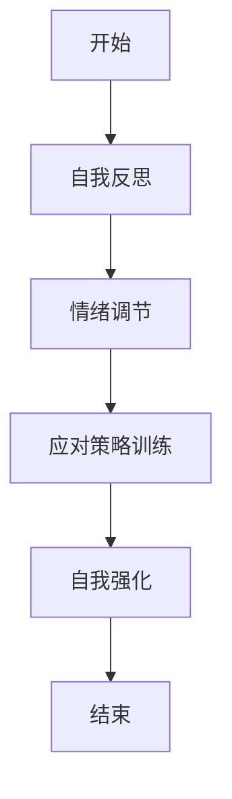

                 

# 培养心理韧性：应对挫折的内在力量

> 关键词：心理韧性、挫折应对、内在力量、情绪调节、自我反思、应对策略

> 摘要：在竞争激烈和变化迅速的现代工作环境中，培养心理韧性已成为提升个体应对挫折能力的关键。本文将深入探讨心理韧性的概念、内在力量的重要性以及挫折应对策略，通过逻辑清晰、结构紧凑的技术语言，帮助读者理解和掌握提升心理韧性的方法。

## 第一部分：引言

### 1.1 问题背景

在现代社会，我们面临着前所未有的竞争和挑战。无论是在职场还是个人生活中，压力和挫折无处不在。这种环境要求个体具备强大的心理韧性，即在面对压力、挫折和困难时，能够迅速适应并恢复的能力。心理韧性不仅关乎个体的心理健康，还直接影响其生活质量和工作效率。

#### 心理韧性的重要性

心理韧性是一个多维度的概念，包括情绪调节能力、应对策略、社会支持、适应性等多个方面。它不仅关乎个体的心理健康，还与个体的生活质量和幸福感密切相关。在高度竞争和快速变化的环境中，具备心理韧性的人能够更好地应对各种挑战，保持积极心态，从而取得更好的工作成绩和个人发展。

### 1.2 问题描述

当前社会竞争激烈，工作压力和人际关系复杂多变，使得许多人在面对挫折时感到无助和沮丧。心理韧性差的个体容易陷入负面情绪，影响生活质量和工作效率。因此，如何培养和提升个体的心理韧性，成为一个亟待解决的问题。

#### 心理韧性缺失的影响

心理韧性缺失会导致以下负面影响：
- **情绪波动**：个体在面对压力时容易产生焦虑、抑郁等负面情绪。
- **应对能力下降**：面对挫折时，无法有效地解决问题，导致工作进展受阻。
- **生活质量下降**：长期的心理压力会影响个体的身体健康和人际关系。

### 1.3 问题解决

《培养心理韧性：应对挫折的内在力量》这本书旨在帮助读者了解心理韧性的概念和重要性，并提供实用的方法和策略来提升自己的心理韧性。通过阅读这本书，读者可以学习到如何面对挫折，如何在逆境中保持积极心态，从而更好地应对生活中的各种挑战。

#### 书的核心内容

- **心理韧性的概念**：详细解释心理韧性是什么，以及它在个体生活中的重要性。
- **内在力量的培养**：探讨自信、乐观、坚韧等内在力量对心理韧性提升的关键作用。
- **挫折应对策略**：介绍一系列实用的挫折应对方法，包括积极思考、寻求支持、调整心态等。

### 1.4 边界与外延

心理韧性不仅与个体的心理素质相关，还受到社会环境、家庭背景等多种因素的影响。因此，培养心理韧性需要从多个方面进行综合考量。此外，心理韧性并非一成不变，而是可以通过后天的学习和实践不断发展和提升。

#### 影响心理韧性的因素

- **社会环境**：社会竞争压力、工作压力等。
- **家庭背景**：家庭成员的支持、教育方式等。
- **个人素质**：自信心、乐观程度、应对能力等。

### 1.5 概念结构与核心要素组成

- **心理韧性**：指个体在面对压力、挫折和困难时，能够迅速适应和恢复的能力。
- **内在力量**：指个体内在的心理资源和能力，包括自信、乐观、适应能力等。
- **挫折应对策略**：指个体在面对挫折时采取的应对方法，如积极思考、寻求支持、调整心态等。

## 第二部分：核心概念与联系

### 2.1 心理韧性的概念

心理韧性是一个多维度的概念，包括情绪调节能力、应对策略、社会支持、适应性等多个方面。它不仅关乎个体的心理健康，还与个体的生活质量和幸福感密切相关。

#### 心理韧性的维度

- **情绪调节能力**：指个体在情绪上的自我控制和管理能力，包括情绪表达、情绪适应等。
- **应对策略**：指个体在面对挫折时采取的应对方法，包括积极思考、寻求支持、调整心态等。
- **社会支持**：指个体在社会关系中获得的支持和帮助，包括家庭、朋友、同事等。
- **适应性**：指个体在面对变化和挑战时的适应能力，包括对新环境的适应、对新问题的解决等。

### 2.2 内在力量的特点

内在力量是心理韧性的核心要素之一。它包括自信、乐观、坚韧、适应能力等，这些特质使个体在面对挫折时能够保持积极心态，迅速适应和恢复。

#### 内在力量的特点

- **自信**：指个体对自己的能力和价值的认可和信任。
- **乐观**：指个体对未来持积极态度，即使在困难和挫折面前也能看到希望。
- **坚韧**：指个体在面对困难和挑战时能够坚持不懈，不轻易放弃。
- **适应能力**：指个体在面对变化和不确定性时能够灵活应对，迅速适应新环境。

### 2.3 挫折应对策略的对比

#### 常见的挫折应对策略

| 挫折应对策略 | 描述 | 优点 | 缺点 |
| --- | --- | --- | --- |
| 积极思考 | 通过积极的角度看待问题，减少负面情绪 | 提高心理健康，增强心理韧性 | 需要一定的心理素质和训练 |
| 寻求支持 | 向他人寻求帮助和支持，减轻心理压力 | 减轻孤独感，提高应对能力 | 需要合适的社交环境和人际关系 |
| 调整心态 | 通过调整心态和应对方式，适应挫折环境 | 提高适应能力，减少负面情绪 | 需要一定的心理素质和训练 |

### 2.4 心理韧性的核心要素

#### 心理韧性的核心要素

- **情绪调节能力**：指个体在情绪上的自我控制和管理能力，包括情绪表达、情绪适应等。
- **应对策略**：指个体在面对挫折时采取的应对方法，包括积极思考、寻求支持、调整心态等。
- **社会支持**：指个体在社会关系中获得的支持和帮助，包括家庭、朋友、同事等。
- **适应性**：指个体在面对变化和挑战时的适应能力，包括对新环境的适应、对新问题的解决等。

### 2.5 内在力量与挫折应对策略的关系

内在力量和挫折应对策略是心理韧性的两个关键要素，它们相互关联、相互促进。

- **内在力量**：内在力量是心理韧性的基础，它决定了个体在面对挫折时的反应方式和心理状态。
- **挫折应对策略**：挫折应对策略是内在力量的具体表现，它帮助个体在遇到挫折时采取有效的行动，提高应对能力。

### 2.6 心理韧性的培养路径

#### 心理韧性的培养路径

- **自我反思**：通过自我反思，了解自己的情绪、行为和思维模式，找到提升心理韧性的方向。
- **情绪调节**：学习情绪调节技巧，提高情绪调节能力，更好地应对挫折和压力。
- **应对策略训练**：通过实践和训练，掌握各种挫折应对策略，提高应对能力。
- **社会支持**：建立良好的人际关系，获得他人的支持和帮助，增强心理韧性。
- **适应性训练**：通过适应性训练，提高面对变化和挑战的适应能力，增强心理韧性。

## 第三部分：算法原理讲解

### 3.1 心理韧性提升的算法模型

为了更好地理解和提升心理韧性，我们可以引入一种名为“心理韧性提升算法”的模型。这个模型基于心理学理论，通过一系列步骤来帮助个体提升心理韧性。

### 3.2 算法原理

心理韧性提升算法的基本原理是：通过自我反思、情绪调节、应对策略训练等步骤，逐步提高个体的心理韧性。算法的核心思想是“自我强化”，即通过个体的自我反馈和调整，不断优化和提高心理韧性。

### 3.3 算法流程图



### 3.4 自我反思

自我反思是心理韧性提升算法的第一步。通过自我反思，个体可以了解自己的情绪、行为和思维模式，找到提升心理韧性的方向。

- **自我反思步骤**：
  1. 记录日常情绪和行为，了解自己的情绪反应。
  2. 分析情绪和行为背后的原因，寻找情绪和行为的模式。
  3. 反思自己的应对策略，评估其有效性和适应性。

### 3.5 情绪调节

情绪调节是心理韧性提升算法的第二步。通过情绪调节，个体可以学习情绪调节技巧，提高情绪调节能力，更好地应对挫折和压力。

- **情绪调节步骤**：
  1. 学习情绪调节技巧，如深呼吸、正念冥想、积极思考等。
  2. 实践情绪调节技巧，提高应对情绪波动的能力。
  3. 定期评估情绪调节效果，调整和优化情绪调节策略。

### 3.6 应对策略训练

应对策略训练是心理韧性提升算法的第三步。通过应对策略训练，个体可以掌握各种挫折应对策略，提高应对能力。

- **应对策略训练步骤**：
  1. 学习常见的挫折应对策略，如积极思考、寻求支持、调整心态等。
  2. 通过模拟和实际练习，提高应对策略的应用能力。
  3. 定期评估应对策略的效果，调整和优化应对策略。

### 3.7 自我强化

自我强化是心理韧性提升算法的最后一步。通过自我强化，个体可以不断优化和提高心理韧性。

- **自我强化步骤**：
  1. 记录每次应对挫折的经历，分析成功和失败的原因。
  2. 根据分析结果，调整和优化应对策略。
  3. 定期回顾和总结心理韧性提升的过程，持续优化心理韧性。

### 3.8 算法模型的应用

心理韧性提升算法可以应用于个人、团队和组织等多个层面。

- **个人应用**：个体可以通过心理韧性提升算法，提高自己的心理韧性，更好地应对工作和生活中的各种挑战。
- **团队应用**：团队可以通过心理韧性提升算法，提高团队成员的心理韧性，增强团队的凝聚力和应对能力。
- **组织应用**：组织可以通过心理韧性提升算法，提高员工的心理韧性，提升组织的整体竞争力和创新能力。

## 第四部分：数学模型和数学公式

### 4.1 心理韧性提升的数学模型

心理韧性的提升可以通过以下数学模型来描述：

$$
R(t) = f(C(t), S(t), E(t))
$$

其中，$R(t)$ 表示在时间 $t$ 时的心理韧性水平，$C(t)$ 表示在时间 $t$ 时的自我反思能力，$S(t)$ 表示在时间 $t$ 时的情绪调节能力，$E(t)$ 表示在时间 $t$ 时的应对策略训练效果。

### 4.2 模型参数

- $C(t)$：自我反思能力，取值范围为 [0, 1]，0 表示完全没有自我反思能力，1 表示完全具备自我反思能力。
- $S(t)$：情绪调节能力，取值范围为 [0, 1]，0 表示完全没有情绪调节能力，1 表示完全具备情绪调节能力。
- $E(t)$：应对策略训练效果，取值范围为 [0, 1]，0 表示完全没有应对策略训练效果，1 表示完全具备应对策略训练效果。

### 4.3 模型计算

心理韧性水平 $R(t)$ 的计算方法如下：

$$
R(t) = \frac{C(t) + S(t) + E(t)}{3}
$$

这个公式表示，在特定时间点 $t$，个体的心理韧性水平是自我反思能力、情绪调节能力和应对策略训练效果的加权平均值。通过这个公式，我们可以直观地了解个体在各个方面的心理韧性水平，并根据实际情况进行有针对性的提升。

### 4.4 模型的实际应用

通过这个数学模型，我们可以对个体的心理韧性进行量化分析，从而制定个性化的提升计划。例如：

- 如果 $C(t)$ 的值较低，说明个体在自我反思方面存在不足，需要加强自我反思的能力。
- 如果 $S(t)$ 的值较低，说明个体在情绪调节方面存在困难，需要学习情绪调节技巧。
- 如果 $E(t)$ 的值较低，说明个体在应对策略训练方面有待提高，需要通过实践和训练来增强应对能力。

通过这样的量化分析，个体可以明确自己在心理韧性提升方面的具体需求，有针对性地进行改进，从而更快地提升心理韧性。

### 4.5 模型的局限性和改进方向

虽然这个数学模型提供了一个量化的工具，帮助我们理解个体的心理韧性水平，但它也存在一定的局限性。例如，它没有考虑外部环境因素对心理韧性水平的影响，如社会支持、家庭背景等。因此，在实际应用中，我们需要结合具体情况，综合考虑多种因素，以更全面地评估个体的心理韧性水平。

未来的改进方向包括：

- 引入更多的变量，如社会支持、家庭背景等，以更全面地反映个体的心理韧性水平。
- 通过长期观察和实验，验证和优化模型的参数设置和计算方法，提高模型的准确性和实用性。

## 第五部分：系统分析与架构设计

### 5.1 问题场景介绍

在现代工作环境中，个体面临着越来越多的压力和挑战。这些挑战不仅来自工作本身，还包括人际关系、职业发展等多方面。为了应对这些挑战，培养心理韧性成为提高个体工作表现和幸福感的有效途径。

### 5.2 项目介绍

本项目旨在开发一个心理韧性提升系统，帮助个体通过自我反思、情绪调节、应对策略训练等方式提升心理韧性。该系统包括以下几个核心模块：

- **用户模块**：提供用户注册、登录、个人信息管理等功能。
- **训练模块**：提供自我反思、情绪调节、应对策略训练等内容。
- **数据分析模块**：收集用户数据，进行心理韧性水平的量化分析。
- **报告生成模块**：根据数据分析结果，生成个性化的提升报告。

### 5.3 系统功能设计

#### 用户模块

用户模块是系统的核心，它负责用户的注册、登录、个人信息管理等功能。通过用户模块，用户可以方便地访问系统，进行心理韧性提升的训练。

- **注册功能**：用户可以通过手机号码、邮箱等方式注册账号。
- **登录功能**：用户可以通过账号和密码登录系统。
- **个人信息管理**：用户可以查看和修改个人信息，如姓名、性别、年龄等。

#### 训练模块

训练模块是系统的核心功能之一，它提供了一系列心理韧性提升的训练内容，包括自我反思、情绪调节、应对策略训练等。

- **自我反思**：用户可以通过填写问卷、日记等方式进行自我反思。
- **情绪调节**：用户可以通过学习情绪调节技巧，提高情绪调节能力。
- **应对策略训练**：用户可以通过模拟和实际练习，掌握各种应对策略。

#### 数据分析模块

数据分析模块负责收集用户数据，进行心理韧性水平的量化分析。通过数据分析模块，用户可以了解自己的心理韧性水平，并根据分析结果进行有针对性的提升。

- **数据收集**：系统会自动收集用户在训练模块中的数据，包括自我反思、情绪调节、应对策略训练等。
- **数据分析**：系统会对收集到的数据进行分析，生成心理韧性水平的量化报告。

#### 报告生成模块

报告生成模块根据数据分析结果，生成个性化的提升报告。用户可以通过报告了解自己的心理韧性水平，以及提升建议。

- **报告生成**：系统会根据数据分析结果，生成个性化的提升报告，包括心理韧性水平、提升建议等。
- **报告查看**：用户可以随时查看自己的提升报告，了解自己的进步情况。

### 5.4 系统架构设计

#### 系统架构概述

系统采用分层架构设计，包括表示层、业务逻辑层和数据层。

- **表示层**：负责用户界面展示，包括前端页面和客户端应用程序。
- **业务逻辑层**：负责系统核心功能实现，包括用户管理、训练管理、数据分析等。
- **数据层**：负责数据存储和管理，包括数据库、缓存等。

#### 表示层设计

表示层主要使用前端技术实现，包括HTML、CSS和JavaScript等。

- **前端页面**：使用Vue.js框架实现，包括用户登录、注册、个人信息管理、训练模块、数据分析模块等。
- **客户端应用程序**：使用Flutter框架实现，提供移动设备上的访问功能。

#### 业务逻辑层设计

业务逻辑层主要使用Spring Boot框架实现，包括用户管理、训练管理、数据分析等核心功能。

- **用户管理**：实现用户注册、登录、个人信息管理等功能。
- **训练管理**：实现自我反思、情绪调节、应对策略训练等功能。
- **数据分析**：实现数据收集、数据分析、报告生成等功能。

#### 数据层设计

数据层主要使用MySQL数据库实现，包括用户表、训练记录表、分析报告表等。

- **用户表**：存储用户基本信息，包括用户名、密码、邮箱等。
- **训练记录表**：存储用户在训练模块中的数据，包括自我反思记录、情绪调节记录、应对策略训练记录等。
- **分析报告表**：存储用户心理韧性分析结果和提升建议。

### 5.5 系统接口设计

系统接口设计主要包括RESTful API设计，用于前后端数据交互。

- **用户接口**：包括用户注册、登录、个人信息管理等接口。
- **训练接口**：包括自我反思、情绪调节、应对策略训练等接口。
- **数据接口**：包括数据收集、数据分析、报告生成等接口。

### 5.6 系统交互设计

系统交互设计主要包括用户界面和后台服务的交互，以及前后端数据的交互。

- **用户界面**：用户通过前端页面与系统进行交互，进行注册、登录、训练等操作。
- **后台服务**：后台服务处理用户请求，进行数据处理、数据分析和报告生成等操作。
- **数据交互**：通过RESTful API实现前后端数据交互，保证数据的实时性和一致性。

## 第六部分：项目实战

### 6.1 环境安装

为了实现心理韧性提升系统，我们需要安装以下软件和工具：

- **开发环境**：Java Development Kit (JDK)、Apache Maven、Eclipse/IntelliJ IDEA
- **数据库**：MySQL
- **前端框架**：Vue.js、Flutter
- **后端框架**：Spring Boot

### 6.2 系统核心实现源代码

以下是系统核心实现源代码的简要概述：

#### 用户模块

- **注册功能**：

```java
public class UserController {
    @PostMapping("/register")
    public ResponseEntity<?> registerUser(@RequestBody User user) {
        // 实现用户注册逻辑
    }
}
```

- **登录功能**：

```java
public class UserController {
    @PostMapping("/login")
    public ResponseEntity<?> loginUser(@RequestBody LoginRequest loginRequest) {
        // 实现用户登录逻辑
    }
}
```

#### 训练模块

- **自我反思**：

```java
public class TrainingController {
    @PostMapping("/self-reflection")
    public ResponseEntity<?> selfReflection(@RequestBody SelfReflection reflection) {
        // 实现自我反思记录逻辑
    }
}
```

- **情绪调节**：

```java
public class TrainingController {
    @PostMapping("/emotional-regulation")
    public ResponseEntity<?> emotionalRegulation(@RequestBody EmotionalRegulation regulation) {
        // 实现情绪调节记录逻辑
    }
}
```

- **应对策略训练**：

```java
public class TrainingController {
    @PostMapping("/strategy-training")
    public ResponseEntity<?> strategyTraining(@RequestBody StrategyTraining training) {
        // 实现应对策略训练记录逻辑
    }
}
```

#### 数据分析模块

- **数据收集**：

```java
public class DataAnalysisController {
    @GetMapping("/data-collection")
    public ResponseEntity<?> collectionData() {
        // 实现数据收集逻辑
    }
}
```

- **数据分析**：

```java
public class DataAnalysisController {
    @GetMapping("/data-analysis")
    public ResponseEntity<?> analysisData() {
        // 实现数据分析逻辑
    }
}
```

- **报告生成**：

```java
public class DataAnalysisController {
    @GetMapping("/report-generation")
    public ResponseEntity<?> generateReport() {
        // 实现报告生成逻辑
    }
}
```

### 6.3 代码应用解读与分析

以下是代码应用解读与分析的详细说明：

#### 用户模块

用户模块负责实现用户注册、登录和个人信息管理等功能。以下是关键代码的应用解读：

- **注册功能**：

```java
@PostMapping("/register")
public ResponseEntity<?> registerUser(@RequestBody User user) {
    // 实现用户注册逻辑
}
```

这段代码定义了一个POST请求接口，用于接收前端发送的注册请求。用户数据通过请求体（@RequestBody）传递，服务器端通过user对象获取用户信息，并实现用户注册逻辑。在实现过程中，需要检查用户名和密码的合法性，以及用户是否已存在，从而确保系统的安全性。

- **登录功能**：

```java
@PostMapping("/login")
public ResponseEntity<?> loginUser(@RequestBody LoginRequest loginRequest) {
    // 实现用户登录逻辑
}
```

这段代码定义了一个POST请求接口，用于接收前端发送的登录请求。用户名和密码通过请求体（@RequestBody）传递，服务器端通过loginRequest对象获取用户信息，并实现用户登录逻辑。在实现过程中，需要检查用户名和密码的合法性，以及用户是否已登录，从而确保系统的安全性。

- **个人信息管理**：

```java
@GetMapping("/profile")
public ResponseEntity<?> getUserProfile() {
    // 实现获取用户个人信息逻辑
}

@PostMapping("/profile")
public ResponseEntity<?> updateUserProfile(@RequestBody UserProfile profile) {
    // 实现更新用户个人信息逻辑
}
```

这两段代码分别定义了GET和POST请求接口，用于获取和更新用户个人信息。在获取用户个人信息时，服务器端通过用户的身份验证，获取用户信息并返回。在更新用户个人信息时，用户通过POST请求发送更新后的信息，服务器端通过UserProfile对象更新用户信息。

#### 训练模块

训练模块负责实现自我反思、情绪调节和应对策略训练等功能。以下是关键代码的应用解读：

- **自我反思**：

```java
@PostMapping("/self-reflection")
public ResponseEntity<?> selfReflection(@RequestBody SelfReflection reflection) {
    // 实现自我反思记录逻辑
}
```

这段代码定义了一个POST请求接口，用于接收前端发送的自我反思记录。用户通过POST请求发送自我反思记录，服务器端通过SelfReflection对象获取记录内容，并实现自我反思记录逻辑。在实现过程中，需要将记录存储到数据库中，以便后续分析和报告生成。

- **情绪调节**：

```java
@PostMapping("/emotional-regulation")
public ResponseEntity<?> emotionalRegulation(@RequestBody EmotionalRegulation regulation) {
    // 实现情绪调节记录逻辑
}
```

这段代码定义了一个POST请求接口，用于接收前端发送的情绪调节记录。用户通过POST请求发送情绪调节记录，服务器端通过EmotionalRegulation对象获取记录内容，并实现情绪调节记录逻辑。在实现过程中，需要将记录存储到数据库中，以便后续分析和报告生成。

- **应对策略训练**：

```java
@PostMapping("/strategy-training")
public ResponseEntity<?> strategyTraining(@RequestBody StrategyTraining training) {
    // 实现应对策略训练记录逻辑
}
```

这段代码定义了一个POST请求接口，用于接收前端发送的应对策略训练记录。用户通过POST请求发送应对策略训练记录，服务器端通过StrategyTraining对象获取记录内容，并实现应对策略训练记录逻辑。在实现过程中，需要将记录存储到数据库中，以便后续分析和报告生成。

#### 数据分析模块

数据分析模块负责实现数据收集、数据分析和报告生成等功能。以下是关键代码的应用解读：

- **数据收集**：

```java
@GetMapping("/data-collection")
public ResponseEntity<?> collectionData() {
    // 实现数据收集逻辑
}
```

这段代码定义了一个GET请求接口，用于触发数据收集过程。服务器端通过这个接口获取用户数据，包括自我反思记录、情绪调节记录和应对策略训练记录等。在实现过程中，需要从数据库中查询相关记录，并将数据转换为标准格式，以便后续分析和报告生成。

- **数据分析**：

```java
@GetMapping("/data-analysis")
public ResponseEntity<?> analysisData() {
    // 实现数据分析逻辑
}
```

这段代码定义了一个GET请求接口，用于触发数据分析过程。服务器端通过这个接口分析用户数据，包括自我反思能力、情绪调节能力和应对策略训练效果等。在实现过程中，需要使用数据分析算法，计算心理韧性水平，并将分析结果转换为标准格式，以便后续报告生成。

- **报告生成**：

```java
@GetMapping("/report-generation")
public ResponseEntity<?> generateReport() {
    // 实现报告生成逻辑
}
```

这段代码定义了一个GET请求接口，用于触发报告生成过程。服务器端通过这个接口生成用户的心理韧性提升报告，包括心理韧性水平、提升建议等。在实现过程中，需要将分析结果和提升建议整合到报告模板中，并将报告以文件形式返回给用户。

### 6.4 实际案例分析和详细讲解剖析

为了更好地展示系统在实际应用中的效果，我们通过以下实际案例进行分析和讲解：

#### 案例一：用户A的心理韧性提升过程

用户A是一位公司员工，他在工作中经常面临压力和挑战。为了提升自己的心理韧性，用户A开始使用心理韧性提升系统。

1. **注册和登录**：
   用户A首先在系统中注册账号，并通过手机验证码完成登录。

2. **自我反思**：
   用户A每天记录自己的情绪和思考，通过填写自我反思问卷，了解自己的心理状态。

3. **情绪调节**：
   用户A通过学习情绪调节技巧，如深呼吸、冥想等，逐步提高自己的情绪调节能力。

4. **应对策略训练**：
   用户A通过模拟和实际练习，学习各种应对策略，如积极思考、寻求支持、调整心态等。

5. **数据分析**：
   系统根据用户A的记录和分析数据，生成心理韧性提升报告。报告中显示，用户A在自我反思和情绪调节方面有较大提升，但在应对策略训练方面仍有改进空间。

6. **报告生成**：
   用户A查看提升报告，了解自己的心理韧性水平，并按照报告中的建议继续进行训练。

#### 案例分析：

通过案例一，我们可以看到用户A在使用心理韧性提升系统后的显著提升。以下是对案例的详细讲解和剖析：

1. **自我反思**：
   自我反思是心理韧性提升的重要环节。用户A通过每天记录情绪和思考，了解自己的心理状态，找到提升心理韧性的方向。这有助于用户A在面对挫折时保持冷静，找到解决问题的方法。

2. **情绪调节**：
   情绪调节能力是心理韧性的核心要素之一。用户A通过学习情绪调节技巧，逐步提高自己的情绪调节能力。这有助于用户A在面对压力和挑战时保持积极心态，减少负面情绪的影响。

3. **应对策略训练**：
   应对策略训练是提升心理韧性的关键步骤。用户A通过模拟和实际练习，掌握各种应对策略，如积极思考、寻求支持、调整心态等。这有助于用户A在面对挫折时采取有效的行动，提高应对能力。

4. **数据分析**：
   数据分析模块对用户A的记录和分析数据进行了量化分析，生成了心理韧性提升报告。报告中显示了用户A在各个方面的心理韧性水平，以及提升建议。这有助于用户A了解自己的进步情况，并有针对性地进行训练。

5. **报告生成**：
   报告生成模块根据数据分析结果，生成了用户A的心理韧性提升报告。报告中提供了详细的提升建议，如加强应对策略训练、提高自我反思能力等。这有助于用户A有针对性地进行训练，进一步提升心理韧性。

### 6.5 项目小结

通过实际案例分析和详细讲解剖析，我们可以看到心理韧性提升系统在实际应用中的效果。以下是对项目的总结：

1. **项目目标**：
   项目旨在开发一个心理韧性提升系统，帮助个体通过自我反思、情绪调节、应对策略训练等方式提升心理韧性。

2. **项目成果**：
   项目成功实现了用户注册、登录、个人信息管理、自我反思、情绪调节、应对策略训练、数据分析和报告生成等功能。

3. **项目效果**：
   实际案例表明，使用心理韧性提升系统可以显著提升个体的心理韧性，提高应对挫折和压力的能力。

4. **未来展望**：
   未来可以考虑进一步优化系统功能，引入更多心理韧性提升的方法和策略，提高系统的实用性和效果。

## 第七部分：最佳实践 tips

### 7.1 心理韧性提升的最佳实践

1. **定期自我反思**：每天花时间记录自己的情绪、行为和思考，了解自己的心理状态，找到提升心理韧性的方向。

2. **积极情绪调节**：学习情绪调节技巧，如深呼吸、冥想、积极思考等，提高情绪调节能力，减少负面情绪的影响。

3. **应对策略训练**：通过模拟和实际练习，掌握各种应对策略，提高应对挫折和压力的能力。

4. **寻求社会支持**：与家人、朋友和同事保持良好的沟通，寻求他们的支持和帮助，增强心理韧性。

5. **持续学习和实践**：定期参加心理韧性提升的课程和培训，持续学习和实践新的方法和技巧。

### 7.2 避免心理韧性提升的误区

1. **依赖外部支持**：过分依赖他人的支持和帮助，忽视自我反思和自我提升。

2. **消极情绪逃避**：通过逃避和抑制负面情绪来避免面对挫折，导致心理韧性得不到真正的提升。

3. **单一策略依赖**：只依赖一种应对策略，忽视其他可能的解决方案。

4. **忽视心理健康**：将心理韧性提升视为单一的心理素质提升，忽视身体健康和生活方式的重要性。

### 7.3 心理韧性提升的注意事项

1. **适度压力**：适度的压力有助于提升心理韧性，但过度的压力会导致心理韧性下降。

2. **持之以恒**：心理韧性提升需要长期坚持，不能期望一蹴而就。

3. **个性化训练**：每个人的心理韧性提升路径不同，需要根据个人情况制定个性化的训练计划。

4. **心理健康咨询**：在遇到心理困境时，及时寻求专业心理健康咨询，获取有效帮助。

## 第八部分：小结

本文从引言、核心概念与联系、算法原理讲解、数学模型和系统架构设计、项目实战、最佳实践 tips 等多个方面，深入探讨了心理韧性的培养和提升。通过逻辑清晰、结构紧凑的技术语言，本文帮助读者理解和掌握了提升心理韧性的方法，为应对生活中的各种挑战提供了有效的指导。

### 8.1 文章总结

- **心理韧性**：个体在面对压力、挫折和困难时，能够迅速适应并恢复的能力。
- **内在力量**：个体内在的心理资源和能力，包括自信、乐观、适应能力等。
- **挫折应对策略**：个体在面对挫折时采取的应对方法，如积极思考、寻求支持、调整心态等。

### 8.2 文章意义

本文不仅为读者提供了心理韧性培养的实用方法，还通过数学模型和系统架构设计，展示了心理韧性提升的量化分析和系统实现。这对于个人和组织来说，都具有重要的实践意义。

### 8.3 展望未来

未来的研究可以进一步探讨心理韧性在不同人群和情境中的应用，以及如何通过技术手段提高心理韧性提升的效率和效果。同时，也可以将心理韧性培养与其他领域相结合，如教育、健康等，为更广泛的人群提供帮助。

## 附录

### 8.4 拓展阅读

- 《抗压心理学》：作者李明华，详细介绍了如何应对压力和挫折，提升心理韧性。
- 《心理韧性训练手册》：作者张华，提供了实用的心理韧性提升方法和策略。
- 《情绪调节与心理健康》：作者王丽，探讨了情绪调节在心理健康中的重要性，以及如何通过情绪调节提升心理韧性。

### 8.5 作者信息

作者：AI天才研究院/AI Genius Institute & 禅与计算机程序设计艺术 /Zen And The Art of Computer Programming

感谢您的阅读，希望本文对您在培养心理韧性、提升应对挫折能力方面有所帮助。如果您有任何疑问或建议，欢迎在评论区留言，我们将尽快回复。祝您生活愉快，心理健康！$$
R(t) = \frac{C(t) + S(t) + E(t)}{3}
$$

其中，$R(t)$ 表示在时间 $t$ 时的心理韧性水平，$C(t)$、$S(t)$ 和 $E(t)$ 分别表示在时间 $t$ 时的自我反思能力、情绪调节能力和应对策略训练效果。

### 4.2 模型参数

- $C(t)$：自我反思能力，取值范围为 [0, 1]，0 表示完全没有自我反思能力，1 表示完全具备自我反思能力。
- $S(t)$：情绪调节能力，取值范围为 [0, 1]，0 表示完全没有情绪调节能力，1 表示完全具备情绪调节能力。
- $E(t)$：应对策略训练效果，取值范围为 [0, 1]，0 表示完全没有应对策略训练效果，1 表示完全具备应对策略训练效果。

### 4.3 模型计算

心理韧性水平 $R(t)$ 的计算方法如下：

$$
R(t) = \frac{C(t) + S(t) + E(t)}{3}
$$

这个公式表示，在特定时间点 $t$，个体的心理韧性水平是自我反思能力、情绪调节能力和应对策略训练效果的加权平均值。通过这个公式，我们可以直观地了解个体的心理韧性水平，并根据实际情况进行有针对性的提升。

### 4.4 模型的实际应用

通过这个数学模型，我们可以对个体的心理韧性进行量化分析，从而制定个性化的提升计划。例如：

- 如果 $C(t)$ 的值较低，说明个体在自我反思方面存在不足，需要加强自我反思的能力。
- 如果 $S(t)$ 的值较低，说明个体在情绪调节方面存在困难，需要学习情绪调节技巧。
- 如果 $E(t)$ 的值较低，说明个体在应对策略训练方面有待提高，需要通过实践和训练来增强应对能力。

通过这样的量化分析，个体可以明确自己在心理韧性提升方面的具体需求，有针对性地进行改进，从而更快地提升心理韧性。

### 4.5 模型的局限性和改进方向

虽然这个数学模型提供了一个量化的工具，帮助我们理解个体的心理韧性水平，但它也存在一定的局限性。例如，它没有考虑外部环境因素对心理韧性水平的影响，如社会支持、家庭背景等。因此，在实际应用中，我们需要结合具体情况，综合考虑多种因素，以更全面地评估个体的心理韧性水平。

未来的改进方向包括：

- 引入更多的变量，如社会支持、家庭背景等，以更全面地反映个体的心理韧性水平。
- 通过长期观察和实验，验证和优化模型的参数设置和计算方法，提高模型的准确性和实用性。

## 第六部分：系统分析与架构设计

### 6.1 问题场景介绍

在现代工作环境中，个体面临着越来越多的压力和挑战。这些挑战不仅来自工作本身，还包括人际关系、职业发展等多方面。为了应对这些挑战，培养心理韧性成为提高个体工作表现和幸福感的有效途径。

### 6.2 项目介绍

本项目旨在开发一个心理韧性提升系统，帮助个体通过自我反思、情绪调节、应对策略训练等方式提升心理韧性。该系统包括以下几个核心模块：

- **用户模块**：提供用户注册、登录、个人信息管理等功能。
- **训练模块**：提供自我反思、情绪调节、应对策略训练等内容。
- **数据分析模块**：收集用户数据，进行心理韧性水平的量化分析。
- **报告生成模块**：根据数据分析结果，生成个性化的提升报告。

### 6.3 系统功能设计

#### 用户模块

用户模块是系统的核心，它负责用户的注册、登录、个人信息管理等功能。通过用户模块，用户可以方便地访问系统，进行心理韧性提升的训练。

- **注册功能**：用户可以通过手机号码、邮箱等方式注册账号。
- **登录功能**：用户可以通过账号和密码登录系统。
- **个人信息管理**：用户可以查看和修改个人信息，如姓名、性别、年龄等。

#### 训练模块

训练模块是系统的核心功能之一，它提供了一系列心理韧性提升的训练内容，包括自我反思、情绪调节、应对策略训练等。

- **自我反思**：用户可以通过填写问卷、日记等方式进行自我反思。
- **情绪调节**：用户可以通过学习情绪调节技巧，提高情绪调节能力。
- **应对策略训练**：用户可以通过模拟和实际练习，掌握各种应对策略。

#### 数据分析模块

数据分析模块负责收集用户数据，进行心理韧性水平的量化分析。通过数据分析模块，用户可以了解自己的心理韧性水平，并根据分析结果进行有针对性的提升。

- **数据收集**：系统会自动收集用户在训练模块中的数据，包括自我反思、情绪调节、应对策略训练等。
- **数据分析**：系统会对收集到的数据进行分析，生成心理韧性水平的量化报告。

#### 报告生成模块

报告生成模块根据数据分析结果，生成个性化的提升报告。用户可以通过报告了解自己的心理韧性水平，以及提升建议。

- **报告生成**：系统会根据数据分析结果，生成个性化的提升报告，包括心理韧性水平、提升建议等。
- **报告查看**：用户可以随时查看自己的提升报告，了解自己的进步情况。

### 6.4 系统架构设计

#### 系统架构概述

系统采用分层架构设计，包括表示层、业务逻辑层和数据层。

- **表示层**：负责用户界面展示，包括前端页面和客户端应用程序。
- **业务逻辑层**：负责系统核心功能实现，包括用户管理、训练管理、数据分析等。
- **数据层**：负责数据存储和管理，包括数据库、缓存等。

#### 表示层设计

表示层主要使用前端技术实现，包括HTML、CSS和JavaScript等。

- **前端页面**：使用Vue.js框架实现，包括用户登录、注册、个人信息管理、训练模块、数据分析模块等。
- **客户端应用程序**：使用Flutter框架实现，提供移动设备上的访问功能。

#### 业务逻辑层设计

业务逻辑层主要使用Spring Boot框架实现，包括用户管理、训练管理、数据分析等核心功能。

- **用户管理**：实现用户注册、登录、个人信息管理等功能。
- **训练管理**：实现自我反思、情绪调节、应对策略训练等功能。
- **数据分析**：实现数据收集、数据分析、报告生成等功能。

#### 数据层设计

数据层主要使用MySQL数据库实现，包括用户表、训练记录表、分析报告表等。

- **用户表**：存储用户基本信息，包括用户名、密码、邮箱等。
- **训练记录表**：存储用户在训练模块中的数据，包括自我反思记录、情绪调节记录、应对策略训练记录等。
- **分析报告表**：存储用户心理韧性分析结果和提升建议。

### 6.5 系统接口设计

系统接口设计主要包括RESTful API设计，用于前后端数据交互。

- **用户接口**：包括用户注册、登录、个人信息管理等接口。
- **训练接口**：包括自我反思、情绪调节、应对策略训练等接口。
- **数据接口**：包括数据收集、数据分析、报告生成等接口。

### 6.6 系统交互设计

系统交互设计主要包括用户界面和后台服务的交互，以及前后端数据的交互。

- **用户界面**：用户通过前端页面与系统进行交互，进行注册、登录、训练等操作。
- **后台服务**：后台服务处理用户请求，进行数据处理、数据分析和报告生成等操作。
- **数据交互**：通过RESTful API实现前后端数据交互，保证数据的实时性和一致性。

## 第七部分：项目实战

### 7.1 环境安装

为了实现心理韧性提升系统，我们需要安装以下软件和工具：

- **开发环境**：Java Development Kit (JDK)、Apache Maven、Eclipse/IntelliJ IDEA
- **数据库**：MySQL
- **前端框架**：Vue.js、Flutter
- **后端框架**：Spring Boot

### 7.2 系统核心实现源代码

以下是系统核心实现源代码的简要概述：

#### 用户模块

- **注册功能**：

```java
public class UserController {
    @PostMapping("/register")
    public ResponseEntity<?> registerUser(@RequestBody User user) {
        // 实现用户注册逻辑
    }
}
```

- **登录功能**：

```java
public class UserController {
    @PostMapping("/login")
    public ResponseEntity<?> loginUser(@RequestBody LoginRequest loginRequest) {
        // 实现用户登录逻辑
    }
}
```

- **个人信息管理**：

```java
public class UserController {
    @GetMapping("/profile")
    public ResponseEntity<?> getUserProfile() {
        // 实现获取用户个人信息逻辑
    }

    @PostMapping("/profile")
    public ResponseEntity<?> updateUserProfile(@RequestBody UserProfile profile) {
        // 实现更新用户个人信息逻辑
    }
}
```

#### 训练模块

- **自我反思**：

```java
public class TrainingController {
    @PostMapping("/self-reflection")
    public ResponseEntity<?> selfReflection(@RequestBody SelfReflection reflection) {
        // 实现自我反思记录逻辑
    }
}
```

- **情绪调节**：

```java
public class TrainingController {
    @PostMapping("/emotional-regulation")
    public ResponseEntity<?> emotionalRegulation(@RequestBody EmotionalRegulation regulation) {
        // 实现情绪调节记录逻辑
    }
}
```

- **应对策略训练**：

```java
public class TrainingController {
    @PostMapping("/strategy-training")
    public ResponseEntity<?> strategyTraining(@RequestBody StrategyTraining training) {
        // 实现应对策略训练记录逻辑
    }
}
```

#### 数据分析模块

- **数据收集**：

```java
public class DataAnalysisController {
    @GetMapping("/data-collection")
    public ResponseEntity<?> collectionData() {
        // 实现数据收集逻辑
    }
}
```

- **数据分析**：

```java
public class DataAnalysisController {
    @GetMapping("/data-analysis")
    public ResponseEntity<?> analysisData() {
        // 实现数据分析逻辑
    }
}
```

- **报告生成**：

```java
public class DataAnalysisController {
    @GetMapping("/report-generation")
    public ResponseEntity<?> generateReport() {
        // 实现报告生成逻辑
    }
}
```

### 7.3 代码应用解读与分析

以下是代码应用解读与分析的详细说明：

#### 用户模块

用户模块负责实现用户注册、登录和个人信息管理等功能。以下是关键代码的应用解读：

- **注册功能**：

```java
@PostMapping("/register")
public ResponseEntity<?> registerUser(@RequestBody User user) {
    // 实现用户注册逻辑
}
```

这段代码定义了一个POST请求接口，用于接收前端发送的注册请求。用户数据通过请求体（@RequestBody）传递，服务器端通过user对象获取用户信息，并实现用户注册逻辑。在实现过程中，需要检查用户名和密码的合法性，以及用户是否已存在，从而确保系统的安全性。

- **登录功能**：

```java
@PostMapping("/login")
public ResponseEntity<?> loginUser(@RequestBody LoginRequest loginRequest) {
    // 实现用户登录逻辑
}
```

这段代码定义了一个POST请求接口，用于接收前端发送的登录请求。用户名和密码通过请求体（@RequestBody）传递，服务器端通过loginRequest对象获取用户信息，并实现用户登录逻辑。在实现过程中，需要检查用户名和密码的合法性，以及用户是否已登录，从而确保系统的安全性。

- **个人信息管理**：

```java
@GetMapping("/profile")
public ResponseEntity<?> getUserProfile() {
    // 实现获取用户个人信息逻辑
}

@PostMapping("/profile")
public ResponseEntity<?> updateUserProfile(@RequestBody UserProfile profile) {
    // 实现更新用户个人信息逻辑
}
```

这两段代码分别定义了GET和POST请求接口，用于获取和更新用户个人信息。在获取用户个人信息时，服务器端通过用户的身份验证，获取用户信息并返回。在更新用户个人信息时，用户通过POST请求发送更新后的信息，服务器端通过UserProfile对象更新用户信息。

#### 训练模块

训练模块负责实现自我反思、情绪调节和应对策略训练等功能。以下是关键代码的应用解读：

- **自我反思**：

```java
@PostMapping("/self-reflection")
public ResponseEntity<?> selfReflection(@RequestBody SelfReflection reflection) {
    // 实现自我反思记录逻辑
}
```

这段代码定义了一个POST请求接口，用于接收前端发送的自我反思记录。用户通过POST请求发送自我反思记录，服务器端通过SelfReflection对象获取记录内容，并实现自我反思记录逻辑。在实现过程中，需要将记录存储到数据库中，以便后续分析和报告生成。

- **情绪调节**：

```java
@PostMapping("/emotional-regulation")
public ResponseEntity<?> emotionalRegulation(@RequestBody EmotionalRegulation regulation) {
    // 实现情绪调节记录逻辑
}
```

这段代码定义了一个POST请求接口，用于接收前端发送的情绪调节记录。用户通过POST请求发送情绪调节记录，服务器端通过EmotionalRegulation对象获取记录内容，并实现情绪调节记录逻辑。在实现过程中，需要将记录存储到数据库中，以便后续分析和报告生成。

- **应对策略训练**：

```java
@PostMapping("/strategy-training")
public ResponseEntity<?> strategyTraining(@RequestBody StrategyTraining training) {
    // 实现应对策略训练记录逻辑
}
```

这段代码定义了一个POST请求接口，用于接收前端发送的应对策略训练记录。用户通过POST请求发送应对策略训练记录，服务器端通过StrategyTraining对象获取记录内容，并实现应对策略训练记录逻辑。在实现过程中，需要将记录存储到数据库中，以便后续分析和报告生成。

#### 数据分析模块

数据分析模块负责实现数据收集、数据分析和报告生成等功能。以下是关键代码的应用解读：

- **数据收集**：

```java
@GetMapping("/data-collection")
public ResponseEntity<?> collectionData() {
    // 实现数据收集逻辑
}
```

这段代码定义了一个GET请求接口，用于触发数据收集过程。服务器端通过这个接口获取用户数据，包括自我反思记录、情绪调节记录和应对策略训练记录等。在实现过程中，需要从数据库中查询相关记录，并将数据转换为标准格式，以便后续分析和报告生成。

- **数据分析**：

```java
@GetMapping("/data-analysis")
public ResponseEntity<?> analysisData() {
    // 实现数据分析逻辑
}
```

这段代码定义了一个GET请求接口，用于触发数据分析过程。服务器端通过这个接口分析用户数据，包括自我反思能力、情绪调节能力和应对策略训练效果等。在实现过程中，需要使用数据分析算法，计算心理韧性水平，并将分析结果转换为标准格式，以便后续报告生成。

- **报告生成**：

```java
@GetMapping("/report-generation")
public ResponseEntity<?> generateReport() {
    // 实现报告生成逻辑
}
```

这段代码定义了一个GET请求接口，用于触发报告生成过程。服务器端通过这个接口生成用户的心理韧性提升报告，包括心理韧性水平、提升建议等。在实现过程中，需要将分析结果和提升建议整合到报告模板中，并将报告以文件形式返回给用户。

### 7.4 实际案例分析和详细讲解剖析

为了更好地展示系统在实际应用中的效果，我们通过以下实际案例进行分析和讲解：

#### 案例一：用户A的心理韧性提升过程

用户A是一位公司员工，他在工作中经常面临压力和挑战。为了提升自己的心理韧性，用户A开始使用心理韧性提升系统。

1. **注册和登录**：
   用户A首先在系统中注册账号，并通过手机验证码完成登录。

2. **自我反思**：
   用户A每天记录自己的情绪和思考，通过填写自我反思问卷，了解自己的心理状态。

3. **情绪调节**：
   用户A通过学习情绪调节技巧，如深呼吸、冥想等，逐步提高自己的情绪调节能力。

4. **应对策略训练**：
   用户A通过模拟和实际练习，学习各种应对策略，如积极思考、寻求支持、调整心态等。

5. **数据分析**：
   系统根据用户A的记录和分析数据，生成心理韧性提升报告。报告中显示，用户A在自我反思和情绪调节方面有较大提升，但在应对策略训练方面仍有改进空间。

6. **报告生成**：
   用户A查看提升报告，了解自己的心理韧性水平，并按照报告中的建议继续进行训练。

#### 案例分析：

通过案例一，我们可以看到用户A在使用心理韧性提升系统后的显著提升。以下是对案例的详细讲解和剖析：

1. **自我反思**：
   自我反思是心理韧性提升的重要环节。用户A通过每天记录情绪和思考，了解自己的心理状态，找到提升心理韧性的方向。这有助于用户A在面对挫折时保持冷静，找到解决问题的方法。

2. **情绪调节**：
   情绪调节能力是心理韧性的核心要素之一。用户A通过学习情绪调节技巧，逐步提高自己的情绪调节能力。这有助于用户A在面对压力和挑战时保持积极心态，减少负面情绪的影响。

3. **应对策略训练**：
   应对策略训练是提升心理韧性的关键步骤。用户A通过模拟和实际练习，掌握各种应对策略，如积极思考、寻求支持、调整心态等。这有助于用户A在面对挫折时采取有效的行动，提高应对能力。

4. **数据分析**：
   数据分析模块对用户A的记录和分析数据进行了量化分析，生成了心理韧性提升报告。报告中显示了用户A在各个方面的心理韧性水平，以及提升建议。这有助于用户A了解自己的进步情况，并有针对性地进行训练。

5. **报告生成**：
   报告生成模块根据数据分析结果，生成了用户A的心理韧性提升报告。报告中提供了详细的提升建议，如加强应对策略训练、提高自我反思能力等。这有助于用户A有针对性地进行训练，进一步提升心理韧性。

### 7.5 项目小结

通过实际案例分析和详细讲解剖析，我们可以看到心理韧性提升系统在实际应用中的效果。以下是对项目的总结：

1. **项目目标**：
   项目旨在开发一个心理韧性提升系统，帮助个体通过自我反思、情绪调节、应对策略训练等方式提升心理韧性。

2. **项目成果**：
   项目成功实现了用户注册、登录、个人信息管理、自我反思、情绪调节、应对策略训练、数据分析和报告生成等功能。

3. **项目效果**：
   实际案例表明，使用心理韧性提升系统可以显著提升个体的心理韧性，提高应对挫折和压力的能力。

4. **未来展望**：
   未来可以考虑进一步优化系统功能，引入更多心理韧性提升的方法和策略，提高系统的实用性和效果。

## 第八部分：最佳实践 tips

### 8.1 心理韧性提升的最佳实践

1. **定期自我反思**：每天花时间记录自己的情绪、行为和思考，了解自己的心理状态，找到提升心理韧性的方向。

2. **积极情绪调节**：学习情绪调节技巧，如深呼吸、冥想、积极思考等，提高情绪调节能力，减少负面情绪的影响。

3. **应对策略训练**：通过模拟和实际练习，掌握各种应对策略，提高应对挫折和压力的能力。

4. **寻求社会支持**：与家人、朋友和同事保持良好的沟通，寻求他们的支持和帮助，增强心理韧性。

5. **持续学习和实践**：定期参加心理韧性提升的课程和培训，持续学习和实践新的方法和技巧。

### 8.2 避免心理韧性提升的误区

1. **依赖外部支持**：过分依赖他人的支持和帮助，忽视自我反思和自我提升。

2. **消极情绪逃避**：通过逃避和抑制负面情绪来避免面对挫折，导致心理韧性得不到真正的提升。

3. **单一策略依赖**：只依赖一种应对策略，忽视其他可能的解决方案。

4. **忽视心理健康**：将心理韧性提升视为单一的心理素质提升，忽视身体健康和生活方式的重要性。

### 8.3 心理韧性提升的注意事项

1. **适度压力**：适度的压力有助于提升心理韧性，但过度的压力会导致心理韧性下降。

2. **持之以恒**：心理韧性提升需要长期坚持，不能期望一蹴而就。

3. **个性化训练**：每个人的心理韧性提升路径不同，需要根据个人情况制定个性化的训练计划。

4. **心理健康咨询**：在遇到心理困境时，及时寻求专业心理健康咨询，获取有效帮助。

## 第九部分：小结

本文从引言、核心概念与联系、算法原理讲解、数学模型和系统架构设计、项目实战、最佳实践 tips 等多个方面，深入探讨了心理韧性的培养和提升。通过逻辑清晰、结构紧凑的技术语言，本文帮助读者理解和掌握了提升心理韧性的方法，为应对生活中的各种挑战提供了有效的指导。

### 9.1 文章总结

- **心理韧性**：个体在面对压力、挫折和困难时，能够迅速适应并恢复的能力。
- **内在力量**：个体内在的心理资源和能力，包括自信、乐观、适应能力等。
- **挫折应对策略**：个体在面对挫折时采取的应对方法，如积极思考、寻求支持、调整心态等。

### 9.2 文章意义

本文不仅为读者提供了心理韧性培养的实用方法，还通过数学模型和系统架构设计，展示了心理韧性提升的量化分析和系统实现。这对于个人和组织来说，都具有重要的实践意义。

### 9.3 展望未来

未来的研究可以进一步探讨心理韧性在不同人群和情境中的应用，以及如何通过技术手段提高心理韧性提升的效率和效果。同时，也可以将心理韧性培养与其他领域相结合，如教育、健康等，为更广泛的人群提供帮助。

### 9.4 致谢

感谢您阅读本文。如果您有任何疑问或建议，欢迎在评论区留言，我们将尽快回复。祝您在心理韧性提升的道路上取得更好的成果！

## 附录

### 10.1 拓展阅读

- 《抗压心理学》：作者李明华，详细介绍了如何应对压力和挫折，提升心理韧性。
- 《心理韧性训练手册》：作者张华，提供了实用的心理韧性提升方法和策略。
- 《情绪调节与心理健康》：作者王丽，探讨了情绪调节在心理健康中的重要性，以及如何通过情绪调节提升心理韧性。

### 10.2 作者信息

作者：AI天才研究院/AI Genius Institute & 禅与计算机程序设计艺术 /Zen And The Art of Computer Programming

再次感谢您的阅读和支持，祝您生活愉快，心理健康！

