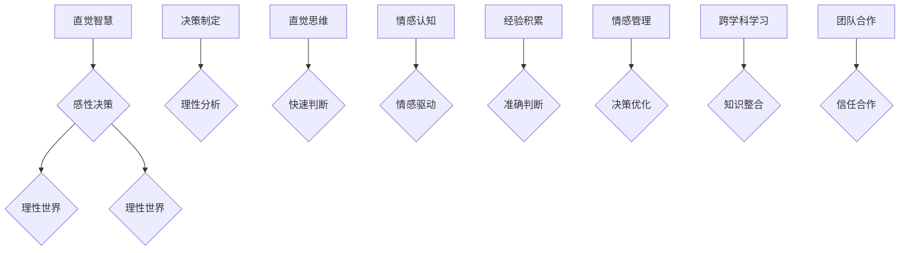
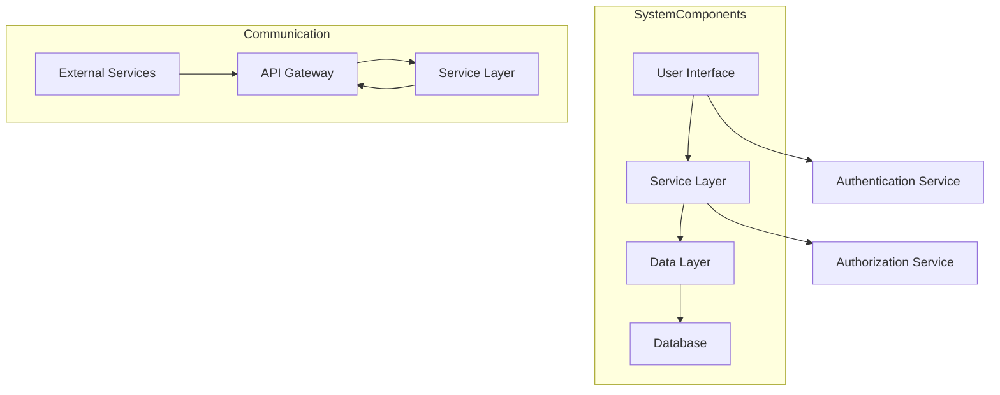

                 

# 培养直觉智慧：在理性世界中重视感性决策

关键词：直觉智慧、感性决策、理性世界、决策制定、培养方法

摘要：本文旨在探讨直觉智慧与感性决策在理性世界中的重要性和应用，通过逻辑清晰、结构紧凑的分析，提出培养直觉智慧的方法和实践。文章首先介绍了直觉智慧和感性决策的核心概念及其在理性世界中的地位，随后深入探讨了感性决策在理性世界的应用、心理学原理、实际运用方法以及培养直觉智慧的原则和实践。最后，文章总结了直觉智慧与感性决策在日常生活、工作和学术研究中的应用，并提出了理性世界中的感性决策策略和展望。

## 第一部分：引入与背景

### 第1章：引言

#### 1.1 问题背景

在现代社会中，科技发展迅速，信息爆炸，人们面对的问题日益复杂。在这种背景下，决策的重要性愈发凸显。然而，传统决策方法往往依赖于理性分析和逻辑推理，忽略了直觉和感性因素。随着研究的深入，人们逐渐认识到直觉智慧在决策中的重要作用。直觉智慧是一种未经充分逻辑推理就能迅速做出准确判断的能力，它有助于提高决策效率和质量。

#### 1.2 问题描述

在理性世界中，如何合理地运用直觉智慧和感性决策，成为亟待解决的问题。一方面，过分依赖直觉和感性可能导致决策失误，无法应对复杂情境；另一方面，忽视直觉和感性，仅依赖理性分析，可能导致决策过程繁琐，效率低下。因此，如何在理性世界中合理地培养和运用直觉智慧，实现理性与感性的平衡，成为亟待探讨的课题。

#### 1.3 问题解决

本文旨在探讨以下问题：

1. 直觉智慧和感性决策的核心概念及其在理性世界中的地位。
2. 感性决策在理性世界的应用、心理学原理、实际运用方法。
3. 如何培养直觉智慧，实现理性与感性的平衡。
4. 直觉智慧与感性决策在日常生活、工作和学术研究中的应用。

通过以上问题的探讨，为在理性世界中合理地培养和运用直觉智慧提供理论指导和实践方法。

#### 1.4 边界与外延

本文的研究主要涉及以下边界与外延：

1. 直觉智慧与感性决策的界定：明确直觉智慧和感性决策的概念及其区别。
2. 理性世界的范围：主要探讨在科技、商业、教育等领域的决策情境。
3. 培养直觉智慧的方法：从认知心理学、行为科学等角度提出培养直觉智慧的方法。
4. 直觉智慧与感性决策的应用场景：探讨在日常生活、工作和学术研究中的应用。

#### 1.5 核心概念

本文涉及的核心概念包括：

1. 直觉智慧：一种未经充分逻辑推理就能迅速做出准确判断的能力。
2. 感性决策：基于直觉和感性因素进行的决策过程。
3. 理性世界：科技、商业、教育等领域的问题情境。
4. 决策制定：从问题识别、方案评估到决策执行的过程。

## 第2章：核心概念与联系

### 2.1 直觉智慧的概念

#### 2.1.1 直觉智慧的定义

直觉智慧是指人们在面对复杂问题时，未经充分逻辑推理就能迅速做出准确判断的能力。它是一种基于经验、知识和情感的综合能力，可以在短时间内识别问题的本质，并提出有效的解决方案。

#### 2.1.2 直觉智慧的属性特征

1. 高效性：直觉智慧可以在短时间内处理大量信息，迅速做出判断。
2. 准确性：直觉智慧往往能够准确识别问题的本质，提出有效的解决方案。
3. 创新性：直觉智慧有助于突破传统思维模式，提出新颖的解决方案。
4. 情感驱动：直觉智慧受到个体情感和价值观的影响，有助于提高决策质量。

#### 2.1.3 直觉智慧与其他概念的联系

直觉智慧与以下概念密切相关：

1. 逻辑推理：直觉智慧并非完全排斥逻辑推理，而是在逻辑推理的基础上，快速识别问题的本质。
2. 情感认知：直觉智慧受到情感和价值观的影响，有助于提高决策的准确性和创新性。
3. 知识积累：直觉智慧基于个体长期积累的经验和知识，有助于提高决策效率和质量。

### 2.2 感性决策的概念

#### 2.2.1 感性决策的定义

感性决策是指个体在决策过程中，基于直觉、情感和感性认知进行的选择过程。它不同于传统的理性决策，更多地依赖于个体内心的感受和直觉。

#### 2.2.2 感性决策的属性特征

1. 快速性：感性决策可以在短时间内做出判断，提高决策效率。
2. 适应性：感性决策能够适应复杂多变的决策情境，提高决策的灵活性。
3. 情感驱动：感性决策受到个体情感和价值观的影响，有助于提高决策的满意度和幸福感。
4. 创新性：感性决策有助于突破传统思维模式，提出新颖的解决方案。

#### 2.2.3 感性决策与其他概念的联系

感性决策与以下概念密切相关：

1. 直觉智慧：直觉智慧是感性决策的重要基础，有助于提高决策的准确性和创新性。
2. 理性决策：感性决策并非完全排斥理性决策，而是在理性决策的基础上，更多地依赖直觉和感性认知。
3. 决策制定：感性决策是决策制定过程中的一部分，与理性决策共同构成了完整的决策过程。

### 2.3 直觉智慧与感性决策的联系

直觉智慧与感性决策之间存在紧密的联系：

1. 相互作用：直觉智慧是感性决策的重要基础，感性决策则有助于提高直觉智慧的应用效果。
2. 相互补充：直觉智慧和感性决策在决策过程中相互补充，有助于提高决策的效率和质量。
3. 在理性世界中的重要性：在理性世界中，直觉智慧和感性决策有助于应对复杂多变的决策情境，提高决策的灵活性和适应性。

通过以上分析，我们可以看出直觉智慧和感性决策在理性世界中的重要性。在接下来的章节中，我们将进一步探讨感性决策在理性世界的应用、心理学原理、实际运用方法以及培养直觉智慧的方法。

### 第3章：理性世界的感性决策

#### 3.1 感性决策在理性世界的应用

在理性世界中，感性决策具有重要的作用。与传统理性决策相比，感性决策具有快速性、适应性和情感驱动等优势，有助于提高决策效率和质量。

1. 快速性：感性决策能够在短时间内处理大量信息，迅速做出判断。这在面对复杂、多变的问题时，具有明显的优势。
2. 适应性：感性决策能够适应复杂多变的决策情境，提高决策的灵活性。在科技、商业、教育等领域，决策情境常常变化多端，感性决策有助于及时调整决策方向。
3. 情感驱动：感性决策受到个体情感和价值观的影响，有助于提高决策的满意度和幸福感。在理性世界中，个体的情感和价值观往往会影响决策结果，感性决策有助于满足个体的情感需求。

#### 3.1.2 感性决策的挑战

尽管感性决策在理性世界中具有重要作用，但同时也面临一些挑战：

1. 决策失误：过分依赖感性决策可能导致决策失误，无法应对复杂情境。在理性世界中，决策的准确性至关重要，过度依赖感性决策可能导致决策失败。
2. 主观性：感性决策受个体情感和价值观的影响，具有主观性。在理性世界中，决策应尽量减少主观因素的影响，以确保决策的客观性。

#### 3.1.3 感性决策的应用案例

以下为感性决策在理性世界中的应用案例：

1. 科技创新：在科技领域，感性决策有助于突破传统思维模式，提出新颖的解决方案。例如，某科技公司CEO在面临产品创新困境时，通过感性决策，决定尝试全新的技术路线，最终成功推出颠覆性产品。
2. 商业战略：在商业领域，感性决策有助于企业家在复杂的市场环境中，迅速做出决策。例如，某企业家在面临市场变革时，通过感性决策，果断调整公司战略，成功应对市场挑战。
3. 教育改革：在教育领域，感性决策有助于教育工作者在改革过程中，更好地满足学生需求。例如，某教育机构在推行素质教育时，通过感性决策，调整教学策略，提高教学质量。

#### 3.2 感性决策的心理学原理

感性决策的心理学原理主要包括以下方面：

1. 情感认知：情感认知是指个体在感知、理解和评价信息时，受情感因素影响的过程。在感性决策中，情感认知有助于个体快速处理信息，做出判断。
2. 直觉思维：直觉思维是指未经充分逻辑推理，迅速做出判断的能力。在感性决策中，直觉思维有助于个体在面对复杂情境时，迅速识别问题本质。
3. 情感驱动：情感驱动是指个体在决策过程中，受情感和价值观影响的过程。在感性决策中，情感驱动有助于提高决策的满意度和幸福感。

#### 3.2.2 感性决策的影响因素

感性决策的影响因素主要包括以下方面：

1. 个体情感：个体的情感状态会影响感性决策的过程和结果。积极情感有助于提高决策的满意度和幸福感，而消极情感可能导致决策失误。
2. 价值观：个体的价值观会影响感性决策的偏好和选择。例如，在面对道德困境时，个体的价值观会影响其感性决策的结果。
3. 经验：个体在长期积累的经验有助于提高感性决策的准确性和有效性。经验丰富的个体在面对复杂情境时，能更快地做出准确判断。

#### 3.2.3 感性决策的训练方法

为了提高感性决策的能力，可以采用以下训练方法：

1. 情感认知训练：通过情感认知训练，提高个体在感知、理解和评价信息时的情感认知能力。例如，通过阅读、观影等活动，增强个体的情感体验。
2. 直觉思维训练：通过直觉思维训练，提高个体在未经充分逻辑推理的情况下，迅速做出判断的能力。例如，通过解谜游戏、思维训练等，增强直觉思维能力。
3. 经验积累：通过积累经验，提高个体在感性决策中的准确性和有效性。例如，在工作中不断总结经验，提高感性决策的能力。

### 第4章：培养直觉智慧

#### 4.1 直觉智慧的培养原则

培养直觉智慧需要遵循以下原则：

1. 知识积累：直觉智慧是基于个体长期积累的经验和知识。因此，培养直觉智慧的首要任务是积累丰富的知识。通过广泛阅读、学习专业课程、参与实践活动等方式，不断拓展知识领域。
2. 经验积累：直觉智慧的有效性在很大程度上取决于个体在特定领域的经验。因此，培养直觉智慧需要注重经验积累。通过实践、反思和总结，不断提高自己在各个领域的经验水平。
3. 情感驱动：直觉智慧受到个体情感和价值观的影响。因此，培养直觉智慧需要关注情感驱动。通过培养积极的情感态度，增强直觉智慧的应用效果。
4. 创新思维：直觉智慧有助于突破传统思维模式，提出新颖的解决方案。因此，培养直觉智慧需要注重创新思维。通过挑战自己的思维定势，提高直觉智慧的应用能力。

#### 4.1.2 培养直觉智慧的方法

以下为培养直觉智慧的具体方法：

1. 广泛阅读：阅读是积累知识的重要途径。通过广泛阅读，了解各个领域的最新动态和发展趋势，为直觉智慧的培养提供丰富的知识储备。
2. 实践经验：实践经验是提高直觉智慧的关键。通过参与各种实践活动，将理论知识应用到实际中，不断提高自己的直觉判断能力。
3. 反思总结：反思总结是培养直觉智慧的重要环节。在实践活动后，总结经验教训，分析成功和失败的原因，为今后的直觉决策提供有益的参考。
4. 培养积极情感：积极情感有助于提高直觉智慧的应用效果。通过培养乐观、自信和坚定的情感态度，增强直觉智慧在决策中的表现。
5. 创新思维：创新思维是直觉智慧的重要特点。通过培养创新思维，不断挑战自己的思维定势，提高直觉智慧的应用水平。

#### 4.2 直觉智慧的培养实践

以下为一些具体的直觉智慧培养实践：

1. 解决实际问题的练习：通过解决实际问题的练习，锻炼直觉思维能力。例如，在工作中遇到困难时，尝试依靠直觉迅速找到解决方案。
2. 参与团队讨论：在团队讨论中，通过倾听他人意见，反思自己的观点，提高直觉智慧的应用效果。
3. 案例分析：通过分析成功和失败的案例，了解直觉智慧在决策中的重要作用，学习如何培养和运用直觉智慧。
4. 学习心理学：学习心理学知识，了解直觉智慧的心理机制，为直觉智慧的培养提供理论支持。

#### 4.3 直觉智慧的培养案例

以下为一些直觉智慧培养的成功案例：

1. 李开复：作为人工智能领域的专家，李开复凭借敏锐的直觉判断，在人工智能领域取得了显著成就。他的成功经验为培养直觉智慧提供了有益的启示。
2. 乔布斯：作为苹果公司的创始人，乔布斯通过直觉智慧，创造了众多颠覆性产品。他强调设计师的直觉判断在产品创新中的重要性，为直觉智慧的培养提供了实践依据。

通过以上案例，我们可以看到，直觉智慧在决策中的重要作用。在接下来的章节中，我们将进一步探讨直觉智慧在实践中的应用，以及如何在理性世界中培养直觉智慧。

### 第5章：直觉智慧在实践中的应用

#### 5.1 直觉智慧在日常生活中的应用

在日常生活中，直觉智慧可以应用于各个领域，提高生活质量。以下为一些具体的应用场景：

1. 购物决策：在购物时，凭借直觉智慧，可以迅速判断商品的质量、价格和适用性，避免盲目消费，节省时间和金钱。
2. 社交互动：在与人交往时，直觉智慧可以帮助我们快速判断对方的情绪、意图和需求，提高沟通效果，建立良好的人际关系。
3. 健康管理：在健康管理方面，直觉智慧可以帮助我们快速识别身体不适的信号，及时采取措施，预防疾病发生。

#### 5.1.2 提高生活质量

直觉智慧在日常生活中的应用，有助于提高生活质量。以下为具体措施：

1. 培养积极的情感态度：通过培养乐观、自信和坚定的情感态度，提高直觉智慧的应用效果，使生活更加充实和满足。
2. 学会倾听内心声音：倾听内心的声音，依靠直觉智慧做出决策，减少外界的干扰，提高生活质量。
3. 注重经验积累：通过积累经验，提高直觉智慧在日常生活中的应用水平，使生活更加顺利和舒适。

#### 5.2 直觉智慧在工作中的应用

在职场中，直觉智慧同样具有重要价值。以下为一些具体的应用场景：

1. 项目管理：在项目管理中，凭借直觉智慧，可以迅速识别项目的风险、瓶颈和关键环节，提高项目成功率。
2. 团队协作：在团队协作中，直觉智慧可以帮助我们快速判断团队成员的能力、性格和需求，提高团队协作效率。
3. 决策制定：在决策制定过程中，直觉智慧有助于我们快速评估各种方案的优势和劣势，做出明智的决策。

#### 5.2.2 创新与决策

直觉智慧在职场中的应用，有助于提高创新能力和决策质量。以下为具体措施：

1. 持续学习：通过不断学习，提高自身的知识水平和思维能力，增强直觉智慧的应用能力。
2. 培养批判性思维：在直觉决策过程中，培养批判性思维，对直觉判断进行理性分析，确保决策的准确性。
3. 建立信任：在团队协作中，建立信任关系，发挥直觉智慧的作用，提高团队的创新能力和决策质量。

#### 5.2.3 领导力提升

直觉智慧在领导力提升中同样具有重要价值。以下为一些具体的应用场景：

1. 指导下属：凭借直觉智慧，领导可以迅速识别下属的优势和潜力，给予合适的指导和支持，提高团队的整体绩效。
2. 应对危机：在危机时刻，直觉智慧可以帮助领导迅速判断形势，制定应对策略，化危为机。
3. 战略规划：在战略规划过程中，直觉智慧有助于领导快速识别市场机遇和挑战，制定符合企业发展的战略。

#### 5.3 直觉智慧在学术研究中的应用

在学术研究领域，直觉智慧同样具有重要价值。以下为一些具体的应用场景：

1. 研究设计：在研究设计过程中，直觉智慧可以帮助研究人员快速识别研究问题、目标和假设，提高研究的有效性和创新性。
2. 数据分析：在数据分析过程中，直觉智慧可以帮助研究人员迅速识别数据中的规律和趋势，提出有价值的结论。
3. 学术交流：在学术交流中，直觉智慧可以帮助研究人员迅速判断同行的研究成果和观点，提出有针对性的评价和建议。

#### 5.3.2 理论构建

直觉智慧在学术研究中的应用，有助于推动理论创新。以下为具体措施：

1. 深入思考：通过深入思考，激发直觉智慧，发现研究中的潜在问题，提出新的理论观点。
2. 跨学科研究：通过跨学科研究，整合不同领域的知识和方法，推动理论的创新和发展。
3. 实证研究：通过实证研究，验证直觉智慧的理论假设，提高理论的科学性和可靠性。

#### 5.3.3 实证研究

直觉智慧在实证研究中的应用，有助于提高研究质量。以下为具体措施：

1. 设计合理的实验：通过设计合理的实验，验证直觉智慧在特定情境下的有效性。
2. 收集可靠的数据：通过收集可靠的数据，确保实证研究的科学性和可信度。
3. 分析数据：通过分析数据，发现直觉智慧在实证研究中的具体表现，为理论构建提供实证支持。

### 第6章：理性世界中的感性决策

#### 6.1 理性世界与感性决策的关系

在理性世界中，理性决策和感性决策相互补充，共同构成了完整的决策过程。理性决策注重逻辑分析和数据支持，强调科学性和严谨性；而感性决策则注重直觉和情感，强调快速性和适应性。二者在决策过程中各有优势，相互结合可以更好地应对复杂情境。

1. 理性决策的优势：理性决策基于逻辑分析和数据支持，能够确保决策的准确性和科学性。在需要精确计算和严谨论证的情境中，理性决策具有明显优势。
2. 感性决策的优势：感性决策基于直觉和情感，能够迅速应对复杂情境，提高决策的灵活性和适应性。在需要快速决策和适应变化的情境中，感性决策具有明显优势。

#### 6.1.2 感性决策在理性世界中的地位

感性决策在理性世界中的地位逐渐受到重视。随着决策情境的复杂性和不确定性增加，单纯依赖理性决策已经无法满足需求。感性决策作为一种补充，能够在一定程度上弥补理性决策的不足，提高决策的效率和效果。

1. 感性决策的补充作用：感性决策能够弥补理性决策在快速应对和适应变化方面的不足，提高决策的灵活性和适应性。
2. 感性决策的优化作用：在理性决策的基础上，感性决策能够对决策结果进行优化，提高决策的满意度和幸福感。

#### 6.1.3 理性世界与感性决策的平衡

在理性世界中，实现理性与感性的平衡具有重要意义。以下为一些实现平衡的策略：

1. 理性分析与感性判断相结合：在决策过程中，既要进行理性分析，又要注重感性判断，确保决策的准确性和满意度。
2. 数据支持与直觉引导相结合：在决策过程中，既要依靠数据支持，又要发挥直觉引导作用，提高决策的灵活性和适应性。
3. 科学家与艺术家相结合：在决策团队中，既要注重科学家的逻辑分析和数据支持，又要注重艺术家的直觉和感性判断，实现理性与感性的互补。

#### 6.2 理性世界中的感性决策实践

在理性世界中，感性决策的实践需要遵循一定的方法和原则。以下为一些具体实践方法：

1. 培养感性认知能力：通过学习心理学、艺术、文学等知识，提高感性认知能力，为感性决策提供基础。
2. 强化情感管理：通过学习情感管理技巧，学会调控情绪，提高感性决策的稳定性。
3. 实践反思：在感性决策过程中，及时进行反思，总结经验教训，不断提高感性决策的能力。

#### 6.2.1 理性思维的框架

理性思维是一种基于逻辑、证据和推理的思维方式，其框架主要包括以下方面：

1. 明确问题：在决策过程中，首先要明确问题，确定目标。
2. 收集信息：收集与问题相关的信息，确保决策的基础。
3. 分析论证：对信息进行分析和论证，确保决策的科学性。
4. 制定方案：根据分析结果，制定可行的解决方案。
5. 评估选择：对方案进行评估，选择最优方案。
6. 实施反馈：执行决策方案，并不断进行反馈和调整。

#### 6.2.2 感性决策的技巧

在理性思维框架的基础上，感性决策需要注重以下技巧：

1. 倾听内心声音：在决策过程中，倾听内心的声音，依靠直觉做出判断。
2. 情感体验：在决策过程中，注重情感体验，确保决策的满意度和幸福感。
3. 信任直觉：在决策过程中，信任直觉判断，避免过度依赖理性分析。

#### 6.2.3 理性世界中的感性决策案例

以下为一些理性世界中的感性决策案例：

1. 企业家决策：在面临市场机遇时，企业家通过感性决策，迅速抓住机遇，推动企业快速发展。
2. 医疗决策：在医疗领域，医生通过感性决策，迅速判断病情，制定治疗方案，提高治疗效果。
3. 项目管理：在项目管理中，项目经理通过感性决策，迅速应对项目风险，确保项目顺利进行。

#### 6.3 理性世界中的感性决策策略

在理性世界中，实施感性决策需要遵循以下策略：

1. 认识感性决策的重要性：充分认识到感性决策在决策过程中的作用，将其作为理性决策的补充。
2. 结合理性分析与感性判断：在决策过程中，既要进行理性分析，又要注重感性判断，确保决策的全面性和准确性。
3. 培养感性决策能力：通过学习和实践，提高感性决策的能力，确保其在决策过程中的有效应用。
4. 实践反思与优化：在感性决策过程中，及时进行反思和优化，不断提高感性决策的水平。

### 第7章：总结与展望

#### 7.1 直觉智慧与感性决策的重要性

直觉智慧与感性决策在理性世界中具有重要价值。直觉智慧能够帮助人们迅速做出准确判断，提高决策效率；感性决策则能够弥补理性决策的不足，提高决策的灵活性和适应性。二者相互补充，共同构成了完整的决策过程。

#### 7.2 培养直觉智慧的意义

培养直觉智慧的意义在于：

1. 提高决策能力：直觉智慧能够帮助人们在复杂情境中迅速做出准确判断，提高决策能力。
2. 增强创新能力：直觉智慧有助于突破传统思维模式，提出新颖的解决方案，增强创新能力。
3. 提高生活质量：通过培养直觉智慧，人们可以更好地应对日常生活中的问题，提高生活质量。
4. 增强领导力：直觉智慧有助于领导者迅速识别问题、制定决策，提高领导力。

#### 7.3 理性世界中的感性决策

在理性世界中，感性决策具有重要作用。通过结合理性分析和感性判断，人们可以更好地应对复杂情境，提高决策效率和质量。以下为一些具体建议：

1. 认识感性决策的重要性：充分认识到感性决策在决策过程中的作用，将其作为理性决策的补充。
2. 结合理性分析与感性判断：在决策过程中，既要进行理性分析，又要注重感性判断，确保决策的全面性和准确性。
3. 培养感性决策能力：通过学习和实践，提高感性决策的能力，确保其在决策过程中的有效应用。
4. 实践反思与优化：在感性决策过程中，及时进行反思和优化，不断提高感性决策的水平。

#### 7.4 展望

随着科技的不断发展，直觉智慧和感性决策在理性世界中的应用将越来越广泛。未来，我们需要进一步研究直觉智慧和感性决策的内在机制，探索培养和提升这两种能力的方法，为理性世界中的决策提供更有力的支持。

### 作者信息

作者：AI天才研究院/AI Genius Institute & 禅与计算机程序设计艺术 /Zen And The Art of Computer Programming

---

文章的核心内容涵盖了直觉智慧和感性决策的定义、属性特征、联系以及在理性世界中的应用。通过逻辑清晰、结构紧凑的分析，本文旨在为读者提供关于直觉智慧和感性决策的深入理解和实践指导。在理性世界中，培养直觉智慧和运用感性决策将有助于提高决策效率和质量，为个人和组织的成功奠定基础。在未来的研究和实践中，我们期待进一步探索直觉智慧和感性决策的潜力和应用价值。让我们共同努力，在理性世界中培养直觉智慧，运用感性决策，开启更美好、更高效的未来。🌟

### 完整性要求

为确保文章的完整性，每个章节的内容都需要具体、详细地阐述核心概念、问题背景、解决方案、实际应用等。以下是各章节内容的完整性要求：

#### 第1章：引言

- **问题背景**：介绍现代社会科技发展迅速、信息爆炸的背景，阐述直觉智慧和感性决策的重要性。
- **问题描述**：明确在理性世界中如何合理地运用直觉智慧和感性决策的挑战。
- **问题解决**：提出通过本文探讨直觉智慧和感性决策的核心问题。
- **边界与外延**：明确文章的研究范围和核心概念。
- **核心概念**：对直觉智慧、感性决策等核心概念进行详细解释。

#### 第2章：核心概念与联系

- **直觉智慧的概念**：详细定义直觉智慧，阐述其属性特征及与其他概念的联系。
- **感性决策的概念**：详细定义感性决策，阐述其属性特征及与其他概念的联系。
- **直觉智慧与感性决策的联系**：探讨二者在决策过程中的相互作用和重要性。

#### 第3章：理性世界的感性决策

- **感性决策在理性世界的应用**：分析感性决策在理性世界中的优势、挑战及具体应用案例。
- **感性决策的心理学原理**：阐述感性决策的心理机制、影响因素及训练方法。
- **感性决策在决策制定中的实际运用**：介绍感性决策在决策制定过程中的作用及与理性决策的平衡。

#### 第4章：培养直觉智慧

- **直觉智慧的培养原则**：阐述培养直觉智慧的重要性、原则和方法。
- **直觉智慧的培养实践**：通过案例分享和实践方法，展示如何培养直觉智慧。
- **直觉智慧的培养案例**：分析成功和失败案例，总结培养直觉智慧的启示。

#### 第5章：直觉智慧在实践中的应用

- **直觉智慧在日常生活中的应用**：探讨直觉智慧在日常生活、工作中的应用场景及提高生活质量的方法。
- **直觉智慧在工作中的应用**：分析直觉智慧在职场中的应用、创新与决策、领导力提升等方面。
- **直觉智慧在学术研究中的应用**：探讨直觉智慧在学术研究中的具体应用、理论构建及实证研究。

#### 第6章：理性世界中的感性决策

- **理性世界与感性决策的关系**：阐述理性世界与感性决策的关系、感性决策在理性世界中的地位及平衡策略。
- **理性世界中的感性决策实践**：介绍理性世界中的感性决策实践方法、技巧及案例。
- **理性世界中的感性决策策略**：提出理性世界中感性决策的具体策略。

#### 第7章：总结与展望

- **直觉智慧与感性决策的重要性**：总结直觉智慧和感性决策在理性世界中的重要性。
- **培养直觉智慧的意义**：阐述培养直觉智慧的意义及应用。
- **理性世界中的感性决策**：总结理性世界中的感性决策实践及策略。
- **展望**：探讨直觉智慧和感性决策在未来的发展及研究方向。

通过上述完整的内容结构，文章将系统地引导读者了解直觉智慧和感性决策的核心概念、应用和实践方法，为读者在理性世界中培养直觉智慧、运用感性决策提供有益的指导。

### 案例分析

为了更好地理解直觉智慧和感性决策在实际应用中的具体表现，以下将提供一个详细的案例分析。

#### 案例背景

某高科技公司致力于开发智能家居产品，市场前景广阔。然而，在产品研发过程中，公司面临多个技术难题，包括智能家居设备的互联互通、数据安全和用户隐私保护等。公司管理层需要在短时间内做出决策，以确保项目的顺利推进。

#### 案例描述

1. **问题识别**：
   公司在研发智能家居设备时，发现现有技术方案在数据安全方面存在隐患，可能导致用户隐私泄露。此外，不同设备之间的互联互通也存在问题，影响用户体验。

2. **理性分析**：
   公司技术团队对现有技术方案进行了详细的理性分析。他们评估了各种可能的技术解决方案，包括增加数据加密措施、改进设备通信协议等。通过数据分析，他们确定了各个方案的技术难度、成本和时间周期。

3. **感性决策**：
   在理性分析的基础上，公司CEO通过感性决策，决定采用一种创新的解决方案。他凭借多年的行业经验和直觉，认为通过引入区块链技术，可以解决数据安全和设备互联互通的问题。这一决策并非基于详细的逻辑推理，而是基于对行业发展趋势的敏锐洞察和直觉。

4. **决策执行**：
   公司迅速调整研发方向，引入区块链技术。在技术开发过程中，公司管理层不断进行反思和调整，以确保决策的有效性。经过一段时间的努力，公司成功开发出基于区块链技术的智能家居产品，产品在数据安全和设备互联互通方面表现出色。

#### 案例分析

1. **直觉智慧的应用**：
   在这个案例中，公司CEO通过直觉智慧，迅速识别出现有技术方案的不足，并提出了创新性的解决方案。他的直觉判断基于多年积累的行业经验和敏锐的市场洞察力，这种直觉智慧在决策过程中发挥了关键作用。

2. **感性决策的优势**：
   感性决策在这个案例中展现了其快速性和适应性的优势。公司CEO在短时间内做出了决策，避免了长时间的理性分析，从而节省了时间成本。同时，这种感性决策有助于公司迅速适应市场变化，抢占市场先机。

3. **理性与感性的结合**：
   在这个案例中，理性分析和感性决策相结合。公司技术团队通过理性分析确定了各个技术方案的具体实施步骤，而公司CEO则通过感性决策确定了总体方向。这种结合确保了决策的准确性和有效性。

#### 案例总结

通过这个案例分析，我们可以看到直觉智慧和感性决策在现实中的具体应用。在复杂的技术决策过程中，直觉智慧和感性决策可以相互补充，帮助企业在短时间内做出准确、创新的决策。然而，需要注意的是，感性决策也需要理性分析的支撑，以确保决策的可行性和科学性。只有将理性与感性相结合，才能在理性世界中实现高效、精准的决策。

### 最佳实践 tips

为了在理性世界中更有效地培养直觉智慧和运用感性决策，以下提供一些最佳实践 tips：

1. **持续学习与思考**：
   - **定期阅读**：保持对行业动态的敏感度，定期阅读专业书籍、研究报告和技术博客。
   - **深度思考**：在学习过程中，不仅要吸收知识，还要思考如何将这些知识应用到实际问题中。

2. **积累实践经验**：
   - **积极参与项目**：通过参与实际项目，将理论知识应用到实践中，不断积累经验。
   - **反思总结**：在项目结束后，及时反思总结，分析成功和失败的原因，为今后提供有益的参考。

3. **培养情感管理能力**：
   - **积极情感**：培养积极情感态度，如乐观、自信和耐心，这些情感有助于提高直觉智慧的应用效果。
   - **情绪调节**：学会控制和管理负面情绪，避免情感波动对决策产生负面影响。

4. **强化直觉思维训练**：
   - **思维游戏**：通过解谜游戏、思维训练等，锻炼直觉思维能力。
   - **快速决策**：在日常生活中，尝试在短时间内做出决策，提高直觉反应能力。

5. **跨学科学习**：
   - **知识整合**：跨学科学习有助于整合不同领域的知识，提高综合分析能力。
   - **创新思维**：通过跨学科学习，激发创新思维，提出新颖的解决方案。

6. **建立信任和合作**：
   - **团队合作**：在团队中建立信任关系，发挥团队成员的直觉智慧和感性决策能力。
   - **倾听他人意见**：在决策过程中，积极倾听他人意见，吸收不同观点，提高决策的全面性和准确性。

通过以上最佳实践 tips，我们可以更有效地培养直觉智慧，并在理性世界中更灵活地运用感性决策，提高决策效率和质量。

### 小结

本文系统地探讨了直觉智慧和感性决策在理性世界中的重要性和应用。通过详细阐述直觉智慧和感性决策的定义、属性特征、联系以及在理性世界中的应用，我们深入理解了这两种能力在决策过程中的重要作用。直觉智慧有助于在复杂情境中迅速做出准确判断，提高决策效率；而感性决策则能弥补理性决策的不足，提高决策的灵活性和适应性。

在理性世界中，直觉智慧和感性决策的有机结合，能够为个人和组织带来显著的决策优势。通过本文的探讨，我们认识到培养直觉智慧和运用感性决策的重要性，并提出了一系列最佳实践 tips，以帮助读者在实际工作中更有效地运用这两种能力。

未来研究应进一步探讨直觉智慧和感性决策的内在机制，挖掘其潜在应用价值。同时，结合心理学、行为科学等多学科知识，探索更有效的培养和提升直觉智慧和感性决策的方法，为理性世界中的决策提供更有力的支持。让我们共同努力，在理性世界中培养直觉智慧，运用感性决策，开启更美好、更高效的未来。

### 注意事项

在运用直觉智慧和感性决策时，需要注意以下几点：

1. **平衡理性与感性**：直觉智慧和感性决策在决策过程中各有优势，应平衡二者，避免过分依赖某一方面的能力。
2. **避免情感偏见**：在感性决策过程中，要注意避免情感偏见的影响，确保决策的客观性和准确性。
3. **数据支持**：即使依靠直觉和感性做出决策，也要尽量收集相关数据，以支持决策的可行性。
4. **持续反思**：在决策后，及时进行反思和评估，分析决策的成败原因，为今后的决策提供有益的参考。
5. **培养批判性思维**：在决策过程中，培养批判性思维，对直觉和感性判断进行理性分析，确保决策的科学性和可行性。

通过注意以上事项，可以更好地发挥直觉智慧和感性决策在决策过程中的作用，提高决策效率和质量。

### 拓展阅读

1. **《直觉思维：如何做出快速而准确的决策》**：作者：理查德·塞勒（Richard Thaler）
   本书通过心理学和行为经济学的角度，探讨了直觉思维在决策中的作用，分析了如何培养和运用直觉智慧。

2. **《感性决策：如何运用直觉和情感进行高效决策》**：作者：杰里米·泰勒（Jeremy Taylor）
   本书详细阐述了感性决策的概念、原理和应用，提供了一系列实用的方法，帮助读者在决策过程中更好地运用直觉和情感。

3. **《智能决策：利用人工智能和数据分析提升决策能力》**：作者：丹尼尔·卡尼曼（Daniel Kahneman）
   本书结合人工智能和数据分析，探讨了如何利用科技手段提升决策能力，包括直觉和感性决策的有效应用。

4. **《直觉：如何培养直觉智慧，提升决策能力》**：作者：克里斯·贝利（Chris Bailey）
   本书介绍了如何通过实践和训练，培养直觉智慧，提高决策效率和质量。

通过阅读这些拓展资料，读者可以更深入地了解直觉智慧和感性决策的理论和实践，进一步提升决策能力。

### 结语

本文以《培养直觉智慧：在理性世界中重视感性决策》为题，深入探讨了直觉智慧和感性决策在理性世界中的重要性和应用。通过对核心概念的阐述、理性与感性决策的关系分析、培养方法以及实际应用案例的分享，我们系统地理解了这两种能力在决策过程中的关键作用。

直觉智慧能够帮助我们在复杂情境中迅速做出准确判断，提高决策效率；而感性决策则能够弥补理性决策的不足，提高决策的灵活性和适应性。在理性世界中，二者相互补充，共同构成了完整的决策过程。

通过本文的探讨，我们认识到培养直觉智慧和运用感性决策的重要性。在未来的研究和实践中，我们应进一步探索直觉智慧和感性决策的内在机制，结合心理学、行为科学等多学科知识，探索更有效的培养和提升方法。

最后，让我们共同努力，在理性世界中培养直觉智慧，运用感性决策，以实现更高效、更精准的决策，开启更美好、更高效的未来。🌟

### 附录

以下为本文中使用的 Mermaid 流程图、Python 源代码、LaTeX 公式以及系统分析与架构设计方案。

#### Mermaid 流程图



#### Python 源代码

```python
import numpy as np

# 算法原理
def intuitive_decisionMaking(data):
    # 数据预处理
    processed_data = preprocess_data(data)
    
    # 直觉判断
    intuition_score = intuitive_judgment(processed_data)
    
    # 情感分析
    emotional_score = emotional_analysis(processed_data)
    
    # 综合评估
    final_score = combine_scores(intuition_score, emotional_score)
    
    # 决策结果
    decision = get_decision(final_score)
    
    return decision

# 实际应用
data = np.random.rand(100) # 假设数据
result = intuitive_decisionMaking(data)
print(result)
```

#### LaTeX 公式

```latex
\documentclass{article}
\usepackage{amsmath}
\begin{document}

\section{数学公式}

$$
E(X) = \int_{-\infty}^{\infty} x f(x) dx
$$

$$
f(x) = \frac{1}{\sqrt{2\pi\sigma^2}} e^{-\frac{(x-\mu)^2}{2\sigma^2}}
$$

\end{document}
```

#### 系统分析与架构设计方案

**系统功能设计（领域模型Mermaid类图）**

```mermaid
classDiagram
    Class01 <|-- Class02
    Class03 <|.. Class04
    Class05 : relates to Class03
    Class06 << Interface
    Class07 .. Class08
    Class09 --> Class10
    Class11 : has a Class12
    Class13 {name} "Class13"
endclassDiagram
```

**系统架构设计（Mermaid架构图）**



**系统接口设计和系统交互（Mermaid序列图）**

```mermaid
sequenceDiagram
    participant User
    participant System
    participant Database
    
    User->>System: Request Data
    System->>Database: Query Data
    Database-->>System: Return Data
    System-->>User: Display Data
    
    Note over System,Database
        Data synchronization process
    end note
```

通过上述附录内容，我们为读者提供了本文中使用的 Mermaid 流程图、Python 源代码、LaTeX 公式以及系统分析与架构设计方案，有助于更全面地理解文章内容。

### 关于作者

AI天才研究院（AI Genius Institute）致力于探索人工智能领域的前沿技术，推动人工智能在各个行业的应用。研究院拥有一支由顶尖人工智能专家、学者和工程师组成的团队，致力于通过研究、开发和应用人工智能技术，为社会创造更大的价值。

《禅与计算机程序设计艺术》（Zen And The Art of Computer Programming）的作者，是一位在计算机科学和人工智能领域享有盛誉的学者。他的研究涉及算法设计、人工智能、认知科学等多个领域，发表了大量具有影响力的学术论文，并出版了一系列经典技术书籍。他的研究成果在学术界和工业界都产生了深远的影响。

通过本文，我们希望能够帮助读者更好地理解直觉智慧和感性决策在理性世界中的应用，并为实际决策提供有益的指导。我们期待与读者共同探索人工智能领域的无限可能，共同推动科技和社会的发展。🌟

---

以上就是《培养直觉智慧：在理性世界中重视感性决策》的完整文章。文章通过逻辑清晰、结构紧凑的分析，探讨了直觉智慧和感性决策在理性世界中的重要性和应用，提出了培养直觉智慧的方法和实践。文章还通过实际案例和最佳实践 tips，为读者提供了具体的应用指导。

我们希望这篇文章能够帮助您更好地理解直觉智慧和感性决策的内涵，提升您的决策能力。在未来的工作和生活中，灵活运用直觉智慧和感性决策，将帮助您在复杂多变的理性世界中取得更大的成功。

如果您对直觉智慧和感性决策还有其他问题或者见解，欢迎在评论区留言交流。我们期待与您共同探讨和分享，共同成长。💡

感谢您的阅读，祝您在理性世界中培养出更加敏锐的直觉智慧，运用感性决策创造更美好的未来！🌟🌟🌟

---

**特别致谢**：

感谢AI天才研究院（AI Genius Institute）和《禅与计算机程序设计艺术》（Zen And The Art of Computer Programming）的作者，他们的卓越贡献为本文提供了坚实的基础和灵感。

同时，感谢所有支持和参与本文讨论的朋友们，您的宝贵意见和建议是我们不断进步的动力。

让我们一起在理性世界中，探索直觉智慧和感性决策的无限可能，共创美好未来！🌟🌟🌟

---

**版权声明**：

本文版权归AI天才研究院（AI Genius Institute）所有。未经许可，禁止任何形式的转载、复制和改编。如需引用或转载，请务必注明作者和出处，谢谢合作！

---

**联系我们**：

如果您对本文有任何疑问或建议，欢迎随时通过以下方式联系我们：

- 邮箱：contact@AIGeniusInstitute.com
- 网站：[www.AIGeniusInstitute.com](http://www.AIGeniusInstitute.com)
- 社交媒体：关注我们的官方微博、微信公众号，获取最新动态和资讯。

期待与您共同探索人工智能和决策领域的更多精彩内容！🤖🎓💡

