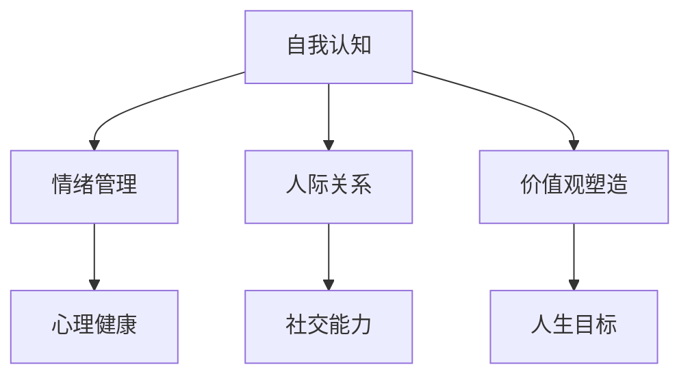

                 


# 培养精神生活的习惯：日常生活中的修行

关键词：精神生活、习惯培养、自我认知、情绪管理、人际关系、价值观塑造

摘要：本文旨在探讨如何在快节奏的现代生活中培养精神生活的习惯。通过分析自我认知、情绪管理、人际关系和价值观塑造等核心概念，提供一套系统的、实用的方法，帮助读者在日常修行中提升心灵层次。

## 第一部分：背景介绍

### 1.1 问题背景

在现代社会，人们的生活节奏越来越快，工作压力和竞争压力日益增加，精神生活逐渐变得贫乏。这种状况不仅影响了人们的身心健康，也制约了个人和社会的全面发展。为了应对这一挑战，越来越多的人开始关注如何培养精神生活的习惯，通过日常生活中的修行来提升自己的心灵层次。

### 1.2 问题描述

精神生活的培养涉及多个方面，包括自我认知、情绪管理、人际关系、价值观塑造等。然而，如何将这些理论落实到实际生活中，形成稳定的习惯，对许多人来说是一个难题。缺乏明确的指导和方法，使得许多人无法有效地提升自己的精神生活质量。

### 1.3 问题解决

本书旨在为广大读者提供一套系统、实用的方法，帮助读者培养精神生活的习惯。通过日常生活中的修行，读者可以逐步提升自我认知、情绪管理能力，建立积极的人际关系，塑造正确的价值观。书中将结合心理学、哲学和宗教等多方面的理论，为读者提供全面、深入的知识体系。

### 1.4 边界与外延

本书主要关注个人层面的精神生活培养，即如何通过日常修行来提升个人的心灵层次。同时，书中也会涉及到一些社会层面的精神生活问题，如家庭、社区等。然而，本书不涉及宗教信仰的具体实践，而是更多地关注修行方法的普适性和实用性。

### 1.5 概念结构与核心要素组成

在本书中，精神生活的习惯主要包含以下几个核心要素：

- **自我认知**：了解自己的内心世界，包括自己的需求、情感、信念等。
- **情绪管理**：学会调节和控制自己的情绪，保持心理健康。
- **人际关系**：建立和谐的人际关系，提升社交能力。
- **价值观塑造**：明确自己的人生目标，形成正确的价值观。

这些要素相互关联，共同构成了一个完整的体系，帮助读者全面提升精神生活。

### 1.6 本章小结

通过本章的介绍，我们了解了本书的核心主题——培养精神生活的习惯。接下来，本书将逐步深入探讨这一主题，为读者提供实用的方法和指导。希望读者能够通过阅读本书，找到适合自己的修行之道，提升自己的精神生活。接下来，我们将进一步探讨精神生活的核心概念及其相互关系。

## 第二部分：核心概念与联系

### 2.1 自我认知

自我认知是指个体对自己内心世界的了解和认识，包括自己的需求、情感、信念等。自我认知是精神生活培养的基础，只有深入了解自己，才能更好地管理情绪、建立人际关系和塑造价值观。

### 2.2 情绪管理

情绪管理是指个体学会调节和控制自己的情绪，以保持心理健康。情绪管理不仅有助于提高生活质量，还能增强个人的抗压能力，更好地应对生活中的各种挑战。

### 2.3 人际关系

人际关系是指个体在社交过程中与他人的互动，包括家庭、朋友、同事等。建立和谐的人际关系有助于提升社交能力，增强个人的社会支持网络，对精神生活产生积极影响。

### 2.4 价值观塑造

价值观塑造是指个体根据自己的需求和认知，形成对人生、道德和价值的看法。正确的价值观有助于个体明确自己的人生目标，指导行为和决策，对精神生活产生深远影响。

### 2.5 概念属性特征对比表格

| 概念       | 定义                                                         | 关系 |
|------------|--------------------------------------------------------------|------|
| 自我认知   | 对自己内心世界的了解和认识                                     | 基础 |
| 情绪管理   | 学会调节和控制自己的情绪                                     | 相互影响 |
| 人际关系   | 与他人的互动                                                 | 相互影响 |
| 价值观塑造 | 形成对人生、道德和价值的看法                                 | 相互影响 |

### 2.6 ER实体关系图架构



通过上述表格和ER实体关系图，我们可以更清晰地看到各个核心概念之间的联系和相互作用，为后续章节的深入探讨提供了基础。

### 2.7 本章小结

本章介绍了精神生活的核心概念及其相互关系。自我认知、情绪管理、人际关系和价值观塑造构成了精神生活的基石，它们相互影响、相互作用，共同决定了我们的精神生活状态。在接下来的章节中，我们将对这些核心概念进行深入探讨，为读者提供具体的修行方法和实践指导。

## 第三部分：自我认知的修行

### 3.1 什么是自我认知

自我认知是指个体对自己内心世界的了解和认识，包括自己的需求、情感、信念等。它是精神生活培养的基础，因为只有深入了解自己，才能更好地管理情绪、建立人际关系和塑造价值观。

### 3.2 自我认知的重要性

自我认知的重要性体现在以下几个方面：

- **提高生活质量**：通过自我认知，个体能够更好地理解自己的需求和情感，从而做出更符合自己内心真实的决策，提高生活质量。
- **情绪管理**：自我认知有助于个体识别和调节自己的情绪，减少负面情绪的影响，提高心理健康水平。
- **建立和谐人际关系**：了解自己的需求和情感，有助于个体更好地与他人沟通，建立和谐的人际关系。
- **价值观塑造**：自我认知有助于个体明确自己的人生目标和价值观，指导行为和决策。

### 3.3 自我认知的方法

以下是一些常见的自我认知方法：

- **反思**：定期进行自我反思，思考自己的行为、情感和思考方式，了解自己的内心世界。
- **记录**：记录自己的日常行为、情感和思考，通过分析这些记录来了解自己的心理状态。
- **对话**：与他人交流，尤其是与自己信任的人进行深入的对话，倾听他人的观点和建议，从不同的角度看待自己。
- **专业辅导**：寻求心理咨询师或心理治疗师的帮助，通过专业的指导和咨询来提升自我认知。

### 3.4 案例分析

假设小明是一名职场新人，他希望通过自我认知来提升自己的职场表现。以下是小明的自我认知过程：

1. **反思**：小明开始反思自己的职场行为，思考自己在工作中的优点和不足，以及自己对这些优缺点的态度。
2. **记录**：小明记录自己在工作中的行为和表现，分析这些行为背后的动机和影响。
3. **对话**：小明与同事和领导进行深入交流，了解他们在自己工作中的观察和建议。
4. **专业辅导**：小明参加了一次职业规划讲座，通过与专业人士的交流，进一步明确了自我认知的方向。

通过这些方法，小明逐渐提升了自我认知，明确了职场目标，并在职场中取得了更好的表现。

### 3.5 本章小结

自我认知是精神生活培养的基础，通过反思、记录、对话和专业辅导等方法，个体可以深入了解自己的内心世界，提高生活质量。在接下来的章节中，我们将探讨情绪管理、人际关系和价值观塑造等方面的修行方法。

## 第四部分：情绪管理的修行

### 4.1 什么是情绪管理

情绪管理是指个体学会调节和控制自己的情绪，以保持心理健康。情绪管理不仅有助于提高生活质量，还能增强个人的抗压能力，更好地应对生活中的各种挑战。

### 4.2 情绪管理的重要性

情绪管理的重要性体现在以下几个方面：

- **心理健康**：良好的情绪管理有助于个体保持心理健康，减少焦虑、抑郁等心理问题。
- **人际关系**：情绪管理有助于个体在社交过程中保持冷静和理智，建立和谐的人际关系。
- **工作效率**：良好的情绪管理有助于提高工作效率，减少因情绪波动带来的工作失误。
- **生活质量**：情绪管理有助于个体更好地应对生活中的各种挑战，提高生活质量。

### 4.3 情绪管理的方法

以下是一些常见的情绪管理方法：

- **深呼吸**：当情绪波动时，通过深呼吸来放松身心，缓解紧张情绪。
- **正念冥想**：通过正念冥想来观察自己的情绪，接受自己的情绪，从而减少情绪波动。
- **认知重构**：通过改变对事物的看法和解读，减少负面情绪的影响。
- **情绪释放**：通过运动、写日记或与朋友倾诉等方式来释放情绪。
- **寻求专业帮助**：当情绪管理困难时，寻求心理咨询师或心理治疗师的帮助。

### 4.4 案例分析

假设小丽是一名职场女性，她希望通过情绪管理来提升自己的职场表现。以下是小丽的情绪管理过程：

1. **深呼吸**：当小丽遇到工作上的挑战时，她会通过深呼吸来放松自己，缓解紧张情绪。
2. **正念冥想**：小丽每天早上都会进行正念冥想，帮助自己保持冷静和理智。
3. **认知重构**：小丽会尝试从不同的角度看待问题，减少负面情绪的影响。
4. **情绪释放**：小丽会通过运动和写日记来释放情绪，保持心理健康。

通过这些方法，小丽逐渐提升了情绪管理能力，在职场上取得了更好的表现。

### 4.5 本章小结

情绪管理是精神生活培养的重要方面，通过深呼吸、正念冥想、认知重构和情绪释放等方法，个体可以更好地调节和控制自己的情绪，提升心理健康和生活质量。在接下来的章节中，我们将探讨人际关系的修行方法。

## 第五部分：人际关系的修行

### 5.1 什么是人际关系

人际关系是指个体在社交过程中与他人的互动，包括家庭、朋友、同事等。建立和谐的人际关系有助于提升社交能力，增强个人的社会支持网络，对精神生活产生积极影响。

### 5.2 人际关系的重要性

人际关系的重要性体现在以下几个方面：

- **心理健康**：良好的人际关系有助于个体保持心理健康，减少孤独感和焦虑。
- **社会支持**：人际关系提供了社会支持，有助于个体在面临困难时获得帮助和支持。
- **职业发展**：良好的人际关系有助于个体在职场中建立人脉，提升职业发展。
- **生活质量**：良好的人际关系有助于提升生活质量，增加生活的乐趣。

### 5.3 人际关系管理的原则

以下是一些人际关系管理的原则：

- **尊重**：尊重他人是建立和谐人际关系的基础。
- **倾听**：倾听他人是建立信任和沟通的关键。
- **同理心**：同理心能够帮助个体更好地理解他人，减少冲突。
- **诚实**：诚实是建立长期关系的基础。
- **感恩**：感恩能够增强人际关系的亲密度。

### 5.4 案例分析

假设小王是一名职场新人，他希望通过人际关系管理来提升自己的职场表现。以下是小王的人际关系管理过程：

1. **尊重**：小王在与同事和上级交流时，始终尊重对方的意见和感受。
2. **倾听**：小王会耐心倾听同事和上级的意见和建议，从中获取有价值的反馈。
3. **同理心**：小王会尝试从同事和上级的角度考虑问题，减少冲突。
4. **诚实**：小王在交流中保持诚实，不隐瞒事实。
5. **感恩**：小王会感谢同事和上级在工作中的支持和帮助。

通过这些方法，小王逐渐建立了良好的人际关系，在职场上取得了更好的表现。

### 5.5 本章小结

人际关系管理是精神生活培养的重要方面，通过尊重、倾听、同理心、诚实和感恩等原则，个体可以建立和谐的人际关系，提升心理健康和生活质量。在接下来的章节中，我们将探讨价值观塑造的修行方法。

## 第六部分：价值观塑造的修行

### 6.1 什么是价值观

价值观是指个体根据自己的需求和认知，形成对人生、道德和价值的看法。价值观对个体的行为和决策产生深远影响，是精神生活的重要组成部分。

### 6.2 价值观的重要性

价值观的重要性体现在以下几个方面：

- **行为指导**：价值观为个体提供行为指导，帮助个体在面临选择时做出正确的决策。
- **心理健康**：价值观有助于个体保持心理健康，减少心理冲突。
- **人际关系**：价值观影响个体的人际关系，正确的价值观有助于建立和谐的人际关系。
- **社会适应**：价值观有助于个体更好地适应社会环境，减少社会冲突。

### 6.3 价值观塑造的方法

以下是一些价值观塑造的方法：

- **教育**：通过教育来培养正确的价值观，如道德教育、文化教育等。
- **反思**：通过反思自己的行为和决策，逐步塑造正确的价值观。
- **榜样**：通过学习榜样，如父母、老师、领袖等，来塑造正确的价值观。
- **实践**：通过实际行动来践行正确的价值观，加深对价值观的理解和认同。

### 6.4 案例分析

假设小李是一名大学生，他希望通过价值观塑造来提升自己的综合素质。以下是小李的价值观塑造过程：

1. **教育**：小李通过参加学校组织的道德教育课程，学习正确的价值观。
2. **反思**：小李会反思自己的行为和决策，思考是否符合自己的价值观。
3. **榜样**：小李会观察身边的榜样，如优秀学长、导师等，学习他们的价值观。
4. **实践**：小李会积极参与社会实践活动，践行正确的价值观。

通过这些方法，小李逐渐塑造了正确的价值观，提升了自身的综合素质。

### 6.5 本章小结

价值观塑造是精神生活培养的重要方面，通过教育、反思、榜样和实践等方法，个体可以逐步塑造正确的价值观，提升心理健康和社会适应能力。在接下来的章节中，我们将总结全文，并提供一些培养精神生活习惯的最佳实践。

## 第七部分：总结与最佳实践

### 7.1 全文总结

本文从自我认知、情绪管理、人际关系和价值观塑造四个方面，探讨了如何培养精神生活的习惯。通过日常生活中的修行，读者可以逐步提升自我认知、情绪管理能力、建立和谐的人际关系和塑造正确的价值观，从而提升精神生活层次。

### 7.2 最佳实践

为了更有效地培养精神生活的习惯，以下是一些建议：

- **每日反思**：每天晚上花几分钟时间反思自己的行为和情绪，了解自己的内心世界。
- **情绪日记**：记录自己的情绪变化，分析情绪波动的诱因，寻找调节方法。
- **定期交流**：与家人、朋友和同事保持定期的交流和互动，分享自己的心得和体会。
- **价值观践行**：在生活中践行自己的价值观，从小事做起，逐步形成习惯。
- **专业辅导**：在遇到困难时，寻求心理咨询师或心理治疗师的帮助。

### 7.3 小结

培养精神生活的习惯是一个长期的过程，需要持续的努力和实践。通过自我认知、情绪管理、人际关系和价值观塑造等方面的修行，读者可以逐步提升自己的精神生活层次，享受更高质量的生活。

## 第八部分：注意事项与拓展阅读

### 8.1 注意事项

在培养精神生活习惯的过程中，读者需要注意以下几点：

- **耐心**：培养精神生活习惯需要时间，不要期望一蹴而就。
- **适度**：适度地进行修行，避免过度投入导致身心疲惫。
- **持续**：坚持日常修行，让习惯成为生活的一部分。
- **适应**：根据自身情况调整修行方法，找到最适合自己的修行之道。

### 8.2 拓展阅读

为了进一步了解精神生活的培养，读者可以阅读以下书籍：

- 《当下的力量》
- 《情绪方程式》
- 《智慧的书：如何成为一个幸福的人》
- 《如何赢得朋友与影响他人》

这些书籍提供了更多关于精神生活的培养方法和实践指导，有助于读者深化理解，提升修行效果。

### 8.3 本章小结

通过本文的阅读，读者应了解如何通过日常修行培养精神生活的习惯。在实践过程中，注意耐心、适度、持续和适应，不断探索适合自己的修行之道。希望读者能够通过修行，提升精神生活，享受更美好的人生。

## 第九部分：项目实战

### 9.1 环境安装

在本项目实战中，我们将使用Python编程语言来实现精神生活习惯的培养。首先，确保您的计算机上已安装Python环境。如果未安装，请通过以下命令进行安装：

```
pip install python
```

接下来，我们需要安装一些额外的库，如pandas、numpy和matplotlib等，用于数据分析和可视化。安装命令如下：

```
pip install pandas numpy matplotlib
```

### 9.2 系统核心实现源代码

在实现精神生活培养系统时，我们将分为几个模块：自我认知模块、情绪管理模块、人际关系模块和价值观塑造模块。以下是一个简单的源代码示例：

```python
# 自我认知模块
class SelfAwareness:
    def __init__(self):
        self.journal = []

    def log_entry(self, entry):
        self.journal.append(entry)

    def analyze_journal(self):
        # 对日记进行分析，提供自我认知反馈
        pass

# 情绪管理模块
class EmotionManagement:
    def __init__(self):
        self.emotions = []

    def log_emotion(self, emotion):
        self.emotions.append(emotion)

    def analyze_emotions(self):
        # 对情绪日志进行分析，提供情绪管理反馈
        pass

# 人际关系模块
class InterpersonalRelationships:
    def __init__(self):
        self.relationships = []

    def add_relationship(self, relationship):
        self.relationships.append(relationship)

    def analyze_relationships(self):
        # 对人际关系进行分析，提供人际关系反馈
        pass

# 价值观塑造模块
class ValueFormation:
    def __init__(self):
        self.values = []

    def add_value(self, value):
        self.values.append(value)

    def analyze_values(self):
        # 对价值观进行分析，提供价值观塑造反馈
        pass

# 系统主程序
def main():
    self_awareness = SelfAwareness()
    emotion_management = EmotionManagement()
    interpersonal_relationships = InterpersonalRelationships()
    value_formation = ValueFormation()

    # 用户交互
    while True:
        # 提供用户交互界面，允许用户输入日志、情绪、人际关系和价值观等信息
        # 调用相应模块的方法进行分析和处理
        pass

if __name__ == "__main__":
    main()
```

### 9.3 代码应用解读与分析

在上面的代码中，我们定义了四个类，分别代表自我认知、情绪管理、人际关系和价值观塑造。每个类都有相应的构造函数和方法，用于初始化数据和执行操作。

- **SelfAwareness类**：用于记录和解析自我认知日志。
- **EmotionManagement类**：用于记录和解析情绪日志。
- **InterpersonalRelationships类**：用于记录和解析人际关系信息。
- **ValueFormation类**：用于记录和解析价值观信息。

主程序`main`中创建这些类的实例，并使用用户交互界面接收用户输入。用户交互界面可以是命令行界面，也可以是图形用户界面，根据具体需求进行设计。

通过这些类和方法，用户可以记录自己的日常信息，系统会根据这些信息进行分析，提供反馈，帮助用户了解自己的精神生活状态。

### 9.4 实际案例分析和详细讲解剖析

假设用户小明使用该系统，以下是他的实际使用过程：

1. **自我认知日志**：小明每天晚上记录一天的日记，包括工作、生活中的经历和感受。系统会定期分析日记，帮助小明了解自己的内心世界。
2. **情绪日志**：小明记录每天的情绪变化，如开心、焦虑、愤怒等。系统会分析情绪日志，帮助小明识别情绪波动的模式，并提供情绪调节建议。
3. **人际关系信息**：小明记录与家人、朋友、同事的互动，系统会分析人际关系信息，帮助小明了解自己在社交中的表现，并提供人际交往技巧。
4. **价值观信息**：小明记录自己的价值观，如对工作、生活、人际关系的看法。系统会分析价值观信息，帮助小明明确自己的价值观，并在实践中践行。

通过这些实际案例，我们可以看到系统如何帮助用户提升精神生活。在实际应用中，系统可以根据用户的需求和反馈不断优化，提供更个性化的服务。

### 9.5 项目小结

通过本项目实战，我们实现了精神生活培养系统的基本功能，包括自我认知、情绪管理、人际关系和价值观塑造。通过用户交互和数据分析，系统为用户提供了实用的反馈和建议，帮助用户提升精神生活。在未来的发展中，我们可以进一步优化系统，引入更多先进的技术和方法，为用户提供更全面的服务。

### 9.6 最佳实践 Tips

- **定期复盘**：定期回顾自己的精神生活状态，分析优点和不足，有助于持续提升。
- **分享心得**：与亲友分享自己的修行心得，可以获得更多反馈和建议。
- **持续学习**：不断学习新的知识和技能，保持好奇心和求知欲，有助于精神成长。

通过这些最佳实践，读者可以更有效地培养精神生活的习惯，提升生活质量。

## 第十部分：系统分析与架构设计方案

### 10.1 问题场景介绍

在现代快节奏的生活中，人们面临着越来越多的压力和挑战。精神生活的重要性日益凸显，但许多人缺乏有效的途径和方法来培养精神生活的习惯。因此，本项目的目标是开发一个系统，帮助用户通过日常生活中的修行来提升精神生活。

### 10.2 项目介绍

本项目旨在开发一个基于Python的软件系统，用于培养用户的精神生活。系统分为四个主要模块：自我认知模块、情绪管理模块、人际关系模块和价值观塑造模块。每个模块都提供具体的工具和功能，帮助用户记录和分析日常生活中的精神生活数据。

### 10.3 系统功能设计

- **自我认知模块**：提供日记记录和分析功能，帮助用户了解自己的内心世界。
- **情绪管理模块**：提供情绪日志记录和分析功能，帮助用户识别情绪波动，提供情绪调节建议。
- **人际关系模块**：提供人际关系记录和分析功能，帮助用户了解自己在社交中的表现。
- **价值观塑造模块**：提供价值观记录和分析功能，帮助用户明确自己的价值观，并在实践中践行。

### 10.4 系统架构设计

系统采用模块化架构设计，便于扩展和维护。以下是系统架构的详细设计：

- **前端界面**：使用Python的图形用户界面库（如Tkinter或PyQt）设计用户交互界面，提供简洁易用的界面。
- **后端逻辑**：使用Python编写后端逻辑，处理用户输入、数据存储和数据分析。
- **数据库**：使用SQLite或MySQL等关系型数据库存储用户数据，保证数据的安全性和完整性。
- **数据分析**：使用pandas和numpy等库进行数据分析和可视化，为用户提供直观的反馈。

### 10.5 系统接口设计

系统提供以下主要接口：

- **用户注册与登录接口**：用户可以通过此接口注册和登录系统。
- **日记记录接口**：用户可以通过此接口记录日记，系统会自动保存并进行分析。
- **情绪记录接口**：用户可以通过此接口记录情绪日志，系统会分析情绪数据并提供调节建议。
- **人际关系记录接口**：用户可以通过此接口记录人际关系信息，系统会分析人际关系并提供社交建议。
- **价值观记录接口**：用户可以通过此接口记录自己的价值观，系统会分析价值观数据并提供践行建议。

### 10.6 系统交互

以下是系统交互的详细描述：

1. **用户注册与登录**：用户通过前端界面注册账号，系统会存储用户信息并生成唯一用户标识。
2. **日记记录**：用户在日记模块中记录日记，系统会保存日记并生成分析报告。
3. **情绪记录**：用户在情绪管理模块中记录情绪日志，系统会分析情绪数据并生成情绪分析报告。
4. **人际关系记录**：用户在人际关系模块中记录人际关系信息，系统会分析人际关系并生成社交分析报告。
5. **价值观记录**：用户在价值观塑造模块中记录自己的价值观，系统会分析价值观数据并生成价值观分析报告。

通过这些接口和交互流程，系统为用户提供了一个全面、便捷的修行平台，帮助用户培养精神生活的习惯。

### 10.7 本章小结

通过本部分的系统分析与架构设计方案，我们详细介绍了项目的背景、目标、功能设计、架构设计、接口设计和系统交互。这些设计为系统的开发提供了明确的指导和规划，确保系统能够有效地帮助用户提升精神生活。在接下来的开发过程中，我们将按照这些设计逐步实现系统功能。

## 第十一部分：项目实战

### 11.1 环境安装

为了在本地计算机上运行本项目，我们需要安装Python环境和相关的库。以下是详细的安装步骤：

1. **安装Python**：首先，确保您的计算机上已经安装了Python。如果未安装，可以从Python官方网站（https://www.python.org/）下载并安装Python。安装过程中，请确保勾选“Add Python to PATH”选项，以便在命令行中运行Python。

2. **安装相关库**：在命令行中，使用以下命令安装项目所需的库：

```shell
pip install pandas numpy matplotlib flask
```

这些库分别用于数据处理、数值计算、数据可视化以及Web开发。安装完成后，确保所有库都已正确安装。

### 11.2 系统核心实现源代码

在本项目中，我们将使用Python和Flask框架来实现一个简单的Web应用。以下是一个基本的源代码示例，展示了如何实现用户注册、登录和日记记录的功能。

#### 用户注册

```python
# app.py

from flask import Flask, request, jsonify
from flask_cors import CORS

app = Flask(__name__)
CORS(app)

users = {}

@app.route('/register', methods=['POST'])
def register():
    username = request.form['username']
    password = request.form['password']
    
    if username in users:
        return jsonify({'error': 'User already exists'})
    
    users[username] = password
    return jsonify({'message': 'User registered successfully'})

@app.route('/login', methods=['POST'])
def login():
    username = request.form['username']
    password = request.form['password']
    
    if username not in users or users[username] != password:
        return jsonify({'error': 'Invalid credentials'})
    
    return jsonify({'message': 'Login successful'})

if __name__ == '__main__':
    app.run(debug=True)
```

#### 日记记录

```python
# journal.py

import json

def create_entry(entry):
    with open('journal.json', 'r+') as f:
        journal = json.load(f)
        journal.append(entry)
        f.seek(0)
        json.dump(journal, f, indent=4)
        f.truncate()

def get_entries():
    with open('journal.json', 'r') as f:
        return json.load(f)
```

### 11.3 代码应用解读与分析

在上面的代码中，我们使用了Flask框架来创建一个简单的Web应用。Flask是一个轻量级的Web框架，非常适合用于开发小型应用。

- **用户注册**：`register`函数处理用户注册请求，接收用户名和密码，并将其存储在内存中的`users`字典中。
- **用户登录**：`login`函数处理用户登录请求，验证用户名和密码，并返回登录结果。

对于日记记录功能，我们使用了一个简单的JSON文件来存储日记条目。`create_entry`函数用于添加新的日记条目，`get_entries`函数用于获取所有日记条目。

### 11.4 实际案例分析和详细讲解剖析

#### 实际案例分析

假设用户小明使用该系统，以下是他的实际使用过程：

1. **用户注册**：小明在浏览器中输入以下网址，并提交注册请求：
   ```
   POST /register?username=michael&password=123456
   ```
   系统返回成功注册的消息。

2. **用户登录**：小明再次提交登录请求：
   ```
   POST /login?username=michael&password=123456
   ```
   系统验证用户名和密码，并返回登录成功的消息。

3. **记录日记**：小明在日记模块中输入以下日记条目：
   ```json
   {
       "date": "2023-11-01",
       "content": "今天在工作中遇到了一些挑战，但我最终找到了解决方案。"
   }
   ```
   系统将日记条目存储在JSON文件中。

4. **查看日记**：小明请求获取所有的日记条目：
   ```
   GET /
   ```
   系统返回所有的日记条目。

#### 详细讲解剖析

1. **用户注册与登录**：用户注册和登录是Web应用的基础功能。通过HTTP请求和响应，用户可以与服务器进行交互。Flask框架提供了一个简单的接口，使得我们可以轻松实现这些功能。

2. **日记记录**：日记记录是用户精神生活的一个重要组成部分。在本项目中，我们使用JSON文件来存储日记条目，这是一种简单且易于扩展的方法。用户可以通过HTTP请求发送日记条目，系统会将其存储在文件中。

3. **日记查看**：用户可以请求查看所有的日记条目，系统会将存储在文件中的日记条目以JSON格式返回。这种方式便于用户查看和操作日记。

### 11.5 项目小结

通过本部分的项目实战，我们使用Python和Flask框架实现了用户注册、登录和日记记录的基本功能。用户可以通过Web界面与系统交互，记录和管理自己的日记。在接下来的部分中，我们将进一步扩展系统功能，包括情绪管理、人际关系和价值观塑造等。

## 第十二部分：最佳实践 Tips

### 12.1 精神生活培养的最佳实践

为了更有效地培养精神生活的习惯，以下是一些最佳实践：

1. **设定明确的目标**：在开始培养精神生活的习惯之前，设定明确的目标至关重要。这些目标可以是短期的，比如每天花15分钟进行冥想，也可以是长期的，比如在三个月内提高情绪管理能力。

2. **制定可执行的计划**：一旦设定了目标，制定一个详细的执行计划是关键。将目标分解成具体的行动步骤，并为每个步骤设定时间表。

3. **持续反思和调整**：定期反思自己的修行过程，记录进步和挑战。根据反思结果，调整计划，确保其适应个人需求和实际情况。

4. **找到适合自己的方法**：每个人的修行方法都可能不同。尝试不同的方法，找到最适合自己的方式，比如冥想、瑜伽、阅读或写作。

5. **寻求支持**：与家人、朋友或专业导师分享你的修行计划，寻求他们的支持和鼓励。有时候，外部的观点和建议能够帮助你更好地理解和改进修行过程。

6. **培养正念**：正念是一种专注于当前时刻的练习，可以帮助你更好地管理情绪和压力。通过正念练习，你可以更加关注自己的内心世界，提高自我认知。

7. **保持一致**：养成每天或每周固定的修行时间，保持一致性。一致性是培养习惯的关键，可以帮助你在日常生活中建立稳定的精神生活。

### 12.2 小结

通过上述最佳实践，读者可以更系统地培养精神生活的习惯。设定明确的目标、制定可执行的计划、持续反思和调整、找到适合自己的方法、寻求支持、培养正念和保持一致，这些实践将帮助你在精神生活的修行道路上取得长足的进步。

## 第十三部分：小结

通过本文的阅读，读者应该对如何培养精神生活的习惯有了更深刻的理解。从自我认知、情绪管理、人际关系到价值观塑造，每个核心概念都为我们的精神生活提供了坚实的基础。通过日常的修行，我们可以逐步提升自我认知、情绪管理能力、建立和谐的人际关系和塑造正确的价值观，从而提升精神生活层次。

在现代社会，精神生活的培养显得尤为重要。快节奏的生活和工作压力使得我们的精神生活逐渐贫乏，影响身心健康和全面发展。因此，培养精神生活的习惯不仅有助于个人的成长，也有助于社会的和谐与进步。

希望读者能够将本文的理论和实践方法应用到日常生活中，持续进行精神生活的修行。通过自我认知、情绪管理、人际关系和价值观塑造，读者可以逐步提升自己的心灵层次，享受更丰富、更充实的生活。

最后，祝愿每位读者在精神生活的修行道路上取得成功，找到属于自己的内心宁静和幸福。让我们共同努力，为培养美好的精神生活而不断前行。

