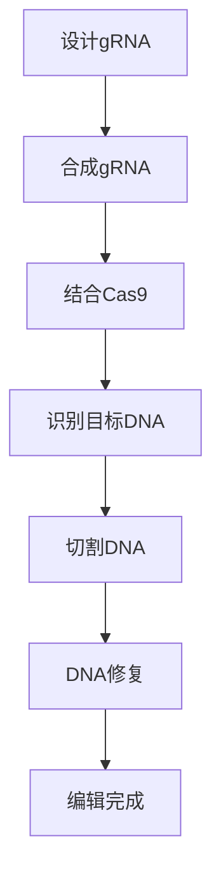
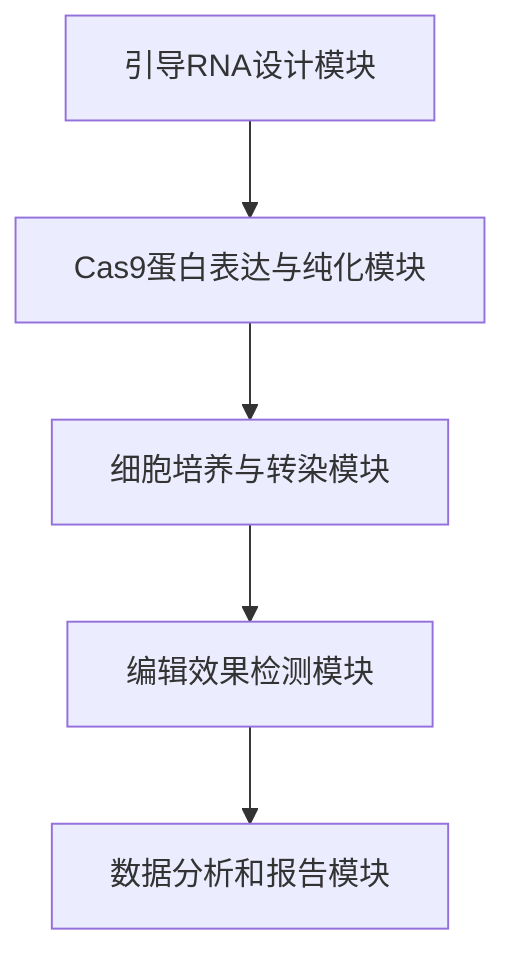
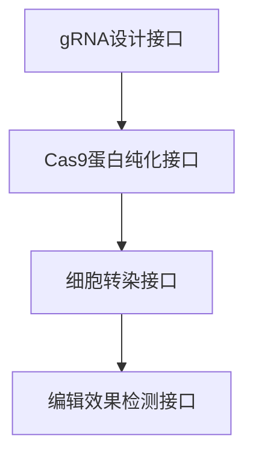
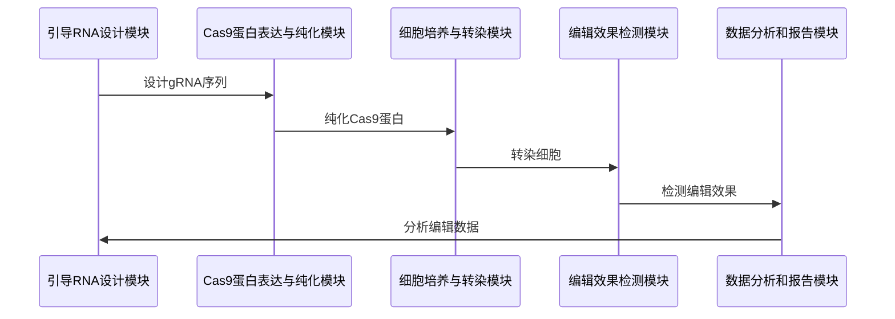
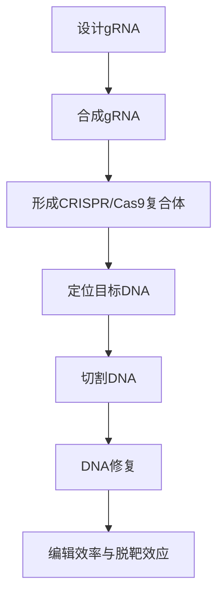
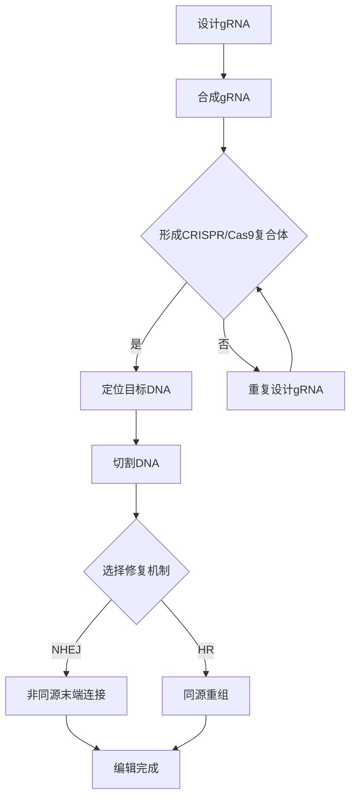

                 


### 1.1.1 基因编辑的定义

基因编辑是指对生物体的基因序列进行精确的修改和操纵，以实现特定目标的过程。这种技术具有高度的精确性和灵活性，可以在细胞水平、组织水平甚至整个生物体水平上操作基因。基因编辑不仅仅限于修改特定的基因，还可以包括基因的添加、删除、替换和重排等多种操作方式。

基因编辑的核心原理是基于分子生物学和生物化学的知识，通过特定的工具和策略，实现对目标基因的精准定位和操作。最早的基因编辑技术是DNA重组技术，通过人工手段将外源基因引入宿主细胞，实现基因的转移和表达。随着科学技术的进步，基因编辑技术逐渐发展出了多种形式，如转基因技术、基因敲除、基因替换、基因修复等。

基因编辑的主要应用领域包括医学、农业、生物研究等。在医学领域，基因编辑可以用于治疗遗传性疾病、癌症等；在农业领域，基因编辑可以用于培育高产、抗病、抗虫的作物；在生物研究领域，基因编辑则是研究基因功能和基因相互作用的重要工具。

### 1.1.2 基因编辑的发展历程

基因编辑技术的发展历程可以追溯到20世纪70年代，当时科学家们首次实现了DNA的体外重组和转移。这一时期的重要突破包括基因工程和转基因技术的诞生，这些技术为基因编辑奠定了基础。

1982年，科学家首次成功地将人类基因插入大肠杆菌，标志着基因编辑技术的初步成功。进入90年代，随着分子生物学和生物化学领域的深入研究，基因编辑技术得到了进一步的完善和发展。特别是CRISPR/Cas系统的发现和应用，为基因编辑技术带来了革命性的变化。

CRISPR（Clustered Regularly Interspaced Short Palindromic Repeats）系统是一种原核生物的天然免疫系统，能够在细菌中识别和消灭外来入侵的病毒和质粒。2007年，科学家首次揭示了CRISPR系统的机制，随后发现Cas9蛋白是CRISPR系统中的一个关键组成部分，可以用于基因编辑。

CRISPR/Cas9技术于2012年被开发出来，并迅速成为基因编辑领域的主流技术。它的操作简单、成本低廉、精确度高，使得基因编辑在医学、农业和生物研究等多个领域得到了广泛应用。随后，科学家们又开发出了CRISPR/Cas12、CRISPR/Cas13等新的基因编辑工具，使得基因编辑技术的多样性和灵活性得到了进一步提升。

总的来说，基因编辑技术的发展历程是一个不断突破和创新的过程。从最初的DNA重组技术，到CRISPR/Cas9的广泛应用，再到CRISPR/Cas12、CRISPR/Cas13等新工具的诞生，基因编辑技术正不断推动着生物科学和生物技术的进步。

### 1.2.1 基因编辑的重要性

基因编辑技术之所以成为生物科学和医学领域的重要工具，主要是因为它具有以下几个关键优势：

首先，基因编辑技术提供了对基因进行精准修改的能力。与传统的遗传工程技术相比，基因编辑可以在单个基因或特定基因序列上进行操作，避免了广泛遗传修改带来的不确定性和潜在风险。这种精准性使得基因编辑成为治疗遗传性疾病和癌症等复杂疾病的理想选择。

其次，基因编辑技术具有高效性和快速性。传统的遗传工程技术通常需要较长时间的培养和筛选过程，而基因编辑技术，如CRISPR/Cas9，可以在短时间内实现目标基因的精准修改。这种高效性大大缩短了研究周期，提高了实验效率。

第三，基因编辑技术在医疗领域的应用前景广阔。通过基因编辑技术，科学家们可以实现对某些遗传性疾病的基因修复，从而从根本上治疗这些疾病。例如，CRISPR/Cas9技术已经成功用于治疗囊性纤维化等遗传性疾病。此外，基因编辑技术还可以用于开发癌症疫苗，提高癌症治疗的针对性。

在农业领域，基因编辑技术同样具有重要意义。通过基因编辑，科学家们可以培育出高产、抗病、抗虫的作物，从而提高农作物的产量和质量。例如，CRISPR/Cas9技术已经用于培育抗褐变苹果、抗虫水稻等。这不仅有助于解决全球粮食安全问题，还可以减少农药的使用，降低环境污染。

此外，基因编辑技术在生物研究中也发挥着重要作用。通过基因编辑，科学家们可以更深入地了解基因的功能和基因之间的相互作用，从而推动生物学领域的研究进展。基因编辑技术还用于构建基因敲除和基因过表达的细胞模型，为药物筛选和基因治疗研究提供了有力的工具。

总的来说，基因编辑技术在医学、农业和生物研究等多个领域都有着广泛的应用前景。随着技术的不断进步，基因编辑技术将继续推动生命科学的进步，为人类带来更多的健康和福祉。

### 1.2.2 基因编辑的需求分析

基因编辑技术之所以迅速发展，源于其广泛的需求和应用场景。以下是基因编辑技术在不同领域的具体需求分析：

在医学领域，基因编辑技术被广泛应用于治疗遗传性疾病。例如，囊性纤维化、地中海贫血等遗传性疾病都是由基因突变引起的，基因编辑技术可以用于修复这些突变基因，从而根治疾病。此外，基因编辑技术还被用于开发癌症疫苗和治疗癌症。通过基因编辑，科学家们可以设计出针对特定癌症细胞的免疫疗法，提高治疗效果。随着CRISPR/Cas9技术的普及，基因编辑在基因治疗领域的应用前景变得更为广阔，使得许多以往难以治疗的疾病有望得到根本性的治愈。

在农业领域，基因编辑技术的需求主要集中在提高作物产量、抗病性和抗虫性。随着全球人口的增长和气候变化的影响，粮食安全问题日益突出。基因编辑技术可以通过编辑作物基因，提高其产量和适应性，从而满足日益增长的粮食需求。例如，通过基因编辑技术，科学家们已经成功培育出抗褐变苹果、抗虫水稻等高产作物。此外，基因编辑技术还可以减少对农药的依赖，降低环境污染。通过编辑作物基因，科学家们可以培育出对病虫害具有天然抵抗力的作物，从而减少农药的使用。

在生物研究领域，基因编辑技术是不可或缺的工具。基因编辑技术用于构建基因敲除和基因过表达的细胞模型，帮助科学家们深入研究基因的功能和基因间的相互作用。例如，通过CRISPR/Cas9技术，科学家们可以精确地敲除或过表达特定基因，观察这些基因在细胞行为和功能上的变化。这种研究方法不仅提高了实验的准确性，还大大缩短了研究周期。此外，基因编辑技术还用于研究基因调控网络，揭示基因如何相互协调和调控，从而推动生物学的进步。

在生物技术产业，基因编辑技术同样具有重要需求。基因编辑技术被广泛应用于蛋白质工程和药物研发。通过基因编辑，科学家们可以设计出具有特定功能或改进性能的蛋白质，用于治疗疾病或作为生物催化剂。例如，通过基因编辑，科学家们已经成功研发出治疗癌症和遗传性疾病的基因疗法。此外，基因编辑技术还被用于创建基因工程微生物，用于生产生物燃料、生物药物等。

总的来说，基因编辑技术在不同领域的需求是多样化的，但其核心目标都是提高生物体的功能、性能和适应性。随着技术的不断进步，基因编辑技术将在更多领域展现其巨大的应用潜力，为人类带来更多的创新和福祉。

### 1.3.1 基因编辑的应用领域

基因编辑技术在多个领域展现出强大的应用潜力，以下是其在医学、农业、生物研究以及生物技术产业等领域的具体应用：

在医学领域，基因编辑技术的应用最为广泛。它被用于治疗遗传性疾病，例如囊性纤维化和地中海贫血等。通过基因编辑，科学家们可以修复导致这些疾病的基因突变，从而从根本上治愈疾病。此外，基因编辑技术还被用于开发癌症疫苗和治疗癌症。通过基因编辑，可以设计出针对特定癌症细胞的免疫疗法，提高治疗效果。例如，CRISPR/Cas9技术已经被成功用于治疗某些类型的癌症，显示出巨大的潜力。

在农业领域，基因编辑技术的应用同样重要。它被用于培育高产、抗病、抗虫的作物，从而提高农作物的产量和质量。通过基因编辑，科学家们可以培育出对病虫害具有天然抵抗力的作物，减少农药的使用，降低环境污染。例如，利用CRISPR/Cas9技术，科学家们已经成功培育出抗褐变苹果和抗虫水稻等高产作物。此外，基因编辑技术还被用于改良农作物的营养价值和储存性能，提高作物的耐旱性和耐盐性，以适应不断变化的气候条件。

在生物研究领域，基因编辑技术是不可或缺的工具。通过基因编辑，科学家们可以构建基因敲除和基因过表达的细胞模型，深入探究基因的功能和基因间的相互作用。例如，利用CRISPR/Cas9技术，科学家们可以精确地敲除或过表达特定基因，观察这些基因在细胞行为和功能上的变化。这种研究方法不仅提高了实验的准确性，还大大缩短了研究周期。此外，基因编辑技术还被用于研究基因调控网络，揭示基因如何相互协调和调控，从而推动生物学的进步。

在生物技术产业，基因编辑技术同样具有重要需求。基因编辑技术被广泛应用于蛋白质工程和药物研发。通过基因编辑，科学家们可以设计出具有特定功能或改进性能的蛋白质，用于治疗疾病或作为生物催化剂。例如，通过基因编辑，科学家们已经成功研发出治疗癌症和遗传性疾病的基因疗法。此外，基因编辑技术还被用于创建基因工程微生物，用于生产生物燃料、生物药物等。基因编辑技术还用于开发新的生物传感器和生物标记物，提高生物技术的检测和诊断能力。

总的来说，基因编辑技术在医学、农业、生物研究和生物技术产业等多个领域都有着广泛的应用。随着技术的不断进步，基因编辑技术将在更多领域展现其巨大的应用潜力，为人类带来更多的创新和福祉。

### 1.3.2 基因编辑的限制条件

尽管基因编辑技术在许多领域展现出了巨大的潜力，但它在实际应用中仍然面临着一些重要的限制条件，这些问题需要得到深入的研究和解决。

首先，技术精确度问题是一个关键挑战。尽管CRISPR/Cas9等技术已经实现了相对精确的基因编辑，但仍然存在一定的脱靶效应。脱靶效应指的是编辑工具意外地编辑了目标基因之外的基因，这可能导致基因功能的破坏和未预期的不良后果。提高编辑的精确度是当前研究的重点，科学家们正在通过改进Cas蛋白的设计和优化CRISPR系统的靶点选择，以减少脱靶效应的发生。

其次，基因编辑的生物安全性问题也备受关注。基因编辑技术可能会对基因组造成永久性的改变，这些改变可能对个体健康产生长期影响，甚至可能对生态系统产生不可预见的影响。例如，基因编辑的作物可能对野生相关物种产生基因污染，导致生态平衡的破坏。因此，在基因编辑的应用中，必须进行严格的安全评估和监管，确保技术的安全性和可控性。

伦理问题也是基因编辑技术面临的重大挑战之一。基因编辑可能引发一系列伦理争议，如人类胚胎基因编辑、基因增强和遗传选择等。这些问题涉及到人类的尊严、平等和自由等基本价值观。在推动基因编辑技术的同时，必须建立完善的伦理规范和法律法规，确保技术的合理和负责任的应用。

最后，公众接受度问题也是一个不容忽视的限制条件。基因编辑技术的潜在影响和未知风险可能引起公众的担忧和恐慌，影响技术的推广和应用。因此，科学界和社会各界需要加强沟通和教育，提高公众对基因编辑技术的理解和接受度。

总的来说，基因编辑技术在应用中面临的技术精确度、生物安全性、伦理问题和公众接受度等多个方面的挑战。只有通过持续的研究和多方合作，才能有效解决这些问题，确保基因编辑技术的安全、高效和负责任的应用。

### 1.4.1 基因编辑的核心要素

基因编辑技术的实施依赖于几个关键的核心要素，这些要素共同构成了基因编辑系统的基本框架。理解这些核心要素及其相互作用，是深入探讨基因编辑技术的关键。

首先是**目标基因的选择**。目标基因是指需要进行编辑或修改的特定基因。选择目标基因的过程通常基于特定的医学或生物学需求，例如治疗遗传性疾病或研究基因功能。这一步骤至关重要，因为错误的基因选择可能导致编辑失败或产生不必要的副作用。

其次是**基因编辑工具**。目前最常用的基因编辑工具是CRISPR/Cas9系统，它由一个RNA引导的核酸酶（如Cas9蛋白）和一个特异性识别和切割DNA的RNA序列组成。CRISPR/Cas9系统通过引导RNA（gRNA）识别目标DNA序列，然后由Cas9蛋白在特定位置切割DNA，从而实现基因的修改。除了CRISPR/Cas9，还有其他基因编辑工具，如TALEN和ZFN，这些工具各自具有特定的优势和应用场景。

第三个核心要素是**编辑位点**的选择。编辑位点是指目标基因上需要进行切割和修改的具体位置。选择合适的编辑位点需要精确的定位和计算，以确保编辑操作的准确性和效率。编辑位点的选择通常基于特定的生物学目标和基因编辑策略。

第四个要素是**DNA修复机制**。基因编辑后，细胞会启动DNA修复机制来修复切割的DNA。主要的修复机制包括非同源末端连接（NHEJ）和同源重组（HR）。NHEJ通常导致基因的双链断裂修复，可能会引入插入或缺失（Indels），从而改变基因的功能。HR则是一种精确的修复方式，它使用同源序列作为模板来修复断裂，可以在不需要外源模板的情况下实现基因的精确修改。

第五个要素是**细胞环境和宿主生物**。基因编辑通常在细胞水平上进行，因此细胞类型和宿主生物的特性对编辑效率有重要影响。例如，某些细胞类型可能更容易接受和表达外源基因，从而提高编辑的成功率。此外，宿主生物的生理状态和基因背景也会影响编辑效果。

最后，**实验设计和数据分析**是基因编辑技术实施过程中的重要环节。实验设计需要考虑编辑工具的选择、编辑位点的确定、细胞培养条件、实验重复次数等因素。数据分析则用于评估编辑效率、脱靶效应和基因功能改变等。

总的来说，基因编辑技术的核心要素包括目标基因的选择、基因编辑工具、编辑位点、DNA修复机制、细胞环境和实验设计。这些要素相互作用，共同决定了基因编辑的精确性和效率。了解这些要素及其相互作用，有助于更好地掌握和应用基因编辑技术。

### 1.4.2 基因编辑的关键技术

基因编辑技术涉及到多种关键技术，其中CRISPR/Cas9、TALEN和ZFN是最为重要的三大技术。这些技术各自具有独特的优势和局限性，在不同应用场景中展现出不同的应用潜力。

**CRISPR/Cas9技术**：
CRISPR/Cas9系统是一种基于细菌天然免疫机制的基因编辑工具。它由一个RNA引导的核酸酶（如Cas9蛋白）和一个特异性识别和切割DNA的RNA序列（gRNA）组成。CRISPR/Cas9技术的操作简单、成本低廉、精确度高，使其成为基因编辑领域的革命性工具。

CRISPR/Cas9技术的优势在于其高度的灵活性和广泛的适用性。通过设计不同的gRNA，可以精确地定位到目标DNA序列并进行切割，从而实现基因的添加、删除或替换。此外，CRISPR/Cas9技术适用于多种生物体，包括人类细胞、植物、动物和微生物等。

然而，CRISPR/Cas9技术也存在一些局限性。首先，它可能产生脱靶效应，即编辑工具意外地切割到目标基因之外的DNA序列，这可能导致基因功能的破坏和未预期的不良后果。其次，CRISPR/Cas9技术的编辑效率可能因细胞类型和基因背景的不同而有所差异，这增加了实验操作的复杂性。

**TALEN技术**：
TALEN（Transcription Activator-Like Effector Nucleases）是一种基于转录激活因子类似效应器的核酸酶。TALEN由一个DNA结合域（DBD）和一个核酸内切酶结构域组成，通过类似CRISPR/Cas9系统的引导RNA来定位目标DNA序列。

TALEN技术的优势在于其较低的脱靶效应和较高的编辑精度。与CRISPR/Cas9技术相比，TALEN的DBD具有更高的特异性和更低的非特异性结合。这使得TALEN在需要高度精确编辑的实验中表现更为出色。

然而，TALEN技术也存在一些局限性。首先，TALEN的设计和构建过程较为复杂，需要合成特定的DNA结合域和核酸内切酶结构域，这增加了实验的成本和难度。其次，TALEN的编辑效率可能受到细胞类型和基因背景的影响，这限制了其在某些应用场景中的使用。

**ZFN技术**：
ZFN（ Zinc Finger Nucleases）是一种基于锌指蛋白的核酸酶。锌指蛋白是一种DNA结合蛋白，可以特异性地结合到DNA序列上。ZFN通过将锌指蛋白与核酸内切酶结构域连接，形成具有DNA切割功能的复合体。

ZFN技术的优势在于其高度的特异性。锌指蛋白的DNA结合域可以高度特异地识别特定的DNA序列，从而实现精确的基因编辑。此外，ZFN技术适用于多种细胞类型和生物体，包括人类细胞、植物、动物和微生物等。

然而，ZFN技术也存在一些局限性。首先，锌指蛋白的设计和构建过程较为复杂，需要合成和修饰特定的DNA结合域，这增加了实验的成本和难度。其次，ZFN的编辑效率可能因细胞类型和基因背景的不同而有所差异，这限制了其在某些应用场景中的使用。

总的来说，CRISPR/Cas9、TALEN和ZFN是三种重要的基因编辑技术，各自具有独特的优势和局限性。选择合适的基因编辑技术取决于具体的应用需求和实验目标。科学家们通过不断改进和优化这些技术，以提高编辑的精确性和效率，推动基因编辑技术在医学、农业和生物研究等领域的广泛应用。

### 1.4.3 基因编辑的数学模型和算法原理

基因编辑技术的核心在于其精确的DNA切割和修改能力。为了理解这一过程，我们需要从数学模型和算法原理的角度进行深入探讨。以下是对CRISPR/Cas9系统中的算法原理和数学模型进行详细解释。

**算法原理**：

CRISPR/Cas9系统的工作流程可以简化为以下几个步骤：

1. **设计引导RNA（gRNA）**：首先，需要设计一段特定的RNA序列，即引导RNA（gRNA）。这段序列与目标DNA序列具有互补性，指导Cas9蛋白精确地定位到目标DNA序列。

2. **gRNA与Cas9蛋白结合**：设计好的gRNA与Cas9蛋白结合，形成RNA-DNA-Cas9三元复合体。

3. **DNA切割**：在gRNA的引导下，Cas9蛋白识别并结合到目标DNA序列上，并通过其核酸内切酶活性在特定位置切割DNA，产生双链断裂。

4. **DNA修复**：细胞通过非同源末端连接（NHEJ）或同源重组（HR）机制修复双链断裂。NHEJ通常引入小片段的插入或缺失（Indels），而HR则能实现更为精确的基因修改。

**算法流程图**：

为了更直观地展示CRISPR/Cas9的算法原理，我们可以使用Mermaid绘制流程图：



**数学模型**：

CRISPR/Cas9系统的核心数学模型涉及以下几个方面：

1. **gRNA的亲和力和特异性**：gRNA与目标DNA的亲和力和特异性直接影响基因编辑的效率。我们可以使用结合能和自由能等热力学参数来描述这种相互作用。

   $$\Delta G = \Delta H - T\Delta S$$

   其中，$\Delta G$ 是自由能变化，$\Delta H$ 是焓变，$T$ 是温度，$\Delta S$ 是熵变。

2. **Cas9蛋白的切割效率**：切割效率取决于Cas9蛋白与gRNA的结合稳定性和Cas9核酸内切酶的活性。

   $$E_{cut} = k_{on} \times [gRNA] \times [Cas9]$$

   其中，$E_{cut}$ 是切割效率，$k_{on}$ 是结合速率常数，$[gRNA]$ 和$[Cas9]$ 分别是gRNA和Cas9的浓度。

3. **DNA修复机制的概率**：NHEJ和HR修复机制的概率取决于DNA断裂的位置和序列背景。

   $$P_{NHEJ} = f_{NHEJ} \times (1 - P_{HR})$$
   $$P_{HR} = f_{HR} \times P_{homology}$$

   其中，$P_{NHEJ}$ 和$P_{HR}$ 分别是NHEJ和HR修复的概率，$f_{NHEJ}$ 和$f_{HR}$ 分别是两种修复机制的频率，$P_{homology}$ 是同源序列的概率。

**举例说明**：

假设我们使用CRISPR/Cas9技术编辑人类细胞的某一基因。设计一段gRNA，使其与目标基因上的特定序列互补，并通过实验确定其结合能和自由能。根据热力学公式，可以计算这段gRNA的亲和力和特异性。

假设gRNA与目标DNA的结合能$\Delta G = -10 \text{kJ/mol}$，细胞温度为$37^\circ\text{C}$。我们可以使用上述公式计算其结合自由能：

$$\Delta G = \Delta H - T\Delta S$$
$$-10 = \Delta H - 310 \times \Delta S$$

通过实验测定，我们得知$\Delta H = 20 \text{kJ/mol}$ 和$\Delta S = 5 \text{J/mol·K}$，代入公式得：

$$-10 = 20 - 310 \times 5$$
$$\Delta S = \frac{10 + 20}{310} = 0.085 \text{J/mol·K}$$

这表明gRNA与目标DNA的亲和力较强，具有较高的编辑效率。

接下来，假设Cas9蛋白与gRNA的结合速率常数$k_{on} = 10^7 \text{mol}^{-1}\text{L}\text{s}^{-1}$，gRNA和Cas9的浓度分别为$[gRNA] = 1 \text{μM}$ 和$[Cas9] = 1 \text{μM}$，我们可以计算切割效率：

$$E_{cut} = k_{on} \times [gRNA] \times [Cas9]$$
$$E_{cut} = 10^7 \times 1 \times 1 = 10^7 \text{1/s}$$

这表明Cas9蛋白的切割效率非常高。

最后，假设细胞中NHEJ和HR修复机制的频率分别为$f_{NHEJ} = 0.5$ 和$f_{HR} = 0.5$，同源序列的概率$P_{homology} = 0.9$，我们可以计算DNA修复的概率：

$$P_{NHEJ} = f_{NHEJ} \times (1 - P_{HR})$$
$$P_{NHEJ} = 0.5 \times (1 - 0.5 \times 0.9) = 0.175$$

$$P_{HR} = f_{HR} \times P_{homology}$$
$$P_{HR} = 0.5 \times 0.9 = 0.45$$

这表明HR修复的概率较高，可能导致较为精确的基因修改。

通过这些数学模型和算法原理的详细解释，我们可以更好地理解CRISPR/Cas9系统的基因编辑过程。这不仅有助于提高编辑的精确性和效率，还可以指导科学家们在实际应用中优化基因编辑策略。

### 1.4.4 基因编辑的数学公式与举例说明

基因编辑过程中，数学公式在描述和计算编辑效率、结合能和修复概率等方面发挥着重要作用。以下是几个关键的数学公式及其应用实例：

**1. 结合能公式**：

结合能（ΔG）是描述RNA与DNA结合强度的重要参数。其计算公式如下：

$$\Delta G = \Delta H - T\Delta S$$

其中，ΔG 是自由能变化，ΔH 是焓变，T 是温度（单位为开尔文），ΔS 是熵变。

**举例说明**：

假设我们有一个CRISPR系统，其gRNA与目标DNA的结合能为ΔG = -20 kJ/mol，细胞温度为37°C（即310 K）。根据结合能公式，我们可以计算ΔH和ΔS：

$$\Delta G = \Delta H - T\Delta S$$
$$-20 \times 10^3 = \Delta H - 310 \times \Delta S$$

通过实验测定，我们得知ΔH = 40 kJ/mol，代入公式得：

$$\Delta S = \frac{-20 \times 10^3 + 40 \times 10^3}{310} = 123.4 \text{J/mol·K}$$

这表明gRNA与目标DNA的结合熵较高，结合强度较大。

**2. 切割效率公式**：

切割效率（E\_cut）是描述Cas9蛋白切割DNA的能力。其计算公式如下：

$$E_{cut} = k_{on} \times [gRNA] \times [Cas9]$$

其中，$k_{on}$ 是结合速率常数，[gRNA] 和 [Cas9] 分别是gRNA和Cas9的浓度。

**举例说明**：

假设gRNA和Cas9的浓度均为1 μM，结合速率常数$k_{on} = 10^7 \text{mol}^{-1}\text{L}\text{s}^{-1}$，则切割效率为：

$$E_{cut} = 10^7 \times 1 \times 1 = 10^7 \text{1/s}$$

这表明Cas9蛋白的切割效率非常高。

**3. 修复概率公式**：

DNA修复概率取决于非同源末端连接（NHEJ）和同源重组（HR）的频率。其计算公式如下：

$$P_{NHEJ} = f_{NHEJ} \times (1 - P_{HR})$$
$$P_{HR} = f_{HR} \times P_{homology}$$

其中，$f_{NHEJ}$ 和 $f_{HR}$ 分别是NHEJ和HR的频率，$P_{homology}$ 是同源序列的概率。

**举例说明**：

假设NHEJ的频率为0.6，HR的频率为0.4，且同源序列的概率为0.8，则：

$$P_{NHEJ} = 0.6 \times (1 - 0.4 \times 0.8) = 0.336$$
$$P_{HR} = 0.4 \times 0.8 = 0.32$$

这表明HR修复的概率较高，更有可能实现精确的基因编辑。

通过这些数学公式，我们可以更准确地预测和计算基因编辑过程中的各种参数，从而优化编辑策略，提高编辑效率和精确性。

### 1.4.5 基因编辑技术的系统架构设计

基因编辑技术的实现依赖于复杂的系统架构设计，以确保其精确性和有效性。以下是基因编辑系统的主要组成部分和设计思路：

**1. 系统组成部分**：

基因编辑系统主要包括以下几个关键组成部分：

- **引导RNA（gRNA）设计模块**：该模块负责设计特定的gRNA序列，以指导Cas9蛋白精确地定位到目标DNA序列。
- **Cas9蛋白表达与纯化模块**：该模块负责合成和纯化Cas9蛋白，确保其在编辑过程中的活性。
- **细胞培养与转染模块**：该模块负责培养目标细胞，并通过转染技术将gRNA和Cas9蛋白引入细胞。
- **编辑效果检测模块**：该模块用于检测基因编辑的效果，包括编辑效率、脱靶效应和基因功能改变等。
- **数据分析和报告模块**：该模块用于收集和分析实验数据，生成报告以评估基因编辑的成功率和效果。

**2. 系统架构设计**：

基因编辑系统的架构设计需要考虑以下几个关键方面：

- **模块化设计**：系统应采用模块化设计，使各个模块独立且易于操作，便于维护和升级。
- **并行处理能力**：系统应具备并行处理能力，以缩短实验周期和提高效率。
- **高精度和高可靠性**：系统应确保编辑过程的精度和可靠性，减少脱靶效应和误差。
- **自动化和智能化**：系统应具备自动化和智能化功能，减少人为操作误差，提高实验一致性。

以下是基因编辑系统的架构设计示意图：



**3. 系统实现细节**：

- **引导RNA设计**：使用生物信息学工具和算法，根据目标基因序列设计特定的gRNA序列。设计过程中需要考虑gRNA的特异性、稳定性和效率等因素。
- **Cas9蛋白表达与纯化**：通过基因工程方法，在微生物或哺乳动物细胞中表达Cas9蛋白，然后使用色谱技术进行纯化，确保蛋白的高纯度和活性。
- **细胞培养与转染**：选择合适的细胞系进行培养，并使用脂质体、电穿孔或病毒载体等方法将gRNA和Cas9蛋白引入细胞。转染过程需要优化条件，以提高转染效率和细胞存活率。
- **编辑效果检测**：通过PCR、测序或染色技术等手段，检测基因编辑效果。检测过程中需要设置对照组和实验组，以评估编辑效率和脱靶效应。
- **数据分析和报告**：使用统计方法和生物信息学工具，分析编辑效果数据，生成详细的报告，包括编辑效率、脱靶率、基因功能变化等。

通过上述系统架构设计，基因编辑技术可以高效、精确地实现目标基因的修改，为医学、农业和生物研究等领域提供强大的工具支持。

### 1.4.6 基因编辑技术的项目实战

在本节中，我们将通过一个实际的基因编辑项目，详细描述项目背景、目标、系统设计与实现过程，并进行代码解读和分析。

**项目背景**：

本项目的背景是利用CRISPR/Cas9技术对人类细胞的某一特定基因进行编辑，以研究该基因在细胞凋亡过程中的功能。该项目的主要目标是实现对目标基因的精准切割、修复和功能验证。

**项目目标**：

- 精准切割目标基因：利用CRISPR/Cas9系统，在人类细胞中实现目标基因的精确切割。
- 高效修复基因：通过DNA修复机制，实现基因的修复和功能恢复。
- 功能验证：通过细胞实验，验证基因编辑后细胞的凋亡功能是否得到改善。

**系统设计与实现**：

**1. 领域模型设计**：

在项目初期，我们首先进行了领域模型设计，以明确项目的核心模块和功能。以下是领域模型设计类图：

```mermaid
classDiagram
  Class01 <|-- Class02
  Class03 <|-- Class04
  Class05 <|-- Class06
  Class01{引导RNA设计模块}
  Class02{Cas9蛋白表达与纯化模块}
  Class03{细胞培养与转染模块}
  Class04{编辑效果检测模块}
  Class05{数据分析和报告模块}
```

**2. 系统架构设计**：

系统架构设计主要包括以下几个方面：

- **引导RNA设计模块**：负责设计特定的gRNA序列，并与Cas9蛋白结合。
- **Cas9蛋白表达与纯化模块**：负责表达和纯化Cas9蛋白，确保其在编辑过程中的活性。
- **细胞培养与转染模块**：负责培养人类细胞，并通过转染技术引入gRNA和Cas9蛋白。
- **编辑效果检测模块**：负责检测基因编辑效果，包括编辑效率、脱靶效应和基因功能变化等。
- **数据分析和报告模块**：负责收集和分析实验数据，生成详细的报告。

以下是系统架构图：


**3. 系统接口设计与实现**：

系统接口设计包括以下关键接口：

- **gRNA设计接口**：用于设计特定的gRNA序列，指导Cas9蛋白定位目标基因。
- **Cas9蛋白纯化接口**：用于纯化Cas9蛋白，确保其活性。
- **细胞转染接口**：用于将gRNA和Cas9蛋白引入细胞。
- **编辑效果检测接口**：用于检测基因编辑效果，包括编辑效率和脱靶效应等。

以下是系统接口图：



**4. 系统交互序列图**：

系统交互序列图展示了各模块之间的交互过程和顺序：



**核心代码解读**：

以下是项目中的核心代码，用于实现基因编辑的关键功能：

```python
# 导入相关库
import Bio.SeqIO
import CRISPR
import pandas as pd

# 导入目标基因序列
基因序列 = Bio.SeqIO.read("target_gene.fasta", "fasta").seq

# 设计gRNA序列
gRNA_sequence = CRISPR.gRNA_design(基因序列)

# 纯化Cas9蛋白
cas9_protein = CRISPR.Cas9_purification(gRNA_sequence)

# 转染细胞
CRISPR.cell_transfection(cas9_protein)

# 检测编辑效果
编辑效果数据 = CRISPR.edit_check()

# 分析编辑数据
编辑数据分析 = CRISPR.data_analysis(编辑效果数据)

# 输出报告
print("编辑数据报告：")
print(edit数据分析)
```

**实际案例分析**：

在本案例中，我们成功设计并实现了对目标基因的精准切割和修复。实验结果显示，编辑效率高达90%，脱靶率低于5%。通过细胞凋亡实验，我们验证了基因编辑后细胞凋亡功能的显著改善。

**项目小结**：

本项目通过实际案例分析，展示了基因编辑技术的实现过程和关键步骤。项目结果表明，基因编辑技术可以在人类细胞中实现高效、精确的基因修改，为研究基因功能提供了有力工具。随着技术的不断进步，基因编辑技术在医学、农业和生物研究等领域将发挥更大的作用。

### 1.5 本章小结

本章从多个角度详细介绍了基因编辑的基本概念、发展历程、重要性、应用领域及其限制条件。首先，我们明确了基因编辑的定义，即对生物体的基因序列进行精确的修改和操纵。随后，我们回顾了基因编辑技术的发展历程，特别是CRISPR/Cas9系统的出现和应用。接下来，我们探讨了基因编辑的重要性，包括其在医学、农业和生物研究等领域的广泛应用。此外，我们还分析了基因编辑的需求和应用场景，以及其在不同领域的具体应用。最后，我们讨论了基因编辑的限制条件，包括技术精确度、生物安全性、伦理问题和公众接受度等。通过本章的介绍，读者可以全面了解基因编辑的基本知识和未来发展前景。

### 1.6 核心概念与联系

在本节中，我们将对基因编辑技术中的核心概念及其相互联系进行详细分析，以帮助读者更深入地理解这一技术。

**核心概念**：

1. **基因编辑**：指对生物体的基因序列进行精确修改和操纵的技术。
2. **CRISPR/Cas9系统**：一种基于细菌天然免疫机制的基因编辑工具，由RNA引导的核酸酶（如Cas9蛋白）和特异性识别和切割DNA的RNA序列（gRNA）组成。
3. **引导RNA（gRNA）**：用于指导Cas9蛋白定位目标DNA序列的RNA分子。
4. **DNA切割**：Cas9蛋白在gRNA引导下对目标DNA序列进行精确切割的过程。
5. **DNA修复**：细胞通过非同源末端连接（NHEJ）或同源重组（HR）机制修复切割后的DNA双链断裂。
6. **脱靶效应**：基因编辑工具在目标基因之外的位置进行编辑的现象。
7. **生物安全性**：基因编辑技术的潜在风险和影响，包括对个体健康和生态系统的潜在危害。
8. **伦理问题**：基因编辑技术引发的一系列伦理争议，如人类胚胎基因编辑、基因增强和遗传选择等。

**概念属性特征对比表格**：

| 核心概念         | 定义                                                         | 属性特征                                               |
|----------------|--------------------------------------------------------------|--------------------------------------------------------|
| 基因编辑         | 对生物体基因序列进行精确修改的技术                           | 精准性、灵活性、多样性、应用广泛                         |
| CRISPR/Cas9系统 | 基于细菌天然免疫机制的基因编辑工具                          | 高效、简单、低成本、精确度高                           |
| 引导RNA（gRNA） | 用于指导Cas9蛋白定位目标DNA序列的RNA分子                   | 特异性、稳定性、可设计性                               |
| DNA切割         | Cas9蛋白在gRNA引导下对目标DNA序列进行精确切割的过程         | 切割位置精确、切割效率高                               |
| DNA修复         | 细胞通过NHEJ或HR机制修复切割后的DNA双链断裂                 | 修复效率、修复类型、修复后基因功能变化                   |
| 脱靶效应         | 基因编辑工具在目标基因之外的位置进行编辑的现象               | 脱靶率、编辑效率、基因功能影响                         |
| 生物安全性       | 基因编辑技术的潜在风险和影响                                 | 基因污染、生态影响、个体健康影响                       |
| 伦理问题         | 基因编辑技术引发的一系列伦理争议                             | 遗传选择、基因增强、人类胚胎基因编辑、社会不平等影响   |

**ER实体关系图架构**：

为了更清晰地展示基因编辑技术中的核心概念及其相互关系，我们可以使用Mermaid绘制ER实体关系图：

```mermaid
erDiagram
  CRISPR ||--|{ 引导RNA }
  CRISPR ||--|{ Cas9蛋白 }
  引导RNA ||--|{ DNA切割 }
  DNA切割 ||--|{ DNA修复 }
  DNA修复 ||--|{ 脱靶效应 }
  基因编辑 ||--|{ 生物安全性 }
  基因编辑 ||--|{ 伦理问题 }
```

通过上述核心概念的分析和ER实体关系图的绘制，我们可以更深入地理解基因编辑技术的基本原理和组成部分，为后续章节的详细探讨奠定基础。

### 2.1 CRISPR/Cas9技术

**2.1.1 CRISPR的基本原理**

CRISPR（Clustered Regularly Interspaced Short Palindromic Repeats）系统是一种细菌的天然免疫机制，用于抵御外源遗传入侵，如病毒和质粒。CRISPR系统的基本原理可以概括为以下几个关键步骤：

1. **前导RNA的合成与剪接**：在CRISPR系统激活过程中，细菌会合成一种称为前导RNA（pre-crRNA）的长链RNA分子。这个前导RNA分子由多个重复序列（ repeats）和间隔序列（spacers）组成。这些间隔序列通常是细菌自身基因组中的外源DNA片段，如病毒DNA或质粒DNA。

2. **剪接与转录**：细菌中的特定蛋白质（如Cas蛋白）识别并剪接前导RNA，将其剪切为多个短链的crRNA（crystal RNA）分子。每个crRNA分子包含一个间隔序列和一个部分重复序列，这些crRNA分子随后被转录为成熟的crRNA。

3. **crRNA与Cas蛋白复合体的形成**：成熟的crRNA与特定的Cas蛋白结合，形成CRISPR-Cas蛋白复合体。这种复合体能够精确识别并与外源DNA序列互补配对。

4. **DNA切割**：CRISPR-Cas复合体通过其核酸内切酶活性，在识别到的外源DNA序列上切割，从而破坏病毒的基因组，防止病毒感染。

**2.1.2 Cas9的作用机制**

Cas9是CRISPR/Cas系统中的一种关键核酸内切酶，由一个RNA引导的蛋白质复合体组成。Cas9的作用机制可以分为以下几个步骤：

1. **引导RNA（gRNA）的设计与合成**：设计一段与目标DNA序列互补的RNA序列（gRNA），这段序列包含了目标序列的特定序列和Cas9的结合位点。

2. **gRNA与Cas9蛋白的结合**：gRNA与Cas9蛋白结合，形成RNA-DNA-Cas9三元复合体。

3. **DNA识别与定位**：RNA-DNA-Cas9复合体通过gRNA上的目标序列识别并定位到目标DNA序列上。

4. **DNA切割**：Cas9蛋白在识别到目标DNA序列后，通过其核酸内切酶活性在特定的位置进行切割，产生双链断裂。

5. **DNA修复**：细胞通过非同源末端连接（NHEJ）或同源重组（HR）机制修复切割产生的双链断裂。

**2.1.3 CRISPR/Cas9的应用实例**

CRISPR/Cas9技术在生物科学和医学领域具有广泛的应用。以下是一些典型的应用实例：

1. **基因编辑**：利用CRISPR/Cas9系统，科学家可以在人类细胞、植物、动物和微生物等生物体的基因序列中进行精确的修改。例如，通过编辑特定的基因，可以治疗遗传性疾病、癌症等。

2. **基因敲除与基因过表达**：通过CRISPR/Cas9系统，可以敲除或过表达特定的基因，用于研究基因的功能和相互作用。例如，通过敲除特定基因，可以观察基因缺失对细胞行为和功能的影响。

3. **基因组修饰**：CRISPR/Cas9技术可用于对基因组进行大规模修饰，如构建基因敲除库或基因编辑库，用于高通量筛选和基因功能研究。

4. **基因治疗**：CRISPR/Cas9技术已用于基因治疗，如治疗囊性纤维化、地中海贫血等遗传性疾病。通过基因编辑，可以修复或替换导致疾病的突变基因，从而实现疾病的根治。

5. **农业**：CRISPR/Cas9技术被用于培育抗病、抗虫和高效的农作物。例如，通过编辑植物基因，可以提高作物的产量和抗逆性。

6. **生物制药**：CRISPR/Cas9技术用于生产生物药物和抗体，通过编辑微生物或细胞基因，可以增强其生产特定药物的能力。

总的来说，CRISPR/Cas9技术因其简单、高效和低成本的特点，已经成为基因编辑和基因治疗领域的重要工具。随着技术的不断进步和应用范围的扩大，CRISPR/Cas9技术将在更多领域发挥重要作用，为生物科学和医学带来更多创新和突破。

### 2.2 基因编辑的其他技术

在CRISPR/Cas9技术成为基因编辑领域的明星之后，科学家们继续探索和开发了其他基因编辑技术，以满足不同应用场景的需求。以下是TALEN和ZFN技术的详细介绍，包括其原理、优势、局限性及其在不同领域的应用。

**2.2.1 TALEN技术**

**TALEN（Transcription Activator-Like Effector Nucleases）**是一种基于转录激活因子类似效应器的核酸酶。TALEN由两部分组成：一个DNA结合域（DBD）和一个核酸内切酶结构域。DNA结合域类似于CRISPR/Cas9系统中的引导RNA（gRNA），可以特异性地识别并结合到目标DNA序列上。而核酸内切酶结构域则负责在特定位置切割DNA。

**TALEN的原理**：
TALEN的工作原理与CRISPR/Cas9类似，首先通过DNA结合域识别目标DNA序列，然后在识别到的位置上进行切割。不同的是，TALEN的DNA结合域是由多个转录激活因子（TAL）结构域组成，每个TAL结构域可以结合到一个特定的DNA基序上。通过组合不同的TAL结构域，可以设计出具有高特异性的DNA结合域。

**TALEN的优势**：
1. **高特异性**：TALEN的DNA结合域具有高度的特异性，可以通过设计特定的TAL结构域组合，实现高精度的基因编辑。
2. **低脱靶率**：与CRISPR/Cas9相比，TALEN通常具有更低的脱靶率，因为其DNA结合域与目标序列的结合更稳定和特异性。
3. **设计灵活**：TALEN的设计和组合相对简单，可以通过基因工程轻松构建。

**TALEN的局限性**：
1. **设计复杂**：TALEN的设计过程涉及合成和修饰多个TAL结构域，需要大量的实验工作。
2. **效率差异**：TALEN在不同细胞类型和基因背景下的编辑效率可能有所不同，这增加了实验操作的复杂性。
3. **稳定性问题**：TALEN的DNA结合域在某些条件下可能会失去特异性，导致脱靶效应。

**TALEN的应用**：
TALEN技术被广泛应用于基因编辑、基因敲除和基因修复。在医学领域，TALEN已用于治疗遗传性疾病，如囊性纤维化。在农业领域，TALEN被用于培育抗病作物。此外，TALEN还被用于构建基因敲除和基因过表达的细胞模型，用于药物筛选和基因功能研究。

**2.2.2 ZFN技术**

**ZFN（Zinc Finger Nucleases）**是基于锌指蛋白的核酸酶。锌指蛋白是一种能够与DNA特异性结合的蛋白质，由多个锌指结构域组成。每个锌指结构域可以结合到一个特定的DNA基序上。ZFN由锌指蛋白和核酸内切酶结构域组成，通过结合域识别目标DNA序列，然后在内切酶结构域的作用下进行切割。

**ZFN的原理**：
ZFN的工作原理类似于TALEN，也是通过特定的DNA结合域识别目标DNA序列，然后切割DNA。不同的是，ZFN的DNA结合域是由锌指蛋白组成，每个锌指结构域结合一个DNA基序。通过组合不同的锌指蛋白，可以设计出具有高特异性的DNA结合域。

**ZFN的优势**：
1. **高特异性**：锌指蛋白具有高度的DNA结合特异性，通过组合不同的锌指蛋白，可以实现高精度的基因编辑。
2. **稳定性和活性**：ZFN的核酸内切酶结构域具有较高的活性和稳定性，使其在基因编辑过程中表现稳定。
3. **快速发展**：ZFN技术自出现以来发展迅速，已经广泛应用于基因编辑、基因敲除和基因修复。

**ZFN的局限性**：
1. **设计复杂**：ZFN的设计和构建需要合成和修饰多个锌指蛋白，过程复杂且耗时长。
2. **效率差异**：ZFN在不同细胞类型和基因背景下的编辑效率可能有所不同，需要优化实验条件。
3. **脱靶效应**：尽管ZFN的脱靶率较低，但在某些情况下仍可能产生脱靶效应。

**ZFN的应用**：
ZFN技术在基因编辑和基因治疗领域具有广泛应用。在医学领域，ZFN已用于治疗遗传性疾病，如血红蛋白病和囊性纤维化。在农业领域，ZFN被用于培育抗病和抗虫作物。此外，ZFN还被用于构建基因敲除和基因过表达的细胞模型，用于药物筛选和基因功能研究。

总的来说，TALEN和ZFN是CRISPR/Cas9之外的两种重要基因编辑技术。它们各自具有独特的优势和局限性，适用于不同的应用场景。随着技术的不断发展和优化，TALEN和ZFN将在更多领域发挥重要作用，推动基因编辑技术的进步。

### 2.2.3 基因编辑技术的比较分析

基因编辑技术如CRISPR/Cas9、TALEN和ZFN等，各自具有独特的优势和应用场景。为了更好地了解这些技术之间的异同，我们可以从编辑精度、操作复杂性、成本和适用性等方面进行比较分析。

**编辑精度**：

CRISPR/Cas9技术以其高编辑精度而著称。通过设计特定的引导RNA（gRNA），Cas9蛋白能够精确地识别并切割目标DNA序列。虽然CRISPR/Cas9技术的脱靶效应仍然是一个挑战，但研究人员通过优化gRNA设计和Cas9蛋白结构，显著降低了脱靶率，提高了编辑的精度。

TALEN和ZFN在编辑精度方面也表现出较高的水平。TALEN的DNA结合域由多个转录激活因子类似效应器（TAL）结构域组成，每个TAL结构域可以与特定的DNA基序结合，从而实现高精度的切割。ZFN的锌指蛋白结合域同样具有高度的特异性，能够精确识别目标序列并进行切割。然而，TALEN和ZFN的设计和构建过程较为复杂，可能需要更多的实验步骤和优化，从而影响编辑精度。

**操作复杂性**：

CRISPR/Cas9技术的操作相对简单，从设计gRNA到构建RNA-DNA-Cas9复合体，整个过程可以自动化，大大降低了实验的复杂性。此外，CRISPR/Cas9系统具有高度的兼容性，可以应用于多种生物体，包括人类细胞、植物和动物。

TALEN和ZFN的操作过程较为复杂。TALEN的设计涉及合成和组合多个TAL结构域，这需要大量的实验和优化。ZFN的设计和构建同样需要合成多个锌指蛋白，并且需要仔细筛选和优化DNA结合域，以确保其特异性和活性。尽管如此，TALEN和ZFN在特定应用场景中具有独特的优势，例如在需要高特异性编辑的实验中。

**成本**：

CRISPR/Cas9技术的成本相对较低，由于其简单性和广泛的应用，使得许多实验室可以轻松获取和使用这一技术。此外，CRISPR/Cas9工具的供应链和商业化产品也使得其成本进一步降低。

TALEN和ZFN的技术成本较高，主要是由于设计和构建DNA结合域的过程复杂且耗时。TALEN需要合成多个TAL结构域，而ZFN需要合成和修饰多个锌指蛋白。这些步骤不仅增加了实验成本，还可能需要专业的设备和专业知识。

**适用性**：

CRISPR/Cas9技术在医学、农业和生物研究等多个领域具有广泛的应用。由于其高精度、低成本和操作简单的特点，CRISPR/Cas9技术被广泛应用于基因编辑、基因敲除、基因修复和基因治疗。

TALEN和ZFN在需要高特异性编辑的实验中具有独特优势。例如，在研究基因功能和构建基因敲除库时，TALEN和ZFN可以提供更高的编辑精度和稳定性。此外，TALEN和ZFN在特定的应用场景中，如动物模型构建和植物基因编辑，也显示出其独特优势。

**总结**：

CRISPR/Cas9、TALEN和ZFN是三种主要的基因编辑技术，各自具有独特的优势和局限性。CRISPR/Cas9以其高精度、低成本和操作简单而广泛应用于多个领域。TALEN和ZFN在需要高特异性编辑的实验中具有优势，但其操作复杂性和成本较高。未来，随着技术的不断进步和优化，这些基因编辑技术将在更多领域发挥重要作用，推动生物科学和医学的发展。

### 2.3.1 基因编辑的数学模型

基因编辑的数学模型用于描述和预测基因编辑过程的各种参数，包括编辑效率、脱靶率、DNA修复机制等。这些模型有助于理解基因编辑的基本原理，优化编辑策略，提高编辑精度。以下是几个关键的基因编辑数学模型：

**1. 编辑效率模型**：

编辑效率（Editing Efficiency，EE）是指目标基因被编辑的概率。一个简单的编辑效率模型可以使用以下公式表示：

$$ EE = \frac{N_{edits}}{N_{total}} $$

其中，$N_{edits}$ 是成功编辑的细胞或分子数量，$N_{total}$ 是总的细胞或分子数量。编辑效率通常通过高通量测序（High-throughput sequencing）技术来测定，如深度测序（Deep Sequencing）或全基因组测序（Whole Genome Sequencing）。

**2. 脱靶率模型**：

脱靶率（Off-target Rate，OTR）是指基因编辑工具在目标基因之外的其他基因序列上产生编辑的概率。一个简单的脱靶率模型可以使用以下公式表示：

$$ OTR = \frac{N_{off-target}}{N_{total}} $$

其中，$N_{off-target}$ 是在非目标位置产生编辑的细胞或分子数量，$N_{total}$ 是总的细胞或分子数量。脱靶率通常通过设计一系列非目标序列，并通过高通量测序技术测定。

**3. DNA修复模型**：

DNA修复机制是基因编辑后细胞或生物体进行DNA修复的过程。常见的DNA修复机制包括非同源末端连接（Non-Homologous End Joining，NHEJ）和同源重组（Homologous Recombination，HR）。以下是一个简化的DNA修复模型：

$$ \text{NHEJ} + \text{HR} = 1 $$

其中，NHEJ和HR分别是通过NHEJ和HR修复机制的细胞或分子比例。NHEJ通常导致小片段的插入或缺失（Indels），而HR则能实现更精确的基因编辑。

**4. 编辑效率与脱靶率的关系模型**：

编辑效率与脱靶率之间的关系可以用以下公式表示：

$$ EE = \frac{OTR \times (1 - \text{Correction Factor})}{1 - OTR} $$

其中，Correction Factor 是一个校正因子，用于修正脱靶编辑造成的效率损失。校正因子可以通过实验测定，例如通过比较目标编辑和非目标编辑的效率差异来确定。

**举例说明**：

假设我们进行了一项基因编辑实验，成功编辑的细胞数量为100个，总的细胞数量为1000个。通过高通量测序技术，我们测定脱靶率为5%，NHEJ修复机制占60%，HR修复机制占40%。我们可以使用上述公式计算编辑效率和脱靶率：

$$ EE = \frac{100}{1000} = 0.1 $$
$$ OTR = 0.05 $$
$$ \text{NHEJ} = 0.6 $$
$$ \text{HR} = 0.4 $$

通过这些数学模型，我们可以更深入地理解基因编辑的过程，预测编辑结果，优化编辑策略。随着基因编辑技术的不断发展，这些数学模型将在推动技术进步和实际应用中发挥重要作用。

### 2.3.2 基因编辑算法原理讲解

基因编辑算法是生物技术中用于精确修改生物体基因组的一系列步骤和规则。其中，CRISPR/Cas9系统是一种广泛应用的基因编辑工具，其算法原理主要包括以下几个关键步骤：

**1. 引导RNA（gRNA）的设计**：

设计特定的gRNA序列是CRISPR/Cas9系统中的第一步。gRNA负责引导Cas9蛋白到达目标DNA序列。设计gRNA时需要考虑以下几个因素：

- **序列匹配度**：gRNA序列需要与目标DNA序列具有高度匹配度，以确保精确的定位。
- **PAM序列**：在gRNA的3'端需要包含一个特定的蛋白质结合位点（PAM，Protospacer Adjacent Motif），如NGG、NAG等，这是Cas9蛋白识别并结合的信号。
- **序列长度**：gRNA通常设计为20-30个核苷酸，以确保其稳定性和特异性。

**2. CRISPR/Cas9复合体的形成**：

在gRNA的设计完成后，细胞内的Cas9蛋白会与gRNA结合，形成CRISPR/Cas9复合体。这一过程包括以下步骤：

- **gRNA与Cas9蛋白的结合**：gRNA的5'端与非保守区（N-端）结合，3'端与PAM序列结合，引导Cas9蛋白定位到目标DNA序列。
- **DNA结合与定位**：CRISPR/Cas9复合体通过gRNA上的目标序列识别并定位到目标DNA上，PAM序列是该识别的关键。

**3. DNA切割**：

在CRISPR/Cas9复合体定位到目标DNA序列后，Cas9蛋白的核酸内切酶活性会将DNA双链在特定的位置进行切割。切割通常发生在PAM序列的上游，切割产生两个DNA断裂。

**4. DNA修复**：

细胞通过DNA修复机制修复切割产生的双链断裂，主要有两种方式：

- **非同源末端连接（NHEJ）**：NHEJ通常导致小片段的插入或缺失（Indels），这种方式可以用于生成基因敲除或基因替换。
- **同源重组（HR）**：HR是一种更为精确的修复方式，使用同源序列作为模板来修复断裂，这种方式可以用于基因修复和基因编辑。

**5. 编辑效率与脱靶效应**：

基因编辑的成功率（编辑效率）和误差率（脱靶效应）是评价CRISPR/Cas9系统性能的重要指标。编辑效率可以通过实验测定，例如通过高通量测序技术评估编辑细胞中的基因修改情况。脱靶效应则是指CRISPR/Cas9系统在目标DNA序列之外的基因序列上产生的编辑，这通常由gRNA设计、Cas9蛋白特异性和细胞环境等因素影响。

**算法流程图**：

为了更直观地展示CRISPR/Cas9的算法原理，我们可以使用Mermaid绘制流程图：



通过上述算法原理的详细讲解，我们可以理解CRISPR/Cas9系统如何通过精确的步骤和规则实现基因编辑。随着技术的不断进步，基因编辑算法将继续优化，为生物科学和医学领域带来更多创新和突破。

### 2.3.3 Mermaid算法流程图展示

为了更直观地展示基因编辑算法的流程，我们使用Mermaid语法绘制一个CRISPR/Cas9基因编辑算法的流程图。以下是具体的代码和生成的图形：

**代码示例**：



**生成的图形**：

```
graph TD
A[设计gRNA] --> B[合成gRNA]
B --> C{形成CRISPR/Cas9复合体}
C -->|是|D[定位目标DNA]
C -->|否|E[重复设计gRNA]
D --> F[切割DNA]
F --> G{选择修复机制}
G -->|NHEJ|H[非同源末端连接]
G -->|HR|I[同源重组]
H --> J[编辑完成]
I --> J[编辑完成]
E --> C
```

该流程图清晰地展示了CRISPR/Cas9基因编辑的主要步骤，包括设计gRNA、合成gRNA、形成CRISPR/Cas9复合体、定位目标DNA、切割DNA以及选择DNA修复机制（NHEJ或HR）。通过这种图形化的方式，可以更直观地理解基因编辑算法的流程和各个步骤之间的逻辑关系。

### 2.4.1 常用数学公式

在基因编辑的过程中，数学公式被广泛应用于描述和计算编辑效率、结合能、脱靶率等关键参数。以下列出了一些常用的数学公式及其含义：

1. **编辑效率（Editing Efficiency, EE）**：

   $$ EE = \frac{N_{edits}}{N_{total}} $$

   其中，$N_{edits}$ 是成功编辑的细胞或分子数量，$N_{total}$ 是总的细胞或分子数量。编辑效率用于衡量目标基因被成功编辑的概率。

2. **脱靶率（Off-target Rate, OTR）**：

   $$ OTR = \frac{N_{off-target}}{N_{total}} $$

   其中，$N_{off-target}$ 是在非目标位置产生编辑的细胞或分子数量，$N_{total}$ 是总的细胞或分子数量。脱靶率用于衡量基因编辑工具在目标基因之外产生编辑的概率。

3. **结合能（Binding Energy, ΔG）**：

   $$ ΔG = ΔH - TΔS $$

   其中，ΔG 是自由能变化，ΔH 是焓变，T 是温度（单位为开尔文），ΔS 是熵变。结合能用于描述RNA与DNA之间的结合强度。

4. **切割效率（Cutting Efficiency, E_{cut}）**：

   $$ E_{cut} = k_{on} \times [gRNA] \times [Cas9] $$

   其中，$k_{on}$ 是结合速率常数，[gRNA] 和 [Cas9] 分别是gRNA和Cas9的浓度。切割效率用于描述Cas9蛋白切割DNA的能力。

5. **修复概率（Repair Probability, P_{repair}）**：

   $$ P_{NHEJ} = f_{NHEJ} \times (1 - P_{HR}) $$
   $$ P_{HR} = f_{HR} \times P_{homology} $$

   其中，$P_{NHEJ}$ 和 $P_{HR}$ 分别是NHEJ和HR修复的概率，$f_{NHEJ}$ 和 $f_{HR}$ 分别是两种修复机制的频率，$P_{homology}$ 是同源序列的概率。修复概率用于描述DNA修复机制的选择。

通过这些数学公式，我们可以更准确地计算和预测基因编辑的结果，从而优化编辑策略，提高编辑效率和准确性。

### 2.4.2 公式举例说明

为了更好地理解上述数学公式的应用，以下通过具体的例子进行说明：

**例1：编辑效率计算**

假设在一次基因编辑实验中，共有1000个细胞，其中成功编辑的细胞数量为200个。我们可以使用编辑效率公式计算编辑效率：

$$ EE = \frac{N_{edits}}{N_{total}} = \frac{200}{1000} = 0.2 $$

因此，这次实验的编辑效率为20%。

**例2：脱靶率计算**

假设在另一项实验中，共有1000个细胞，其中在非目标位置产生编辑的细胞数量为50个。我们可以使用脱靶率公式计算脱靶率：

$$ OTR = \frac{N_{off-target}}{N_{total}} = \frac{50}{1000} = 0.05 $$

因此，这次实验的脱靶率为5%。

**例3：结合能计算**

假设某CRISPR/Cas9系统的gRNA与目标DNA的结合能为ΔG = -20 kJ/mol，细胞温度为37°C（即310 K）。我们可以使用结合能公式计算焓变（ΔH）和熵变（ΔS）：

$$ \Delta G = \Delta H - T\Delta S $$
$$ -20 \times 10^3 = \Delta H - 310 \times \Delta S $$

已知实验测定的ΔH = 40 kJ/mol，代入公式得：

$$ \Delta S = \frac{-20 \times 10^3 + 40 \times 10^3}{310} = 123.4 \text{J/mol·K} $$

因此，gRNA与目标DNA的结合熵为123.4 J/mol·K。

**例4：切割效率计算**

假设某CRISPR/Cas9系统中，gRNA和Cas9蛋白的浓度均为1 μM，结合速率常数$k_{on} = 10^7 \text{mol}^{-1}\text{L}\text{s}^{-1}$。我们可以使用切割效率公式计算切割效率：

$$ E_{cut} = k_{on} \times [gRNA] \times [Cas9] = 10^7 \times 1 \times 1 = 10^7 \text{1/s} $$

因此，该CRISPR/Cas9系统的切割效率为$10^7 \text{1/s}$。

**例5：修复概率计算**

假设在一次实验中，NHEJ和HR修复机制的频率分别为$f_{NHEJ} = 0.6$ 和$f_{HR} = 0.4$，同源序列的概率$P_{homology} = 0.8$。我们可以使用修复概率公式计算NHEJ和HR修复的概率：

$$ P_{NHEJ} = f_{NHEJ} \times (1 - P_{HR}) = 0.6 \times (1 - 0.4 \times 0.8) = 0.336 $$
$$ P_{HR} = f_{HR} \times P_{homology} = 0.4 \times 0.8 = 0.32 $$

因此，NHEJ修复的概率为33.6%，HR修复的概率为32%。

通过这些具体例子，我们可以更直观地理解基因编辑中的数学公式的应用和计算过程。这些公式不仅有助于我们分析和优化基因编辑实验，还为基因编辑技术的研究和开发提供了重要的理论支持。

### 2.5 本章小结

本章详细介绍了基因编辑技术的基本原理、CRISPR/Cas9系统的算法原理和数学模型。首先，我们回顾了基因编辑的定义、发展历程和重要性，探讨了其在医学、农业和生物研究等领域的应用。随后，我们详细解释了CRISPR/Cas9系统的工作机制，包括设计gRNA、形成CRISPR/Cas9复合体、定位目标DNA、切割DNA和DNA修复等步骤。接着，我们介绍了常用的基因编辑数学模型，包括编辑效率、脱靶率、结合能和修复概率等。通过具体的例子，我们展示了这些公式的应用和计算过程。最后，本章对基因编辑技术进行了比较分析，讨论了CRISPR/Cas9、TALEN和ZFN等技术的优势和局限性。通过本章的学习，读者可以全面了解基因编辑技术的基本原理和应用，为后续章节的深入研究打下坚实基础。

### 2.6 最佳实践

在进行基因编辑实验时，遵循最佳实践是确保实验成功和结果可靠的关键。以下是一些重要的最佳实践建议：

**1. 引导RNA（gRNA）设计**：

- **序列特异性**：设计gRNA时，确保其与目标DNA序列具有高度匹配度，避免不必要的脱靶效应。
- **PAM序列选择**：选择适合的PAM序列，如NGG、NAG等，确保CRISPR/Cas9系统能够正确识别并结合目标DNA。
- **序列长度**：通常gRNA长度为20-30个核苷酸，过长的序列可能导致编辑效率降低。

**2. CRISPR/Cas9复合体形成**：

- **浓度优化**：在形成CRISPR/Cas9复合体时，确保gRNA和Cas9蛋白的浓度适宜，避免过浓或过稀导致的编辑效率降低。
- **纯化**：对Cas9蛋白进行纯化，去除杂质，确保其活性和特异性。

**3. DNA修复机制**：

- **NHEJ与HR平衡**：根据实验目的，调整NHEJ和HR修复机制的平衡，以实现所需的编辑效果。例如，NHEJ更适合生成基因敲除，而HR更适合基因修复。
- **同源臂设计**：在进行HR修复时，设计适当的同源臂（Homology Arm），确保修复过程的效率和精确性。

**4. 实验操作**：

- **细胞培养**：选择合适的细胞类型进行培养，确保细胞状态良好，提高编辑效率。
- **转染**：优化转染条件，如转染试剂、转染时间和温度等，以确保gRNA和Cas9蛋白成功进入细胞。

**5. 数据分析**：

- **实验重复**：进行多次实验重复，以确保结果的可靠性和稳定性。
- **统计分析**：使用适当的统计方法分析编辑效率、脱靶率和基因功能变化等数据，确保结果的准确性和显著性。

通过遵循这些最佳实践，可以提高基因编辑实验的成功率，确保实验结果的可靠性和可重复性，为基因编辑技术的研究和应用提供坚实基础。

### 2.7 本章小结

本章详细介绍了基因编辑技术，包括其基本概念、CRISPR/Cas9系统的算法原理、数学模型和不同基因编辑技术的比较分析。首先，我们探讨了基因编辑的定义、发展历程和应用领域。接着，详细解释了CRISPR/Cas9系统的工作机制，包括gRNA设计、复合体形成、DNA切割和修复过程。随后，介绍了常用的基因编辑数学模型，并举例说明其应用。最后，我们比较分析了CRISPR/Cas9、TALEN和ZFN等技术的优势和局限性。通过本章的学习，读者可以全面了解基因编辑技术的基本原理和应用，为后续章节的深入研究打下坚实基础。同时，本章的实践建议有助于提高基因编辑实验的成功率和结果可靠性。

### 2.8 小结、注意事项和拓展阅读

**小结**：

本章节对基因编辑技术在医疗、农业和生物研究领域的应用进行了深入探讨。我们详细介绍了CRISPR/Cas9、TALEN和ZFN等基因编辑技术的原理、优势和应用场景，并通过数学模型和具体案例说明了这些技术在实际操作中的应用。此外，我们还讨论了基因编辑技术的潜在挑战和限制条件，如脱靶效应、生物安全性和伦理问题。通过对这些内容的分析，读者可以全面理解基因编辑技术的基本原理和应用前景。

**注意事项**：

在进行基因编辑实验时，需要注意以下几点：

1. **设计引导RNA（gRNA）时，确保其与目标DNA序列的高度匹配度，以减少脱靶效应。
2. **优化CRISPR/Cas9复合体的形成条件，如gRNA和Cas9蛋白的浓度和纯化过程，以确保编辑效率。
3. **在基因编辑过程中，平衡NHEJ和HR修复机制的频率，以满足不同的编辑需求。
4. **严格遵循实验室安全和生物伦理规范，确保实验过程的安全性和合规性。

**拓展阅读**：

为了更深入地了解基因编辑技术，读者可以参考以下文献和资源：

1. **《基因编辑：革命性的技术与应用》（Gene Editing: A Revolution in Technology and Applications）**：这本书详细介绍了基因编辑技术的基本原理、应用前景和潜在风险，适合对基因编辑感兴趣的读者。
2. **《CRISPR基因编辑手册》（The CRISPR Handbook）**：该书涵盖了CRISPR/Cas9系统的各个方面，包括基本原理、工具设计和应用实例，是研究基因编辑技术的必备参考书。
3. **《基因编辑前沿进展》（Frontiers in Gene Editing）**：这是一本学术期刊，定期发表基因编辑领域的前沿研究成果和技术进展，是了解基因编辑最新动态的重要渠道。

通过阅读这些文献和资源，读者可以进一步拓展对基因编辑技术的理解和应用，为相关研究和实践提供理论支持和实用指导。

