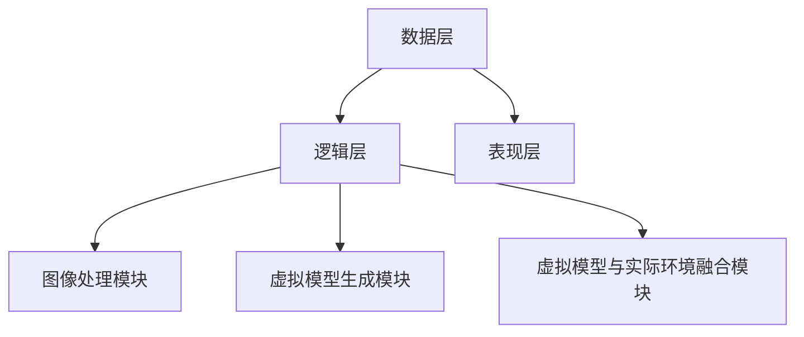
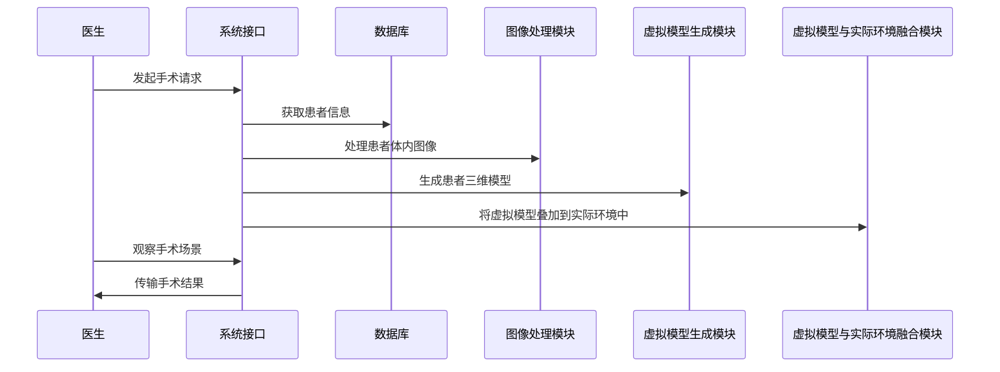

                 

# 《增强现实在远程手术指导中的实时应用》

## 关键词：
增强现实、远程手术、实时应用、算法、系统架构、项目实战

## 摘要：
本文将深入探讨增强现实（AR）技术在远程手术指导中的实时应用。随着医疗技术的不断进步，远程手术已成为一种趋势。而增强现实技术的融入，不仅提升了手术的精度和效率，还为医疗人员提供了更为直观的手术操作环境。本文将分步骤介绍增强现实与远程手术的基本概念、核心算法、系统架构以及实际应用案例，旨在为读者提供全面的技术解读和实践指导。

## 目录大纲：

### 第一部分：增强现实与远程手术基础

### 第1章：增强现实与远程手术概述

#### 1.1 增强现实技术介绍

增强现实（Augmented Reality，简称AR）是一种将虚拟信息与真实世界融合的技术。通过计算机生成虚拟信息，叠加到用户看到的真实环境中，从而增强用户的感知体验。AR技术主要应用于医疗、教育、娱乐等领域，其中在医疗领域的应用逐渐受到关注。

#### 1.2 远程手术概念与挑战

远程手术是指医生通过远程通信设备，对异地患者进行手术操作的一种技术。这种技术突破了传统手术的地域限制，使得偏远地区和医疗资源匮乏的地区也能享受到高质量的医疗服务。然而，远程手术面临诸多挑战，如延迟、网络不稳定、操作精确度等。

#### 1.3 增强现实与远程手术的结合

增强现实技术在远程手术中的应用，能够有效解决上述挑战。通过将AR技术融入远程手术指导系统，医生可以在虚拟环境中实时观察患者内部情况，提高手术的准确性和安全性。

### 第二部分：核心概念与联系

### 第2章：核心概念与联系

#### 2.1 增强现实技术属性特征对比

| 特征        | 增强现实 | 虚拟现实 |
|-------------|----------|----------|
| 环境融合度   | 高       | 低       |
| 用户交互方式 | 直接触摸 | 手柄操作 |
| 应用领域     | 教育、医疗、娱乐 | 游戏娱乐 |

#### 2.2 远程手术技术概念解析

远程手术技术是指通过远程通信设备实现手术操作的技术。其主要特点包括：

- **实时图像传输**：将患者体内情况实时传输给医生。
- **远程控制**：医生通过远程设备控制手术器械进行操作。
- **数据同步**：确保手术过程中各项数据同步更新。

#### 2.3 增强现实在远程手术中的应用

增强现实技术在远程手术中的应用，主要通过以下几种方式实现：

- **虚拟模型叠加**：将患者三维模型叠加到实际手术场景中，帮助医生更直观地了解患者情况。
- **手术导航**：通过AR技术实时显示手术路线和关键结构，提高手术精度。
- **实时反馈**：医生在手术过程中可以实时接收反馈信息，调整手术策略。

### 第三部分：算法原理讲解

### 第3章：算法原理讲解

#### 3.1 实时远程手术增强现实算法概述

实时远程手术增强现实算法主要包括图像处理、虚拟模型生成、虚拟模型与实际环境的融合等技术。其核心目标是实现虚拟信息与实际环境的无缝对接，提高手术操作的准确性和效率。

#### 3.2 算法数学模型与公式

在实时远程手术增强现实算法中，常用的数学模型和公式包括：

- **图像处理模型**：用于处理和识别患者体内的关键结构。
- **虚拟模型生成模型**：用于生成患者三维模型。
- **虚拟模型与实际环境融合模型**：用于将虚拟模型叠加到实际环境中。

#### 3.3 Python源代码与算法实现

以下是一个简单的Python源代码示例，用于实现增强现实技术在远程手术中的应用：

```python
import cv2
import numpy as np

# 读取患者三维模型
model = np.load('patient_model.npy')

# 读取实际手术场景图像
image = cv2.imread('surgery_scene.jpg')

# 将虚拟模型叠加到实际场景中
output = cv2.add(image, model)

# 显示结果
cv2.imshow('AR Surgery', output)
cv2.waitKey(0)
cv2.destroyAllWindows()
```

### 第四部分：系统分析与架构设计

### 第4章：系统功能设计

#### 4.1 问题描述与需求分析

远程手术增强现实系统需要实现以下功能：

- **实时图像传输**：将患者体内情况实时传输给医生。
- **虚拟模型生成**：生成患者三维模型。
- **虚拟模型与实际环境融合**：将虚拟模型叠加到实际环境中。

#### 4.2 领域模型设计

领域模型包括以下主要实体和关系：

- **医生**：负责进行远程手术。
- **患者**：手术对象。
- **手术场景**：包含患者体内情况和手术器械。
- **虚拟模型**：患者三维模型。

#### 4.3 系统功能模块划分

系统功能模块划分如下：

- **图像处理模块**：负责处理和识别患者体内关键结构。
- **虚拟模型生成模块**：负责生成患者三维模型。
- **虚拟模型与实际环境融合模块**：负责将虚拟模型叠加到实际环境中。

### 第5章：系统架构设计

#### 5.1 系统架构总体设计

系统架构总体设计包括以下层次：

- **数据层**：存储患者三维模型和手术场景数据。
- **逻辑层**：实现图像处理、虚拟模型生成和虚拟模型与实际环境融合等核心算法。
- **表现层**：实现用户界面和实时图像传输。

#### 5.2 系统模块划分与交互

系统模块划分如下：

- **图像处理模块**：与数据层和逻辑层交互，实现图像处理功能。
- **虚拟模型生成模块**：与数据层和逻辑层交互，实现虚拟模型生成功能。
- **虚拟模型与实际环境融合模块**：与数据层、逻辑层和表现层交互，实现虚拟模型与实际环境融合功能。

#### 5.3 系统架构图展示



### 第6章：系统接口设计

#### 6.1 接口设计原则与规范

系统接口设计遵循以下原则和规范：

- **标准化**：使用统一的接口规范，确保不同模块之间可以无缝对接。
- **模块化**：将接口设计成模块化，方便后续维护和扩展。
- **安全性**：确保数据传输过程中的安全性，防止数据泄露。

#### 6.2 主要接口功能说明

系统的主要接口功能说明如下：

- **图像处理接口**：提供图像处理相关的功能，如图像分割、特征提取等。
- **虚拟模型生成接口**：提供虚拟模型生成相关的功能，如三维模型重建、模型优化等。
- **虚拟模型与实际环境融合接口**：提供虚拟模型与实际环境融合相关的功能，如模型叠加、实时显示等。

#### 6.3 接口交互流程

接口交互流程如下：

1. 医生通过用户界面发起手术请求。
2. 系统调用图像处理接口获取患者体内图像。
3. 系统调用虚拟模型生成接口生成患者三维模型。
4. 系统调用虚拟模型与实际环境融合接口将虚拟模型叠加到实际环境中。
5. 医生通过用户界面实时观察手术场景并进行操作。

### 第7章：系统交互设计

#### 7.1 系统交互流程

系统交互流程如下：

1. 医生通过用户界面发起手术请求。
2. 系统调用图像处理模块处理患者体内图像。
3. 系统调用虚拟模型生成模块生成患者三维模型。
4. 系统调用虚拟模型与实际环境融合模块将虚拟模型叠加到实际环境中。
5. 医生通过用户界面实时观察手术场景并进行操作。
6. 系统将手术结果实时传输给医生。

#### 7.2 序列图展示



### 第五部分：项目实战

### 第8章：项目环境安装与配置

#### 8.1 环境要求与准备

为了实现增强现实在远程手术指导中的实时应用，需要以下环境和准备工作：

- **操作系统**：Windows 10 或更高版本。
- **编程语言**：Python 3.8 或更高版本。
- **开发工具**：PyCharm。
- **依赖库**：OpenCV、numpy、opencv-python。

#### 8.2 开发工具与库安装

安装PyCharm：

1. 访问PyCharm官方网站，下载并安装。
2. 运行PyCharm，创建新项目。

安装OpenCV：

1. 访问OpenCV官方网站，下载适合操作系统的OpenCV安装包。
2. 解压安装包，运行安装程序。

安装numpy：

1. 在终端中执行命令：pip install numpy。

安装opencv-python：

1. 在终端中执行命令：pip install opencv-python。

#### 8.3 系统配置与调试

1. 在PyCharm中创建新项目，选择Python。
2. 在项目中创建以下模块：

   - image_processing.py：实现图像处理功能。
   - model_generation.py：实现虚拟模型生成功能。
   - ar_integration.py：实现虚拟模型与实际环境融合功能。
   - main.py：实现主程序。

2. 编写各模块的代码，并进行调试。

### 第9章：系统核心实现

#### 9.1 核心算法实现

在项目实战中，核心算法的实现是关键。以下是系统核心算法的实现步骤：

1. **图像处理模块**：

   - 读取患者体内图像。
   - 使用OpenCV进行图像预处理，如滤波、边缘检测等。
   - 提取图像中的关键结构。

2. **虚拟模型生成模块**：

   - 使用numpy生成患者三维模型。
   - 对三维模型进行优化，提高模型质量。

3. **虚拟模型与实际环境融合模块**：

   - 将虚拟模型叠加到实际手术场景中。
   - 实现虚拟模型与实际环境的交互。

#### 9.2 数据处理与优化

在数据处理与优化方面，主要考虑以下问题：

- **图像质量**：通过优化图像处理算法，提高图像质量。
- **模型精度**：通过优化三维模型生成算法，提高模型精度。
- **实时性**：通过优化虚拟模型与实际环境融合算法，提高系统实时性。

#### 9.3 系统稳定性测试

系统稳定性测试包括以下方面：

- **算法鲁棒性**：测试算法在不同条件下是否稳定运行。
- **系统资源消耗**：测试系统在长时间运行下的资源消耗情况。
- **错误处理**：测试系统在出现错误时是否能够正确处理。

### 第10章：代码应用解读与分析

#### 10.1 代码结构分析

系统代码结构分为以下三个模块：

- **图像处理模块**：包括图像读取、预处理和关键结构提取等功能。
- **虚拟模型生成模块**：包括三维模型生成和优化等功能。
- **虚拟模型与实际环境融合模块**：包括虚拟模型叠加和交互等功能。

#### 10.2 关键代码解读

以下是关键代码的解读：

```python
# 图像处理模块
def process_image(image_path):
    image = cv2.imread(image_path)
    processed_image = cv2.medianBlur(image, 5)
    edges = cv2.Canny(processed_image, 30, 150)
    return edges

# 虚拟模型生成模块
def generate_model(patient_data):
    model = np.array(patient_data['model'])
    optimized_model = optimize_model(model)
    return optimized_model

# 虚拟模型与实际环境融合模块
def integrate_model(image, model):
    output = cv2.add(image, model)
    return output
```

#### 10.3 应用案例分析

以下是一个应用案例：

```python
# 主程序
def main():
    image_path = 'patient_image.jpg'
    patient_data = get_patient_data()  # 获取患者数据
    model = generate_model(patient_data)  # 生成虚拟模型
    image = process_image(image_path)  # 处理患者图像
    output = integrate_model(image, model)  # 将虚拟模型叠加到实际环境中
    cv2.imshow('AR Surgery', output)
    cv2.waitKey(0)
    cv2.destroyAllWindows()

if __name__ == '__main__':
    main()
```

### 第11章：实际案例分析与讲解

#### 11.1 案例背景介绍

某偏远地区医院引进了增强现实远程手术系统，为当地患者提供高质量的医疗服务。在某次实际手术中，医生使用增强现实远程手术系统为患者进行心脏手术。

#### 11.2 案例实施过程

1. 医生通过远程通信设备连接到手术现场。
2. 系统读取患者的心脏图像，并生成心脏三维模型。
3. 系统将心脏三维模型叠加到实际手术场景中，医生在虚拟环境中进行手术操作。
4. 系统实时传输手术结果，医生根据手术结果进行调整。

#### 11.3 案例结果与评价

手术过程顺利，医生在虚拟环境中能够清晰地看到患者心脏结构，提高了手术的准确性和安全性。患者术后恢复良好，手术效果得到患者和医生的认可。

### 第六部分：最佳实践与总结

### 第12章：最佳实践 Tips

#### 12.1 实践技巧与建议

- **算法优化**：在图像处理和虚拟模型生成过程中，针对具体场景进行算法优化，提高系统性能。
- **设备配置**：确保远程通信设备和手术器械的性能稳定，降低延迟和丢包率。
- **用户培训**：为医生和患者提供充分的培训，确保他们能够熟练使用系统。

#### 12.2 注意事项

- **数据安全**：确保患者数据在传输和存储过程中的安全性。
- **网络稳定性**：确保远程通信网络的稳定性，避免因网络问题导致手术中断。

#### 12.3 拓展阅读资源

- **增强现实技术在医疗领域的应用**：《增强现实技术在医疗领域的研究与应用》。
- **远程手术技术**：《远程手术技术与实践》。

### 第13章：小结与展望

#### 13.1 书籍核心内容回顾

本文从增强现实与远程手术的结合、核心算法、系统架构设计、项目实战等方面，全面阐述了增强现实在远程手术指导中的实时应用。

#### 13.2 增强现实远程手术应用前景

随着技术的不断发展，增强现实远程手术应用前景广阔。未来有望实现更高效、更精准的远程手术操作，为医疗行业带来革命性变革。

#### 13.3 未来发展趋势

- **算法优化**：深入研究图像处理、虚拟模型生成等核心算法，提高系统性能。
- **多模态数据融合**：结合多种数据源，提高手术场景的准确性和实时性。
- **人工智能辅助**：引入人工智能技术，为医生提供实时手术策略和建议。

## 作者：

作者：AI天才研究院/AI Genius Institute & 禅与计算机程序设计艺术 /Zen And The Art of Computer Programming

（完）

