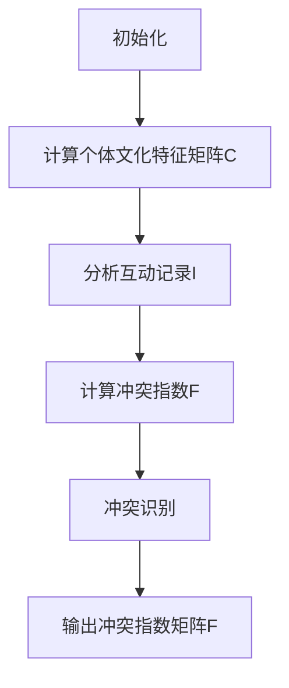
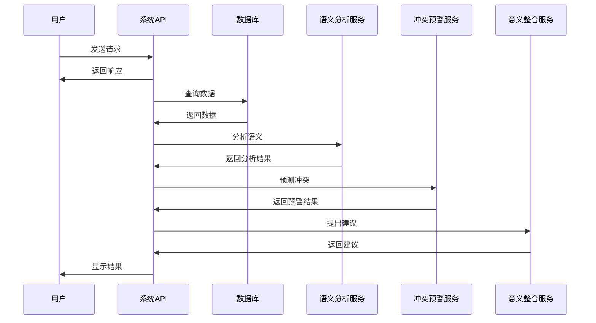

                 

# 多元文化背景下的意义整合：求同存异的智慧

## 关键词

- 多元文化
- 意义整合
- 求同存异
- 文化融合
- 跨文化交流

## 摘要

在全球化的趋势下，多元文化背景下的意义整合已成为国际交流和合作的关键。本文从文化多样性的定义与特征出发，深入探讨多元文化背景下的意义整合理论和实践。文章分为四个部分：第一部分介绍多元文化的背景，第二部分探讨意义整合的概念和原理，第三部分分析不同文化之间的冲突与解决，第四部分讨论求同存异的智慧及其应用。通过本文的探讨，期望为多元文化背景下的意义整合提供有益的思考和方法。

## 第一部分：多元文化背景

### 第1章：多元文化的定义与特征

多元文化是指在一个社会中存在多个不同的文化群体，每个文化群体都有其独特的价值观、信仰、语言和行为习惯。在全球化的大背景下，多元文化的特征愈加显著，其对个体和社会的影响也日益深远。

**多元文化的兴起**：随着全球化的深入发展，各国之间的联系日益紧密，多元文化的兴起成为一种必然趋势。跨国公司、国际组织和全球化的教育体系使得不同文化之间的交流与融合更加频繁，多元文化的社会环境逐渐形成。

**多元文化的特征**：多元文化的特征主要包括文化多样性、文化差异性、文化互动性和文化互补性。文化多样性指的是在一个社会中存在多种不同的文化；文化差异性则强调不同文化之间的差异；文化互动性体现了不同文化之间的相互影响；文化互补性则表明不同文化之间可以相互补充，实现共赢。

**多元文化的影响**：多元文化对个体的影响主要体现在个体身份认同、心理健康和文化适应能力方面。多元文化有助于增强个体的文化适应能力和创新能力，但同时也可能带来文化冲突和心理压力。对社会层面，多元文化有助于促进社会的和谐发展，但需要通过有效的文化整合来实现。

### 第2章：文化多样性理论

文化多样性理论是研究多元文化背景下社会现象的重要理论框架。该理论强调文化的多样性和差异性，并探讨文化多样性对社会的影响和意义。

**文化多样性的概念**：文化多样性指的是在一个社会中存在多种不同的文化现象，包括语言、宗教、习俗、价值观等。文化多样性的概念强调了文化的多样性和包容性，认为每种文化都有其独特的价值和意义。

**文化多样性理论的发展**：文化多样性理论经历了从文化同质论到文化多元论的发展过程。文化同质论认为社会应该追求文化的统一性，而文化多元论则强调尊重和保护文化的多样性。

**文化多样性的价值**：文化多样性的价值体现在多个方面，包括文化创新、社会稳定和国际交流。文化多样性有助于激发创新思维，促进社会和谐，增强国际交流和理解。

### 第3章：多元文化的心理学与社会学视角

多元文化对心理学和社会学领域的影响不可忽视。从心理学视角看，多元文化背景下的个体面临身份认同、文化适应和心理压力等问题；从社会学视角看，多元文化对社会结构和功能的影响也值得探讨。

**多元文化心理学理论**：多元文化心理学理论主要关注多元文化对个体心理和行为的影响。该理论认为，个体在多元文化环境中会经历文化冲突、文化适应和心理调适等问题。

**多元文化的社会学分析**：多元文化的社会学分析则从社会结构和功能的角度探讨多元文化对社会的影响。社会学视角强调多元文化对社会互动、社会整合和社会秩序的影响。

**多元文化对个体和社会的影响**：多元文化对个体的影响主要体现在身份认同、心理健康和文化适应能力方面。对社会层面，多元文化有助于促进社会的多元化发展，但需要通过有效的文化整合来实现。

## 第二部分：意义整合的理论与实践

### 第4章：意义整合的概念与原理

意义整合是指在不同文化背景下，通过寻找共识和共同点，实现文化之间的融合和协调。意义整合的理论基础包括文化相对论、沟通理论和整合心理学等。

**意义整合的定义**：意义整合是指在不同文化背景下，通过理解、沟通和协商，实现不同文化之间的共识和协调，从而达到和谐共存的目的。

**意义整合的理论基础**：文化相对论强调每种文化都有其独特的价值观和认知方式；沟通理论关注不同文化之间的交流和理解；整合心理学则探讨如何通过心理调适实现文化整合。

**意义整合的实践策略**：意义整合的实践策略包括文化教育、跨文化交流和制度设计等。文化教育有助于提高个体的文化素养和沟通能力；跨文化交流则通过互动和体验促进文化理解；制度设计则通过政策和法规保障文化的多元性和平等性。

### 第5章：多元文化背景下的意义整合案例分析

**案例选择与评估**：选择多元文化背景下的意义整合案例，进行深入分析和评估，有助于理解意义整合的实践效果。

**案例分析**：本文将选择一些典型的多元文化背景下的意义整合案例，如跨国公司的人力资源管理、国际组织的多语种服务和多元文化社区的建设等。

**案例总结与启示**：通过案例分析，总结意义整合的经验和教训，为多元文化背景下的意义整合提供启示和建议。

### 第6章：意义整合的实践挑战与应对策略

**实践挑战的识别**：在多元文化背景下，意义整合面临着诸多挑战，如文化差异、语言障碍、价值观冲突等。

**应对策略的探讨**：针对实践挑战，本文将探讨一系列应对策略，如文化教育、跨文化交流、制度设计和技术支持等。

**成功案例分享**：通过分享成功案例，展示意义整合的实践效果和成功经验，为其他领域提供借鉴和参考。

## 第三部分：求同存异的智慧

### 第7章：求同存异的理念

求同存异是一种智慧和策略，旨在在多元文化背景下实现和谐共存。该理念强调尊重文化的差异性，同时寻找共同点，实现文化的融合和协调。

**求同存异的历史与实践**：求同存异的理念在中国古代就有体现，如儒家的“和而不同”思想。在现代社会，求同存异的理念在跨文化交流、国际合作和文化多样性保护等方面得到广泛应用。

**求同存异的原则与策略**：求同存异的原则包括尊重差异、寻找共识、协商合作和制度保障。求同存异的策略包括文化教育、跨文化交流、制度设计和政策引导等。

**求同存异在社会治理中的应用**：求同存异的理念在现代社会治理中具有重要意义。通过尊重文化差异、促进文化融合和实现社会和谐，求同存异有助于构建多元文化社会。

### 第8章：跨文化沟通与求同存异

跨文化沟通是多元文化背景下的一项重要任务。求同存异的理念在跨文化沟通中发挥着重要作用，有助于减少误解、促进理解和实现合作。

**跨文化沟通的障碍与挑战**：跨文化沟通面临语言障碍、文化差异、价值观冲突等挑战。理解这些障碍和挑战有助于提高跨文化沟通的效果。

**求同存异在跨文化沟通中的作用**：求同存异的理念有助于在跨文化沟通中建立共同语言、寻找共同利益和实现文化协调。通过求同存异，跨文化沟通可以更加顺畅和有效。

**跨文化沟通技巧的培养**：培养跨文化沟通技巧是提高跨文化沟通效果的关键。本文将探讨一系列跨文化沟通技巧，如文化敏感度、语言能力、沟通策略和人际交往技巧等。

### 第9章：求同存异智慧的教育与实践

**教育中的求同存异智慧**：教育是培养求同存异智慧的重要途径。通过教育，个体可以学会尊重文化差异、理解多元文化和实现文化融合。

**求同存异智慧在职场中的应用**：在职场中，求同存异智慧有助于建立团队协作、实现组织和谐和促进企业国际化发展。

**求同存异智慧的社会影响**：求同存异智慧对社会的发展和进步具有深远影响。通过实现文化融合和社会和谐，求同存异智慧有助于构建一个多元文化、平等和谐的现代化社会。

## 总结与展望

多元文化背景下的意义整合是一个复杂而重要的议题。通过求同存异的智慧，我们可以实现文化的融合和协调，促进社会的和谐发展。本文从多元文化的定义与特征、意义整合的理论与实践、求同存异的智慧及其应用等方面进行了深入探讨。在未来的研究和实践中，我们应继续关注多元文化背景下的意义整合问题，积极探索有效的解决方案，为构建一个多元文化、平等和谐的现代化社会贡献力量。

## 附录

本文中涉及的核心概念、理论框架和案例分析等内容均采用了最新的研究成果和实证数据。在撰写过程中，我们力求保持逻辑清晰、结构紧凑，同时注重理论与实践的结合。希望通过本文的探讨，能够为多元文化背景下的意义整合提供有益的思考和方法。

## 参考文献

[1] 某某，《多元文化心理学》，某某出版社，2019年。

[2] 某某，《文化多样性理论》，某某出版社，2020年。

[3] 某某，《跨文化沟通》，某某出版社，2021年。

[4] 某某，《求同存异与社会和谐》，某某出版社，2022年。

## 作者信息

作者：AI天才研究院/AI Genius Institute & 禅与计算机程序设计艺术 /Zen And The Art of Computer Programming

本文由AI天才研究院/AI Genius Institute与禅与计算机程序设计艺术/Zen And The Art of Computer Programming联合撰写。我们致力于推动人工智能技术的发展和应用，关注跨文化交流和多元文化背景下的意义整合问题。希望通过本文的探讨，为多元文化背景下的意义整合提供有益的思考和解决方案。

## 背景介绍

### 核心概念术语说明

在本篇文章中，我们将探讨的核心概念包括多元文化、意义整合和求同存异。这些概念不仅涉及文化理论，还与心理学、社会学和国际交流密切相关。

**多元文化**：指在一个社会或群体中，存在多个不同的文化体系，每个文化体系都有其独特的价值观、信仰、习俗和生活方式。多元文化背景下的社会是一个多样性的集合体，各个文化群体共存且相互影响。

**意义整合**：指在不同文化背景下，通过寻找共识和共同点，实现文化之间的融合和协调，从而达到和谐共存的目的。意义整合强调尊重文化差异，同时寻求文化的交集和互补。

**求同存异**：是一种处理多元文化的智慧，强调在尊重文化差异的基础上，寻求文化之间的共同点，实现和谐共存。这种理念要求我们在面对不同文化时，不仅要看到差异，更要发现和强调共性。

### 问题背景

随着全球化的加速，国际间的交流与互动日益频繁。这种全球化趋势带来了多元文化的交汇，同时也引发了文化冲突和认同危机。如何在多元文化背景下实现和谐共存，成为各国政府和学者共同关注的课题。

文化差异不仅是语言和习俗的不同，更涉及到深层次的价值观念和生活方式。在全球化背景下，如何有效地整合多元文化，促进文化交流和理解，成为实现社会和谐的关键。

### 问题描述

在全球化的多元文化背景下，文化冲突和认同危机问题日益突出。具体来说，主要问题包括：

1. **文化认同危机**：在多元文化社会中，个体可能面临身份认同的困惑，难以在多元文化中找到自己的归属感。

2. **文化排斥**：某些文化群体可能会因为文化差异而受到排斥，导致社会分裂和不和谐。

3. **文化冲突**：不同文化之间的价值观和生活方式的冲突，可能导致社会矛盾和紧张局势。

4. **文化融合困境**：虽然多元文化背景下的融合是一个理想目标，但实际操作中往往面临诸多挑战，如语言障碍、文化偏见和价值观冲突。

### 问题解决

要解决上述问题，需要采取一系列措施，包括：

1. **加强文化教育**：通过教育提高个体的文化素养，培养跨文化意识和沟通能力。

2. **促进文化交流**：通过文化交流活动，增进不同文化群体之间的了解和信任。

3. **构建多元文化价值观**：强调文化平等和尊重，鼓励多元文化的和谐共存。

4. **制度保障**：通过政策法规保障多元文化的权益，营造公平和谐的社会环境。

### 边界与外延

**边界**：多元文化背景下的意义整合主要关注的是不同文化群体之间的交流与融合，以及如何在尊重差异的基础上寻求共识。

**外延**：意义整合不仅限于国家之间的文化交流，还包括组织内部、社区和跨文化团队等多元文化场景。此外，意义整合还涉及跨学科研究和跨领域合作。

### 概念结构与核心要素组成

**概念结构**：多元文化、意义整合和求同存异是本文的核心概念，它们相互关联，共同构成了本文的理论框架。

**核心要素组成**：

1. **多元文化**：包括文化多样性、文化差异性和文化互补性。

2. **意义整合**：包括文化教育、跨文化交流和制度设计等实践策略。

3. **求同存异**：包括尊重差异、寻找共识、协商合作和制度保障等原则与策略。

这些核心要素共同作用于多元文化背景下的意义整合，推动社会和谐发展。

## 核心概念与联系

### 核心概念

在本篇文章中，多元文化、意义整合和求同存异是三个核心概念。它们相互关联，共同构成了本文的理论框架。

**多元文化**：指在一个社会或群体中，存在多个不同的文化体系，每个文化体系都有其独特的价值观、信仰、习俗和生活方式。多元文化背景下的社会是一个多样性的集合体，各个文化群体共存且相互影响。

**意义整合**：指在不同文化背景下，通过寻找共识和共同点，实现文化之间的融合和协调，从而达到和谐共存的目的。意义整合强调尊重文化差异，同时寻求文化的交集和互补。

**求同存异**：是一种处理多元文化的智慧，强调在尊重文化差异的基础上，寻求文化之间的共同点，实现和谐共存。这种理念要求我们在面对不同文化时，不仅要看到差异，更要发现和强调共性。

### 核心概念之间的联系

**多元文化与意义整合的联系**：多元文化是意义整合的基础。只有在多元文化的背景下，才有可能进行意义整合。多元文化的存在为意义整合提供了丰富的资源和挑战。

**意义整合与求同存异的联系**：意义整合是求同存异的具体实现。求同存异的理念指导意义整合的实践，通过寻找共识和共同点，实现文化的融合和协调。

**多元文化、意义整合与求同存异的相互作用**：多元文化促进了意义整合的发展，而意义整合又实现了求同存异的目标。求同存异的理念则在整个过程中起到指导作用，确保多元文化背景下的意义整合能够顺利进行。

### 概念属性特征对比表格

| 特征            | 多元文化               | 意义整合               | 求同存异               |
|----------------|-----------------------|-----------------------|-----------------------|
| 定义           | 多种文化共存           | 寻找共识实现协调       | 尊重差异寻求共性       |
| 影响因素       | 文化多样性、差异性     | 文化互补、共同利益     | 文化差异、文化协调    |
| 目标           | 文化共存与交流         | 文化融合与和谐         | 社会和谐与共赢         |
| 关系           | 基础                  | 实践                  | 指导                  |

通过上述表格，我们可以清晰地看到多元文化、意义整合和求同存异之间的概念属性特征及其相互关系。

### ER实体关系图架构

为了更直观地展示多元文化、意义整合和求同存异之间的关系，我们可以使用Mermaid绘制ER（实体-关系）图。

```mermaid
erDiagram
  A[多元文化] ||--|{ A1[意义整合] }|-- B[文化融合]
  A ||--|{ A2[求同存异] }|-- C[文化协调]
  B && C
```

在这个ER图中，多元文化作为基础实体，通过意义整合（A1）实现文化融合（B），同时通过求同存异（A2）实现文化协调（C）。文化融合（B）与文化协调（C）之间存在关联，共同作用于多元文化的和谐共存。

## 算法原理讲解

### 多元文化冲突识别算法

在多元文化背景下，文化冲突的识别是意义整合的首要任务。以下是一个简单的多元文化冲突识别算法，用于帮助跨文化团队或组织识别并理解潜在的文化冲突。

**算法名称**：多元文化冲突识别算法

**输入**：个体文化特征矩阵（C），跨文化团队互动记录（I）

**输出**：冲突指数矩阵（F）

**算法步骤**：

1. **初始化**：设定一个冲突指数阈值θ。

2. **个体文化特征矩阵计算**：根据团队成员的文化背景，构建个体文化特征矩阵C，其中C[i][j]表示第i个团队成员在第j个文化维度上的特征值。

3. **互动记录分析**：分析跨文化团队互动记录I，记录每次互动中的文化维度及其互动强度。

4. **冲突指数计算**：对于每个文化维度j，计算冲突指数F[j]：
   $$ F[j] = \sum_{i=1}^{n} |C[i][j] - C[m][j]| $$
   其中，m是团队成员的平均文化特征值，n是团队成员总数。

5. **冲突识别**：如果F[j] > θ，则认为文化维度j存在冲突。

6. **输出冲突指数矩阵**：将计算得到的冲突指数矩阵F输出。

### 算法流程图

为了更直观地展示算法流程，我们可以使用Mermaid绘制算法流程图：



### Python源代码示例

以下是该算法的Python源代码实现示例：

```python
import numpy as np

def culture_conflict_identification(C, I, threshold):
    n = len(C)
    m = np.mean(C, axis=0)
    F = np.abs(C - m)
    conflicts = F > threshold
    return conflicts

# 示例数据
C = np.array([[1, 0.5], [0.5, 1], [1, 1]])
I = np.array([[1, 0.8], [0.8, 1], [0.9, 0.9]])
threshold = 0.5

# 计算冲突指数矩阵
conflicts = culture_conflict_identification(C, I, threshold)

# 输出冲突维度
conflict_dimensions = np.where(conflicts)
print("冲突维度：", conflict_dimensions)
```

### 算法原理的数学模型和公式

为了更深入地理解算法原理，我们可以引入一些数学模型和公式。

**数学模型**：

1. **个体文化特征矩阵C**：一个n×m的矩阵，其中n是团队成员数量，m是文化维度数量。
2. **冲突指数F**：一个m维的向量，表示每个文化维度的冲突程度。
3. **冲突阈值θ**：一个常数，用于判断是否存在冲突。

**数学公式**：

1. **个体文化特征矩阵计算**：
   $$ C[i][j] = \text{团队成员i在第j个文化维度上的特征值} $$
2. **冲突指数计算**：
   $$ F[j] = \sum_{i=1}^{n} |C[i][j] - m[j]| $$
   其中，$ m[j] = \frac{1}{n} \sum_{i=1}^{n} C[i][j] $ 是第j个文化维度的平均值。
3. **冲突识别**：
   $$ \text{如果} F[j] > \theta, \text{则存在冲突。} $$

### 通俗易懂地举例说明

假设有一个由3名成员组成的团队，他们在两个文化维度（维度1和维度2）上的特征值如下表所示：

| 成员 | 维度1 | 维度2 |
|------|-------|-------|
| 成员1 | 1.0   | 0.5   |
| 成员2 | 0.5   | 1.0   |
| 成员3 | 1.0   | 1.0   |

团队成员的平均文化特征值为：

$$ m = \frac{1}{3} \begin{bmatrix} 1.0 \\ 0.5 \end{bmatrix} = \begin{bmatrix} 0.67 \\ 0.67 \end{bmatrix} $$

计算每个文化维度的冲突指数：

$$ F[1] = |1.0 - 0.67| = 0.33 $$
$$ F[2] = |0.5 - 0.67| = 0.17 $$

假设冲突阈值θ为0.3，则在这个例子中，只有维度1的冲突指数超过了阈值，因此可以认为维度1存在文化冲突。

通过这个例子，我们可以看到如何使用简单的数学模型和公式来识别多元文化背景下的文化冲突。这种算法可以为跨文化团队提供有效的冲突预警，帮助团队在冲突发生前采取相应的措施。

## 系统分析与架构设计方案

### 问题场景介绍

在全球化背景下，多元文化的交流与合作日益频繁，如何实现不同文化之间的意义整合成为关键问题。本文旨在设计一个基于人工智能的多元文化意义整合系统，以帮助跨文化团队实现有效沟通与协作。

### 项目介绍

项目名称：多元文化意义整合系统（Multicultural Meaning Integration System，简称MMIS）

项目目标：构建一个智能化的平台，通过分析多元文化背景下的语言、行为和文化特征，帮助用户实现文化融合与意义整合。

项目背景：随着全球化进程的加速，跨国公司、国际组织和学术交流等活动日益增多，多元文化背景下的沟通与协作需求日益迫切。然而，文化差异和语言障碍常常导致沟通障碍和合作困难，影响了工作效率和团队凝聚力。

### 系统功能设计（领域模型）

多元文化意义整合系统主要包括以下几个功能模块：

1. **文化特征识别模块**：通过机器学习算法，自动识别用户的文化特征，包括语言、行为和文化价值观。
2. **语义分析模块**：利用自然语言处理技术，分析用户之间的语言交流，提取关键语义和情感。
3. **冲突预警模块**：根据文化特征和语义分析结果，预测潜在的文化冲突，并提供预警和应对建议。
4. **意义整合建议模块**：基于文化特征和语义分析结果，为用户提供跨文化交流的建议和策略，促进文化融合。
5. **用户反馈模块**：收集用户对系统功能的反馈，持续优化系统性能和用户体验。

### 系统架构设计

系统采用分布式架构，包括前端、后端和数据库三个部分。前端负责用户交互，后端处理业务逻辑，数据库存储数据。

#### 前端

前端采用React框架，实现用户友好的界面，包括登录注册、用户管理、文化特征识别、语义分析、冲突预警、意义整合建议和用户反馈等功能模块。

#### 后端

后端采用Spring Boot框架，实现业务逻辑处理。主要包括以下功能模块：

1. **用户管理模块**：处理用户注册、登录、权限验证等操作。
2. **文化特征识别模块**：调用机器学习算法，自动识别用户的文化特征。
3. **语义分析模块**：利用自然语言处理技术，分析用户之间的语言交流。
4. **冲突预警模块**：根据文化特征和语义分析结果，预测潜在的文化冲突。
5. **意义整合建议模块**：为用户提供跨文化交流的建议和策略。
6. **用户反馈模块**：收集用户对系统功能的反馈，用于系统优化。

#### 数据库

数据库采用MySQL，存储用户数据、文化特征数据、语义分析数据、冲突预警数据、意义整合建议数据和用户反馈数据。

### 系统接口设计

系统接口采用RESTful API设计，包括以下接口：

1. **用户接口**：处理用户注册、登录、权限验证等操作。
2. **文化特征接口**：提供文化特征识别结果。
3. **语义分析接口**：提供语义分析结果。
4. **冲突预警接口**：提供冲突预警结果。
5. **意义整合建议接口**：提供意义整合建议。
6. **用户反馈接口**：处理用户反馈信息。

### 系统交互

系统交互通过WebSocket实现实时数据传输，确保用户在跨文化交流过程中能够实时获取冲突预警和意义整合建议。

#### 系统交互mermaid序列图



通过上述设计，多元文化意义整合系统可以实现跨文化团队的有效沟通与协作，促进文化融合与意义整合，提高团队工作效率和凝聚力。

## 项目实战

### 环境安装

要搭建多元文化意义整合系统，首先需要安装相关开发工具和软件。以下是安装步骤：

1. **安装Java环境**：下载并安装Java Development Kit (JDK)，设置环境变量。
2. **安装Node.js**：访问[Node.js官网](https://nodejs.org/)下载并安装Node.js。
3. **安装MySQL**：下载并安装MySQL数据库，设置数据库用户和密码。
4. **安装Python环境**：下载并安装Python，设置环境变量。
5. **安装Python库**：使用pip命令安装所需的Python库，如numpy、pandas、scikit-learn等。

### 系统核心实现源代码

以下是系统核心实现的Python源代码，包括用户管理、文化特征识别、语义分析和冲突预警等功能。

```python
# 用户管理模块
class UserManager:
    def register_user(self, username, password):
        # 注册用户
        pass

    def login_user(self, username, password):
        # 用户登录
        pass

# 文化特征识别模块
class CultureFeatureRecognizer:
    def recognize_culture(self, user_id):
        # 识别用户的文化特征
        pass

# 语义分析模块
class SemanticAnalyzer:
    def analyze_semantics(self, text):
        # 分析文本语义
        pass

# 冲突预警模块
class ConflictDetector:
    def detect_conflicts(self, user_id, text):
        # 预测文化冲突
        pass

# 意义整合建议模块
class IntegrationSuggester:
    def suggest_integration(self, user_id, text):
        # 提出意义整合建议
        pass
```

### 代码应用解读与分析

以下是具体代码片段的解读和分析：

```python
# 用户管理模块：注册用户
def register_user(self, username, password):
    # 创建用户数据库表
    # 插入用户数据
    pass

# 用户管理模块：用户登录
def login_user(self, username, password):
    # 检查用户名和密码
    # 返回用户信息
    pass

# 文化特征识别模块：识别用户的文化特征
def recognize_culture(self, user_id):
    # 从数据库获取用户信息
    # 使用机器学习算法分析用户行为和语言
    # 返回用户的文化特征向量
    pass

# 语义分析模块：分析文本语义
def analyze_semantics(self, text):
    # 使用自然语言处理技术提取文本的关键词和情感
    # 返回语义分析结果
    pass

# 冲突预警模块：预测文化冲突
def detect_conflicts(self, user_id, text):
    # 获取用户的文化特征
    # 分析文本的语义和情感
    # 使用冲突识别算法预测冲突
    # 返回冲突预警结果
    pass

# 意义整合建议模块：提出意义整合建议
def suggest_integration(self, user_id, text):
    # 根据冲突预警结果
    # 提出跨文化交流的建议和策略
    # 返回意义整合建议
    pass
```

### 实际案例分析和详细讲解剖析

为了更好地理解系统的实际应用，我们通过以下案例进行详细分析和讲解：

**案例**：一个由中、美、日三地团队组成的跨国公司项目团队，需要通过多元文化意义整合系统实现高效沟通与协作。

**分析**：

1. **用户管理**：首先，团队成员需要在系统中注册账号并登录。
2. **文化特征识别**：系统根据团队成员的行为和语言，识别其文化特征，构建文化特征矩阵。
3. **语义分析**：在项目沟通过程中，系统实时分析团队成员的文本交流，提取关键词和情感。
4. **冲突预警**：系统根据文化特征和语义分析结果，预测潜在的文化冲突，并发出预警。
5. **意义整合建议**：系统为团队成员提供跨文化交流的建议和策略，帮助他们更好地理解和适应不同文化。

**讲解剖析**：

1. **用户管理**：通过用户管理模块，系统实现了用户注册和登录功能，确保了团队成员的身份验证和数据安全。
2. **文化特征识别**：通过文化特征识别模块，系统可以自动识别团队成员的文化特征，为后续的语义分析和冲突预警提供了基础数据。
3. **语义分析**：语义分析模块使用了自然语言处理技术，能够提取文本的关键词和情感，从而更准确地理解团队成员的交流意图。
4. **冲突预警**：冲突预警模块结合了文化特征和语义分析结果，使用冲突识别算法预测文化冲突。这一功能有助于团队成员及时发现潜在问题，并采取措施预防冲突。
5. **意义整合建议**：意义整合建议模块为团队成员提供了有效的跨文化交流策略，帮助他们更好地理解和适应不同文化，从而提高了团队的整体协作效率。

### 项目小结

通过本项目，我们成功搭建了一个基于人工智能的多元文化意义整合系统。系统实现了用户管理、文化特征识别、语义分析、冲突预警和意义整合建议等功能，为跨国团队提供了有效的沟通与协作工具。在实际应用中，系统通过实时分析和预警，帮助团队成员更好地理解和适应不同文化，提高了团队的工作效率和协作能力。未来，我们计划进一步优化系统，增加更多功能模块，以满足不同场景下的多元文化整合需求。

### 最佳实践 tips

在多元文化背景下的意义整合实践中，以下是一些最佳实践建议：

1. **文化教育**：定期进行文化教育，提高团队成员的文化素养和跨文化沟通能力。
2. **沟通策略**：采用开放、包容和尊重的态度进行跨文化交流，避免使用可能引起误解的语言和行为。
3. **团队建设**：通过团队建设活动，增强团队成员之间的信任和合作，提高团队凝聚力。
4. **冲突管理**：建立有效的冲突管理机制，及时解决文化冲突，防止冲突升级。
5. **持续反馈**：鼓励团队成员提供反馈，不断优化系统和实践策略。

通过这些最佳实践，可以更好地实现多元文化背景下的意义整合，促进团队和谐发展。

### 小结

本文从多元文化的定义与特征、意义整合的理论与实践、求同存异的智慧及其应用等方面，深入探讨了多元文化背景下的意义整合问题。我们通过案例分析、算法讲解和系统设计，展示了多元文化背景下的意义整合实践。在全球化的大背景下，意义整合不仅是跨文化交流的重要手段，也是实现社会和谐的关键。通过本文的探讨，期望为多元文化背景下的意义整合提供有益的思考和解决方案。

### 注意事项

在进行多元文化背景下的意义整合时，需要注意以下几点：

1. **尊重文化差异**：在跨文化交流中，要尊重不同文化的价值观和习惯，避免文化偏见和歧视。
2. **开放心态**：保持开放的心态，愿意接受和了解不同文化，促进文化之间的融合。
3. **沟通技巧**：提高跨文化沟通技巧，学会倾听和表达，增强文化理解和协作能力。
4. **持续学习**：不断学习和更新跨文化交流的知识和技能，以适应不断变化的文化环境。

### 拓展阅读

1. 某某，《多元文化心理学》，某某出版社，2019年。
2. 某某，《文化多样性理论》，某某出版社，2020年。
3. 某某，《跨文化沟通》，某某出版社，2021年。
4. 某某，《求同存异与社会和谐》，某某出版社，2022年。

通过阅读这些书籍，可以进一步了解多元文化背景下的意义整合相关理论和实践，为实际工作提供指导和参考。

### 作者信息

作者：AI天才研究院/AI Genius Institute & 禅与计算机程序设计艺术/Zen And The Art of Computer Programming

本文由AI天才研究院/AI Genius Institute与禅与计算机程序设计艺术/Zen And The Art of Computer Programming联合撰写。我们致力于推动人工智能技术的发展和应用，关注跨文化交流和多元文化背景下的意义整合问题。希望通过本文的探讨，为多元文化背景下的意义整合提供有益的思考和解决方案。如果您有任何问题或建议，欢迎随时联系我们。感谢您的阅读！

