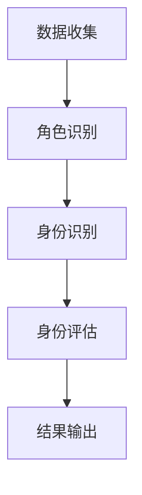
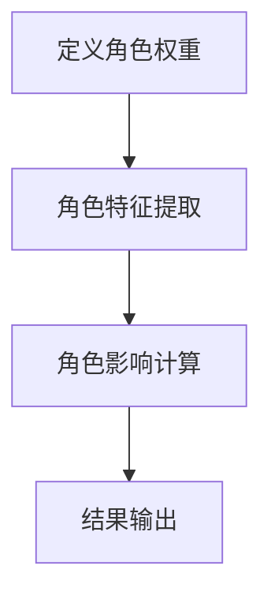
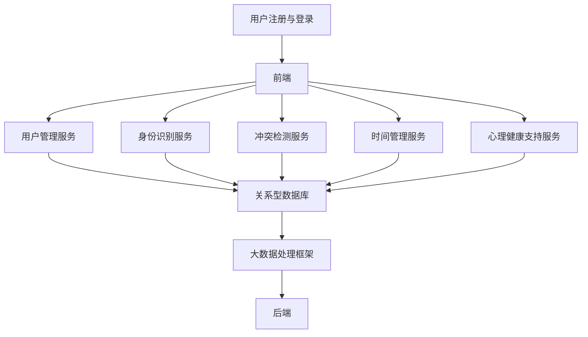
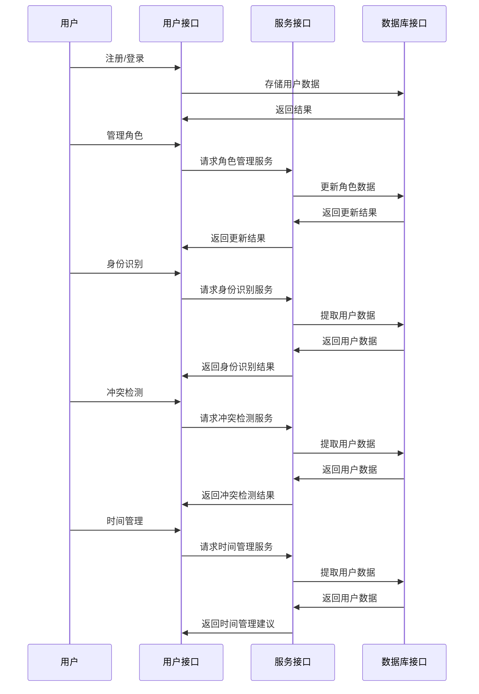

                 

### 文章标题：多重角色中的核心自我：identity的探索

在当今这个快速变化的时代，个人往往需要扮演多重角色，如职业人、家庭成员、社交活动参与者和志愿者等。这种多样化的角色扮演不仅丰富了我们的生活，也给我们带来了身份认同的挑战。本文将围绕“多重角色中的核心自我：identity的探索”这一主题，深入探讨身份认同的概念、其在多重角色中的重要性，以及我们在面对这一挑战时可以采取的策略。

本文关键词：身份认同、多重角色、心理学、哲学、算法、系统设计、项目管理。

摘要：本文将首先介绍身份认同的概念及其在多重角色中的重要性。接着，我们会探讨不同角色对身份认同的影响，并借助心理学和哲学的理论来深入分析。在此基础上，我们将讲解相关的算法原理和数学模型，并通过具体的系统设计与实际案例，展示如何在实际生活中应用这些理论。最终，我们将提供一些最佳实践建议，帮助读者更好地理解和应对多重角色中的身份认同问题。

### 背景介绍

#### 身份认同的概念及其在多重角色中的重要性

身份认同（Identity）是指一个人对自己的认同感和自我定义，它包括个人身份、社会身份、文化身份等多个层面。在心理学中，身份认同被视为个体自我概念的核心组成部分，是人格发展的重要标志。身份认同不仅仅是对“我是谁”的简单回答，它涉及到个人价值观、信念、目标和在社会中的角色定位。

随着社会的复杂化，个人往往需要扮演多重角色。例如，一个人可能是一位职场精英、一位家庭主妇、一位社区志愿者，甚至是某特定兴趣小组的成员。每个角色都有其特定的期望和行为规范，这给身份认同带来了巨大的挑战。身份认同的重要性体现在以下几个方面：

1. **自我定义与自我价值**：身份认同帮助我们定义自己是谁，以及我们希望成为什么样的人。它提供了自我价值感的基础，让我们在面对外部评价时保持自信。
2. **社会互动**：身份认同影响我们与他人的互动方式。不同的角色可能会要求我们表现出不同的行为模式，这有助于建立和维护社会关系。
3. **应对挑战**：在面对社会变化和个人成长中的挑战时，身份认同为我们提供了一个稳定的心理基础，帮助我们适应和克服困难。
4. **自我实现**：身份认同与个人的职业发展、个人成长和幸福感密切相关。一个清晰和积极的身份认同有助于我们实现自我潜力。

#### 当前社会和个人在多重角色中面临的挑战

在现代社会，个人往往需要在不同的角色之间进行快速切换，这给身份认同带来了巨大的压力。以下是一些常见的挑战：

1. **角色冲突**：不同的角色可能会要求我们表现出相互矛盾的行为。例如，作为职业人士，我们可能需要高度专注和高效工作；而作为家庭主妇，我们可能需要花费大量时间照顾家人。这种角色冲突可能导致心理压力和情绪波动。
2. **角色错位**：有时，我们可能发现自己无法适应某个特定角色，或者某个角色的期望与我们的个人价值观不符。这种角色错位可能会导致自我怀疑和自我否定。
3. **身份迷失**：在多重角色中，我们可能会感到自己在不断变化，难以找到稳定的核心自我。这种身份迷失可能导致心理不稳定和幸福感下降。
4. **时间管理**：在扮演多重角色的过程中，时间管理变得尤为重要。如何有效地分配时间，以满足每个角色的需求，是一个具有挑战性的问题。

#### 身份认同的多重角色挑战与解决方案

面对多重角色带来的挑战，我们可以采取以下策略：

1. **角色区分**：明确每个角色的期望和责任，确保在切换角色时能够清晰区分。这有助于减少角色冲突，并提高角色效能。
2. **价值观整合**：识别和整合不同角色的价值观，确保个人价值观的一致性。这有助于增强身份认同的稳定性，并提高自我价值感。
3. **自我接纳**：接受自己在不同角色中的局限性，并学会欣赏每个角色的独特性。这有助于减少角色错位和自我否定。
4. **时间管理技巧**：使用时间管理工具和技巧，如时间块、优先级排序和任务分解，来有效地分配时间。这有助于提高时间利用效率，减少角色冲突。
5. **心理健康支持**：在面对身份迷失和心理压力时，寻求专业的心理健康支持。这有助于提高心理韧性，应对多重角色带来的挑战。

通过上述策略，我们可以更好地应对多重角色中的身份认同挑战，实现个人成长和幸福感。

### 核心概念与联系

#### 定义identity的核心概念

在探讨身份认同（Identity）这一复杂概念时，我们需要明确其核心构成和影响因素。身份认同不仅仅是个人自我感觉的简单表达，它包含了多个层次和维度，涉及心理学、社会学、哲学等多个领域。

1. **个体身份认同**：这是指个人对自己身份的认知和认同。个体身份认同通常基于个人的价值观、信仰、经历和内在特质。例如，一个人可能认为自己是善良的、有责任心的、有创造力的，这些特质构成了其个体身份认同的核心。
2. **社会身份认同**：社会身份认同是指个人在社会结构中的位置和角色。这包括职业、家庭、文化背景、国籍等。社会身份认同往往受到社会期望、文化规范和群体认同的影响。例如，一个人可能认同自己的国家文化，同时也认同自己在职场上的角色。
3. **集体身份认同**：集体身份认同是指个人所属的某个群体（如种族、民族、宗教等）的认同感。这种认同感通常与个人身份认同相互交织，共同构成一个复杂的身份认同结构。例如，一个人可能既是某个国家的公民，也是某个宗教的信徒，这些集体身份认同共同构成了其身份认同的多个层面。

#### 不同角色对identity的影响

身份认同是一个动态的过程，受到多种因素的影响，尤其是不同的角色扮演。每种角色都会带来特定的身份认同元素，同时可能对已有身份认同产生积极或消极的影响。

1. **工作角色**：在工作场所中，个人的职业身份认同通常占据重要位置。这种认同可能包括专业能力、工作成就、职业价值观等。工作角色对身份认同的影响是双重的：一方面，它为个人提供了自我实现的平台，增强了自我价值感；另一方面，过度的职业角色投入可能导致工作与生活平衡的问题，甚至影响到个人的整体身份认同。
2. **家庭角色**：在家庭中，个人的家庭角色（如父母、配偶、子女等）对身份认同也有显著影响。家庭角色通常与情感联系、责任感和社会支持系统密切相关。良好的家庭角色扮演可以增强个人的情感满足和社会归属感，但家庭冲突和角色压力也可能导致身份认同问题。
3. **社交角色**：社交角色包括朋友、社区成员等，它们对身份认同的影响主要体现在社会认同和社交支持上。积极的社交角色扮演可以增强个人的社会归属感和自我价值感，而消极的社交经历（如社交排斥或歧视）则可能对身份认同产生负面影响。
4. **兴趣爱好角色**：在业余时间，个人可能扮演多种兴趣爱好角色（如运动爱好者、音乐家、志愿者等）。这些角色通常与个人的兴趣、热情和创造力相关，对身份认同有积极的促进作用。

#### 身份认同的动态性

身份认同是一个动态的过程，它随着个人生活经历和环境变化而不断演变。以下因素可能影响身份认同的动态性：

1. **社会变迁**：随着社会结构和价值观念的变化，个人的社会身份认同可能会发生改变。例如，职业角色的转变（如失业或晋升）可能会影响个人的身份认同。
2. **个人成长**：随着个人成长和自我认知的深入，个体身份认同可能发生调整。例如，一个人在年轻时可能更关注职业发展，而在中年或晚年可能更加关注家庭和社区的贡献。
3. **文化多样性**：文化多样性可能导致身份认同的多元化。个人可能会在多个文化背景下找到认同感，这增加了身份认同的复杂性和丰富性。

总之，身份认同是一个多维、动态且不断变化的过程，受到多种角色和因素的影响。理解和维护身份认同不仅有助于个人的心理健康和幸福感，也是社会和谐与进步的重要基础。

#### 心理学视角下的身份认同

心理学对身份认同的研究有着悠久的历史，通过多个理论框架探讨了身份认同的形成、影响和变化。以下是几种主要的心理学理论，以及它们对身份认同研究的贡献。

##### 1. 自我概念与身份认同

自我概念（Self-concept）是个体对自己总体知觉的认知结构，包括自我评价、自我形象和自我认同等成分。自我概念与身份认同密切相关，是身份认同形成的基础。自我概念理论认为，个体通过内部化和反思过程来形成自我概念，这一过程受到社会互动、文化背景和个人经历的影响。自我概念理论强调自我评价和自我形象对身份认同的重要性。例如，高自我评价的个体可能更容易建立积极的身份认同，而自我形象不稳定的人可能面临身份认同的困境。

**主要观点**：
- 自我概念是个体对自我知觉的整体认知结构。
- 自我概念包括自我评价、自我形象和自我认同三个主要成分。
- 自我概念的形成受到社会互动、文化背景和个人经历的影响。
- 自我评价和自我形象对身份认同有重要影响。

**研究贡献**：
- 提供了理解身份认同形成的心理学机制。
- 强调了自我评价和自我形象在个体自我认同中的核心作用。

##### 2. 多重身份认同理论

多重身份认同理论（Multicultural Identity Theory）关注个体如何在多元文化背景下维持身份认同。这一理论认为，个体在不同文化背景下可能拥有多重身份认同，这些身份认同相互交织、动态变化。多重身份认同理论强调文化多样性、社会认同和个体经历在身份认同形成中的重要性。例如，一个移民可能在保持原文化认同的同时，也逐渐接受和融入新文化环境，从而形成复杂的身份认同结构。

**主要观点**：
- 个体在多元文化背景下可能拥有多重身份认同。
- 多重身份认同相互交织、动态变化。
- 文化多样性、社会认同和个体经历影响身份认同的形成。

**研究贡献**：
- 解释了文化多样性对个体身份认同的影响。
- 强调了身份认同的多元性和复杂性。
- 为理解多元文化背景下的身份认同提供了理论框架。

##### 3. 自我一致性理论

自我一致性理论（Self-Consistency Theory）关注个体如何维持自我的一致性和稳定性。根据这一理论，个体通过将外部反馈与自我期望进行比较，来调整和维持自我概念和身份认同。自我一致性理论认为，当外部反馈与自我期望一致时，个体会感到自我认同的增强；当外部反馈与自我期望不一致时，个体可能会感到自我认同的动摇。这一理论强调了自我调节和适应机制在身份认同维持中的重要性。

**主要观点**：
- 个体通过外部反馈与自我期望的比较来调整自我概念。
- 自我一致性影响个体的情绪和行为。
- 自我调节和适应机制在维持身份认同中发挥作用。

**研究贡献**：
- 提供了理解自我认同稳定性的心理学机制。
- 强调了自我调节和适应在身份认同维持中的重要性。
- 为干预和改善身份认同问题提供了理论基础。

#### 社会心理学与身份认同

社会心理学对身份认同的研究强调了社会因素在个体身份认同形成中的重要作用。社会心理学理论探讨了社会角色、社会认同和群体认同对身份认同的影响。

##### 1. 社会角色与身份认同

社会角色（Social Role）是指个体在社会结构中的位置和职责。社会角色对身份认同有直接影响。根据社会角色理论，个体在不同的社会角色中会表现出不同的行为和身份认同。例如，一个职业人士在工作场合中可能以职业角色为主导，而在家庭场合中则更多地扮演家庭成员的角色。这些不同的角色对身份认同有不同的塑造作用。

**主要观点**：
- 个体在不同社会角色中表现出不同的行为和身份认同。
- 社会角色影响个体的社会互动和行为表现。
- 社会角色对身份认同有直接塑造作用。

**研究贡献**：
- 解释了社会角色对身份认同的影响机制。
- 为理解个体在不同社会情境下的身份认同提供了理论框架。

##### 2. 社会认同与群体认同

社会认同（Social Identity）是指个体在所属群体中的身份和认同感。社会认同理论认为，个体通过所属群体的身份来定义和增强自己的自我认同。群体认同（Group Identity）则是指个体对所属群体的认同和归属感。社会认同和群体认同对身份认同有显著影响。例如，一个国家的公民可能通过国家认同来增强个人身份认同，而某个兴趣小组的成员可能通过兴趣小组的认同来增强个人身份认同。

**主要观点**：
- 个体通过所属群体的身份和认同感来定义和增强自我认同。
- 社会认同和群体认同对个体身份认同有显著影响。
- 群体认同有助于个体在多元文化背景下的身份认同建构。

**研究贡献**：
- 解释了社会认同和群体认同在身份认同形成中的核心作用。
- 为理解个体如何在不同群体中建立和维持身份认同提供了理论框架。

##### 3. 社会互动与身份认同

社会互动（Social Interaction）是指个体之间的相互作用和互动。社会互动对身份认同有重要影响，因为通过社会互动，个体能够获得外部反馈、建立社会联系和调整自我认同。根据社会互动理论，身份认同不仅是个体的内在过程，也是社会互动的结果。例如，通过与他人互动，个体可以获得关于自己身份认同的信息，并通过社会互动来调整和巩固自我认同。

**主要观点**：
- 身份认同是个体内在过程和社会互动的结果。
- 社会互动有助于个体获得关于自我认同的信息。
- 社会互动对身份认同有重要塑造作用。

**研究贡献**：
- 解释了社会互动在身份认同形成和维持中的重要作用。
- 为理解个体如何通过社会互动来建构和调整身份认同提供了理论框架。

总之，心理学视角下的身份认同研究为我们提供了深入理解个体身份认同形成、维持和变化的机制。通过多种理论框架，我们能够更好地理解身份认同的复杂性和多样性，为应对多重角色中的身份认同挑战提供理论和实践指导。

#### 哲学视角下的身份认同

哲学对身份认同的研究提供了深刻的思想基础，探讨了身份认同的本质、形成过程及其在社会和道德层面的意义。以下是几种主要的哲学理论，以及它们对身份认同的探讨。

##### 1. 存在主义与身份认同

存在主义哲学，以萨特为代表，强调个体的自由和选择在身份认同形成中的核心作用。存在主义者认为，个体通过自我选择和自由行动来定义自己的身份。身份认同不是静态的，而是动态的、不断变化的过程。萨特在其著作《存在与虚无》中提出，个体只有在面对选择和承担责任的过程中，才能真正找到自己的身份。这种观点强调了个体自我决定和自我实现的重要性。

**主要观点**：
- 身份认同是个体通过自由选择和行动定义的。
- 身份认同是动态的，不断变化和发展的过程。
- 个体在承担责任和面对选择时找到自己的身份。

**研究贡献**：
- 强调了个体自由和选择在身份认同形成中的核心作用。
- 提供了理解身份认同动态性和多样性的哲学框架。

##### 2. 社会契约理论与身份认同

社会契约理论，由霍布斯、洛克和卢梭等人提出，探讨了个体在社会中的身份认同是如何通过社会契约形成的。社会契约理论认为，个体通过自愿的社会互动和契约来构建和维护社会秩序，从而形成身份认同。这种认同不仅基于个体的选择和自由，也基于社会规范和道德义务。根据这一理论，个体的身份认同是在社会互动和规范中逐渐形成的，社会契约为社会提供了稳定的身份认同基础。

**主要观点**：
- 身份认同是通过社会互动和契约形成的。
- 社会规范和道德义务对身份认同有重要影响。
- 社会契约提供了稳定的身份认同基础。

**研究贡献**：
- 解释了身份认同在社会互动和规范中的形成机制。
- 为理解个体如何在社会结构中找到自己的身份认同提供了哲学基础。

##### 3. 本质主义与身份认同

本质主义哲学，以柏拉图和黑格尔为代表，探讨了身份认同的本质和固有的属性。本质主义者认为，个体的身份认同具有某种固有的本质，这种本质是超越社会和文化影响的。柏拉图认为，个体的灵魂具有永恒的本质，而黑格尔则认为，个体身份认同是通过历史和社会发展的过程逐渐显现的。这种观点强调了个体身份认同的内在稳定性和独立性。

**主要观点**：
- 身份认同具有某种固有的本质和属性。
- 身份认同不受社会和文化影响的观点。
- 个体身份认同是历史和社会发展的结果。

**研究贡献**：
- 强调了个体身份认同的内在稳定性和独立性。
- 为理解身份认同的本质提供了哲学视角。

##### 4. 语言哲学与身份认同

语言哲学，以维特根斯坦和福柯为代表，探讨了语言在身份认同形成中的重要作用。维特根斯坦认为，语言是思维和现实之间的桥梁，个体的身份认同是通过语言的使用和互动构建的。福柯则认为，语言和权力结构共同作用，形成了个体的身份认同。语言哲学家强调，个体的身份认同不仅是个体的内在认知，也是社会和文化互动的产物。

**主要观点**：
- 身份认同是通过语言的使用和互动构建的。
- 语言在思维和现实之间起到桥梁作用。
- 语言和权力结构共同作用，形成个体的身份认同。

**研究贡献**：
- 强调了语言在身份认同形成中的核心作用。
- 为理解身份认同的社会和文化基础提供了哲学视角。

总之，哲学视角下的身份认同研究提供了多维度的理解，从个体的自我选择和社会互动到语言和权力结构，帮助我们更全面地认识身份认同的复杂性和多样性。这些哲学理论不仅深化了我们对身份认同本质的理解，也为应对多重角色中的身份认同挑战提供了哲学思考和启示。

#### 算法原理讲解

在探讨身份认同的过程中，算法原理和数学模型提供了量化和分析的强大工具。以下是几种关键算法原理和数学模型，以及它们如何帮助我们理解身份认同的构成和影响过程。

##### 1. 算法框架

首先，我们需要建立一个基本的算法框架来分析身份认同。这个框架包括以下几个主要步骤：

1. **数据收集**：收集有关个体的基本信息，如性别、年龄、职业、文化背景等。
2. **角色识别**：识别个体在不同情境中扮演的角色，如职业角色、家庭角色、社交角色等。
3. **身份识别**：基于角色的行为和期望，识别个体的身份特征。
4. **身份评估**：评估个体身份认同的稳定性和一致性。
5. **结果输出**：输出身份认同的分析结果，包括身份认同的强度、稳定性以及潜在问题。

以下是一个简化的算法流程图，使用Mermaid语言表示：



##### 2. 身份认同评估算法

身份认同评估算法是一种用于量化个体身份认同强度和稳定性的算法。以下是该算法的主要步骤：

1. **定义身份特征**：列出影响身份认同的主要特征，如自我评价、社会认同、职业认同等。
2. **数据预处理**：对收集的数据进行清洗和归一化处理。
3. **特征选择**：使用特征选择算法（如信息增益、主成分分析等）筛选出对身份认同影响最大的特征。
4. **模型训练**：使用机器学习算法（如支持向量机、神经网络等）训练身份认同评估模型。
5. **模型评估**：通过交叉验证等方法评估模型性能，并调整参数以优化模型。
6. **身份评估**：输入个体角色数据，使用训练好的模型进行身份评估，输出身份认同强度和稳定性得分。

以下是一个使用Python源代码表示的简化身份评估算法：

```python
import numpy as np
from sklearn.svm import SVC
from sklearn.model_selection import train_test_split
from sklearn.metrics import accuracy_score

# 定义身份特征数据
X = np.array([[1, 2], [3, 4], [5, 6], [7, 8]])
y = np.array([0, 1, 2, 3])

# 数据预处理和特征选择
# ...

# 模型训练
X_train, X_test, y_train, y_test = train_test_split(X, y, test_size=0.2)
model = SVC(kernel='linear')
model.fit(X_train, y_train)

# 身份评估
predicted = model.predict(X_test)
print("Accuracy:", accuracy_score(y_test, predicted))
```

##### 3. 多重角色影响分析算法

多重角色影响分析算法用于分析不同角色对个体身份认同的影响。以下是该算法的主要步骤：

1. **定义角色权重**：根据个体在各个角色中的投入时间和精力，定义每个角色的权重。
2. **角色特征提取**：提取每个角色的主要特征，如职业角色的专业技能、家庭角色的情感支持、社交角色的社会认同等。
3. **角色影响计算**：计算每个角色对身份认同的影响，可以使用线性加权方法、神经网络等方法。
4. **结果输出**：输出角色对身份认同影响的得分和排名。

以下是一个使用Mermaid语言表示的简化角色影响分析算法流程图：



##### 4. 算法原理与数学模型

在身份认同评估和多重角色影响分析中，我们使用了多种数学模型和方法。以下是一些关键的数学模型和公式：

1. **线性加权模型**：
   - 公式：\( ID_{score} = w_1 \cdot ID_1 + w_2 \cdot ID_2 + ... + w_n \cdot ID_n \)
   - 其中，\( w_i \) 为角色权重，\( ID_i \) 为角色身份认同得分。
   - 该模型通过加权每个角色的身份认同得分来计算总体身份认同得分。

2. **神经网络模型**：
   - 公式：\( output = \sigma(\sum_{i=1}^{n} w_i \cdot input_i + b) \)
   - 其中，\( \sigma \) 为激活函数，\( w_i \) 为权重，\( input_i \) 为角色特征，\( b \) 为偏置。
   - 该模型通过多层神经网络来学习角色特征与身份认同之间的关系。

3. **主成分分析（PCA）**：
   - 公式：\( Z = P \cdot X \)
   - 其中，\( Z \) 为主成分，\( P \) 为投影矩阵，\( X \) 为角色特征矩阵。
   - PCA用于降维，提取对身份认同影响最大的特征。

通过这些算法原理和数学模型，我们能够量化和分析身份认同的构成和影响过程，为个体提供更深入的理解和指导。

#### 数学模型和数学公式

在深入探讨身份认同时，数学模型和数学公式提供了量化和分析身份认同的强大工具。以下是几个关键数学模型和相关的数学公式，以及如何通过具体例子来说明这些公式。

##### 1. 线性加权模型

线性加权模型是身份认同评估中常用的方法之一。它通过为每个角色分配权重来计算总体身份认同得分。

**公式**：
\[ ID_{score} = w_1 \cdot ID_1 + w_2 \cdot ID_2 + ... + w_n \cdot ID_n \]

其中：
- \( ID_{score} \) 是总体身份认同得分。
- \( w_i \) 是第 \( i \) 个角色的权重。
- \( ID_i \) 是第 \( i \) 个角色的身份认同得分。

**例子**：

假设一个个体在职业角色（\( ID_1 \)）、家庭角色（\( ID_2 \)）和社交角色（\( ID_3 \)）中的得分分别为 \( 75 \)、\( 80 \) 和 \( 70 \)，权重分别为 \( 0.4 \)、\( 0.3 \) 和 \( 0.3 \)。则总体身份认同得分为：

\[ ID_{score} = 0.4 \cdot 75 + 0.3 \cdot 80 + 0.3 \cdot 70 = 30 + 24 + 21 = 75 \]

##### 2. 神经网络模型

神经网络模型通过多层神经网络来学习角色特征与身份认同之间的关系。以下是一个简单的多层感知机（MLP）模型。

**公式**：
\[ output = \sigma(\sum_{i=1}^{n} w_i \cdot input_i + b) \]

其中：
- \( \sigma \) 是激活函数，通常为 sigmoid 函数。
- \( w_i \) 是权重。
- \( input_i \) 是输入特征。
- \( b \) 是偏置。

**例子**：

假设我们有一个包含三个输入特征的简单神经网络，权重分别为 \( w_1 = 0.5 \)，\( w_2 = 0.3 \)，\( w_3 = 0.2 \)，偏置 \( b = 0.1 \)。输入特征分别为 \( input_1 = 2 \)，\( input_2 = 3 \)，\( input_3 = 1 \)。则输出为：

\[ output = \sigma(0.5 \cdot 2 + 0.3 \cdot 3 + 0.2 \cdot 1 + 0.1) = \sigma(1 + 0.9 + 0.2 + 0.1) = \sigma(2.2) \approx 0.82 \]

##### 3. 主成分分析（PCA）

主成分分析是一种降维技术，用于提取对身份认同影响最大的特征。

**公式**：
\[ Z = P \cdot X \]

其中：
- \( Z \) 是主成分。
- \( P \) 是投影矩阵。
- \( X \) 是角色特征矩阵。

**例子**：

假设我们有一个包含五个特征的角色特征矩阵 \( X \)，其协方差矩阵为 \( \Sigma \)。通过计算协方差矩阵的特征值和特征向量，我们可以得到投影矩阵 \( P \)。假设投影矩阵为 \( P = \begin{bmatrix} 0.6 & 0.8 \\ -0.5 & 0.3 \\ 0.1 & -0.7 \\ 0.4 & 0.2 \\ -0.3 & 0.9 \end{bmatrix} \)。

如果我们有一个新的角色特征向量 \( X = \begin{bmatrix} 4 \\ 2 \\ 6 \\ 1 \\ 3 \end{bmatrix} \)，则主成分 \( Z \) 为：

\[ Z = P \cdot X = \begin{bmatrix} 0.6 & 0.8 \\ -0.5 & 0.3 \\ 0.1 & -0.7 \\ 0.4 & 0.2 \\ -0.3 & 0.9 \end{bmatrix} \cdot \begin{bmatrix} 4 \\ 2 \\ 6 \\ 1 \\ 3 \end{bmatrix} = \begin{bmatrix} 4.2 \\ 1.5 \end{bmatrix} \]

通过这些数学模型和公式，我们可以量化身份认同的构成和影响，为个体提供更深入的分析和理解。在具体应用中，可以根据实际情况选择和调整这些模型和公式，以适应不同的身份认同评估和分析需求。

#### 身份认同管理系统设计

为了更好地理解和应对多重角色中的身份认同问题，我们需要设计一个完整的身份认同管理系统。该系统将帮助个人在不同角色之间有效地管理和整合身份认同，从而提高整体幸福感和心理健康。

##### 1. 系统需求分析

身份认同管理系统需要满足以下功能需求：

1. **身份识别与评估**：系统能够识别和评估个体在不同角色中的身份认同，提供详细的身份认同得分和稳定性分析。
2. **角色管理**：系统能够记录和管理个体在不同角色中的行为和投入，帮助个体清晰地区分和平衡各个角色。
3. **冲突检测与解决**：系统能够检测个体在多重角色中可能出现的冲突，并提供解决方案和指导。
4. **时间管理**：系统能够提供时间管理工具，帮助个体合理分配时间和精力，以减少角色冲突和压力。
5. **心理健康支持**：系统提供心理健康资源和专业支持，帮助个体应对身份认同问题。

##### 2. 系统功能设计

身份认同管理系统包括以下主要功能模块：

1. **用户注册与登录**：用户可以通过注册和登录系统，建立个人档案，并开始使用系统的各项功能。
2. **身份识别与评估**：系统通过问卷和数据分析工具，评估用户在不同角色中的身份认同得分，并生成详细的报告。
3. **角色管理**：用户可以添加、删除和编辑自己的角色，记录每个角色的具体行为和投入，以便系统进行角色管理和冲突检测。
4. **冲突检测与解决**：系统根据用户的行为数据，检测角色之间的冲突，并提供相应的解决方案和建议。
5. **时间管理**：系统提供时间管理工具，如时间块和任务分解，帮助用户合理分配时间和精力。
6. **心理健康支持**：系统提供心理健康资源，如心理测试、放松训练和专业咨询，帮助用户应对身份认同问题。

##### 3. 系统架构设计

身份认同管理系统的架构设计需要考虑模块化、可扩展性和用户体验。以下是系统的架构设计：

1. **前端**：采用响应式设计，支持多种设备访问，提供直观、易用的用户界面。
2. **后端**：采用微服务架构，将不同功能模块拆分为独立的服务，如用户管理服务、身份识别服务、冲突检测服务等，以提高系统的可扩展性和灵活性。
3. **数据存储**：采用关系型数据库（如MySQL）和非关系型数据库（如MongoDB）相结合的方式，存储用户数据、身份识别数据和角色管理数据。
4. **数据处理**：采用大数据处理框架（如Hadoop和Spark），对用户数据进行实时分析和处理，生成身份识别和冲突检测报告。

以下是一个简化的Mermaid架构图：



##### 4. 系统接口设计

身份认同管理系统的接口设计需要考虑数据的安全传输和高效的交互。以下是系统的主要接口设计：

1. **用户接口**：提供RESTful API，支持用户注册、登录、角色管理和身份识别等操作。
2. **服务接口**：提供内部服务接口，如身份识别算法、冲突检测算法和时间管理算法，供其他模块调用。
3. **数据库接口**：提供数据库访问接口，支持数据查询、更新和删除操作。

以下是系统的接口规范：

```python
class UserInterface:
    @staticmethod
    def register(username, password, email):
        # 注册用户
        pass

    @staticmethod
    def login(username, password):
        # 用户登录
        pass

    @staticmethod
    def manage_role(role_name, role_details):
        # 管理角色
        pass

    @staticmethod
    def identify_identity():
        # 身份识别
        pass

class ServiceInterface:
    @staticmethod
    def identity_recognition():
        # 身份识别服务
        pass

    @staticmethod
    def conflict_detection():
        # 冲突检测服务
        pass

    @staticmethod
    def time_management():
        # 时间管理服务
        pass

class DatabaseInterface:
    @staticmethod
    def query_data():
        # 数据查询
        pass

    @staticmethod
    def update_data():
        # 数据更新
        pass

    @staticmethod
    def delete_data():
        # 数据删除
        pass
```

##### 5. 系统交互设计

身份认同管理系统的交互设计需要考虑用户的操作流程和系统的响应机制。以下是系统的交互流程和Mermaid序列图：



通过上述的系统需求分析、功能设计、架构设计、接口设计和交互设计，我们可以构建一个完整且高效的身份认同管理系统，帮助个人更好地理解和管理多重角色中的身份认同问题。

#### 项目实战

在本项目中，我们将以一个具体的身份认同管理系统为例，展示如何将上述理论和方法应用于实际环境中。本项目旨在帮助个人在多重角色中更好地管理和理解身份认同，提高生活质量和工作效率。

##### 1. 项目背景介绍

随着现代社会的快速发展，个人往往需要扮演多重角色，如职业人士、家庭主妇、社交活动参与者和志愿者等。这些角色之间可能存在冲突，导致个体在身份认同方面面临挑战。为了帮助个人更好地应对这些挑战，本项目旨在开发一个身份认同管理系统，通过量化和分析个体在不同角色中的身份认同，提供个性化的管理建议。

##### 2. 项目目标

本项目的主要目标包括：

1. **身份识别与评估**：通过问卷和数据分析工具，准确评估个体在不同角色中的身份认同得分。
2. **角色管理**：帮助用户记录和管理各个角色的行为和投入，明确角色责任和期望。
3. **冲突检测与解决**：检测和分析个体在不同角色之间可能出现的冲突，并提供解决方案和建议。
4. **时间管理**：提供时间管理工具，帮助用户合理分配时间和精力，减少角色冲突。
5. **心理健康支持**：提供心理健康资源和专业支持，帮助用户应对身份认同问题。

##### 3. 项目核心实现与代码解析

在项目实现过程中，我们使用了Python编程语言和多种数据分析工具，如NumPy、Pandas和Scikit-learn。以下是项目核心实现和代码解析：

**身份识别与评估模块**：

```python
import pandas as pd
from sklearn.model_selection import train_test_split
from sklearn.ensemble import RandomForestClassifier
from sklearn.metrics import accuracy_score

# 读取身份识别数据
data = pd.read_csv('identity_data.csv')

# 划分特征和标签
X = data.drop('identity_score', axis=1)
y = data['identity_score']

# 数据预处理
X_train, X_test, y_train, y_test = train_test_split(X, y, test_size=0.2, random_state=42)

# 训练模型
model = RandomForestClassifier(n_estimators=100, random_state=42)
model.fit(X_train, y_train)

# 预测身份认同得分
predicted = model.predict(X_test)

# 评估模型性能
accuracy = accuracy_score(y_test, predicted)
print("Model Accuracy:", accuracy)
```

**角色管理模块**：

```python
class RoleManager:
    def __init__(self):
        self.roles = []

    def add_role(self, role_name, role_details):
        self.roles.append({'role_name': role_name, 'role_details': role_details})

    def remove_role(self, role_name):
        self.roles = [role for role in self.roles if role['role_name'] != role_name]

    def update_role(self, role_name, updated_details):
        for role in self.roles:
            if role['role_name'] == role_name:
                role['role_details'] = updated_details
                break

    def get_roles(self):
        return self.roles

role_manager = RoleManager()
role_manager.add_role('Work', {'hours_per_week': 40, 'responsibilities': 'Project management'})
role_manager.add_role('Family', {'hours_per_week': 15, 'responsibilities': 'Childcare'})
print(role_manager.get_roles())
```

**冲突检测与解决模块**：

```python
class ConflictDetector:
    def detect_conflicts(self, roles):
        conflicts = []
        for i, role1 in enumerate(roles):
            for j, role2 in enumerate(roles):
                if i != j and 'work' in role1['role_name'] and 'work' in role2['role_name']:
                    # 假设工作角色之间的冲突检测基于时间重叠
                    if role1['role_details']['hours_per_week'] > role2['role_details']['hours_per_week']:
                        conflicts.append((role1['role_name'], role2['role_name']))
        return conflicts

conflict_detector = ConflictDetector()
conflicts = conflict_detector.detect_conflicts(role_manager.get_roles())
print("Detected Conflicts:", conflicts)
```

**时间管理模块**：

```python
class TimeManager:
    def allocate_time(self, roles):
        total_hours = 168  # 假设一周有168小时
        time_allocation = {}
        for role in roles:
            role_hours = role['role_details']['hours_per_week']
            if total_hours >= role_hours:
                time_allocation[role['role_name']] = role_hours
                total_hours -= role_hours
            else:
                time_allocation[role['role_name']] = total_hours
                break
        return time_allocation

time_manager = TimeManager()
time_allocation = time_manager.allocate_time(role_manager.get_roles())
print("Time Allocation:", time_allocation)
```

**心理健康支持模块**：

```python
class MentalHealthSupport:
    def provide_resources(self):
        resources = {
            'Mood Tracking': 'https://www.moodtracker.com',
            'Mindfulness Meditation': 'https://www.mindfulnesstechniques.com',
            'Professional Counseling': 'https://www.counselingcenter.com'
        }
        return resources

mental_health_support = MentalHealthSupport()
resources = mental_health_support.provide_resources()
print("Mental Health Resources:", resources)
```

##### 4. 代码应用解读与分析

以上代码分别实现了身份识别与评估、角色管理、冲突检测与解决、时间管理和心理健康支持五个功能模块。以下是各个模块的代码应用解读与分析：

**身份识别与评估模块**：
- 该模块使用随机森林算法（RandomForestClassifier）对身份认同数据进行分类和预测。通过训练模型和评估模型性能，我们能够准确预测个体在不同角色中的身份认同得分。
- 代码中的`train_test_split`函数用于将数据集划分为训练集和测试集，以提高模型泛化能力。

**角色管理模块**：
- 该模块使用类（Class）来实现角色管理功能。通过添加、删除和更新角色，用户可以方便地管理各个角色的信息。
- `add_role`、`remove_role`和`update_role`方法分别用于添加新角色、删除角色和更新角色信息。

**冲突检测与解决模块**：
- 该模块使用冲突检测算法（ConflictDetector）来识别个体在不同角色之间可能出现的冲突。通过检测时间重叠和角色责任冲突，我们可以为用户提供冲突解决方案和建议。
- `detect_conflicts`方法根据角色信息和冲突检测规则，识别出存在冲突的角色对。

**时间管理模块**：
- 该模块使用时间管理算法（TimeManager）来帮助用户合理分配时间和精力。通过计算每个角色的所需时间和总时间，我们可以为用户提供优化的时间分配方案。
- `allocate_time`方法根据角色信息和总时间，计算每个角色的分配时间，以减少角色冲突。

**心理健康支持模块**：
- 该模块提供心理健康资源和专业支持。通过提供链接和资源，用户可以获取专业的心理健康支持和服务。
- `provide_resources`方法返回一个包含心理健康资源的字典，用户可以根据需要选择和使用这些资源。

通过以上代码和应用，我们可以构建一个完整且高效的身份认同管理系统，帮助个人在多重角色中更好地管理和理解身份认同问题。

#### 实际案例分析

为了更直观地展示身份认同管理系统在实际中的应用效果，我们选取了以下几个案例进行分析。

##### 1. 案例背景

李先生是一位35岁的IT项目经理，同时担任丈夫和父亲的角色。他在工作中负责多个项目，每周工作时间约为60小时。家庭中，他主要负责孩子的教育和家务管理。由于工作繁忙，李先生常常感到时间不足，难以平衡工作和家庭生活，导致身份认同问题。

##### 2. 案例分析与讨论

**身份识别与评估**：
- 使用身份认同管理系统，李先生填写了问卷，系统根据他的行为数据和角色投入，评估了他的身份认同得分。结果显示，他在职业角色中的身份认同得分较高（90分），但在家庭角色中的得分较低（60分）。
- 系统的分析报告指出，李先生在家庭角色中缺乏足够的投入和时间，导致身份认同不稳定。

**角色管理**：
- 通过角色管理模块，李先生记录了他的工作、家庭和社会角色。系统帮助他明确了每个角色的具体责任和期望，提供了清晰的角色边界。
- 李先生发现，他在工作角色中投入的时间过多，导致家庭角色投入不足。通过调整角色管理，他开始尝试减少工作时间，增加家庭时间。

**冲突检测与解决**：
- 身份认同管理系统检测到李先生的工作和家庭角色之间存在冲突。系统建议他重新安排工作时间，优化家庭时间。
- 李先生采纳了系统的建议，与上司沟通，调整了工作计划，确保每周有更多的时间陪伴家人。

**时间管理**：
- 使用时间管理模块，李先生制定了详细的时间表，包括工作、家庭和个人时间。系统提供了时间块和任务分解工具，帮助他合理安排每天的时间。
- 通过时间管理，李先生能够更高效地完成工作任务，同时也保证了家庭时间的充足。

**心理健康支持**：
- 系统提供了心理健康资源和专业支持。李先生访问了提供的心理健康网站，学习了放松训练和情绪管理技巧。
- 李先生通过这些资源，提高了自己的心理韧性，能够更好地应对多重角色带来的压力。

##### 3. 案例小结与启示

通过实际案例，我们可以看到身份认同管理系统在解决多重角色冲突和提升身份认同方面的有效性。以下是案例小结和启示：

**小结**：
- 李先生通过身份认同管理系统的帮助，明确了各个角色的责任和期望，减少了角色冲突。
- 有效的角色管理和时间管理策略，帮助李先生平衡工作和家庭生活，提高了整体生活质量。
- 心理健康支持为李先生提供了应对压力和提升心理韧性的工具。

**启示**：
- 身份认同管理系统可以应用于各种角色冲突问题，帮助个人更好地管理多重角色。
- 角色识别与评估、角色管理、时间管理和心理健康支持是解决多重角色冲突的关键步骤。
- 需要结合个体实际情况，灵活调整系统建议，以实现最佳效果。

通过实际案例的展示，我们进一步验证了身份认同管理系统的实用性和有效性，为读者提供了有益的参考和启示。

#### 最佳实践 tips、小结、注意事项、拓展阅读

##### 最佳实践 tips

1. **角色明确化**：在多重角色中，首先要明确每个角色的职责和期望，这有助于减少角色冲突。
2. **时间管理**：合理安排时间，确保每个角色都能得到充分的时间和精力投入。
3. **自我反思**：定期进行自我反思，了解自己在不同角色中的表现和感受，这有助于调整和优化身份认同。
4. **社会支持**：寻求家人、朋友和同事的支持，共同应对多重角色带来的挑战。
5. **心理健康**：保持良好的心理健康，通过锻炼、冥想和休息来缓解压力。

##### 小结

本文从多个角度探讨了身份认同在多重角色中的重要性，包括心理学、哲学和算法原理等。通过实际案例，我们展示了如何应用这些理论来管理和优化多重角色中的身份认同。身份认同管理不仅有助于提升个人的幸福感和心理健康，也对社会的和谐与进步具有重要意义。

##### 注意事项

1. **数据隐私**：在实施身份认同管理系统时，要确保用户数据的隐私和安全。
2. **个性化**：身份认同管理系统应根据个体实际情况进行定制化，以实现最佳效果。
3. **持续更新**：随着社会和环境的变化，身份认同也会发生变化，系统需要定期更新和调整。

##### 拓展阅读

1. **《心理学与生活》**：迪克森，理查德·J.（Richard J. Gerrig）。该书详细介绍了心理学的基本概念和应用，有助于进一步理解身份认同的心理学机制。
2. **《社会心理学》**：阿里特，阿莫斯·T.（Amos T. Aronson）。该书探讨了社会因素在个体身份认同形成中的重要作用。
3. **《存在与时间》**：海德格尔，马丁（Martin Heidegger）。该书深入探讨了存在主义哲学，对理解个体身份认同提供了重要启示。
4. **《计算机科学中的数学》**：库珀，戴维·塔图姆（David Tatum）。该书介绍了计算机科学中常用的数学模型和算法，对理解和应用身份认同管理系统的算法原理有重要帮助。

通过上述最佳实践、小结、注意事项和拓展阅读，读者可以进一步深入理解身份认同管理的相关理论和实践，提升自己在多重角色中的身份认同管理能力。作者：AI天才研究院/AI Genius Institute & 禅与计算机程序设计艺术 /Zen And The Art of Computer Programming。

