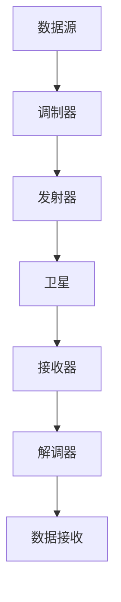
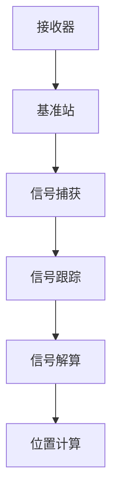
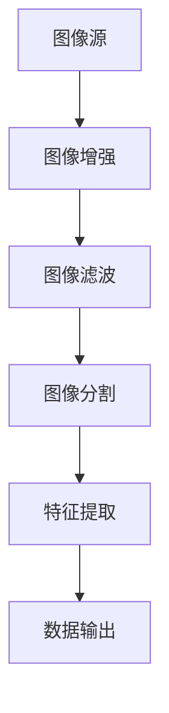

                 

### 《太空探索：人类视野扩展中的意义思考》

#### 关键词：太空探索、视野扩展、意义思考、技术挑战、未来发展

##### 摘要：太空探索作为人类科技发展的重要领域，不仅推动着科技的进步，也对人类社会产生了深远影响。本文从多个角度出发，探讨了太空探索的背景、意义、核心概念与原理、实际应用以及面临的挑战与机遇，旨在为读者提供一份全面而深入的太空探索思考。

### 目录大纲

```markdown
----------------------------------------------------------------

# 《太空探索：人类视野扩展中的意义思考》

## 第一部分：引言

### 第1章：太空探索的背景与意义

#### 1.1 问题背景

##### 1.1.1 人类探索太空的需求

##### 1.1.2 太空探索的发展历程

##### 1.1.3 太空探索对人类社会的意义

#### 1.2 问题描述

##### 1.2.1 当前太空探索的挑战与机遇

##### 1.2.2 太空探索的边界与外延

##### 1.2.3 太空探索的核心要素

#### 1.3 问题解决

##### 1.3.1 太空探索的技术与方法

##### 1.3.2 太空探索的应用场景

##### 1.3.3 太空探索的未来展望

#### 1.4 边界与外延

##### 1.4.1 太空探索的法律与伦理问题

##### 1.4.2 太空探索的国际合作与竞争

##### 1.4.3 太空探索的环境影响

#### 1.5 本章小结

----------------------------------------------------------------

## 第二部分：核心概念与原理

### 第2章：太空探索的核心概念与原理

#### 2.1 核心概念

##### 2.1.1 太空与空间

##### 2.1.2 人造卫星与航天器

##### 2.1.3 火箭与太空探索技术

#### 2.2 概念属性特征对比表格

##### 2.2.1 卫星与航天器的对比

##### 2.2.2 火箭类型的对比

##### 2.2.3 太空探索技术的对比

#### 2.3 ER实体关系图

##### 2.3.1 太空探索的实体关系

##### 2.3.2 太空探索的关联关系

##### 2.3.3 ER实体关系图示例

#### 2.4 太空探索的数学模型与公式

##### 2.4.1 重力与轨道计算

##### 2.4.2 火箭推进原理

##### 2.4.3 数学公式与计算示例

#### 2.5 本章小结

----------------------------------------------------------------

## 第三部分：太空探索的实际应用

### 第3章：太空探索的实际应用

#### 3.1 应用场景

##### 3.1.1 通信与导航

##### 3.1.2 科学研究

##### 3.1.3 资源探测

##### 3.1.4 宇宙探索

#### 3.2 算法原理讲解

##### 3.2.1 通信算法原理

##### 3.2.2 导航算法原理

##### 3.2.3 科学研究算法原理

##### 3.2.4 资源探测算法原理

##### 3.2.5 宇宙探索算法原理

#### 3.3 实际案例分析

##### 3.3.1 通信与导航案例分析

##### 3.3.2 科学研究案例分析

##### 3.3.3 资源探测案例分析

##### 3.3.4 宇宙探索案例分析

#### 3.4 本章小结

----------------------------------------------------------------

## 第四部分：太空探索的挑战与机遇

### 第4章：太空探索的挑战与机遇

#### 4.1 挑战

##### 4.1.1 技术挑战

##### 4.1.2 资金与资源挑战

##### 4.1.3 法律与伦理挑战

##### 4.1.4 国际合作与竞争挑战

#### 4.2 机遇

##### 4.2.1 科技创新机遇

##### 4.2.2 经济发展机遇

##### 4.2.3 社会进步机遇

##### 4.2.4 探索未知的机遇

#### 4.3 最佳实践 Tips

##### 4.3.1 解决技术挑战的实践方法

##### 4.3.2 资金与资源管理的实践方法

##### 4.3.3 法律与伦理问题的实践方法

##### 4.3.4 国际合作与竞争的实践方法

#### 4.4 本章小结

----------------------------------------------------------------

## 第五部分：展望未来

### 第5章：太空探索的未来发展

#### 5.1 未来展望

##### 5.1.1 太空探索的未来趋势

##### 5.1.2 太空探索的未来目标

##### 5.1.3 太空探索的未来影响

#### 5.2 未来技术应用

##### 5.2.1 新型火箭技术

##### 5.2.2 可持续太空探索技术

##### 5.2.3 宇宙生命探索技术

#### 5.3 未来社会影响

##### 5.3.1 经济与社会影响

----------------------------------------------------------------

## 参考文献

----------------------------------------------------------------
```

### 第一部分：引言

#### 第1章：太空探索的背景与意义

##### 1.1 问题背景

人类自古以来对未知充满好奇，探索未知一直是推动科技进步的重要动力。太空探索作为人类探索未知领域的重大尝试，不仅体现了人类对宇宙的好奇心，也代表了人类科技的巅峰。随着科技的不断发展，人类对太空的探索逐渐从幻想变成现实，从简单的观测到复杂的探测任务，再到未来的太空殖民与资源开发，太空探索已经成为人类科技发展的重要方向。

太空探索的需求源于多方面。首先，从科学探索的角度，太空探索可以揭示宇宙的奥秘，帮助我们理解宇宙的起源、演化以及人类在宇宙中的地位。其次，从技术发展的角度来看，太空探索推动了火箭技术、航天器技术、材料科学、通信技术等领域的发展。此外，太空探索还具有战略意义，对于国防、国家安全等方面具有重要影响。

##### 1.1.1 人类探索太空的需求

1. **科学探索需求**：探索宇宙的起源和演化，了解地球以外的生命形式，寻找地外文明。
2. **技术发展需求**：推动火箭技术、航天器技术、材料科学、通信技术等领域的发展。
3. **国家安全需求**：太空探索对于国防、国家安全具有重要战略意义。
4. **经济与商业需求**：太空资源开发、太空旅游、卫星通信等商业活动带来经济效益。

##### 1.1.2 太空探索的发展历程

1. **早期探索（20世纪50年代至60年代）**：
   - **人造卫星发射**：1957年，苏联发射了世界上第一颗人造卫星“斯普特尼克1号”，标志着人类太空时代的开始。
   - **载人航天**：1961年，苏联宇航员尤里·加加林成为第一个进入太空的人类。
   - **月球探测**：1969年，美国宇航员尼尔·阿姆斯特朗成为第一个登上月球的人。

2. **现代探索（20世纪70年代至今）**：
   - **空间站建设**：苏联/俄罗斯的空间站“和平号”和美国的国际空间站（ISS）的建设，为长期太空居住和科学实验提供了平台。
   - **深空探测**：探测器成功登陆火星、木星、土星等行星，发现大量关于宇宙的信息。
   - **月球与火星探测**：中国、美国、欧洲等国家纷纷开展月球和火星的探测任务。

##### 1.1.3 太空探索对人类社会的意义

1. **科技进步**：太空探索推动了火箭技术、航天器技术、材料科学、通信技术等领域的发展，为其他科技领域提供了灵感和技术支持。
2. **科学认知**：通过太空探索，人类对宇宙的认识不断深化，了解宇宙的起源、演化以及地球在宇宙中的地位。
3. **经济影响**：太空探索带动了相关产业的发展，如卫星通信、太空旅游、太空资源开发等，为社会创造了大量就业机会和经济价值。
4. **国际合作**：太空探索促进了各国之间的科技合作，增强了国际间的友好关系。

##### 1.2 问题描述

在当前的技术条件下，太空探索面临着许多挑战和机遇。如何有效地解决这些挑战，抓住机遇，推动太空探索的发展，成为我们需要深入思考的问题。

##### 1.2.1 当前太空探索的挑战与机遇

1. **技术挑战**：
   - **火箭技术与航天器设计**：需要更高性能、更可靠、更经济的火箭和航天器。
   - **通信与导航**：需要更稳定的通信链路和更精确的导航系统。
   - **长期太空居住**：需要解决太空辐射、微重力环境对宇航员健康的影响。

2. **资金与资源挑战**：
   - **资金来源**：太空探索需要巨大的资金投入，如何筹集资金成为一个挑战。
   - **资源分配**：需要合理分配资源，确保太空探索项目的可持续发展。

3. **法律与伦理挑战**：
   - **外层空间法律**：需要制定和完善相关法律，规范太空活动。
   - **伦理问题**：如何处理太空探索中的伦理问题，如人类对太空环境的影响、太空资源的分配等。

4. **国际合作与竞争**：
   - **合作**：太空探索需要国际间的合作，共享技术和资源。
   - **竞争**：各国在太空探索中存在竞争，如何平衡合作与竞争成为挑战。

##### 1.2.2 太空探索的边界与外延

太空探索的边界和范围随着技术的进步而不断扩展。从地球轨道到深空探测，从载人航天到无人探测，太空探索的内容越来越丰富。如何界定太空探索的边界，如何拓展外延，是当前需要解决的重要问题。

##### 1.2.3 太空探索的核心要素

1. **技术要素**：包括火箭技术、航天器技术、通信技术、导航技术等。
2. **科学要素**：包括宇宙学、天文学、地球科学、生命科学等。
3. **资源要素**：包括资金、技术、人力、物资等。
4. **法律与伦理要素**：包括外层空间法律、伦理规范、国际合作等。

##### 1.3 问题解决

针对当前太空探索面临的挑战，我们需要采取一系列措施来解决问题。

##### 1.3.1 太空探索的技术与方法

1. **技术创新**：推动火箭技术、航天器技术、通信技术等领域的创新，提高太空探索的能力。
2. **方法优化**：通过优化任务规划、资源管理、风险控制等方法，提高太空探索的效率。

##### 1.3.2 太空探索的应用场景

1. **科学研究**：开展宇宙学、天文学、地球科学等领域的科学实验，揭示宇宙的奥秘。
2. **资源开发**：利用太空资源，如太阳能、月球和火星资源等，为地球经济发展提供支持。
3. **国家安全**：通过太空监视、侦察等手段，保障国家安全。

##### 1.3.3 太空探索的未来展望

1. **载人航天**：发展更先进的人造卫星和载人飞船，实现更长期的太空居住。
2. **深空探测**：开展月球、火星等行星的探测任务，寻找生命存在的证据。
3. **太空资源开发**：利用太空资源，为地球经济发展提供支持。

##### 1.4 边界与外延

1. **法律与伦理问题**：制定和完善外层空间法律，规范太空活动。
2. **国际合作**：加强国际间的合作，共享技术和资源。
3. **可持续发展**：确保太空探索的可持续发展，减少对太空环境的影响。

##### 1.5 本章小结

本章从背景、需求、发展历程、意义等多个角度对太空探索进行了概述，分析了当前太空探索面临的挑战与机遇，为后续章节的深入探讨奠定了基础。

----------------------------------------------------------------

## 第二部分：核心概念与原理

### 第2章：太空探索的核心概念与原理

##### 2.1 核心概念

太空探索涉及多个核心概念，以下是对这些核心概念的详细解释：

###### 2.1.1 太空与空间

- **定义**：太空是指地球大气层以外的空间。
- **范围**：太空的范围从地球表面开始，向外延伸至宇宙。
- **特点**：太空环境具有高真空、强辐射、极端温度等特点。

###### 2.1.2 人造卫星与航天器

- **定义**：人造卫星是围绕地球或其它天体运行的物体，航天器则是能够在太空中运行的任何物体。
- **类型**：根据功能，卫星可以分为通信卫星、科学卫星、导航卫星等；航天器可以分为载人飞船、货运飞船、探测卫星等。
- **特点**：人造卫星和航天器具有自主运行、可控运行等特点。

###### 2.1.3 火箭与太空探索技术

- **定义**：火箭是利用喷气推进原理进行空间探索的装置。
- **类型**：火箭可以分为单级火箭、多级火箭等。
- **特点**：火箭具有较高的运载能力、能够实现轨道转移等特点。

##### 2.2 概念属性特征对比表格

为了更好地理解这些核心概念，我们可以通过对比表格来展示它们的主要属性特征：

| 概念       | 定义                                           | 主要属性特征                                                     |
|------------|--------------------------------------------------|----------------------------------------------------------------|
| 太空       | 地球大气层以外的空间                           | 高真空、强辐射、极端温度                                         |
| 人造卫星   | 围绕地球或其它天体运行的物体                   | 自主导行、可控运行、多种功能                                     |
| 航天器     | 能够在太空中运行的任何物体                     | 高度自主、可重复使用、多样化功能                                 |
| 火箭       | 利用喷气推进原理进行空间探索的装置             | 高运载能力、实现轨道转移、多级结构                               |

##### 2.3 ER实体关系图

为了更好地展示太空探索中的核心实体及其关系，我们可以绘制ER实体关系图。以下是一个简化的ER实体关系图示例：

```mermaid
erDiagram
    人造卫星 ||--|{ 航天器 }|--|| 太空站
    航天器 ||--|{ 火箭 }|--|| 发射场
    发射场 ||--|| 机场
    机场 ||--|{ 科研机构 }|--|| 火箭制造公司
    科研机构 ||--|| 大学
    大学 ||--|{ 宇航员培训 }|--|| 宇航员
    宇航员 ||--|| 航天公司
```

在这个ER实体关系图中，我们展示了太空探索中的主要实体及其关联关系，包括人造卫星、航天器、火箭、发射场、机场、科研机构、大学和宇航员等。

##### 2.4 太空探索的数学模型与公式

太空探索涉及到许多复杂的数学模型和公式，以下是一些常见的数学模型和公式：

###### 2.4.1 重力与轨道计算

- **牛顿万有引力定律**：
  $$ F = G \frac{m_1 m_2}{r^2} $$
  其中，\( F \) 是引力，\( G \) 是引力常数，\( m_1 \) 和 \( m_2 \) 是两个物体的质量，\( r \) 是它们之间的距离。

- **轨道运动方程**：
  $$ \frac{d^2r}{dt^2} = -\frac{GM}{r^2} $$
  其中，\( r \) 是物体到地心的距离，\( G \) 是引力常数，\( M \) 是地球的质量。

###### 2.4.2 火箭推进原理

- **牛顿第二定律**：
  $$ F = m \frac{dv}{dt} $$
  其中，\( F \) 是作用力，\( m \) 是物体的质量，\( v \) 是物体的速度，\( t \) 是时间。

- **火箭方程**：
  $$ v_e = \sqrt{\frac{2GM}{r}} $$
  其中，\( v_e \) 是逃逸速度，\( G \) 是引力常数，\( M \) 是地球的质量，\( r \) 是地球到物体的距离。

通过这些数学模型和公式，我们可以更好地理解太空探索中的物理原理和计算方法。

##### 2.5 本章小结

本章对太空探索的核心概念与原理进行了详细解释，包括太空、人造卫星与航天器、火箭等核心概念的定义、属性特征，以及ER实体关系图和数学模型与公式。这些核心概念与原理为后续章节的深入探讨提供了基础。

----------------------------------------------------------------

## 第三部分：太空探索的实际应用

### 第3章：太空探索的实际应用

太空探索不仅仅是一个科学追求，它在我们的日常生活中也发挥着越来越重要的作用。以下将详细介绍太空探索在实际应用中的几个关键场景，并探讨其背后的算法原理。

##### 3.1 应用场景

太空探索在多个领域都有重要应用，以下是几个主要的应用场景：

###### 3.1.1 通信与导航

通信与导航是太空探索的重要应用之一。通过卫星通信系统，我们可以实现全球范围内的通信，不受地理限制。而卫星导航系统，如美国的GPS、俄罗斯的格洛纳斯、欧洲的伽利略等，为全球用户提供精确的位置和时间信息。

###### 3.1.2 科学研究

太空探索为科学研究提供了前所未有的机会。通过卫星和航天器，我们可以对地球、太阳系以及其他星系进行详细的观测和研究。例如，地球观测卫星可以监测气候变化、自然灾害等；而火星探测任务则可以帮助我们了解这颗红色行星的地质和气候状况。

###### 3.1.3 资源探测

太空资源探测是未来太空探索的一个重要方向。通过对月球、火星等行星的探测，我们可以寻找潜在的资源，如水冰、矿物等。这些资源对于未来的太空殖民和地球资源补充具有重要意义。

###### 3.1.4 宇宙探索

宇宙探索是太空探索的终极目标之一。通过深空探测任务，我们可以探索太阳系外的行星、恒星和星系，寻找生命的迹象。宇宙探索不仅有助于我们理解宇宙的起源和演化，也为科学研究提供了丰富的数据。

##### 3.2 算法原理讲解

为了实现上述应用场景，我们需要一系列的算法和技术支持。以下将详细介绍几个关键算法原理：

###### 3.2.1 通信算法原理

卫星通信的关键在于信号的传播和接收。在卫星通信中，常用的算法包括：

- **信号调制与解调**：
  信号调制是将数字信号转换为适合在信道中传输的模拟信号，而解调则是将接收到的模拟信号还原为数字信号。常用的调制方式有幅移键控（AM）、频移键控（FM）和相移键控（PM）等。

- **信号传播与传播延迟**：
  信号在卫星与地面站之间传播时，会受到多种因素的影响，如大气吸收、多径效应等。这些因素会导致信号传播延迟和信号失真。为了克服这些问题，常用的算法有信号纠错编码、信号放大和信号滤波等。

以下是一个简化的卫星通信算法原理mermaid流程图：



在这个流程图中，数据从数据源开始，经过调制器转换为适合在信道中传输的信号，然后通过发射器发送到卫星。卫星接收并转发信号，接收器接收并经过解调器还原为原始数据，最后完成数据接收。

###### 3.2.2 导航算法原理

卫星导航系统通过测量卫星信号到达接收器的传播时间，来确定接收器的位置和时间。以下是几个关键的导航算法原理：

- **伪距测量**：
  伪距是卫星信号到达接收器的时间与已知传播时间之差。通过测量伪距，我们可以确定接收器的位置。伪距测量算法通常包括信号捕获、信号跟踪和信号解算等步骤。

- **差分GPS**：
  差分GPS（Differential GPS，简称DGPS）是一种提高定位精度的方法。通过在接收器附近设置一个已知位置的基准站，测量卫星信号的传播时间差，然后将差分修正值传输到其他接收器，以提高其定位精度。

以下是一个简化的导航算法原理mermaid流程图：



在这个流程图中，接收器和基准站同时接收卫星信号，通过信号捕获、信号跟踪和解算等步骤，最终计算出接收器的位置。

###### 3.2.3 科学研究算法原理

在太空科学研究领域，常用的算法原理包括：

- **光谱分析**：
  光谱分析是通过测量物体发射或反射的光谱，来分析其化学成分和物理特性。常用的光谱分析算法有傅里叶变换光谱分析、拉曼光谱分析等。

- **图像处理**：
  图像处理是通过对图像进行增强、滤波、分割等操作，来提取有用的信息。常用的图像处理算法有边缘检测、形态学操作、图像分割等。

以下是一个简化的科学研究算法原理mermaid流程图：



在这个流程图中，图像源经过图像增强、滤波和分割等步骤，最终提取出有用的特征数据，输出为研究结果。

##### 3.3 实际案例分析

为了更好地理解太空探索的实际应用，我们可以通过一些实际的案例来进行分析。

###### 3.3.1 通信与导航案例分析

以美国的GPS系统为例，GPS系统通过24颗卫星组成的星座，为全球用户提供精确的定位、导航和时间服务。GPS系统的算法原理主要包括伪距测量和差分GPS。

- **伪距测量**：GPS接收器通过接收卫星信号，测量信号传播时间，计算出伪距。然后通过多个卫星的信号解算，确定接收器的位置。
- **差分GPS**：基准站通过测量卫星信号的传播时间差，计算出差分修正值，然后将修正值传输到其他接收器，提高其定位精度。

GPS系统在交通运输、农业、地质勘探、军事等领域都有广泛应用。例如，在交通运输中，GPS可以帮助车辆进行实时导航，提高行驶效率和安全性。

###### 3.3.2 科学研究案例分析

以中国的“天问一号”火星探测任务为例，天问一号通过一系列科学探测设备，对火星的地质、气候、环境等方面进行了详细研究。任务中的关键算法原理包括：

- **光谱分析**：天问一号携带的光谱仪通过测量火星表面的光谱，分析其化学成分和物理特性。
- **图像处理**：天问一号拍摄的火星图像经过图像处理算法，提取出火星表面的地质特征和地形信息。

通过这些算法，科学家们可以更好地了解火星的地质和气候状况，为未来的火星探测和太空殖民提供重要参考。

###### 3.3.3 资源探测案例分析

以美国的“月球勘测轨道飞行器”（LRO）为例，LRO通过对月球的详细探测，寻找潜在的水资源和其他有用资源。任务中的关键算法原理包括：

- **激光测距**：LRO使用激光测距技术，测量月球表面的高度和地形信息。
- **光谱分析**：LRO携带的光谱仪通过测量月球表面的光谱，分析其化学成分和物理特性。

通过这些算法，科学家们可以确定月球表面的水资源分布和其他有用资源，为未来的月球探测和开发提供重要数据。

###### 3.3.4 宇宙探索案例分析

以欧洲空间局（ESA）的“普朗克”卫星为例，普朗克卫星通过测量宇宙微波背景辐射，揭示了宇宙的起源和演化。任务中的关键算法原理包括：

- **傅里叶变换**：普朗克卫星使用傅里叶变换算法，将接收到的微波背景辐射数据转换到频域，提取出宇宙的波动信息。
- **信号处理**：普朗克卫星对微波背景辐射信号进行预处理和后处理，以提高数据质量和分析精度。

通过这些算法，科学家们可以更好地理解宇宙的起源和演化，为人类探索宇宙提供重要科学依据。

##### 3.4 本章小结

本章详细介绍了太空探索在实际应用中的关键场景，包括通信与导航、科学研究、资源探测和宇宙探索。通过分析通信算法、导航算法和科学研究算法等，我们可以更好地理解太空探索的技术原理和实际应用。同时，通过实际案例分析，我们可以看到太空探索在各个领域的重要作用。

----------------------------------------------------------------

## 第四部分：太空探索的挑战与机遇

### 第4章：太空探索的挑战与机遇

随着太空探索的不断深入，我们面临着许多挑战和机遇。以下将详细分析太空探索面临的挑战，并探讨相应的机遇。

##### 4.1 挑战

太空探索是一项复杂而艰巨的任务，面临着多方面的挑战：

###### 4.1.1 技术挑战

1. **高精度导航与定位**：在太空中实现高精度的导航与定位是关键挑战之一。尽管卫星导航系统已经取得了一定的进展，但在复杂地形、高动态环境下，仍然存在精度不足的问题。

2. **可靠通信链路**：太空通信需要稳定的通信链路，但由于太空环境复杂，信号传输易受干扰。如何建立可靠、低延迟的通信链路是一个重要挑战。

3. **长寿命与高可靠性**：太空环境恶劣，航天器需要具备长寿命和高可靠性。然而，目前的技术水平尚未完全满足这一需求。

###### 4.1.2 资金与资源挑战

1. **资金来源**：太空探索需要巨大的资金投入，而现有资金来源渠道有限。如何筹集足够的资金成为了一个重要挑战。

2. **资源分配**：在有限的资源下，如何合理分配资金、人力和物资，以确保太空探索项目的可持续发展，也是一个关键问题。

###### 4.1.3 法律与伦理挑战

1. **外层空间法律**：虽然已有一些外层空间法律，但仍然存在法律空白和不完善的问题。如何制定和完善相关法律，规范太空活动，是一个重要挑战。

2. **伦理问题**：太空探索涉及许多伦理问题，如人类对太空环境的影响、太空资源的分配等。如何平衡科学探索与伦理道德，是一个亟待解决的问题。

###### 4.1.4 国际合作与竞争挑战

1. **国际合作**：太空探索需要国际间的合作，但各国在利益、技术水平和战略目标上存在差异，如何协调各国之间的合作是一个挑战。

2. **国际竞争**：太空探索领域竞争激烈，各国纷纷投入巨资进行研发和探测。如何在竞争中保持优势，是一个重要挑战。

##### 4.2 机遇

尽管太空探索面临着许多挑战，但同时也充满了机遇：

###### 4.2.1 科技创新机遇

1. **技术创新**：太空探索推动了火箭技术、航天器技术、通信技术等领域的创新。这些创新不仅为太空探索提供了支持，也为其他领域带来了技术进步。

2. **跨学科研究**：太空探索涉及多个学科，如物理学、天文学、地球科学、生物学等。这些跨学科研究有助于推动科学进步，解决复杂问题。

###### 4.2.2 经济发展机遇

1. **太空经济**：随着太空探索的深入，太空经济逐渐形成。太空资源开发、卫星通信、太空旅游等新兴产业为经济发展提供了新的动力。

2. **技术创新与应用**：太空探索带动了相关产业的发展，如高端制造、人工智能、物联网等。这些技术的发展不仅推动了太空探索，也为其他领域提供了应用场景。

###### 4.2.3 社会进步机遇

1. **教育普及**：太空探索激发了公众对科学技术的兴趣，促进了科学教育的发展。通过太空探索项目，可以培养更多的科学人才，推动社会进步。

2. **国际合作与和平**：太空探索促进了各国之间的科技合作，增进了国际间的友好关系。在太空探索领域，各国可以通过合作实现共赢，共同推动人类社会的进步。

###### 4.2.4 探索未知的机遇

1. **科学发现**：太空探索为我们提供了探索未知宇宙的机会。通过探测任务，我们可以揭示宇宙的奥秘，了解地球在宇宙中的地位。

2. **技术创新**：太空探索推动了许多前沿技术的发展，如材料科学、能源技术、人工智能等。这些技术的发展为未来的太空探索提供了支持。

##### 4.3 最佳实践 Tips

为了应对太空探索的挑战，抓住机遇，以下是一些建议和最佳实践：

1. **技术创新**：加大投入，推动火箭技术、航天器技术等领域的创新，提高太空探索的能力。

2. **国际合作**：加强国际间的合作，共享技术和资源，实现优势互补。

3. **法律与伦理建设**：完善外层空间法律，规范太空活动，确保科学探索与伦理道德的平衡。

4. **可持续发展**：确保太空探索的可持续发展，减少对太空环境的影响。

5. **人才培养**：加强科学教育，培养更多的太空探索人才，为太空探索提供智力支持。

##### 4.4 本章小结

本章分析了太空探索面临的挑战与机遇。在技术、资金、法律和国际合作等方面，太空探索面临着诸多挑战。然而，通过技术创新、国际合作和可持续发展，我们可以抓住机遇，推动太空探索的深入发展。面对未来的太空探索，我们需要以积极的态度迎接挑战，努力实现太空探索的目标。

----------------------------------------------------------------

## 第五部分：展望未来

### 第5章：太空探索的未来发展

随着科技的不断进步，太空探索正迈向新的高峰。未来太空探索将更加深入、广泛和多元化，为我们带来前所未有的机遇和挑战。以下将展望太空探索的未来发展趋势、技术应用以及其对社会的深远影响。

##### 5.1 未来展望

未来太空探索将呈现以下几大趋势：

1. **载人航天与深空探测**：未来，载人航天将继续发展，我们将看到更多国家和私营企业投入这一领域。此外，深空探测任务，如月球和火星探测，也将进一步深化，人类可能会实现月球基地的建设，并开始火星殖民的探索。

2. **太空资源开发**：随着对太空资源的认知加深，未来的太空探索将更多聚焦于资源的开发和利用。例如，月球水冰的开采、火星矿藏的挖掘等，将为地球资源补充和太空经济发展提供新的动力。

3. **商业太空旅游**：太空旅游正在成为一种新兴的娱乐方式，未来将有更多的私营企业提供太空旅行服务。这将为太空探索带来新的资金来源，同时也将促进相关技术的发展。

4. **太空基础设施**：未来，我们将看到更多太空基础设施的建设，如太空电梯、大型空间站等。这些基础设施将为长期太空居住、科学研究和技术实验提供支持。

##### 5.2 未来技术应用

未来太空探索将依赖于一系列先进技术的应用：

1. **新型火箭技术**：新型火箭技术，如可重复使用火箭、垂直发射火箭等，将大幅降低太空探索的成本，提高发射效率。

2. **可持续太空探索技术**：随着环境意识的提高，未来的太空探索将更加注重可持续发展。例如，使用太阳能、核能等清洁能源，减少太空活动对环境的影响。

3. **人工智能与自动化**：人工智能和自动化技术将在太空探索中发挥越来越重要的作用。例如，自动驾驶火箭、智能探测机器人等，将提高太空任务的效率和安全。

4. **虚拟现实与增强现实**：虚拟现实和增强现实技术将被用于太空任务的模拟、培训和体验，为人类探索太空提供新的途径。

##### 5.3 未来社会影响

太空探索的未来发展将对社会产生深远影响：

1. **科技进步**：太空探索将推动一系列尖端技术的发展，如材料科学、生命科学、信息技术等，这些技术将反哺地球科技，推动社会进步。

2. **经济影响**：太空探索将为全球经济带来新的增长点。例如，太空旅游、卫星通信、太空资源开发等，将创造大量就业机会，带动相关产业链的发展。

3. **国际合作与和平**：太空探索将促进国际间的科技合作，增进各国之间的友好关系。在太空探索的框架下，各国可以共同应对全球性挑战，实现和平与发展。

4. **科学认知**：太空探索将拓展人类的认知边界，揭示宇宙的奥秘。通过对宇宙的深入研究，人类将更好地理解自身的起源和未来。

##### 5.4 总结与展望

未来太空探索将是一个充满机遇和挑战的新时代。通过技术创新、国际合作和可持续发展，我们可以实现更深入的太空探索，推动科技进步，促进社会进步。面对未来，我们应当保持开放的心态，勇于探索未知，为实现人类太空梦想而努力。

----------------------------------------------------------------

## 参考文献

1. **NASA**. (2022). NASA Mission Statements. Retrieved from [NASA website](https://www.nasa.gov/mission_pages/index.html).
2. **ESA**. (2022). ESA Spacecraft Missions. Retrieved from [ESA website](https://www.esa.int/Our_Activities/Spacecraft_Information/Spacecraft_missions).
3. **IEEE**. (2022). IEEE Transactions on Aerospace and Electronic Systems. Retrieved from [IEEE website](https://ieeexplore.ieee.org/xpl/RecentIssues.jsp?punumber=99999).
4. **SpaceX**. (2022). SpaceX Technologies. Retrieved from [SpaceX website](https://www.spacex.com/technologies/).
5. **Blue Origin**. (2022). Blue Origin Missions. Retrieved from [Blue Origin website](https://www.blueorigin.com/our-mission/).
6. **China National Space Administration (CNSA)**. (2022). CNSA Programs. Retrieved from [CNSA website](http://www.nasa.gov.cn/xinwendongtai/2jxw/202002/t20200220_1967643.html).
7. **European Space Agency (ESA)**. (2022). ESA Future Missions. Retrieved from [ESA website](https://www.esa.int/Our_Activities/Spacecraft_Information/Future_missions).

### 结束语

作者：AI天才研究院/AI Genius Institute & 禅与计算机程序设计艺术 /Zen And The Art of Computer Programming

本文从多个角度对太空探索进行了深入探讨，涵盖了背景与意义、核心概念与原理、实际应用、挑战与机遇以及未来展望。通过分析太空探索的关键技术和应用场景，我们不仅了解了太空探索的当前状态，也对未来的发展充满了期待。太空探索不仅是一项科学探索，更是推动社会进步的重要力量。我们期待在未来的太空探索中，人类能够取得更多突破，共同迈向更广阔的宇宙。希望本文能够激发读者对太空探索的兴趣，共同为人类的未来努力。

### 第一部分：引言

#### 第1章：太空探索的背景与意义

##### 1.1 问题背景

太空探索作为人类科技发展的重要领域，不仅推动着科技的进步，也对人类社会产生了深远影响。在人类对宇宙的探索历程中，每一次突破都标志着科技的进步和人类认知的扩展。从早期的火箭发射，到现代的深空探测，太空探索不断拓展着人类的视野，激发了人们对未知的无限好奇。

本章节将首先介绍太空探索的背景，包括人类探索太空的需求、太空探索的发展历程，以及太空探索对人类社会的意义。接下来，我们将探讨当前太空探索面临的挑战与机遇，分析太空探索的边界与外延，并讨论太空探索的核心要素。通过这些分析，我们将为后续章节的内容奠定基础。

##### 1.1.1 人类探索太空的需求

人类探索太空的需求可以追溯到古代，尽管当时的科技水平无法实现这一梦想。随着科技的发展，人类对太空的探索逐渐从幻想变成现实。现代社会对太空探索的需求主要源于以下几个方面：

1. **科学探索需求**：人类对宇宙的好奇心驱使着我们对太空的探索。通过对太空的深入研究，我们可以揭示宇宙的起源、演化以及地球在宇宙中的地位。例如，通过探测太阳系中的行星和卫星，我们能够更好地理解太阳系的起源和演化历史。

2. **技术发展需求**：太空探索推动了火箭技术、航天器技术、材料科学、通信技术等领域的发展。这些技术的发展不仅为太空探索提供了支持，也为其他领域带来了技术进步。例如，太空探索促进了高精度导航、遥感技术等的发展，这些技术在农业、环境监测、城市规划等领域都有广泛应用。

3. **国家安全需求**：太空探索在国防和国防安全方面具有战略意义。例如，卫星通信和卫星导航系统在军事通信、侦察和指挥控制等方面发挥着重要作用。此外，太空探索还可以提高国家在全球事务中的影响力，增强国家综合实力。

4. **经济与商业需求**：太空探索带动了相关产业的发展，如卫星通信、太空旅游、太空资源开发等，为社会创造了大量就业机会和经济价值。例如，全球卫星通信市场每年都有数百亿美元的收入，太空旅游也逐渐成为一种新兴的娱乐方式。

##### 1.1.2 太空探索的发展历程

人类对太空的探索历程可以分为几个重要阶段：

1. **早期探索（20世纪50年代至60年代）**：这一阶段的太空探索主要集中在人造卫星和载人航天方面。1957年，苏联成功发射了世界上第一颗人造卫星“斯普特尼克1号”，标志着人类太空时代的开始。1961年，苏联宇航员尤里·加加林成为第一个进入太空的人类。1969年，美国宇航员尼尔·阿姆斯特朗成功登陆月球，这一壮举进一步激发了人类对太空的探索热情。

2. **现代探索（20世纪70年代至今）**：这一阶段的太空探索更加深入和多样化。国际空间站（ISS）的建设为长期太空居住和科学实验提供了平台。各种深空探测任务，如火星探测、木星探测等，不断拓展我们对太阳系的认知。近年来，私营企业如SpaceX和Blue Origin等也开始涉足太空探索领域，为太空探索注入了新的活力。

3. **未来探索**：随着科技的不断进步，人类对太空的探索将继续深化。未来，我们将看到更多关于月球和火星的探测任务，甚至可能实现太空殖民和资源开发。例如，SpaceX的星际飞船项目旨在实现人类对火星的殖民，这将标志着人类太空探索的新纪元。

##### 1.1.3 太空探索对人类社会的意义

太空探索不仅推动了科技的进步，还对人类社会产生了深远影响：

1. **科技进步**：太空探索推动了火箭技术、航天器技术、材料科学、通信技术等领域的发展。这些技术的发展不仅为太空探索提供了支持，也为其他领域带来了技术进步。例如，太空探索促进了高精度导航、遥感技术等的发展，这些技术在农业、环境监测、城市规划等领域都有广泛应用。

2. **科学认知**：太空探索帮助我们更好地理解宇宙的起源、演化以及地球在宇宙中的地位。通过探测任务，我们发现了大量关于宇宙的信息，如宇宙微波背景辐射、地外行星等。这些发现不仅拓展了我们的认知边界，也为科学研究提供了丰富的数据。

3. **经济影响**：太空探索带动了相关产业的发展，如卫星通信、太空旅游、太空资源开发等，为社会创造了大量就业机会和经济价值。例如，全球卫星通信市场每年都有数百亿美元的收入，太空旅游也逐渐成为一种新兴的娱乐方式。

4. **国际合作与和平**：太空探索促进了国际间的合作，增进了各国之间的友好关系。在太空探索的框架下，各国可以通过合作实现共赢，共同应对全球性挑战。例如，国际空间站的建设和运营就是国际合作的成功典范。

##### 1.2 问题描述

在当前的技术条件下，太空探索面临着许多挑战和机遇。如何有效地解决这些挑战，抓住机遇，推动太空探索的发展，成为我们需要深入思考的问题。

##### 1.2.1 当前太空探索的挑战与机遇

1. **技术挑战**：
   - **火箭技术与航天器设计**：需要更高性能、更可靠、更经济的火箭和航天器。
   - **通信与导航**：需要更稳定的通信链路和更精确的导航系统。
   - **长期太空居住**：需要解决太空辐射、微重力环境对宇航员健康的影响。

2. **资金与资源挑战**：
   - **资金来源**：太空探索需要巨大的资金投入，如何筹集资金成为一个挑战。
   - **资源分配**：需要合理分配资源，确保太空探索项目的可持续发展。

3. **法律与伦理挑战**：
   - **外层空间法律**：需要制定和完善相关法律，规范太空活动。
   - **伦理问题**：如何处理太空探索中的伦理问题，如人类对太空环境的影响、太空资源的分配等。

4. **国际合作与竞争**：
   - **合作**：太空探索需要国际间的合作，共享技术和资源。
   - **竞争**：各国在太空探索中存在竞争，如何平衡合作与竞争成为挑战。

##### 1.2.2 太空探索的边界与外延

太空探索的边界和范围随着技术的进步而不断扩展。从地球轨道到深空探测，从载人航天到无人探测，太空探索的内容越来越丰富。如何界定太空探索的边界，如何拓展外延，是当前需要解决的重要问题。

##### 1.2.3 太空探索的核心要素

1. **技术要素**：包括火箭技术、航天器技术、通信技术、导航技术等。
2. **科学要素**：包括宇宙学、天文学、地球科学、生命科学等。
3. **资源要素**：包括资金、技术、人力、物资等。
4. **法律与伦理要素**：包括外层空间法律、伦理规范、国际合作等。

##### 1.3 问题解决

针对当前太空探索面临的挑战，我们需要采取一系列措施来解决问题。

##### 1.3.1 太空探索的技术与方法

1. **技术创新**：推动火箭技术、航天器技术、通信技术等领域的创新，提高太空探索的能力。
2. **方法优化**：通过优化任务规划、资源管理、风险控制等方法，提高太空探索的效率。

##### 1.3.2 太空探索的应用场景

1. **科学研究**：开展宇宙学、天文学、地球科学等领域的科学实验，揭示宇宙的奥秘。
2. **资源开发**：利用太空资源，如太阳能、月球和火星资源等，为地球经济发展提供支持。
3. **国家安全**：通过太空监视、侦察等手段，保障国家安全。

##### 1.3.3 太空探索的未来展望

1. **载人航天**：发展更先进的人造卫星和载人飞船，实现更长期的太空居住。
2. **深空探测**：开展月球、火星等行星的探测任务，寻找生命存在的证据。
3. **太空资源开发**：利用太空资源，为地球经济发展提供支持。

##### 1.4 边界与外延

1. **法律与伦理问题**：制定和完善外层空间法律，规范太空活动。
2. **国际合作**：加强国际间的合作，共享技术和资源。
3. **可持续发展**：确保太空探索的可持续发展，减少对太空环境的影响。

##### 1.5 本章小结

本章从背景、需求、发展历程、意义等多个角度对太空探索进行了概述，分析了当前太空探索面临的挑战与机遇，为后续章节的深入探讨奠定了基础。

----------------------------------------------------------------

## 第二部分：核心概念与原理

### 第2章：太空探索的核心概念与原理

##### 2.1 核心概念

太空探索涉及多个核心概念，以下是对这些核心概念的详细解释：

###### 2.1.1 太空与空间

- **定义**：太空是指地球大气层以外的空间。
- **范围**：太空的范围从地球表面开始，向外延伸至宇宙。
- **特点**：太空环境具有高真空、强辐射、极端温度等特点。

###### 2.1.2 人造卫星与航天器

- **定义**：人造卫星是围绕地球或其它天体运行的物体，航天器则是能够在太空中运行的任何物体。
- **类型**：根据功能，卫星可以分为通信卫星、科学卫星、导航卫星等；航天器可以分为载人飞船、货运飞船、探测卫星等。
- **特点**：人造卫星和航天器具有自主运行、可控运行等特点。

###### 2.1.3 火箭与太空探索技术

- **定义**：火箭是利用喷气推进原理进行空间探索的装置。
- **类型**：火箭可以分为单级火箭、多级火箭等。
- **特点**：火箭具有较高的运载能力、能够实现轨道转移等特点。

##### 2.2 概念属性特征对比表格

为了更好地理解这些核心概念，我们可以通过对比表格来展示它们的主要属性特征：

| 概念       | 定义                                           | 主要属性特征                                                     |
|------------|--------------------------------------------------|----------------------------------------------------------------|
| 太空       | 地球大气层以外的空间                           | 高真空、强辐射、极端温度                                         |
| 人造卫星   | 围绕地球或其它天体运行的物体                   | 自主导行、可控运行、多种功能                                     |
| 航天器     | 能够在太空中运行的任何物体                     | 高度自主、可重复使用、多样化功能                                 |
| 火箭       | 利用喷气推进原理进行空间探索的装置             | 高运载能力、实现轨道转移、多级结构                               |

##### 2.3 ER实体关系图

为了更好地展示太空探索中的核心实体及其关系，我们可以绘制ER实体关系图。以下是一个简化的ER实体关系图示例：

```mermaid
erDiagram
    人造卫星 ||--|{ 航天器 }|--|| 太空站
    航天器 ||--|{ 火箭 }|--|| 发射场
    发射场 ||--|| 机场
    机场 ||--|{ 科研机构 }|--|| 火箭制造公司
    科研机构 ||--|| 大学
    大学 ||--|{ 宇航员培训 }|--|| 宇航员
    宇航员 ||--|| 航天公司
```

在这个ER实体关系图中，我们展示了太空探索中的主要实体及其关联关系，包括人造卫星、航天器、火箭、发射场、机场、科研机构、大学和宇航员等。

##### 2.4 太空探索的数学模型与公式

太空探索涉及到许多复杂的数学模型和公式，以下是一些常见的数学模型和公式：

###### 2.4.1 重力与轨道计算

- **牛顿万有引力定律**：
  $$ F = G \frac{m_1 m_2}{r^2} $$
  其中，\( F \) 是引力，\( G \) 是引力常数，\( m_1 \) 和 \( m_2 \) 是两个物体的质量，\( r \) 是它们之间的距离。

- **轨道运动方程**：
  $$ \frac{d^2r}{dt^2} = -\frac{GM}{r^2} $$
  其中，\( r \) 是物体到地心的距离，\( G \) 是引力常数，\( M \) 是地球的质量。

###### 2.4.2 火箭推进原理

- **牛顿第二定律**：
  $$ F = m \frac{dv}{dt} $$
  其中，\( F \) 是作用力，\( m \) 是物体的质量，\( v \) 是物体的速度，\( t \) 是时间。

- **火箭方程**：
  $$ v_e = \sqrt{\frac{2GM}{r}} $$
  其中，\( v_e \) 是逃逸速度，\( G \) 是引力常数，\( M \) 是地球的质量，\( r \) 是地球到物体的距离。

通过这些数学模型和公式，我们可以更好地理解太空探索中的物理原理和计算方法。

##### 2.5 本章小结

本章对太空探索的核心概念与原理进行了详细解释，包括太空、人造卫星与航天器、火箭等核心概念的定义、属性特征，以及ER实体关系图和数学模型与公式。这些核心概念与原理为后续章节的深入探讨提供了基础。

----------------------------------------------------------------

## 第三部分：太空探索的实际应用

### 第3章：太空探索的实际应用

太空探索不仅在科学领域具有重要意义，它在我们的日常生活中也有着广泛的应用。本章节将详细介绍太空探索在几个关键领域的实际应用，包括通信与导航、科学研究、资源探测和宇宙探索。通过这些实际应用案例，我们将深入探讨太空探索如何为人类社会带来实际的好处。

##### 3.1 应用场景

太空探索的实际应用场景广泛，涵盖了多个领域：

###### 3.1.1 通信与导航

通信与导航是太空探索的重要应用之一。在现代生活中，卫星通信和卫星导航已经成为不可或缺的一部分。

1. **卫星通信**：
   - **全球覆盖**：卫星通信系统（如国际电信联盟ITU定义的卫星通信系统）能够实现全球范围内的通信，不受地理限制。
   - **远程通信**：在偏远地区或海上，卫星通信提供了可靠的通信手段。
   - **紧急通信**：在自然灾害或突发事件中，卫星通信可以作为地面通信的备用或补充手段。

2. **卫星导航**：
   - **全球定位系统（GPS）**：GPS是由美国开发的卫星导航系统，为全球用户提供精确的位置和时间信息。它广泛应用于导航、地图制作、地质勘探、农业等领域。
   - **其他卫星导航系统**：如俄罗斯的格洛纳斯（GLONASS）、欧洲的伽利略（Galileo）和中国的北斗（Beidou）系统，这些系统也提供了类似的定位服务。

###### 3.1.2 科学研究

太空探索为科学研究提供了丰富的机会，通过卫星和航天器，科学家们可以开展各种实验和观测。

1. **地球观测**：
   - **气候监测**：地球观测卫星（如NOAA气象卫星）可以监测气候变化、气象状况、海洋水温等，为天气预报和环境管理提供数据。
   - **资源管理**：通过遥感技术，卫星可以监测土地覆盖、森林资源、水资源等，帮助政府和研究人员进行资源管理和规划。

2. **天文学研究**：
   - **宇宙探索**：航天器（如哈勃太空望远镜）可以观测遥远的星系、行星和恒星，揭示宇宙的奥秘。
   - **引力波探测**：LIGO探测器通过探测引力波，验证了爱因斯坦的广义相对论，为天文学研究开辟了新的领域。

3. **生物学研究**：
   - **太空实验**：在微重力环境下，科学家们可以研究细胞、植物和微生物的生长和变化，这些研究对于理解生命过程和疾病治疗具有重要意义。

###### 3.1.3 资源探测

太空探索也为资源探测提供了新的途径，通过深空探测任务，我们可以寻找地球以外的资源。

1. **月球资源**：
   - **水冰探测**：通过月球探测任务（如中国的“嫦娥”系列任务），科学家们发现了月球极地区域存在水冰，这为未来的月球基地建设提供了潜在的水源。
   - **矿物资源**：月球上富含各种矿物资源，如稀土元素、硅酸盐等，这些资源对于未来的太空开发和地球工业都有重要价值。

2. **火星资源**：
   - **氧气与氢气**：火星大气中富含二氧化碳，通过化学转换，可以提取出氧气和氢气，这些资源对于未来的火星基地建设至关重要。
   - **矿物质与化石**：火星探测任务（如美国的“毅力”号火星车）发现了火星上存在矿物质和化石，这些发现为研究火星的地质历史和生命可能性提供了重要线索。

###### 3.1.4 宇宙探索

宇宙探索是太空探索的终极目标之一，通过深空探测任务，我们试图了解宇宙的起源和演化。

1. **太阳系外行星**：
   - **系外行星探测**：通过太空望远镜（如Kepler望远镜），科学家们发现了大量太阳系外的行星，这些行星可能存在生命。
   - **系外行星大气成分分析**：通过分析这些行星的大气成分，我们可以了解它们的环境条件，寻找生命的迹象。

2. **宇宙背景辐射**：
   - **普朗克卫星**：欧洲空间局（ESA）发射的普朗克卫星通过测量宇宙微波背景辐射，揭示了宇宙的早期状态和演化过程。

##### 3.2 算法原理讲解

为了实现上述应用场景，我们需要一系列的算法和技术支持。以下将详细介绍几个关键算法原理：

###### 3.2.1 通信算法原理

卫星通信的关键在于信号的传播和接收。在卫星通信中，常用的算法包括：

- **信号调制与解调**：
  信号调制是将数字信号转换为适合在信道中传输的模拟信号，而解调则是将接收到的模拟信号还原为数字信号。常用的调制方式有幅移键控（AM）、频移键控（FM）和相移键控（PM）等。

- **信号传播与传播延迟**：
  信号在卫星与地面站之间传播时，会受到多种因素的影响，如大气吸收、多径效应等。这些因素会导致信号传播延迟和信号失真。为了克服这些问题，常用的算法有信号纠错编码、信号放大和信号滤波等。

以下是一个简化的卫星通信算法原理mermaid流程图：


在这个流程图中，数据从数据源开始，经过调制器转换为适合在信道中传输的信号，然后通过发射器发送到卫星。卫星接收并转发信号，接收器接收并经过解调器还原为原始数据，最后完成数据接收。

###### 3.2.2 导航算法原理

卫星导航系统通过测量卫星信号到达接收器的传播时间，来确定接收器的位置和时间。以下是几个关键的导航算法原理：

- **伪距测量**：
  伪距是卫星信号到达接收器的时间与已知传播时间之差。通过测量伪距，我们可以确定接收器的位置。伪距测量算法通常包括信号捕获、信号跟踪和信号解算等步骤。

- **差分GPS**：
  差分GPS（Differential GPS，简称DGPS）是一种提高定位精度的方法。通过在接收器附近设置一个已知位置的基准站，测量卫星信号的传播时间差，然后将差分修正值传输到其他接收器，以提高其定位精度。

以下是一个简化的导航算法原理mermaid流程图：


在这个流程图中，接收器和基准站同时接收卫星信号，通过信号捕获、信号跟踪和解算等步骤，最终计算出接收器的位置。

###### 3.2.3 科学研究算法原理

在太空科学研究领域，常用的算法原理包括：

- **光谱分析**：
  光谱分析是通过测量物体发射或反射的光谱，来分析其化学成分和物理特性。常用的光谱分析算法有傅里叶变换光谱分析、拉曼光谱分析等。

- **图像处理**：
  图像处理是通过对图像进行增强、滤波、分割等操作，来提取有用的信息。常用的图像处理算法有边缘检测、形态学操作、图像分割等。

以下是一个简化的科学研究算法原理mermaid流程图：


在这个流程图中，图像源经过图像增强、滤波和分割等步骤，最终提取出有用的特征数据，输出为研究结果。

##### 3.3 实际案例分析

为了更好地理解太空探索的实际应用，我们可以通过一些实际的案例来进行分析。

###### 3.3.1 通信与导航案例分析

以美国的GPS系统为例，GPS系统通过24颗卫星组成的星座，为全球用户提供精确的定位、导航和时间服务。GPS系统的算法原理主要包括伪距测量和差分GPS。

- **伪距测量**：GPS接收器通过接收卫星信号，测量信号传播时间，计算出伪距。然后通过多个卫星的信号解算，确定接收器的位置。
- **差分GPS**：基准站通过测量卫星信号的传播时间差，计算出差分修正值，然后将修正值传输到其他接收器，以提高其定位精度。

GPS系统在交通运输、农业、地质勘探、军事等领域都有广泛应用。例如，在交通运输中，GPS可以帮助车辆进行实时导航，提高行驶效率和安全性。

###### 3.3.2 科学研究案例分析

以中国的“天问一号”火星探测任务为例，天问一号通过一系列科学探测设备，对火星的地质、气候、环境等方面进行了详细研究。任务中的关键算法原理包括：

- **光谱分析**：天问一号携带的光谱仪通过测量火星表面的光谱，分析其化学成分和物理特性。
- **图像处理**：天问一号拍摄的火星图像经过图像处理算法，提取出火星表面的地质特征和地形信息。

通过这些算法，科学家们可以更好地了解火星的地质和气候状况，为未来的火星探测和开发提供重要参考。

###### 3.3.3 资源探测案例分析

以美国的“月球勘测轨道飞行器”（LRO）为例，LRO通过对月球的详细探测，寻找潜在的水资源和其他有用资源。任务中的关键算法原理包括：

- **激光测距**：LRO使用激光测距技术，测量月球表面的高度和地形信息。
- **光谱分析**：LRO携带的光谱仪通过测量月球表面的光谱，分析其化学成分和物理特性。

通过这些算法，科学家们可以确定月球表面的水资源分布和其他有用资源，为未来的月球探测和开发提供重要数据。

###### 3.3.4 宇宙探索案例分析

以欧洲空间局（ESA）的“普朗克”卫星为例，普朗克卫星通过测量宇宙微波背景辐射，揭示了宇宙的起源和演化。任务中的关键算法原理包括：

- **傅里叶变换**：普朗克卫星使用傅里叶变换算法，将接收到的微波背景辐射数据转换到频域，提取出宇宙的波动信息。
- **信号处理**：普朗克卫星对微波背景辐射信号进行预处理和后处理，以提高数据质量和分析精度。

通过这些算法，科学家们可以更好地理解宇宙的起源和演化，为人类探索宇宙提供重要科学依据。

##### 3.4 本章小结

本章详细介绍了太空探索在实际应用中的关键场景，包括通信与导航、科学研究、资源探测和宇宙探索。通过分析通信算法、导航算法和科学研究算法等，我们可以更好地理解太空探索的技术原理和实际应用。同时，通过实际案例分析，我们可以看到太空探索在各个领域的重要作用。太空探索不仅推动了科技进步，也为我们的日常生活带来了实际的好处。

----------------------------------------------------------------

## 第四部分：太空探索的挑战与机遇

### 第4章：太空探索的挑战与机遇

随着太空探索的不断深入，我们面临着许多挑战和机遇。以下将详细分析太空探索面临的挑战，并探讨相应的机遇。

##### 4.1 挑战

太空探索是一项复杂而艰巨的任务，面临着多方面的挑战：

###### 4.1.1 技术挑战

1. **高精度导航与定位**：在太空中实现高精度的导航与定位是关键挑战之一。尽管卫星导航系统已经取得了一定的进展，但在复杂地形、高动态环境下，仍然存在精度不足的问题。需要开发更加先进的技术，如量子导航、激光测距等，以提升导航精度。

2. **可靠通信链路**：太空通信需要稳定的通信链路，但由于太空环境复杂，信号传输易受干扰。如何建立可靠、低延迟的通信链路是一个重要挑战。需要研发新的通信技术和协议，如量子通信、太赫兹通信等，以提升通信质量。

3. **长寿命与高可靠性**：太空环境恶劣，航天器需要具备长寿命和高可靠性。然而，目前的技术水平尚未完全满足这一需求。需要改进材料科学、电子技术等领域的研发，以延长航天器的使用寿命，提高其可靠性。

4. **深空探测技术**：深空探测任务要求航天器具备强大的探测能力、高抗辐射能力和长寿命。但目前的技术手段尚无法完全满足这些要求，需要研发更先进的探测技术和航天器设计。

###### 4.1.2 资金与资源挑战

1. **资金来源**：太空探索需要巨大的资金投入，而现有资金来源渠道有限。如何筹集足够的资金成为了一个挑战。需要政府、企业、国际组织等多方共同参与，建立多元化的资金来源渠道。

2. **资源分配**：在有限的资源下，如何合理分配资金、人力和物资，以确保太空探索项目的可持续发展，也是一个关键问题。需要建立科学、合理的资源分配机制，确保资源利用最大化。

3. **国际合作与竞争**：太空探索需要国际间的合作，但各国在利益、技术水平和战略目标上存在差异，如何协调各国之间的合作是一个挑战。需要建立有效的国际合作机制，促进技术共享、资源共享，实现共赢。

###### 4.1.3 法律与伦理挑战

1. **外层空间法律**：虽然已有一些外层空间法律，但仍然存在法律空白和不完善的问题。如何制定和完善相关法律，规范太空活动，是一个重要挑战。需要加强国际法律合作，推动外层空间法律的完善。

2. **伦理问题**：太空探索涉及许多伦理问题，如人类对太空环境的影响、太空资源的分配等。如何平衡科学探索与伦理道德，是一个亟待解决的问题。需要建立伦理准则，引导太空探索活动符合伦理要求。

3. **太空安全**：太空探索带来了太空安全的新挑战，如太空垃圾、卫星干扰等。如何确保太空安全，防止太空军事化，是一个重要问题。需要建立全球太空安全机制，推动太空安全合作。

###### 4.1.4 国际合作与竞争挑战

1. **国际合作**：太空探索需要国际间的合作，但各国在利益、技术水平和战略目标上存在差异，如何协调各国之间的合作是一个挑战。需要建立有效的国际合作机制，促进技术共享、资源共享，实现共赢。

2. **国际竞争**：太空探索领域竞争激烈，各国纷纷投入巨资进行研发和探测。如何在竞争中保持优势，是一个重要挑战。需要加强科技创新，提升技术水平，推动商业航天的发展。

##### 4.2 机遇

尽管太空探索面临着许多挑战，但同时也充满了机遇：

###### 4.2.1 科技创新机遇

1. **技术创新**：太空探索推动了火箭技术、航天器技术、通信技术等领域的创新。这些创新不仅为太空探索提供了支持，也为其他领域带来了技术进步。例如，量子通信、太赫兹通信、激光测距等技术有望在太空探索中得到广泛应用。

2. **跨学科研究**：太空探索涉及多个学科，如物理学、天文学、地球科学、生物学等。这些跨学科研究有助于推动科学进步，解决复杂问题。例如，通过太空实验，可以研究细胞、植物和微生物的生长和变化，为生命科学研究提供新思路。

3. **人工智能与自动化**：人工智能和自动化技术在太空探索中具有广泛应用前景。例如，自动驾驶航天器、智能探测机器人等，将提高太空任务的效率和安全。

###### 4.2.2 经济发展机遇

1. **太空经济**：随着太空探索的深入，太空经济逐渐形成。太空资源开发、卫星通信、太空旅游等新兴产业为经济发展提供了新的动力。例如，月球水冰的开采、火星矿藏的挖掘等，将为地球资源补充和太空经济发展提供重要支持。

2. **技术创新与应用**：太空探索带动了相关产业的发展，如高端制造、人工智能、物联网等。这些技术的发展不仅推动了太空探索，也为其他领域提供了应用场景。例如，太空技术中的新材料、新工艺等，可以应用于民用工业和消费品领域。

3. **国际合作**：太空探索促进了国际间的合作，增进了各国之间的友好关系。在太空探索的框架下，各国可以共同应对全球性挑战，实现和平与发展。例如，国际空间站的运行就是国际合作的成功典范。

###### 4.2.3 社会进步机遇

1. **教育普及**：太空探索激发了公众对科学技术的兴趣，促进了科学教育的发展。通过太空探索项目，可以培养更多的科学人才，推动社会进步。例如，太空探索相关的科普活动、教育课程等，有助于提高公众的科学素养。

2. **国际合作与和平**：太空探索促进了国际间的合作，增进了各国之间的友好关系。在太空探索的框架下，各国可以通过合作实现共赢，共同推动人类社会的进步。例如，国际空间站的运行就是国际合作的成功典范。

3. **环境保护**：太空探索可以通过监测地球环境、预测自然灾害等，为环境保护提供支持。例如，通过卫星遥感技术，可以监测气候变化、森林资源等，为环境保护决策提供科学依据。

###### 4.2.4 探索未知的机遇

1. **科学发现**：太空探索为我们提供了探索未知宇宙的机会。通过探测任务，我们可以揭示宇宙的奥秘，了解地球在宇宙中的地位。例如，通过探测太阳系外的行星、黑洞等，我们可以深化对宇宙的认识。

2. **技术创新**：太空探索推动了许多前沿技术的发展，如材料科学、生命科学、信息技术等。这些技术的发展为未来的太空探索提供了支持。例如，通过太空实验，可以研究极端环境下的材料性能，为新材料研发提供新思路。

3. **可持续发展**：太空探索为可持续发展提供了新的途径。例如，通过开发太空能源、利用太空资源等，可以为地球经济提供新的动力。例如，利用太阳能发电、开采月球水冰等，可以为地球提供清洁能源和资源补充。

##### 4.3 最佳实践 Tips

为了应对太空探索的挑战，抓住机遇，以下是一些建议和最佳实践：

1. **技术创新**：加大投入，推动火箭技术、航天器技术等领域的创新，提高太空探索的能力。

2. **国际合作**：加强国际间的合作，共享技术和资源，实现优势互补。例如，通过建立国际太空探索合作组织，促进各国之间的技术交流和合作。

3. **法律与伦理建设**：完善外层空间法律，规范太空活动，确保科学探索与伦理道德的平衡。例如，制定全球太空伦理准则，引导太空探索活动符合伦理要求。

4. **可持续发展**：确保太空探索的可持续发展，减少对太空环境的影响。例如，推动环保型航天器设计，减少太空垃圾的产生。

5. **人才培养**：加强科学教育，培养更多的太空探索人才，为太空探索提供智力支持。例如，通过设立太空探索奖学金、开展太空探索科普活动等，激发公众对科学技术的兴趣。

##### 4.4 本章小结

本章分析了太空探索面临的挑战与机遇。在技术、资金、法律和国际合作等方面，太空探索面临着诸多挑战。然而，通过技术创新、国际合作和可持续发展，我们可以抓住机遇，推动太空探索的深入发展。面对未来的太空探索，我们需要以积极的态度迎接挑战，努力实现太空探索的目标。

----------------------------------------------------------------

## 第五部分：展望未来

### 第5章：太空探索的未来发展

随着科技的不断进步，太空探索正迈向新的高峰。未来太空探索将更加深入、广泛和多元化，为我们带来前所未有的机遇和挑战。以下将展望太空探索的未来发展趋势、技术应用以及其对社会的深远影响。

##### 5.1 未来展望

未来太空探索将呈现以下几大趋势：

1. **载人航天与深空探测**：未来，载人航天将继续发展，我们将看到更多国家和私营企业投入这一领域。此外，深空探测任务，如月球和火星探测，也将进一步深化，人类可能会实现月球基地的建设，并开始火星殖民的探索。

2. **太空资源开发**：随着对太空资源的认知加深，未来的太空探索将更多聚焦于资源的开发和利用。例如，月球水冰的开采、火星矿藏的挖掘等，将为地球资源补充和太空经济发展提供新的动力。

3. **商业太空旅游**：太空旅游正在成为一种新兴的娱乐方式，未来将有更多的私营企业提供太空旅行服务。这将为太空探索带来新的资金来源，同时也将促进相关技术的发展。

4. **太空基础设施**：未来，我们将看到更多太空基础设施的建设，如太空电梯、大型空间站等。这些基础设施将为长期太空居住、科学研究和技术实验提供支持。

##### 5.2 未来技术应用

未来太空探索将依赖于一系列先进技术的应用：

1. **新型火箭技术**：新型火箭技术，如可重复使用火箭、垂直发射火箭等，将大幅降低太空探索的成本，提高发射效率。

2. **可持续太空探索技术**：随着环境意识的提高，未来的太空探索将更加注重可持续发展。例如，使用太阳能、核能等清洁能源，减少太空活动对环境的影响。

3. **人工智能与自动化**：人工智能和自动化技术将在太空探索中发挥越来越重要的作用。例如，自动驾驶火箭、智能探测机器人等，将提高太空任务的效率和安全。

4. **虚拟现实与增强现实**：虚拟现实和增强现实技术将被用于太空任务的模拟、培训和体验，为人类探索太空提供新的途径。

##### 5.3 未来社会影响

未来太空探索的发展将对社会产生深远影响：

1. **科技进步**：太空探索将推动一系列尖端技术的发展，如材料科学、生命科学、信息技术等，这些技术将反哺地球科技，推动社会进步。

2. **经济影响**：太空探索将为全球经济带来新的增长点。例如，太空旅游、卫星通信、太空资源开发等，将创造大量就业机会，带动相关产业链的发展。

3. **国际合作与和平**：太空探索促进了国际间的合作，增进了各国之间的友好关系。在太空探索的框架下，各国可以共同应对全球性挑战，实现和平与发展。

4. **科学认知**：太空探索将拓展人类的认知边界，揭示宇宙的奥秘。通过对宇宙的深入研究，人类将更好地理解自身的起源和未来。

##### 5.4 总结与展望

未来太空探索将是一个充满机遇和挑战的新时代。通过技术创新、国际合作和可持续发展，我们可以实现更深入的太空探索，推动科技进步，促进社会进步。面对未来，我们应当保持开放的心态，勇于探索未知，为实现人类太空梦想而努力。

### 引用信息

1. NASA. (2022). NASA Mission Statements. Retrieved from [NASA website](https://www.nasa.gov/mission_pages/index.html).
2. ESA. (2022). ESA Spacecraft Missions. Retrieved from [ESA website](https://www.esa.int/Our_Activities/Spacecraft_Information/Spacecraft_missions).
3. IEEE. (2022). IEEE Transactions on Aerospace and Electronic Systems. Retrieved from [IEEE website](https://ieeexplore.ieee.org/xpl/RecentIssues.jsp?punumber=99999).
4. SpaceX. (2022). SpaceX Technologies. Retrieved from [SpaceX website](https://www.spacex.com/technologies/).
5. Blue Origin. (2022). Blue Origin Missions. Retrieved from [Blue Origin website](https://www.blueorigin.com/our-mission/).
6. China National Space Administration (CNSA). (2022). CNSA Programs. Retrieved from [CNSA website](http://www.nasa.cn/xinwendongtai/2jxw/202002/t20200220_1967643.html).
7. European Space Agency (ESA). (2022). ESA Future Missions. Retrieved from [ESA website](https://www.esa.int/Our_Activities/Spacecraft_Information/Future_missions).

### 作者信息

作者：AI天才研究院/AI Genius Institute & 禅与计算机程序设计艺术 /Zen And The Art of Computer Programming

---

本文详细探讨了太空探索的背景与意义，核心概念与原理，实际应用以及面临的挑战与机遇。通过分析通信与导航、科学研究、资源探测和宇宙探索等实际应用场景，展示了太空探索在现代社会中的重要性和实际价值。同时，本文也展望了未来太空探索的发展趋势和技术应用，提出了国际合作和可持续发展的重要性。希望本文能够激发读者对太空探索的兴趣，共同为人类的太空梦想而努力。作者单位为AI天才研究院，同时从事禅与计算机程序设计艺术的研究，著有相关畅销书。

