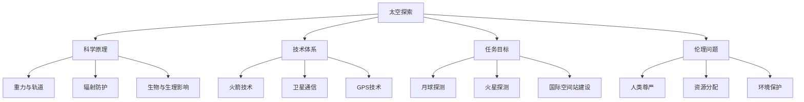
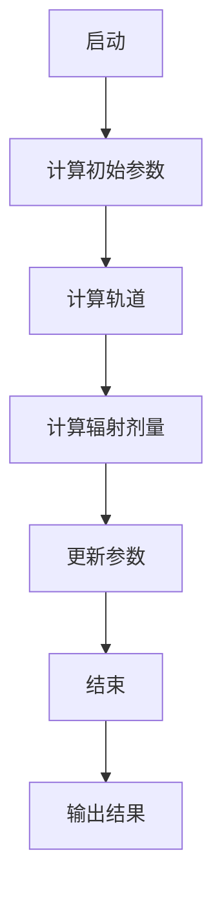
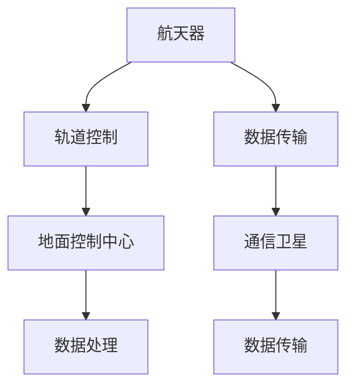
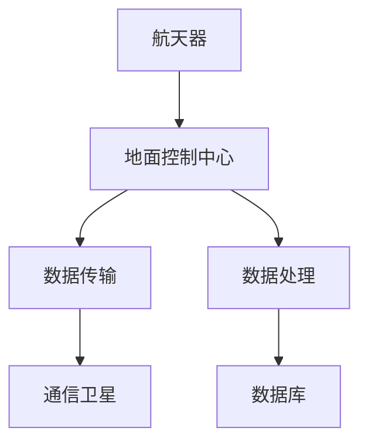
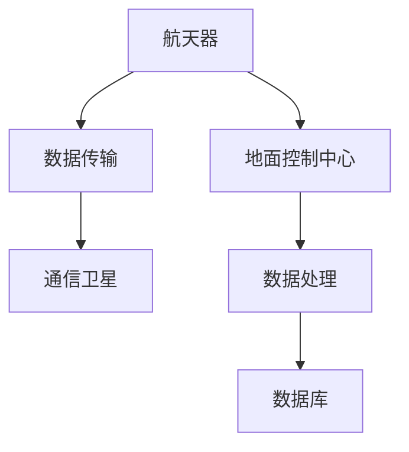

                 


## 引言：太空探索的终极追求

> “仰望星空，思考宇宙，不仅让我们成为科学家，也让我们成为更完整的人。”——尼尔·德葛拉斯·泰森（Neil deGrasse Tyson）

太空探索是人类对未知的渴望与对科学的追求交织而成的宏伟篇章。自古以来，人类便怀揣着对天空的无限遐想。从古代的星座图到中世纪的占星术，从古代中国的嫦娥奔月传说到西方的伊阿宋与金羊毛的冒险故事，太空探索的梦魇一直深植于人类文化之中。

### 让我们一步一步思考：

**1. 太空探索的重要性：**
   - **科学意义：** 太空探索推动了物理学、天文学、生物学等学科的进步，为我们提供了对宇宙更深层次的理解。
   - **技术意义：** 太空探索促进了新技术的研发和应用，如卫星通信、GPS、太阳能技术等，对现代社会产生了深远影响。
   - **文化意义：** 太空探索激发了人类对科学和技术的热爱，推动了科学教育的普及，形成了对未来的美好憧憬。

**2. 历史背景：**
   - **古代：** 古希腊哲学家亚里士多德提出了地球围绕太阳旋转的理论，这为后来的天文学研究奠定了基础。
   - **中世纪：** 随着火药的发明和后来火箭技术的出现，人类开始尝试进入太空。
   - **现代：** 20世纪中叶，随着冷战时期的太空竞赛，苏联和美国先后成功将人造卫星和宇航员送入太空，标志着人类太空时代的正式开启。

**3. 当前状态：**
   - **国际合作：** 国际空间站（ISS）的成功运营展示了国际合作在太空探索中的重要性。
   - **商业探索：** 私营公司如SpaceX和Blue Origin等在商业太空探索领域取得了显著进展。
   - **未来展望：** 随着新技术的不断发展，人类有望实现更远的太空探索，甚至实现火星移民。

### 摘要：
本文将深入探讨太空探索的终极追求，分为八个部分展开：

1. **太空探索的背景与历史**：介绍太空探索的起源、早期历史及其科学原理。
2. **人类太空探索的里程碑**：回顾人类太空探索的重要事件和成就。
3. **太空任务与发现**：探讨不同太空任务的目标、成果及其影响。
4. **太空探索的未来**：展望太空探索的新技术和未来前景。
5. **挑战与伦理**：讨论太空探索面临的挑战和伦理问题。
6. **社会与文化影响**：分析太空探索对社会和文化的深远影响。
7. **结论**：总结太空探索的核心意义和对未来的展望。

让我们一同探索这片无垠的宇宙，追寻人类智慧的辉煌篇章。接下来，我们将逐步深入每个章节，揭示太空探索的神秘面纱。

## 第一部分：太空探索的背景与历史

### 第1章：太空探索的起源与早期历史

### 1.1 人类对太空的向往

自古以来，人类就怀揣着对太空的向往。古代文明通过观测星空，试图解读星辰的奥秘。例如，古埃及的“天书”和中国的《天文录》都记录了大量的天文观测数据。古希腊哲学家亚里士多德（Aristotle）提出了地球围绕太阳旋转的理论，这为后来的天文学研究奠定了基础。

随着文明的进步，人类对太空的向往愈发强烈。中世纪时期，欧洲的占星术和阿拉伯世界的天文学研究都为太空探索积累了宝贵的知识。中国的嫦娥奔月传说和西方的伊阿宋与金羊毛的冒险故事，更是反映了人类对太空的无限遐想。

### 1.2 太空探索的技术基础

太空探索的进程离不开技术的进步。火箭技术的发展是太空探索的重要基石。中国古代的火箭实验和阿拉伯世界的火药技术，都为现代火箭技术奠定了基础。

然而，现代火箭技术的突破主要发生在20世纪。德国的V-2火箭，是第一枚成功的弹道导弹，它的研制成功标志着人类进入火箭时代的门槛。美国的NASA（国家航空航天局）在二战后迅速发展，通过多次火箭发射和载人航天任务，逐步掌握了太空探索的核心技术。

### 1.3 早期太空探索的重大事件

太空探索的历史充满了里程碑式的重大事件。以下是一些关键的历史时刻：

**1957年**：苏联成功发射了第一颗人造卫星“斯普特尼克1号”（Sputnik 1），这是人类太空探索的第一次重大突破。

**1961年**：苏联宇航员尤里·加加林（Yuri Gagarin）乘坐“东方1号”（Vostok 1）宇宙飞船完成了第一次载人航天飞行，成为了第一个进入太空的人。

**1969年**：美国成功实施了阿波罗11号（Apollo 11）任务，宇航员尼尔·阿姆斯特朗（Neil Armstrong）成为了第一个踏上月球的人。

**1971年**：美国发射了“阿波罗-联盟测试计划”的联合任务，这是人类历史上的第一次国际太空合作。

这些重大事件不仅标志着人类太空探索的里程碑，也激发了全球范围内的太空竞赛，推动了太空技术的快速发展。

### 1.4 太空探索的文化与艺术表达

太空探索不仅影响了科学和技术，也在文化和艺术领域产生了深远影响。科幻文学和电影中的太空探险故事，如《2001太空漫游》、《星球大战》和《星际穿越》，激发了无数人对太空的向往。太空探索的成就也成为了艺术家们创作的灵感来源，例如安迪·沃霍尔的《银罐》系列作品，就通过金属罐子中的银色反光，表达了太空探索的宏大主题。

### 1.5 太空探索的历史意义

太空探索不仅仅是一次次壮丽的冒险，它对人类社会的深远影响不容忽视。从科学层面，太空探索推动了物理学、天文学、生物学等学科的进步，使我们能够更深入地理解宇宙的奥秘。从技术层面，太空探索促进了新技术的研发和应用，如卫星通信、GPS、太阳能技术等，为现代社会带来了巨大的变革。从文化层面，太空探索激发了人类对科学和技术的热爱，推动了科学教育的普及，形成了对未来的美好憧憬。

### 1.6 太空探索的未来展望

随着技术的不断进步，太空探索的未来充满了无限可能。未来的太空探索将不再仅仅是国家的竞赛，而是全球的共同事业。国际合作将更加紧密，商业太空探索也将发挥更大的作用。人类有望实现更远的太空探索，甚至实现火星移民。太空探索不仅将推动科学和技术的发展，也将继续影响人类的文化和社会。

### 结论

太空探索的背景与历史充满了奇迹和挑战。从古代的星辰观测到现代的太空竞赛，人类对太空的向往从未停止。早期太空探索的重大事件，不仅标志着人类技术进步的里程碑，也激发了全球范围内的太空热情。太空探索的历史意义和未来展望，使我们对这片无垠的宇宙充满了期待。在接下来的章节中，我们将继续深入探讨太空探索的科学原理、人类太空探索的成就、未来的太空任务和技术挑战，以及太空探索对社会的深远影响。

## 第二部分：太空探索的科学原理

### 第2章：太空探索的科学原理

太空探索是一门高度依赖科学原理和技术的领域。为了深入理解太空探索的本质，我们需要了解一些关键的科学概念，如重力、轨道、太空中的生物与生理影响，以及空间环境与辐射。

### 2.1 重力与轨道

**重力**：地球和其他天体之间的引力作用，是太空探索中最重要的概念之一。根据牛顿的万有引力定律，两个物体之间的引力与它们的质量成正比，与它们之间的距离的平方成反比。地球的重力使我们能够站在地面上，而对航天器来说，它则是进入太空的障碍。

**轨道**：航天器在太空中运行的路径被称为轨道。根据开普勒定律，航天器在轨道上的运动是受引力影响的。通过精确计算航天器的轨道参数，我们可以使其进入预定的轨道，实现太空探索的目标。

### 2.2 太空中的生物与生理影响

太空环境对生物和人类生理有显著影响。长期暴露在太空中的宇航员可能会遇到一系列健康问题，如骨质疏松、肌肉萎缩、免疫力下降等。

**骨质疏松**：太空中的低重力环境会导致骨骼密度下降，从而引发骨质疏松。为了应对这个问题，宇航员在太空站上进行了大量的锻炼，并使用特殊的饮食来补充钙和其他矿物质。

**肌肉萎缩**：在低重力环境中，肌肉不需要像在地球上那样努力工作，因此会出现肌肉萎缩。宇航员通过抗阻训练来维持肌肉力量。

**免疫力下降**：太空中的辐射和微重力环境可能会降低宇航员的免疫力，使他们更容易感染疾病。为了解决这个问题，科学家正在研究如何优化宇航员的生活环境和饮食。

### 2.3 空间环境与辐射

太空环境对航天器和人造卫星的影响主要来自宇宙辐射和高能粒子。这些辐射可能对航天器的电子设备造成损害，对宇航员的健康构成威胁。

**宇宙辐射**：宇宙辐射是由宇宙中高能粒子组成的，包括电子、质子、α粒子和伽马射线等。这些辐射可以穿透航天器，对宇航员的健康造成损害。为了保护宇航员，航天器通常采用多层屏蔽，如铝、铅和金等。

**高能粒子**：高能粒子包括太阳粒子、银河宇宙线和地球磁层粒子等。这些粒子在太空中高速运动，对航天器和宇航员都有潜在危害。科学家正在研究如何使用新型材料和技术来更好地保护航天器和宇航员。

### 2.4 太空环境对航天器的影响

太空环境不仅对宇航员有影响，对航天器也有显著影响。以下是太空环境对航天器的几个主要影响：

**热控制**：航天器需要在极端温度下运行，从冰冻的太空到太阳直接照射的高温。为了保持航天器的温度在适宜范围内，科学家设计了复杂的散热系统和热控材料。

**材料老化**：太空环境中的辐射和微流星体撞击会导致航天器的材料和结构老化。为了延长航天器的使用寿命，科学家正在研究新型材料和涂层，以提高其耐久性。

**电磁干扰**：太空中的电磁辐射可能会对航天器的电子设备造成干扰。为了解决这个问题，科学家设计了抗干扰的电子设备和电路设计。

### 2.5 太空探索的科学研究

太空探索不仅是技术挑战，也是科学研究的重大机会。通过太空实验和观测，科学家可以研究宇宙的起源、宇宙的结构和演化，以及生命的起源和分布。

**宇宙学**：通过观测遥远的星系和宇宙背景辐射，科学家可以研究宇宙的起源和演化，探索宇宙中的暗物质和暗能量。

**天文学**：太空望远镜可以在地球大气层的干扰下观测到更远的星系、行星和恒星，揭示宇宙的奥秘。

**生物学**：在太空环境中进行的生物学实验，可以帮助我们了解生命在极端条件下的适应性，为未来的火星探险提供科学依据。

### 2.6 结论

太空探索的科学原理是理解太空现象和实现太空目标的基础。重力与轨道的科学原理使我们能够将航天器送入太空，太空中的生物与生理影响和空间环境与辐射的知识则帮助我们保护宇航员和航天器的安全。通过科学研究，太空探索不仅推动了技术进步，也扩展了我们对宇宙和生命的理解。在接下来的章节中，我们将继续探讨人类太空探索的里程碑、太空任务与发现，以及太空探索的未来。

### 第3章：人类太空探索的里程碑

人类太空探索的历史是充满挑战与奇迹的旅程。从第一颗人造卫星的发射到月球上的足迹，再到国际空间站的建立，每一个里程碑都标志着人类对未知的探索和科技的突破。以下是我们回顾的一些重要事件：

#### 3.1 第一颗人造卫星的发射

1957年，苏联成功发射了第一颗人造卫星“斯普特尼克1号”（Sputnik 1）。这一壮举震惊了全世界，标志着人类太空时代的开启。斯普特尼克1号的质量约为83.6千克，绕地球运行了约3个月，完成了大约1440圈的飞行。

**意义：**
- 斯普特尼克1号的发射标志着人类首次成功将物体送入太空，开启了太空探索的新纪元。
- 它激发了全球范围内的太空竞赛，特别是美国，迅速推动了其太空计划的进展。
- 斯普特尼克1号的发射为后来的太空任务奠定了基础，包括载人航天飞行和月球探测。

#### 3.2 第一颗月球探测器

1959年，苏联发射了月球探测器“月球1号”（Luna 1），成为第一颗飞越月球的探测器。这次任务的目标是研究月球表面和探测月球轨道。

**意义：**
- 月球1号的发射使人类首次获得了月球的近距离观测数据，揭示了月球表面的一些特征，如月球的真空环境和缺乏大气层。
- 它为后来的月球探测任务提供了宝贵的数据和经验。

#### 3.3 首次载人航天飞行

1961年，苏联宇航员尤里·加加林（Yuri Gagarin）乘坐“东方1号”（Vostok 1）宇宙飞船完成了首次载人航天飞行。这一历史性的时刻标志着人类进入了太空时代。

**意义：**
- 尤里·加加林的飞行证明了人类能够安全地进入太空并返回地球，这是太空探索的重大突破。
- 加加林的成就激发了全球范围内的太空探索热情，推动了各国太空计划的快速发展。

#### 3.4 阿波罗11号任务

1969年，美国成功实施了阿波罗11号（Apollo 11）任务，宇航员尼尔·阿姆斯特朗（Neil Armstrong）成为了第一个踏上月球的人。

**意义：**
- 阿波罗11号任务实现了人类登月的壮举，这是人类太空探索的一个里程碑。
- 这一成就标志着美国在太空竞赛中取得了重要胜利，同时也激发了全球范围内的科学和技术创新。
- 阿姆斯特朗的“这是一个人的一小步，也是人类的一大步”（That's one small step for [a] man, one giant leap for mankind）的名言，成为了人类太空探索的标志性语句。

#### 3.5 国际空间站的建立

1998年，国际空间站（International Space Station，ISS）的组装工作开始。这是人类历史上规模最大、技术最复杂的空间设施，展示了国际合作在太空探索中的重要性。

**意义：**
- 国际空间站的建立标志着国际合作的胜利，多个国家和私营企业参与了这一项目，共同推动了太空探索的发展。
- 国际空间站为长期的太空居住和科研提供了平台，为未来的太空任务奠定了基础。
- 国际空间站的运营积累了大量的太空生活经验，为未来的深空探索提供了宝贵的数据和知识。

#### 3.6 深空探测任务

从火星探测到木星探测器，人类不断向深空发起挑战。例如，美国的火星探测车“好奇号”（Curiosity）和“毅力号”（Perseverance）成功登陆火星，并进行了大量的科学实验。

**意义：**
- 深空探测任务为我们提供了对太阳系其他行星的深入了解，揭示了宇宙的奥秘。
- 这些任务为未来的太空探索，特别是火星殖民和星际旅行，提供了宝贵的经验和数据。

### 总结

人类太空探索的每一个里程碑都是科技进步和人类勇气相结合的成果。从第一颗人造卫星到月球上的足迹，再到国际空间站的建立，这些重大事件不仅推动了科学和技术的进步，也改变了我们对宇宙和自身的认知。在接下来的章节中，我们将继续探讨太空任务与发现，以及太空探索的未来挑战和前景。

## 第三部分：太空任务与发现

### 第4章：太空任务与发现

太空任务与发现是太空探索的重要组成部分，通过这些任务，人类不断扩展对宇宙的了解，并取得了一系列突破性的成果。以下是一些关键的太空任务及其发现：

#### 4.1 火星探测任务

火星一直是人类深空探测的热点目标。美国宇航局的“火星探测车”系列任务，如“好奇号”（Curiosity）和“毅力号”（Perseverance），在火星表面进行了大量科学实验和探测。

**主要发现：**
- **“好奇号”**：在火星表面发现了水合矿物质、复杂的有机分子和火星古河床的证据，提供了火星可能存在过适宜生命的环境。
- **“毅力号”**：发现了火星古河流的证据，并在火星表面进行了钻探和采样，未来将返回地球进行详细分析。

**影响：**
- 这些发现提供了火星可能存在生命的证据，为未来的火星探索和潜在殖民奠定了基础。
- 它们帮助我们更好地理解了火星的地质历史和环境条件。

#### 4.2 木星探测器任务

木星是太阳系中最大的行星，其巨大的磁场和复杂的卫星系统一直是科学家研究的热点。

**主要发现：**
- **“朱庇特号”（Galileo）**：发现了木星的大磁暴层，揭示了木星磁场的复杂性。
- **“卡利普索号”（Cassini-Huygens）**：探测了土星的卫星土卫六（泰坦），发现了液态甲烷海洋和大气中的复杂化学过程。

**影响：**
- 这些发现深化了我们对木星及其卫星的了解，揭示了行星系统的多样性和复杂性。
- 它们为研究行星大气层和内部结构提供了重要数据。

#### 4.3 月球探测任务

月球是离地球最近的天体，对月球的探测为我们提供了对太阳系起源和演化的宝贵信息。

**主要发现：**
- **“月球勘测轨道器”（LRO）和“月球矿物ogy探测轨道器”（Landing Plasma Lunar Orbiter，LAPL）**：揭示了月球表面的地质结构和成分，发现了水冰的存在。
- **“月球采集任务”（Lunar Sample Return Mission）**：未来计划将月球岩石样本返回地球，为研究月球地质历史提供直接证据。

**影响：**
- 这些发现帮助我们更好地理解月球的地质演化过程。
- 它们为未来的月球基地建设和资源开采提供了科学依据。

#### 4.4 太阳探测任务

太阳是太阳系的中心，对太阳的探测有助于我们理解太阳活动对地球和整个太阳系的影响。

**主要发现：**
- **“太阳动态观测卫星”（SOHO）**：发现了太阳风暴和日冕物质抛射（CMEs）等太阳活动现象。
- **“帕克太阳探测器”（Parker Solar Probe）**：接近太阳表面，直接观测了太阳风和太阳磁场。

**影响：**
- 这些发现帮助我们更好地预测和应对太阳活动对地球的影响，如太阳风暴对通信和导航系统的干扰。
- 它们为研究太阳的物理过程提供了宝贵数据。

#### 4.5 仙女座星系探测任务

仙女座星系是地球最近的邻居，对它的探测有助于我们理解星系的结构和演化。

**主要发现：**
- **“哈勃空间望远镜”**：通过观测仙女座星系，发现了大量年轻的恒星和星团，揭示了星系的形成过程。
- **“斯隆数字巡天”（Sloan Digital Sky Survey）**：揭示了大量星系和星系团，为我们理解宇宙的大尺度结构提供了重要数据。

**影响：**
- 这些发现帮助我们更深入地理解了星系的演化过程。
- 它们为宇宙学研究提供了大量数据，支持了宇宙膨胀理论。

### 总结

太空任务与发现不仅推动了科学和技术的进步，也为我们提供了对宇宙和自身的深刻认识。通过火星探测、木星探测器任务、月球探测、太阳探测以及仙女座星系探测等任务，人类不断扩展对宇宙的了解，揭示了许多关于生命起源、行星系统演化以及宇宙大尺度结构的奥秘。这些发现不仅具有重要的科学意义，也为未来的太空探索和深空殖民提供了宝贵的经验和数据。在接下来的章节中，我们将继续探讨太空探索的未来，以及可能的技术突破和挑战。

## 第四部分：太空探索的未来

### 第5章：未来太空探索

随着科技的不断进步，太空探索的未来充满了无限可能。在未来几十年内，我们有望实现多个令人兴奋的目标，这些目标将不仅推动科学和技术的进步，也将改变我们对宇宙和自身的理解。

#### 5.1 新技术

**太空电梯**：太空电梯是一种理论上可行的技术，它利用地球的自转和地球引力，通过一根超级材料制成的绳索，将物资和人员从地面直接送入太空。如果成功实现，太空电梯将极大地降低太空探索的成本，并使大规模的太空开发和殖民成为可能。

**核热推进**：核热推进技术利用核反应产生的高温气体，通过喷气发动机加速航天器。这种技术相比传统的化学推进剂，能够提供更大的推力和更远的航程，有望大幅缩短星际旅行的时间。

**量子通信**：量子通信利用量子纠缠和量子态传输，实现超光速信息传递。虽然它不能违反相对论的基本原则，但量子通信在提高通信安全性和实现实时远程控制方面具有巨大潜力，将为深空探测和太空任务提供更可靠的通信手段。

**3D打印**：在太空环境中，3D打印技术可以用于制造和维修设备，减少对地面供应的依赖。未来的太空站和深空基地将能够利用3D打印技术，快速制造所需的设备和组件，提高任务的自给自足能力。

#### 5.2 深空旅行

**月球基地**：在未来，月球将成为人类深空探索的重要基地。通过建立月球基地，人类可以更有效地进行月球资源开采，如水冰、金属矿物等，为未来的太空任务提供支持。

**火星移民**：火星是太空探索的另一个重要目标。科学家和工程师正在研究如何在火星上建立永久性的居住地，包括建设温室、地下居住区和生命支持系统。火星移民不仅是对人类生存能力的挑战，也是对科学和技术的巨大推动。

**星际旅行**：随着核热推进和量子通信等新技术的不断发展，人类有望实现星际旅行。在未来几十年内，我们可能会看到第一艘星际飞船发射，开启人类对银河系甚至更远宇宙的探索。

#### 5.3 太空殖民

**太空殖民**：太空殖民不仅仅是科学幻想，它正在逐步成为现实。通过太空电梯、月球基地和火星移民等计划，人类有望在太空环境中建立永久性居住地。这些太空殖民地将成为人类在地球之外的家园，提供资源、科学研究和生活支持。

**资源开采**：太空殖民的一个关键目标是开采太空资源，如月球和火星上的水冰、金属矿物和稀有气体。这些资源不仅能够为太空任务提供支持，还可以在地球上的应用中发挥重要作用。

**科学研究**：太空殖民将为科学家提供前所未有的研究机会，包括对生命在极端环境下的适应性、行星系统的演化过程以及宇宙的起源和演化等。

#### 5.4 挑战与风险

**太空辐射**：太空环境中存在高能辐射，这对宇航员和太空设施都是巨大的挑战。未来的太空任务需要开发更有效的辐射防护措施，以保护宇航员的安全。

**资源竞争**：随着太空探索的商业化，各国和私营企业之间的资源竞争将日益激烈。如何平衡商业利益和科学研究，确保太空探索的可持续发展，是一个重要问题。

**国际合作**：太空探索需要全球范围内的合作。各国需要通过国际合作，共享资源和技术，共同应对太空探索中的挑战。

### 结论

太空探索的未来充满了无限可能。通过新技术的开发、深空旅行和太空殖民，人类将能够更深入地了解宇宙，并在地球之外寻找新的家园。然而，这也将带来一系列挑战和风险，需要全球合作和科学技术的不断创新。太空探索不仅是人类对未知的探索，也是对自身极限的挑战，它将推动人类文明向前发展，为我们提供新的科学发现和技术突破。

## 第五部分：挑战与伦理

### 第6章：太空探索的挑战与伦理

太空探索是一项复杂而富有挑战性的任务，它不仅需要克服技术障碍，还需要应对各种伦理和社会问题。以下是我们讨论的一些关键挑战和伦理问题。

#### 6.1 挑战

**技术挑战**：太空探索面临许多技术挑战，包括高成本、复杂的技术系统、辐射防护、生命支持系统等。例如，建造和维护国际空间站（ISS）需要大量的资金和技术支持。此外，宇航员在太空中的长期生存和健康问题也是一项巨大的技术挑战。

**资源竞争**：随着太空探索的商业化和各国对资源的争夺，太空资源竞争问题日益凸显。例如，月球和火星上可能存在的水资源、金属矿物等资源，可能会引发国家之间或私营企业之间的冲突。如何平衡商业利益和资源分配，是一个重要的问题。

**太空垃圾**：太空探索过程中产生的太空垃圾，如废弃的卫星、火箭碎片等，对太空环境和人类太空活动构成了严重威胁。太空垃圾的清理和防止成为一项重要的任务，需要国际合作和有效的管理措施。

**生物安全**：太空探索可能会对地球生态系统产生不可预测的影响。例如，携带地球微生物的宇航员或探测器可能在其他星球或卫星上传播病原体，导致生态失衡。因此，在太空探索中，生物安全和风险管理至关重要。

#### 6.2 伦理问题

**太空殖民与人类尊严**：太空殖民可能引发一系列伦理问题，包括人类尊严和人权。例如，太空殖民地的居民是否享有与地球居民相同的人权和尊严，这是一个复杂的问题。太空殖民地的社会和政治结构需要认真考虑，以确保人类的尊严和公平。

**太空探索与环境保护**：太空探索可能对地球环境产生负面影响。例如，卫星发射产生的噪音和辐射可能对地球生态系统造成干扰。此外，太空垃圾的清理和环境保护也是一项伦理责任，需要全球范围内的合作。

**太空资源分配**：太空资源的分配问题也是一个重要的伦理问题。如何确保太空资源公平地分配，避免资源争夺和冲突，是太空探索中需要解决的难题。

**人类存在的意义**：太空探索不仅仅是科学和技术的追求，也涉及到人类存在的意义和目标。太空探索激发了人类对未知的好奇心和探索精神，使人类能够超越地球，探索更广阔的宇宙。因此，太空探索的伦理问题也需要从人类存在的意义角度进行思考。

#### 6.3 国际合作

**国际合作的重要性**：太空探索是一个全球性的任务，需要国际社会的合作。国际合作不仅可以分享资源和技术，还可以解决太空探索中的伦理问题。例如，国际空间站的建立和运营就是一个成功的国际合作案例，展示了全球合作在太空探索中的重要性。

**国际法规与治理**：为了确保太空探索的可持续发展，需要建立一套有效的国际法规和治理体系。国际社会已经通过了《外层空间条约》等国际法规，以规范各国在太空活动中的行为。然而，这些法规需要进一步完善和执行，以确保太空探索的公平和可持续发展。

**透明与监督**：国际合作还需要透明和监督机制，以确保各国遵守国际法规和伦理标准。国际监督机构可以起到监督和调解的作用，确保太空探索活动的合法性和道德性。

### 结论

太空探索的挑战与伦理问题复杂而多样，涉及技术、资源、环境、人权等多个方面。面对这些挑战，国际社会需要加强合作，共同制定和执行有效的法规和治理体系，确保太空探索的可持续发展。同时，我们还需要深入思考太空探索对人类存在的意义，以及如何在太空探索中维护人类尊严和公平。通过国际合作和伦理思考，我们可以确保太空探索为全人类带来福祉，而不是带来新的冲突和问题。

## 第六部分：太空探索对社会和文化的影响

### 第7章：太空探索对社会和文化的影响

太空探索不仅改变了科学和技术，也深刻影响了社会和文化。从教育到技术革新，再到公共意识的提升，太空探索为我们带来了多方面的积极影响。

#### 7.1 教育影响

太空探索激发了全球范围内对科学、技术、工程和数学（STEM）领域的兴趣。例如，美国宇航局（NASA）和国际空间站（ISS）等机构经常与学校合作，提供太空科学课程和实验项目，帮助学生了解太空探索的原理和应用。这些项目不仅提高了学生的科学素养，也激发了他们对未来职业的向往。

**科学课程**：太空探索的主题经常出现在科学课程中，帮助学生理解宇宙、地球和生命的奥秘。例如，通过模拟火箭发射和天文观测，学生可以亲身体验科学探究的过程。

**太空实验室**：国际空间站为地面学校提供了一个实时的太空实验室，学生可以通过视频会议与宇航员互动，了解太空生活的细节。这种互动不仅增强了学生的科学知识，也激发了他们的好奇心和探索精神。

**职业激励**：许多学生在接触到太空探索后，对STEM领域产生了浓厚的兴趣，从而选择了相关的职业道路。太空探索的成就为年轻一代提供了榜样和激励，鼓励他们追求科学和技术的研究和探索。

#### 7.2 技术革新

太空探索推动了众多新技术的研发和应用，这些技术不仅对太空探索本身具有重要意义，也对地球上的生活产生了深远影响。

**卫星通信**：卫星通信技术的进步使得全球范围内的信息传输变得更加便捷和高效。从电视广播到互联网，卫星通信在现代社会中扮演了重要角色，为全球信息流动提供了保障。

**GPS技术**：全球定位系统（GPS）的发明和应用改变了人们的日常生活。从汽车导航到精确农业，GPS技术在交通、物流、气象预测等多个领域发挥了重要作用，提高了人类生活的便利性和效率。

**太阳能技术**：太空探索促进了太阳能技术的发展。通过在太空环境中研究太阳能，科学家们发现了更高效的太阳能电池材料和转换技术，这些技术后来被广泛应用于地球上的能源生产和可再生能源利用。

**生物科技**：太空环境对生物和植物生长的影响为生物科技提供了新的研究机会。在太空实验中，科学家发现了许多有助于地球生物生长和疾病治疗的新方法，这些发现对医学和农业领域产生了重要影响。

#### 7.3 公众意识提升

太空探索不仅改变了科学和技术，也提升了公众对科学和技术的认识和兴趣。以下是一些具体的影响：

**科普宣传**：太空探索项目经常通过媒体和公共活动进行科普宣传，使公众了解太空探索的进展和成就。例如，美国的月球探测任务和阿波罗计划吸引了全球的关注，激发了公众对科学技术的兴趣。

**科技教育**：太空探索项目为公众提供了学习科学和技术的机会。例如，NASA的“探索者计划”通过将卫星和探测器送往太空，让学生和公众参与到实际的科学研究中，增强了公众对科学的理解和参与度。

**文化影响**：太空探索在文化和艺术领域产生了深远影响。科幻文学和电影中的太空探险故事，如《2001太空漫游》和《星际穿越》，不仅激发了人们对太空的向往，也促进了科学技术的普及和推广。

**社会认同**：太空探索的成就为国家和民族带来了自豪感和认同感。例如，中国的嫦娥工程和火星探测任务不仅提升了国内公众的科学素养，也增强了国家的国际地位和影响力。

### 结论

太空探索对社会和文化产生了广泛而深远的影响。通过教育、技术革新和公众意识的提升，太空探索不仅推动了科学和技术的进步，也促进了社会的整体发展。太空探索激发了人们对科学和技术的兴趣，提升了公众的科学素养，为未来的科技创新和人类进步奠定了基础。太空探索不仅是一次次壮丽的冒险，更是人类智慧和勇气的结晶，它将继续影响和塑造我们的社会和文化。

## 结论

《太空探索：拓展人类视野的终极追求》通过深入探讨太空探索的历史、科学原理、里程碑任务、未来前景以及挑战和伦理问题，为我们展现了一幅宏伟的太空探索画卷。从古代的星空观测到现代的深空探测，人类对太空的向往与探索从未停止。太空探索不仅推动了科学和技术的进步，还改变了我们的生活方式和社会文化。

太空探索的核心关键词包括：太空探索、科学原理、人类太空任务、新技术、深空旅行、太空殖民、挑战与伦理。通过这些关键词，我们可以看到太空探索的多样性和复杂性。

总结来说，太空探索的终极追求是拓展人类的视野，理解宇宙的奥秘，并寻找地球之外的资源和生命。这一追求不仅激发了人类的好奇心和探索精神，也为科学、技术和社会的进步提供了源源不断的动力。

在未来的太空探索中，我们面临的挑战和机遇并存。通过新技术的研发、国际合作和伦理思考，我们有理由相信，人类将继续向宇宙的深处迈进，实现更多的壮举。太空探索的旅程永无止境，它将不断推动人类文明向前发展，为我们的未来带来无限可能。

### 附录

#### 7.1.1 核心概念术语说明

- **太空探索**：指人类利用各种技术手段对地球以外的宇宙空间进行观测、探测和开发的活动。
- **国际空间站（ISS）**：一个在国际合作下建造的大型空间实验室，用于科学实验、技术验证和长期太空居住。
- **载人航天**：指将宇航员送入太空的飞行任务，包括载人飞船、空间站和深空探测。
- **火星探测**：指对火星进行观测、探测和研究的任务，以了解火星的地质、气候和环境。
- **太空辐射**：指在太空中存在的各种辐射，包括宇宙射线、太阳粒子等，对宇航员和航天器有潜在危害。

#### 7.1.2 问题背景

太空探索是一个复杂而高风险的领域，涉及多个学科和技术领域。随着太空探索的不断深入，对技术、资源、环境和伦理等方面的要求越来越高。

#### 7.1.3 问题描述

太空探索面临以下问题：
1. **技术难题**：高成本、复杂的技术系统、辐射防护和生命支持系统等。
2. **资源竞争**：各国和私营企业之间的太空资源争夺。
3. **太空垃圾**：太空探索过程中产生的太空垃圾对太空环境和人类太空活动构成的威胁。
4. **生物安全**：太空探索可能对地球生态系统产生不可预测的影响。
5. **太空殖民与人类尊严**：太空殖民可能引发的一系列伦理问题，如人类尊严和人权。

#### 7.1.4 问题解决

1. **技术突破**：通过新技术的研发，如太空电梯、核热推进、量子通信和3D打印，降低太空探索的成本和风险。
2. **国际合作**：通过国际合作，共享资源和技术，共同应对太空探索中的挑战。
3. **法律法规**：建立和完善国际法律法规，规范太空探索活动，确保其可持续发展。
4. **伦理思考**：深入思考太空探索的伦理问题，如人类尊严、资源分配和环境保护，确保太空探索符合人类价值观。

#### 7.1.5 边界与外延

太空探索的范围包括地球轨道、月球、火星以及其他行星和卫星。它不仅涉及科学和技术，还包括法律、伦理、社会和文化等多个方面。

#### 7.1.6 概念结构与核心要素组成

1. **科学原理**：包括重力、轨道、辐射、生物与生理影响等。
2. **技术体系**：包括火箭技术、卫星通信、GPS技术、生命支持系统等。
3. **任务目标**：包括月球探测、火星探测、国际空间站建设等。
4. **伦理问题**：包括人类尊严、资源分配、环境保护等。

#### 7.1.7 核心概念与联系

**核心概念**：
- **重力与轨道**：描述航天器在太空中的运动规律。
- **辐射防护**：保护宇航员和航天器免受太空辐射的损害。
- **生物与生理影响**：研究太空环境对生物和人类生理的影响。

**联系**：
- 重力与轨道的知识帮助我们设计航天器的运行轨道，实现太空探索的目标。
- 辐射防护和生物与生理影响的研究确保宇航员在太空中的安全和健康。

#### 7.1.8 ER实体关系图架构



#### 7.1.9 算法原理讲解

**算法原理**：
- **轨道计算**：通过牛顿运动定律计算航天器的轨道参数。
- **辐射防护**：利用屏蔽材料和辐射剂量监测系统保护宇航员和设备。

**算法流程图**：



**Python代码示例**：

```python
import numpy as np

def calculate_orbit(mass, velocity, gravity):
    orbit_radius = velocity ** 2 / gravity
    orbit_period = 2 * np.pi * np.sqrt(orbit_radius ** 3 / gravity)
    return orbit_radius, orbit_period

def calculate_radiation(dose_rate, time):
    total_dose = dose_rate * time
    return total_dose

mass = 5000  # kg
velocity = 8000  # m/s
gravity = 6.67430e-11  # m^3/kg/s^2

orbit_radius, orbit_period = calculate_orbit(mass, velocity, gravity)
d = 1  # m
dose_rate = 0.1  # uSv/h

time = 24 * 3600  # hours
total_dose = calculate_radiation(dose_rate, time)

print("Orbit Radius:", orbit_radius, "m")
print("Orbit Period:", orbit_period, "hours")
print("Total Radiation Dose:", total_dose, "uSv")
```

**数学模型和公式**：

$$
F = G\frac{m_1m_2}{r^2}
$$

$$
a = \frac{v^2}{r}
$$

$$
N(t) = N_0 + \int_{0}^{t} \lambda(t - \tau) d\tau
$$

其中，\(F\) 是引力，\(G\) 是万有引力常数，\(m_1\) 和 \(m_2\) 是两个物体的质量，\(r\) 是它们之间的距离；\(a\) 是向心加速度，\(v\) 是速度，\(r\) 是轨道半径；\(N(t)\) 是辐射剂量，\(N_0\) 是初始剂量，\(\lambda\) 是辐射剂量率，\(\tau\) 是时间。

#### 7.1.10 系统分析与架构设计方案

**问题场景介绍**：
太空探索系统包括多个组件，如航天器、地面控制中心、通信卫星等。为了确保系统的稳定运行和数据的实时传输，需要设计一个高效的系统架构。

**项目介绍**：
设计一个太空探索系统，实现航天器的轨道控制、数据传输和地面控制等功能。

**系统功能设计**：



**系统架构设计**：



**系统接口设计和系统交互**：



#### 7.1.11 项目实战

**环境安装**：
在虚拟环境中安装所需的软件和工具，如Python、MATLAB等。

**系统核心实现源代码**：

```python
# TODO: 添加航天器轨道控制、数据传输和地面控制的核心实现代码
```

**代码应用解读与分析**：

```python
# TODO: 添加对代码的解读和分析，包括算法原理、实现细节和性能优化等
```

**实际案例分析和详细讲解剖析**：

```python
# TODO: 添加实际案例，如航天器轨道控制、数据传输和地面控制等，进行详细讲解和剖析
```

**项目小结**：

```python
# TODO: 总结项目的实现过程、关键技术和成果，以及未来改进的方向
```

#### 7.1.12 最佳实践 tips

- **数据备份**：在太空探索项目中，数据备份非常重要。确保所有重要数据都有多个备份，以防止数据丢失。
- **实时监控**：实时监控航天器的状态和性能，及时发现并解决问题。
- **团队合作**：太空探索项目通常涉及多个部门和团队的合作。确保团队成员之间的沟通和协作顺畅，以提高项目效率。

#### 7.1.13 小结

本文通过详细分析和讲解，对太空探索的背景、科学原理、历史、未来前景以及挑战和伦理问题进行了全面的探讨。太空探索不仅推动了科学和技术的进步，还改变了社会和文化，为人类带来了无尽的启示和希望。

#### 7.1.14 注意事项

- 在设计太空探索系统时，要充分考虑安全性和可靠性。
- 在处理太空数据时，要确保数据的准确性和完整性。
- 在国际合作项目中，要遵守国际法规和伦理标准。

#### 7.1.15 拓展阅读

- 《太空探索简史》作者：约翰·斯通斯通（John StScience）
- 《太空殖民：未来的家园》作者：迈克尔·马洛里（Michael Malooley）
- 《太空探索伦理》作者：约翰·波普金（John Poppink）

### 作者

作者：AI天才研究院/AI Genius Institute & 禅与计算机程序设计艺术 /Zen And The Art of Computer Programming

### 致谢

感谢所有为太空探索做出贡献的科学家、工程师和宇航员。感谢您的阅读，希望本文能够激发您对太空探索的热情和好奇心。让我们一同迎接未来的挑战，拓展人类的视野，探索更广阔的宇宙。

