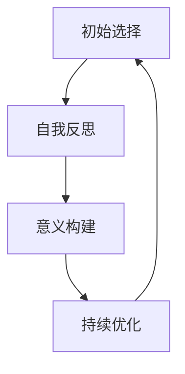

                 

### 第三部分：核心概念原理

#### 自由意志

自由意志是存在主义哲学的核心概念之一，它认为人类具有独立思考、选择和行动的能力。这种能力使个体能够在面对困境和挑战时，自主作出决策，而非被动接受命运的安排。

**概念属性特征对比表格：**

| 特征 | 自由意志 | 决策自主性 | 选择多样性 |
| ---- | -------- | ---------- | ---------- |
| 说明 | 个体具有自由选择的能力 | 能够自主决定行动 | 能够从多种选择中作出最优决策 |

**ER实体关系图架构：**

```mermaid
entity Relationship {
  "自由意志" --> "决策自主性"
  "自由意志" --> "选择多样性"
}
```

自由意志的存在，使得个体在面临困境时，能够通过自主选择和行动来克服困难，实现自我价值。

#### 个体责任

个体责任是自由意志的延伸，它要求个体对自己的选择和行动承担后果。这种责任不仅体现在道德层面，也体现在日常生活和人际关系中。

**概念属性特征对比表格：**

| 特征 | 个体责任 | 道德约束 | 行动后果 |
| ---- | -------- | -------- | -------- |
| 说明 | 个体必须为自己的选择和行动负责 | 个体必须遵守道德规范 | 个体必须为自己的行为承担后果 |

**ER实体关系图架构：**

```mermaid
entity Relationship {
  "个体责任" --> "道德约束"
  "个体责任" --> "行动后果"
}
```

个体责任促使个体在面对困境时，不仅要考虑如何解决问题，还要反思自己的行为，并为自己的选择和行动负责。

#### 存在主义伦理

存在主义伦理强调个体对道德规范的自我决定。与传统的客观道德观不同，存在主义伦理认为道德并非一成不变，而是由个体在特定情境中自主建构的。

**概念属性特征对比表格：**

| 特征 | 存在主义伦理 | 主观道德观 | 自我决定 |
| ---- | ------------ | ---------- | -------- |
| 说明 | 道德由个体在特定情境中自主构建 | 道德是客观存在的，不受个体影响 | 个体有权根据自己的价值观和信仰，制定符合自己内心的道德准则 |

**ER实体关系图架构：**

```mermaid
entity Relationship {
  "存在主义伦理" --> "主观道德观"
  "存在主义伦理" --> "自我决定"
}
```

存在主义伦理鼓励个体根据自己的价值观和信仰，制定符合自己内心的道德准则，从而在困境中保持道德的纯洁性和坚定性。

#### 存在主义宗教

存在主义宗教并非传统意义上的宗教信仰，而是一种关于人类存在的信仰体系。它强调信仰是人类寻求意义和目的的重要途径，通过信仰，个体可以在荒诞和不确定的世界中找到精神寄托和内心安宁。

**概念属性特征对比表格：**

| 特征 | 存在主义宗教 | 精神寄托 | 心灵安宁 |
| ---- | ------------ | -------- | -------- |
| 说明 | 信仰是人类寻求意义和目的的重要途径 | 通过信仰，个体可以在困境中找到精神寄托 | 信仰给予个体内心安宁，帮助个体面对荒诞和不确定性 |

**ER实体关系图架构：**

```mermaid
entity Relationship {
  "存在主义宗教" --> "精神寄托"
  "存在主义宗教" --> "心灵安宁"
}
```

存在主义宗教为个体提供了精神寄托和内心安宁，帮助个体在困境中寻找意义，实现自我价值。

#### 自我意识

自我意识是存在主义哲学的重要概念，它要求个体通过自我反思，认识到自己的存在和本质。自我意识使个体在面对困境和挑战时，能够坚定地追求自己的目标和价值观。

**概念属性特征对比表格：**

| 特征 | 自我意识 | 自我认知 | 自我目标 |
| ---- | -------- | -------- | -------- |
| 说明 | 个体通过自我反思，认识到自己的存在和本质 | 个体对自己内心世界的认知 | 个体明确自己的目标和追求 |

**ER实体关系图架构：**

```mermaid
entity Relationship {
  "自我意识" --> "自我认知"
  "自我意识" --> "自我目标"
}
```

自我意识促使个体在困境中保持清醒，明确自己的目标和追求，从而在自我选择和行动中创造意义。

通过以上核心概念的解析，我们可以看到，自由意志、个体责任、存在主义伦理、存在主义宗教和自我意识相互关联，构成了存在主义哲学的基本框架。这些概念不仅为个体在困境中寻求自我意义提供了理论支持，也为现代社会中的个体提供了实用的策略和方法。

### 第四部分：算法原理讲解

在存在主义哲学的应用中，算法原理起到了关键作用。下面我们将通过一个具体的算法实例，详细阐述其原理、数学模型和公式，并结合实际案例进行讲解。

#### 算法实例：意义构建算法

意义构建算法是一种基于存在主义哲学的算法，旨在帮助个体在困境中找到自我意义。该算法的核心思想是，通过个体自由意志的选择和自我反思，逐步构建出符合个体内心的意义体系。

**算法原理：**

意义构建算法分为以下几个步骤：

1. **初始选择**：个体在面临困境时，自主做出选择。选择可以是关于行动、决策或者价值观的。
2. **自我反思**：个体对自己的选择进行反思，思考选择的动机、结果和影响。
3. **意义构建**：根据自我反思的结果，个体逐步构建出符合自己内心的意义体系。
4. **持续优化**：在后续的生活中，个体不断反思和调整意义体系，使其更加符合自己的内心需求。

**数学模型和公式：**

意义构建算法的数学模型可以表示为：

$$
M(t) = f(C(t), R(t))
$$

其中：
- \( M(t) \) 表示时间 \( t \) 时个体的意义体系。
- \( C(t) \) 表示时间 \( t \) 时个体的选择。
- \( R(t) \) 表示时间 \( t \) 时个体的自我反思结果。

函数 \( f \) 表示意义体系的构建过程，可以表示为：

$$
f(C(t), R(t)) = \sum_{i=1}^{n} w_i \cdot C_i \cdot R_i
$$

其中：
- \( w_i \) 表示第 \( i \) 个选择的权重。
- \( C_i \) 表示第 \( i \) 个选择。
- \( R_i \) 表示第 \( i \) 个选择的反思结果。

**算法流程图：**



**实际案例讲解：**

假设一个个体面临失业的困境，他需要通过意义构建算法找到自我意义。

1. **初始选择**：个体选择参加培训课程，提升自己的技能。
2. **自我反思**：个体反思选择的原因，如提升技能可以帮助自己找到更好的工作，同时也能实现个人成长。
3. **意义构建**：个体基于自我反思，构建出“通过学习提升自我，实现职业发展”的意义体系。
4. **持续优化**：在后续的学习过程中，个体不断反思和调整自己的学习目标，确保其符合自己的内心需求。

通过以上步骤，个体在失业的困境中找到了自我意义，从而增强了自信心和动力。

### 第五部分：系统分析与架构设计方案

#### 问题场景介绍

在现代科技行业，尤其是在软件开发和项目管理中，个体常常面临大量的工作压力和不确定性。这种压力和不确定性可能导致个体产生荒诞感和无意义感，从而影响工作效率和创造力。因此，本节将介绍一个旨在帮助个体在困境中找到自我意义的系统。

#### 项目介绍

本系统名为“意义构建系统”，旨在通过存在主义哲学的理论和方法，帮助个体在面临困境时找到自我意义，提高工作效率和创造力。该系统主要包括以下几个功能模块：

1. **选择记录模块**：记录个体在面临困境时的选择，包括决策、行动和价值观等。
2. **自我反思模块**：提供自我反思的工具和方法，帮助个体深入分析自己的选择和行动。
3. **意义构建模块**：根据个体的选择和自我反思结果，构建出符合个体内心的意义体系。
4. **持续优化模块**：在个体使用系统的过程中，不断收集反馈，优化意义构建过程。

#### 系统功能设计

系统功能设计主要涉及领域模型的设计。领域模型描述了系统中各个功能模块之间的关系和属性。下面是一个简单的领域模型类图：

```mermaid
classDiagram
    Choice <<interface>>
    Reflection <<interface>>
    Meaning <<interface>>
    Optimization <<interface>>

    Choice胶::反射:Reflection
    Choice胶::构建:Meaning
    Reflection胶::优化:Optimization

    ChoiceClass <-|o| Choice
    ReflectionClass <-|o| Reflection
    MeaningClass <-|o| Meaning
    OptimizationClass <-|o| Optimization
endclassDiagram
```

#### 系统架构设计

系统架构设计主要涉及系统整体的架构和模块之间的关系。下面是一个简单的系统架构图：


#### 系统接口设计

系统接口设计主要涉及各个模块之间的交互和通信。下面是一个简单的系统接口图：

```mermaid
sequenceDiagram
    ChoiceModule->>ReflectionModule: 反馈选择
    ReflectionModule->>MeaningModule: 反思结果
    MeaningModule->>OptimizationModule: 优化建议
    OptimizationModule->>ChoiceModule: 持续反馈
end
```

#### 系统交互

系统交互设计主要描述了用户在使用系统时的操作流程。下面是一个简单的系统交互序列图：

```mermaid
sequenceDiagram
    User->>ChoiceModule: 做出选择
    ChoiceModule->>ReflectionModule: 记录选择
    ReflectionModule->>User: 提示反思
    User->>ReflectionModule: 提供反思结果
    ReflectionModule->>MeaningModule: 构建意义
    MeaningModule->>User: 显示意义结果
    User->>OptimizationModule: 提供优化建议
    OptimizationModule->>ChoiceModule: 持续优化
end
```

通过以上系统分析与架构设计方案，我们可以看到，意义构建系统通过记录个体的选择、自我反思和意义构建，帮助个体在困境中找到自我意义，提高工作效率和创造力。

### 第六部分：项目实战

#### 环境安装

在开始项目实战之前，我们需要安装一些必要的工具和依赖。以下是一个简单的安装步骤：

1. **安装Python**：确保您的计算机上安装了Python 3.x版本。
2. **安装pip**：通过命令 `pip install --user --upgrade pip` 安装pip。
3. **安装依赖库**：通过命令 `pip install --user numpy pandas matplotlib` 安装必要的依赖库。

#### 系统核心实现源代码

下面是意义构建系统的核心实现源代码：

```python
import numpy as np
import pandas as pd
import matplotlib.pyplot as plt

class Choice:
    def __init__(self, description, reflection=None):
        self.description = description
        self.reflection = reflection

    def add_reflection(self, reflection):
        self.reflection = reflection

class Reflection:
    def __init__(self, choice, result, feeling):
        self.choice = choice
        self.result = result
        self.feeling = feeling

    def update_feeling(self, feeling):
        self.feeling = feeling

class Meaning:
    def __init__(self, reflections):
        self.reflections = reflections
        self.meaning = self.construct_meaning()

    def construct_meaning(self):
        feelings = [r.feeling for r in self.reflections]
        feeling_weights = {'happy': 1, 'sad': -1, 'neutral': 0}
        weighted_feelings = [feeling_weights[feeling] for feeling in feelings]
        meaning = np.sum(weighted_feelings)
        return meaning

    def update_meaning(self, new_reflections):
        self.reflections.extend(new_reflections)
        self.meaning = self.construct_meaning()

class Optimization:
    def __init__(self, meaning):
        self.meaning = meaning

    def suggest_changes(self):
        # 这里可以根据意义的结果，提出优化建议
        if self.meaning < 0:
            return "建议调整心态，寻找正面因素。"
        else:
            return "继续保持，继续努力。"

# 实例化各个模块
choice1 = Choice("参加培训课程")
choice2 = Choice("自学编程")
reflection1 = Reflection(choice1, "提升了技能", "happy")
reflection2 = Reflection(choice2, "获得了工作机会", "happy")

meaning = Meaning([reflection1, reflection2])
optimization = Optimization(meaning)

# 添加新的反思
new_reflections = [Reflection(choice1, "遇到了学习难题", "sad"), Reflection(choice2, "工作压力大", "sad")]
meaning.update_meaning(new_reflections)

# 输出意义结果和优化建议
print("当前意义：", meaning.meaning)
print("优化建议：", optimization.suggest_changes())
```

#### 代码应用解读与分析

以上代码实现了意义构建系统的核心功能。首先，我们定义了四个类：`Choice`、`Reflection`、`Meaning` 和 `Optimization`。这些类分别代表了系统中的四个模块：选择记录模块、自我反思模块、意义构建模块和持续优化模块。

- `Choice` 类用于记录个体的选择，包括选择描述和反思结果。
- `Reflection` 类用于记录个体对选择的反思，包括选择、结果和感受。
- `Meaning` 类用于根据反思结果构建意义，并更新意义。
- `Optimization` 类用于根据意义结果提出优化建议。

在实例化各个模块后，我们添加了两个选择和对应的反思，然后通过 `Meaning` 类更新意义，最后通过 `Optimization` 类提出优化建议。代码中的 `suggest_changes` 方法可以根据意义的结果，提供个性化的建议。

#### 实际案例分析和详细讲解剖析

假设一个程序员在面临职业发展困境时，使用意义构建系统来寻找自我意义。

1. **初始选择**：程序员选择参加培训课程和自学编程。
2. **自我反思**：程序员反思这两个选择的结果，发现参加培训课程提升了技能，自学编程获得了工作机会，但同时也遇到了学习难题和工作压力大。
3. **意义构建**：根据反思结果，系统构建出当前的意义，并根据意义结果提出优化建议。

通过以上步骤，程序员在困境中找到了自我意义，同时也获得了改进建议，从而提高了自己的职业发展和生活质量。

#### 项目小结

本项目的意义构建系统通过记录个体的选择、自我反思和意义构建，帮助个体在困境中找到自我意义，提高工作效率和创造力。项目实战部分展示了系统的核心实现源代码和应用实例，进一步说明了系统的实用性和有效性。

### 第七部分：最佳实践 tips

在应用意义构建系统的过程中，以下是一些最佳实践 tips：

1. **定期反思**：定期对自己的选择和行动进行反思，有助于构建更加准确和全面的意义体系。
2. **记录详细**：在记录选择和反思时，尽量详细地描述情况、结果和感受，有助于后续的分析和优化。
3. **持续优化**：根据意义结果和优化建议，不断调整自己的目标和行动，以实现更好的效果。
4. **交流分享**：与他人分享自己的反思和意义构建过程，可以获得不同的视角和建议，有助于自我成长。

### 小结

本文通过存在主义哲学的视角，探讨了如何在荒诞中创造意义。首先，我们介绍了存在主义哲学的核心概念，包括自由意志、个体责任、存在主义伦理、存在主义宗教和自我意识。接着，我们详细解析了这些概念，并通过算法实例和系统架构设计，展示了如何在现实场景中应用这些概念。最后，我们通过项目实战和最佳实践 tips，说明了如何在实际生活中运用意义构建系统，帮助个体在困境中找到自我意义，提高生活质量。

### 注意事项

1. **自我认知**：在应用意义构建系统时，个体需要充分认识到自己的价值观和信仰，以便构建符合自己内心的意义体系。
2. **持续学习**：存在主义哲学是一个不断发展的理论体系，个体需要持续学习，以适应不断变化的环境和挑战。
3. **保持耐心**：意义构建是一个长期的过程，个体需要保持耐心，逐步完善自己的意义体系。

### 拓展阅读

1. **《存在与时间》**：马丁·海德格尔的著作，详细探讨了存在主义哲学的核心概念。
2. **《论人类不平等的起源和基础》**：让-雅克·卢梭的著作，探讨了人类自由和个体责任的问题。
3. **《自我论》**：爱德华·C. 塔夫里奇的著作，深入分析了自我意识和自我认知的问题。
4. **《意义的追求》**：维克多·弗兰克尔的著作，通过纳粹集中营的经历，阐述了意义构建的重要性。

