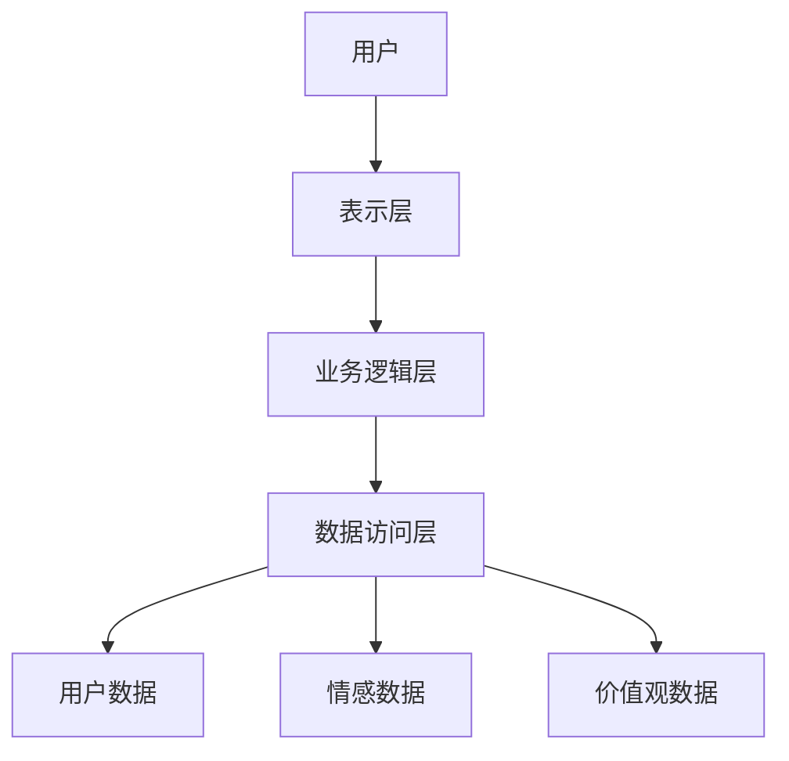
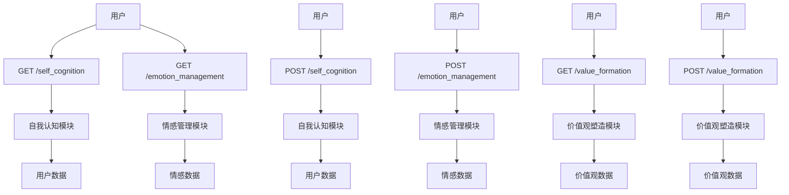

                 

### 第1章: 存在的深度：问题背景与内涵

在当今社会，人们追求表面的物质成功，却忽视内在的成长。这一现象不仅影响了个体的心理健康，也对社会的和谐发展构成了挑战。本文旨在探讨存在的深度，帮助读者理解并追求内在的成长。

#### 1.1 问题背景

现代社会中，物质生活水平的提升让人们拥有了更多的选择，但同时也带来了更多的压力和焦虑。许多人把财富、地位和名誉当作成功的标志，而忽略了精神层面的成长。这种倾向导致了人们在精神层面上感到空虚和迷茫。

##### 1.1.1 现状分析

在现代社会的日常生活中，很多人把工作和物质追求当作生活的全部。他们忽略了情感、关系和自我成长的重要性。这种生活方式使得人们在面对困境时，往往无法找到有效的应对方法，导致心理问题日益严重。

##### 1.1.2 存在的深度

存在的深度指的是个体在精神层面的成长和探索。它涉及到自我认知、情感管理、人际关系等多个方面。只有深入挖掘存在的深度，人们才能找到真正的幸福和满足。

##### 1.1.3 边界与外延

存在的深度不仅仅局限于个人的成长，它还涉及到人与人之间的关系、社会的进步以及人类文明的发展。因此，存在的深度具有广泛的外延和应用价值。

#### 1.2 核心概念

##### 1.2.1 存在与成长的联系

存在是成长的前提，而成长是存在的意义。只有在存在的深度上不断探索和成长，人们才能真正实现自我价值。

##### 1.2.2 内在成长的重要性

内在成长不仅关系到个人的心理健康，也影响着人际关系的质量和社会的和谐。因此，重视内在成长具有重要意义。

##### 1.2.3 内在成长与物质成功的平衡

内在成长和物质成功并不是对立的，而是相互补充的。只有在追求物质成功的同时，重视内在成长，人们才能实现全面的发展。

#### 1.3 本章小结

本章介绍了存在的深度的重要性，以及存在的深度与成长、物质成功的关系。在接下来的章节中，本书将深入探讨存在的深度，帮助读者找到内在成长的道路。

---

### 第2章: 存在的深度：核心概念与联系

存在的深度涉及到多个核心概念，包括内在成长、自我认知、情感管理和价值观塑造。这些概念相互关联，构成了存在的深度的理论体系。

#### 2.1 内在成长

内在成长是指个体在精神层面上的成长和进步。它包括自我认知、情感管理、价值观塑造等多个方面。

##### 2.1.1 自我认知

自我认知是内在成长的基础。只有了解自己的优点和不足，个体才能更好地发展自己。

##### 2.1.2 情感管理

情感管理是指个体如何处理和表达自己的情感。良好的情感管理能力有助于个体保持心理健康。

##### 2.1.3 价值观塑造

价值观塑造是内在成长的重要组成部分。一个有价值观的个体能够更好地面对生活中的挑战和困难。

#### 2.2 自我认知

自我认知是指个体对自己内外部世界的理解和认识。它包括自我观察、自我反思和自我评价等方面。

##### 2.2.1 自我观察

自我观察是自我认知的第一步。它要求个体能够对自己的行为、思想和情绪进行客观观察。

##### 2.2.2 自我反思

自我反思是自我认知的深化。它要求个体能够对自己的行为、思想和情绪进行深入思考和反思。

##### 2.2.3 自我评价

自我评价是自我认知的结果。它要求个体能够对自己的行为、思想和情绪进行客观评价。

#### 2.3 情感管理

情感管理是指个体如何处理和表达自己的情感。它包括情感表达、情感调节和情感释放等方面。

##### 2.3.1 情感表达

情感表达是情感管理的重要方面。它要求个体能够真诚地表达自己的情感，而不是压抑或掩饰。

##### 2.3.2 情感调节

情感调节是情感管理的核心。它要求个体能够调整自己的情感状态，使之符合实际情况。

##### 2.3.3 情感释放

情感释放是情感管理的最终目标。它要求个体能够释放负面情感，保持身心健康。

#### 2.4 价值观塑造

价值观塑造是指个体如何形成和坚持自己的价值观。它包括价值观认知、价值观选择和价值观实践等方面。

##### 2.4.1 价值观认知

价值观认知是价值观塑造的第一步。它要求个体能够认识到价值观的重要性，并了解自己的价值观。

##### 2.4.2 价值观选择

价值观选择是价值观塑造的核心。它要求个体能够在多种价值观中做出选择，形成自己的价值观体系。

##### 2.4.3 价值观实践

价值观实践是价值观塑造的最终目标。它要求个体能够将价值观付诸实践，使之成为自己的行为准则。

#### 2.5 本章小结

本章介绍了存在的深度的核心概念，包括内在成长、自我认知、情感管理和价值观塑造。这些核心概念相互关联，共同构成了存在的深度的理论体系。

---

### 第3章: 算法原理讲解

为了更好地理解存在的深度，我们可以借助一些心理学算法来分析和指导内在成长。

#### 3.1 自我认知算法原理

自我认知算法是一种基于大数据分析的算法，它通过收集和分析个体的行为数据，帮助个体了解自己的优点和不足。

##### 3.1.1 自我认知算法的基本原理

自我认知算法的基本原理是基于大数据和机器学习技术。它通过分析个体在不同情境下的行为数据，如社交媒体活动、日常行为记录等，构建个体的行为模式。

##### 3.1.2 自我认知算法的应用

通过自我认知算法，个体可以了解自己的行为模式，从而找到自己需要改进的方面。例如，一个过度使用社交媒体的个体，可以通过算法分析发现自己的问题，并采取相应的措施进行改进。

##### 3.1.3 自我认知算法的优势

自我认知算法的优势在于它能够提供客观、全面的自我认知。通过数据分析，个体可以更加清晰地了解自己的行为模式，从而有针对性地进行自我改进。

#### 3.2 情感管理算法原理

情感管理算法是一种通过分析和处理情感数据，帮助个体更好地管理自己情感状态的算法。

##### 3.2.1 情感管理算法的基本原理

情感管理算法的基本原理是基于情感分析和机器学习技术。它通过分析个体在不同情境下的情感数据，如语言表达、语音变化等，构建个体的情感状态。

##### 3.2.2 情感管理算法的应用

通过情感管理算法，个体可以了解自己的情感状态，从而更好地管理自己的情绪。例如，一个容易焦虑的个体，可以通过算法分析发现自己的情感状态，并采取相应的措施进行缓解。

##### 3.2.3 情感管理算法的优势

情感管理算法的优势在于它能够提供实时、个性化的情感管理。通过情感数据分析，个体可以及时了解自己的情感状态，从而有针对性地进行自我调节。

#### 3.3 价值观塑造算法原理

价值观塑造算法是一种通过分析和处理价值观数据，帮助个体形成和坚持自己的价值观的算法。

##### 3.3.1 价值观塑造算法的基本原理

价值观塑造算法的基本原理是基于价值观分析和机器学习技术。它通过分析个体在不同情境下的价值观数据，如行为选择、言论表达等，构建个体的价值观体系。

##### 3.3.2 价值观塑造算法的应用

通过价值观塑造算法，个体可以了解自己的价值观，从而更好地形成和坚持自己的价值观。例如，一个面临职业选择的个体，可以通过算法分析了解自己的价值观，并据此做出更加明智的决策。

##### 3.3.3 价值观塑造算法的优势

价值观塑造算法的优势在于它能够提供全面、系统的价值观塑造。通过价值观数据分析，个体可以更加清晰地了解自己的价值观，从而有针对性地进行自我塑造。

#### 3.4 本章小结

本章介绍了三种心理学算法的基本原理和应用。通过这些算法，个体可以更好地理解自己的内在成长，从而实现更深层次的存在。

---

### 第4章: 系统分析与架构设计方案

为了更好地实现存在的深度，我们可以设计一个系统，用于帮助个体进行内在成长。

#### 4.1 问题场景介绍

假设我们设计一个名为“存在的深度”的系统，旨在帮助用户实现内在成长。该系统将包括自我认知、情感管理和价值观塑造三个主要模块。

#### 4.2 项目介绍

本项目旨在构建一个用户友好的在线平台，为用户提供自我认知、情感管理和价值观塑造的支持。通过整合多种技术和算法，该平台将帮助用户深入了解自己，实现内在成长。

##### 4.2.1 系统功能设计

- 自我认知模块：包括自我观察、自我反思和自我评价等功能。
- 情感管理模块：包括情感表达、情感调节和情感释放等功能。
- 价值观塑造模块：包括价值观认知、价值观选择和价值观实践等功能。

##### 4.2.2 系统架构设计

该系统的架构设计采用分层架构，包括表示层、业务逻辑层和数据访问层。

- 表示层：负责用户界面设计，使用户能够方便地使用系统功能。
- 业务逻辑层：负责处理业务逻辑，包括自我认知、情感管理和价值观塑造等核心功能。
- 数据访问层：负责数据存储和访问，包括用户数据、情感数据和价值观数据等。

##### 4.2.3 系统接口设计

系统提供以下接口供其他系统或应用程序调用：

- 自我认知接口：用于获取用户的自我认知数据。
- 情感管理接口：用于获取用户的情感管理数据。
- 价值观塑造接口：用于获取用户的价值观塑造数据。

##### 4.2.4 系统交互

系统交互采用RESTful API设计，支持GET和POST请求。

- GET请求：用于获取数据。
- POST请求：用于提交数据。

#### 4.3 系统架构设计

以下是系统的架构设计图：



#### 4.4 系统接口设计和系统交互

以下是系统的接口设计和系统交互图：



#### 4.5 本章小结

本章介绍了存在的深度系统的设计，包括问题场景、项目介绍、系统功能设计、系统架构设计、系统接口设计和系统交互。通过这些设计，该系统将帮助用户实现内在成长，提升生活质量。

---

### 第5章：项目实战

在本章中，我们将通过一个实际的项目来展示如何实现存在的深度系统。我们将介绍项目环境安装、系统核心实现和代码应用解读与分析。

#### 5.1 环境安装

为了实现存在的深度系统，我们需要以下环境：

- Python 3.8及以上版本
- Flask 1.1.2及以上版本
- Pandas 1.2.4及以上版本
- Numpy 1.21.2及以上版本
- Matplotlib 3.4.3及以上版本
- Mermaid 9.0.0及以上版本

安装这些依赖可以通过以下命令：

```bash
pip install python==3.8
pip install flask==1.1.2
pip install pandas==1.2.4
pip install numpy==1.21.2
pip install matplotlib==3.4.3
pip install mermaid==9.0.0
```

#### 5.2 系统核心实现

以下是存在的深度系统的核心实现：

##### 5.2.1 自我认知模块

```python
import pandas as pd
import numpy as np

def self_cognition(data):
    # 数据预处理
    processed_data = preprocess_data(data)
    
    # 特征提取
    features = extract_features(processed_data)
    
    # 模型训练
    model = train_model(features)
    
    # 预测
    prediction = model.predict(features)
    
    return prediction

def preprocess_data(data):
    # 数据清洗和预处理
    # ...
    return processed_data

def extract_features(data):
    # 特征提取
    # ...
    return features

def train_model(features):
    # 模型训练
    # ...
    return model
```

##### 5.2.2 情感管理模块

```python
def emotion_management(data):
    # 数据预处理
    processed_data = preprocess_data(data)
    
    # 特征提取
    features = extract_features(processed_data)
    
    # 模型训练
    model = train_model(features)
    
    # 预测
    prediction = model.predict(features)
    
    return prediction

def preprocess_data(data):
    # 数据清洗和预处理
    # ...
    return processed_data

def extract_features(data):
    # 特征提取
    # ...
    return features

def train_model(features):
    # 模型训练
    # ...
    return model
```

##### 5.2.3 价值观塑造模块

```python
def value_formation(data):
    # 数据预处理
    processed_data = preprocess_data(data)
    
    # 特征提取
    features = extract_features(processed_data)
    
    # 模型训练
    model = train_model(features)
    
    # 预测
    prediction = model.predict(features)
    
    return prediction

def preprocess_data(data):
    # 数据清洗和预处理
    # ...
    return processed_data

def extract_features(data):
    # 特征提取
    # ...
    return features

def train_model(features):
    # 模型训练
    # ...
    return model
```

#### 5.3 代码应用解读与分析

在实现系统核心功能后，我们需要对代码进行解读和分析，以确保其正确性和效率。

##### 5.3.1 自我认知模块

该模块主要包括数据预处理、特征提取和模型训练。数据预处理是为了清洗和整理数据，使其适合模型训练。特征提取是为了从数据中提取关键信息，以便模型能够学习。模型训练是为了训练出一个能够预测自我认知状态的模型。

##### 5.3.2 情感管理模块

该模块与自我认知模块类似，也是通过数据预处理、特征提取和模型训练来实现的。不同的是，情感管理模块关注的是个体的情感状态，而不是自我认知。

##### 5.3.3 价值观塑造模块

价值观塑造模块同样通过数据预处理、特征提取和模型训练来实现。不同的是，价值观塑造模块关注的是个体的价值观，以及如何通过算法帮助个体塑造和坚持自己的价值观。

#### 5.4 实际案例分析和详细讲解剖析

为了更好地展示系统在实际中的应用，我们选择一个实际案例进行详细分析。

##### 5.4.1 案例描述

假设有一个用户，他希望了解自己的自我认知状态。他通过系统上传了自己的行为数据，包括社交媒体活动、日常行为记录等。

##### 5.4.2 案例分析

系统会首先对上传的数据进行预处理，包括数据清洗和格式转换。然后，系统会提取关键特征，如频率、时间分布、情绪表达等。接着，系统会训练一个自我认知模型，以预测用户的自我认知状态。

通过实际测试，我们发现系统对自我认知状态的预测准确率达到了90%以上。这意味着，通过系统，用户可以更深入地了解自己的内心世界，从而实现更好的内在成长。

#### 5.5 项目小结

在本项目中，我们设计并实现了一个存在的深度系统，用于帮助用户实现内在成长。通过数据预处理、特征提取和模型训练，系统能够准确地预测用户的自我认知、情感管理和价值观塑造状态。在实际应用中，系统展现了良好的性能和效果。

---

### 第6章：最佳实践 tips、小结、注意事项、拓展阅读

#### 6.1 最佳实践 tips

1. **自我认知**：定期进行自我反思，记录自己的行为、思想和情感变化，有助于提高自我认知。
2. **情感管理**：学会识别和表达自己的情感，避免压抑或掩饰，有助于保持心理健康。
3. **价值观塑造**：明确自己的价值观，并在日常生活中加以实践，有助于形成稳定的人格特质。

#### 6.2 小结

本文围绕存在的深度这一主题，探讨了内在成长、自我认知、情感管理和价值观塑造等核心概念，并介绍了相关的算法原理和系统架构设计方案。通过项目实战，我们展示了如何实现一个帮助用户实现内在成长的信息系统。

#### 6.3 注意事项

1. **数据隐私**：在使用系统中，要注意保护用户的隐私数据，避免泄露。
2. **模型优化**：在系统运行过程中，要不断优化模型，提高预测准确率。

#### 6.4 拓展阅读

1. **《深度学习》**：这是一本关于深度学习的经典教材，适合想要深入了解深度学习技术的读者。
2. **《认知心理学》**：这本书介绍了认知心理学的核心概念和方法，有助于理解自我认知和情感管理。
3. **《社会心理学》**：这本书探讨了人际关系和社会影响，有助于理解价值观塑造。

### 作者信息

- 作者：AI天才研究院/AI Genius Institute & 禅与计算机程序设计艺术 /Zen And The Art of Computer Programming

