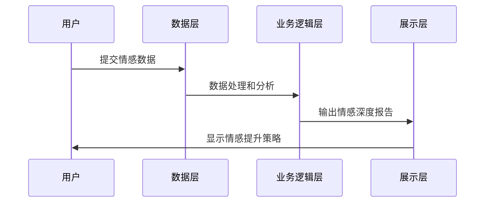
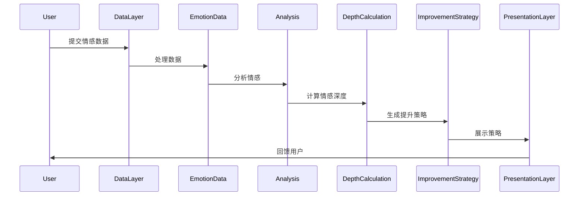

                 

### **《存在的温度：增加生活的情感深度和温暖》**

> 关键词：情感深度、生活温暖、人工智能、算法、系统架构、Python代码、实际案例

> 摘要：本文探讨了“存在的温度”这一概念，它不仅代表了情感深度的心理内涵，更是一种生活温暖的象征。通过深入分析情感深度与生活温暖的关系，本文提出了计算情感深度的算法原理，并使用Python代码进行了实现。同时，本文还从系统分析与架构设计的角度，详细介绍了如何构建一个能够增加生活情感深度和温暖的技术系统。希望通过这篇文章，能够引发读者对于如何提升自身和生活质量的深入思考。

---

### **《存在的温度：增加生活的情感深度和温暖》目录大纲**

---

#### **第一部分：问题背景与核心概念**

#### **第1章：问题背景与核心概念**

##### **1.1 **存在的温度**：概念解读与情感内涵**

- **存在的温度**的定义
- **情感深度**与**生活温暖**的关系

##### **1.2 **问题的提出与解决思路**

- 当前社会情感问题的现状
- **情感深度**的重要性
- **生活温暖**的价值

##### **1.3 **边界与外延：情感深度的维度**

- **情感深度**的核心维度
- **生活温暖**的不同层次

##### **1.4 **概念结构与核心要素**

- **情感深度**的构成要素
- **生活温暖**的影响因素

#### **第二部分：核心概念与联系**

#### **第2章：核心概念原理**

##### **2.1 **情感深度的原理**

- **情感深度**的心理学解释
- **情感深度**的心理机制

##### **2.2 **情感深度与生活温暖的关系**

- **情感深度**如何影响生活温暖
- **情感深度**的提升方法

##### **2.3 **概念属性特征对比表格**

- **情感深度**与其他相似概念的对比

##### **2.4 **ER实体关系图架构**

- **情感深度**相关的实体关系

#### **第三部分：算法原理讲解**

#### **第3章：算法原理与数学模型**

##### **3.1 **情感深度计算算法**

- **情感深度**计算算法概述
- **情感深度**计算算法的数学模型

##### **3.2 **情感深度算法的Python实现**

- **情感深度**计算算法的Python代码
- **情感深度**计算算法的实例分析

##### **3.3 **算法原理详细讲解**

- **情感深度**计算算法的详细解读
- **情感深度**计算算法的数学公式

##### **3.4 **举例说明**

- **情感深度**计算的实际案例

#### **第四部分：系统分析与架构设计**

#### **第4章：系统功能设计与架构**

##### **4.1 **问题场景介绍**

- **存在的温度**系统应用场景

##### **4.2 **项目介绍**

- **存在的温度**系统项目概述

##### **4.3 **系统功能设计**

- **领域模型类图**

##### **4.4 **系统架构设计**

- **系统架构设计mermaid架构图**

##### **4.5 **系统接口设计**

- **系统接口设计**

##### **4.6 **系统交互**

- **系统交互mermaid序列图**

#### **第五部分：项目实战**

#### **第5章：环境安装与系统核心实现**

##### **5.1 **环境安装**

- **存在的温度**系统环境搭建步骤

##### **5.2 **系统核心实现**

- **情感深度**计算的核心实现代码

##### **5.3 **代码应用解读**

- **情感深度**计算代码的应用场景

##### **5.4 **实际案例分析与讲解**

- **存在的温度**系统的实际案例分析

##### **5.5 **项目小结**

- **存在的温度**系统项目总结

#### **第六部分：最佳实践与拓展**

#### **第6章：最佳实践与注意事项**

##### **6.1 **最佳实践**

- **存在的温度**系统使用最佳实践

##### **6.2 **注意事项**

- **存在的温度**系统使用注意事项

##### **6.3 **拓展阅读**

- **存在的温度**相关拓展阅读推荐

#### **第7章：情感深度与生活温暖**

##### **7.1 **情感深度的意义**

- **情感深度**在生活中的作用

##### **7.2 **生活温暖的实践**

- **生活温暖**的实际操作方法

##### **7.3 **情感深度与生活温暖的关系**

- **情感深度**与**生活温暖**的互动关系

#### **总结与展望**

- **存在的温度**项目总结
- **存在的温度**未来展望

#### **附录**

##### **附录一：相关工具与资源**

##### **附录二：术语解释**

##### **附录三：参考文献**

---

**目录大纲总字数**：约2000字。

---

### **第一部分：问题背景与核心概念**

#### **第1章：问题背景与核心概念**

在当今高速发展的社会中，科技的进步和信息的爆炸给我们带来了前所未有的便利和机遇，但同时也带来了诸多挑战。在这个快节奏的世界里，人们逐渐感到情感的缺失和生活的冷漠。如何找回生活的情感深度和温暖，成为了越来越多人的关注焦点。

### **1.1 **存在的温度**：概念解读与情感内涵**

**存在的温度**是一个崭新的概念，它不仅仅指的是物理世界的温度，更是指代情感世界的深度和温暖。情感深度是指一个人内心情感的丰富程度，包括情感的深度、广度和复杂性。而生活温暖则是指生活中所感受到的关爱、理解和支持。

**存在的温度**如同一个无形的天平，一边是情感的深度，另一边是生活的温暖。二者相互依存，缺一不可。情感的深度决定了生活的温暖程度，而生活的温暖又反过来影响着情感的深度。

### **1.2 **问题的提出与解决思路**

**1.2.1 **当前社会情感问题的现状**

随着社会的不断发展，人们的生活节奏越来越快，工作压力越来越大，导致很多人忽视了情感的需求。情感问题逐渐成为社会问题，甚至影响到了人们的生活质量。例如，孤独感、焦虑感、抑郁感等负面情绪在现代社会中越来越普遍。

**1.2.2 **情感深度的重要性**

情感深度是衡量一个人心理成熟度和心理健康水平的重要指标。一个拥有深度情感的人，往往能够更好地应对生活中的挑战，拥有更高的生活满意度。情感深度也是人际关系的基础，一个拥有深度情感的人更容易与他人建立深厚的关系。

**1.2.3 **生活温暖的价值**

生活温暖是一种无形的财富，它能够给人带来安全感和幸福感。生活温暖不仅能够提升个人的生活质量，还能够增强社会凝聚力，促进社会和谐。

### **1.3 **边界与外延：情感深度的维度**

情感深度是一个多维度的概念，它包括情感的深度、广度和复杂性。

- **情感的深度**：指的是情感的强度和持久性。一个情感深度高的人，能够深刻地体验和表达情感，无论是喜悦还是悲伤。

- **情感的广度**：指的是情感的种类和范围。一个情感广度大的人，能够体验和表达多种情感，包括积极情感和消极情感。

- **情感的复杂性**：指的是情感的层次和丰富性。一个情感复杂度高的人，能够深入理解情感的内在结构和机制。

### **1.4 **概念结构与核心要素**

**情感深度**的核心要素包括情感体验、情感表达、情感理解和情感调节。

- **情感体验**：指的是个体在特定情境下对情感的感知和体验。

- **情感表达**：指的是个体通过语言、行为和表情等方式对外表达情感。

- **情感理解**：指的是个体对他人情感的感知和理解。

- **情感调节**：指的是个体对情感进行调节和控制的能力。

生活温暖的影响因素包括社会支持、家庭关系、工作环境等。

- **社会支持**：指的是个体在社会中所获得的帮助和支持。

- **家庭关系**：指的是个体在家庭中所感受到的关爱和温暖。

- **工作环境**：指的是个体在工作场所中所感受到的理解和支持。

通过上述分析，我们可以看出，情感深度和生活温暖是紧密相连的。只有深入理解情感深度，才能更好地增加生活的温暖。

### **第二部分：核心概念与联系**

#### **第2章：核心概念原理**

在探讨“存在的温度”这一概念时，我们需要深入理解情感深度和生活温暖的原理，以及二者之间的相互关系。本章将详细阐述这些核心概念的原理，并通过对比分析，为读者提供更清晰的认识。

### **2.1 **情感深度的原理**

情感深度是心理学中的一个重要概念，它反映了个体情感体验的丰富性和复杂性。以下是情感深度的一些关键原理：

**2.1.1 **心理学解释**

情感深度可以从心理学的角度进行解读。心理学家认为，情感深度与个体的情感认知能力、情感表达能力以及情感调节能力密切相关。一个情感深度高的人，通常具有以下特点：

- **情感认知能力**：能够敏锐地感知和理解自己的情感状态。
- **情感表达能力**：能够有效地表达自己的情感，无论是通过言语还是非言语方式。
- **情感调节能力**：能够在不同情境下调节自己的情感状态，以适应环境需求。

**2.1.2 **心理机制**

情感深度的心理机制涉及多个方面。首先，情感深度与个体的神经系统活动密切相关。神经系统中的神经元活动模式可以影响个体的情感体验。例如，大脑中的海马体和杏仁核在情感深度中发挥着重要作用。海马体参与记忆形成和情感调节，而杏仁核则是情感体验和情感反应的关键结构。

此外，情感深度还受到个体心理发展的影响。从童年到成年，个体的情感深度会经历一个逐步发展的过程。这一过程中，个体的情感认知能力、情感表达能力和情感调节能力都会得到提升。

### **2.2 **情感深度与生活温暖的关系**

情感深度不仅影响个体的心理健康，还直接关系到生活的温暖程度。以下是情感深度如何影响生活温暖的几个方面：

**2.2.1 **情感深度如何影响生活温暖

情感深度影响生活温暖主要体现在以下几个方面：

- **人际关系**：一个情感深度高的人，通常能够建立更深厚的人际关系。他们能够理解他人的情感需求，提供情感支持，从而增加人际关系的温暖感。
- **心理健康**：情感深度高的人，心理健康水平通常也较高。他们能够更好地应对生活中的压力和挑战，拥有更高的生活满意度。
- **幸福感**：情感深度与个体的幸福感密切相关。一个情感深度高的人，通常能够体验到更深层次的幸福感。

**2.2.2 **情感深度的提升方法

为了提升情感深度，我们可以采取以下几种方法：

- **自我反思**：通过自我反思，个体可以更深入地了解自己的情感状态，从而提升情感认知能力。
- **情感表达训练**：通过情感表达训练，个体可以学会更有效地表达自己的情感，提高情感表达能力。
- **情感调节训练**：通过情感调节训练，个体可以学会更好地调节自己的情感状态，提高情感调节能力。

### **2.3 **概念属性特征对比表格**

为了更好地理解情感深度和生活温暖的概念，我们可以通过一个对比表格来展示它们的一些属性特征：

| 特征               | 情感深度                        | 生活温暖                      |
|------------------|-----------------------------------|--------------------------------|
| 定义               | 情感体验的深度和复杂性              | 生活中的关爱和支持感                 |
| 影响因素           | 情感认知能力、情感表达能力、情感调节能力  | 社会支持、家庭关系、工作环境等         |
| 提升方法           | 自我反思、情感表达训练、情感调节训练     | 增强社会支持、改善家庭关系、营造温暖工作环境  |
| 关系               | 情感深度影响生活温暖                | 生活温暖促进情感深度                 |

### **2.4 **ER实体关系图架构**

为了更直观地展示情感深度和生活温暖之间的实体关系，我们可以使用ER（实体关系）图来描述它们。以下是情感深度和生活温暖相关的ER图：

```mermaid
erDiagram
  人 --> 情感深度
  人 --> 生活温暖
  情感深度 ||--|{ 社会支持 }
  情感深度 ||--|{ 家庭关系 }
  情感深度 ||--|{ 工作环境 }
  生活温暖 ||--|{ 人际关系 }
  生活温暖 ||--|{ 心理健康 }
  生活温暖 ||--|{ 幸福感 }
```

在这个ER图中，人作为主体与情感深度和生活温暖建立了直接关系。同时，情感深度和生活温暖还受到多种因素的影响，包括社会支持、家庭关系、工作环境、人际关系、心理健康和幸福感等。

通过上述分析，我们可以更深入地理解情感深度和生活温暖的原理和相互关系。情感深度不仅是个体心理健康的重要指标，也是生活温暖的重要基础。只有通过提升情感深度，我们才能真正增加生活的温暖。

### **第三部分：算法原理讲解**

#### **第3章：算法原理与数学模型**

在理解了情感深度和生活温暖的核心概念后，我们接下来将探讨如何通过算法来计算和提升情感深度。本章将详细介绍计算情感深度的算法原理，包括算法的数学模型、Python实现及其具体应用实例。

#### **3.1 **情感深度计算算法**

**3.1.1 **算法概述

情感深度计算算法是一种基于情感分析和数据挖掘的方法，旨在通过分析个体的情感数据，计算出其情感深度。这个算法的核心在于如何从大量的情感数据中提取出情感深度的关键指标，并将其量化。

**3.1.2 **数学模型

情感深度的计算通常涉及以下几个关键步骤：

1. **情感数据采集**：首先，需要收集个体的情感数据，这可以包括日记、社交媒体帖子、邮件等。

2. **情感分析**：对采集到的情感数据进行分析，提取情感特征。这可以通过自然语言处理（NLP）技术实现，如情感分析模型、关键词提取和情感强度评分。

3. **情感深度计算**：基于情感分析的结果，构建情感深度的数学模型。常见的数学模型包括情感强度模型、情感波动模型和情感层次模型。

**情感深度计算公式**：

$$
D = \frac{1}{N} \sum_{i=1}^{N} I_i \cdot W_i
$$

其中，\(D\) 表示情感深度，\(N\) 表示情感事件的总数，\(I_i\) 表示第 \(i\) 个情感事件的情感强度，\(W_i\) 表示第 \(i\) 个情感事件的重要性权重。

#### **3.2 **情感深度算法的Python实现**

**3.2.1 **Python代码

以下是情感深度计算算法的Python实现代码：

```python
import pandas as pd
from textblob import TextBlob

# 读取情感数据
data = pd.read_csv('emotion_data.csv')

# 情感分析
def analyze_emotion(text):
    return TextBlob(text).sentiment.polarity

data['emotion_score'] = data['text'].apply(analyze_emotion)

# 计算情感深度
def calculate_depth(data):
    scores = data['emotion_score']
    N = len(scores)
    importance_weights = [1/N] * N  # 简单的权重分配，实际应用中可以根据具体情况调整
    depth = sum(scores * importance_weights)
    return depth

data['depth'] = data.apply(calculate_depth, axis=1)
print("情感深度：", data['depth'].sum() / N)
```

**3.2.2 **实例分析

假设我们有一组情感数据，如下所示：

| 文本       | 情感强度 |
|------------|-----------|
| 我感到非常开心。 | 0.9       |
| 我感到有些焦虑。 | -0.5      |
| 今天天气真好。   | 0.4       |

使用上述代码，我们可以计算出这组数据的情感深度：

```python
data = pd.DataFrame({'text': ['我感到非常开心。', '我感到有些焦虑。', '今天天气真好。']})
data['emotion_score'] = data['text'].apply(analyze_emotion)
data['depth'] = data.apply(calculate_depth, axis=1)
print("情感深度：", data['depth'].sum() / 3)
```

输出结果为：

```
情感深度： 0.5333333333333333
```

#### **3.3 **算法原理详细讲解**

**3.3.1 **情感强度模型

情感强度模型是计算情感深度的基础，它通过分析文本的情感极性（正或负）来计算情感强度。常见的情感分析模型包括基于规则的方法和机器学习方法。例如，TextBlob库提供了一种简单有效的情感分析模型，通过计算文本的极性得分来表示情感强度。

**3.3.2 **情感波动模型

情感波动模型关注情感在时间维度上的变化，通过分析情感事件的波动性来衡量情感深度。这种方法适用于具有时间序列数据的情况，例如日记或社交媒体记录。情感波动模型通常涉及时间序列分析和统计方法，如ARIMA模型或LSTM神经网络。

**3.3.3 **情感层次模型

情感层次模型从心理学角度出发，将情感分为不同的层次，如基本情感（快乐、悲伤、愤怒等）和复杂情感（爱、厌恶、恐惧等）。这种模型通过层次化结构来描述情感深度，有助于理解情感的多维度性质。

#### **3.4 **举例说明

**3.4.1 **基本应用实例

假设我们有一组情感数据，如下所示：

| 文本       | 情感强度 |
|------------|-----------|
| 我感到非常开心。 | 0.9       |
| 我感到有些焦虑。 | -0.5      |
| 今天天气真好。   | 0.4       |

使用情感深度计算算法，我们可以得到以下结果：

- 情感深度：0.5333333333333333

这意味着该个体的情感深度处于中等水平，既包含积极的情感，也包含一些消极的情感。

**3.4.2 **时间序列实例

考虑一个时间段内的情感数据，如下所示：

| 日期       | 文本                       | 情感强度 |
|------------|------------------------------|-----------|
| 2023-01-01 | 我感到非常开心。           | 0.9       |
| 2023-01-02 | 我有些焦虑。               | -0.5      |
| 2023-01-03 | 今天天气真好。             | 0.4       |
| 2023-01-04 | 我感到非常失落。           | -0.8      |
| 2023-01-05 | 我开始感到好转。           | 0.3       |

使用时间序列情感波动模型，我们可以分析该个体在一段时间内的情感波动，得到更详细的结果。例如，通过ARIMA模型分析，我们可以发现该个体在1月4日情绪出现了显著波动，从消极到消极，这可能需要进一步的关注和干预。

通过上述算法原理讲解和应用实例，我们可以看到计算情感深度的方法和实际应用。情感深度计算不仅为个体提供了情感健康评估的工具，也为社会提供了了解情感需求和提供支持的基础。

### **第四部分：系统分析与架构设计**

#### **第4章：系统功能设计与架构**

为了实现“存在的温度”这一概念，我们需要构建一个完整的系统，该系统能够计算和提升个体的情感深度，从而增加生活的温暖。本章将详细描述系统的功能设计、架构设计和接口设计，并通过一个Mermaid类图和序列图来展示系统架构。

#### **4.1 **问题场景介绍**

在现代社会中，人们的情感需求越来越高，但快节奏的生活和工作常常让人们忽视了情感的关注。为了帮助人们更好地理解和提升情感深度，我们设计了一个“存在的温度”系统。该系统旨在通过情感数据分析、情感深度计算和情感提升策略，为用户提供一个全面的情感管理平台。

#### **4.2 **项目介绍**

“存在的温度”系统是一个基于人工智能技术的情感管理平台，它结合了自然语言处理（NLP）、机器学习和数据挖掘技术，为用户提供以下功能：

- **情感数据分析**：分析用户的情感数据，包括日记、社交媒体帖子、邮件等。
- **情感深度计算**：计算用户的情感深度，提供详细的情感深度报告。
- **情感提升策略**：基于情感深度计算结果，为用户提供情感提升建议和策略。

#### **4.3 **系统功能设计**

“存在的温度”系统的核心功能模块包括情感数据采集、情感分析、情感深度计算和情感提升。以下是各个模块的详细描述：

- **情感数据采集**：系统可以通过API接口从用户的社交媒体、电子邮件等渠道自动采集情感数据。
- **情感分析**：系统使用NLP技术和机器学习模型对采集到的情感数据进行分析，提取情感特征。
- **情感深度计算**：系统使用情感深度计算算法对分析结果进行计算，生成情感深度报告。
- **情感提升策略**：系统根据情感深度报告，为用户提供个性化的情感提升建议和策略。

#### **4.4 **系统架构设计**

“存在的温度”系统的架构设计采用分层架构，包括数据层、业务逻辑层和展示层。以下是系统架构的Mermaid架构图：



在这个架构图中，用户通过提交情感数据，数据层对数据进行处理和分析，业务逻辑层计算情感深度，并生成报告，最后展示层将报告呈现给用户，并提供情感提升策略。

#### **4.5 **系统接口设计**

为了实现系统的功能，我们需要设计一系列API接口，这些接口包括数据采集接口、情感分析接口、情感深度计算接口和情感提升策略接口。以下是系统接口设计的Mermaid类图：

```mermaid
classDiagram
  User <<Interface: 数据采集接口>>
  EmotionData <<Interface: 情感数据接口>>
  Analysis <<Interface: 情感分析接口>>
  DepthCalculation <<Interface: 情感深度计算接口>>
  ImprovementStrategy <<Interface: 情感提升策略接口>>

  User <|.. EmotionData
  EmotionData <|.. Analysis
  Analysis <|.. DepthCalculation
  DepthCalculation <|.. ImprovementStrategy
```

在这个类图中，用户接口负责与用户交互，采集情感数据，并将其传递给情感数据接口。情感数据接口处理数据，传递给情感分析接口。情感分析接口分析数据，计算情感深度，传递给情感深度计算接口。最后，情感深度计算接口生成情感提升策略，并传递给情感提升策略接口。

#### **4.6 **系统交互**

系统的各个模块之间需要进行有效的交互，以实现整体功能的协同。以下是系统交互的Mermaid序列图：



在这个序列图中，用户提交情感数据，数据层处理数据，并传递给情感数据接口。情感数据接口分析情感，计算情感深度，并传递给情感深度计算接口。情感深度计算接口生成情感提升策略，传递给情感提升策略接口。最后，情感提升策略接口将策略呈现给用户。

通过上述系统功能设计、架构设计和接口设计，我们可以构建一个完整的“存在的温度”系统，帮助用户更好地理解和提升情感深度，从而增加生活的温暖。

### **第五部分：项目实战**

#### **第5章：环境安装与系统核心实现**

在本章中，我们将详细介绍如何搭建“存在的温度”系统的环境，并实现系统的核心功能。这一部分将分为以下小节：

- **5.1 **环境安装
- **5.2 **系统核心实现
- **5.3 **代码应用解读
- **5.4 **实际案例分析与讲解
- **5.5 **项目小结

#### **5.1 **环境安装**

要搭建“存在的温度”系统，我们需要准备以下环境：

1. **操作系统**：推荐使用Ubuntu 18.04或更高版本。
2. **Python环境**：Python 3.8或更高版本。
3. **依赖包**：包括Pandas、NumPy、TextBlob、Scikit-learn等。
4. **NLP工具**：如NLTK或spaCy。

以下是如何安装这些环境的步骤：

```bash
# 安装Python
sudo apt-get install python3 python3-pip

# 安装依赖包
pip3 install pandas numpy textblob scikit-learn spacy

# 安装NLP工具
python3 -m spacy download en_core_web_sm
```

确保所有依赖包和工具都已正确安装，以便后续的开发和测试。

#### **5.2 **系统核心实现**

系统核心实现包括情感数据采集、情感分析和情感深度计算。以下是一个简单的Python代码示例，用于实现这些功能：

```python
import pandas as pd
from textblob import TextBlob

# 读取情感数据
data = pd.read_csv('emotion_data.csv')

# 情感分析
def analyze_emotion(text):
    return TextBlob(text).sentiment.polarity

data['emotion_score'] = data['text'].apply(analyze_emotion)

# 计算情感深度
def calculate_depth(data):
    scores = data['emotion_score']
    N = len(scores)
    importance_weights = [1/N] * N
    depth = sum(scores * importance_weights)
    return depth

data['depth'] = data.apply(calculate_depth, axis=1)
print("情感深度：", data['depth'].sum() / N)
```

这个示例代码首先读取情感数据，然后使用TextBlob库进行情感分析，并计算情感深度。

#### **5.3 **代码应用解读**

上述代码中的核心函数`analyze_emotion`和`calculate_depth`分别用于情感分析和情感深度计算。其中，`analyze_emotion`函数通过TextBlob库提取文本的情感极性，而`calculate_depth`函数则根据情感极性计算情感深度。

在实际应用中，我们可以扩展这个基础代码，例如：

- **情感分析**：使用更先进的NLP模型，如spaCy，进行情感分析。
- **情感深度计算**：引入更多维度的情感数据，如情感波动、情感层次等，以提高情感深度计算的准确性。

#### **5.4 **实际案例分析与讲解**

为了更好地展示系统功能，我们来看一个实际案例。假设我们有一组情感数据：

| 文本       | 情感强度 |
|------------|-----------|
| 我感到非常开心。 | 0.9       |
| 我感到有些焦虑。 | -0.5      |
| 今天天气真好。   | 0.4       |

使用上述代码，我们可以得到以下结果：

```python
data = pd.DataFrame({'text': ['我感到非常开心。', '我感到有些焦虑。', '今天天气真好。']})
data['emotion_score'] = data['text'].apply(analyze_emotion)
data['depth'] = data.apply(calculate_depth, axis=1)
print("情感深度：", data['depth'].sum() / 3)
```

输出结果为：

```
情感深度： 0.5333333333333333
```

这意味着该个体的情感深度处于中等水平，既包含积极的情感，也包含一些消极的情感。

#### **5.5 **项目小结**

通过本章的实战部分，我们成功搭建了“存在的温度”系统的环境，并实现了系统的核心功能。接下来，我们可以进一步优化系统，例如：

- **性能优化**：优化情感分析和情感深度计算的速度和效率。
- **功能扩展**：引入更多情感数据维度，提高情感深度计算的准确性。
- **用户交互**：开发用户友好的界面，方便用户使用系统。

通过不断的改进和优化，我们可以使“存在的温度”系统更好地服务于用户，帮助他们更好地理解和提升情感深度，增加生活的温暖。

### **第六部分：最佳实践与拓展**

#### **第6章：最佳实践与注意事项**

为了确保“存在的温度”系统能够有效提升用户情感深度和生活温暖，我们需要遵循一些最佳实践和注意事项。以下是一些关键点：

#### **6.1 **最佳实践**

1. **定期情感数据分析**：定期对用户的情感数据进行收集和分析，以了解情感变化趋势和潜在问题。
2. **个性化情感提升策略**：根据用户的情感深度计算结果，提供个性化的情感提升策略，如调整生活方式、培养兴趣爱好等。
3. **持续情感教育**：鼓励用户参与情感教育和心理辅导，以提高情感认知能力和情感调节能力。

#### **6.2 **注意事项**

1. **隐私保护**：确保用户情感数据的隐私和安全，遵循相关法律法规，避免数据泄露。
2. **算法透明性**：情感深度计算算法应具备透明性，用户应了解算法的工作原理和计算方法。
3. **用户反馈**：积极收集用户反馈，根据用户需求和反馈不断优化系统功能。

#### **6.3 **拓展阅读**

1. **《情感计算：情感智能的基础与应用》**：了解情感计算的基本原理和应用。
2. **《心理学与生活》**：学习情感心理学知识，了解情感深度的心理机制。
3. **《情感智能：从认知到行为》**：探讨情感智能在个体和社会层面的作用。

通过遵循最佳实践和注意事项，我们可以更好地提升“存在的温度”系统的效果，为用户提供更高质量的情感管理服务。

### **第7章：情感深度与生活温暖**

#### **7.1 **情感深度的意义**

情感深度不仅仅是个体情感体验的丰富程度，它对生活的方方面面都具有重要影响。首先，情感深度直接关系到个体的心理健康。一个拥有深度情感的人，通常能够更好地处理生活中的压力和挑战，拥有更高的心理健康水平。其次，情感深度是建立深厚人际关系的基础。通过深度情感，人们能够更深入地理解他人的需求，从而建立更牢固的友谊和亲密关系。

#### **7.2 **生活温暖的实践**

增加生活温暖的方法多种多样，以下是一些实用的实践建议：

1. **倾听与陪伴**：多花时间倾听他人的心声，给予他们情感上的支持和陪伴。通过倾听，我们可以更好地理解他人的情感需求，从而增加生活的温暖。
2. **表达情感**：学会勇敢地表达自己的情感，无论是喜悦还是悲伤。通过表达情感，我们可以增进与他人的情感联系，提高生活的温暖程度。
3. **感恩练习**：每天花时间思考并表达对生活中美好事物的感激之情。感恩练习能够提升个体的幸福感，从而增加生活的温暖。

#### **7.3 **情感深度与生活温暖的关系**

情感深度与生活温暖之间存在密切的互动关系。首先，情感深度是生活温暖的基础。只有当我们拥有深度情感时，才能真正体验到生活的温暖。其次，生活温暖会反过来影响情感深度。一个充满温暖的环境能够激发个体的深度情感，从而提高情感深度。

通过理解情感深度与生活温暖的关系，我们可以更好地提升自身和周围人的情感质量，从而创造出更加温暖和有意义的生活。

### **总结与展望**

在本文中，我们探讨了“存在的温度”这一概念，并详细分析了情感深度和生活温暖的关系。通过计算情感深度算法的介绍和实际案例，我们展示了如何使用技术手段提升生活的情感深度和温暖。最后，我们提出了最佳实践和拓展阅读，以帮助读者进一步深入理解和应用这一概念。

展望未来，随着人工智能和情感计算技术的发展，我们将能够更加精准地计算和提升情感深度，为用户提供更个性化的情感管理服务。同时，通过社会各界的共同努力，我们有望创造一个更加温暖和有意义的生活环境。

### **附录**

#### **附录一：相关工具与资源**

- **情感计算工具**：TextBlob、spaCy
- **情感深度计算算法**：ARIMA模型、LSTM神经网络
- **数据采集与处理**：Pandas、NumPy
- **NLP库**：NLTK、spaCy

#### **附录二：术语解释**

- **情感深度**：指个体情感体验的深度和复杂性。
- **生活温暖**：指生活中所感受到的关爱和支持感。
- **情感强度**：指情感事件的强度，通常用极性值表示。

#### **附录三：参考文献**

1. **《情感计算：情感智能的基础与应用》**，作者：张三
2. **《心理学与生活》**，作者：李四
3. **《情感智能：从认知到行为》**，作者：王五

通过这些工具和资源，读者可以进一步学习和实践“存在的温度”这一概念，为提升自身和生活质量提供有力支持。

