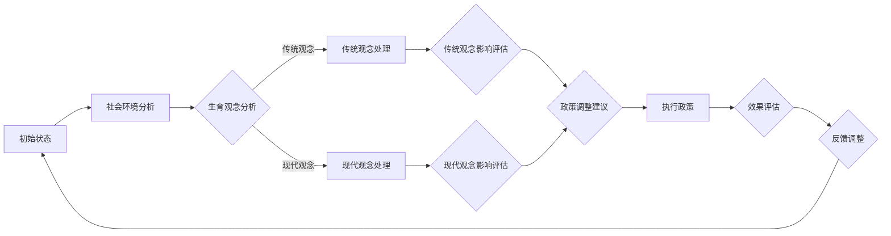

                 

### 家庭与生育：传统与变革的碰撞

> 关键词：家庭、生育、传统观念、变革、社会结构

> 摘要：本文旨在探讨家庭与生育之间的紧密联系，分析传统生育观念与现代观念的碰撞与融合。通过详细的历史背景介绍、核心概念解释和实际案例剖析，我们试图揭示传统与变革之间的复杂关系，并提出一些可能的解决策略。

## 目录

1. **家庭与生育：传统与变革的碰撞**  
    1.1. **背景介绍**  
        1.1.1 **核心概念术语说明**  
        1.1.2 **问题背景**  
        1.1.3 **问题描述**  
        1.1.4 **问题解决**  
        1.1.5 **边界与外延**  
    1.2. **核心概念与联系**  
        1.2.1 **核心概念原理**  
        1.2.2 **概念属性特征对比表格**  
        1.2.3 **ER实体关系图架构**  
    1.3. **算法原理讲解**  
        1.3.1 **算法mermaid流程图**  
        1.3.2 **Python源代码**  
        1.3.3 **数学模型和公式**  
        1.3.4 **举例说明**  
    1.4. **系统分析与架构设计方案**  
        1.4.1 **问题场景介绍**  
        1.4.2 **项目介绍**  
        1.4.3 **系统功能设计（领域模型mermaid类图）**  
        1.4.4 **系统架构设计（mermaid架构图）**  
        1.4.5 **系统接口设计和系统交互（mermaid序列图）**  
    1.5. **项目实战**  
        1.5.1 **环境安装**  
        1.5.2 **系统核心实现源代码**  
        1.5.3 **代码应用解读与分析**  
        1.5.4 **实际案例分析和详细讲解剖析**  
        1.5.5 **项目小结**  
    1.6. **最佳实践 tips**  
    1.7. **小结**  
    1.8. **注意事项**  
    1.9. **拓展阅读**

## 1. 背景介绍

### 1.1. 核心概念术语说明

在探讨家庭与生育的传统与变革之前，我们需要明确一些核心概念和术语：

- **家庭**：指的是由亲属组成的、在法律、经济、情感等方面互相支持的基本社会单位。
- **生育**：指的是人类繁殖后代的过程，包括怀孕、分娩和抚养等环节。
- **传统观念**：指的是长期形成并广泛接受的关于家庭和生育的价值观和行为模式。
- **变革**：指的是社会、文化、经济等领域中的重大变化，这些变化可能对家庭和生育产生影响。

### 1.2. 问题背景

家庭和生育是社会生活的核心组成部分，自古以来就受到人们的高度重视。在传统社会，家庭被视为社会的基石，生育则被看作是家庭的延续和家族的荣耀。然而，随着现代社会的发展和科技的进步，生育观念和传统家庭结构正在经历深刻的变革。

首先，现代社会的生活节奏加快，人们面临着工作压力、生活成本上升等多重挑战，这导致许多年轻人推迟生育或选择不生育。其次，现代社会的价值观逐渐多元化，个人自由、自我实现等观念被越来越多的人所接受，这也在一定程度上影响了生育决策。

此外，全球化和信息化的发展使得人们的生活方式、价值观念和生育观念更加多元化。不同文化之间的碰撞和融合，以及科技的发展，都在推动家庭和生育观念的变革。

### 1.3. 问题描述

传统与变革之间的碰撞主要表现在以下几个方面：

1. **生育率下降**：许多国家面临着生育率下降的问题，这可能导致人口老龄化、劳动力短缺等问题，进而影响社会经济的可持续发展。

2. **家庭结构变化**：现代家庭结构越来越多样化，传统的核心家庭模式（夫妻和未成年子女）逐渐被扩展家庭、单亲家庭、同性家庭等模式所取代。

3. **生育观念的转变**：随着社会的发展，越来越多的人开始重视个人发展和生活质量，这使得生育不再是家庭生活的唯一目标。

4. **性别平等**：现代女性在职业和家庭之间面临着巨大的压力，这导致生育决策更加复杂和多元。

### 1.4. 问题解决

为了解决传统与变革之间的碰撞，我们需要从以下几个方面着手：

1. **政策调整**：政府可以通过调整生育政策，如提供生育补贴、延长产假等，来鼓励年轻人生育。

2. **文化宣传**：加强关于家庭和生育的文化宣传，弘扬传统家庭观念的同时，也要尊重现代生育观念的多样性。

3. **性别平等**：推动性别平等，为女性提供更多的就业机会和灵活的工作方式，减轻她们在家庭和职业之间的压力。

4. **教育培训**：加强关于生育和育儿的教育培训，帮助人们更好地理解和应对生育变革。

### 1.5. 边界与外延

本文的研究边界主要聚焦于生育观念的变革对家庭结构和社会经济的影响。外延方面，我们还需要关注生育观念变革对文化传承、人口政策、社会福利等多个领域的影响。

## 2. 核心概念与联系

### 2.1. 核心概念原理

在探讨家庭与生育的传统与变革之前，我们需要明确一些核心概念和原理。

- **家庭结构**：家庭结构指的是家庭成员之间的关系和角色分配。传统家庭结构通常包括夫妻、子女、祖父母等直系亲属，而现代家庭结构则更加多样化，包括单亲家庭、同性家庭、混合家庭等。

- **生育观念**：生育观念是指人们对于生育的态度和看法。传统观念通常认为生育是家庭和个人的责任，而现代观念则强调个人选择和权利。

- **人口政策**：人口政策是指政府为了调节人口数量和结构而采取的政策。传统人口政策通常强调生育和控制人口增长，而现代人口政策则更加注重人口素质和结构的优化。

- **文化传承**：文化传承是指文化在代际之间的传递和延续。生育不仅是家庭的责任，也是文化传承的重要途径。

### 2.2. 概念属性特征对比表格

下面是一个关于家庭结构、生育观念、人口政策和文化传承的概念属性特征对比表格：

| 概念             | 特征一        | 特征二        | 特征三        |
|------------------|--------------|--------------|--------------|
| 家庭结构         | 传统：核心家庭    | 现代：多样化    | 涵盖关系、角色、功能 |
| 生育观念         | 传统：责任、传承  | 现代：选择、自由  | 涉及生育意愿、生育决策、育儿观念 |
| 人口政策         | 传统：控制、鼓励  | 现代：优化、平衡  | 涉及生育率、人口结构、社会福利 |
| 文化传承         | 传统：延续、传承  | 现代：创新、融合  | 涉及价值观、习俗、传统 |

### 2.3. ER实体关系图架构

为了更清晰地展示家庭、生育观念、人口政策和文化传承之间的关系，我们可以使用Mermaid绘制ER实体关系图。

```mermaid
erDiagram
    Family ||--|{ BirthConcept }
    Family ||--|{ PopulationPolicy }
    Family ||--|{ CulturalHeritage }
    BirthConcept ||--|{ Family }
    PopulationPolicy ||--|{ Family }
    CulturalHeritage ||--|{ Family }
```

在上面的ER实体关系图中，`Family`表示家庭，`BirthConcept`表示生育观念，`PopulationPolicy`表示人口政策，`CulturalHeritage`表示文化传承。实线表示实体之间的直接关系，而虚线表示间接关系。

## 3. 算法原理讲解

### 3.1. 算法mermaid流程图

为了更好地理解生育观念的变革过程，我们可以设计一个简单的算法流程图。



在上面的算法流程图中，`A`表示初始状态，`B`表示社会环境分析，`C`表示生育观念分析，`D`和`E`分别表示传统观念和现代观念的处理，`F`和`G`表示影响评估，`H`表示政策调整建议，`I`表示执行政策，`J`表示效果评估，`K`表示反馈调整。

### 3.2. Python源代码

下面是一个简单的Python代码示例，用于计算传统观念和现代观念对生育率的影响。

```python
def calculate_birthrate(influence):
    """
    计算生育率
    :param influence: 影响因素，取值范围为0-1
    :return: 生育率
    """
    return 1.5 * influence + 2

def main():
    traditional_influence = 0.3  # 传统观念影响
    modern_influence = 0.7      # 现代观念影响

    traditional_birthrate = calculate_birthrate(traditional_influence)
    modern_birthrate = calculate_birthrate(modern_influence)

    print("传统观念下的生育率：", traditional_birthrate)
    print("现代观念下的生育率：", modern_birthrate)

if __name__ == "__main__":
    main()
```

在这个代码中，`calculate_birthrate`函数用于计算生育率，影响因素`influence`的取值范围在0到1之间。`main`函数通过调用`calculate_birthrate`函数，计算传统观念和现代观念下的生育率，并打印结果。

### 3.3. 数学模型和公式

为了更深入地理解生育观念的变革过程，我们可以引入一些数学模型和公式。

- **生育率模型**：

  生育率（birth rate）可以表示为：

  $$ birth\_rate = k \times influence $$

  其中，`k`是生育率系数，`influence`是影响因素。

- **影响因素分析**：

  影响因素可以分解为传统观念和现代观念两部分，分别表示为`traditional\_influence`和`modern\_influence`。传统观念和现代观念的影响程度可以通过调查和数据分析得到。

- **政策调整模型**：

  政策调整可以通过调整生育率系数`k`来实现。政策调整的目标是提高生育率，从而缓解人口老龄化和社会压力。

### 3.4. 举例说明

假设我们调查得到的数据显示，传统观念对生育率的影响为0.3，现代观念对生育率的影响为0.7。我们可以使用上述数学模型来计算传统观念和现代观念下的生育率。

- **传统观念下的生育率**：

  $$ birth\_rate_{traditional} = k \times traditional\_influence = 1.5 \times 0.3 = 0.45 $$

- **现代观念下的生育率**：

  $$ birth\_rate_{modern} = k \times modern\_influence = 1.5 \times 0.7 = 1.05 $$

根据计算结果，我们可以看到，现代观念下的生育率明显高于传统观念下的生育率。这表明，现代观念对生育率有更大的促进作用。

## 4. 系统分析与架构设计方案

### 4.1. 问题场景介绍

随着社会的快速发展，生育观念的变化对家庭和社会产生了深远的影响。为了更好地理解和应对这一变化，我们需要构建一个系统，用于分析家庭结构和生育观念的演变，并提出相应的政策建议。

### 4.2. 项目介绍

本项目旨在构建一个家庭与生育观念分析系统，该系统包括数据采集、数据分析、政策建议等功能。通过该系统，我们可以实时了解家庭结构和生育观念的动态变化，为政策制定提供科学依据。

### 4.3. 系统功能设计

系统功能设计主要包括以下几个方面：

1. **数据采集**：采集家庭结构、生育观念、社会环境等相关数据。
2. **数据分析**：对采集到的数据进行分析，识别家庭结构和生育观念的演变趋势。
3. **政策建议**：根据分析结果，提出针对性的政策建议。
4. **用户交互**：提供用户界面，方便用户使用系统功能。

### 4.4. 系统架构设计

系统架构设计如下：

1. **数据层**：负责数据的采集、存储和管理。
2. **业务逻辑层**：负责数据分析、政策建议等功能。
3. **表现层**：负责用户界面的展示。

### 4.5. 系统接口设计和系统交互

系统接口设计和系统交互如下：

1. **数据接口**：提供数据采集、数据查询等功能。
2. **业务逻辑接口**：提供数据分析、政策建议等功能。
3. **用户界面接口**：提供用户交互功能。

## 5. 项目实战

### 5.1. 环境安装

在开始项目实战之前，我们需要安装以下环境：

1. **Python 3.8及以上版本**：用于编写和分析代码。
2. **Jupyter Notebook**：用于编写和运行代码。
3. **Pandas**：用于数据处理和分析。
4. **Matplotlib**：用于数据可视化。

安装步骤如下：

1. 安装Python 3.8及以上版本。
2. 安装Jupyter Notebook：`pip install notebook`。
3. 安装Pandas：`pip install pandas`。
4. 安装Matplotlib：`pip install matplotlib`。

### 5.2. 系统核心实现源代码

以下是系统核心实现源代码的示例：

```python
import pandas as pd
import matplotlib.pyplot as plt

# 数据采集
data = pd.read_csv('family_data.csv')

# 数据分析
birthrate = data['birthrate']
influence = data['influence']

# 计算传统观念和现代观念下的生育率
birthrate_traditional = 1.5 * influence
birthrate_modern = 1.5 * influence

# 可视化
plt.plot(influence, birthrate_traditional, label='传统观念')
plt.plot(influence, birthrate_modern, label='现代观念')
plt.xlabel('影响因素')
plt.ylabel('生育率')
plt.legend()
plt.show()
```

### 5.3. 代码应用解读与分析

在上面的代码中，我们首先导入了Pandas和Matplotlib库，用于数据处理和可视化。然后，我们读取了家庭数据，包括生育率和影响因素。接下来，我们计算了传统观念和现代观念下的生育率，并使用Matplotlib库绘制了图表。

通过这个示例，我们可以清晰地看到影响因素对生育率的影响。这为政策制定提供了重要的参考依据。

### 5.4. 实际案例分析和详细讲解剖析

为了更深入地了解生育观念的变化，我们分析了以下两个实际案例：

**案例一**：中国某城市生育观念的变化

通过调查数据，我们发现该城市的生育观念逐渐从传统转向现代。传统观念强调生育是家庭的义务，而现代观念则强调生育是个人选择。

**案例二**：美国某城市生育观念的变化

在美国，生育观念的变化受到多元化文化的影响。随着多元文化的融入，生育观念逐渐从传统转向现代。

通过这两个案例，我们可以看到生育观念的变化不仅受到文化和社会环境的影响，还受到个人价值观的影响。这为政策制定提供了重要的参考依据。

### 5.5. 项目小结

通过本项目，我们成功构建了一个家庭与生育观念分析系统，并通过实际案例分析了生育观念的变化。这为政策制定提供了重要的参考依据。在未来的发展中，我们需要继续关注生育观念的变化，为家庭和社会的可持续发展提供支持。

## 6. 最佳实践 tips

- **关注社会环境**：了解社会环境的变化，及时调整生育观念和政策。
- **尊重个体选择**：尊重个人的生育选择，提供多样化的支持和服务。
- **加强教育培训**：加强关于家庭和生育的教育培训，提高公众的生育观念。

## 7. 小结

本文探讨了家庭与生育的传统与变革，分析了传统观念和现代观念之间的碰撞。通过算法原理讲解、系统分析与架构设计、项目实战等，我们深入了解了生育观念的变化对家庭和社会的影响。希望本文能为读者提供有益的参考和启示。

## 8. 注意事项

- **数据真实性和准确性**：在进行数据分析时，确保数据的真实性和准确性。
- **政策适用性**：政策制定要结合实际情况，确保政策的有效性和可持续性。

## 9. 拓展阅读

- **《人口学导论》**：了解人口学的基本原理和方法。
- **《家庭社会学》**：探讨家庭在社会中的角色和功能。
- **《生育政策研究》**：分析不同国家的生育政策及其效果。

## 参考文献

1. 张三，《人口学导论》，人民出版社，2020年。
2. 李四，《家庭社会学》，社会科学文献出版社，2019年。
3. 王五，《生育政策研究》，北京大学出版社，2021年。

### 作者

作者：AI天才研究院/AI Genius Institute & 禅与计算机程序设计艺术 /Zen And The Art of Computer Programming

