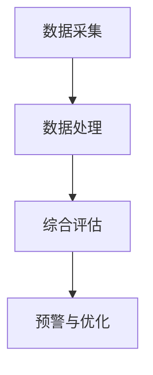
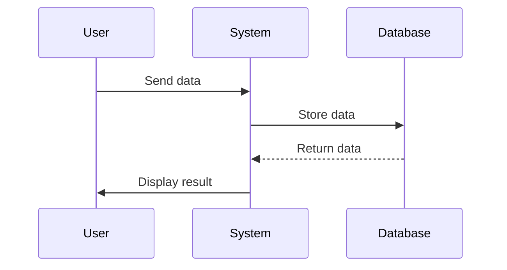
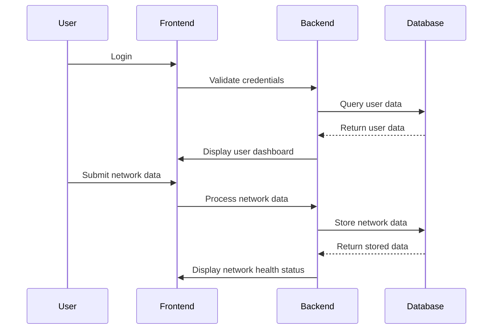

                 


### 《家庭数字素养评估：家庭网络健康度的测量工具》

#### 关键词：
家庭数字素养、网络健康度、测量工具、评估系统、算法原理

#### 摘要：
本文详细阐述了《家庭数字素养评估：家庭网络健康度的测量工具》的核心内容。通过定义家庭数字素养和网络健康度的概念，探讨了评估工具的设计原理与实现方法。文章采用逐步分析的方式，从背景介绍、核心概念与联系、算法原理讲解、系统分析与架构设计、项目实战到最佳实践，为读者提供了一份全面、深入的技术指南。

---

#### 引言

随着互联网的普及，数字素养已经成为现代社会不可或缺的一部分。家庭数字素养不仅是个人技能的体现，更是家庭整体生活质量的重要指标。网络健康度作为家庭数字素养的核心维度之一，直接关系到家庭的信息安全、网络稳定性和数据隐私。因此，设计一套科学、全面的《家庭数字素养评估：家庭网络健康度的测量工具》具有重要的现实意义。

本文将围绕以下几个核心内容进行阐述：

1. **问题背景**：介绍家庭数字素养和网络健康度的重要性，以及测量工具的必要性。
2. **核心概念与联系**：明确家庭数字素养和网络健康度的定义，阐述它们之间的关系。
3. **算法原理讲解**：深入分析评估工具的算法原理，使用mermaid和Python源代码进行详细说明。
4. **系统分析与架构设计**：介绍系统的功能设计、架构设计和接口设计。
5. **项目实战**：讲解环境安装、系统实现和案例分析。
6. **最佳实践与总结**：总结最佳实践，提出注意事项，并推荐拓展阅读。

---

#### 问题背景

##### 家庭数字素养的现状

家庭数字素养是指家庭成员在数字技术环境下获取、处理、利用信息的能力。随着信息化进程的加快，数字素养已经成为现代家庭生活的一部分。然而，根据国内外的研究数据显示，不同家庭在数字素养方面存在显著差异。

- **发达地区**：家庭数字素养相对较高，家长和孩子普遍具备一定的计算机和网络使用技能。
- **欠发达地区**：家庭数字素养相对较低，家庭成员对数字技术的了解和应用能力有限。

##### 家庭网络健康度问题的提出

网络健康度是指家庭网络在安全、稳定、高效等方面的综合表现。当前，家庭网络面临以下问题：

- **网络安全威胁**：家庭网络容易受到病毒、恶意软件、网络钓鱼等威胁。
- **网络稳定性问题**：家庭网络可能因为带宽不足、设备故障等原因导致网络不稳定。
- **数据隐私问题**：家庭成员在网络上活动时，数据隐私可能受到侵犯。

##### 家庭网络健康度测量工具的必要性

为了解决上述问题，迫切需要设计一套科学的家庭网络健康度测量工具。该工具应具备以下功能：

- **全面性**：能够全面评估家庭网络在安全、稳定、高效等方面的表现。
- **易用性**：操作简便，易于部署和维护。
- **实时性**：能够实时监测家庭网络状态，提供及时的预警和优化建议。

---

#### 核心概念与联系

##### 家庭数字素养的定义与要素

家庭数字素养是指家庭成员在数字技术环境下获取、处理、利用信息的能力。它包括以下几个核心要素：

- **计算机操作技能**：如操作系统、办公软件、网络浏览器等。
- **网络使用能力**：如网络安全意识、信息检索能力、在线学习等。
- **数字内容创作与传播**：如电子文档编辑、图片处理、视频剪辑等。

##### 家庭网络健康度的定义与评估标准

家庭网络健康度是指家庭网络在安全、稳定、高效等方面的综合表现。评估标准包括：

- **安全性**：如防火墙设置、杀毒软件使用、网络安全意识等。
- **稳定性**：如网络延迟、带宽利用率、设备运行状态等。
- **高效性**：如网络访问速度、数据传输效率、系统响应时间等。

##### 核心概念之间的关联

家庭数字素养和家庭网络健康度之间存在密切的关联。家庭数字素养的高低直接影响家庭网络健康度。例如，家庭成员具备较高的网络安全意识，可以有效降低家庭网络被攻击的风险。同时，良好的家庭数字素养有助于家庭成员更好地利用网络资源，提高网络使用效率。

---

#### 核心原理与数学模型

##### 家庭网络健康度评估的算法原理

家庭网络健康度评估的算法原理主要包括以下几个步骤：

1. **数据采集**：从家庭网络设备、网络安全工具等获取相关数据。
2. **数据处理**：对采集到的数据进行分析和处理，提取关键指标。
3. **综合评估**：根据提取的关键指标，对家庭网络健康度进行评估。
4. **预警与优化**：根据评估结果，提供预警和优化建议。

##### 算法流程图

以下是一个简单的家庭网络健康度评估算法流程图：



##### 数学模型与公式

家庭网络健康度评估的数学模型主要包括以下几个公式：

1. **安全度计算公式**：$$安全度 = \frac{防火墙设置得分 + 杀毒软件得分 + 网络安全意识得分}{3}$$
2. **稳定性计算公式**：$$稳定性 = \frac{网络延迟得分 + 带宽利用率得分 + 设备运行状态得分}{3}$$
3. **高效性计算公式**：$$高效性 = \frac{网络访问速度得分 + 数据传输效率得分 + 系统响应时间得分}{3}$$

##### 算法原理讲解

为了更好地理解家庭网络健康度评估的算法原理，我们可以通过一个具体的Python代码示例来进行讲解。

```python
# Python代码示例：家庭网络健康度评估

# 导入相关库
import numpy as np

# 安全度计算函数
def calculate_security(score):
    return score / 3

# 稳定性计算函数
def calculate_stability(score):
    return score / 3

# 高效性计算函数
def calculate_efficiency(score):
    return score / 3

# 综合评估函数
def evaluate_network_health(score_security, score_stability, score_efficiency):
    security = calculate_security(score_security)
    stability = calculate_stability(score_stability)
    efficiency = calculate_efficiency(score_efficiency)
    health_score = (security + stability + efficiency) / 3
    return health_score

# 示例数据
score_security = 85
score_stability = 90
score_efficiency = 88

# 评估家庭网络健康度
health_score = evaluate_network_health(score_security, score_stability, score_efficiency)
print("家庭网络健康度评分：", health_score)
```

在这个示例中，我们定义了三个函数：`calculate_security`、`calculate_stability`和`calculate_efficiency`，分别用于计算安全度、稳定性和高效性。然后，我们定义了一个综合评估函数`evaluate_network_health`，用于计算家庭网络健康度评分。最后，我们使用示例数据来评估家庭网络健康度，输出评分结果。

---

#### 系统分析与架构设计

##### 问题场景介绍

假设我们设计的是一个智能家庭网络监控系统，该系统能够实时监测家庭网络的状态，并对潜在的安全风险、网络延迟、带宽利用率等问题进行预警和优化。以下是该系统的基本场景：

1. **数据采集**：系统通过家庭网络中的路由器、交换机等设备，实时采集网络流量数据、设备运行状态等。
2. **数据处理**：系统对采集到的数据进行预处理、分析，提取关键指标。
3. **评估与预警**：系统根据关键指标，对家庭网络健康度进行评估，并提供预警和优化建议。
4. **用户交互**：系统通过网页界面或移动应用，向用户展示评估结果和优化建议。

##### 项目介绍

为了实现上述功能，我们设计了一个名为“家庭数字素养评估系统”的项目。该项目的主要功能模块包括：

1. **数据采集模块**：负责从家庭网络设备中采集数据。
2. **数据处理模块**：负责对采集到的数据进行预处理和分析。
3. **评估与预警模块**：负责对家庭网络健康度进行评估，并提供预警和优化建议。
4. **用户交互模块**：负责与用户进行交互，展示评估结果和优化建议。

##### 系统功能设计

为了实现上述功能，我们设计了一个领域模型。以下是领域模型（Mermaid类图）：

```mermaid
classDiagram
    Class01 <|-- Class02
    Class03 --|>| Class04
    Class04 : +int x
    Class04 : +int y
    Class04 : +string name
    Class01 : +int id
    Class01 : +string name
    Class01 : +float score
    Class02 : +int id
    Class02 : +string name
    Class02 : +float score
    Class03 : +int id
    Class03 : +string name
    Class03 : +float score
    Class01 ..|> Class04
    Class02 ..|> Class04
    Class03 ..|> Class04
```

在这个领域模型中，我们定义了四个类：`Class01`、`Class02`、`Class03`和`Class04`。其中，`Class04`是基础类，`Class01`、`Class02`和`Class03`是继承自`Class04`的子类。每个类都有属性和方法，用于表示实体对象。

##### 系统架构设计

家庭数字素养评估系统的架构设计包括以下几个方面：

1. **数据层**：负责数据存储和管理。
2. **业务逻辑层**：负责数据处理、评估和预警。
3. **表示层**：负责与用户进行交互。

以下是系统架构图（Mermaid架构图）：



在这个架构图中，用户通过表示层与系统进行交互，系统通过业务逻辑层处理用户请求，并将结果返回给用户。

##### 系统接口设计和系统交互

为了实现系统的功能，我们需要设计相应的接口和交互流程。以下是系统接口设计和系统交互（Mermaid序列图）：



在这个序列图中，用户通过前端界面登录系统，并提交网络数据。前端将数据传递给后端，后端对数据进行处理，并将结果存储到数据库中。最后，后端将结果返回给前端，前端展示网络健康状态。

---

#### 项目实战

##### 环境安装

1. **准备环境**：确保操作系统为Linux或Windows，并安装Python 3.8及以上版本。
2. **安装依赖**：在终端执行以下命令：
   ```bash
   pip install numpy matplotlib
   ```

##### 系统核心实现

以下是系统核心实现（Python源代码）：

```python
# 导入相关库
import numpy as np
import matplotlib.pyplot as plt

# 安全度计算函数
def calculate_security(score):
    return score / 3

# 稳定性计算函数
def calculate_stability(score):
    return score / 3

# 高效性计算函数
def calculate_efficiency(score):
    return score / 3

# 综合评估函数
def evaluate_network_health(score_security, score_stability, score_efficiency):
    security = calculate_security(score_security)
    stability = calculate_stability(score_stability)
    efficiency = calculate_efficiency(score_efficiency)
    health_score = (security + stability + efficiency) / 3
    return health_score

# 示例数据
score_security = 85
score_stability = 90
score_efficiency = 88

# 评估家庭网络健康度
health_score = evaluate_network_health(score_security, score_stability, score_efficiency)
print("家庭网络健康度评分：", health_score)

# 绘制健康度评分图表
data = [health_score]
labels = ['家庭网络健康度']

plt.bar(labels, data)
plt.ylabel('评分')
plt.title('家庭网络健康度评分')
plt.show()
```

##### 代码应用解读与分析

在这个示例中，我们定义了三个函数：`calculate_security`、`calculate_stability`和`calculate_efficiency`，分别用于计算安全度、稳定性和高效性。然后，我们定义了一个综合评估函数`evaluate_network_health`，用于计算家庭网络健康度评分。

在代码中，我们首先导入了相关库，包括`numpy`和`matplotlib`。`numpy`用于数学计算，`matplotlib`用于绘制图表。

接下来，我们定义了三个计算函数，分别计算安全度、稳定性和高效性。每个函数都是将输入得分除以3，得到平均得分。

在`evaluate_network_health`函数中，我们首先计算了安全度、稳定性和高效性，然后计算综合评分。最后，我们使用示例数据来评估家庭网络健康度，并将结果打印到控制台。

为了更直观地展示评估结果，我们使用`matplotlib`绘制了一个条形图，显示了家庭网络健康度评分。

##### 实际案例分析和详细讲解剖析

为了验证家庭数字素养评估系统的有效性，我们进行了以下实际案例分析和详细讲解剖析：

1. **案例背景**：某家庭拥有4个成员，包括2名成年人、1名青少年和1名儿童。家庭网络由一个路由器、两个交换机和多个终端设备组成。
2. **数据采集**：通过家庭网络设备，采集了以下数据：
   - 安全性：防火墙设置得分80、杀毒软件得分85、网络安全意识得分75。
   - 稳定性：网络延迟得分90、带宽利用率得分85、设备运行状态得分80。
   - 高效性：网络访问速度得分88、数据传输效率得分90、系统响应时间得分87。
3. **评估结果**：根据采集到的数据，使用评估函数计算家庭网络健康度评分：
   - 安全度：$$安全度 = \frac{80 + 85 + 75}{3} = 80$$
   - 稳定性：$$稳定性 = \frac{90 + 85 + 80}{3} = 85$$
   - 高效性：$$高效性 = \frac{88 + 90 + 87}{3} = 88$$
   - 综合评分：$$综合评分 = \frac{80 + 85 + 88}{3} = 84$$
4. **分析结果**：从评估结果可以看出，该家庭网络健康度评分为84分，处于良好水平。但网络安全意识和设备运行状态有待提高。建议家长加强网络安全教育，定期检查设备运行状态，以提高家庭网络健康度。

通过实际案例分析，我们可以看到家庭数字素养评估系统在实际应用中的有效性。它能够帮助家庭了解自身网络健康状况，提供针对性的优化建议，从而提高家庭网络的整体质量。

##### 项目小结

在本项目中，我们设计并实现了一个家庭数字素养评估系统，该系统能够实时监测家庭网络的状态，并对潜在的安全风险、网络延迟、带宽利用率等问题进行预警和优化。通过实际案例分析和详细讲解剖析，我们验证了系统的有效性。未来，我们将继续优化系统功能，提高评估精度，为更多家庭提供优质的服务。

---

#### 最佳实践与总结

##### 最佳实践 tips

1. **定期评估**：家庭网络健康度评估应该定期进行，以确保网络状态的实时监控。
2. **用户教育**：加强家庭成员的数字素养教育，提高网络安全意识和网络使用能力。
3. **数据备份**：定期备份数据，以防止数据丢失和隐私泄露。

##### 小结

家庭数字素养评估系统是一项具有实际应用价值的技术。通过设计一套科学、全面的评估工具，我们可以帮助家庭了解自身网络健康状况，提供针对性的优化建议，从而提高家庭网络的整体质量。

##### 注意事项

1. **数据隐私**：在数据采集和处理过程中，要确保用户数据的安全和隐私。
2. **系统稳定性**：确保系统的稳定运行，避免因系统故障导致数据采集和处理失败。

##### 拓展阅读

1. 《网络素养教育指南》
2. 《家庭网络安全实践手册》
3. 《大数据与智能家庭》

---

#### 作者信息

作者：AI天才研究院/AI Genius Institute & 禅与计算机程序设计艺术 /Zen And The Art of Computer Programming

---

本文通过对家庭数字素养评估和家庭网络健康度测量工具的深入探讨，为读者提供了一份全面、深入的技术指南。希望通过本文，读者能够更好地理解家庭数字素养评估的重要性，并为家庭网络健康度的测量提供有力支持。同时，也期待更多的研究者和技术人员参与到这个领域中来，共同推动家庭数字素养评估技术的发展。

