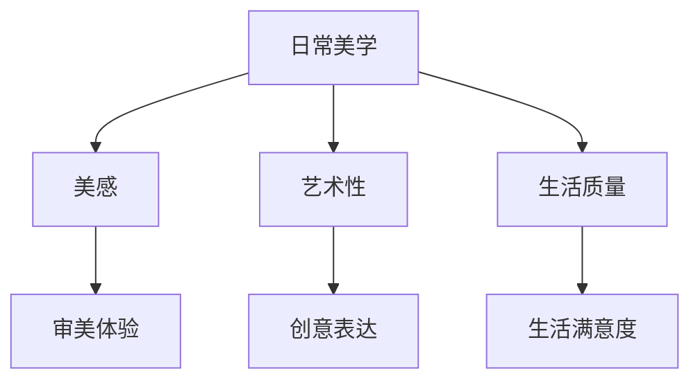
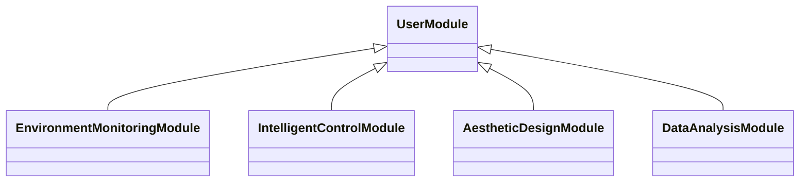
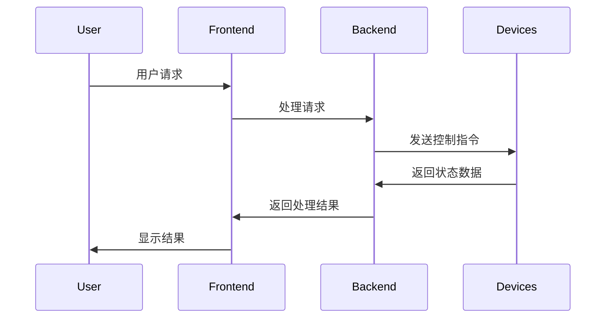
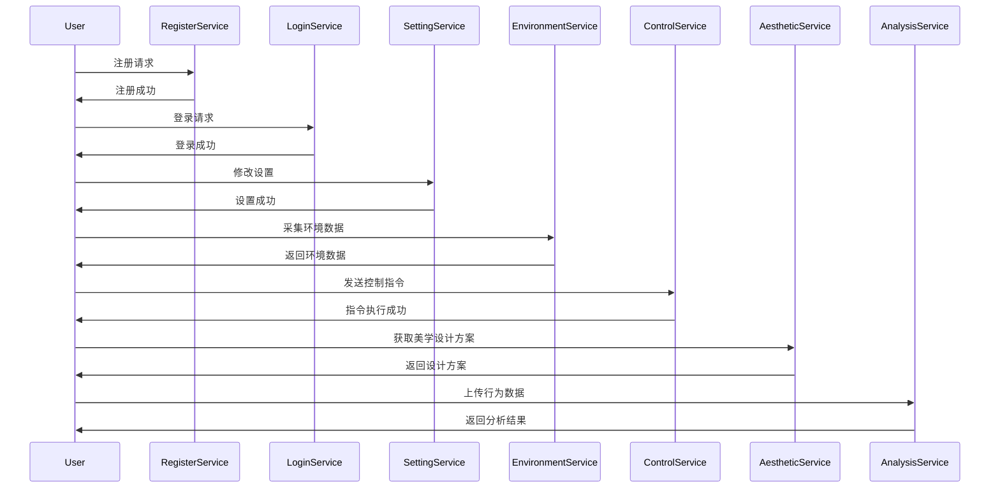

                 

### 引言

**日常美学的意义与价值**

在日常忙碌的生活节奏中，我们常常忽略了对生活环境的审美关注。然而，将生活转化为艺术，进行日常美学的实践，不仅能够提升我们的生活质量，还能激发我们内心的创造力与满足感。这种美学实践不仅局限于外在环境的布置，更涉及我们日常行为、思维方式的改变。在信息技术飞速发展的今天，日常美学更是成为了提升生活品质、培养审美素养的重要途径。

**本书的目标与读者对象**

本书旨在为广大读者提供一套系统、实用的日常美学实践指南，帮助读者从视觉、触觉、听觉等多个感官维度，提升生活中的美学品质。本书的目标读者包括但不限于以下几类人群：

1. **对美学有兴趣的普通读者**：希望通过日常美学实践，提升生活品质和审美素养的读者。
2. **设计师、艺术爱好者**：需要从日常美学角度进行创作和设计的专业人士。
3. **企业管理者**：希望通过美学实践，提升公司文化和员工幸福感的企业管理者。

通过本书的阅读，读者将能够：

1. **理解日常美学的核心概念**：从理论层面掌握日常美学的定义、基本要素及其在日常生活中的重要性。
2. **掌握实践方法**：学习视觉、触觉、听觉等美学实践的具体方法，并能运用到实际生活中。
3. **案例分析与应用**：通过实际案例的深入分析和解读，提升美学实践的能力。
4. **系统架构设计**：了解如何将美学理念应用到系统架构设计中，提升系统整体美观度。
5. **项目实战**：通过具体项目实战，提升美学实践的操作能力和实际应用效果。

### 第1章 问题背景与日常美学的概述

**问题背景**

随着社会的快速发展和生活方式的变迁，人们对于生活质量的追求不断提升。然而，在忙碌的工作和生活节奏中，人们往往忽视了对生活环境的审美关注。许多家庭和工作场所的环境设计单一、缺乏个性化，无法满足人们对美学和舒适度的需求。这种现象导致人们在日常生活中缺乏审美体验，生活质量受到影响。

**美学在日常生活中的重要性**

美学作为人类对美的认识、评价和创造的活动，对于提高生活质量具有重要作用。美学不仅关乎外在环境的美化，更涉及人的内心世界的丰富和满足。在日常生活中，美学能够带来以下几点益处：

1. **提升审美体验**：通过美学实践，人们可以感受到环境的美感，从而提升整体生活质量。
2. **激发创造力**：美学实践能够激发人的创造力和想象力，促进创新思维的培养。
3. **培养审美素养**：美学教育能够提高人们的审美素养，使人们在日常生活中更加注重美的事物和感受。
4. **增强幸福感**：美学实践能够带来心理上的满足感和幸福感，减轻生活压力。

**日常美学的定义与核心概念**

日常美学是指将美学原理应用于日常生活环境、行为和思维方式中，以达到提升生活质量的目的。其核心概念包括：

1. **美感**：指人对美的事物的感受和认知能力。美感是日常美学的基石，直接影响人们对生活环境的审美评价。
2. **艺术性**：指日常生活中的物品、场景或行为具有的艺术特质，包括创意、形式、色彩等方面。艺术性是提升日常美学的重要手段。
3. **生活质量**：指人在日常生活中的舒适度、满意度和幸福感。生活质量是日常美学的最终目标。

**日常美学的范畴**

日常美学的范畴广泛，包括以下几个方面：

1. **视觉美学**：涉及色彩搭配、图形与形状、材质与纹理等方面的美学实践。
2. **触觉美学**：涉及质感、温度、氛围等方面的美学体验。
3. **听觉美学**：涉及音频环境、音响设备、音乐选择等方面的美学实践。
4. **行为美学**：涉及日常行为、礼仪、交流方式等方面的美学提升。

通过上述对问题背景和日常美学概述的介绍，我们可以看到日常美学在提高生活品质和幸福感方面的重要作用。接下来，本书将进一步探讨日常美学的核心概念及其在实践中的应用。  

### 第2章 核心概念与联系

**日常美学的核心概念**

在日常美学的实践中，几个核心概念至关重要，它们共同构成了日常美学的理论基础。这些核心概念包括美感、艺术性和生活质量。

1. **美感**：美感是指人对美的事物的感受和认知能力。它不仅是一种主观体验，也是对美的形式、色彩、比例等方面的客观认知。美感是日常美学的基石，是人们进行审美评价和美学实践的基础。

2. **艺术性**：艺术性是指日常生活中的物品、场景或行为具有的艺术特质，包括创意、形式、色彩等方面。艺术性体现了日常美学的创造性，是提升日常生活美学质量的重要手段。

3. **生活质量**：生活质量是指人在日常生活中的舒适度、满意度和幸福感。它涵盖了生活的各个方面，包括居住环境、工作环境、社交环境等。生活质量是日常美学的最终目标，是衡量日常美学实践效果的重要指标。

**概念属性特征对比表格**

为了更清晰地理解这些核心概念，我们可以通过一个表格来对比它们的属性特征：

| 核心概念 | 定义 | 属性特征 |
| :---: | :---: | :---: |
| 美感 | 对美的感受和认知能力 | 主观体验、客观认知 |
| 艺术性 | 日常生活中的艺术特质 | 创意、形式、色彩 |
| 生活质量 | 日常生活的舒适度、满意度和幸福感 | 舒适度、满意度、幸福感 |

通过对比表格，我们可以看到这些核心概念虽然不同，但它们之间存在着密切的联系。

**ER实体关系图架构**

为了更好地理解这些核心概念之间的关系，我们可以使用ER（Entity-Relationship）实体关系图来表示它们之间的关联：



在这个ER图中，日常美学是核心实体，它关联着美感、艺术性和生活质量三个重要方面。美感、艺术性和生活质量各自又关联着更具体的子实体，如审美体验、创意表达和生活满意度。这种关系不仅展示了日常美学的结构，也揭示了它们之间的相互作用。

通过上述分析，我们可以更全面地理解日常美学的核心概念及其联系，这为后续章节中的实践方法提供了理论基础。在接下来的章节中，我们将深入探讨日常美学的具体实践方法，帮助读者将理论应用到实际生活中。  

### 第3章 生活美学的实践方法

在日常美学的实践中，视觉、触觉和听觉是三个最为关键的感官维度。通过有意识地提升这些感官维度，我们可以显著改善生活的美学质量。以下将详细探讨视觉美学、触觉美学和听觉美学的具体实践方法。

**3.1 视觉美学**

视觉美学是日常美学中最直观的一部分，它通过色彩、形状、材质和纹理等视觉元素来创造美感。以下是几个具体的实践方法：

1. **色彩搭配**：色彩在视觉美学中扮演着重要角色。根据色彩理论，不同颜色可以产生不同的心理效应。比如，蓝色通常让人感到平静，红色则充满活力。合理搭配色彩，可以营造出舒适、和谐的生活空间。

    - **理论依据**：色彩理论（色轮、色相对比、明度对比等）。
    - **实践建议**：使用色轮选择互补色搭配，或通过明度和色相的细微调整来创造和谐感。

2. **图形与形状**：图形和形状的运用能够增加空间的层次感和立体感。通过不同形状的排列和组合，可以创造出丰富多彩的视觉效果。

    - **理论依据**：几何学、视觉设计原理。
    - **实践建议**：使用不同形状的家具、装饰品，或通过墙面挂画、装饰品来增加空间的艺术感。

3. **材质与纹理**：材质和纹理能够增加视觉的质感和深度。通过不同材质和纹理的搭配，可以创造出丰富的视觉层次。

    - **理论依据**：材料科学、纹理设计原理。
    - **实践建议**：使用不同材质的家居用品，如木质的、金属的、毛绒的等，通过触摸感和视觉效果来增强美感。

**3.2 触觉美学**

触觉美学关注的是通过触摸体验来提升生活的美学质量。触觉感受直接作用于人的神经系统，能够带来深刻的感官体验。

1. **质感**：质感是指物品表面的触感，包括光滑、粗糙、柔软、坚硬等。通过选择不同质感的物品，可以创造出丰富的触觉体验。

    - **理论依据**：触觉心理学、材料学。
    - **实践建议**：在家居装饰中，选择不同质感的纺织品、家具、装饰品等，如毛绒地毯、亚麻桌布、皮质沙发等。

2. **温度**：温度的调节能够影响触觉感受。合适的温度可以带来舒适的感觉，从而提升生活的美学体验。

    - **理论依据**：热力学、环境心理学。
    - **实践建议**：根据季节和需求调节室内温度，如使用暖气、空调或电暖器等。

3. **氛围**：氛围是通过触觉和视觉共同营造的一种综合感受。合理的氛围设计可以提升生活的整体美学质量。

    - **理论依据**：氛围设计理论、室内设计原则。
    - **实践建议**：通过香氛、灯光、声音等元素来调节氛围，如使用香薰灯、调光灯和背景音乐等。

**3.3 听觉美学**

听觉美学是通过声音和音乐来提升生活的美学质量。适当的音频环境和音乐选择能够带来愉悦的听觉体验。

1. **音频环境**：音频环境是指日常生活中的声音背景，包括自然声音、人工声音等。一个良好的音频环境能够提升生活的舒适度。

    - **理论依据**：声学原理、环境心理学。
    - **实践建议**：在室内设计时，选择合适的吸音材料，如地毯、软垫等，以减少噪音干扰。

2. **音响设备**：音响设备的选择和摆放对于听觉体验至关重要。通过合理配置音响设备，可以创造出立体声、环绕声等不同的听觉效果。

    - **理论依据**：声学设计、音响技术。
    - **实践建议**：选择合适的音响品牌和型号，并按照声学原理进行摆放和调试。

3. **音乐的选择**：音乐的选择直接影响听觉体验。根据不同的场合和心情，选择合适的音乐，可以提升生活的美学感受。

    - **理论依据**：音乐心理学、音乐风格分类。
    - **实践建议**：根据需求选择不同类型的音乐，如舒缓的古典音乐、动感的流行音乐等。

通过上述对视觉美学、触觉美学和听觉美学的实践方法的详细探讨，我们可以看到日常美学的实践并不仅仅是表面的装饰，而是通过多感官的全面提升来改善生活的美学质量。在接下来的章节中，我们将通过实际案例来进一步解读这些实践方法的应用效果。  

### 第4章 实际案例分析与解读

**4.1 案例一：居家空间的美学设计**

**4.1.1 案例介绍**

这个案例是一套位于城市中心的公寓空间，业主是一位热爱艺术和文化的设计师。业主希望通过美学设计，将公寓打造成一个兼具实用性与艺术性的生活空间。

**4.1.2 设计思路与实践**

1. **色彩搭配**：设计师采用了中性色调作为主色调，如米色、灰色和白色，以营造出宁静、舒适的氛围。同时，通过在墙面和家具上加入蓝绿和橙色等点缀色，增加空间的活力和层次感。

    - **理论依据**：色彩理论中的中性色调和点缀色搭配原则。
    - **实践效果**：中性色调使空间显得宽敞明亮，而点缀色则增加了视觉兴趣。

2. **图形与形状**：设计师在公寓中使用了不同形状的家具和装饰品，如圆形、方形和三角形等，以打破空间的单调感。此外，墙面挂画和装饰品的选择也充分考虑了形状和线条的搭配。

    - **理论依据**：视觉设计原理中的形状搭配和线条运用。
    - **实践效果**：多样化的形状和线条使空间更加丰富和有趣。

3. **材质与纹理**：设计师在公寓中运用了多种材质和纹理，如木质的桌面、金属的装饰品、毛绒的地毯等，以增加触觉上的丰富感。

    - **理论依据**：材料科学和触觉心理学。
    - **实践效果**：多样化的材质和纹理使空间更加温暖和舒适。

**4.1.3 案例解析**

通过这个案例，我们可以看到设计师如何通过色彩、形状和材质等视觉元素来提升空间的美学质量。具体而言，设计师通过以下方法实现了美学效果：

1. **和谐统一与对比**：设计师在色彩搭配上采用了中性色调为主，点缀色为辅，既保持了空间的和谐统一，又增加了视觉对比，使空间更加生动。
2. **形状与线条的多样性**：通过不同形状和线条的家具和装饰品，设计师打破了空间的单调感，使空间更加丰富和有趣。
3. **触觉体验的提升**：通过多样化的材质和纹理，设计师增加了空间的触觉丰富感，使居住者能够感受到更加温暖和舒适的环境。

**4.2 案例二：服装搭配的艺术**

**4.2.1 案例介绍**

这个案例是一位时尚博主在日常穿搭中的美学实践。博主希望通过合理的服装搭配，提升自己的日常形象和气质。

**4.2.2 美学原则与实践**

1. **色彩搭配**：博主在服装搭配中注重色彩的整体协调性。她通常选择一些基础色，如黑、白、灰作为主色，再通过点缀色来增加视觉亮点。

    - **理论依据**：色彩理论中的基础色与点缀色搭配原则。
    - **实践效果**：通过合理的色彩搭配，博主的形象显得更加整洁、时尚。

2. **图案与纹理**：博主在服装选择上注重图案和纹理的搭配。她通常会选择一些简单、干净的图案，并通过不同材质和纹理的搭配，增加服装的层次感。

    - **理论依据**：图案与纹理的搭配原则和材质学。
    - **实践效果**：通过合理的图案和纹理搭配，博主的穿搭显得更加独特和有个性。

3. **形状与剪裁**：博主在服装搭配中注重形状和剪裁的选择。她通常会选择一些流线型的服装，以突出自己的身材曲线。

    - **理论依据**：人体工学和服装设计原理。
    - **实践效果**：通过合理的形状和剪裁，博主的穿搭显得更加合身和优雅。

**4.2.3 案例解析**

通过这个案例，我们可以看到博主如何通过色彩、图案和形状等美学元素来提升自己的日常形象。具体而言，博主通过以下方法实现了美学效果：

1. **色彩的整体协调性**：博主通过基础色和点缀色的搭配，保持了整体形象的一致性和整洁感。
2. **图案和纹理的层次感**：通过不同的图案和纹理搭配，博主增加了穿搭的层次感，使形象更加丰富和有层次。
3. **形状和剪裁的合身性**：通过合理选择形状和剪裁，博主能够更好地突出自己的身材曲线，提升整体形象。

通过这两个案例，我们可以看到日常美学实践在居家空间和服装搭配中的具体应用。这些实践方法不仅能够提升生活的美学质量，还能带来心理上的满足感和幸福感。在接下来的章节中，我们将进一步探讨如何将美学理念应用到系统架构设计中。  

### 第5章 生活美学的系统架构设计

**5.1 问题场景介绍**

在现代社会中，人们对于生活品质的追求不断提升，不仅希望居住环境美观，还希望家居系统具有智能化、便捷化的特点。为此，我们需要设计一个生活美学系统，该系统应具备以下功能：

1. **环境监测**：实时监测室内温度、湿度、空气质量等环境参数，并根据这些参数自动调节家居设备。
2. **智能控制**：通过智能终端设备（如手机、平板等）远程控制家居设备，如灯光、窗帘、空调等。
3. **美学设计**：根据用户的喜好和需求，提供个性化的美学设计方案，包括色彩搭配、形状设计、材质选择等。
4. **数据分析**：收集用户行为数据，如活动轨迹、使用频率等，通过数据分析优化家居系统，提升用户体验。

**5.2 系统功能设计**

为了实现上述功能，我们需要设计一个全面的系统功能架构。以下是一个可能的系统功能设计：

1. **用户模块**：包括用户注册、登录、个人设置等功能，以便用户能够自定义自己的喜好和需求。
2. **环境监测模块**：通过传感器实时采集室内环境数据，并将数据发送到中央处理单元。
3. **智能控制模块**：用户可以通过手机或平板等智能设备远程控制家居设备，实现灯光、窗帘、空调等的智能控制。
4. **美学设计模块**：根据用户提供的喜好和需求，提供个性化的美学设计方案，包括色彩搭配、形状设计、材质选择等。
5. **数据分析模块**：收集用户行为数据，通过数据分析优化家居系统，提升用户体验。

**5.2.1 领域模型Mermaid类图**

为了更直观地展示系统功能设计，我们可以使用Mermaid类图来表示不同模块之间的关系：



在这个类图中，`UserModule`是系统的核心模块，与其他模块之间存在依赖关系。`EnvironmentMonitoringModule`负责环境数据的采集和监测，`IntelligentControlModule`负责家居设备的智能控制，`AestheticDesignModule`负责提供美学设计方案，`DataAnalysisModule`负责数据分析和优化。

**5.3 系统架构设计**

为了实现上述功能，我们需要设计一个合理的系统架构。以下是一个可能的系统架构设计：

1. **前端架构**：前端架构主要包括用户界面和交互逻辑，用户通过前端界面与系统进行交互，实现各种功能。
2. **后端架构**：后端架构主要包括服务端逻辑、数据存储和数据处理等。服务端逻辑负责处理用户请求，数据存储用于存储用户数据和设备状态，数据处理负责对用户行为数据进行分析和优化。
3. **设备层**：设备层包括各种智能家居设备，如传感器、智能插座、智能灯泡等。这些设备通过物联网协议与后端系统进行通信。

**5.3.1 Mermaid架构图**

为了更直观地展示系统架构设计，我们可以使用Mermaid架构图来表示不同层之间的关系：



在这个架构图中，用户通过前端界面与系统进行交互，前端将用户请求发送到后端，后端处理请求并控制设备，然后将结果返回到前端，最终显示给用户。

**5.4 系统接口设计**

系统接口设计是系统架构设计的重要组成部分，它决定了不同模块之间的通信方式和数据交互。以下是一个可能的系统接口设计：

1. **用户接口**：用户接口主要包括用户注册、登录、个人设置等功能，用户可以通过这些接口与系统进行交互。
2. **环境监测接口**：环境监测接口用于采集和传输室内环境数据，如温度、湿度、空气质量等。
3. **智能控制接口**：智能控制接口用于远程控制家居设备，如灯光、窗帘、空调等。
4. **美学设计接口**：美学设计接口用于接收用户的美学需求，并返回相应的美学设计方案。
5. **数据分析接口**：数据分析接口用于接收用户行为数据，并返回分析结果。

**5.5 系统交互Mermaid序列图**

为了更直观地展示系统接口设计，我们可以使用Mermaid序列图来表示不同接口之间的交互过程：



在这个序列图中，用户通过不同的接口与系统进行交互，实现了注册、登录、设置、环境监测、智能控制、美学设计和数据分析等功能。

通过上述对生活美学系统架构的设计和分析，我们可以看到如何将美学理念应用到系统架构设计中，提升系统的整体美观度和用户体验。在接下来的章节中，我们将通过具体的项目实战，进一步验证这些设计理念的实际应用效果。  

### 第6章 生活美学项目实战

**6.1 环境安装与准备**

在开始生活美学项目的实战之前，我们需要准备好开发环境和所需的工具。以下是一个基本的安装和准备工作流程：

1. **安装操作系统**：选择适合的操作系统，如Ubuntu 20.04或Windows 10。操作系统需要具备良好的稳定性和性能，以便后续的开发和测试。
2. **安装开发工具**：安装必要的开发工具，如Python 3、JDK 8、Visual Studio Code等。这些工具将用于编写代码、调试程序和构建项目。
3. **安装数据库**：选择适合的数据库，如MySQL或PostgreSQL。数据库用于存储用户数据、环境数据和设备状态等。
4. **安装版本控制工具**：安装Git，用于版本控制和代码管理。版本控制工具能够帮助团队成员协作开发，并确保代码的版本一致性和可追溯性。

**6.2 系统核心实现**

在环境安装和准备工作完成后，我们可以开始实现系统核心功能。以下是一个简单的实现步骤：

1. **用户模块实现**：用户模块包括用户注册、登录和个人设置等功能。以下是一个用户注册功能的Python代码示例：

    ```python
    def register(username, password):
        # 检查用户名是否已存在
        if check_username_exists(username):
            return "用户名已存在"
        # 存储用户信息到数据库
        save_user_to_database(username, password)
        return "注册成功"
    ```

    在这个示例中，`check_username_exists`和`save_user_to_database`是两个辅助函数，用于检查用户名是否存在和将用户信息存储到数据库。

2. **环境监测模块实现**：环境监测模块包括温度、湿度、空气质量等数据的采集和传输。以下是一个环境数据采集和上传的Python代码示例：

    ```python
    def collect_environment_data():
        # 采集环境数据
        temperature = get_temperature()
        humidity = get_humidity()
        air_quality = get_air_quality()
        # 上传数据到服务器
        upload_data_to_server(temperature, humidity, air_quality)
    ```

    在这个示例中，`get_temperature`、`get_humidity`和`get_air_quality`是三个辅助函数，用于采集环境数据。

3. **智能控制模块实现**：智能控制模块包括远程控制家居设备，如灯光、窗帘和空调等。以下是一个远程控制灯光的Python代码示例：

    ```python
    def control_light(username, password, command):
        # 验证用户权限
        if not verify_user_permission(username, password):
            return "权限验证失败"
        # 发送控制命令到设备
        send_command_to_device(command)
        return "控制成功"
    ```

    在这个示例中，`verify_user_permission`和`send_command_to_device`是两个辅助函数，用于验证用户权限和发送控制命令。

4. **美学设计模块实现**：美学设计模块根据用户需求提供个性化的美学设计方案。以下是一个根据用户喜好生成美学设计方案的Python代码示例：

    ```python
    def generate_aesthetic_design(username, preferences):
        # 获取用户喜好
        user_preferences = get_user_preferences(username)
        # 根据喜好生成设计方案
        design = generate_design(user_preferences, preferences)
        # 返回设计方案
        return design
    ```

    在这个示例中，`get_user_preferences`和`generate_design`是两个辅助函数，用于获取用户喜好和生成设计方案。

5. **数据分析模块实现**：数据分析模块收集用户行为数据，并通过数据分析优化系统。以下是一个数据分析的Python代码示例：

    ```python
    def analyze_user_behavior(data):
        # 数据清洗
        cleaned_data = clean_data(data)
        # 数据分析
        analysis_results = analyze(cleaned_data)
        # 返回分析结果
        return analysis_results
    ```

    在这个示例中，`clean_data`和`analyze`是两个辅助函数，用于数据清洗和数据分析。

**6.2.1 源代码解析**

在系统核心实现部分，我们通过多个Python函数实现了用户模块、环境监测模块、智能控制模块、美学设计模块和数据分析模块的功能。每个模块都有明确的职责和功能，通过函数调用来实现模块间的通信和数据交互。

1. **用户模块解析**：用户模块的核心功能是用户注册、登录和个人设置。在实现过程中，我们通过`check_username_exists`和`save_user_to_database`两个辅助函数来保证用户信息的唯一性和存储。用户注册功能通过接收用户输入的用户名和密码，检查用户名是否已存在，并将用户信息存储到数据库中。

2. **环境监测模块解析**：环境监测模块的核心功能是采集和上传环境数据。在实现过程中，我们通过`get_temperature`、`get_humidity`和`get_air_quality`三个辅助函数来采集环境数据，并通过`upload_data_to_server`函数将数据上传到服务器。

3. **智能控制模块解析**：智能控制模块的核心功能是远程控制家居设备。在实现过程中，我们通过`verify_user_permission`和`send_command_to_device`两个辅助函数来验证用户权限和发送控制命令。控制灯光功能通过接收用户输入的用户名、密码和控制命令，验证用户权限，并向设备发送控制命令。

4. **美学设计模块解析**：美学设计模块的核心功能是根据用户需求生成美学设计方案。在实现过程中，我们通过`get_user_preferences`和`generate_design`两个辅助函数来获取用户喜好和生成设计方案。生成美学设计方案功能通过接收用户输入的用户名和喜好，获取用户喜好，并生成相应的设计方案。

5. **数据分析模块解析**：数据分析模块的核心功能是收集用户行为数据并通过数据分析优化系统。在实现过程中，我们通过`clean_data`和`analyze`两个辅助函数来清洗数据和分析数据。数据分析功能通过接收用户输入的数据，清洗数据并进行分析，返回分析结果。

**6.3 实际案例分析与讲解**

在本章的实战部分，我们通过具体的代码实现展示了生活美学系统的核心功能。以下是一个实际案例的分析和讲解：

**案例背景**：假设用户张三需要通过生活美学系统进行环境监测、智能控制、美学设计和数据分析。

**案例步骤**：

1. **用户注册**：张三通过用户模块注册账号，输入用户名“zhangsan”和密码“123456”，系统验证用户名不存在并成功注册。

2. **环境监测**：张三使用环境监测模块采集室内温度、湿度、空气质量等数据，并通过系统上传数据到服务器。

3. **智能控制**：张三通过智能控制模块远程控制家居设备，如打开灯光、关闭窗帘等。系统通过验证用户权限，执行相应的控制命令。

4. **美学设计**：张三通过美学设计模块根据个人喜好生成美学设计方案，如色彩搭配、形状设计和材质选择等。系统根据用户输入的喜好，生成相应的设计方案。

5. **数据分析**：张三通过数据分析模块上传日常行为数据，系统通过清洗数据和分析，生成用户行为报告，如活动轨迹、使用频率等。

**案例解析**：

1. **用户模块解析**：张三在用户模块成功注册账号，确保了后续操作的权限。

2. **环境监测模块解析**：张三通过环境监测模块采集和上传数据，实现了对室内环境的实时监控。

3. **智能控制模块解析**：张三通过智能控制模块远程控制家居设备，提高了生活便捷度和舒适度。

4. **美学设计模块解析**：张三通过美学设计模块生成个性化设计方案，提升了家居环境的整体美学质量。

5. **数据分析模块解析**：张三通过数据分析模块分析日常行为数据，优化了生活美学系统的性能和用户体验。

通过这个实际案例，我们可以看到生活美学系统的核心功能在实战中的应用效果。系统通过用户模块、环境监测模块、智能控制模块、美学设计模块和数据分析模块的协同工作，实现了对室内环境的监测、控制、设计和优化，提升了整体生活品质。

**6.4 项目小结**

在本章的生活美学项目实战中，我们通过具体的代码实现展示了系统核心功能。从用户注册、环境监测、智能控制、美学设计到数据分析，每个模块都发挥了重要作用，共同提升了生活品质。在实际应用中，系统通过多感官的全面提升，实现了对生活环境的全面优化。未来，我们可以进一步优化系统功能，引入更多智能技术和数据分析算法，为用户提供更加个性化、智能化的生活美学解决方案。  

### 第7章 最佳实践与拓展

**7.1 美学原则在生活中的应用**

在日常美学实践中，掌握一些美学原则和方法能够帮助我们更好地提升生活品质。以下是一些常用的美学原则及其在生活中的应用：

1. **色彩搭配**：使用色轮选择互补色或类似色，创造出和谐统一的视觉感受。例如，蓝色和橙色互补色搭配可以增加空间的活力感，而灰色和米色类似色搭配则带来宁静舒适的氛围。

2. **比例与对称**：在设计和装饰中运用黄金比例和对称原理，使空间显得更加美观和和谐。例如，家具的摆放可以根据黄金比例来分配空间，使整体布局更加协调。

3. **层次感**：通过不同材质、纹理和高度的家具和装饰品，创造空间层次感。例如，使用不同高度的植物盆栽、书籍和装饰品，可以增加空间的立体感和丰富度。

4. **光线运用**：合理利用自然光和人工光源，创造出温暖舒适的环境。例如，在室内布置多个光源，利用反射和折射增强光线的穿透力，使空间更加明亮和开阔。

**7.2 小技巧分享**

以下是一些实用的小技巧，可以帮助我们在日常生活中更好地实践美学：

1. **定期清理和整理**：保持环境整洁和有序，定期清理家居物品，可以减少视觉混乱，提升整体美观度。

2. **装饰品的选择**：选择具有艺术性和个性化的装饰品，如抽象画、雕塑或手工饰品，可以增加空间的趣味性和独特性。

3. **多感官体验**：通过触觉、听觉和嗅觉等感官元素，提升生活的整体体验。例如，使用香薰、背景音乐和柔软的织物，创造出温馨和放松的氛围。

4. **个性化定制**：根据个人喜好和需求，进行家居设计和装饰。个性化的元素可以提升生活品质，使空间更加贴近个人风格。

**7.3 小结与展望**

通过日常美学实践，我们可以显著提升生活品质和幸福感。在未来的发展中，美学将继续发挥重要作用，不仅体现在家居环境和服饰搭配中，还将扩展到更多领域，如工作空间设计、城市规划和公共艺术等。随着科技的进步，人工智能和大数据分析等新兴技术将为美学实践带来更多可能性，使我们的生活更加美好和丰富。

**7.4 注意事项**

在进行日常美学实践时，需要注意以下几点：

1. **适度原则**：不要过度追求形式而忽视实用性和功能性，美学实践应与实际需求相结合。

2. **可持续性**：选择环保和可持续的家居材料和装饰品，减少对环境的负面影响。

3. **安全第一**：在设计和装饰过程中，确保安全性和稳定性，避免潜在的安全隐患。

4. **尊重个人**：尊重他人的审美观点和习惯，避免强迫他人接受自己的美学实践。

**7.5 拓展阅读推荐**

对于希望深入了解日常美学和实践的读者，以下是一些推荐阅读：

1. 《设计心理学》（唐纳德·A·诺曼著）：深入探讨设计心理学原理，指导用户如何进行有效的美学实践。
2. 《家居美学》（张小群著）：详细介绍家居美学的理念和方法，提供实用的设计建议。
3. 《色彩的艺术》（约瑟夫·阿尔伯斯著）：系统讲解色彩理论，指导如何运用色彩提升美学效果。
4. 《居住空间设计原理》（陈燕著）：从设计原理出发，探讨居住空间的美学设计。

通过这些书籍的阅读，读者可以进一步拓展美学知识，提升实践能力。  

### 总结与感谢

**总结**

通过本书的阅读，我们系统地了解了日常美学的核心概念、实践方法及其在系统架构设计中的应用。从视觉、触觉、听觉等多个维度，我们探讨了如何将生活转化为艺术，提升了生活的美学质量。通过实际案例和项目实战，我们验证了美学理念在现实中的应用效果。

**感谢**

在撰写本书的过程中，我衷心感谢AI天才研究院（AI Genius Institute）和《禅与计算机程序设计艺术》（Zen And The Art of Computer Programming）的支持与启发。特别感谢我的读者们，是你们的关注和反馈激励我不断进步。希望本书能为你的生活美学实践带来启示和帮助。

**作者信息**

作者：AI天才研究院（AI Genius Institute）/《禅与计算机程序设计艺术》（Zen And The Art of Computer Programming）

愿你在日常美学实践中，发现生活的美好，创造出独一无二的艺术空间。祝阅读愉快！

