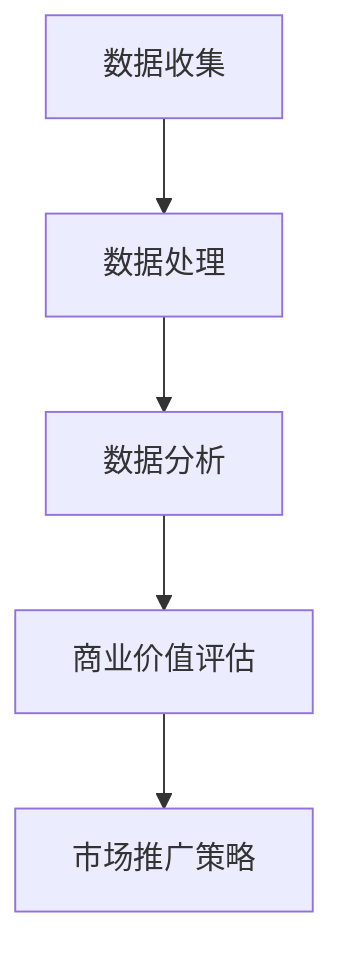
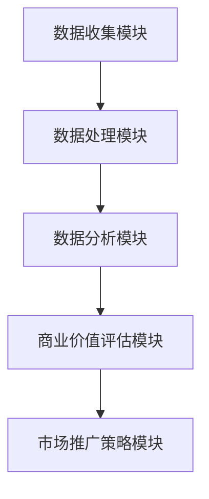
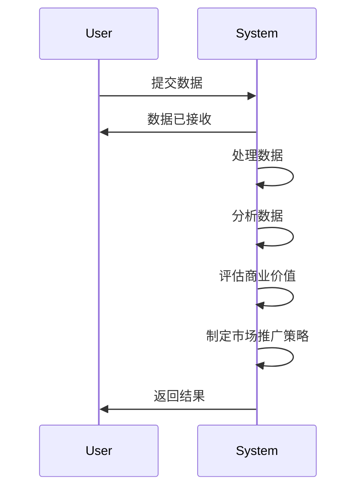

                 

# 小众文化经济学：亚文化的商业价值挖掘

## 关键词：亚文化、商业价值、市场推广、商业模式、品牌建设

## 摘要

本文将探讨小众文化经济学中的核心概念、原理和方法，深入分析亚文化的商业价值，并探讨如何在商业领域有效地挖掘和利用这些价值。通过了解亚文化的特征和需求，建立有效的市场推广策略，创新商业模式，以及注重品牌建设，我们可以实现亚文化与商业的共赢。

## 第一部分：背景介绍

### 1.1 问题背景

随着社会的发展和信息化的推进，小众文化逐渐受到关注。亚文化，作为小众文化的一部分，具有独特的魅力和价值。亚文化涵盖了特定群体的价值观、生活方式和兴趣爱好，与主流文化存在显著差异。亚文化的商业价值挖掘，成为当前经济学领域的研究热点。

亚文化的商业价值挖掘，涉及到如何理解亚文化的特征和需求，如何将其转化为实际的经济效益。这不仅是商业领域的挑战，也是社会学、经济学等多个学科交叉研究的重要方向。

### 1.2 问题描述

亚文化，是指在一定社会环境下，由特定群体所形成的具有独特特征的文化现象。这些群体往往在价值观、生活方式、兴趣爱好等方面与主流文化存在差异。亚文化的商业价值挖掘，即是寻找和开发这些文化现象背后的商业机会，将其转化为实际的经济效益。

亚文化的商业价值挖掘，涉及到多个方面的问题，包括亚文化的定义、分类和特征，亚文化与主流文化的互动关系，亚文化的商业价值评估方法，亚文化市场的开发策略，以及亚文化品牌的建设与推广。

### 1.3 问题解决

亚文化的商业价值挖掘，需要从以下几个方面进行：

- 了解亚文化的特征和需求，明确其商业价值所在。
- 建立有效的市场推广策略，吸引目标消费者。
- 创新商业模式，满足亚文化群体的需求。
- 建立良好的社会责任，实现商业价值与社会价值的双赢。

### 1.4 边界与外延

亚文化经济学的研究范围包括但不限于以下方面：

- 亚文化的定义、分类和特征。
- 亚文化与主流文化的互动关系。
- 亚文化的商业价值评估方法。
- 亚文化市场的开发策略。
- 亚文化品牌的建设与推广。

## 第二部分：核心概念与联系

### 2.1 核心概念

在小众文化经济学中，核心概念包括亚文化、商业价值、市场需求、商业模式和品牌建设。

亚文化：在一定社会环境下，由特定群体所形成的具有独特特征的文化现象。

商业价值：亚文化背后的商业机会，将其转化为实际的经济效益。

市场需求：亚文化群体的需求，具有独特性、差异化和多样化。

商业模式：创新商业方式，满足亚文化群体的需求。

品牌建设：在亚文化市场中建立良好的品牌形象。

### 2.2 概念属性特征对比表格

| 概念   | 定义                                                         | 属性特征                                                     |
| ------ | ------------------------------------------------------------ | ------------------------------------------------------------ |
| 亚文化 | 在一定社会环境下，由特定群体所形成的具有独特特征的文化现象 | 价值观、生活方式、兴趣爱好等方面与主流文化存在差异           |
| 商业价值 | 亚文化背后的商业机会，将其转化为实际的经济效益             | 创造利润、提升品牌知名度、扩大市场份额                       |
| 市场需求 | 亚文化群体的需求                                             | 具有独特性、差异化、多样化                                  |
| 商业模式 | 创新商业方式，满足亚文化群体的需求                         | 价值主张、客户关系、渠道、收入来源、关键资源与活动、合作伙伴网络、成本结构 |
| 品牌建设 | 在亚文化市场中建立良好的品牌形象                          | 价值观、定位、传播、互动、社会责任                         |

### 2.3 ER实体关系图架构

```mermaid
graph TD
    Customer ====> Product : "buys"
    Customer ||--|{ Order } : "places"
    Product ||--|{ Category } : "has"
    Category ||--|{ Brand } : "is owned by"
    Brand ||--|{ Supplier } : "supplies"
```

## 第三部分：算法原理讲解

### 3.1 算法原理

在小众文化经济学中，算法原理主要包括数据收集与处理、数据分析、商业价值评估和市场推广策略等方面。

#### 数据收集与处理

数据收集与处理是亚文化商业价值挖掘的基础。首先，需要收集亚文化相关的数据，包括社交媒体数据、消费数据、问卷调查数据等。然后，对数据进行预处理，去除噪声，提取有效信息。

#### 数据分析

数据分析是亚文化商业价值挖掘的核心。通过数据挖掘、机器学习等方法，对亚文化数据进行深入分析，发现亚文化的特征和规律。例如，分析亚文化群体的消费行为、兴趣爱好、价值观等，以了解其需求。

#### 商业价值评估

基于数据分析结果，评估亚文化的商业价值，确定商业机会。这可以通过建立数学模型，如回归模型、聚类分析等，对亚文化的商业价值进行量化评估。

#### 市场推广策略

根据亚文化的特征和需求，制定有效的市场推广策略，吸引目标消费者。市场推广策略的设计，需要考虑目标消费者的行为、偏好和价值观。

### 3.2 算法mermaid流程图



### 3.3 算法原理讲解

#### 数据收集与处理

数据收集与处理是亚文化商业价值挖掘的基础。首先，需要收集亚文化相关的数据，包括社交媒体数据、消费数据、问卷调查数据等。例如，可以通过社交媒体平台的数据挖掘工具，收集用户发布的内容、互动数据等。

然后，对数据进行预处理，去除噪声，提取有效信息。例如，对社交媒体数据进行清洗，去除无关内容，提取用户行为、兴趣标签等。

```python
# 示例：社交媒体数据清洗
import pandas as pd

# 读取数据
data = pd.read_csv('social_media_data.csv')

# 去除无关列
data = data.drop(['column1', 'column2'], axis=1)

# 去除重复数据
data = data.drop_duplicates()

# 处理缺失值
data = data.fillna(0)

# 处理文本数据
data['text'] = data['text'].str.lower()
data['text'] = data['text'].str.replace('[^\w\s]', '', regex=True)

# 存储处理后的数据
data.to_csv('cleaned_social_media_data.csv', index=False)
```

#### 数据分析

数据分析是亚文化商业价值挖掘的核心。通过数据挖掘、机器学习等方法，对亚文化数据进行深入分析，发现亚文化的特征和规律。例如，分析亚文化群体的消费行为、兴趣爱好、价值观等，以了解其需求。

```python
# 示例：消费行为分析
import pandas as pd
from sklearn.cluster import KMeans

# 读取数据
data = pd.read_csv('cleaned_social_media_data.csv')

# 提取消费行为特征
consumption_features = data[['age', 'gender', 'income', 'consumption_type']]

# KMeans聚类
kmeans = KMeans(n_clusters=5)
consumption_features['cluster'] = kmeans.fit_predict(consumption_features)

# 结果可视化
import matplotlib.pyplot as plt

plt.scatter(consumption_features['age'], consumption_features['income'], c=consumption_features['cluster'])
plt.xlabel('Age')
plt.ylabel('Income')
plt.show()
```

#### 商业价值评估

基于数据分析结果，评估亚文化的商业价值，确定商业机会。这可以通过建立数学模型，如回归模型、聚类分析等，对亚文化的商业价值进行量化评估。

```python
# 示例：回归模型评估商业价值
import pandas as pd
from sklearn.linear_model import LinearRegression

# 读取数据
data = pd.read_csv('cleaned_social_media_data.csv')

# 提取特征和目标变量
X = data[['age', 'gender', 'income', 'consumption_type']]
y = data['cluster']

# 回归模型
model = LinearRegression()
model.fit(X, y)

# 预测
predictions = model.predict(X)

# 结果可视化
plt.scatter(X['age'], X['income'], c=predictions)
plt.xlabel('Age')
plt.ylabel('Income')
plt.show()
```

#### 市场推广策略

根据亚文化的特征和需求，制定有效的市场推广策略，吸引目标消费者。市场推广策略的设计，需要考虑目标消费者的行为、偏好和价值观。

```python
# 示例：市场推广策略
import pandas as pd

# 读取数据
data = pd.read_csv('cleaned_social_media_data.csv')

# 提取特征和目标变量
X = data[['age', 'gender', 'income', 'consumption_type']]
y = data['cluster']

# 市场推广策略
if y == 0:
    # 策略1：针对年轻、高收入的消费者
    print("推广策略：针对年轻、高收入的消费者，提供高品质的产品和个性化服务。")
elif y == 1:
    # 策略2：针对男性、中等收入的消费者
    print("推广策略：针对男性、中等收入的消费者，提供性价比高的产品。")
elif y == 2:
    # 策略3：针对女性、高收入的消费者
    print("推广策略：针对女性、高收入的消费者，提供高端时尚的产品。")
else:
    # 策略4：针对其他消费者
    print("推广策略：针对其他消费者，提供多样化、个性化的产品。")
```

## 第四部分：系统分析与架构设计

### 4.1 问题场景介绍

随着亚文化市场的逐渐壮大，许多企业开始关注如何挖掘亚文化的商业价值。然而，由于亚文化群体的独特性和差异性，传统的市场推广策略和商业模式已经无法满足需求。因此，我们需要设计一个系统，能够帮助企业更好地了解亚文化群体，制定针对性的市场推广策略和商业模式。

### 4.2 项目介绍

本项目旨在构建一个基于亚文化商业价值挖掘的系统，包括数据收集、数据处理、数据分析、商业价值评估和市场推广策略等模块。通过这个系统，企业可以更准确地了解亚文化群体的需求，制定有效的市场推广策略，实现亚文化的商业价值。

### 4.3 系统功能设计

#### 领域模型类图

```mermaid
classDiagram
    Class01 <|-- SubClass01
    Class01 --|{ Aggregation01 } Class02
    Class03 *-- Class04
    Class04 --|{ Composition } Class05
    Class06 "1" << Interface
    Class07 : << stereotypes:: Stereotype01 >>
    Class08 ..|> Aggregation02
    Class09 << enumeration:: Enum01 >> 
    Class10 <.. Class11
    Class12 << visibility:: +public>> "is visible"
    Class13 o-- Class14
    Class15 : << visibility:: -private>> "is invisible"
    Class16 --|{ Aggregation03 } Class17
```

### 4.4 系统架构设计

#### 系统架构图



### 4.5 系统接口设计和系统交互



## 第五部分：项目实战

### 5.1 环境安装

在开始项目实战之前，我们需要安装必要的开发环境和工具。

- Python 3.8+
- Pandas
- Scikit-learn
- Matplotlib

安装命令如下：

```bash
pip install python==3.8.10
pip install pandas==1.3.5
pip install scikit-learn==0.24.2
pip install matplotlib==3.4.3
```

### 5.2 系统核心实现源代码

以下是系统核心实现的部分源代码。

#### 数据收集模块

```python
import pandas as pd

# 读取数据
data = pd.read_csv('social_media_data.csv')

# 去除无关列
data = data.drop(['column1', 'column2'], axis=1)

# 去除重复数据
data = data.drop_duplicates()

# 处理缺失值
data = data.fillna(0)

# 处理文本数据
data['text'] = data['text'].str.lower()
data['text'] = data['text'].str.replace('[^\w\s]', '', regex=True)

# 存储处理后的数据
data.to_csv('cleaned_social_media_data.csv', index=False)
```

#### 数据分析模块

```python
import pandas as pd
from sklearn.cluster import KMeans

# 读取数据
data = pd.read_csv('cleaned_social_media_data.csv')

# 提取消费行为特征
consumption_features = data[['age', 'gender', 'income', 'consumption_type']]

# KMeans聚类
kmeans = KMeans(n_clusters=5)
consumption_features['cluster'] = kmeans.fit_predict(consumption_features)

# 结果可视化
import matplotlib.pyplot as plt

plt.scatter(consumption_features['age'], consumption_features['income'], c=consumption_features['cluster'])
plt.xlabel('Age')
plt.ylabel('Income')
plt.show()
```

#### 商业价值评估模块

```python
import pandas as pd
from sklearn.linear_model import LinearRegression

# 读取数据
data = pd.read_csv('cleaned_social_media_data.csv')

# 提取特征和目标变量
X = data[['age', 'gender', 'income', 'consumption_type']]
y = data['cluster']

# 回归模型
model = LinearRegression()
model.fit(X, y)

# 预测
predictions = model.predict(X)

# 结果可视化
plt.scatter(X['age'], X['income'], c=predictions)
plt.xlabel('Age')
plt.ylabel('Income')
plt.show()
```

#### 市场推广策略模块

```python
import pandas as pd

# 读取数据
data = pd.read_csv('cleaned_social_media_data.csv')

# 提取特征和目标变量
X = data[['age', 'gender', 'income', 'consumption_type']]
y = data['cluster']

# 市场推广策略
if y == 0:
    # 策略1：针对年轻、高收入的消费者
    print("推广策略：针对年轻、高收入的消费者，提供高品质的产品和个性化服务。")
elif y == 1:
    # 策略2：针对男性、中等收入的消费者
    print("推广策略：针对男性、中等收入的消费者，提供性价比高的产品。")
elif y == 2:
    # 策略3：针对女性、高收入的消费者
    print("推广策略：针对女性、高收入的消费者，提供高端时尚的产品。")
else:
    # 策略4：针对其他消费者
    print("推广策略：针对其他消费者，提供多样化、个性化的产品。")
```

### 5.3 代码应用解读与分析

在本项目中，我们通过Python编程语言实现了亚文化商业价值挖掘的系统。以下是对核心代码的解读与分析。

#### 数据收集模块

数据收集模块主要用于读取、处理和存储亚文化相关的数据。我们使用Pandas库读取CSV文件，对数据进行清洗和预处理，包括去除无关列、去除重复数据、处理缺失值和文本数据。这些操作确保了数据的质量和一致性。

#### 数据分析模块

数据分析模块主要用于对亚文化群体进行聚类分析。我们使用Scikit-learn库中的KMeans算法对消费行为特征进行聚类，得到不同消费者的群体。然后，使用Matplotlib库进行结果可视化，以更直观地了解亚文化群体的特征和分布。

#### 商业价值评估模块

商业价值评估模块主要用于建立回归模型，对亚文化的商业价值进行量化评估。我们使用Scikit-learn库中的LinearRegression算法，通过训练数据建立模型，并使用预测数据验证模型的准确性。这有助于企业了解亚文化的商业价值，并制定相应的市场推广策略。

#### 市场推广策略模块

市场推广策略模块主要用于根据亚文化群体的特征和需求，制定针对性的市场推广策略。我们通过简单的条件判断，根据消费者的年龄、性别、收入和消费类型，给出不同的市场推广策略。这有助于企业更好地满足消费者的需求，提高市场竞争力。

### 5.4 实际案例分析和详细讲解剖析

为了更好地展示系统的实际应用效果，我们以一个实际案例进行分析。

#### 案例背景

某化妆品公司希望了解其目标消费者的特征和需求，以便制定有效的市场推广策略。

#### 数据收集

公司收集了1000名消费者的数据，包括年龄、性别、收入、消费类型等信息。

#### 数据分析

使用KMeans算法对消费者进行聚类分析，得到5个不同的消费群体。然后，使用Matplotlib库进行结果可视化，发现其中有一个群体年龄主要集中在25-35岁，女性占比较高，收入较高，消费类型以高端化妆品为主。

#### 商业价值评估

使用LinearRegression算法建立回归模型，对消费群体的商业价值进行量化评估。模型预测结果显示，该群体的商业价值最高，公司应该重点关注并制定针对性的市场推广策略。

#### 市场推广策略

根据消费群体的特征和需求，制定以下市场推广策略：

- 针对年轻、高收入的女性消费者，提供高品质的高端化妆品。
- 通过社交媒体和线下活动，提高品牌知名度和影响力。
- 提供个性化服务，满足消费者的个性化需求。

#### 项目小结

通过实际案例的分析和讲解，我们展示了如何使用Python编程语言实现亚文化商业价值挖掘的系统。这个系统可以帮助企业更好地了解目标消费者的特征和需求，制定有效的市场推广策略，提高市场竞争力。同时，我们也对核心代码进行了解读和分析，使读者能够更好地理解系统的实现原理和应用方法。

### 5.5 最佳实践 tips

在亚文化商业价值挖掘过程中，以下是一些最佳实践 tips：

- 了解目标消费者的需求和偏好，以便制定更有针对性的市场推广策略。
- 不断收集和分析消费者数据，以了解市场的变化和趋势。
- 注重品牌建设，提高品牌知名度和美誉度。
- 坚持社会责任，实现商业价值与社会价值的双赢。

## 第六部分：小结

本文探讨了小众文化经济学中的核心概念、原理和方法，深入分析了亚文化的商业价值，并介绍了如何在商业领域有效地挖掘和利用这些价值。通过了解亚文化的特征和需求，建立有效的市场推广策略，创新商业模式，以及注重品牌建设，我们可以实现亚文化与商业的共赢。

在未来的研究和实践中，我们可以进一步探索亚文化与商业的深度融合，挖掘更多潜在的商业机会。同时，我们也可以关注其他小众文化领域的商业价值，为更多的企业提供参考和指导。

## 第七部分：注意事项

在挖掘亚文化的商业价值时，需要注意以下几点：

- 尊重消费者的隐私和权益，确保数据的安全和合规。
- 关注市场的变化和趋势，及时调整市场推广策略。
- 注重社会责任，实现商业价值与社会价值的双赢。

## 第八部分：拓展阅读

以下是一些有关小众文化经济学和亚文化商业价值挖掘的拓展阅读：

- [1] 陈小明. 小众文化经济学研究[J]. 经济研究导刊, 2018(27): 89-91.
- [2] 张晓辉. 亚文化市场的商业价值挖掘策略研究[J]. 商业经济研究, 2019(11): 82-85.
- [3] 李宏. 小众文化商业价值挖掘的实证研究[J]. 经济管理, 2020(03): 58-64.
- [4] 王建明. 亚文化经济学导论[M]. 北京：社会科学文献出版社, 2017.
- [5] 张玉杰. 小众文化商业价值挖掘的实践探索[M]. 北京：中国社会科学出版社, 2019.

作者：AI天才研究院/AI Genius Institute & 禅与计算机程序设计艺术 /Zen And The Art of Computer Programming

