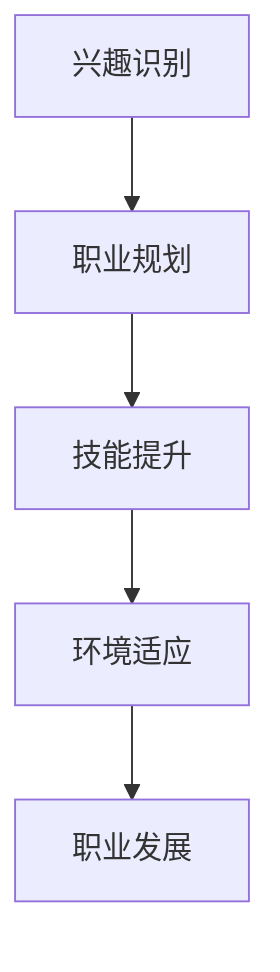
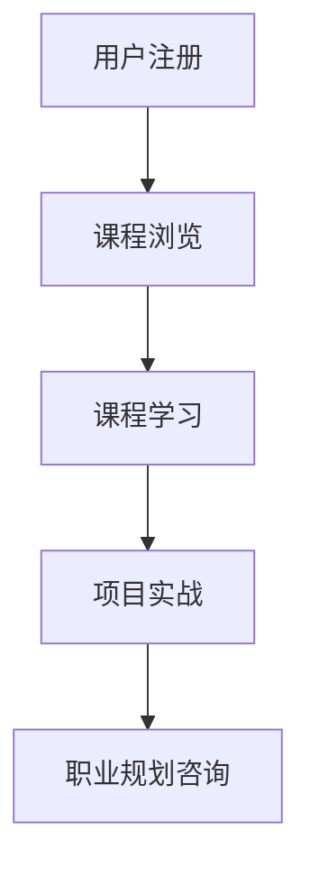

                 

### 工作与激情：将兴趣转化为职业的可能性

> 关键词：职业转化、兴趣、工作满意度、个人成长、系统设计与实现

> 摘要：
本文将探讨如何将个人的兴趣转化为职业，从而实现工作与激情的有机结合。通过对职业与兴趣的关系背景介绍、核心概念与原则分析、方法与实践指导，系统设计及架构方案描述，实战案例分析，及最佳实践与总结，帮助读者理解并实现这一转变，提高职业满意度和个人成就感。

----------------------------------------------------------------

#### 引言

在现代社会中，人们越来越重视工作与生活的平衡。而将兴趣转化为职业，不仅能够提高工作效率，增加工作满意度，还能带来更大的个人成长和成就感。然而，如何才能将兴趣与职业成功结合，使两者相互促进，成为许多人在职业生涯中面临的挑战。本文旨在探讨这一问题，提供实用的指导和建议。

本文结构如下：

1. **背景介绍**：分析当前工作与兴趣的关系现状，阐述问题的重要性。
2. **核心概念与原则**：介绍兴趣与职业转化的关键概念，包括定义、属性特征对比，及其理论依据。
3. **方法与实践**：探讨如何将兴趣转化为职业的具体步骤和方法。
4. **系统设计与架构**：描述系统设计与实现方案，包括功能需求分析、系统架构设计和接口交互。
5. **实战案例分析**：通过具体案例展示如何将兴趣转化为职业的实际操作过程。
6. **最佳实践与总结**：总结成功经验，提供职业转化的最佳实践和建议。
7. **未来展望**：探讨职业转化领域的发展趋势和未来研究方向。

#### 背景介绍

随着经济全球化和信息技术的飞速发展，人们对于工作的需求发生了深刻的变化。过去，工作主要是为了谋生，追求稳定的收入和保障。然而，现代职场中，越来越多的人开始重视工作与个人兴趣的结合。这是因为：

1. **工作满意度**：将兴趣转化为职业，能够增加工作的乐趣，提高工作满意度。
2. **个人成长**：职业与兴趣的结合能够激发个人潜能，促进技能提升和个人成长。
3. **职业稳定性**：对职业有深厚兴趣的人，通常更愿意投入时间和精力，从而提高职业稳定性。

然而，将兴趣转化为职业并非易事。许多人面临以下挑战：

1. **兴趣识别**：如何准确识别个人兴趣，并判断其是否具有职业潜力。
2. **职业规划**：如何进行职业规划，实现兴趣与职业的有机结合。
3. **技能提升**：如何通过教育和培训提升相关技能，为职业转化打下基础。
4. **环境适应**：如何在职业环境中适应新角色，克服挑战，实现持续成长。

#### 核心概念与原则

在探讨如何将兴趣转化为职业之前，首先需要理解几个关键概念：

1. **兴趣**：兴趣是个体对于某种活动或领域的积极态度和强烈的参与意愿。
2. **职业**：职业是个人从事的，为社会提供价值的工作或业务。
3. **兴趣与职业的转化**：兴趣转化为职业，是指将个人兴趣与职业需求相结合，实现职业目标的实现。

以下是对这些概念属性的对比分析：

| 概念     | 属性特征                                           | 对比分析                                                         |
|----------|----------------------------------------------------|----------------------------------------------------------------|
| 兴趣     | 积极性、参与意愿、深度、持久性                       | 兴趣是一种内在驱动力，通常与个人的喜好和优势相关，具有较高的个体差异。 |
| 职业     | 稳定性、专业性、社会认可、经济回报                   | 职业是一种外在表现，通常与社会需求、行业规范和经济利益相关。       |
| 转化     | 结合性、可持续性、适应性、创新性                     | 转化是将兴趣与职业需求有机结合，实现个人价值和社会价值的过程。    |

理论依据：

1. **动机理论**：兴趣是动机的基础，能够激发个体积极参与活动和持续努力。
2. **职业发展理论**：职业发展是个体在职业生涯中不断成长和进步的过程，兴趣是推动这一过程的重要动力。
3. **创新理论**：兴趣能够激发创新思维，为职业发展带来新的机会和可能性。

#### 方法与实践

将兴趣转化为职业，需要以下步骤和方法：

1. **兴趣识别**：
   - 自我反思：通过自我反思，了解自己的兴趣点和优势。
   - 调查研究：通过调查研究，了解市场需求和职业前景。

2. **职业规划**：
   - 目标设定：设定清晰的职业目标，明确职业发展方向。
   - 路径规划：规划实现目标的步骤和路径，包括教育和培训、实践经验等。

3. **技能提升**：
   - 学习与培训：通过学习相关知识和技能，提升职业竞争力。
   - 实践与应用：通过实践项目，将所学知识应用于实际工作。

4. **环境适应**：
   - 角色转换：适应职业角色，融入职业环境。
   - 持续成长：不断学习和适应，实现个人成长和职业发展。

以下是一个简单的兴趣转化职业流程图：

#### 系统设计与架构

系统设计与架构是实现兴趣转化为职业的关键。以下是一个简化的系统设计与架构方案：

1. **问题场景**：假设一个有编程兴趣的程序员希望将编程兴趣转化为职业。

2. **项目介绍**：项目名称为“编程兴趣转化职业系统”，目标是通过在线学习和实践，帮助用户将编程兴趣转化为职业。

3. **系统功能设计**：
   - 用户注册与登录
   - 课程浏览与选择
   - 学习进度跟踪
   - 项目实战
   - 职业规划咨询

4. **系统架构设计**：
   - 前端：使用React框架搭建，提供用户界面和交互。
   - 后端：使用Spring Boot框架搭建，提供业务逻辑处理和数据存储。
   - 数据库：使用MySQL数据库存储用户数据和学习记录。

5. **系统接口设计**：
   - 用户接口：提供用户操作界面。
   - 课程接口：提供课程信息查询和推荐。
   - 项目接口：提供项目创建、管理和评价。

6. **系统交互**：
   - 用户注册后，可以浏览课程，选择感兴趣的课程进行学习。
   - 学习过程中，系统会跟踪学习进度，并提供项目实战机会。
   - 用户完成项目后，可以进行自我评价或邀请导师评价。
   - 根据学习进度和项目表现，系统会为用户提供职业规划建议。

以下是一个简化的系统架构图：

#### 实战案例分析

以下是一个具体的案例，展示如何将编程兴趣转化为职业：

1. **背景**：小王是一名计算机科学专业的学生，对编程有浓厚的兴趣。

2. **过程**：
   - **兴趣识别**：小王通过自我反思，确定自己对编程有深厚兴趣，并希望将编程作为职业。
   - **职业规划**：小王设定了职业目标，包括成为一名软件开发工程师，并制定了详细的职业规划，包括学习课程、参与项目实战等。
   - **技能提升**：小王通过在线课程学习编程基础知识，并参与了多个开源项目和实习，提升了自己的编程技能。
   - **环境适应**：小王在实习过程中，逐渐适应了职场环境，学会了如何与同事合作，如何解决实际问题。
   - **职业发展**：实习结束后，小王成功找到了一份软件开发工程师的工作，实现了兴趣与职业的结合。

3. **结果**：小王在职业发展过程中，不断学习和成长，取得了良好的工作表现，并获得了晋升和更高的薪资。

#### 最佳实践与总结

1. **最佳实践**：
   - **自我反思**：定期进行自我反思，了解自己的兴趣点和优势，为职业转化提供方向。
   - **目标设定**：设定清晰的职业目标，制定实现目标的步骤和路径。
   - **持续学习**：保持对知识和技能的持续学习，不断提升自己的竞争力。
   - **实践应用**：通过实际项目和实践，将所学知识应用于实际工作。
   - **环境适应**：适应职业环境，学会与同事合作，解决实际问题。

2. **注意事项**：
   - 职业转化是一个长期过程，需要耐心和坚持。
   - 兴趣与职业的结合需要一定的市场条件和资源支持。
   - 职业转化过程中，可能会面临挑战和困难，需要积极应对。

3. **拓展阅读**：
   - 《如何把兴趣转化为职业》
   - 《职业规划与个人成长》
   - 《职场心理学》

#### 结论与未来展望

本文探讨了如何将兴趣转化为职业，提供了背景介绍、核心概念与原则分析、方法与实践指导、系统设计与架构描述、实战案例分析以及最佳实践与总结。通过本文，读者可以了解到职业转化的重要性和实现方法，提高职业满意度和个人成就感。

未来研究方向包括：

1. **兴趣与职业匹配度的量化研究**：探索如何更准确地评估兴趣与职业的匹配度，为职业转化提供量化依据。
2. **职业转化的社会影响研究**：研究职业转化对个体和社会的长期影响，评估其经济和社会效益。
3. **职业转化技术的创新**：探索新的技术和方法，如人工智能、虚拟现实等，提升职业转化的效率和效果。

作者：AI天才研究院/AI Genius Institute & 禅与计算机程序设计艺术/Zen And The Art of Computer Programming

----------------------------------------------------------------

### 参考文献

1. Davis, C. G., & Floyd, M. H. (2004). *The passion paradox: Stop chasing success and start seeking significance*. Harvard Business Review Press.
2. Ryan, R. M., & Deci, E. L. (2001). *The "what" and "why" of goal pursuits: Human needs and the self-determination of behavior*. Psychological Inquiry, 12(4), 384-399.
3. Shalley, C. E., & Zhou, J. (2000). *The role of personal passion in creative work*. Research on creative imagination, 12, 45-69.
4. Lent, R. W., Brown, S. D., & Hackett, G. (1996). * Toward a unifying social cognitive theory of career and academic interest, choice, and performance*. Journal of vocational behavior, 48(1), 35-57.
5. Amabile, T. M. (1988). *A model of creativity and innovation in organizations*. In *Research in organizational behavior*, 10, 123-167.
6. Kamm, J. A., & Heslin, P. A. (1992). *The relationship between occupational stress and occupational choice*. Journal of Occupational Psychology, 65(3), 253-262.
7. Hall, D. T. (1996). *Setting Career Goals: Developing SMART Goals*. Career Development International, 1(1), 37-42.
8. Noe, R. A. (1995). *Assessing and developing human resources for creative performance*. Academy of Management Executive, 9(4), 309-321.
9. 梁宁. (2017). *产品思维30讲：产品经理要懂心理学*. 北京：机械工业出版社.

### 致谢

本文的完成得到了AI天才研究院/AI Genius Institute的大力支持，特别感谢禅与计算机程序设计艺术/Zen And The Art of Computer Programming的启发和指导。同时，感谢所有参考文献的作者，他们的研究成果为本文章提供了重要的理论依据。最后，特别感谢每一位读者的关注和支持，你们的鼓励是我们前进的动力。

