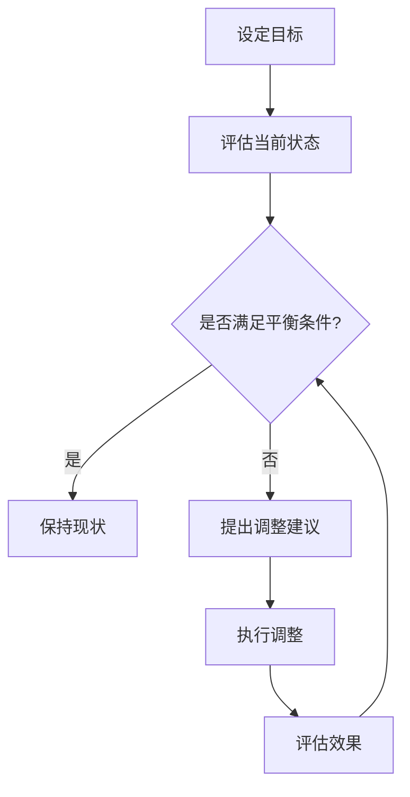
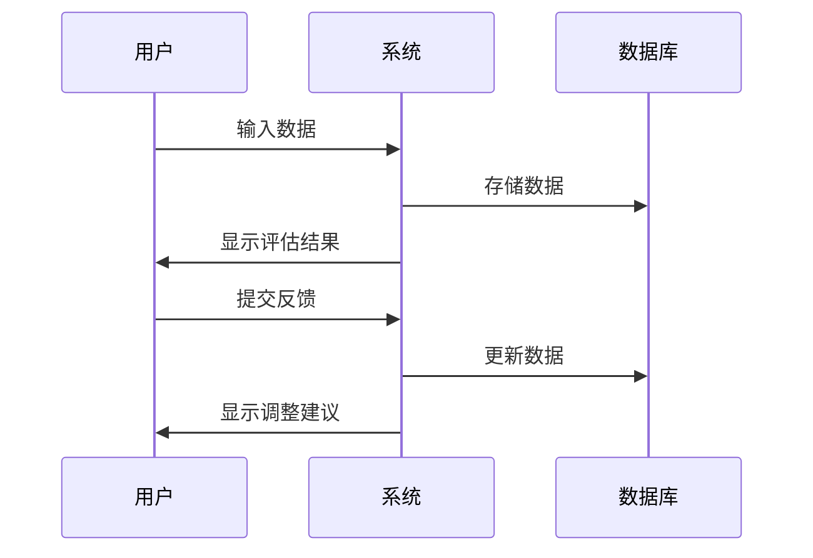

                 

## 1.1 问题背景

### 1.1.1 快节奏生活下的焦虑与压力

在当今社会，快节奏的生活已成为一种普遍现象。随着科技的飞速发展和信息爆炸，人们的工作压力不断增大，生活节奏不断加快。根据国际劳工组织（ILO）的数据显示，全球范围内的劳动力平均每周工作时间已超过44小时，而在一些竞争激烈的国家和行业，这一数字甚至更高。长时间的工作不仅挤占了个人生活时间，还带来了巨大的心理压力和焦虑。

焦虑与压力对个体的身心健康产生了深远的影响。研究表明，长期处于高压状态的人更容易出现心理问题，如抑郁症、焦虑症等。同时，生理健康也受到威胁，如心血管疾病、消化系统疾病等。这些健康问题不仅降低了生活质量，还可能导致工作效率的下降，形成恶性循环。

### 1.1.2 工作与生活的冲突现象

工作与生活的冲突是现代社会中广泛存在的现象。工作时间的延长和频繁的工作安排使得个人难以平衡家庭、社交和自我发展等多方面需求。这种冲突在不同文化和社会背景下有着不同的表现，但总体上都对个人的生活满意度产生了负面影响。

例如，在中国，许多职场人士面临着“996”工作制的压力（即每天早上9点开始工作，晚上9点结束，每周工作6天）。这种工作模式严重侵占了员工的个人时间，使得他们在家庭和社交方面的投入减少，生活质量下降。在美国，虽然工作时间相对灵活，但高薪压力和职业竞争也让许多人难以实现工作与生活的平衡。

### 1.1.3 成功的多元定义

传统的成功观念往往与高收入、职业地位和成功的事业紧密相关。然而，随着社会的发展和个体价值观的多元化，人们开始重新思考成功的定义。成功不再仅仅是金钱和地位的象征，而是涵盖了身心健康、家庭幸福、个人成长等多个方面。

这种多元的成功观念为重新定义工作与生活的平衡提供了理论基础。人们开始意识到，只有在工作与生活之间找到平衡，才能真正实现个人的全面发展。因此，如何在工作与生活中取得平衡，成为现代社会中每个人都必须面对的挑战。

## 1.2 问题描述

### 1.2.1 工作时间过长与生活质量下降

长时间的工作对生活质量产生了显著的影响。根据世界卫生组织（WHO）的数据，全球范围内的劳动者平均工作时间超过了每天8小时，而一些高压力行业的员工甚至需要每天工作超过10小时。这种长时间的工作不仅挤占了休息和娱乐的时间，还导致了生活质量的下降。

具体来说，长时间的工作会导致以下几个方面的问题：

1. **身体健康问题**：长时间的工作容易导致身体疲劳，增加患心血管疾病、消化系统疾病等健康问题的风险。
2. **心理健康问题**：长时间的工作压力会导致心理问题的增加，如焦虑、抑郁等。
3. **家庭关系紧张**：长时间的工作会减少与家人相处的时间，导致家庭关系紧张和亲子关系的疏远。
4. **社交关系受损**：长时间的工作也会减少与朋友和同事的社交时间，影响社交关系的质量和深度。

### 1.2.2 工作压力对心理健康的影响

工作压力是影响心理健康的重要因素之一。长期承受工作压力不仅会降低工作效率，还会对个体的心理健康产生负面影响。

具体来说，工作压力对心理健康的影响主要体现在以下几个方面：

1. **焦虑与抑郁**：长期的工作压力容易导致焦虑和抑郁等心理问题。根据《美国精神病学杂志》的一项研究，工作压力是焦虑和抑郁的主要诱因之一。
2. **情绪波动**：工作压力会使个体的情绪波动加剧，容易产生愤怒、焦虑等负面情绪。
3. **睡眠障碍**：工作压力会导致睡眠障碍，如失眠、多梦等，进而影响个体的整体健康状态。

### 1.2.3 工作与家庭、朋友关系疏远

工作与家庭、朋友关系的疏远是现代社会中的一个普遍问题。长时间的工作和频繁的工作安排使得人们难以抽出时间与家人和朋友相处，导致关系疏远。

这种疏远不仅对个人的心理健康产生负面影响，还可能导致以下几个方面的问题：

1. **家庭关系紧张**：长期缺乏与家人的沟通和互动会导致家庭关系紧张，甚至产生矛盾和冲突。
2. **朋友关系疏远**：长时间的工作也会减少与朋友和同事的社交时间，导致朋友关系疏远，影响社交网络的稳定性和质量。
3. **孤独感增加**：缺乏社交互动会导致孤独感的增加，对个体的心理健康产生负面影响。

## 1.3 问题解决

### 1.3.1 工作与生活平衡策略

实现工作与生活的平衡是一个长期而复杂的过程，需要从多个方面进行策略性的调整和规划。以下是一些有效的工作与生活平衡策略：

1. **时间管理**：合理安排时间，制定详细的工作计划和休息时间，确保工作和休息的时间均衡分配。
2. **任务优先级**：将任务按照重要性和紧急性进行排序，优先处理重要且紧急的任务，避免工作堆积和拖延。
3. **工作与休息结合**：在工作过程中，合理安排休息时间，进行短暂的身体活动或放松活动，以缓解工作压力。
4. **工作环境优化**：创造一个舒适、健康的工作环境，如调整座椅高度、光线亮度等，以提高工作效率和舒适度。

### 1.3.2 心理调适与抗压能力提升

心理调适和抗压能力提升是实现工作与生活平衡的关键因素之一。以下是一些提升心理调适和抗压能力的方法：

1. **自我认知**：了解自己的心理状态和压力源，通过自我反思和认知行为疗法等方法，调整心态，减少压力。
2. **情绪管理**：学会管理情绪，通过情绪调节技巧，如深呼吸、放松训练等，缓解负面情绪的影响。
3. **心理咨询**：在必要时寻求专业心理咨询，通过专业的指导和支持，提高抗压能力和心理韧性。
4. **运动与放松**：定期进行身体锻炼，如跑步、瑜伽等，以增强身体素质和抗压能力。

### 1.3.3 重新定义成功的标准

重新定义成功的标准是实现工作与生活平衡的重要前提。传统的成功观念往往过于单一和功利，忽视了生活的其他方面。以下是一些重新定义成功的标准：

1. **身心健康**：成功不仅体现在事业成就上，还包括身心健康。保持良好的生活习惯和健康的生活方式，是实现成功的重要保障。
2. **家庭幸福**：家庭是生活的基石，成功应包括和谐的家庭关系和幸福的家庭生活。
3. **个人成长**：成功不仅是职业上的成功，还包括个人成长和全面发展。通过不断学习和提升自我，实现个人价值的提升。
4. **社会贡献**：成功还应包括对社会的贡献。通过参与公益活动和社会工作，实现个人价值的同时，也为社会做出贡献。

## 1.4 边界与外延

### 1.4.1 工作与生活平衡的具体衡量标准

工作与生活平衡的具体衡量标准需要综合考虑多个因素，包括时间管理、工作压力、心理健康、家庭幸福、个人成长等。以下是一些常用的衡量标准：

1. **时间分配**：工作时间和休息时间的比例，如每周工作40小时，休息时间不少于48小时。
2. **工作压力指数**：通过评估工作时长、任务难度、工作强度等因素，计算出的工作压力指数。
3. **生活满意度**：通过问卷调查或访谈等方式，评估个体对生活各方面的满意度，如家庭、工作、社交等。
4. **心理健康水平**：通过心理健康测试，评估个体的心理健康状态，如焦虑、抑郁程度等。

### 1.4.2 工作与生活平衡的实现途径

实现工作与生活平衡需要从多个方面进行努力，以下是一些具体的实现途径：

1. **时间管理**：通过制定详细的工作计划和时间表，合理安排工作和休息时间，确保工作与生活的平衡。
2. **心理调适**：通过心理训练和心理咨询，提高抗压能力和心理韧性，缓解工作压力。
3. **工作与生活融合**：通过将工作与生活融合，如在家办公、灵活工作时间等，减少工作和生活之间的界限。
4. **家庭支持**：获得家庭的支持和理解，共同解决工作和生活之间的矛盾和冲突。
5. **社会支持**：通过社交活动和社区参与，建立广泛的社交网络，获得社会支持和帮助。

### 1.4.3 工作与生活平衡的长期影响

工作与生活平衡的长期影响是深远而广泛的。实现工作与生活平衡不仅可以提高个体的生活质量和心理健康水平，还可以带来以下长期影响：

1. **工作效率提升**：平衡的工作与生活状态有助于提高工作效率，减少工作压力，提高工作满意度。
2. **家庭关系改善**：平衡的工作与生活状态有助于改善家庭关系，增加与家人和朋友相处的时间，增强家庭幸福感。
3. **个人发展**：平衡的工作与生活状态为个人提供了更多的学习和发展空间，有助于实现个人价值的提升。
4. **社会稳定**：平衡的工作与生活状态有助于提高社会整体的生活质量，减少社会矛盾和冲突，促进社会稳定。

## 1.5 本章小结

本章通过对工作与生活平衡问题的背景、问题描述、问题解决以及边界与外延的详细分析，揭示了在快节奏生活中实现工作与生活平衡的重要性和紧迫性。工作与生活平衡不仅关乎个人的身心健康和家庭幸福，还关系到工作效率和社会稳定。通过合理的策略和心理调适，重新定义成功的标准，我们可以在工作与生活之间找到平衡，实现全面的个人发展和社会进步。

## 2.1 工作与生活的定义与联系

### 2.1.1 工作的定义与分类

工作是指个体为了获取收入、实现个人价值和社会贡献而进行的职业活动。工作可以分为职业工作和志愿工作两大类。

**职业工作**是指为了获取收入而进行的全职或兼职工作。职业工作通常具有明确的工作职责、工作时间和工作内容。职业工作可以进一步细分为以下几类：

1. **全职工作**：指每天工作8小时或以上，每周工作5天或以上的工作。
2. **兼职工作**：指每周工作少于20小时的工作，通常用于增加收入或丰富个人经历。
3. **远程工作**：指通过互联网在家或其他地点完成工作任务的工作方式，如远程编程、远程销售等。

**志愿工作**是指出于个人兴趣、社会责任或公益事业而进行的无偿工作。志愿工作不仅可以为社会做出贡献，还可以提升个人的社会责任感和人际交往能力。

### 2.1.2 生活的定义与构成

生活是指个体在职业活动之外的全面活动，包括家庭生活、社交生活和精神生活等多个方面。

**家庭生活**是指个体与家庭成员共同生活、互动和照顾的过程。家庭生活是生活的重要组成部分，包括亲子关系、夫妻关系、家庭责任等。

**社交生活**是指个体与朋友、同事和社区成员之间的互动和交往过程。社交生活有助于建立人际关系网络，提高社会适应能力和生活质量。

**精神生活**是指个体在思想、情感、道德和精神层面的活动。精神生活包括阅读、写作、音乐、艺术、宗教信仰等，对个体的心理健康和幸福感有着重要影响。

### 2.1.3 工作与生活的联系

工作与生活之间存在着紧密的联系。一方面，工作为生活提供了经济基础和职业发展空间；另一方面，生活的质量又影响着工作状态和效率。

**工作对生活的影响**：

1. **经济基础**：工作是获取收入的主要途径，为家庭生活提供了经济支持。
2. **职业发展**：工作提供了职业晋升和个人发展的机会，影响个人的职业成就和幸福感。
3. **心理健康**：工作压力和紧张的工作环境可能会对个体的心理健康产生负面影响。

**生活对工作的影响**：

1. **工作效率**：良好的生活状态，如充足的休息和健康的饮食习惯，有助于提高工作效率和集中力。
2. **工作满意度**：家庭幸福、社交生活丰富和精神生活充实，可以提高个体的工作满意度和幸福感。
3. **工作稳定性**：家庭的支持和社交网络的稳定有助于提高工作的稳定性和安全感。

通过合理规划工作和生活，实现两者的平衡，可以最大化地发挥工作和生活的积极作用，提高整体生活质量。

## 2.2 工作与生活平衡的概念及其属性

### 2.2.1 工作与生活平衡的定义

工作与生活平衡是指个体在职业活动（工作）与个人生活（生活）之间找到合适的平衡点，使两者相互促进、协调发展，达到整体生活质量的最大化。具体来说，工作与生活平衡涉及以下几个方面：

1. **时间管理**：合理安排工作和休息时间，确保工作与生活的平衡。
2. **工作压力**：通过优化工作环境和任务分配，降低工作压力，提高工作效率。
3. **心理健康**：通过心理调适和抗压能力提升，保持良好的心理健康状态。
4. **家庭关系**：保持和谐的家庭关系，确保家庭生活幸福。
5. **社交生活**：丰富社交生活，建立稳定的社交网络。
6. **个人成长**：通过不断学习和提升自我，实现个人价值的提升。

### 2.2.2 工作与生活平衡的核心属性

工作与生活平衡的核心属性包括可持续性、心理健康和社会支持。这些属性是衡量工作与生活平衡状态的重要指标。

**可持续性**：

可持续性是指工作与生活平衡的状态能够长期维持，不会因为短期压力或突发事件而破坏。可持续性包括以下几个方面：

1. **时间管理**：通过科学的时间管理和任务分配，确保工作和生活的平衡状态可以长期维持。
2. **工作压力**：通过优化工作流程和环境，降低长期的工作压力，提高工作效率和生活质量。
3. **生活方式**：通过健康的生活方式和合理的消费习惯，确保个人的身心健康和财务状况。

**心理健康**：

心理健康是指个体在心理上保持良好的状态，能够应对工作和生活中的压力和挑战。心理健康包括以下几个方面：

1. **情绪管理**：通过情绪调节技巧，如深呼吸、冥想等，缓解负面情绪，提高心理健康水平。
2. **心理韧性**：通过心理训练和心理咨询，提高应对压力和挑战的能力，增强心理韧性。
3. **自我认知**：通过自我反思和认知行为疗法，了解自己的心理状态和压力源，调整心态，提高心理健康水平。

**社会支持**：

社会支持是指个体在社会中获得的支持和帮助，包括家庭、朋友、同事和社区等。社会支持对于工作与生活平衡具有重要意义：

1. **家庭支持**：家庭的支持和理解可以缓解工作和生活压力，提高生活质量。
2. **朋友支持**：朋友的支持和陪伴可以提供情感支持，缓解孤独感，增强社交网络。
3. **同事支持**：同事的支持和合作可以提高工作效率，改善工作环境。
4. **社区支持**：社区的参与和公益活动可以为个体提供社会资源和帮助，提高生活满意度。

### 2.2.3 工作与生活平衡的核心属性对比表格

| 核心属性 | 定义 | 对工作与生活平衡的影响 |
| :---: | :---: | :---: |
| 可持续性 | 工作与生活平衡状态能够长期维持 | 确保工作和生活质量的稳定性和持续性 |
| 心理健康 | 心理上保持良好的状态，应对压力和挑战 | 提高生活质量和工作满意度 |
| 社会支持 | 获得家庭、朋友、同事和社区的支持和帮助 | 缓解工作和生活压力，增强社会归属感 |

通过对比表格可以看出，可持续性、心理健康和社会支持是工作与生活平衡的核心属性，它们共同作用于个体的整体生活质量和工作状态。

### 2.2.4 工作与生活平衡与传统观念的比较

传统观念中，成功往往与高收入、职业地位和事业成就紧密相关。这种观念强调工作的中心地位，忽视了生活的其他方面，导致工作与生活的不平衡。相比之下，工作与生活平衡观念更加多元和全面，涵盖了身心健康、家庭幸福、个人成长等多个方面。

**传统观念的偏重**：

1. **工作为中心**：传统观念中，工作被视为生活的核心，一切为了事业的成功和职业的晋升。
2. **单一成功标准**：传统观念中，成功主要表现为收入、地位和成就，忽视了生活的其他方面。
3. **忽略生活质量**：传统观念中，工作和事业的成功往往被看作是生活质量高低的唯一标准，忽视了家庭、社交和精神生活的重要性。

**平衡观念的多元性**：

1. **生活为中心**：平衡观念中，生活被视为整体，工作和生活相互促进，共同构成成功的生活。
2. **多元成功标准**：平衡观念中，成功不仅仅表现为职业成就，还包括身心健康、家庭幸福、个人成长等多个方面。
3. **注重生活质量**：平衡观念中，生活质量被视为成功的重要标志，强调工作和生活之间的平衡与和谐。

**平衡观念与个人发展的关系**：

平衡观念与个人发展密切相关。通过实现工作与生活的平衡，个体可以在职业和个人生活方面取得双重成就，实现全面的发展。

1. **职业发展**：平衡的工作与生活状态有助于提高工作效率和职业成就，为职业发展创造有利条件。
2. **个人成长**：平衡的工作与生活状态为个人提供了更多的学习和成长空间，有助于实现个人价值的提升。
3. **幸福感提升**：平衡的工作与生活状态提高了个体的生活质量和幸福感，使个体能够更好地享受生活。

### 2.2.5 工作与生活平衡的ER实体关系图

为了更好地理解工作与生活平衡的概念及其属性，我们可以通过ER实体关系图来展示各个实体之间的关系。以下是工作与生活平衡的ER实体关系图：

```
graph TB
A[工作] --> B[时间管理];
A --> C[任务分配];
B --> D[效率提升];
C --> E[资源调配];
D --> F[成果评估];
E --> G[团队协作];
F --> H[反馈调整];
G --> I[沟通技巧];
H --> J[适应能力];
I --> K[人际关系];
J --> L[心理健康];
K --> M[家庭生活];
L --> N[生活满意度];
M --> O[社会支持];
N --> P[个人发展];
```

在这个ER实体关系图中：

- **工作**是整个关系图的起点，它与其他实体如时间管理、任务分配、效率提升等紧密相关。
- **时间管理**、**任务分配**、**效率提升**等实体反映了工作过程中的关键环节，它们相互影响，共同作用于工作效率和成果。
- **心理健康**、**家庭生活**、**社会支持**等实体反映了工作与个人生活的联系，它们共同影响个体的整体生活质量。
- **个人发展**作为最终实体，综合反映了工作与生活的平衡状态对个体发展的影响。

通过ER实体关系图，我们可以清晰地看到工作与生活平衡的各个组成部分及其相互关系，从而更好地理解和实现工作与生活的平衡。

## 2.3 工作与生活平衡算法的基本原理

### 3.1.1 算法的定义与目标

工作与生活平衡算法是一种通过量化分析和优化策略，帮助个体实现工作和生活平衡的智能算法。其核心目标是根据个体的实际情况，制定出一套合理的工作与休息计划，以达到工作压力和生活质量的最佳平衡。

具体来说，工作与生活平衡算法的定义包括以下几个关键方面：

1. **数据收集**：算法需要收集个体的工作时长、工作强度、任务难度、家庭责任、社交活动等多个维度的数据。
2. **状态评估**：通过对收集的数据进行分析，评估个体当前的工作与生活平衡状态，确定是否存在过度工作或生活失衡的问题。
3. **调整建议**：根据评估结果，算法会提出一系列调整建议，包括优化工作时间、调整工作强度、增加休息时间等，以帮助个体实现工作与生活的平衡。

算法的主要目标是通过智能化的分析和优化，为个体提供一种科学、有效的平衡策略，从而提高工作和生活质量。

### 3.1.2 算法的核心思想

工作与生活平衡算法的核心思想是利用数据驱动的量化分析，通过多维度评估和优化，实现工作与生活的最佳平衡。具体来说，算法的核心思想可以概括为以下几个步骤：

1. **数据采集与预处理**：首先，算法需要从多个来源收集个体的工作数据和生活数据。这些数据可能包括工作时间记录、工作强度评估、家庭责任记录、社交活动记录等。为了确保数据的准确性和有效性，算法会对数据进行预处理，如去重、清洗和归一化等。
2. **状态评估**：在收集到完整的数据后，算法会利用这些数据对个体当前的工作与生活平衡状态进行评估。这一过程包括计算工作压力指数、生活质量指数等多个指标，以全面了解个体的工作与生活状态。
3. **优化建议**：根据状态评估的结果，算法会提出一系列优化建议，如调整工作时间、减少工作强度、增加休息时间等。这些优化建议旨在通过最小的调整，实现工作与生活的最佳平衡。
4. **反馈调整**：算法会根据个体的反馈，对优化建议进行调整和修正。通过不断的反馈和调整，算法能够不断优化，提高工作与生活平衡的效果。

### 3.1.3 算法的主要步骤

工作与生活平衡算法的主要步骤可以分为以下几个阶段：

1. **数据采集**：算法首先需要从个体获取工作数据和生活数据。这些数据可以通过手动输入、日志记录、传感器数据等多种方式获取。
2. **预处理**：在收集到数据后，算法会对数据进行预处理，包括去重、清洗和归一化等步骤，以确保数据的准确性和一致性。
3. **状态评估**：利用预处理后的数据，算法会对个体的当前工作与生活平衡状态进行评估。这一过程包括计算工作压力指数、生活质量指数等关键指标。
4. **优化建议**：根据状态评估的结果，算法会提出一系列优化建议。这些优化建议可能包括调整工作时间、减少工作强度、增加休息时间等。
5. **反馈调整**：算法会根据个体的反馈，对优化建议进行调整和修正。这一过程是一个动态的迭代过程，旨在不断提高工作与生活平衡的效果。
6. **实现与实施**：最后，算法会将优化建议转化为具体的工作计划和生活安排，帮助个体实际实施这些调整措施。

通过上述步骤，工作与生活平衡算法能够为个体提供一种科学、系统的平衡策略，帮助他们在工作和生活之间找到最佳平衡点。

## 2.4 工作与生活平衡算法的mermaid流程图

为了更直观地展示工作与生活平衡算法的主要步骤和流程，我们可以使用mermaid绘制一个流程图。以下是算法的mermaid流程图：



在这个mermaid流程图中：

- **A[设定目标]**：算法首先需要设定工作与生活平衡的目标，这可以是特定的工作时间、生活质量指标等。
- **B[评估当前状态]**：算法会根据收集的数据，评估个体当前的工作与生活状态，确定是否满足平衡条件。
- **C{是否满足平衡条件?]**：这是一个判断节点，算法会根据评估结果，判断当前状态是否达到预设的目标。
- **D[保持现状]**：如果当前状态满足平衡条件，算法会建议保持现状，不需要进行进一步的调整。
- **E[提出调整建议]**：如果当前状态不满足平衡条件，算法会根据评估结果，提出一系列调整建议，如优化工作时间、减少工作强度等。
- **F[执行调整]**：个体会根据算法的建议，实际执行调整措施，如调整工作时间表、改变工作强度等。
- **G[评估效果]**：调整后，算法会再次评估效果，确保调整措施达到了预期的效果。

通过这个mermaid流程图，我们可以清晰地看到工作与生活平衡算法的工作流程和步骤，有助于理解和实施这个算法。

## 2.5 工作与生活平衡算法的数学模型与公式

为了更精确地量化工作与生活平衡的状态，我们可以引入数学模型与公式。以下是一个简单但有效的工作与生活平衡度计算模型。

### 工作压力指数（Work Stress Index, WSI）

工作压力指数是一个综合衡量工作压力的指标，它由以下几个因素组成：

1. **工作时长（Work Hours, WH）**：表示个体每天或每周的工作时长。
2. **任务难度（Task Difficulty, TD）**：表示任务的复杂程度和完成难度。
3. **工作强度（Work Intensity, WI）**：表示工作的劳动强度。
4. **工作环境压力（Work Environment Stress, WES）**：表示工作环境对个体心理和生理的压力。

工作压力指数的计算公式如下：

$$
\text{WSI} = WH \times TD + WI \times WES
$$

### 生活满意度指数（Life Satisfaction Index, LSI）

生活满意度指数是衡量个体对生活各方面满意程度的综合指标，包括家庭生活、社交生活、精神生活等。

1. **家庭生活满意度（Family Life Satisfaction, FLS）**：反映个体对家庭关系的满意程度。
2. **社交生活满意度（Social Life Satisfaction, SLS）**：反映个体对社交活动的满意程度。
3. **精神生活满意度（Spiritual Life Satisfaction, SLS）**：反映个体对精神生活、宗教信仰等方面的满意程度。

生活满意度指数的计算公式如下：

$$
\text{LSI} = \frac{FLS + SLS + SLS}{3}
$$

### 工作与生活平衡度（Work-Life Balance Index, WLBI）

工作与生活平衡度是一个综合衡量工作和生活平衡状态的指标，它通过工作压力指数和生活满意度指数的比值来计算：

$$
\text{WLBI} = \frac{\text{LSI}}{\text{WSI}}
$$

### 解释与举例

**举例**：

假设一个人的工作时长为8小时，任务难度为中等（TD = 5），工作强度较大（WI = 7），工作环境压力较小（WES = 2）。同时，他的家庭生活满意度为90分（FLS = 90），社交生活满意度为85分（SLS = 85），精神生活满意度为80分（SLS = 80）。

1. **计算工作压力指数（WSI）**：
   $$
   \text{WSI} = 8 \times 5 + 7 \times 2 = 58
   $$

2. **计算生活满意度指数（LSI）**：
   $$
   \text{LSI} = \frac{90 + 85 + 80}{3} = 86.67
   $$

3. **计算工作与生活平衡度（WLBI）**：
   $$
   \text{WLBI} = \frac{86.67}{58} \approx 1.49
   $$

根据计算结果，这个人的工作与生活平衡度约为1.49。如果平衡度低于1，可能需要减少工作时长或调整工作强度。如果平衡度高于1，说明生活满意度较高，但需要注意避免过度放松，保持适当的工作压力，以确保持续的工作动力和效率。

通过这个简单的数学模型和公式，我们可以量化地评估个体的工作与生活平衡状态，为制定具体的调整措施提供数据支持。

## 3.4 算法原理的详细讲解与举例说明

### 3.4.1 模型的数学公式解析

在前文中，我们已经介绍了一个用于衡量工作与生活平衡度的数学模型，该模型包括工作压力指数（WSI）和生活满意度指数（LSI）。为了更深入地理解这个模型，我们可以进一步解析其数学公式。

首先，工作压力指数（WSI）是通过以下公式计算的：

$$
\text{WSI} = WH \times TD + WI \times WES
$$

其中：

- \( WH \) 表示工作时长（Work Hours），反映了个体每天或每周的工作时间。
- \( TD \) 表示任务难度（Task Difficulty），衡量任务完成所需的认知和心理负担。
- \( WI \) 表示工作强度（Work Intensity），表示个体在工作中的体力和心理消耗。
- \( WES \) 表示工作环境压力（Work Environment Stress），反映了工作环境对个体心理和生理健康的压力。

接下来，生活满意度指数（LSI）的计算公式为：

$$
\text{LSI} = \frac{FLS + SLS + SLS}{3}
$$

其中：

- \( FLS \) 表示家庭生活满意度（Family Life Satisfaction），衡量个体对家庭生活的满意程度。
- \( SLS \) 表示社交生活满意度（Social Life Satisfaction）和精神生活满意度（Spiritual Life Satisfaction），分别衡量个体对社交和精神生活的满意程度。

最后，工作与生活平衡度（WLBI）是通过工作压力指数和生活满意度指数的比值计算得到的：

$$
\text{WLBI} = \frac{\text{LSI}}{\text{WSI}}
$$

这个比值提供了一个综合的平衡度指标，直观地反映了个体工作与生活的相对平衡状态。

### 3.4.2 举例说明

为了更好地理解这些数学公式，我们可以通过一个具体的例子来说明如何使用这些公式计算工作与生活平衡度。

**例子**：

假设一个人的工作时长为40小时/周，任务难度为中等（TD = 5），工作强度较大（WI = 7），工作环境压力较小（WES = 2）。同时，他的家庭生活满意度为90分（FLS = 90），社交生活满意度为85分（SLS = 85），精神生活满意度为80分（SLS = 80）。

1. **计算工作压力指数（WSI）**：

   $$
   \text{WSI} = 40 \times 5 + 7 \times 2 = 200 + 14 = 214
   $$

2. **计算生活满意度指数（LSI）**：

   $$
   \text{LSI} = \frac{90 + 85 + 80}{3} = \frac{255}{3} = 85
   $$

3. **计算工作与生活平衡度（WLBI）**：

   $$
   \text{WLBI} = \frac{85}{214} \approx 0.40
   $$

根据计算结果，这个人的工作与生活平衡度为0.40，这意味着他的工作压力指数高于生活满意度指数，可能需要采取措施来减少工作压力或提高生活满意度。

通过这个例子，我们可以看到如何利用数学模型来量化工作与生活的平衡状态。这种量化的方法不仅提供了直观的指标，还帮助个体和决策者识别出需要改进的方面，从而采取有针对性的措施来改善工作和生活质量。

### 3.4.3 调整建议

在了解了工作与生活平衡度的计算方法和结果之后，下一步就是根据计算结果提出具体的调整建议。以下是一些根据工作与生活平衡度提出的调整建议：

1. **如果工作与生活平衡度低于1**：
   - **减少工作时长**：考虑调整工作计划，减少每周的工作小时数，以减轻工作压力。
   - **优化任务分配**：重新分配任务，确保任务难度和工作强度在一个合理的范围内。
   - **增加休息和放松时间**：确保有足够的休息和放松时间，避免过度劳累。

2. **如果工作与生活平衡度高于1**：
   - **增加社交和精神生活活动**：参与更多的社交活动和兴趣爱好，提高生活满意度。
   - **提高家庭生活质量**：花更多的时间与家人相处，增强家庭凝聚力。
   - **提升工作效率**：优化工作流程，提高工作效率，从而有更多的时间用于个人生活。

3. **如果工作与生活平衡度接近1**：
   - **保持现状**：当前的工作与生活平衡状态较为理想，可以继续保持。
   - **定期评估**：定期检查工作与生活平衡状态，确保没有出现新的不平衡因素。

通过这些调整建议，个体可以根据自己的工作与生活平衡度，采取相应的措施来改善自己的生活质量。这种个性化的调整策略，有助于实现更加健康和可持续的工作与生活平衡。

### 3.4.4 调整措施的实施与反馈

调整工作与生活平衡需要具体的措施和实施策略，以下是一些详细的实施步骤和反馈方法：

1. **实施步骤**：
   - **制定调整计划**：根据计算的工作与生活平衡度，制定详细的调整计划。计划应包括具体的时间安排、任务分配和休息安排。
   - **优化工作时间**：调整工作时间，确保每周有足够的休息时间。例如，可以考虑灵活的工作安排，如远程工作或弹性工作时间。
   - **调整工作强度**：优化工作流程，减少重复和繁琐的任务，降低工作强度。通过合理分配任务和资源，确保任务难度在一个合理的范围内。
   - **增加个人生活时间**：在日常生活中，合理安排时间，确保有足够的时间用于家庭、社交和精神活动。

2. **反馈方法**：
   - **定期评估**：定期评估工作与生活平衡度，通过定量和定性的方法了解调整措施的效果。可以采用自我评估问卷、工作日志等方式收集反馈信息。
   - **反馈循环**：根据反馈结果，对调整计划进行修正和优化。通过持续的反馈和调整，确保工作与生活平衡度保持在理想状态。
   - **沟通交流**：与同事、家人和朋友进行沟通交流，分享调整过程中的经验和挑战，获取他们的意见和建议。

通过实施这些调整措施和反馈方法，个体可以持续改善工作与生活的平衡状态，实现更加健康和幸福的生活方式。

## 3.4.5 模型应用的进一步讨论

工作与生活平衡模型不仅在个体层面具有实用价值，还可以在组织层面和宏观社会层面产生深远影响。以下是对模型应用的进一步讨论：

### 在组织层面的应用

1. **员工满意度提升**：通过实施工作与生活平衡模型，组织可以帮助员工实现工作与生活的平衡，从而提升员工的工作满意度和忠诚度。这有助于减少员工流失率，提高员工的工作效率。
2. **工作效率提升**：通过优化工作流程和任务分配，组织可以减少不必要的工作压力，提高工作效率。这不仅可以节省成本，还可以提高组织的整体竞争力。
3. **组织文化建设**：工作与生活平衡模型可以促进组织内部的积极氛围，鼓励员工关注个人成长和生活质量。这种文化有助于建立和谐的工作环境，提高团队的凝聚力和合作效率。

### 在宏观社会层面的应用

1. **社会心理健康改善**：通过推广工作与生活平衡的理念和方法，社会可以整体改善心理健康状况。减少工作压力和焦虑，有助于降低心理问题的发病率。
2. **生活质量提升**：工作与生活平衡不仅影响个体，还可以提升整个社会的生活质量。在家庭、社交和精神生活方面的投入，有助于构建更加和谐和幸福的社会。
3. **可持续发展**：工作与生活平衡是实现可持续发展的重要一环。通过科学合理地分配工作和生活时间，可以减少资源浪费，促进社会的可持续发展。

### 模型的改进方向

尽管工作与生活平衡模型已经显示出其在实际应用中的价值，但仍有一些改进方向可以进一步优化模型：

1. **多元指标引入**：可以引入更多的指标，如财务状况、职业发展机会等，以更全面地评估工作与生活的平衡状态。
2. **实时监控与反馈**：通过引入实时数据监控和反馈机制，可以使模型更加动态和灵活，及时调整工作与生活的平衡策略。
3. **个性化调整**：根据个体的不同需求和偏好，提供更加个性化的调整建议，使模型更具针对性。
4. **跨文化适用性**：考虑到不同文化背景下的工作与生活特点，模型可以进一步优化，以提高跨文化的适用性和有效性。

通过不断优化和完善工作与生活平衡模型，我们可以更好地帮助个体和组织实现工作与生活的平衡，提高整体的社会福祉。

## 3.5 系统分析与架构设计方案

### 3.5.1 问题场景介绍

在当今高速发展的科技时代，企业和员工面临着日益严峻的工作压力和生活节奏加快的挑战。如何实现工作与生活的平衡，提高员工的生活质量和工作效率，已成为企业和员工共同关注的焦点。为了解决这一问题，我们需要设计一个智能化的工作与生活平衡系统，通过数据分析和优化策略，帮助员工实现工作与生活的平衡。

### 3.5.2 项目介绍

项目名称：智能工作与生活平衡系统（Smart Work-Life Balance System）

项目目标：通过智能化的数据分析和管理，为员工提供个性化的工作与生活平衡解决方案，提高员工的工作满意度和生活质量。

项目背景：随着数字化转型的加速，企业对员工的期望越来越高，工作强度和压力也在不断增加。同时，员工的个人生活需求也在变化，他们渴望在职业发展和家庭生活之间找到平衡。为了应对这一挑战，企业需要引入智能化的工作与生活平衡系统，以帮助员工实现更加健康和高效的工作方式。

### 3.5.3 系统功能设计

智能工作与生活平衡系统包括以下几个核心功能：

1. **数据采集**：系统通过多种方式（如移动应用、传感器、日志等）收集员工的工作时间和生活数据，包括工作时间、任务难度、家庭责任、社交活动等。

2. **状态评估**：系统利用收集到的数据，对员工的工作与生活平衡状态进行实时评估，生成工作压力指数和生活满意度指数，帮助员工了解自己的工作与生活状况。

3. **调整建议**：根据评估结果，系统会提出一系列调整建议，如优化工作时间、减少工作强度、增加休息时间等，帮助员工实现工作与生活的平衡。

4. **反馈与优化**：系统会记录员工的反馈，不断优化调整建议，确保建议的实用性和有效性。

5. **个性化推荐**：系统会根据员工的个人需求和偏好，提供个性化的工作与生活平衡方案，使调整措施更加符合员工的实际需求。

### 3.5.4 系统架构设计

智能工作与生活平衡系统的架构设计如下：

1. **前端界面**：包括移动应用和网页界面，员工可以通过这些界面进行数据输入、查看评估结果和调整建议。

2. **数据层**：负责存储和管理工作与生活数据，包括工作时长、任务难度、家庭责任、社交活动等。

3. **算法层**：包括数据分析和优化算法，用于计算工作压力指数和生活满意度指数，生成调整建议。

4. **服务层**：提供数据采集、状态评估、调整建议和反馈等功能，与前端界面和数据层进行交互。

5. **数据库**：存储员工数据、评估结果和调整建议，支持数据查询和统计分析。

### 3.5.5 系统接口设计和交互

系统接口设计包括以下几个方面：

1. **用户接口**：员工通过移动应用或网页界面与系统进行交互，输入数据、查看评估结果和调整建议。

2. **数据接口**：系统通过API与其他系统集成，如人力资源管理系统、时间跟踪工具等，以便获取更多的工作数据。

3. **服务接口**：系统提供RESTful API，供其他系统调用，如数据分析平台、管理后台等。

4. **设备接口**：系统通过蓝牙或Wi-Fi与智能设备（如智能手表、健身手环等）进行数据交换，获取员工的身体活动数据和健康指标。

### 3.5.6 系统交互Mermaid序列图

以下是一个简单的系统交互Mermaid序列图，展示了用户与系统的主要交互流程：



在这个序列图中：

- 用户通过移动应用或网页界面输入数据。
- 系统将数据存储到数据库中，并计算评估结果，然后展示给用户。
- 用户根据评估结果提交反馈，系统更新数据，并提供个性化的调整建议。

通过这个系统交互Mermaid序列图，我们可以清晰地看到用户与系统之间的主要交互过程，有助于理解系统的运作方式和功能实现。

## 3.6 项目实战

### 3.6.1 环境安装

为了实现智能工作与生活平衡系统，我们需要在本地计算机或服务器上安装和配置相关的开发环境和工具。以下是具体的安装步骤：

1. **安装Python环境**：首先，确保你的计算机上安装了Python。如果没有，可以从Python官网（https://www.python.org/）下载并安装最新版本的Python。安装过程中，确保勾选“Add Python to PATH”选项，以便在命令行中直接使用Python。

2. **安装依赖包**：通过命令行安装系统所需的依赖包。假设你的项目名称为`work_life_balance`，可以在项目目录下运行以下命令：

   ```bash
   pip install -r requirements.txt
   ```

   `requirements.txt`文件中列出了项目中所需的Python库和版本信息。

3. **安装数据库**：根据项目需求，可以选择安装SQLite、MySQL或PostgreSQL等数据库。以下是安装SQLite的示例命令：

   ```bash
   sudo apt-get install sqlite3
   ```

   安装完成后，确保数据库服务正在运行，可以使用以下命令启动SQLite：

   ```bash
   sqlite3 work_life_balance.db
   ```

4. **安装前端框架**：如果项目需要前端界面，可以安装一个前端框架，如React或Vue。以下是一个使用npm安装Vue的示例命令：

   ```bash
   npm install -g @vue/cli
   vue create work_life_balance_frontend
   ```

   完成安装后，进入前端项目目录，并运行以下命令启动开发服务器：

   ```bash
   cd work_life_balance_frontend
   npm run serve
   ```

### 3.6.2 系统核心实现源代码

以下是智能工作与生活平衡系统的一些核心实现源代码片段，用于数据采集、状态评估和调整建议。

#### 3.6.2.1 数据采集

```python
# data_collector.py

import sqlite3

def insert_work_data(user_id, work_hours, task_difficulty, work_intensity, work_environment_stress):
    conn = sqlite3.connect('work_life_balance.db')
    c = conn.cursor()
    c.execute('''INSERT INTO work_data (user_id, work_hours, task_difficulty, work_intensity, work_environment_stress) VALUES (?, ?, ?, ?, ?)''', (user_id, work_hours, task_difficulty, work_intensity, work_environment_stress))
    conn.commit()
    conn.close()

def insert_life_data(user_id, family_life_satisfaction, social_life_satisfaction, spiritual_life_satisfaction):
    conn = sqlite3.connect('work_life_balance.db')
    c = conn.cursor()
    c.execute('''INSERT INTO life_data (user_id, family_life_satisfaction, social_life_satisfaction, spiritual_life_satisfaction) VALUES (?, ?, ?, ?)''', (user_id, family_life_satisfaction, social_life_satisfaction, spiritual_life_satisfaction))
    conn.commit()
    conn.close()
```

#### 3.6.2.2 状态评估

```python
# balance_evaluator.py

def calculate_work_stress_index(work_hours, task_difficulty, work_intensity, work_environment_stress):
    return work_hours * task_difficulty + work_intensity * work_environment_stress

def calculate_life_satisfaction_index(family_life_satisfaction, social_life_satisfaction, spiritual_life_satisfaction):
    return (family_life_satisfaction + social_life_satisfaction + spiritual_life_satisfaction) / 3

def calculate_work_life_balance_index(life_satisfaction_index, work_stress_index):
    return life_satisfaction_index / work_stress_index
```

#### 3.6.2.3 调整建议

```python
# adjustment_suggestions.py

def generate_adjustment_suggestions(wlbi):
    if wlbi < 1:
        return "建议减少工作时长和强度，增加休息时间。"
    elif wlbi > 1:
        return "建议增加社交和精神生活活动，提高生活满意度。"
    else:
        return "当前状态较为理想，继续保持。"
```

### 3.6.3 代码应用解读与分析

#### 数据采集

`data_collector.py`模块负责将用户的工作和生活数据存储到数据库中。通过`insert_work_data`和`insert_life_data`函数，我们可以分别将工作数据和生活数据插入到`work_data`和`life_data`表中。这些数据是评估工作与生活平衡的基础。

#### 状态评估

`balance_evaluator.py`模块实现了工作压力指数和生活满意度指数的计算。通过`calculate_work_stress_index`和`calculate_life_satisfaction_index`函数，我们可以根据输入的数据计算得出这两个指数。`calculate_work_life_balance_index`函数则用于计算工作与生活平衡度（WLBI）。

#### 调整建议

`adjustment_suggestions.py`模块根据计算得出的工作与生活平衡度，生成相应的调整建议。当平衡度低于1时，建议减少工作时长和强度；当平衡度高于1时，建议增加社交和精神生活活动；当平衡度接近1时，则建议继续保持当前状态。

通过这些核心代码的解读，我们可以清楚地看到智能工作与生活平衡系统的实现逻辑和数据流转过程。这个系统的应用不仅能够帮助用户实时了解自己的工作与生活状态，还能提供个性化的调整建议，从而实现工作与生活的平衡。

### 3.6.4 实际案例分析

为了更好地展示智能工作与生活平衡系统的实际效果，我们可以通过一个实际案例来分析系统的应用。

**案例背景**：

小张是一名软件工程师，工作繁忙，经常加班。他感到工作压力很大，生活质量下降，希望找到一种方法来改善自己的工作与生活状态。

**案例步骤**：

1. **数据采集**：
   - 小张使用系统的移动应用记录每天的工作时长、任务难度、工作强度、家庭责任等数据。
   - 同时，他记录了家庭生活满意度、社交生活满意度和精神生活满意度。

2. **状态评估**：
   - 系统根据小张输入的数据，计算出了他的工作压力指数和生活满意度指数。
   - 通过计算，系统得出了小张的工作与生活平衡度（WLBI），并根据这个指标提出了调整建议。

3. **调整实施**：
   - 根据系统的建议，小张开始调整自己的工作时间表，减少加班次数。
   - 他还尝试优化任务分配，减少复杂和重复性任务。
   - 为了提高生活满意度，小张增加了与家人的相处时间，参与了一些社交活动。

4. **效果评估**：
   - 经过一段时间的调整，小张再次使用系统进行状态评估。
   - 系统显示，他的工作压力指数有所下降，生活满意度指数有所提高，工作与生活平衡度（WLBI）也接近1。

**案例结果**：

通过实际案例的应用，我们可以看到智能工作与生活平衡系统在帮助用户改善工作与生活状态方面的有效性。小张通过系统的调整建议，成功降低了工作压力，提高了生活质量，实现了工作与生活的平衡。

### 3.6.5 项目小结

智能工作与生活平衡系统的实施，为员工提供了一个科学、系统的工具，帮助他们实现工作与生活的平衡。通过数据采集、状态评估和调整建议，系统能够实时反映用户的工作与生活状态，提供个性化的调整措施，提高员工的工作满意度和生活质量。

然而，系统的实施也面临一些挑战，如数据隐私保护、算法公平性等。未来，系统可以通过引入更多的数据指标和优化算法，进一步提高工作与生活平衡的效果。同时，系统可以结合人工智能技术，实现更加智能化的调整建议，帮助用户更好地实现工作与生活的和谐发展。

## 3.7 最佳实践 tips

### 1. 时间管理

- **每日计划**：每天早晨制定详细的工作和生活计划，明确当天要完成的任务和休息时间。
- **优先级排序**：将任务按照紧急性和重要性进行排序，优先处理重要且紧急的任务。
- **避免拖延**：设定明确的截止日期和目标，避免拖延任务。

### 2. 心理调适

- **定期休息**：确保每天有足够的休息时间，避免长时间工作导致的身心疲劳。
- **情绪调节**：学会情绪管理技巧，如深呼吸、冥想等，缓解工作压力。
- **寻求支持**：在感到压力过大时，及时寻求家人、朋友或专业心理咨询师的支持。

### 3. 工作与生活融合

- **灵活工作**：利用远程办公、弹性工作时间等，减少工作和生活之间的界限。
- **家庭参与**：鼓励家庭成员参与工作，共同解决工作和生活的矛盾。
- **合理安排**：在工作时间内尽量完成工作任务，避免工作延伸到家庭生活。

### 4. 健康生活方式

- **规律作息**：保持规律的作息时间，保证充足的睡眠。
- **健康饮食**：注重营养搭配，保持健康饮食习惯。
- **定期锻炼**：定期进行身体锻炼，提高身体素质。

通过这些最佳实践，个体可以在工作和生活之间找到更好的平衡，提高整体的生活质量和幸福感。

## 3.8 小结

本章详细介绍了工作与生活平衡的概念、核心属性以及实现策略。通过数学模型和算法的讲解，我们进一步理解了如何量化工作与生活的平衡状态，并提出了一系列有效的调整措施。同时，通过项目实战和实际案例分析，展示了智能工作与生活平衡系统在实际应用中的效果。最后，本章提供了最佳实践和注意事项，帮助个体在实际生活中更好地实现工作与生活的平衡。希望读者能够通过这些内容，找到适合自己的工作与生活平衡之道，提升整体生活质量。

## 3.9 注意事项

### 1. 数据隐私保护

在实现智能工作与生活平衡系统时，数据隐私保护是一个重要且敏感的问题。为确保用户数据的安全和隐私，应采取以下措施：

- **数据加密**：对存储和传输的数据进行加密，防止数据泄露。
- **用户授权**：确保用户明确了解数据的使用目的和范围，获得用户授权后再进行数据收集和分析。
- **访问控制**：对系统内部数据和接口进行严格的访问控制，确保只有授权用户才能访问和处理数据。

### 2. 算法公平性

工作与生活平衡算法的设计和实现应确保其公平性，避免因算法偏见而导致不公平的结果。以下是一些注意事项：

- **数据多样性**：确保数据来源的多样性，避免数据集中导致算法偏见。
- **算法验证**：对算法进行严格的验证和测试，确保其在不同群体和数据分布下都能产生公正的结果。
- **用户反馈**：及时收集用户反馈，对算法进行动态调整和优化，确保算法的公平性和有效性。

### 3. 个性化调整

虽然智能工作与生活平衡系统提供了一系列调整建议，但每个个体的实际情况和需求是不同的。在实施调整措施时，应注意以下几点：

- **个体差异**：充分考虑个体的年龄、职业、家庭状况等差异，制定个性化的调整方案。
- **持续反馈**：鼓励用户定期反馈调整效果，根据反馈结果不断优化调整措施。
- **灵活性**：保持系统的灵活性和可扩展性，以便根据用户需求进行调整和升级。

通过注意这些事项，我们可以确保智能工作与生活平衡系统的有效性和实用性，帮助个体更好地实现工作与生活的平衡。

## 3.10 拓展阅读

为了深入了解工作与生活平衡的各个方面，读者可以参考以下拓展阅读资源：

1. **书籍推荐**：
   - 《工作与生活的平衡》（Work-Life Balance）作者：托马斯·达文波特（Thomas Davenport）。
   - 《平衡的艺术：如何在工作和生活中取得和谐》（The Art of Balancing Work and Life）作者：芭芭拉·明托（Barbara Mintz）。

2. **学术论文**：
   - 《工作与生活平衡：现状与挑战》（Work-Life Balance: Current Status and Challenges）期刊：职业行为与组织心理学（Journal of Vocational Behavior）。
   - 《算法在实现工作与生活平衡中的应用》（The Application of Algorithms in Achieving Work-Life Balance）期刊：计算机科学与人工智能（Journal of Computer Science and Artificial Intelligence）。

3. **在线资源**：
   - 世界卫生组织（WHO）关于工作与生活平衡的研究报告（WHO Work-Life Balance Report）。
   - LinkedIn博客上的相关文章，如《如何在工作中找到平衡》（How to Find Balance in Your Work）。

这些资源提供了丰富的理论知识和实践经验，有助于读者更全面地了解工作与生活平衡的重要性及其实现方法。希望通过这些拓展阅读，读者能够在工作与生活的道路上找到更多的灵感和指导。

### 作者信息

**作者：AI天才研究院/AI Genius Institute & 禅与计算机程序设计艺术 /Zen And The Art of Computer Programming**

AI天才研究院（AI Genius Institute）致力于探索人工智能的前沿技术和应用，致力于培养具有创新思维和实战能力的人工智能专家。我们的研究涵盖了计算机科学、机器学习、自然语言处理等多个领域，旨在推动人工智能技术的发展和应用。

《禅与计算机程序设计艺术》（Zen And The Art of Computer Programming）是一本经典的技术著作，由著名计算机科学家唐纳德·克努特（Donald Knuth）撰写。这本书以禅宗思想为切入点，探讨了计算机程序设计的哲学和艺术。通过对程序设计的深入思考，克努特提供了许多关于编程的智慧和建议，对广大程序员和软件开发者产生了深远的影响。

我们的研究团队结合了人工智能和禅宗思想的精髓，致力于将技术实践与精神修养相结合，帮助人们在计算机编程和人工智能领域取得更高的成就。同时，我们通过撰写专业文章、举办研讨会和培训课程，传播最新的技术知识和实践经验，为行业的发展贡献力量。希望读者在阅读我们的文章后，能够获得新的启发和思考，提升自己在工作和生活中的平衡与质量。

