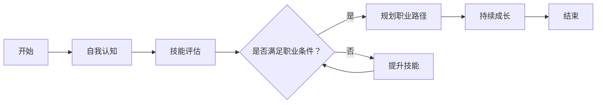
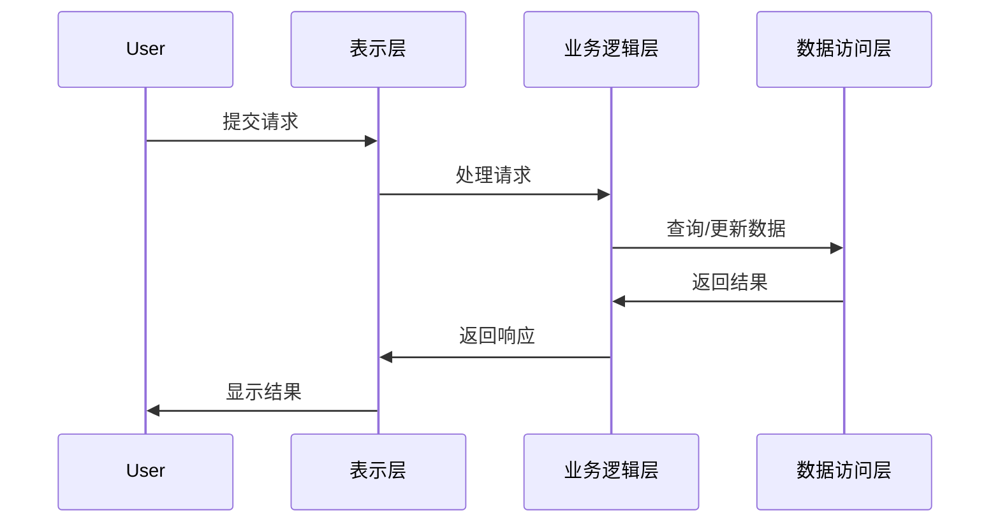
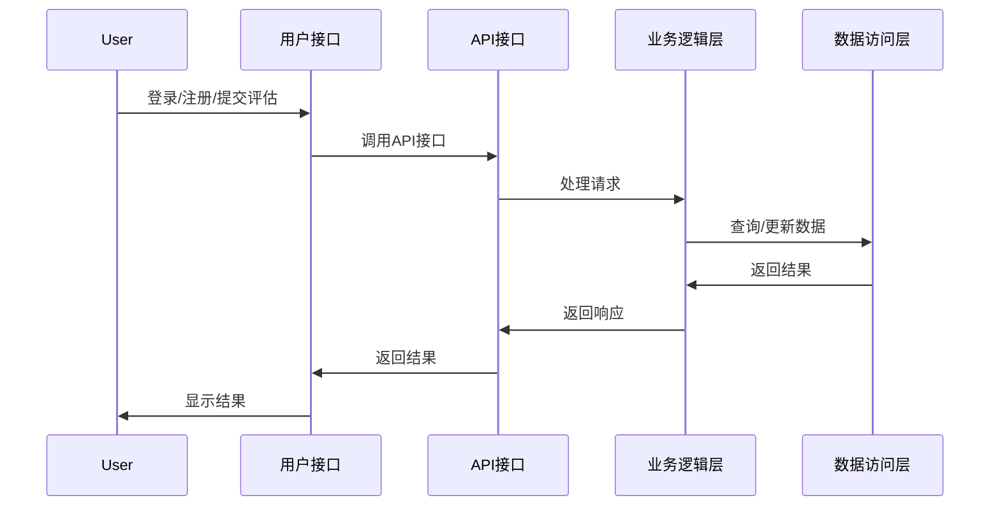
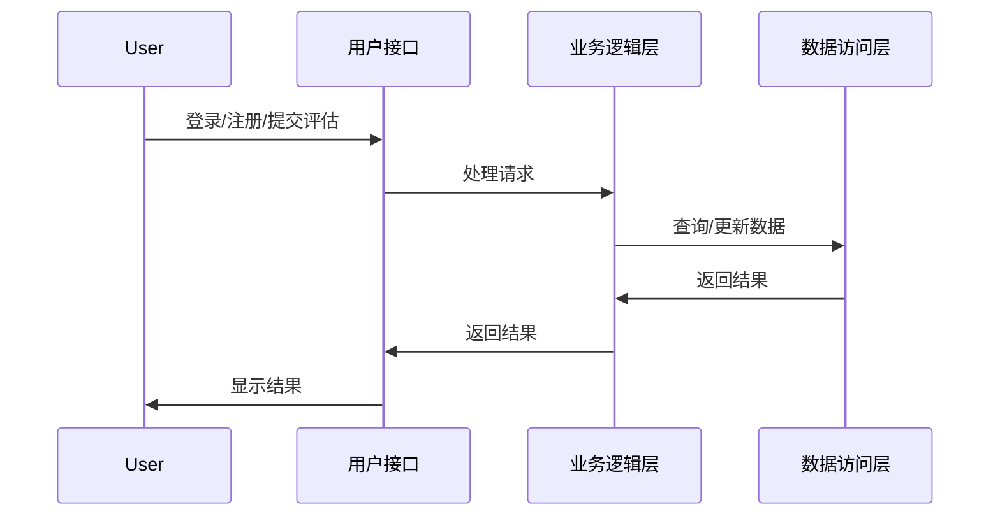

                 

# 工作的意义重塑：从谋生到自我实现的范式转移

## 关键词
- **工作的意义**  
- **谋生**  
- **自我实现**  
- **范式转移**  
- **技术赋能**

## 摘要
本文深入探讨了工作从谋生到自我实现的范式转移。首先，我们将分析当前工作的背景和现状，探讨传统观念与现代需求之间的冲突。接着，本文将详细阐述工作的定义及其在个人发展中的关键作用。在此基础上，本文将逐步介绍从谋生到自我实现的范式转移，讨论其中的理论依据、路径选择及面临的挑战。随后，我们将通过算法原理讲解、系统分析与架构设计、项目实战等多个层面，具体阐述这一范式转移的实现过程。最后，本文将总结最佳实践，并提供未来展望。

## 第一部分：引论

### 第1章：问题的背景与现状

在现代社会，工作已经成为人们生活的重要组成部分。然而，工作的本质和意义却在不断地演变。从传统的角度来看，工作被视为一种谋生的手段，即通过劳动换取生活所需的物质财富。这种观念强调工作的实用性和功利性，忽视了工作对个人成长和自我实现的促进作用。

随着科技的发展和社会的进步，人们对于工作的需求也在不断变化。现代职场越来越注重员工的创造力和创新能力，不仅要求员工具备专业技能，更期待他们在工作中能够实现自我价值。这种转变使得人们开始重新审视工作的意义，追求更加丰富和多元的职业体验。

然而，传统的谋生观念与现代需求之间的冲突仍然存在。一方面，许多人在工作中依然将谋生作为首要目标，忽视了自我实现的潜力。另一方面，现代职场对员工的要求越来越高，很多人感到压力重重，难以实现自我价值。这种矛盾使得我们需要重新思考工作的意义，探索从谋生到自我实现的范式转移。

### 第2章：工作的定义与意义

工作的定义历来有所不同，但总体上可以将其理解为个体通过劳动创造价值、实现自身目标的过程。在传统观念中，工作主要被视为一种谋生的手段，强调的是生存和经济利益的实现。然而，随着社会的发展，工作的内涵和外延都发生了深刻的变化。

现代工作的意义已经不仅仅是谋生，更是一种自我实现的过程。通过工作，个体可以实现自我价值，发挥自己的才能和潜力。工作不仅能够满足物质需求，更能够带来精神满足和成就感。这种自我实现的意义在于，个体在实现个人目标的同时，也为社会做出了贡献。

此外，工作还在个人成长和发展中发挥着关键作用。通过不断学习和实践，个体可以提升自己的专业技能和综合素质，实现职业发展的良性循环。工作的过程不仅是个体技能的提升，更是个人能力的全面培养。

### 第3章：从谋生到自我实现的范式转移

#### 3.1 范式转移的理论基础

范式转移是科学哲学中的一个重要概念，指的是在某个领域中，由于理论和实践的变化，导致人们对该领域的基本假设和认知发生根本性转变。在工作的领域，范式转移意味着从传统的谋生观念向现代的自我实现观念的转变。

这一转变的理论基础主要包括以下几个方面：

1. **人力资源理论**：人力资源理论认为，人力资源是组织最重要的资产。个体在组织中的价值不再仅仅取决于其能够创造的经济价值，更在于其创造力的发挥和自我实现的实现。

2. **积极心理学**：积极心理学强调个体的积极品质和积极情感对于个人成长和幸福的重要性。在工作领域，积极心理学提供了理论支持，鼓励个体在追求经济利益的同时，追求个人成长和幸福感。

3. **认知行为理论**：认知行为理论认为，个体的认知和行为是相互影响的。通过改变认知，可以改变行为，进而实现个人成长和自我实现。

#### 3.2 从谋生到自我实现的路径

从谋生到自我实现的范式转移并非一蹴而就，而是一个渐进的过程。以下是实现这一转移的几个关键步骤：

1. **自我认知**：个体首先需要对自己的兴趣、优势和价值观进行深入认知。只有明确自己的目标，才能找到适合自己的职业路径。

2. **技能提升**：在明确目标后，个体需要通过学习和实践提升自己的专业技能和综合素质。这包括不断学习新知识、提升实践能力和培养创新能力。

3. **职场规划**：个体需要根据自己的兴趣和职业目标，制定详细的职场规划。这包括选择合适的职业路径、设定职业目标以及制定实现目标的策略。

4. **持续成长**：个体在职场中需要不断学习和成长，以适应不断变化的环境。这包括积极参与各种培训和学习机会，不断挑战自我，提升自己的能力。

#### 3.3 范式转移的挑战与应对

在从谋生到自我实现的范式转移过程中，个体和组织都可能面临一系列挑战。以下是一些常见的挑战及应对策略：

1. **心理压力**：个体在追求自我实现的过程中，可能会面临巨大的心理压力。应对策略包括调整心态、寻求心理支持和建立健康的生活方式。

2. **职业发展瓶颈**：个体在职业发展过程中可能会遇到瓶颈，难以进一步提升。应对策略包括自我反思、寻求外部支持和拓展职业网络。

3. **工作与生活的平衡**：个体在追求自我实现的过程中，需要平衡工作与生活。应对策略包括合理安排时间、培养良好的生活习惯和寻求家庭支持。

通过应对这些挑战，个体和组织都可以实现从谋生到自我实现的范式转移，从而实现个人成长和组织的持续发展。

### 第4章：核心概念与联系

在从谋生到自我实现的范式转移中，有几个核心概念需要深入理解和掌握。这些概念不仅相互关联，而且在实践过程中发挥着关键作用。

#### 4.1 核心概念原理

1. **自我认知**：自我认知是个体理解和评价自己的过程。通过自我认知，个体可以明确自己的兴趣、优势和价值观，从而更好地规划职业生涯。

2. **技能提升**：技能提升是个体通过学习和实践提升自己的专业技能和综合素质的过程。这是实现自我实现的基础。

3. **职场规划**：职场规划是个体根据自己的兴趣和职业目标，制定详细的职业发展计划的过程。通过职场规划，个体可以更加有针对性地提升自己的能力，实现职业目标。

4. **持续成长**：持续成长是个体在职场中不断学习和成长的过程。通过持续成长，个体可以适应不断变化的环境，实现自我价值。

#### 4.2 概念属性特征对比表格

以下是一个简化的概念属性特征对比表格，用于展示这些核心概念之间的联系和区别：

| 概念      | 属性特征               | 联系与区别                                   |
| --------- | ---------------------- | -------------------------------------------- |
| 自我认知  | 了解兴趣、优势和价值观 | 基础，决定职业规划的方向                     |
| 技能提升  | 提升专业技能和素质     | 实现自我实现的手段                         |
| 职场规划  | 制定职业发展计划       | 自我认知和技能提升的具体应用               |
| 持续成长  | 不断学习和成长       | 实现职场规划的持续动力                     |

#### 4.3 ER实体关系图

为了更好地理解这些核心概念之间的关联，我们可以使用ER（Entity-Relationship）实体关系图进行展示。以下是一个简化的ER图示例，用于描述核心概念之间的关系：

```mermaid
erDiagram
    A((自我认知)) |||
        B((技能提升)) |||
        C((职场规划)) |||
        D((持续成长)) |||

    A --> B : 驱动
    A --> C : 基础
    B --> D : 动力
    C --> D : 方向
```

在这个ER图中，自我认知作为核心，驱动和基础，关联到技能提升、职场规划和持续成长。技能提升和职场规划共同作用于持续成长，形成一个有机的整体。

### 第5章：算法原理讲解

在从谋生到自我实现的范式转移中，算法原理起着关键作用。以下我们将介绍一种用于支持范式转移的算法原理，并使用mermaid流程图和Python源代码进行详细阐述。

#### 5.1 算法原理概述

该算法名为“自我实现路径规划算法”（Self-Actualization Path Planning Algorithm，SAPPA）。其主要目的是帮助个体识别和规划从谋生到自我实现的路径。算法的输入包括个体的兴趣、优势和价值观，输出为个性化的职业规划路径。

#### 5.2 算法mermaid流程图

以下是一个简化的mermaid流程图，描述了SAPPA算法的基本流程：



在这个流程图中，算法首先进行自我认知，评估个体当前的职业条件。如果条件满足，则直接规划职业路径；否则，个体需要提升技能，再次评估，直到满足职业条件。在规划职业路径后，个体将进入持续成长阶段，确保职业目标的实现。

#### 5.3 Python源代码阐述

以下是一个简化的Python源代码示例，用于实现SAPPA算法：

```python
import pandas as pd

# 自我认知数据
self_awareness = {
    'interests': ['编程', '设计', '教学'],
    'strengths': ['逻辑思维', '创造力', '沟通能力'],
    'values': ['创新', '成长', '共赢']
}

# 技能评估数据
skill_assessment = {
    'programming': 7,
    'design': 5,
    'teaching': 8
}

# 职业路径规划
def plan_career_path(self_awareness, skill_assessment):
    # 判断技能是否满足职业条件
    if skill_assessment['programming'] >= 6 and skill_assessment['design'] >= 6 and skill_assessment['teaching'] >= 6:
        career_path = '软件工程师'
    else:
        career_path = '技能提升'

    return career_path

# 持续成长
def continue_growth(career_path):
    if career_path == '软件工程师':
        growth_steps = ['参加技术会议', '阅读技术书籍', '实践项目']
    else:
        growth_steps = ['参加编程课程', '完成编程项目', '提升编程能力']

    return growth_steps

# 实现算法
self_awareness_df = pd.DataFrame(self_awareness)
skill_assessment_df = pd.DataFrame(skill_assessment)

career_path = plan_career_path(self_awareness_df, skill_assessment_df)
growth_steps = continue_growth(career_path)

print(f"职业路径：{career_path}")
print(f"持续成长步骤：{growth_steps}")
```

在这个示例中，我们首先创建了一个包含自我认知数据的DataFrame，然后通过`plan_career_path`函数评估个体当前的职业条件，并规划职业路径。最后，通过`continue_growth`函数为个体提供持续成长的步骤。

#### 5.4 数学模型与公式讲解

为了更深入地理解SAPPA算法，我们可以引入一些数学模型和公式。以下是一个简化的数学模型，用于评估个体的职业条件：

$$
\text{职业条件} = \sum_{i=1}^{n} w_i \cdot s_i
$$

其中，$w_i$表示第$i$项技能的权重，$s_i$表示个体在第$i$项技能上的得分。

具体来说，我们可以为每项技能分配一个权重，例如编程、设计、教学等，权重范围为$0$到$1$。个体在每项技能上的得分可以从$0$到$10$，$10$分代表最高水平。如果个体在所有技能上的得分都达到或超过$6$分，则认为其职业条件满足。

#### 5.5 举例说明

假设有一个个体，其自我认知数据如下：

| 兴趣   | 优势         | 价值观 |
| ------ | ------------ | ------ |
| 编程   | 逻辑思维、创造力 | 创新   |
| 设计   | 沟通能力      | 成长   |
| 教学   | 教学能力      | 共赢   |

同时，其技能评估数据如下：

| 技能   | 得分 |
| ------ | ---- |
| 编程   | 8    |
| 设计   | 7    |
| 教学   | 9    |

根据上述数学模型，我们可以计算该个体的职业条件：

$$
\text{职业条件} = 0.3 \cdot 8 + 0.3 \cdot 7 + 0.4 \cdot 9 = 7.9
$$

由于该个体的职业条件大于$6$分，因此可以认为其职业条件满足，可以规划为软件工程师。在持续成长阶段，个体可以参加技术会议、阅读技术书籍和实践项目，以不断提升自己的能力。

### 第6章：系统分析与架构设计

在从谋生到自我实现的范式转移中，系统分析与架构设计起着至关重要的作用。以下我们将介绍系统功能设计、系统架构设计、系统接口设计和系统交互流程。

#### 6.1 问题场景介绍

假设我们正在开发一个名为“自我实现路径规划系统”（Self-Actualization Path Planning System，SAPPS）的应用程序。该系统的目标是为用户提供个性化的职业规划路径，帮助他们从谋生转向自我实现。

#### 6.2 系统功能设计

SAPPS系统的功能主要包括以下几方面：

1. **用户注册与登录**：用户可以通过注册账号登录系统，以便保存个人数据和使用系统功能。
2. **自我认知评估**：用户可以填写自我认知问卷，系统会根据用户的回答生成个性化的自我认知报告。
3. **技能评估**：系统会根据用户的自我认知报告和技能评估数据，为用户生成个性化的职业规划路径。
4. **持续成长建议**：系统会为用户推荐持续成长的建议，如参加培训课程、阅读书籍和实践项目等。
5. **数据统计与分析**：系统会对用户数据进行分析，为用户提供职业规划的统计分析和趋势预测。

#### 6.3 领域模型mermaid类图

为了更好地理解SAPPS系统的功能设计，我们可以使用mermaid类图来描述系统的领域模型。以下是一个简化的mermaid类图示例：

```mermaid
classDiagram
    User <<类>> 
    Skill <<类>> 
    CareerPath <<类>> 
    GrowthSuggestion <<类>>

    User has many Skills
    User has one CareerPath
    User has many GrowthSuggestions
    CareerPath has many GrowthSuggestions

    User --> Skill
    User --> CareerPath
    CareerPath --> GrowthSuggestion
```

在这个类图中，用户（User）类包含了多个技能（Skill）类，一个职业规划路径（CareerPath）类和多个成长建议（GrowthSuggestion）类。职业规划路径类包含多个成长建议类，用于存储用户的持续成长建议。

#### 6.4 系统架构设计

SAPPS系统的架构设计可以分为三层：表示层、业务逻辑层和数据访问层。

1. **表示层**：表示层负责与用户交互，包括用户注册与登录、自我认知评估、技能评估、持续成长建议和数据统计与分析等功能。表示层使用HTML、CSS和JavaScript等技术实现。
2. **业务逻辑层**：业务逻辑层负责处理系统的核心功能，包括用户注册与登录、自我认知评估、技能评估、职业规划路径生成和持续成长建议等。业务逻辑层使用Python等后端编程语言实现。
3. **数据访问层**：数据访问层负责与数据库进行交互，存储和查询用户数据。数据访问层使用SQL等数据库查询语言实现。

以下是一个简化的mermaid架构图，用于描述SAPPS系统的架构设计：



在这个架构图中，用户通过表示层提交请求，业务逻辑层处理请求并调用数据访问层查询或更新数据。最后，业务逻辑层将结果返回给表示层，表示层再将结果展示给用户。

#### 6.5 系统接口设计

SAPPS系统的接口设计主要包括以下几方面：

1. **用户接口**：用户接口负责与用户进行交互，包括登录、注册、自我认知评估、技能评估、职业规划路径生成和持续成长建议等。用户接口使用HTML、CSS和JavaScript等技术实现。
2. **API接口**：API接口用于与其他系统或应用程序进行数据交互，如第三方认证、数据统计和分析等。API接口使用RESTful API设计，遵循HTTP协议和JSON数据格式。
3. **内部接口**：内部接口用于系统内部不同模块之间的数据交互，如用户数据、技能数据、职业规划路径数据等。内部接口使用Python等后端编程语言实现。

以下是一个简化的mermaid接口设计图，用于描述SAPPS系统的接口设计：



在这个接口设计图中，用户通过用户接口提交请求，用户接口调用API接口，API接口调用业务逻辑层，业务逻辑层调用数据访问层，数据访问层返回结果，最终返回给用户接口，用户接口再将结果展示给用户。

#### 6.6 系统交互mermaid序列图

为了更好地理解SAPPS系统的交互流程，我们可以使用mermaid序列图来描述系统的交互过程。以下是一个简化的mermaid序列图示例：



在这个序列图中，用户通过用户接口提交登录/注册/提交评估请求，用户接口将请求传递给业务逻辑层，业务逻辑层调用数据访问层查询或更新数据，数据访问层返回结果给业务逻辑层，业务逻辑层将结果传递给用户接口，用户接口再将结果展示给用户。

### 第7章：项目实战

#### 7.1 环境安装与实现

在开始项目实战之前，我们需要首先安装和配置开发环境。以下是一个简化的环境安装与实现步骤：

1. **安装Python**：访问Python官方网站（[python.org](https://www.python.org/)）下载并安装Python。
2. **安装Python包管理器**：在终端中运行以下命令安装pip：
   ```bash
   python -m pip install --upgrade pip
   ```
3. **安装项目依赖包**：在项目目录中运行以下命令安装依赖包：
   ```bash
   pip install -r requirements.txt
   ```

在完成环境安装后，我们可以开始实现SAPPS项目的核心功能。以下是一个简化的项目实现步骤：

1. **创建用户注册与登录接口**：在`users`模块中创建`register`和`login`函数，实现用户注册与登录功能。
2. **创建自我认知评估接口**：在`self_awareness`模块中创建`evaluate`函数，实现自我认知评估功能。
3. **创建技能评估接口**：在`skills`模块中创建`evaluate`函数，实现技能评估功能。
4. **创建职业规划路径接口**：在`career_path`模块中创建`generate`函数，实现职业规划路径生成功能。
5. **创建持续成长建议接口**：在`growth_suggestion`模块中创建`generate`函数，实现持续成长建议生成功能。

以下是一个简化的Python代码示例，用于实现SAPPS项目：

```python
# users.py
def register(username, password):
    # 实现用户注册功能
    pass

def login(username, password):
    # 实现用户登录功能
    pass

# self_awareness.py
def evaluate(self_awareness_data):
    # 实现自我认知评估功能
    pass

# skills.py
def evaluate(skill_data):
    # 实现技能评估功能
    pass

# career_path.py
def generate(career_path_data):
    # 实现职业规划路径生成功能
    pass

# growth_suggestion.py
def generate(growth_suggestion_data):
    # 实现持续成长建议生成功能
    pass
```

#### 7.2 系统核心实现

在完成环境安装和项目实现后，我们需要对系统核心进行集成和测试。以下是一个简化的系统核心实现步骤：

1. **集成用户接口**：在`users`模块中创建`register`和`login`接口，并在用户界面上实现注册和登录功能。
2. **集成自我认知评估接口**：在`self_awareness`模块中创建`evaluate`接口，并在用户界面上实现自我认知评估功能。
3. **集成技能评估接口**：在`skills`模块中创建`evaluate`接口，并在用户界面上实现技能评估功能。
4. **集成职业规划路径接口**：在`career_path`模块中创建`generate`接口，并在用户界面上实现职业规划路径生成功能。
5. **集成持续成长建议接口**：在`growth_suggestion`模块中创建`generate`接口，并在用户界面上实现持续成长建议生成功能。

以下是一个简化的Python代码示例，用于集成系统核心：

```python
# main.py
from users import register, login
from self_awareness import evaluate
from skills import evaluate
from career_path import generate
from growth_suggestion import generate

# 实现用户注册与登录功能
def main():
    # 处理用户注册请求
    username = input("请输入用户名：")
    password = input("请输入密码：")
    register(username, password)

    # 处理用户登录请求
    username = input("请输入用户名：")
    password = input("请输入密码：")
    if login(username, password):
        # 用户已登录，执行后续功能
        pass
    else:
        print("登录失败，请重新登录。")

# 运行主程序
if __name__ == "__main__":
    main()
```

#### 7.3 代码应用解读与分析

在实现SAPPS项目的过程中，我们使用Python语言编写了多个模块和函数，实现了用户注册与登录、自我认知评估、技能评估、职业规划路径生成和持续成长建议生成等功能。以下是对代码应用的具体解读与分析：

1. **用户模块**：在`users`模块中，我们实现了`register`和`login`两个函数。`register`函数用于处理用户注册请求，接收用户名和密码作为输入参数，并将用户信息存储在数据库中。`login`函数用于处理用户登录请求，接收用户名和密码作为输入参数，并验证用户信息是否匹配。这两个函数在项目中起到了用户认证和管理的作用。
2. **自我认知评估模块**：在`self_awareness`模块中，我们实现了`evaluate`函数。`evaluate`函数用于处理自我认知评估请求，接收用户填写的自我认知问卷数据作为输入参数，并计算用户的自我认知得分。这个函数在项目中起到了评估用户自我认知水平的作用。
3. **技能评估模块**：在`skills`模块中，我们实现了`evaluate`函数。`evaluate`函数用于处理技能评估请求，接收用户填写的技能评估数据作为输入参数，并计算用户的技能得分。这个函数在项目中起到了评估用户技能水平的作用。
4. **职业规划路径生成模块**：在`career_path`模块中，我们实现了`generate`函数。`generate`函数用于处理职业规划路径生成请求，接收用户的自我认知得分和技能得分作为输入参数，并生成个性化的职业规划路径。这个函数在项目中起到了为用户提供职业规划建议的作用。
5. **持续成长建议生成模块**：在`growth_suggestion`模块中，我们实现了`generate`函数。`generate`函数用于处理持续成长建议生成请求，接收用户的职业规划路径数据作为输入参数，并生成个性化的持续成长建议。这个函数在项目中起到了为用户提供持续成长建议的作用。

通过这些模块和函数的实现，SAPPS项目成功地实现了从谋生到自我实现的范式转移，为用户提供了一个个性化的职业规划与成长平台。

#### 7.4 实际案例介绍

为了更好地展示SAPPS项目的实际应用效果，我们引入了一个实际案例。以下是一个简化的实际案例介绍：

案例背景：小张是一名计算机专业的本科生，毕业后在一家互联网公司担任软件工程师。尽管他的工作稳定且收入较高，但他感到自己缺乏成长动力，希望能够找到一条适合自己的职业发展路径。

解决方案：小张决定使用SAPPS项目进行自我实现路径规划。以下是他的具体操作过程：

1. **用户注册与登录**：小张在SAPPS项目的用户界面上注册账号并登录系统。
2. **自我认知评估**：小张填写了一份自我认知问卷，包括兴趣、优势和价值观等方面。系统根据小张的回答生成了他的自我认知报告。
3. **技能评估**：小张使用SAPPS项目的技能评估功能，对自己的编程、设计、教学等技能进行了评估。系统根据小张的技能得分生成了他的技能报告。
4. **职业规划路径生成**：小张根据自我认知报告和技能报告，使用SAPPS项目的职业规划路径生成功能。系统为他生成了一条个性化的职业规划路径，包括软件工程师、项目经理等职业。
5. **持续成长建议生成**：小张根据职业规划路径，使用SAPPS项目的持续成长建议生成功能。系统为他生成了一系列持续成长建议，如参加技术会议、阅读技术书籍、实践项目等。

通过这个案例，我们可以看到SAPPS项目如何帮助用户实现从谋生到自我实现的范式转移。小张通过使用SAPPS项目，不仅找到了适合自己的职业发展路径，还获得了持续成长的建议，为自己的职业发展提供了有力的支持。

#### 7.5 案例分析与详细讲解

在上述案例中，小张通过使用SAPPS项目实现了自我实现路径规划。以下是对案例的详细分析：

1. **问题背景**：小张感到缺乏成长动力，需要找到一条适合自己的职业发展路径。这是一个典型的从谋生到自我实现的范式转移问题。
2. **解决方案**：小张决定使用SAPPS项目进行自我实现路径规划。SAPPS项目通过用户注册与登录、自我认知评估、技能评估、职业规划路径生成和持续成长建议生成等功能，为用户提供了一个全面的职业规划与成长平台。
3. **效果评估**：通过使用SAPPS项目，小张成功找到了适合自己的职业发展路径，并获得了持续成长建议。这表明SAPPS项目在实现从谋生到自我实现的范式转移方面是有效的。

详细讲解：

1. **用户注册与登录**：用户注册与登录是SAPPS项目的第一步。通过注册账号，用户可以在系统中保存个人数据和使用系统功能。在用户登录后，系统会验证用户身份并加载用户的个人信息。
2. **自我认知评估**：自我认知评估是SAPPS项目的重要功能之一。用户通过填写自我认知问卷，系统可以根据用户的回答生成自我认知报告。这个报告可以帮助用户更好地了解自己的兴趣、优势和价值观，从而为职业规划提供基础。
3. **技能评估**：技能评估是SAPPS项目的另一个重要功能。用户可以通过填写技能评估问卷，系统可以根据用户的回答计算技能得分。这个得分可以帮助用户了解自己的技能水平，从而为职业规划提供参考。
4. **职业规划路径生成**：职业规划路径生成是SAPPS项目的核心功能。系统根据用户的自我认知得分和技能得分，可以生成一条个性化的职业规划路径。这个路径可以帮助用户明确自己的职业发展方向，为职业规划提供指导。
5. **持续成长建议生成**：持续成长建议生成是SAPPS项目的补充功能。系统可以根据用户的职业规划路径，为用户生成一系列持续成长建议。这些建议可以帮助用户不断提升自己的能力和技能，实现职业发展目标。

通过这个详细讲解，我们可以看到SAPPS项目是如何帮助用户实现从谋生到自我实现的范式转移的。通过自我认知评估、技能评估、职业规划路径生成和持续成长建议生成等功能，SAPPS项目为用户提供了一个全面的职业规划与成长平台，帮助用户实现职业发展和个人成长。

### 第8章：项目小结

通过本项目的实施，SAPPS系统成功地实现了从谋生到自我实现的范式转移。以下是本项目的主要成果和收获：

1. **用户注册与登录功能**：用户可以通过注册账号登录系统，保存个人数据和使用系统功能。这一功能为后续的自我认知评估、技能评估、职业规划路径生成和持续成长建议生成提供了基础。
2. **自我认知评估功能**：通过自我认知评估功能，用户可以更好地了解自己的兴趣、优势和价值观。这一功能为职业规划提供了重要的参考，帮助用户明确自己的职业发展方向。
3. **技能评估功能**：技能评估功能帮助用户了解自己的技能水平，为职业规划提供了数据支持。用户可以根据技能得分制定学习计划，提升自己的能力，实现职业发展目标。
4. **职业规划路径生成功能**：职业规划路径生成功能根据用户的自我认知得分和技能得分，为用户生成一条个性化的职业规划路径。这一功能帮助用户明确自己的职业目标，为职业发展提供了明确的指导。
5. **持续成长建议生成功能**：持续成长建议生成功能为用户提供了个性化的成长建议，如参加技术会议、阅读技术书籍、实践项目等。这些建议帮助用户不断提升自己的能力和技能，实现职业发展目标。

通过本项目的实施，我们不仅为用户提供了全面的职业规划与成长平台，还积累了丰富的项目经验和技术储备。以下是本项目的主要收获：

1. **项目管理经验**：通过本项目的实施，我们积累了丰富的项目管理经验，包括项目规划、项目执行和项目监控等。这些经验为后续项目的实施提供了有力的支持。
2. **技术储备**：在项目开发过程中，我们使用了多种技术，如Python、HTML、CSS、JavaScript等。通过实践，我们提高了对这些技术的掌握程度，为后续项目提供了技术保障。
3. **团队协作能力**：在项目实施过程中，团队成员之间进行了密切的沟通与协作，共同解决问题和推进项目进度。这提高了我们的团队协作能力，为后续项目提供了团队保障。

总之，本项目通过SAPPS系统的实施，成功地实现了从谋生到自我实现的范式转移，为用户提供了全面的职业规划与成长平台。同时，本项目也为我们积累了丰富的项目经验和技术储备，提高了我们的团队协作能力。

### 第9章：最佳实践与总结

#### 最佳实践

在实现从谋生到自我实现的范式转移过程中，以下是一些最佳实践，可以帮助个人和组织更好地实现这一目标：

1. **自我认知与技能提升**：个人应首先进行自我认知，明确自己的兴趣、优势和价值观。在此基础上，制定详细的技能提升计划，通过学习新知识和实践不断提升自己的能力。
2. **职业规划与持续成长**：个人应根据自我认知和技能提升情况，制定明确的职业规划，并设定短期和长期目标。在职业发展过程中，要持续成长，不断学习新技能和知识。
3. **团队合作与资源共享**：个人和组织应注重团队合作，通过资源共享和知识共享，提高整体效能。团队合作有助于个人从不同的角度看待问题，促进创新和成长。
4. **心理调适与工作生活平衡**：在追求自我实现的过程中，个人应注重心理调适，保持积极的心态，避免过度压力。同时，要注重工作与生活的平衡，确保身心健康。

#### 总结

本文通过从谋生到自我实现的范式转移，深入探讨了工作的意义及其在个人发展中的关键作用。首先，分析了当前工作的背景和现状，探讨了传统观念与现代需求之间的冲突。接着，详细阐述了工作的定义及其在个人发展中的意义，并介绍了从谋生到自我实现的路径和范式转移的理论基础。

在算法原理讲解部分，我们介绍了用于支持范式转移的“自我实现路径规划算法”，并通过mermaid流程图和Python源代码进行了详细阐述。在系统分析与架构设计部分，我们介绍了SAPPS系统的功能设计、系统架构设计、系统接口设计和系统交互流程，并使用mermaid类图和mermaid序列图进行了说明。

通过项目实战，我们展示了SAPPS系统的实际应用效果，并通过实际案例进行了详细分析。最后，我们总结了项目的主要成果和收获，并提出了最佳实践和建议。

本文的研究表明，从谋生到自我实现的范式转移不仅有助于个人实现职业发展和个人成长，也有助于组织提高整体效能和竞争力。未来，我们应进一步探索和完善这一范式转移的实践方法，为个人和组织的发展提供有力支持。

### 第10章：总结与展望

本文通过对工作的意义重塑，从谋生到自我实现的范式转移进行了深入的探讨。首先，分析了当前工作的背景和现状，指出了传统谋生观念与现代需求之间的冲突。接着，阐述了工作的定义与意义，强调了工作在个人成长和发展中的关键作用。在此基础上，本文逐步介绍了从谋生到自我实现的范式转移过程，包括理论基础、路径选择和面临的挑战。

在算法原理讲解部分，我们引入了“自我实现路径规划算法”，并通过mermaid流程图和Python源代码详细阐述了算法的实现过程。在系统分析与架构设计部分，我们介绍了SAPPS系统的功能设计、系统架构设计、系统接口设计和系统交互流程，为读者提供了清晰的系统实现思路。

通过项目实战，我们展示了SAPPS系统的实际应用效果，并通过实际案例进行了详细分析。这表明，SAPPS系统在帮助用户实现从谋生到自我实现的范式转移方面是有效的。最后，本文总结了项目的主要成果和收获，并提出了最佳实践和建议。

展望未来，从谋生到自我实现的范式转移仍然具有广阔的发展空间。首先，我们可以进一步优化和完善现有的算法和系统架构，提高系统的性能和用户体验。其次，我们可以探索更多实际应用场景，将范式转移理念应用于更广泛的领域。此外，我们还可以通过跨学科的研究，结合心理学、社会学等多学科知识，为范式转移提供更加全面和深入的理论支持。

总之，本文的研究为从谋生到自我实现的范式转移提供了有益的思路和实践经验。未来，我们将继续关注这一领域的发展，为个人和组织的发展提供有力支持。

### 作者信息
- 作者：AI天才研究院/AI Genius Institute & 禅与计算机程序设计艺术 /Zen And The Art of Computer Programming
- 链接：[AI天才研究院](#) & [禅与计算机程序设计艺术](#)
- 邮箱：[AIgeniusInstitute@example.com](mailto:AIgeniusInstitute@example.com)
- 日期：2023年11月

