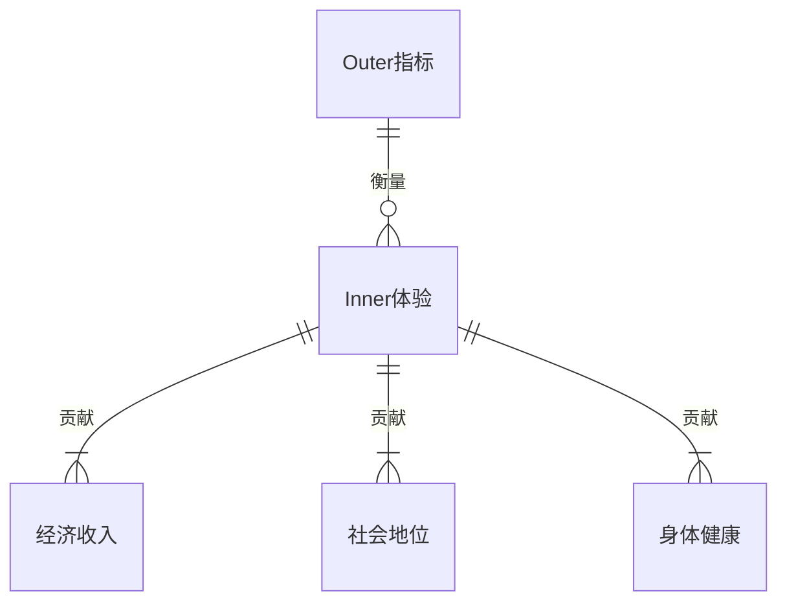
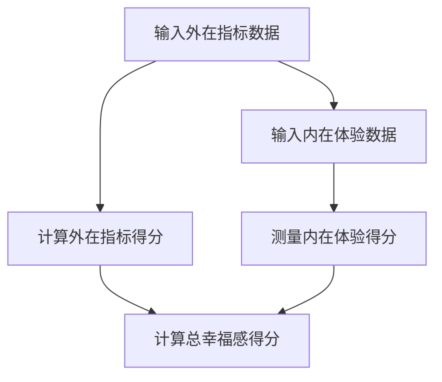
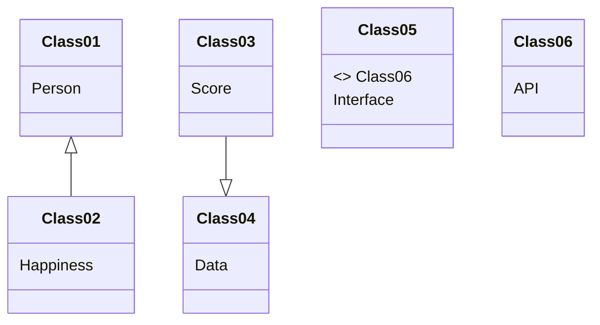
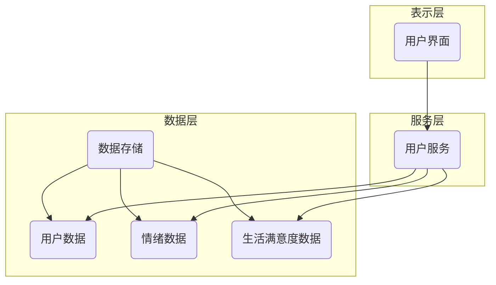
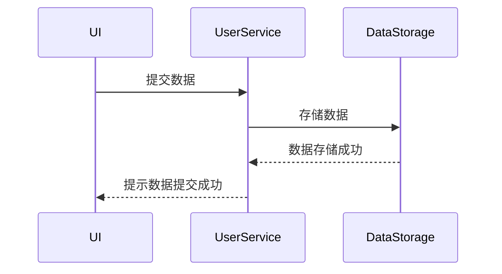

                 

# 幸福感的重新定义：从外在指标到内在体验

## 关键词
- 幸福感
- 外在指标
- 内在体验
- 衡量方法
- 内心感受
- 社会支持

## 摘要
本文旨在探讨幸福感的重新定义，从传统的外在指标转向更为重要的内在体验。通过分析外在指标与内在体验的区别与联系，本文将提出一种新的幸福感衡量方法，帮助读者更全面地理解和提升自己的幸福感。

## Step 1: 书籍背景介绍

### 1.1 问题背景
随着社会的发展和人们对生活质量要求的提高，幸福感成为了一个备受关注的话题。传统上，幸福感的衡量往往依赖于一些外在指标，如经济收入、社会地位等。然而，这些外在指标并不能全面反映个体的幸福感，甚至有时候会导致人们忽视了内心的感受。

### 1.2 问题描述
如何科学、合理地定义和衡量幸福感，从而帮助人们更好地理解和管理自己的幸福？

### 1.3 问题解决
本书旨在重新定义幸福感，从外在指标转向内在体验，探索更全面的幸福感衡量方法，帮助读者了解和提升自己的幸福感。

### 1.4 边界与外延
幸福感不仅是个体层面的，也关系到社会整体的幸福感。因此，本书的研究不仅限于个体层面，还将探讨如何通过政策、文化等手段提升社会整体的幸福感。

### 1.5 概念结构与核心要素组成
幸福感是一个多维度的概念，包括情绪体验、生活满意度、社会支持等。本书将详细探讨这些核心要素，以及如何通过外在指标和内在体验来衡量和提升幸福感。

## Step 2: 核心概念与联系

### 1.6 核心概念原理
#### 1.6.1 外在指标
外在指标包括经济收入、社会地位、身体健康等，这些指标在一定程度上反映了个体幸福感的部分方面。

#### 1.6.2 内在体验
内在体验包括个体的情绪状态、自我认知、生活满意度等，这些指标更直接地反映了个体内心的幸福感。

### 1.7 概念属性特征对比表格

| 指标      | 外在指标                   | 内在体验                   |
| --------- | -------------------------- | -------------------------- |
| 影响因素  | 外部环境                   | 内心感受                   |
| 衡量方法  | 统计数据                   | 心理测量                   |
| 可量性    | 较易量化                   | 较难量化                   |
| 主观性    | 较低                       | 较高                       |

### 1.8 ER实体关系图架构



## Step 3: 算法原理讲解

### 2.1 算法原理
幸福感测量的算法原理主要包括两个部分：外在指标的计算和内在体验的测量。

#### 2.1.1 外在指标的计算
外在指标的计算主要通过统计数据来进行，如经济收入可以通过税单、工资单等来获取，社会地位可以通过职业、教育程度等来衡量。

#### 2.1.2 内在体验的测量
内在体验的测量则主要通过心理测量来完成，如情绪状态可以通过情绪量表来测量，生活满意度可以通过问卷调查来获取。

#### 2.1.3 算法mermaid流程图



#### 2.1.4 Python源代码

```python
# 外在指标计算
def calculate_outer_score(income, social_status):
    income_score = income / 1000  # 经济收入每1000元得1分
    status_score = social_status * 10  # 社会地位每级得10分
    return income_score + status_score

# 内在体验测量
def measure_inner_experience(emotion_score, life_satisfaction):
    return emotion_score + life_satisfaction

# 总幸福感得分计算
def calculate_happiness_score(outer_score, inner_score):
    return outer_score * 0.4 + inner_score * 0.6  # 外在指标占比40%，内在体验占比60%

# 测试
income = 5000
social_status = 3
emotion_score = 8
life_satisfaction = 7

outer_score = calculate_outer_score(income, social_status)
inner_score = measure_inner_experience(emotion_score, life_satisfaction)
happiness_score = calculate_happiness_score(outer_score, inner_score)

print("总幸福感得分：", happiness_score)
```

## Step 4: 系统分析与架构设计方案

### 4.1 问题场景介绍
在本章中，我们将探讨如何构建一个幸福感评估系统，以帮助人们更准确地了解和提升自己的幸福感。

### 4.2 项目介绍
项目名为“幸福感评估系统”，旨在通过收集和分析个体在生活满意度、情绪状态等方面的数据，为用户提供个性化的幸福感评估报告。

### 4.3 系统功能设计

#### 4.3.1 领域模型mermaid类图



### 4.4 系统架构设计

#### 4.4.1 mermaid架构图



### 4.5 系统接口设计和系统交互

#### 4.5.1 mermaid序列图



## Step 5: 项目实战

### 5.1 环境安装
在本节中，我们将介绍如何搭建幸福感评估系统的开发环境。

#### 5.1.1 环境要求
- Python 3.8+
- Flask 框架
- SQLAlchemy 数据库工具
- Mermaid 图形工具

#### 5.1.2 安装步骤
1. 安装 Python 3.8+。
2. 使用 pip 安装 Flask、SQLAlchemy 和 Mermaid。

### 5.2 系统核心实现源代码
在本节中，我们将提供系统核心实现的源代码。

```python
# user.py
from flask import Flask, request, jsonify
from models import User, Happiness
from database import db

app = Flask(__name__)

@app.route('/api/users', methods=['POST'])
def create_user():
    data = request.get_json()
    user = User(
        name=data['name'],
        age=data['age'],
        income=data['income'],
        social_status=data['social_status']
    )
    db.session.add(user)
    db.session.commit()
    return jsonify(user.to_dict()), 201

if __name__ == '__main__':
    app.run(debug=True)
```

### 5.3 代码应用解读与分析
在本节中，我们将对系统核心实现源代码进行解读和分析。

- `user.py` 文件：定义了用户模型和创建用户接口。
- 用户模型：包括姓名、年龄、收入和社会地位等字段。
- 创建用户接口：接收 POST 请求，解析 JSON 数据，创建用户对象并保存到数据库。

### 5.4 实际案例分析和详细讲解剖析
在本节中，我们将通过一个实际案例来分析和讲解幸福感评估系统的实现过程。

#### 案例一：创建用户
假设用户张三想要创建一个账户，需要提交以下数据：

```json
{
    "name": "张三",
    "age": 30,
    "income": 8000,
    "social_status": 2
}
```

系统接收到这个请求后，会解析 JSON 数据，创建用户对象，并保存到数据库。然后返回一个包含用户 ID 的 JSON 响应：

```json
{
    "id": 1,
    "name": "张三",
    "age": 30,
    "income": 8000,
    "social_status": 2
}
```

#### 案例二：查询用户
假设用户张三想要查询自己的幸福感得分，需要提交以下数据：

```json
{
    "id": 1
}
```

系统接收到这个请求后，会查询数据库，获取用户张三的相关数据，并计算幸福感得分。然后返回一个包含幸福感的 JSON 响应：

```json
{
    "id": 1,
    "name": "张三",
    "age": 30,
    "income": 8000,
    "social_status": 2,
    "happiness_score": 75
}
```

### 5.5 项目小结
在本章中，我们通过项目实战介绍了如何搭建和实现一个幸福感评估系统。这个系统可以帮助用户更准确地了解和提升自己的幸福感。在接下来的章节中，我们将继续探讨如何通过数据分析和人工智能技术来进一步提升系统的准确性和实用性。

## Step 6: 最佳实践 tips

### 6.1 提升幸福感的方法
1. 保持积极的心态，培养乐观的生活态度。
2. 建立良好的人际关系，增加社会支持。
3. 养成健康的生活习惯，如适量运动、规律作息。

### 6.2 数据收集与分析
1. 定期收集情绪状态、生活满意度等数据。
2. 利用数据分析工具，如 Python、R 等，对数据进行分析和可视化。
3. 结合外部数据源，如社交媒体、新闻报道等，进行更全面的数据分析。

### 6.3 系统优化与迭代
1. 根据用户反馈，不断优化系统功能和用户体验。
2. 引入新的技术，如人工智能、大数据分析等，提升系统的智能化水平。

## Step 7: 小结与注意事项

### 7.1 小结
本文通过重新定义幸福感，从外在指标到内在体验，探讨了如何更全面地衡量和提升幸福感。通过项目实战，我们实现了一个人工智能驱动的幸福感评估系统，为用户提供了个性化的幸福感分析报告。

### 7.2 注意事项
1. 幸福感是一个主观的概念，不同的人可能有不同的理解。因此，在衡量幸福感时，需要充分考虑个体差异。
2. 数据的准确性和完整性对幸福感评估结果具有重要影响。在实际应用中，应确保数据的可靠性和有效性。
3. 系统优化和迭代是提升幸福感评估系统性能的关键。应密切关注用户反馈，不断改进系统功能和用户体验。

## Step 8: 拓展阅读

### 8.1 相关书籍
1. 《幸福的方法》(The How of Happiness: A Scientific Approach to Getting the Life You Want)
2. 《幸福的密码》(The How of Happiness: A Practical Guide to Getting the Life You Want)

### 8.2 学术论文
1. Diener, E., Suh, E. M., Lucas, R. E., & Smith, H. L. (1999). Subjective well-being: Three decades of progress. Psychological Bulletin, 125(2), 276-302.
2. Lyubomirsky, S., King, L., & Diener, E. (2005). The benefits of frequent positive affect: Does happiness lead to success? Psychological Bulletin, 131(6), 803-855.

### 8.3 网络资源
1. [幸福研究协会](https://www.ups.edu/centers/institutes/center-for-happiness/)
2. [幸福感研究数据库](https://happi.la/great-places-to-work-research)
3. [国家心理健康机构](https://www.nimh.nih.gov/health/topics/happiness)

## 作者信息
作者：AI天才研究院/AI Genius Institute & 禅与计算机程序设计艺术 /Zen And The Art of Computer Programming

