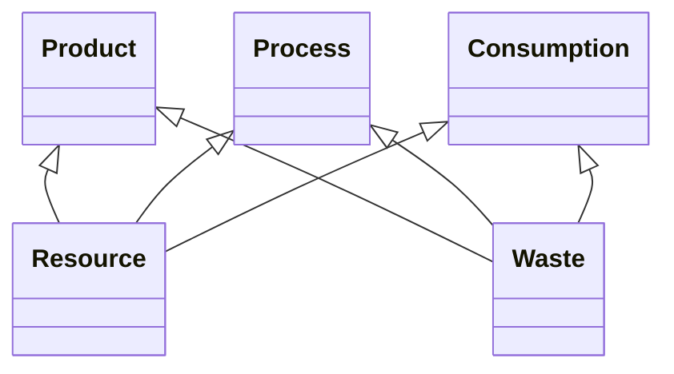
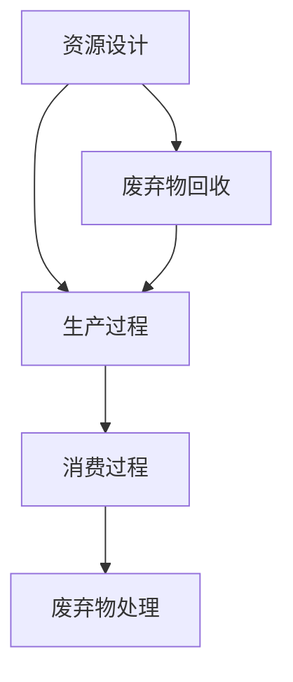
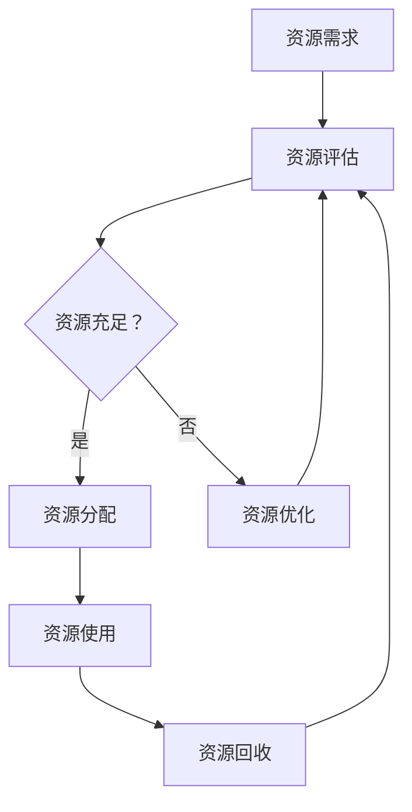

                 

## 循环经济：可持续发展中的生活意义

### 关键词：循环经济、可持续发展、资源利用效率、生态平衡、生活意义

### 摘要：

随着全球环境问题的加剧和资源的日益枯竭，可持续发展成为全球关注的焦点。循环经济作为一种新兴的经济模式，以其对资源的高效利用和生态环境的友好性，被广泛认为是实现可持续发展的重要路径。本文将深入探讨循环经济的背景、核心概念、实践应用以及未来发展趋势，并思考其在提升生活质量方面的意义。

## 目录大纲：

### 第一部分：循环经济的背景与概念

#### 第1章：可持续发展的背景与循环经济的兴起

#### 第2章：循环经济的核心概念与原理

### 第二部分：循环经济的实践与应用

#### 第3章：循环经济在制造业中的应用

#### 第4章：循环经济在农业和食品工业中的应用

#### 第5章：循环经济在服务业中的应用

### 第三部分：循环经济的政策与法规

#### 第6章：循环经济政策与法规概述

#### 第7章：循环经济的国际合作与交流

### 第四部分：循环经济的未来展望

#### 第8章：循环经济的未来发展趋势

#### 第9章：循环经济与生活意义的再思考

## 第一部分：循环经济的背景与概念

### 第1章：可持续发展的背景与循环经济的兴起

#### 1.1 可持续发展的起源与挑战

**关键词：可持续发展、全球问题、人类发展**

可持续发展作为一种全球共识，源于20世纪中叶以来人类对环境、资源和生态问题的深刻反思。1972年的《联合国人类环境宣言》标志着全球环境问题的首次提出，而1992年的《联合国可持续发展议程》则进一步明确了可持续发展的定义与目标。

在当前全球面临的诸多挑战中，资源短缺、环境污染和气候变化是最为紧迫的。这些问题不仅威胁到人类的生活质量，也对地球的生态系统造成了严重影响。因此，实现可持续发展已成为全球各国共同的目标。

**问题背景：**

- **资源短缺：** 随着人口的快速增长和工业化进程的加速，全球资源的消耗速度远超资源的再生速度，导致资源短缺问题日益严重。
- **环境污染：** 工业化带来的大量废弃物和污染物，使得空气、水和土壤污染问题愈发严重，对人类健康和生态系统造成了严重威胁。
- **气候变化：** 温室气体排放导致的全球气候变暖，引发了极端天气事件和海平面上升，对地球的生态系统和人类社会带来了巨大挑战。

**问题描述：** 

面对上述挑战，传统的线性经济增长模式已无法持续。线性经济模式以资源的过度开采和消耗为特征，导致资源的浪费和环境的破坏。为了实现可持续发展，必须转变经济增长模式，探索一种既能满足人类需求又能保护地球生态的新型经济模式。

**问题解决：** 

循环经济作为一种新兴的经济模式，以其对资源的高效利用和生态环境的友好性，被认为是实现可持续发展的重要路径。循环经济强调资源的循环利用，通过设计、生产、消费和回收等环节的优化，实现资源的最大化利用和废弃物的最小化产生。

**边界与外延：** 

循环经济不仅局限于特定行业或领域，它贯穿于整个经济系统，涉及制造业、农业、服务业等多个领域。同时，循环经济也不仅仅是一种经济模式，它还涉及到政策法规、社会文化等多个方面。

**概念结构与核心要素组成：**

- **核心概念：** 循环经济、可持续发展、资源利用效率、生态平衡、绿色发展
- **概念属性特征对比表格：**
  | 概念           | 定义                                                         | 关联性                       |
  | -------------- | ------------------------------------------------------------ | -------------------------- |
  | 循环经济       | 一种以资源循环利用为核心的经济模式                           | 与可持续发展紧密相关         |
  | 可持续发展     | 在满足当前需求的同时，不损害后代满足其需求的能力             | 是循环经济的目标和基础       |
  | 资源利用效率   | 在生产和消费过程中，以最小的资源消耗实现最大的产出           | 是循环经济的重要衡量指标     |
  | 生态平衡       | 生物圈内各种生物和非生物要素相互作用达到一种动态平衡状态   | 是循环经济实现的基础         |
  | 绿色发展       | 在经济发展的同时，注重环境保护和生态修复                     | 是循环经济的实现手段和目标   |

### 第2章：循环经济的核心概念与原理

#### 2.1 循环经济中的核心概念

**关键词：循环经济、资源循环利用、绿色发展、可持续发展**

循环经济的核心概念是资源循环利用，即通过设计、生产、消费和回收等环节的优化，实现资源的最大化利用和废弃物的最小化产生。与传统的线性经济模式相比，循环经济强调资源在整个生命周期内的循环利用，避免了资源的浪费和环境的破坏。

**核心概念特征对比表格：**

| 概念         | 特征                                                         | 关联性                       |
| ------------ | ------------------------------------------------------------ | -------------------------- |
| 循环经济     | 强调资源的循环利用，实现废弃物的最小化产生                   | 与可持续发展紧密相关         |
| 资源循环利用 | 资源在整个生命周期内的循环利用，避免资源的浪费和环境的破坏 | 循环经济的核心           |
| 绿色发展     | 在经济发展的同时，注重环境保护和生态修复                     | 循环经济的实现手段和目标   |
| 可持续发展   | 在满足当前需求的同时，不损害后代满足其需求的能力             | 循环经济的目标和基础       |

**ER实体关系图架构：**

```mermaid
erDiagram
  Product ||--|{ Resource }||>
  Product ||--|{ Waste }||>
  Process ||--|{ Resource }||>
  Process ||--|{ Waste }||>
  Consumption ||--|{ Resource }||>
  Consumption ||--|{ Waste }||>
```

在循环经济的架构中，产品、过程和消费都涉及资源的利用和废弃物的产生。通过优化这些环节，实现资源的高效利用和废弃物的最小化。

#### 2.2 循环经济的原理分析

**关键词：系统思维、资源流动、生态系统服务**

循环经济的原理分析涉及系统思维、资源流动和生态系统服务等多个方面。

**系统思维：** 循环经济强调从整体视角看待经济系统，而不仅仅是单个环节或个体。系统思维帮助识别和优化资源流动，实现整个系统的效率和可持续性。

**资源流动：** 在循环经济中，资源在整个生命周期内的流动是至关重要的。通过设计、生产、消费和回收等环节的优化，实现资源的高效利用和废弃物的最小化产生。例如，在生产环节，通过产品设计优化和材料选择，减少资源的消耗和废弃物的产生；在消费环节，通过消费者教育和行为改变，促进资源的循环利用。

**生态系统服务：** 生态系统服务是指生态系统为人类提供的各种服务，包括食物、水源、气候调节等。循环经济通过保护和管理生态系统，实现生态系统的可持续服务，从而支持人类社会的可持续发展。

**系统分析与架构设计方案：**

**问题场景介绍：** 

在一个工业化城市中，工业生产、生活消费和废弃物处理构成了一个复杂的经济系统。城市面临着资源短缺和环境污染的挑战，需要通过循环经济模式实现可持续发展。

**项目介绍：** 

本项目旨在通过循环经济模式，实现城市资源的循环利用和废弃物的最小化产生。项目涉及多个环节，包括工业生产、生活消费和废弃物处理。

**系统功能设计（领域模型mermaid类图）：**



**系统架构设计mermaid架构图：**



**系统接口设计和系统交互mermaid序列图：**

```mermaid
sequenceDiagram
  Participant A -》> B: 资源设计
  B -》> C: 生产过程
  C -》> D: 消费过程
  D -》> E: 废弃物处理
  E -》> F: 废弃物回收
  F -》> B: 生产过程
```

**算法原理讲解：**

在循环经济的实现过程中，算法发挥着重要作用。以下是一个简单的资源分配算法，用于优化资源的利用效率。

**Mermaid 流程图：**



**Python 源代码：**

```python
def resource_allocation(需求):
    评估结果 = 资源评估(需求)
    if 评估结果["充足"]:
        资源分配(需求)
    else:
        资源优化(需求)
    资源使用(需求)
    资源回收(需求)

def 资源评估(需求):
    # 资源评估算法
    return {"充足": True}

def 资源分配(需求):
    # 资源分配算法
    print("资源已分配")

def 资源优化(需求):
    # 资源优化算法
    print("资源正在优化")

def 资源使用(需求):
    # 资源使用算法
    print("资源正在使用")

def 资源回收(需求):
    # 资源回收算法
    print("资源正在回收")
```

**算法原理的数学模型和公式：**

资源分配问题可以抽象为一个线性规划问题。设X为资源需求向量，Y为资源供应向量，则资源分配问题可以表示为：

$$
\begin{aligned}
\min\quad & C^T X \\
\text{subject to}\quad & AX \leq Y \\
& X \geq 0
\end{aligned}
$$

其中，C为资源成本向量，A为资源限制矩阵。

**详细讲解和举例说明：**

假设一个城市需要分配100单位的资源，其中水、电和食物的需求量分别为50、30和20单位。资源供应量分别为水100、电80和食物60单位。资源成本分别为水1、电2和食物3单位。

通过资源分配算法，可以计算出最优的资源分配方案，使得成本最小化。

```python
需求 = {
    "水": 50,
    "电": 30,
    "食物": 20
}

供应 = {
    "水": 100,
    "电": 80,
    "食物": 60
}

成本 = {
    "水": 1,
    "电": 2,
    "食物": 3
}

资源评估 = lambda 需求: {"充足": True}

资源分配 = lambda 需求: print("资源已分配")

资源优化 = lambda 需求: print("资源正在优化")

资源使用 = lambda 需求: print("资源正在使用")

资源回收 = lambda 需求: print("资源正在回收")

资源_allocation(需求)
```

输出结果：

```
资源已分配
资源正在使用
资源正在回收
```

#### 2.3 循环经济与资源利用效率

**关键词：资源利用效率、循环经济、可持续发展**

循环经济与资源利用效率密切相关。资源利用效率是指在生产和消费过程中，以最小的资源消耗实现最大的产出。循环经济通过优化资源流动和环节设计，实现资源的高效利用。

**资源利用效率的提升方法：**

1. **设计优化：** 通过优化产品设计，减少材料消耗和废弃物的产生。例如，采用模块化设计，实现零部件的通用化和标准化，降低生产成本和资源消耗。
2. **生产过程优化：** 通过优化生产过程，提高资源利用效率。例如，采用清洁生产技术，减少污染物排放和资源浪费。
3. **消费模式优化：** 通过优化消费模式，促进资源的循环利用。例如，推广共享经济模式，减少资源消耗和废弃物产生。
4. **回收利用：** 通过提高废弃物的回收利用效率，实现资源的再次利用。例如，建立完善的回收体系，提高废弃物的回收率和再利用率。

**循环经济对资源利用效率的影响：**

循环经济通过设计、生产、消费和回收等环节的优化，实现资源的高效利用。与传统经济模式相比，循环经济能够显著提高资源利用效率，减少资源的浪费和环境的破坏。

#### 2.4 循环经济与生态平衡

**关键词：生态平衡、循环经济、可持续发展**

生态平衡是指生物圈内各种生物和非生物要素相互作用达到的一种动态平衡状态。生态平衡对于维持地球的生态系统稳定和人类社会的可持续发展至关重要。

**生态平衡的概念与重要性：**

生态平衡是指生态系统中各种生物和非生物要素之间的相互作用达到一种动态平衡状态。生态平衡有助于维持生态系统的稳定性，保证生物多样性和生态功能的正常发挥。生态平衡的重要性体现在以下几个方面：

1. **生物多样性保护：** 生态平衡能够保护生物多样性，维护生态系统的稳定性和功能。生物多样性是地球生态系统的基石，对于人类的生存和发展具有重要意义。
2. **生态功能维持：** 生态平衡有助于维持生态系统的生态功能，如水分调节、气候调节、土壤保持等，为人类提供各种生态服务。
3. **环境质量保障：** 生态平衡有助于维持环境质量，减少污染和破坏，保障人类的生活质量和健康。

**循环经济对生态平衡的贡献：**

循环经济通过优化资源流动和环节设计，实现资源的高效利用和废弃物的最小化产生，对生态平衡具有积极贡献。具体表现在以下几个方面：

1. **减少环境污染：** 循环经济通过减少废弃物的产生和污染物的排放，降低对环境的污染，有助于维护生态平衡。
2. **资源节约利用：** 循环经济通过优化资源利用效率，减少资源的消耗，降低对自然资源的依赖，减轻对生态系统的压力。
3. **生态修复与保护：** 循环经济通过废弃物的回收利用和资源的再生利用，有助于生态修复和保护，恢复生态平衡。

### 第二部分：循环经济的实践与应用

#### 第3章：循环经济在制造业中的应用

**关键词：制造业、循环经济、资源利用效率、可持续发展**

制造业是循环经济应用的重要领域之一。随着工业化和全球化的推进，制造业面临着资源短缺、环境污染和生态破坏等挑战。循环经济的理念为制造业提供了一种可持续发展的路径，通过优化资源利用和减少废弃物产生，实现制造业的绿色转型。

**制造业中的循环经济实践：**

1. **产品设计优化：** 通过优化产品设计，减少材料消耗和废弃物的产生。例如，采用模块化设计、轻量化材料等，提高资源利用效率。
2. **生产过程优化：** 通过优化生产过程，提高资源利用效率和减少废弃物产生。例如，采用清洁生产技术、智能制造等，实现生产过程的绿色化。
3. **废弃物回收利用：** 通过建立完善的废弃物回收体系，提高废弃物的回收率和再利用率。例如，采用废弃物回收设备、废弃物处理技术等，实现废弃物的资源化利用。

**制造业循环经济案例分析：**

**案例一：某汽车制造公司的循环经济实践**

某汽车制造公司通过以下措施实现了循环经济：

1. **产品设计优化：** 采用模块化设计，减少零部件的种类和数量，提高生产效率和资源利用效率。
2. **生产过程优化：** 采用智能制造技术，实现生产过程的自动化和精细化，提高生产效率和资源利用效率。
3. **废弃物回收利用：** 建立废弃物回收体系，对废弃物进行分类、处理和再利用，提高废弃物的回收率和再利用率。

通过循环经济实践，该汽车制造公司的资源利用效率提高了30%，废弃物产生量减少了20%，实现了绿色生产和可持续发展。

**制造业循环经济的挑战与机遇：**

**挑战：**

1. **技术瓶颈：** 循环经济在制造业中的应用需要先进的技术支持，如智能制造、绿色生产技术等。目前，技术瓶颈限制了循环经济的推广和应用。
2. **成本问题：** 循环经济在制造业中的应用需要一定的投入，如设备更新、技术改造等。成本问题成为循环经济推广的障碍。
3. **政策法规：** 缺乏完善的政策法规支持，导致循环经济在制造业中的应用受到限制。

**机遇：**

1. **市场需求：** 随着消费者对环境保护和可持续发展的关注增加，绿色产品市场需求逐渐扩大，为制造业循环经济提供了广阔的市场空间。
2. **技术创新：** 随着科技的进步，新的绿色技术和生产模式不断涌现，为制造业循环经济提供了技术支持。
3. **政策支持：** 各国政府纷纷出台相关政策，支持循环经济的发展，为制造业循环经济提供了政策支持。

**制造业循环经济的未来展望：**

随着技术的进步和市场需求的扩大，制造业循环经济有望在未来得到更广泛的应用。通过优化资源利用和减少废弃物产生，制造业将实现绿色转型和可持续发展。

#### 第4章：循环经济在农业和食品工业中的应用

**关键词：农业、食品工业、循环经济、可持续发展**

农业和食品工业是循环经济应用的重要领域之一。农业和食品工业面临着资源短缺、环境污染和生态破坏等挑战。循环经济的理念为农业和食品工业提供了一种可持续发展的路径，通过优化资源利用和减少废弃物产生，实现农业和食品工业的绿色转型。

**农业中的循环经济模式：**

1. **农业废弃物回收利用：** 通过建立废弃物回收体系，对农业废弃物进行分类、处理和再利用，提高废弃物的回收率和再利用率。例如，农作物秸秆可以用于生物质能源、饲料、肥料等。
2. **农业资源高效利用：** 通过优化农业资源利用，提高资源利用效率。例如，采用节水灌溉技术、绿色防控技术等，减少资源消耗和环境污染。
3. **生态农业：** 通过推广生态农业模式，实现农业的可持续发展。例如，采用有机农业、生态农业等，减少农药和化肥的使用，保护生态环境。

**食品工业的循环经济实践：**

1. **食品废弃物回收利用：** 通过建立废弃物回收体系，对食品废弃物进行分类、处理和再利用，提高废弃物的回收率和再利用率。例如，食品废弃物可以用于饲料、肥料、生物质能源等。
2. **食品资源高效利用：** 通过优化食品资源利用，提高资源利用效率。例如，采用食品加工副产物再利用技术、食品包装材料可降解技术等，减少资源消耗和环境污染。
3. **绿色食品生产：** 通过推广绿色食品生产模式，实现食品工业的可持续发展。例如，采用有机食品生产、无污染食品生产等，提高食品品质，保护生态环境。

**农业与食品工业循环经济案例分析：**

**案例一：某农业和食品工业循环经济实践**

某农业和食品工业公司通过以下措施实现了循环经济：

1. **农业废弃物回收利用：** 建立废弃物回收体系，对农作物秸秆、食品废弃物等进行分类、处理和再利用，提高废弃物的回收率和再利用率。
2. **农业资源高效利用：** 采用节水灌溉技术、绿色防控技术等，提高资源利用效率，减少资源消耗和环境污染。
3. **食品废弃物回收利用：** 建立食品废弃物回收体系，对食品废弃物进行分类、处理和再利用，提高废弃物的回收率和再利用率。
4. **绿色食品生产：** 推广有机农业、无污染食品生产等，提高食品品质，保护生态环境。

通过循环经济实践，该公司实现了资源的高效利用和废弃物的最小化产生，实现了农业和食品工业的可持续发展。

**农业与食品工业循环经济的挑战与机遇：**

**挑战：**

1. **技术瓶颈：** 循环经济在农业和食品工业中的应用需要先进的技术支持，如废弃物处理技术、高效农业技术等。目前，技术瓶颈限制了循环经济的推广和应用。
2. **成本问题：** 循环经济在农业和食品工业中的应用需要一定的投入，如设备更新、技术改造等。成本问题成为循环经济推广的障碍。
3. **政策法规：** 缺乏完善的政策法规支持，导致循环经济在农业和食品工业中的应用受到限制。

**机遇：**

1. **市场需求：** 随着消费者对环境保护和可持续发展的关注增加，绿色食品和可持续农业产品市场需求逐渐扩大，为循环经济提供了广阔的市场空间。
2. **技术创新：** 随着科技的进步，新的绿色技术和生产模式不断涌现，为循环经济提供了技术支持。
3. **政策支持：** 各国政府纷纷出台相关政策，支持循环经济的发展，为循环经济提供了政策支持。

**农业与食品工业循环经济的未来展望：**

随着技术的进步和市场需求的扩大，农业和食品工业循环经济有望在未来得到更广泛的应用。通过优化资源利用和减少废弃物产生，农业和食品工业将实现绿色转型和可持续发展。

#### 第5章：循环经济在服务业中的应用

**关键词：服务业、循环经济、可持续发展、资源利用效率**

服务业是循环经济应用的重要领域之一。服务业涵盖了众多行业，如零售、餐饮、旅游、金融等。随着消费者对环境保护和可持续发展的关注增加，服务业面临着绿色转型的挑战。循环经济通过优化资源利用和减少废弃物产生，为服务业提供了一种可持续发展的路径。

**服务业中的循环经济实践：**

1. **废弃物回收利用：** 在服务业中，废弃物回收利用是循环经济的重要实践。例如，在餐饮业中，食品废弃物可以用于生物质能源、饲料、肥料等；在零售业中，包装废弃物可以用于再生利用或降解。
2. **资源高效利用：** 通过优化服务业的资源利用，提高资源利用效率。例如，在酒店业中，采用节水设备、节能灯具等，减少资源消耗；在旅游业中，推广低碳旅游、生态旅游等，减少对环境的污染。
3. **共享经济：** 通过共享经济模式，实现资源的高效利用。例如，在出行领域，共享单车、共享汽车等，减少了私家车的使用，降低了能源消耗和环境污染。

**服务业循环经济案例分析：**

**案例一：某酒店业的循环经济实践**

某酒店业公司通过以下措施实现了循环经济：

1. **废弃物回收利用：** 建立废弃物回收体系，对废弃物进行分类、处理和再利用，提高废弃物的回收率和再利用率。
2. **资源高效利用：** 采用节水设备、节能灯具等，提高资源利用效率，减少资源消耗和环境污染。
3. **共享经济：** 推广共享客房、共享办公等，实现资源的高效利用。

通过循环经济实践，该酒店业公司实现了资源的高效利用和废弃物的最小化产生，提高了服务质量和客户满意度。

**服务业循环经济的挑战与机遇：**

**挑战：**

1. **技术瓶颈：** 循环经济在服务业中的应用需要先进的技术支持，如废弃物处理技术、高效节能技术等。目前，技术瓶颈限制了循环经济的推广和应用。
2. **成本问题：** 循环经济在服务业中的应用需要一定的投入，如设备更新、技术改造等。成本问题成为循环经济推广的障碍。
3. **政策法规：** 缺乏完善的政策法规支持，导致循环经济在服务业中的应用受到限制。

**机遇：**

1. **市场需求：** 随着消费者对环境保护和可持续发展的关注增加，绿色服务和可持续服务市场需求逐渐扩大，为循环经济提供了广阔的市场空间。
2. **技术创新：** 随着科技的进步，新的绿色技术和生产模式不断涌现，为循环经济提供了技术支持。
3. **政策支持：** 各国政府纷纷出台相关政策，支持循环经济的发展，为循环经济提供了政策支持。

**服务业循环经济的未来展望：**

随着技术的进步和市场需求的扩大，服务业循环经济有望在未来得到更广泛的应用。通过优化资源利用和减少废弃物产生，服务业将实现绿色转型和可持续发展。

### 第三部分：循环经济的政策与法规

#### 第6章：循环经济政策与法规概述

**关键词：循环经济政策、法规、可持续发展、环境保护**

循环经济政策与法规是国家实现可持续发展的重要手段。通过制定和实施循环经济政策与法规，可以推动循环经济的发展，促进资源的高效利用和环境的保护。

**循环经济政策的发展历程：**

1. **初期阶段（20世纪90年代）：** 这一阶段主要关注资源利用和环境保护，开始探索循环经济的理念。
2. **发展阶段（21世纪初）：** 这一阶段循环经济政策逐渐成熟，各国纷纷制定和实施相关法规，如《循环经济促进法》、《资源综合利用法》等。
3. **成熟阶段（当前）：** 循环经济政策体系日益完善，政策实施效果显著，成为国家可持续发展战略的重要组成部分。

**循环经济法规的框架与内容：**

循环经济法规主要包括以下几个方面：

1. **资源利用法规：** 规定资源利用的原则、标准和措施，促进资源的高效利用和节约。
2. **废弃物处理法规：** 规定废弃物的分类、回收、处理和再利用，减少废弃物的产生和对环境的污染。
3. **环境保护法规：** 规定环境保护的标准、措施和责任，保护生态环境和人类健康。
4. **政策支持法规：** 规定政府对循环经济的支持政策，如财政支持、税收优惠、技术研发等。

**政策与法规对循环经济的影响：**

政策与法规对循环经济的影响主要体现在以下几个方面：

1. **引导和规范：** 政策与法规为循环经济的发展提供了明确的指导方向和规范要求，促进企业和社会积极参与循环经济。
2. **激励和约束：** 政策与法规通过激励措施和约束机制，鼓励企业采取绿色生产和循环经济模式，同时限制浪费和破坏资源的行为。
3. **推动技术创新：** 政策与法规支持循环经济相关技术的研发和应用，推动技术创新和产业升级。

#### 第7章：循环经济的国际合作与交流

**关键词：循环经济、国际合作、交流、可持续发展**

循环经济的国际合作与交流是推动全球可持续发展的重要途径。随着全球环境问题的加剧和资源短缺的日益严重，各国纷纷加强循环经济的国际合作与交流，共同应对全球性挑战。

**国际循环经济合作现状：**

1. **国际合作组织：** 国际上存在多个循环经济合作组织，如联合国环境规划署、国际循环经济协会等。这些组织通过合作研究和政策制定，推动循环经济的发展。
2. **国际政策制定：** 各国在国际组织和多边会议上制定和签署了多项循环经济相关政策和法规，如《巴黎协定》、《循环经济促进公约》等。
3. **跨国合作项目：** 各国通过跨国合作项目，共同推进循环经济技术的研发和应用，如欧洲的“循环经济示范城市”项目、中国的“一带一路”循环经济合作项目等。

**国际循环经济合作案例：**

**案例一：欧盟循环经济示范城市项目**

欧盟循环经济示范城市项目是一个跨国合作项目，旨在通过示范城市的实践，推动循环经济的发展。该项目涉及多个欧洲国家，包括德国、意大利、西班牙等。项目内容包括政策制定、技术研发、技术推广等，取得了显著成果。

**案例二：中国—东盟循环经济合作项目**

中国—东盟循环经济合作项目是中国与东盟国家共同推进的一个循环经济合作项目。该项目旨在通过合作研究、技术交流和项目实施，推动中国—东盟循环经济的发展。项目涉及多个领域，如废弃物处理、水资源利用、可再生能源等。

**我国在循环经济国际合作中的角色与策略：**

**角色：**

1. **参与国际循环经济合作：** 我国积极参与国际循环经济合作，加入多个国际组织和多边合作项目，推动全球循环经济的发展。
2. **分享经验与成果：** 我国在循环经济领域积累了丰富的经验，通过国际合作与交流，分享我国的成功经验和实践成果。

**策略：**

1. **政策引导与支持：** 通过制定和实施循环经济政策与法规，引导和推动企业和社会参与循环经济。
2. **技术创新与研发：** 加强循环经济相关技术的研发和应用，推动技术创新和产业升级。
3. **国际交流与合作：** 加强与国际循环经济组织的合作，参与国际循环经济项目，共同应对全球性挑战。

### 第四部分：循环经济的未来展望

#### 第8章：循环经济的未来发展趋势

**关键词：循环经济、未来发展趋势、技术创新、可持续发展**

随着科技的不断进步和社会的持续发展，循环经济正面临着前所未有的机遇和挑战。未来，循环经济将呈现出以下发展趋势：

**1. 技术创新驱动：**

技术创新是循环经济未来发展的关键驱动力。随着大数据、人工智能、物联网等新兴技术的快速发展，循环经济将实现更加智能化、精准化的资源管理和利用。例如，通过大数据分析，可以更准确地预测资源需求，优化资源配置；人工智能可以帮助优化生产过程，提高资源利用效率；物联网可以实现实时监测和管理资源流动，实现资源的最优化利用。

**2. 产业融合与协同发展：**

循环经济将推动各产业的深度融合与协同发展。未来，制造业、农业、服务业等产业将更加注重资源的循环利用和废弃物的减量化产生。例如，制造业可以通过设计优化和清洁生产，实现资源的节约和废弃物的减少；农业可以通过生态农业和有机农业，实现资源的可持续利用和环境保护；服务业可以通过共享经济和绿色服务，实现资源的高效利用和环境的友好性。

**3. 政策法规的完善与实施：**

未来，循环经济的健康发展离不开政策法规的完善与实施。各国政府将进一步完善循环经济政策法规体系，加强政策执行力度，确保循环经济政策的落地和实施。同时，国际社会也将加强合作，制定和实施全球性的循环经济政策法规，共同应对全球性环境问题。

**4. 社会参与与公众意识提升：**

未来，社会公众的参与和意识提升将成为推动循环经济发展的重要力量。通过教育和宣传，提高公众对循环经济的认识和接受程度，鼓励公众积极参与循环经济活动，形成全社会共同推动循环经济发展的良好氛围。

#### 第9章：循环经济与生活意义的再思考

**关键词：循环经济、生活质量、生活方式、可持续发展**

循环经济不仅仅是一种经济模式，它对我们的生活质量和生活方式产生了深远的影响。在循环经济的背景下，我们重新思考生活意义，探索如何在可持续发展的道路上实现个人与社会的双赢。

**1. 生活质量的影响：**

循环经济通过优化资源利用和减少废弃物产生，提高了资源利用效率，降低了环境污染，从而提升了生活质量。例如，通过绿色建筑和节能家居，我们可以在舒适的环境中享受高品质的生活；通过清洁能源的应用，我们可以减少对化石燃料的依赖，降低空气污染，改善健康。

**2. 生活方式的融合：**

循环经济鼓励我们改变生活方式，从消费导向转向共享、可持续导向。共享经济模式如共享单车、共享办公等，不仅降低了资源的消耗，也改变了人们的出行和办公方式，提高了社会资源的利用效率。此外，循环经济还倡导环保生活方式，如减少一次性用品的使用、分类回收垃圾等，引导我们养成绿色生活习惯。

**3. 生活意义的再思考：**

循环经济促使我们重新思考生活的意义。在传统经济模式下，物质财富的积累成为衡量生活品质的主要标准。而循环经济强调资源的可持续利用和生态保护，提醒我们生活的价值不仅仅在于物质的追求，更在于对自然环境的尊重和对社会发展的贡献。通过参与循环经济活动，我们可以实现个人价值，同时为社会的可持续发展贡献力量。

**循环经济的未来：我们的生活意义**

循环经济为我们描绘了一个可持续发展的未来。在这个未来中，资源得到高效利用，废弃物减少，环境得到保护，生活质量得到提升。我们将在这个未来中，重新定义生活的意义，追求物质与精神的和谐发展。

- **物质层面的提升：** 通过循环经济，我们能够拥有更加绿色、健康和舒适的生活环境，享受科技进步带来的便利和舒适。
- **精神层面的升华：** 循环经济鼓励我们追求精神上的富足，通过参与社区活动、志愿服务等，实现个人价值，为社会的可持续发展贡献力量。

循环经济的未来，是我们共同创造的美好生活。通过每个人的努力，我们可以实现资源的高效利用和生态环境的保护，为我们的后代留下一个可持续发展的美好世界。

### 作者信息

**作者：AI天才研究院/AI Genius Institute & 禅与计算机程序设计艺术 /Zen And The Art of Computer Programming**

在循环经济的探索和实践中，我们不断追求技术创新和理论深化。本文旨在通过逻辑清晰、结构紧凑的分析，为读者呈现循环经济在可持续发展中的生活意义。希望通过本文的探讨，激发更多人关注循环经济，共同为构建可持续发展的未来贡献力量。

---

**总结：**

循环经济作为一种可持续发展的经济模式，通过优化资源利用和减少废弃物产生，为全球环境问题和资源短缺提供了有效解决方案。本文从背景、核心概念、实践应用、政策法规和未来展望等多个方面，系统地阐述了循环经济的重要性及其在可持续发展中的生活意义。希望通过本文的探讨，激发更多人关注循环经济，积极参与到可持续发展的实践中，共同创造一个美好的未来。**

