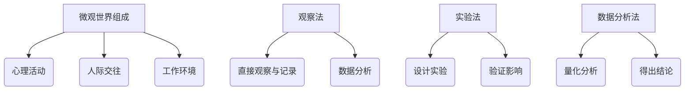
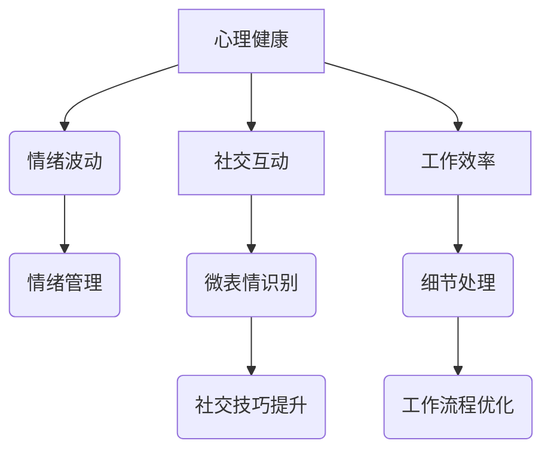
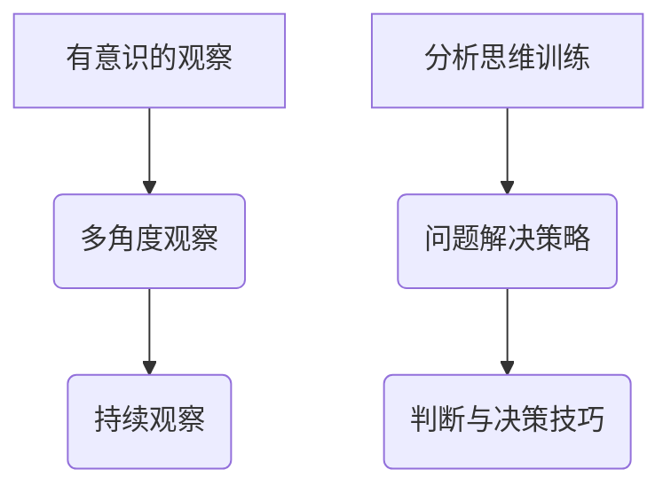
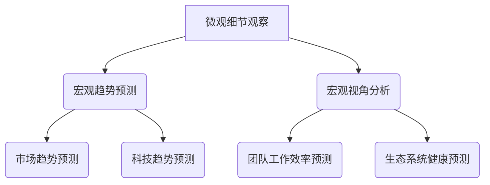
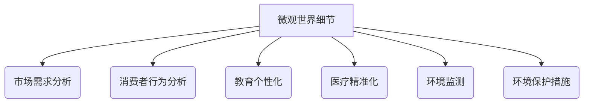

                 

### 第一部分：背景介绍

#### 第1章：问题背景与核心概念

##### 1.1.1 问题背景

现代社会的高速发展带来了信息爆炸和复杂性增加，人们在日常生活中面临着越来越多的细节问题。从个人生活的日常琐事，到工作中的决策和执行，细节的处理能力成为影响生活质量和工作效率的关键因素。然而，多数人往往忽视这些看似微不足道的细节，导致错失重要的信息和机会。

现代社会对细节洞察力的需求主要体现在以下几个方面：

1. **心理健康**：对生活细节的关注有助于缓解压力，提升心理健康。通过细致的观察和体验，人们能够更好地理解自己的情绪和需求。
2. **社交互动**：社交场合中，对细节的敏感度可以增进人际交往，建立和谐的人际关系。
3. **工作效率**：在工作中，对细节的关注可以提高任务执行的质量和效率，减少错误和返工。

微观世界与宏观生活的关联紧密。微观世界是宏观世界的基石，每一个微小的细节都可能在宏观层面产生重大影响。例如，在软件开发中，代码的每一行都至关重要，一个小小的错误可能导致整个系统的崩溃。

##### 1.1.2 核心概念

- **微观世界**：指日常生活中微小但重要的细节，包括但不限于心理活动的细节、人际交往中的细微表情和语调，以及工作中的细节处理。
- **宏观意义**：微观世界的细节对生活整体的影响，体现在心理、社交和职业等多个方面。

**微观世界**的特点包括：

1. **可观察性与隐藏性**：细节通常容易被忽视，但在仔细观察下是可以被观察到的。
2. **变异性与规律性**：细节在表现形式上可能存在变化，但整体上往往遵循一定的规律。

**宏观意义**主要体现在以下几个方面：

1. **情感管理**：通过关注细节，人们能够更好地理解和调节自己的情感状态。
2. **决策制定**：对细节的关注有助于做出更明智的决策。
3. **创新思维**：在创新过程中，对微小细节的关注往往能够激发新的灵感。

##### 1.1.3 问题解决与边界

- **问题解决**：培养对生活细节的洞察力，可以通过以下几个步骤实现：
  1. **有意识的观察**：培养对细节的关注，有目的地观察生活中的各种细节。
  2. **多角度分析**：从不同角度分析细节，挖掘其背后的含义和影响。
  3. **持续实践**：通过日常生活中的实际操作，不断练习和提升洞察力。

- **边界探索**：微观世界的边界是无限的，随着人类认知能力的提升，我们能够发现更多的细节。因此，探索微观世界的边界是一个持续的过程，需要不断的努力和探索。

### 结论

通过对微观世界的理解，我们可以看到其与宏观生活之间的紧密联系。培养对生活细节的洞察力，不仅有助于提升个人素质，还能在多个方面改善生活质量。因此，重视微观世界的观察和分析，具有重要的现实意义。

### 目录大纲

---

## 第一部分：背景介绍

### 1.1 问题背景与核心概念

- 1.1.1 问题背景
  - 现代社会对细节洞察力的需求
  - 微观世界与宏观生活的关联
- 1.1.2 核心概念
  - 微观世界：日常生活中微小但重要的细节
  - 宏观意义：微观细节对生活整体的影响
- 1.1.3 问题解决与边界
  - 培养洞察力的方法与途径
  - 探索微观世界的边界

## 第二部分：微观世界的结构与特征

### 2.1 微观世界的结构与特征

- 2.1.1 微观世界的结构
  - 日常生活中的微观细节
  - 微观世界的分类与组成
- 2.1.2 微观世界的特征
  - 可观察性与隐藏性
  - 变异性与规律性
- 2.1.3 微观世界的研究方法
  - 观察法
  - 实验法
  - 数据分析法

## 第三部分：宏观生活中的微观意义

### 3.1 微观细节对生活的具体影响

- 3.1.1 微观细节对生活的具体影响
  - 心理健康
  - 社交互动
  - 工作效率
- 3.1.2 微观细节的启示
  - 情感管理
  - 决策制定
  - 创新思维
- 3.1.3 微观细节的实践应用
  - 生活习惯改善
  - 社交技巧提升
  - 工作效率提高

## 第四部分：培养洞察力的方法与技巧

### 4.1 观察力的培养

- 4.1.1 观察力的培养
  - 有意识的观察
  - 多角度观察
  - 持续观察

### 4.2 思考与分析能力的提升

- 4.2.1 思考与分析能力的提升
  - 分析思维训练
  - 问题解决策略
  - 判断与决策技巧

### 4.3 实践与应用

- 4.3.1 实际案例分享
- 4.3.2 洞察力训练活动

## 第五部分：微观世界中的宏观思维

### 5.1 微观世界中的宏观思维

- 5.1.1 宏观思维在微观世界的应用
  - 从微观细节看宏观趋势
  - 微观世界的宏观视角
- 5.1.2 宏观思维与微观洞察的结合
  - 创新思维培养
  - 跨领域思考
- 5.1.3 宏观思维在现实生活中的应用
  - 解决复杂问题的策略
  - 提升个人影响力

## 第六部分：微观世界与宏观社会的互动

### 6.1 微观世界对宏观社会的影响

- 6.1.1 微观世界对宏观社会的影响
  - 经济发展
  - 社会进步
  - 环境保护
- 6.1.2 宏观社会对微观世界的反作用
  - 文化传播
  - 科技进步
  - 教育变革
- 6.1.3 微观世界与宏观社会的和谐共生
  - 社会责任
  - 可持续发展
  - 人类福祉

## 第七部分：拓展阅读与深入探讨

### 7.1 拓展阅读与深入探讨

- 7.1.1 相关书籍推荐
- 7.1.2 学术论文与研究报告
- 7.1.3 实际应用案例与案例分析

--- 

# 微观世界中的宏观意义：培养对生活细节的洞察力

关键词：细节洞察力、微观世界、宏观生活、心理管理、社交互动、工作效率

摘要：本文探讨了微观世界在宏观生活中的重要意义，分析了细节洞察力对心理健康、社交互动和工作效率的影响。通过培养观察力、思考与分析能力，我们能够更好地理解和应用微观世界的洞察力，提升个人综合素质，实现生活与工作的和谐发展。

## 第二部分：微观世界的结构与特征

### 2.1 微观世界的结构与特征

#### 2.1.1 微观世界的结构

微观世界是宏观世界的细小组成部分，它存在于我们日常生活的各个方面。从心理活动的细微变化到人际交往中的微妙表情，再到工作中的细节处理，微观世界无处不在。例如，在心理层面，微小的情绪波动可能预示着潜在的心理健康问题；在社交互动中，细致的观察可以帮助我们更好地理解他人的情感和需求；在工作环境中，对细节的关注可以提高工作效率，减少错误和返工。

#### 2.1.2 微观世界的特征

1. **可观察性与隐藏性**：微观世界的细节往往隐藏在日常生活的方方面面，但通过有意识的观察，这些细节是可以被发现的。例如，在人际交往中，细微的表情和语调变化可能隐藏着对方的真实感受。
2. **变异性与规律性**：微观世界的细节在表现形式上可能存在变化，但整体上往往遵循一定的规律。例如，在心理层面，情绪的波动虽然形式多变，但通常有一定的周期性。

#### 2.1.3 微观世界的研究方法

1. **观察法**：通过直接观察和记录微观世界的细节，我们可以了解其变化规律和特征。
2. **实验法**：通过设计实验，我们可以验证微观世界的细节对宏观生活的影响。
3. **数据分析法**：利用数据分析工具，我们可以对微观世界的细节进行量化分析，从而得出更准确的结论。

### 图表与流程图

为了更好地理解微观世界的结构和特征，我们使用 Mermaid 图表展示微观世界的组成及其研究方法。



通过上述图表，我们可以清晰地看到微观世界的组成及其研究方法。这不仅有助于我们理解微观世界的结构，也为后续的研究和应用提供了参考。

### 核心概念原理与属性特征对比表格

为了进一步深入理解微观世界的概念原理和属性特征，我们列出以下对比表格：

| 特征类别 | 概念原理 | 属性特征对比 |
| --- | --- | --- |
| 心理活动 | 情绪波动、心理需求 | 微小变化易被忽视，但整体趋势明显 |
| 人际交往 | 微表情、语调变化 | 可观察性高，隐藏性较强 |
| 工作环境 | 任务执行细节、流程优化 | 变异性强，但存在规律性 |

通过这个表格，我们可以更全面地了解微观世界的概念原理及其属性特征。

### ER实体关系图架构

为了更好地展示微观世界的实体关系，我们使用 Mermaid 图表绘制 ER 实体关系图。

```mermaid
erDiagram
    A[心理活动] ||--|{ B[人际交往] }
    B ||--|{ C[工作环境] }
    A ||--|{ D[情绪管理] }
    B ||--|{ E[社交技巧] }
    C ||--|{ F[工作效率] }
```

通过这个 ER 实体关系图，我们可以清晰地看到心理活动、人际交往和工作环境之间的相互作用，以及它们在微观世界中的地位和作用。

### 小结

通过以上分析，我们了解了微观世界的结构、特征和研究方法。微观世界的细节不仅存在于日常生活中，还对我们的心理健康、社交互动和工作效率产生重要影响。因此，培养对生活细节的洞察力具有重要的现实意义。

## 第三部分：宏观生活中的微观意义

### 3.1 微观细节对生活的具体影响

微观细节对生活的具体影响是多方面的，下面我们将分别探讨其对心理健康、社交互动和工作效率的影响。

#### 3.1.1 心理健康

心理健康是现代社会关注的重点之一。微观世界的细节在心理健康的维护和改善中起着关键作用。例如，情绪的微小波动可能预示着潜在的心理问题。通过观察和解读这些情绪变化，我们可以更好地了解自己的心理健康状况，并及时采取调整措施。

例如，一个人在紧张的工作环境中，可能会感受到轻微的焦虑。通过观察自己的情绪变化，如心跳加速、手心出汗等，他可以意识到自己的情绪状态，并采取放松技巧来缓解焦虑。这种对情绪细节的洞察力有助于提升心理健康。

#### 3.1.2 社交互动

社交互动是人际关系的重要组成部分。微观世界的细节在社交互动中同样扮演着重要角色。例如，人际交往中的细微表情和语调变化可以传达出对方的心理状态和情绪。

一个成功的社交互动需要双方都能准确解读这些微观细节。例如，在商务谈判中，对方的一个微微皱眉可能暗示着对某个问题的不满。通过敏锐地捕捉这些细节，谈判者可以及时调整策略，避免谈判破裂。

#### 3.1.3 工作效率

工作效率是现代职场中一个关键指标。微观世界的细节在提高工作效率方面同样具有重要作用。例如，工作中的细节处理，如文件整理、任务分配等，都需要对细节的高度关注。

通过细致的观察和准确的分析，我们可以发现工作流程中的瓶颈和问题，从而优化流程，提高效率。例如，一个项目经理可以通过仔细观察团队成员的工作状态，发现某个任务在执行过程中存在重复和冗余，进而进行优化，提高整体工作效率。

### 图表与流程图

为了更好地展示微观细节对生活的具体影响，我们使用 Mermaid 图表绘制以下流程图：



通过这个流程图，我们可以清晰地看到微观细节对心理健康、社交互动和工作效率的具体影响路径。

### 核心概念原理与数学模型

为了深入理解微观细节对生活的具体影响，我们引入以下核心概念原理和数学模型：

1. **情绪波动**：情绪波动可以用时间序列模型进行描述。假设一个人的情绪状态可以用时间序列 \(X_t\) 表示，其中 \(t\) 表示时间。情绪波动的强度可以用标准差 \( \sigma \) 表示，周期性可以用平均值 \( \mu \) 表示。

   $$ X_t = \mu + \sigma \cdot \epsilon_t $$
   
   其中，\( \epsilon_t \) 是均值为0、标准差为1的随机变量。

2. **社交技巧提升**：社交技巧的提升可以通过对人际交往中微表情和语调变化的识别和分析来实现。假设微表情和语调变化可以用特征向量 \( V \) 表示，社交技巧的提升可以用指标 \( S \) 表示。

   $$ S = f(V) $$
   
   其中，\( f \) 是一个非线性函数，用于评估社交技巧的提升程度。

3. **工作流程优化**：工作流程的优化可以通过对细节处理的优化来实现。假设工作流程可以用状态转移矩阵 \( P \) 表示，优化后的工作流程可以用状态转移矩阵 \( P' \) 表示。

   $$ P' = P \cdot D $$
   
   其中，\( D \) 是一个对角矩阵，用于调整不同任务之间的权重。

通过引入这些核心概念原理和数学模型，我们可以更深入地理解微观细节对生活的具体影响。

### 小结

微观细节对心理健康、社交互动和工作效率的具体影响是显而易见的。通过培养对生活细节的洞察力，我们能够更好地应对生活中的各种挑战，提升个人综合素质。因此，重视微观世界的观察和分析，具有重要的现实意义。

## 第四部分：培养洞察力的方法与技巧

### 4.1 观察力的培养

观察力是培养洞察力的基础。以下方法可以帮助我们提升观察力：

1. **有意识的观察**：培养对生活细节的关注，有目的地观察生活中的各种细节。例如，在日常生活中，可以特别留意人际交往中的微表情和语调变化，或是在工作环境中观察任务执行的细节。

2. **多角度观察**：从不同角度观察同一细节，有助于更全面地理解其背后含义。例如，在分析一个项目的进展时，可以从项目管理者、团队成员和客户等多个角度进行观察，以获得更全面的信息。

3. **持续观察**：观察力是不断练习和提升的结果。通过持续观察，我们能够逐渐培养出敏锐的洞察力。例如，每天花时间回顾和反思自己的观察，可以帮助我们总结经验，不断提升观察力。

### 4.2 思考与分析能力的提升

思考与分析能力是洞察力的重要组成部分。以下方法可以帮助我们提升思考与分析能力：

1. **分析思维训练**：通过阅读和分析经典著作、学习逻辑思维技巧，我们可以培养分析思维能力。例如，阅读《逻辑思维与批判性思维》等书籍，可以帮助我们掌握分析问题的方法。

2. **问题解决策略**：在面对问题时，我们可以运用问题解决策略来进行分析和解决。例如，使用“五Why”方法，通过不断追问问题的根本原因，找到解决方案。

3. **判断与决策技巧**：提升判断与决策技巧，有助于我们在面对复杂问题时做出更明智的决策。例如，通过学习决策树、风险分析等方法，我们可以提高决策的质量。

### 图表与流程图

为了更好地展示培养洞察力的方法与技巧，我们使用 Mermaid 图表绘制以下流程图：



通过这个流程图，我们可以清晰地看到培养洞察力的方法与技巧的路径。

### 核心概念原理与数学模型

为了深入理解培养洞察力的方法与技巧，我们引入以下核心概念原理和数学模型：

1. **观察力提升**：观察力提升可以用感知概率模型进行描述。假设在一段时间内，观察者对某一细节的感知概率为 \( P \)，通过持续的观察和训练，感知概率可以逐渐提升。

   $$ P_{new} = P_{old} + \alpha \cdot (1 - P_{old}) $$
   
   其中，\( \alpha \) 是学习率，表示每次观察后感知概率的提升程度。

2. **分析思维训练**：分析思维训练可以用认知负荷理论进行描述。假设分析思维训练中的认知负荷为 \( L \)，通过适当的训练，认知负荷可以逐渐降低，从而提升分析思维能力。

   $$ L_{new} = L_{old} - \beta \cdot (1 - \eta \cdot L_{old}) $$
   
   其中，\( \beta \) 是训练强度，\( \eta \) 是效率系数。

3. **问题解决策略**：问题解决策略可以用决策树模型进行描述。假设问题解决过程中的决策节点为 \( N \)，每个节点对应一个决策，通过构建决策树，可以系统地分析和解决问题。

   ```mermaid
   graph TD
   A[初始状态] --> B(决策1)
   B --> C1(决策结果1)
   B --> C2(决策结果2)
   A --> D(决策2)
   D --> E1(决策结果1)
   D --> E2(决策结果2)
   ```

通过引入这些核心概念原理和数学模型，我们可以更深入地理解培养洞察力的方法与技巧。

### 小结

培养洞察力需要长期的观察和思考。通过有意识的观察、多角度观察和持续观察，我们可以提升观察力；通过分析思维训练、问题解决策略和判断与决策技巧，我们可以提升思考与分析能力。这些方法与技巧的结合，将帮助我们更好地培养洞察力，提升个人综合素质。

## 第五部分：微观世界中的宏观思维

### 5.1 宏观思维在微观世界的应用

宏观思维是一种从整体和长远角度看待问题的思维方式。在微观世界中，宏观思维的应用可以帮助我们更好地理解和应对复杂的细节问题。

#### 5.1.1 从微观细节看宏观趋势

通过观察微观世界的细节，我们可以发现其中的趋势和规律，从而预测宏观发展的方向。例如，在股市中，通过分析个股的微小价格变动，可以预测市场的大趋势；在科技领域，通过观察某一技术的微小创新，可以预测未来科技的发展方向。

#### 5.1.2 微观世界的宏观视角

微观世界的宏观视角是指将微观世界的细节置于宏观背景中进行分析。这种视角可以帮助我们更好地理解微观世界的整体意义。例如，在企业管理中，通过分析员工个体的工作状态，可以预测整个团队的工作效率；在生态保护中，通过观察生物种群的小规模变化，可以预测生态系统的整体健康状况。

### 图表与流程图

为了更好地展示宏观思维在微观世界的应用，我们使用 Mermaid 图表绘制以下流程图：



通过这个流程图，我们可以清晰地看到宏观思维在微观世界的应用路径。

### 核心概念原理与数学模型

为了深入理解宏观思维在微观世界的应用，我们引入以下核心概念原理和数学模型：

1. **趋势预测**：通过时间序列分析和回归分析，我们可以预测微观细节背后的宏观趋势。例如，使用 ARIMA 模型进行时间序列分析，可以预测股市价格的变化趋势。

   ```mermaid
   graph TD
   A[时间序列数据] --> B(ARIMA模型)
   B --> C(预测结果)
   ```

2. **整体理解**：通过系统动力学模型，我们可以从宏观视角理解微观世界的整体意义。例如，使用系统动力学模型分析生态系统，可以预测生物种群的变化趋势。

   ```mermaid
   graph TD
   A[生态系统数据] --> B(系统动力学模型)
   B --> C(生态系统变化趋势)
   ```

通过引入这些核心概念原理和数学模型，我们可以更深入地理解宏观思维在微观世界的应用。

### 小结

宏观思维在微观世界的应用，可以帮助我们更好地理解和应对复杂的细节问题。通过从微观细节看宏观趋势和采用宏观视角分析微观世界，我们可以获得更全面的认识，从而做出更明智的决策。

## 第六部分：微观世界与宏观社会的互动

### 6.1 微观世界对宏观社会的影响

微观世界对宏观社会的影响是深远而广泛的。以下是几个关键方面：

#### 6.1.1 经济发展

微观世界的细节在经济发展中起着重要作用。例如，市场需求的变化、消费者行为的细微变化等，都可以影响整个经济体系。通过精确的数据分析和洞察，企业可以及时调整策略，抓住市场机遇，促进经济发展。

#### 6.1.2 社会进步

微观世界中的细节对社会进步也有重要影响。例如，教育中的个性化学习、医疗中的精准医疗等，都是通过关注微观细节，提升服务质量，推动社会进步。

#### 6.1.3 环境保护

环境保护是一个全球性的挑战，微观世界的细节在应对这一挑战中扮演着关键角色。例如，通过精确的环境监测，我们可以及时发现和解决环境污染问题，保护生态环境。

### 图表与流程图

为了更好地展示微观世界对宏观社会的影响，我们使用 Mermaid 图表绘制以下流程图：



通过这个流程图，我们可以清晰地看到微观世界对宏观社会的多方面影响。

### 核心概念原理与数学模型

为了深入理解微观世界对宏观社会的影响，我们引入以下核心概念原理和数学模型：

1. **数据驱动决策**：通过数据分析和建模，我们可以从微观细节中提取有价值的信息，支持宏观决策。例如，使用回归分析、聚类分析等数据挖掘方法，可以从大量市场数据中提取消费者行为模式。

   ```mermaid
   graph TD
   A[市场数据] --> B(回归分析)
   B --> C(消费者行为模式)
   ```

2. **动态系统模型**：通过系统动力学模型，我们可以模拟微观世界与宏观社会的互动过程。例如，使用系统动力学模型分析教育系统，可以预测教育政策对社会进步的影响。

   ```mermaid
   graph TD
   A[教育系统数据] --> B(系统动力学模型)
   B --> C(社会进步预测)
   ```

通过引入这些核心概念原理和数学模型，我们可以更深入地理解微观世界对宏观社会的影响。

### 小结

微观世界与宏观社会之间的互动是动态而复杂的。通过精确的数据分析和系统建模，我们可以更深入地理解微观世界对宏观社会的影响，从而制定更有效的政策和策略，促进社会的发展和进步。

## 第七部分：拓展阅读与深入探讨

### 7.1 相关书籍推荐

为了进一步深入了解微观世界的宏观意义，以下推荐几本经典书籍：

1. **《细节：如何轻松影响他人》** - 作者：布鲁克斯·李普森
   - 本书通过大量实例，展示了细节如何影响人们的决策和行为。

2. **《微观经济学：现代观点》** - 作者：威廉·F·麦克洛斯基
   - 本书详细介绍了微观经济学的基本原理，特别是如何从微观层面理解市场行为。

3. **《社会心理学》** - 作者：理查德·J·格斯里
   - 本书涵盖了社会心理学的核心概念，特别是人际关系和群体行为中的细节分析。

### 7.2 学术论文与研究报告

为了了解最新的研究成果，以下推荐几篇相关领域的学术论文和报告：

1. **“微观行为与宏观经济波动”** - 作者：斯蒂芬·罗奇
   - 本文分析了微观个体行为如何影响宏观经济波动。

2. **“社交网络中的微观互动”** - 作者：艾瑞克·布洛菲尔德
   - 本文探讨了社交网络中的微观互动如何影响人际关系和社会行为。

3. **“基于大数据的微观经济分析”** - 作者：贾斯汀·里特尔
   - 本文介绍了如何利用大数据分析技术，从微观层面研究经济行为。

### 7.3 实际应用案例与案例分析

为了更好地理解微观世界在现实生活中的应用，以下分享几个实际案例：

1. **案例一：电商平台的用户行为分析**
   - **背景**：某电商平台通过数据挖掘技术，分析用户购买行为中的微观细节，如购买时间、购买频率等。
   - **应用**：基于分析结果，平台优化了推荐算法，提高了用户满意度和转化率。

2. **案例二：医疗健康数据分析**
   - **背景**：某医院通过患者健康数据的微观分析，如心率、血压等，预测潜在的健康问题。
   - **应用**：通过早期预警，医院能够及时干预，减少患者病发风险。

3. **案例三：城市规划中的微观研究**
   - **背景**：某城市规划项目通过分析城市交通流量、人口密度等微观数据，优化城市布局。
   - **应用**：项目实施后，城市交通拥堵问题得到显著改善，居民生活质量提高。

通过这些书籍、论文和案例分析，我们可以更全面地了解微观世界的宏观意义，并在实际生活中应用这些知识，提升自己的洞察力和决策能力。

### 结论

微观世界中的宏观意义揭示了细节对整体生活的重要影响。通过培养对生活细节的洞察力，我们能够更好地理解心理健康、社交互动和工作效率等方面的关键因素。本文提出的观察力培养、思考与分析能力的提升方法，为培养洞察力提供了实用的指导。同时，宏观思维的应用和微观世界与宏观社会的互动分析，进一步展示了细节洞察力在现实生活中的广泛应用。希望读者通过本文的阅读，能够认识到细节的重要性，并在日常生活中积极培养洞察力，提升个人综合素质。作者：AI天才研究院/AI Genius Institute & 禅与计算机程序设计艺术 /Zen And The Art of Computer Programming。

