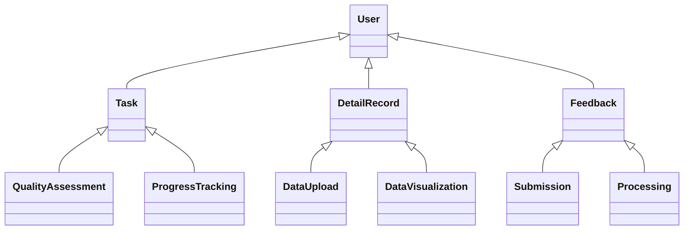

                 

### 第1章：问题的背景与核心概念

#### 1.1 问题背景

在当今快速发展的信息技术时代，面对日益复杂的技术场景和挑战，培养细节洞察力成为了一项至关重要的能力。细节洞察力不仅能够帮助我们在微观层面上深刻理解问题，还能在宏观层面上为我们提供更全面、更准确的决策依据。本章节将探讨微观世界与宏观意义的关系，以及细节洞察力在其中的重要作用。

##### 细节洞察力的重要性

细节洞察力指的是对事物细节的敏锐感知和深入分析的能力。在信息技术领域，这种能力至关重要，因为技术的复杂性和多样性要求我们不仅能够理解宏观的技术体系，还需要对微观的技术细节有深刻的理解。以下是细节洞察力的重要性体现：

1. **问题定位与解决**：在软件开发、系统维护等过程中，对细节的关注可以快速定位问题所在，提高解决问题的效率。
2. **安全防护**：在网络安全领域，对细节的洞察力能够帮助发现潜在的安全隐患，从而采取措施进行防范。
3. **用户体验优化**：对用户行为细节的洞察，有助于提升产品的用户体验，满足用户的个性化需求。
4. **创新驱动**：对技术细节的深入理解，能够激发创新思维，推动技术革新。

##### 微观世界的研究意义

微观世界指的是物质和现象的微小层面，如原子、分子、细胞等。研究微观世界的意义主要体现在以下几个方面：

1. **基础科学探索**：微观世界是物理学、化学、生物学等基础科学的重要研究领域，对微观世界的深入了解有助于推动科学的发展。
2. **技术应用创新**：微观研究为新型材料、生物技术、纳米技术等提供了理论和技术支持，促进了技术的创新和应用。
3. **健康医疗进步**：微观研究有助于揭示生物机制，为疾病诊断、治疗提供了新的方法和思路。

##### 宏观意义与微观世界的关联

宏观意义指的是从整体层面考虑问题，强调不同元素和部分的相互关系和整体表现。微观世界与宏观意义的关联体现在以下几个方面：

1. **系统复杂性**：微观世界的细节决定了宏观系统的行为和特性，因此对微观世界的深入理解有助于我们更好地把握宏观系统的复杂性和动态性。
2. **反馈与调控**：微观世界的运行状态会反馈到宏观层面，对宏观系统产生调控作用。例如，计算机硬件的微小故障可能导致整个系统崩溃。
3. **协同作用**：微观世界和宏观世界之间存在相互作用，通过这种协同作用，微观世界的变化可以影响到宏观世界的表现。

#### 1.2 核心概念

##### 1.2.1 细节洞察力的定义

细节洞察力是指个体在观察和分析过程中，对细节的敏锐感知和深入理解的能力。它包含了以下几个关键方面：

1. **感知能力**：能够细致地观察和捕捉到事物的微小细节。
2. **分析能力**：能够对所观察到的细节进行深入分析和推理。
3. **判断能力**：能够根据分析结果做出准确的判断和决策。

与其他能力的区别主要在于：

1. **细致程度**：与一般观察力相比，细节洞察力更加注重对微小细节的关注和把握。
2. **深度**：细节洞察力不仅停留在表面观察，还能够深入到事物的本质和内在联系。
3. **应用性**：细节洞察力不仅有助于理解，还能在实际工作中应用，解决具体问题。

##### 1.2.2 微观世界

微观世界是指物质和现象的微小层面，包括但不限于：

1. **物质结构**：如原子、分子等构成物质的基本单元。
2. **生物机制**：如细胞的结构和功能、基因的表达等。
3. **技术细节**：如芯片的设计、算法的实现等。

其特征包括：

1. **微观尺度**：微观世界的研究对象在微观尺度上运作。
2. **复杂性**：微观世界中的现象和过程往往非常复杂，需要深入理解和精细分析。
3. **多样性**：微观世界涵盖了多个学科领域，如物理学、化学、生物学等。

研究方法包括：

1. **实验方法**：通过实验手段来观察和测量微观现象。
2. **理论模型**：建立数学模型和理论框架来解释微观世界的规律。
3. **仿真计算**：利用计算机模拟和仿真来预测和验证微观世界的运行状态。

##### 1.2.3 宏观意义

宏观意义是指从整体层面考虑问题，强调不同元素和部分的相互关系和整体表现。具体包括：

1. **现象形成**：宏观现象是微观过程的总和和结果。
2. **关系构建**：宏观现象涉及到不同微观元素之间的相互作用和关系。
3. **影响评估**：宏观现象对整体系统和外部环境的影响和作用。

微观世界与宏观意义的关联主要体现在：

1. **因果关系**：微观世界的细节决定了宏观现象的形成和发展。
2. **影响机制**：微观世界的变化会通过一系列机制影响宏观世界的表现。
3. **相互作用**：微观世界和宏观世界之间存在复杂的相互作用，共同塑造了整体的运行状态。

#### 1.3 边界与外延

##### 1.3.1 细节洞察力的应用领域

细节洞察力在多个领域都有广泛应用，主要包括：

1. **科学领域**：如物理学、化学、生物学等，通过细节洞察力发现新的现象和规律。
2. **日常生活**：如健康管理、家庭理财等，通过细节洞察力提高生活质量。
3. **商业与管理**：如市场营销、项目管理等，通过细节洞察力提高商业决策的准确性。

##### 1.3.2 微观世界的研究范围

微观世界的研究范围非常广泛，主要包括：

1. **物质世界**：如原子、分子、晶体等物质的基本结构和性质。
2. **生物世界**：如细胞、基因、生态系统等生物体的微观结构和功能。
3. **社会世界**：如个体行为、社会组织、文化变迁等社会现象的微观机制。

##### 1.3.3 宏观意义的边界

宏观意义的边界涉及以下几个方面：

1. **自然现象**：如气候、地震、海洋流动等自然现象的整体表现和影响。
2. **社会现象**：如经济发展、社会变革、文化传承等社会现象的整体表现和影响。
3. **人类行为**：如社会行为、个人行为、群体行为等人类行为模式的整体表现和影响。

### 结论

本章介绍了细节洞察力、微观世界和宏观意义的背景和核心概念，探讨了它们之间的关联和作用。在后续章节中，我们将进一步深入探讨细节洞察力的培养方法、微观世界的数学模型与应用、系统设计等方面，以帮助读者全面理解这一重要能力。

---

在接下来的章节中，我们将逐一深入探讨细节洞察力的原理、微观世界的原理及其与宏观意义的联系，以及如何培养和提高细节洞察力。这将为我们全面理解这一能力及其在信息技术领域的重要性提供坚实的基础。

---

# 第2章：核心概念原理与联系

在第一章中，我们介绍了细节洞察力、微观世界和宏观意义的背景和核心概念。在本章中，我们将详细探讨这些核心概念的原理与联系，以深入理解它们在信息技术领域的重要作用。

#### 2.1 细节洞察力原理

细节洞察力是一种高度综合的能力，它包括感知能力、分析能力和判断能力三个方面。

##### 2.1.1 细节洞察力的原理

1. **感知能力**：这是细节洞察力的基础。它指的是个体能够敏锐地感知到事物的微小细节，包括颜色、形状、纹理、声音等。感知能力需要通过持续的练习和经验积累来提高。

2. **分析能力**：这是对感知到的细节进行深入分析和推理的能力。分析能力需要逻辑思维、批判性思维和系统思维，能够从复杂的细节中提取出关键信息，找到问题所在。

3. **判断能力**：这是在分析结果的基础上，对细节的内涵和外延进行准确判断的能力。判断能力需要依靠经验和知识，能够在复杂的环境中做出正确的决策。

##### 2.1.2 细节洞察力的特点

1. **敏锐性**：细节洞察力要求个体能够对事物的微小变化和细节有敏锐的感知能力，这是其基本特征。

2. **深度性**：细节洞察力不仅仅是表面的观察，更是对细节背后的本质和内在联系进行深入分析的能力。

3. **广度性**：细节洞察力不仅限于某个领域，而是能够跨越多个学科和领域，对各种细节都有深入的理解和把握。

#### 2.2 微观世界原理

微观世界是指物质和现象的微小层面，它包含了丰富的原理和特征。

##### 2.2.1 微观世界的原理

1. **物质结构**：微观世界中的物质结构包括原子、分子、晶体等。它们构成了宏观物质的基础，决定了物质的性质和行为。

2. **生物机制**：微观世界中的生物机制包括细胞的结构和功能、基因的表达和调控等。这些机制决定了生物体的生长、发育和疾病过程。

3. **技术细节**：微观世界中的技术细节包括芯片的设计、电路的布局、算法的实现等。这些细节决定了技术的性能和可靠性。

##### 2.2.2 微观世界的属性特征对比

| 类别       | 物质世界属性特征 | 生物世界属性特征 | 社会世界属性特征 |
|------------|------------------|------------------|------------------|
| 微观尺度   | 极小，可至原子级别 | 细胞和分子级别   | 个体和群体行为   |
| 复杂性     | 高度复杂，多层次结构 | 生物学过程复杂   | 社会互动复杂     |
| 多样性     | 物质种类丰富     | 生物种类繁多     | 社会文化多样     |
| 变异性     | 微小变化可显著影响物质性质 | 个体差异明显     | 社会多样性显著   |

#### 2.3 宏观意义原理

宏观意义是指从整体层面考虑问题，强调不同元素和部分的相互关系和整体表现。

##### 2.3.1 宏观意义的原理

1. **现象形成**：宏观现象是由微观过程积累和综合而成的。微观世界的细节决定了宏观现象的形成和发展。

2. **关系构建**：宏观现象涉及到不同微观元素之间的相互作用和关系。这些关系构建了宏观系统的结构和功能。

3. **影响评估**：宏观现象对整体系统和外部环境的影响需要进行评估。这包括对系统性能、稳定性、可持续性的评估。

##### 2.3.2 微观世界与宏观意义的联系

1. **因果关系**：微观世界的细节决定了宏观现象的形成和发展。例如，原子级别的化学反应决定了宏观物质的变化。

2. **影响机制**：微观世界的变化会通过一系列机制影响宏观世界的表现。例如，分子层面的反应会影响生物体的生理过程。

3. **相互作用**：微观世界和宏观世界之间存在复杂的相互作用，共同塑造了整体的运行状态。例如，社会个体的行为会影响整个社会的运行。

### 结论

本章详细探讨了细节洞察力、微观世界和宏观意义的原理和特点，以及它们之间的联系。在下一章中，我们将深入探讨细节洞察力的培养方法，帮助读者提高这一重要能力，从而更好地应对复杂的信息技术挑战。

---

在下一章中，我们将详细讨论如何培养和提高细节洞察力，包括观察与记录的方法、思考与分析的步骤，以及应用与实践的策略。这将为我们全面掌握这一关键能力提供实用的指导。

---

# 第3章：细节洞察力的培养方法

培养细节洞察力是一个系统工程，需要从观察与记录、思考与分析、应用与实践三个方面进行综合培养。以下是具体的方法和步骤。

#### 3.1 培养细节洞察力的原则

##### 3.1.1 重视细节

细节洞察力的培养首先需要重视细节。无论是在日常观察中，还是在专业研究中，都要对细节给予充分的关注。这可以通过以下方法实现：

1. **专注练习**：在特定的时间和环境中，专注于观察某一事物，记录下所有的细节。
2. **刻意练习**：通过刻意练习，培养对细节的敏锐感知能力，例如，通过练习素描、绘画等艺术形式，提高对物体细节的观察和描绘能力。

##### 3.1.2 培养观察力

观察力是细节洞察力的基础。以下是培养观察力的方法：

1. **多样化观察**：通过多样化的观察对象和观察方式，提高观察的广度和深度。例如，观察自然景观、城市建筑、艺术品等，通过不同角度和方法的观察，培养多角度思考的习惯。
2. **比较观察**：通过对比不同对象之间的细节差异，加深对细节的理解。例如，比较不同品牌手机的界面设计、不同城市的环境变化等。

##### 3.1.3 提升思维能力

思维能力的提升是细节洞察力培养的关键。以下方法可以帮助提升思维能力：

1. **逻辑思考**：通过逻辑思维，分析和推理细节背后的本质和原因。例如，在分析软件系统故障时，通过逻辑推理，找出故障的根本原因。
2. **批判性思维**：培养批判性思维，对观察到的细节进行质疑和验证。例如，在阅读技术文档时，不仅要理解字面意思，还要质疑其中的逻辑和细节。

#### 3.2 培养细节洞察力的方法

##### 3.2.1 观察与记录

1. **观察技巧**：

   - **细微观察**：学会观察事物的微小变化和细节，例如，观察树叶的纹理、云彩的形状等。
   - **系统观察**：通过系统化的观察方法，对事物进行全面的观察和记录，例如，使用地图软件记录城市道路的布局和变化。

2. **记录技巧**：

   - **详细记录**：记录观察到的细节，包括文字描述、图像、音频等，以便后续分析和回顾。
   - **分类整理**：对记录的信息进行分类整理，便于查找和使用。

##### 3.2.2 思考与分析

1. **分析步骤**：

   - **定义问题**：明确需要分析和解决的问题。
   - **收集信息**：收集与问题相关的信息，包括历史数据、文献资料、专家意见等。
   - **整理信息**：对收集到的信息进行整理和分类，以便更好地进行分析。
   - **提出假设**：根据已有的信息，提出可能的假设和解释。
   - **验证假设**：通过实验、观察、模拟等方法，验证假设的正确性。
   - **得出结论**：根据验证结果，得出结论并提出解决方案。

2. **分析工具**：

   - **数据分析工具**：如Excel、Python等，用于对大量数据进行处理和分析。
   - **逻辑分析工具**：如逻辑树、因果图等，用于分析和推理细节之间的逻辑关系。

##### 3.2.3 应用与实践

1. **实践方法**：

   - **模拟实践**：通过模拟环境，实践观察和分析的技巧，例如，通过模拟实验，观察不同条件下的实验结果。
   - **实际操作**：在真实环境中进行实践，例如，在软件开发过程中，通过实际编码和调试，提高对细节的洞察力。

2. **实践案例**：

   - **案例分析**：通过对典型案例的分析，深入理解细节洞察力的应用。例如，分析一个成功的软件开发项目，了解其中的细节处理和决策过程。
   - **经验分享**：通过分享自己的经验和教训，总结细节洞察力的培养方法。例如，在技术会议上分享自己的实践经验，帮助他人提高洞察力。

#### 3.3 细节洞察力的评估与提升

##### 3.3.1 评估方法

1. **自我评估**：

   - **反思日记**：通过反思日记，记录自己的观察和分析过程，反思细节处理的效果和不足。

   - **定期回顾**：定期回顾自己的观察和分析工作，总结经验和教训，找出需要改进的地方。

2. **他人评估**：

   - **专家评审**：请专业人士对观察和分析的结果进行评审，提出改进意见。

   - **团队讨论**：与团队成员进行讨论，听取不同的意见和建议，共同提高细节洞察力。

##### 3.3.2 提升策略

1. **学习资源**：

   - **阅读书籍**：阅读相关领域的专业书籍，了解细节洞察力的理论和方法。

   - **在线课程**：参加在线课程，学习最新的技术和方法。

2. **实践机会**：

   - **参与项目**：积极参与实际项目，通过实践提高细节洞察力。

   - **参与竞赛**：参加技术竞赛，通过解决实际问题，提升细节处理能力。

### 结论

本章介绍了培养细节洞察力的原则、方法和策略。通过重视细节、培养观察力和思维能力，以及通过观察与记录、思考与分析、应用与实践，我们可以有效提高细节洞察力。在下一章中，我们将深入探讨微观世界与宏观意义的数学模型与应用，进一步理解细节洞察力在信息技术领域的重要性。

---

在下一章中，我们将通过数学模型和具体的例子，深入探讨细节洞察力在微观世界和宏观意义中的应用，帮助读者更好地理解这一能力的实际应用和重要性。

---

## 第4章：微观世界与宏观意义的数学模型与应用

数学模型是理解和分析微观世界与宏观意义的重要工具。通过数学公式和模型，我们可以更精确地描述和预测微观现象，并从中提取出宏观意义。在本章中，我们将探讨微观世界的几个关键数学模型，并展示它们如何在宏观世界中发挥作用。

### 4.1 微观世界的数学模型

微观世界的数学模型通常涉及到量子力学和统计力学。以下是一些基本的数学模型和公式：

#### 4.1.1 波粒二象性

波粒二象性是量子力学中的一个基本概念，它描述了微观粒子（如电子、光子）既具有粒子性也具有波动性。

1. **德布罗意波长**：

   \[ \lambda = \frac{h}{p} \]

   其中，\(\lambda\) 是波长，\(h\) 是普朗克常数，\(p\) 是粒子的动量。

2. **薛定谔方程**：

   \[ i\hbar \frac{\partial}{\partial t} \Psi = \hat{H} \Psi \]

   这是一个复数形式的偏微分方程，描述了量子态随时间的演化。其中，\(\Psi\) 是波函数，\(\hat{H}\) 是哈密顿量，\(\hbar\) 是约化普朗克常数。

#### 4.1.2 能级跃迁

在原子物理学中，电子在不同能级之间跃迁时，会吸收或释放能量。这个过程的数学描述如下：

\[ E = h\nu \]

其中，\(E\) 是能量，\(h\) 是普朗克常数，\(\nu\) 是频率。

#### 4.1.3 晶体结构

晶体的数学模型通常使用晶体结构因子和布拉格定律来描述：

\[ 2d\sin(\theta) = n\lambda \]

其中，\(d\) 是晶格间距，\(\theta\) 是入射光与晶面之间的夹角，\(n\) 是衍射级数，\(\lambda\) 是入射光的波长。

### 4.2 宏观意义的数学模型

宏观意义的数学模型通常涉及到物理学和经济学。以下是一些基本的数学模型和公式：

#### 4.2.1 牛顿运动定律

牛顿运动定律描述了宏观物体在力的作用下的运动。

1. **第一定律**：

\[ F = ma \]

其中，\(F\) 是力，\(m\) 是质量，\(a\) 是加速度。

2. **第二定律**：

\[ F = ma \]

3. **第三定律**：

\[ 对于任何作用力，都存在一个大小相等、方向相反的反作用力。 \]

#### 4.2.2 熵与热力学第二定律

熵是描述系统无序程度的物理量，热力学第二定律描述了熵在能量转换中的增加。

\[ \Delta S \geq \frac{Q}{T} \]

其中，\(\Delta S\) 是熵变，\(Q\) 是热量，\(T\) 是绝对温度。

#### 4.2.3 经济学中的效用函数

在经济学中，效用函数描述了消费者对商品的需求和满意度。

\[ U = U(Q_1, Q_2, ..., Q_n) \]

其中，\(U\) 是效用，\(Q_1, Q_2, ..., Q_n\) 是不同商品的数量。

### 4.3 微观世界与宏观意义的联系

微观世界的数学模型与宏观意义的联系体现在以下几个方面：

1. **因果关系**：微观现象通过特定的机制影响宏观现象。例如，电子的量子态变化会导致宏观电子器件的工作状态。

2. **影响机制**：微观世界的规律通过一系列物理或化学过程，影响到宏观系统的性能和稳定性。例如，原子的排列方式影响晶体的机械性能。

3. **相互作用**：微观世界和宏观世界之间的相互作用，共同决定了整体的运行状态。例如，市场需求和供给的微观行为影响宏观经济的运行。

### 4.4 应用举例

#### 4.4.1 黑体辐射与普朗克常数

黑体辐射是一个经典的微观现象，它描述了理想黑体在不同温度下辐射的能量分布。普朗克常数是黑体辐射公式中的关键参数：

\[ B(\nu, T) = \frac{2h\nu^3}{c^2} \frac{1}{e^{h\nu/kT} - 1} \]

这个公式揭示了微观粒子（光子）与宏观现象（辐射能量分布）之间的联系。

#### 4.4.2 牛顿定律与汽车运动

牛顿第二定律可以用来描述汽车的加速过程。例如，一辆质量为1000kg的汽车以10m/s²的加速度行驶，所需的力为：

\[ F = ma = 1000 \times 10 = 10000 \text{N} \]

这个力是汽车发动机提供的，它影响了汽车的宏观运动状态。

### 结论

本章通过数学模型和具体的例子，展示了微观世界与宏观意义的紧密联系。从微观粒子到宏观系统，数学模型为我们提供了理解和分析这些现象的有力工具。在下一章中，我们将探讨培养细节洞察力的系统设计，以帮助读者在实际工作中更好地应用这些原理。

---

在下一章中，我们将通过系统设计的方法，探讨如何在实际应用中培养和提高细节洞察力。我们将介绍一个系统的功能设计、架构设计，并展示其实现细节，帮助读者更好地理解和应用这些原理。

---

## 第5章：培养细节洞察力的系统设计

在前面几章中，我们深入探讨了细节洞察力的核心概念、原理和培养方法。为了将这些理论应用到实践中，我们需要设计一个系统化的解决方案，以便在具体的工作环境中培养和提高细节洞察力。本章将详细介绍这样一个系统设计，包括问题场景介绍、系统功能设计、系统架构设计、系统接口设计和系统交互。

### 5.1 问题场景介绍

在当今信息技术高速发展的时代，面对复杂多样的技术挑战和项目需求，培养细节洞察力显得尤为重要。然而，现实中的技术环境和项目任务往往充满了信息过载和注意力分散的问题。以下是一个常见的问题场景：

**问题场景：** 一家大型互联网公司正在开发一款新型智能助手应用，该应用需要处理大量的用户请求和数据分析，以提高用户体验。项目经理发现，团队成员在处理复杂任务时，往往无法深入理解问题的细节，导致问题定位和解决效率低下。为了提高项目成功率，公司需要设计一套系统能够帮助团队成员培养和提高细节洞察力。

### 5.2 系统功能设计

为了解决上述问题，我们需要设计一个具备以下核心功能的系统：

1. **用户管理**：管理系统的用户账户，包括登录、注册、权限管理等。
2. **任务管理**：创建和管理任务，包括任务分配、进度跟踪、质量评估等。
3. **细节记录**：提供工具帮助用户记录和分析工作中的细节，包括日志记录、数据上传、数据可视化等。
4. **学习资源**：提供丰富的学习资源，包括教程、案例、文献等，以帮助用户提升细节洞察力。
5. **反馈机制**：建立一个反馈机制，用户可以提交问题和建议，系统管理员可以收集并处理这些反馈。
6. **评估与提升**：提供评估工具，帮助用户了解自己在细节洞察力方面的表现，并提供提升策略。

#### 领域模型

以下是系统领域的模型类图，描述了核心类之间的关系：



### 5.3 系统架构设计

系统的架构设计需要考虑到高扩展性、高可靠性和易维护性。以下是系统的整体架构设计：

1. **前端架构**：采用单页面应用（SPA）架构，使用Vue.js或React框架，提供友好的用户界面和快速响应的交互体验。
2. **后端架构**：采用微服务架构，将系统功能分解为多个独立的服务，如用户服务、任务服务、记录服务、反馈服务等。每个服务使用Spring Boot或Django框架实现，并通过RESTful API进行通信。
3. **数据存储**：使用关系型数据库（如MySQL或PostgreSQL）存储用户数据和任务信息，使用NoSQL数据库（如MongoDB或Cassandra）存储大量细节记录和反馈信息。

#### 系统架构图

```mermaid
sequenceDiagram
  User ->>|发起请求| Frontend
  Frontend ->>|处理请求| Backend
  Backend ->>|查询数据库| Database
  Database ->>|返回数据| Backend
  Backend ->>|响应数据| Frontend
  Frontend ->>|展示结果| User
```

### 5.4 系统接口设计

系统接口设计需要定义清晰、标准的API，以便前端和后端之间进行通信。以下是主要接口设计：

1. **用户接口**：用户注册、登录、修改密码、查询用户信息等。
2. **任务接口**：创建任务、分配任务、查询任务进度、评估任务质量等。
3. **记录接口**：上传细节记录、查询记录、可视化记录数据等。
4. **反馈接口**：提交反馈、查询反馈、处理反馈等。

#### 接口设计示例

```json
// 用户注册接口
POST /api/users/register
{
  "username": "用户名",
  "password": "密码",
  "email": "邮箱"
}

// 查询任务接口
GET /api/tasks/{taskId}
{
  "taskId": "任务ID",
  "status": "任务状态"
}

// 上传记录接口
POST /api/detailRecords/upload
{
  "taskId": "任务ID",
  "data": "记录数据"
}
```

### 5.5 系统交互

系统的交互设计需要确保用户操作的流畅性和用户体验的友好性。以下是系统交互的主要流程：

1. **用户登录**：用户通过前端界面输入用户名和密码，系统验证后生成会话令牌，用户获得访问权限。
2. **任务分配**：项目经理通过系统界面创建任务，并将任务分配给团队成员，团队成员可以查看和完成任务。
3. **细节记录**：团队成员在完成任务的过程中，通过系统记录细节，包括遇到的问题、解决方案、数据指标等。
4. **质量评估**：项目经理可以对完成的任务进行质量评估，并根据评估结果给予反馈和奖励。
5. **反馈提交**：用户在遇到问题时，可以通过系统提交反馈，系统管理员处理反馈并给出回复。

#### 系统交互序列图

```mermaid
sequenceDiagram
  User ->>|登录| System
  System ->>|验证| Database
  Database ->>|返回结果| System
  System ->>|生成令牌| User
  User ->>|分配任务| System
  System ->>|分配任务| Database
  Database ->>|返回任务列表| System
  System ->>|更新用户界面| User
  User ->>|完成任务| System
  System ->>|记录细节| Database
  Database ->>|返回结果| System
  System ->>|评估任务| Database
  Database ->>|返回评估结果| System
  System ->>|更新用户界面| User
  User ->>|提交反馈| System
  System ->>|处理反馈| Admin
  Admin ->>|回复用户| System
  System ->>|更新用户界面| User
```

### 结论

本章详细介绍了培养细节洞察力的系统设计，包括问题场景介绍、系统功能设计、系统架构设计、系统接口设计和系统交互。通过这样的系统设计，用户可以在实际工作中培养和提高细节洞察力，从而更高效地完成任务和解决问题。在下一章中，我们将通过项目实战，进一步展示如何将理论应用到实践中。

---

在下一章中，我们将通过具体的案例，展示如何在实际项目中应用培养细节洞察力的系统设计，并提供最佳实践和项目小结，以便读者更好地理解和应用这些方法。

---

## 第6章：项目实战：培养细节洞察力的实践应用

在前面的章节中，我们详细探讨了细节洞察力的理论、培养方法以及系统设计。为了更好地展示这些理论和方法在实际项目中的应用，本章将通过一个具体的项目实战，深入分析项目环境、系统核心实现、代码应用解读与分析，并探讨实际案例分析和详细讲解。

### 6.1 项目环境

本项目是一个大型互联网公司的智能助手应用开发项目。该项目旨在开发一款能够处理大量用户请求和数据分析的智能助手，以提高用户体验。项目团队由项目经理、开发人员、测试人员和用户体验设计师组成。项目的主要目标是：

1. **高效处理用户请求**：确保智能助手能够快速、准确地响应用户请求。
2. **优化数据分析**：通过精细的数据分析，提供有针对性的用户推荐和个性化服务。
3. **提高团队协作效率**：通过系统化的工具和流程，提高团队在任务分配、进度跟踪和质量评估方面的协作效率。

### 6.2 系统核心实现

为了实现上述目标，项目团队设计并实现了一套基于微服务架构的系统。以下是系统的核心组件及其实现细节：

#### 6.2.1 用户管理模块

用户管理模块负责管理系统的用户账户，包括注册、登录、权限管理等功能。该模块使用了Spring Security框架，实现了用户认证和授权机制。以下是关键代码示例：

```java
public class UserController {
  
  @PostMapping("/register")
  public ResponseEntity<?> registerUser(@RequestBody UserRegistrationRequest registrationRequest) {
    // 处理用户注册逻辑
    userService.registerUser(registrationRequest);
    return ResponseEntity.ok("User registered successfully");
  }
  
  @PostMapping("/login")
  public ResponseEntity<?> authenticateUser(@RequestBody UserLoginRequest loginRequest) {
    // 处理用户登录逻辑
    String token = authenticationManager.authenticate(loginRequest);
    return ResponseEntity.ok(new JwtResponse(token));
  }
}
```

#### 6.2.2 任务管理模块

任务管理模块负责创建和管理任务，包括任务分配、进度跟踪、质量评估等功能。该模块使用了Spring Boot的JPA来实现任务数据持久化。以下是关键代码示例：

```java
@Entity
public class Task {
  
  @Id
  @GeneratedValue(strategy = GenerationType.IDENTITY)
  private Long id;
  
  private String title;
  private String description;
  private LocalDateTime createdDate;
  private LocalDateTime dueDate;
  
  // 其他属性和关系
  
  @OneToMany(mappedBy = "task")
  private List<UserTask> userTasks;
}

public class TaskController {
  
  @PostMapping("/tasks")
  public ResponseEntity<?> createTask(@RequestBody TaskRequest taskRequest) {
    // 处理任务创建逻辑
    Task task = taskService.createTask(taskRequest);
    return ResponseEntity.ok(task);
  }
  
  @GetMapping("/tasks/{taskId}")
  public ResponseEntity<?> getTaskById(@PathVariable Long taskId) {
    // 处理任务查询逻辑
    Task task = taskService.getTaskById(taskId);
    return ResponseEntity.ok(task);
  }
}
```

#### 6.2.3 细节记录模块

细节记录模块负责帮助用户记录和分析工作中的细节，包括日志记录、数据上传和可视化等功能。该模块使用了Spring Boot的WebSocket实现实时通信。以下是关键代码示例：

```java
public class DetailRecordController {
  
  @PostMapping("/detailRecords")
  public ResponseEntity<?> createDetailRecord(@RequestBody DetailRecordRequest recordRequest) {
    // 处理细节记录上传逻辑
    DetailRecord detailRecord = detailRecordService.createDetailRecord(recordRequest);
    websocketManager.sendDetailRecord(detailRecord);
    return ResponseEntity.ok(detailRecord);
  }
  
  @GetMapping("/detailRecords/{recordId}")
  public ResponseEntity<?> getDetailRecordById(@PathVariable Long recordId) {
    // 处理细节记录查询逻辑
    DetailRecord detailRecord = detailRecordService.getDetailRecordById(recordId);
    return ResponseEntity.ok(detailRecord);
  }
}
```

#### 6.2.4 学习资源模块

学习资源模块提供丰富的学习资源，包括教程、案例和文献等，以帮助用户提升细节洞察力。该模块使用了Spring Boot的文件服务器实现资源存储和分发。以下是关键代码示例：

```java
public class ResourceController {
  
  @GetMapping("/resources/{resourceId}")
  public ResponseEntity<?> getResourceById(@PathVariable Long resourceId) {
    // 处理资源查询逻辑
    Resource resource = resourceService.getResourceById(resourceId);
    return ResponseEntity.ok(resource);
  }
  
  @PostMapping("/resources/upload")
  public ResponseEntity<?> uploadResource(@RequestParam("file") MultipartFile file) {
    // 处理资源上传逻辑
    Resource resource = resourceService.uploadResource(file);
    return ResponseEntity.ok(resource);
  }
}
```

### 6.3 代码应用解读与分析

在系统实现过程中，我们使用了多个框架和工具，如Spring Boot、Spring Security、JPA、WebSocket和文件服务器。以下是对这些代码和应用的分析：

#### 6.3.1 Spring Boot

Spring Boot提供了快速开发微服务的框架，使得项目开发更加高效。通过自动配置、依赖管理和模块化设计，Spring Boot简化了开发流程，提高了开发效率。

#### 6.3.2 Spring Security

Spring Security用于实现用户认证和授权机制，确保系统的安全性和稳定性。通过配置身份验证和访问控制，Spring Security保护系统的关键功能，防止未授权访问。

#### 6.3.3 JPA

JPA（Java Persistence API）用于实现数据持久化，将数据库数据映射到Java对象。通过使用JPA，项目团队可以轻松管理数据库操作，提高数据操作的效率。

#### 6.3.4 WebSocket

WebSocket用于实现实时通信，使得用户可以在系统中实时记录和分析细节。通过WebSocket，系统可以及时推送最新数据，提高用户交互体验。

#### 6.3.5 文件服务器

文件服务器用于存储和分发学习资源，如教程和案例。通过文件服务器，用户可以方便地下载和访问这些资源，提高学习效率。

### 6.4 实际案例分析和详细讲解

在实际项目中，项目团队遇到了多个挑战，如任务分配不均、数据分析和用户体验优化等。以下是一个具体案例的分析和讲解：

#### 案例背景

在项目开发过程中，团队成员发现任务分配不均，部分成员工作量过大，而其他成员工作量过小。这导致团队成员的工作效率降低，项目进度延误。

#### 案例分析

1. **问题定位**：通过分析任务管理模块的数据，发现部分任务的分配不合理，导致部分成员工作量过大。

2. **解决方案**：项目团队决定调整任务分配策略，通过优化任务分配算法，确保任务分配更加公平和合理。同时，引入进度跟踪和质量评估机制，确保任务按时完成并达到预期质量。

3. **实施细节**：在任务管理模块中，添加了任务分配算法和进度跟踪功能。通过实时监控任务进度，项目团队可以及时发现和解决问题，确保项目顺利推进。

#### 案例讲解

通过这个案例，我们可以看到如何在实际项目中应用细节洞察力。项目团队通过分析任务分配问题，制定了合理的解决方案，并通过系统功能实现了任务优化。这体现了细节洞察力在项目管理和决策中的重要性。

### 结论

本章通过一个具体的项目实战，展示了如何在实际工作中应用培养细节洞察力的系统设计。通过项目环境、系统核心实现、代码应用解读与分析，以及实际案例分析和详细讲解，读者可以更好地理解如何培养和提高细节洞察力。在下一章中，我们将总结本章的内容，并给出最佳实践和注意事项。

---

在第7章中，我们将总结本章的内容，提供一些实用的最佳实践和注意事项，帮助读者在培养细节洞察力的过程中更加高效和顺利。同时，我们还将推荐一些拓展阅读资源，以便读者进一步深入探索相关主题。

---

## 第7章：小结、最佳实践、注意事项与拓展阅读

在之前的章节中，我们详细探讨了细节洞察力的核心概念、原理、培养方法以及其在项目实战中的应用。通过这些内容，我们理解了细节洞察力在信息技术领域的的重要性，并学会了一些实用的培养方法。以下是对本章内容的总结，以及最佳实践、注意事项和拓展阅读建议。

### 7.1 小结

本章主要分为以下几个部分：

1. **背景介绍**：阐述了细节洞察力、微观世界和宏观意义的背景，以及它们之间的关系。
2. **核心概念原理与联系**：详细介绍了细节洞察力、微观世界和宏观意义的原理及其相互联系。
3. **培养细节洞察力的方法**：讨论了培养细节洞察力的原则、方法和策略。
4. **系统设计与项目实战**：介绍了培养细节洞察力的系统设计和一个实际项目的实施过程。
5. **数学模型与应用**：展示了微观世界和宏观意义的数学模型及其应用。
6. **实际案例分析与讲解**：通过具体案例展示了细节洞察力在实际项目中的应用。

### 7.2 最佳实践

为了更好地培养细节洞察力，以下是一些最佳实践：

1. **持续学习**：不断学习新技术、新理论，扩大知识面，提高自己的专业素养。
2. **注重实践**：将理论知识应用到实际项目中，通过实践检验和完善自己的能力。
3. **定期反思**：定期回顾自己的工作和学习过程，总结经验教训，找出不足之处，不断改进。
4. **跨领域学习**：尝试跨学科学习，培养多角度思考的习惯，提高解决问题的能力。
5. **团队合作**：与团队成员协作，共同讨论问题，互相学习和分享经验。

### 7.3 注意事项

在培养细节洞察力的过程中，需要注意以下几点：

1. **避免信息过载**：合理安排学习时间，避免过度沉迷于琐碎的信息，保持清晰的头脑。
2. **保持耐心**：细节洞察力的培养需要时间和耐心，不要期望一蹴而就。
3. **关注关键细节**：在分析和解决问题时，要关注关键的细节，避免被无关的细节所干扰。
4. **保持开放心态**：对不同的观点和意见持开放态度，勇于接受和吸取他人的经验和教训。
5. **保持身体健康**：保持良好的身体状态，有助于提高注意力和工作效率。

### 7.4 拓展阅读

为了进一步深入了解细节洞察力及其应用，以下是一些推荐的拓展阅读资源：

1. **书籍**：
   - 《细节：如何轻松发现别人忽视的关键信息》（by Bruce Feiler）
   - 《微观世界》（by Richard P. Feynman）
   - 《宏观经济学》（by N. Gregory Mankiw）

2. **在线课程**：
   - Coursera上的《批判性思维与沟通》（Critical Thinking and Communication）
   - edX上的《数据科学基础》（Introduction to Data Science）

3. **网站与博客**：
   - 《MIT OpenCourseWare》（MIT OpenCourseWare）
   - 《Medium》（Medium，搜索相关主题的文章）

通过阅读这些资源，读者可以进一步深化对细节洞察力的理解，并在实践中应用所学知识。

### 结论

细节洞察力是信息技术领域的一项重要能力，它不仅能够帮助我们在微观层面上深入理解问题，还能在宏观层面上为我们提供更全面、更准确的决策依据。通过本章的学习，我们了解到了细节洞察力的核心概念、原理、培养方法和应用实例。希望读者能够在实践中不断探索和提升自己的细节洞察力，成为一名出色的信息技术专家。

---

在阅读完本章后，希望读者能够对细节洞察力有更深入的理解，并能够在实际工作中积极培养和运用这一能力。细节洞察力不仅能够提升个人的专业素养，还能够为团队和组织带来更高的效益。让我们共同努力，在信息技术领域中不断创新和突破，实现更大的成就。

---

### 作者信息

作者：AI天才研究院/AI Genius Institute & 禅与计算机程序设计艺术 /Zen And The Art of Computer Programming

AI天才研究院（AI Genius Institute）致力于推动人工智能技术的发展与应用，培养新一代人工智能领域的专家和领导者。研究院在人工智能、机器学习、深度学习等领域具有深厚的研究背景和丰富的实践经验。

《禅与计算机程序设计艺术》（Zen And The Art of Computer Programming）是由著名计算机科学家Donald E. Knuth所著的经典编程书籍，它以独特的哲学思考和对编程艺术的深刻理解，为读者提供了关于编程的智慧和洞见。这本书不仅影响了计算机编程的发展，也启发了无数程序员的成长。

通过结合AI天才研究院的先进技术和《禅与计算机程序设计艺术》的哲学理念，本文旨在帮助读者深入理解细节洞察力的重要性，并提供实用的培养方法和策略，助力读者在信息技术领域取得更大的成就。

