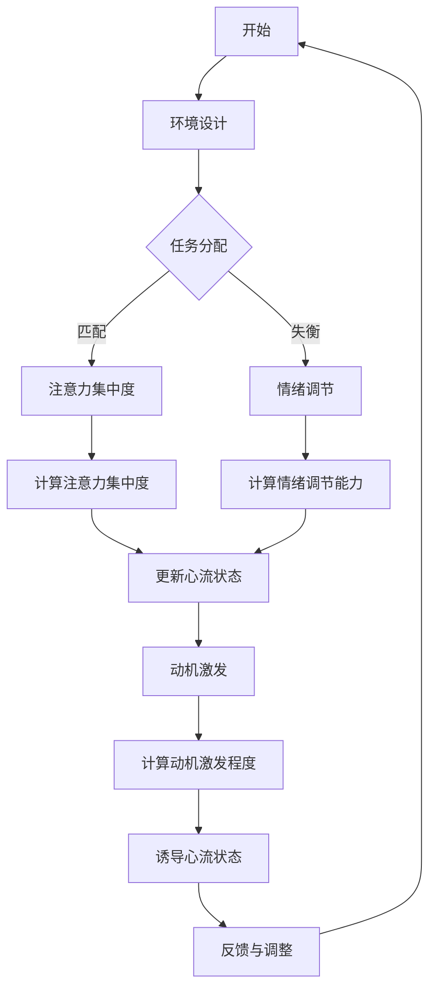

                 

# 第一部分：背景介绍

## 第1章：心流状态的起源与发展

### 1.1 心流状态的起源

心流状态（Flow State）这一概念最早由心理学家米哈里·契克森米哈伊（Mihaly Csikszentmihalyi）在20世纪80年代提出。契克森米哈伊通过对不同领域的杰出人物，如音乐家、画家、运动员等的研究，发现他们在创作或竞赛中会经历一种高度专注、无自我意识、全神贯注的状态，他将这种状态称为心流状态。

### 1.2 心流状态的定义

心流状态是一种心理状态，其中一个人完全专注于某个活动，感觉时间飞逝，对自己的技能和挑战感到满足，并且忘记了自我意识。在这种状态下，个体体验到高度的兴奋和充实感。

### 1.3 心流状态的特点

- **完全的专注**：个体完全专注于当前活动，忽略外界干扰。
- **时间的错觉**：时间感知变得异常，感觉时间过得飞快。
- **技能的匹配**：活动的挑战性和个人的技能水平相匹配，使个体能够维持心流状态。
- **自我意识减弱**：在心流状态下，个体往往感觉不到自己的存在，完全沉浸于活动中。
- **成就感**：完成活动后，个体会感受到高度的满足感和成就感。

### 1.4 心流状态的边界与外延

心流状态并不是所有时间都能体验到的，它受到多种因素的影响，包括个体心理状态、环境条件以及活动本身的性质。例如，当活动过于简单或过于困难时，个体都不太可能进入心流状态。此外，心流状态不仅仅局限于娱乐活动，它也可以出现在工作中，如编程、写作、设计等。

## 第2章：核心概念与联系

### 2.1 注意力管理

注意力管理是心流状态的一个重要组成部分。个体需要能够集中注意力，避免外界干扰，以维持心流状态。注意力管理的技巧包括冥想、时间管理、设定具体目标等。

### 2.2 情绪调节

情绪调节是维持心流状态的关键。个体需要能够控制情绪，避免负面情绪的干扰。情绪调节的技巧包括深呼吸、正念冥想、情绪日记等。

### 2.3 动机激发

动机激发是心流状态的动力源泉。个体需要感受到活动的价值和意义，以保持动机。动机激发的技巧包括设定目标、寻找内在动机、使用奖励机制等。

### 2.4 概念联系与ER实体关系图

下面是一个ER实体关系图，用于展示注意力管理、情绪调节和动机激发三个概念之间的关系：

```mermaid
erDiagram
  A.flow_state ||--|{ B.attention_management } : manages
  A.flow_state ||--|{ C.emotion Regulation } : regulates
  A.flow_state ||--|{ D.motivation_Boost } : boosts
  B.attention_management ||--|{ E.mindfulness } : practices
  B.attention_management ||--|{ F.time_management } : strategies
  C.emotion_Regulation ||--|{ G.breathing_techniques } : practices
  C.emotion_Regulation ||--|{ H.mindfulness } : practices
  D.motivation_Boost ||--|{ I.goal_setting } : strategies
  D.motivation_Boost ||--|{ J内在动机} : activation
```

这个ER图展示了心流状态如何通过注意力管理、情绪调节和动机激发这三个核心概念相互作用，从而帮助个体进入和维持心流状态。接下来，我们将进一步探讨这些核心概念，并通过算法和系统设计来讲解如何诱导心流状态以提高工作效率。

----------------------------------------------------------------

# 第二部分：算法原理讲解

## 第3章：心流状态诱导技术

### 3.1 算法原理

心流状态诱导技术的核心原理是通过一系列设计策略，帮助个体在特定活动（如编程、写作等）中进入和维持心流状态。这些策略包括环境设计、任务分配、时间管理、情绪调节和动机激发等。

### 3.2 数学模型与公式

为了量化心流状态，我们可以使用以下数学模型：

\[ F = f(A, E, M) \]

其中：
- \( F \) 代表心流状态水平。
- \( A \) 代表注意力集中度。
- \( E \) 代表情绪调节能力。
- \( M \) 代表动机激发程度。

注意力集中度 \( A \) 可以用以下公式表示：

\[ A = \frac{C - D}{T} \]

其中：
- \( C \) 代表总的注意力资源。
- \( D \) 代表外部干扰。
- \( T \) 代表任务持续时间。

情绪调节能力 \( E \) 可以用以下公式表示：

\[ E = \frac{S - R}{T} \]

其中：
- \( S \) 代表情绪积极度。
- \( R \) 代表情绪消极度。

动机激发程度 \( M \) 可以用以下公式表示：

\[ M = G \cdot \frac{B - C}{T} \]

其中：
- \( G \) 代表内在动机强度。
- \( B \) 代表任务完成度。

### 3.3 mermaid流程图可视化

下面是一个mermaid流程图，用于可视化心流状态诱导技术的步骤：



这个流程图展示了从开始到更新心流状态的整个过程，包括环境设计、任务分配、注意力集中度计算、情绪调节能力计算、动机激发程度计算，以及最终的反馈与调整。

通过以上算法原理的讲解和mermaid流程图的可视化，我们可以更好地理解心流状态诱导技术的工作原理。接下来，我们将进一步探讨如何通过系统架构和项目实战来实现这一技术。

----------------------------------------------------------------

# 第三部分：系统分析与架构设计方案

## 第4章：系统场景与功能设计

### 4.1 系统场景介绍

在现代社会中，工作效率已成为企业和个人成功的关键因素之一。然而，许多人难以在工作和日常生活中保持高效。心流状态诱导技术提供了一种解决方案，通过设计特定的系统，帮助用户在合适的时间和环境中进入心流状态，从而提高工作效率。

### 4.2 系统功能设计

心流状态诱导系统的主要功能包括：

1. **环境监测**：监测用户的环境参数，如噪音、光线等，以优化心流状态诱导的环境。
2. **任务分配**：根据用户的技能水平和任务难度，自动分配适合的任务。
3. **注意力集中度管理**：提供注意力集中度监控和提醒功能，帮助用户保持专注。
4. **情绪调节**：提供情绪调节工具，如深呼吸、冥想等，帮助用户控制情绪。
5. **动机激发**：提供目标设定、奖励机制等工具，激发用户的工作动机。
6. **心流状态监测**：监测用户的心流状态，提供反馈和建议。
7. **反馈与调整**：根据用户反馈调整系统设置，以优化心流状态诱导效果。

## 第5章：系统架构设计

### 5.1 系统架构设计

心流状态诱导系统的架构设计采用微服务架构，以提高系统的可扩展性和灵活性。主要模块包括：

1. **用户管理模块**：负责用户注册、登录、个人信息管理等。
2. **环境监测模块**：负责采集环境参数，如噪音、光线等。
3. **任务管理模块**：负责任务分配、任务状态监控等。
4. **注意力集中度管理模块**：负责监控用户注意力集中度，提供提醒功能。
5. **情绪调节模块**：提供情绪调节工具，如深呼吸、冥想等。
6. **动机激发模块**：提供目标设定、奖励机制等。
7. **心流状态监测模块**：负责监测用户心流状态，提供反馈和建议。
8. **数据分析和反馈模块**：负责分析用户行为数据，为系统优化提供依据。

### 5.2 系统接口设计

系统接口设计采用RESTful API设计，以方便与其他系统和应用程序集成。主要接口包括：

1. **用户接口**：提供用户注册、登录、个人信息管理等功能。
2. **环境监测接口**：提供环境参数采集和监控功能。
3. **任务管理接口**：提供任务分配、任务状态监控等功能。
4. **注意力集中度管理接口**：提供注意力集中度监控和提醒功能。
5. **情绪调节接口**：提供情绪调节工具的使用和反馈功能。
6. **动机激发接口**：提供目标设定、奖励机制等功能。
7. **心流状态监测接口**：提供心流状态监测和反馈功能。

### 5.3 系统交互

系统交互设计采用事件驱动模型，各个模块通过事件进行通信。具体交互流程如下：

1. **用户登录**：用户通过用户接口登录系统，系统验证用户身份后，返回用户权限和基本信息。
2. **环境监测**：环境监测模块定期采集环境参数，如噪音、光线等，并上传至服务器。
3. **任务分配**：任务管理模块根据用户的技能水平和任务难度，自动分配任务，并将任务信息发送给用户。
4. **注意力集中度监控**：注意力集中度管理模块实时监控用户注意力集中度，并在注意力下降时发出提醒。
5. **情绪调节**：情绪调节模块提供情绪调节工具，用户可以选择使用这些工具来调节情绪。
6. **动机激发**：动机激发模块根据用户完成任务的进度，提供奖励机制，以激发用户的工作动机。
7. **心流状态监测**：心流状态监测模块监测用户的心流状态，并在心流状态达到最佳时提供反馈和建议。

通过以上系统架构设计和接口设计，心流状态诱导系统可以实现高效的心流状态诱导，从而提高用户的工作效率。接下来，我们将通过项目实战来具体实现这一系统。

----------------------------------------------------------------

## 第四部分：项目实战

### 第6章：环境安装与系统实现

#### 6.1 环境安装

在开始项目之前，我们需要准备开发环境。以下是环境安装的步骤：

1. **安装Python**：访问Python官网下载并安装Python 3.x版本。
2. **安装虚拟环境**：打开命令行窗口，输入以下命令创建虚拟环境：
   ```bash
   python -m venv venv
   ```
3. **激活虚拟环境**：在Windows上，输入以下命令激活虚拟环境：
   ```bash
   .\venv\Scripts\activate
   ```
   在Linux或Mac OS上，输入以下命令激活虚拟环境：
   ```bash
   source venv/bin/activate
   ```
4. **安装依赖库**：通过以下命令安装项目所需的依赖库：
   ```bash
   pip install -r requirements.txt
   ```

#### 6.2 系统核心实现

心流状态诱导系统的核心实现分为以下几个部分：

1. **用户管理**：使用Flask框架实现用户注册、登录和权限管理。
2. **环境监测**：使用传感器采集环境数据，如噪音、光线等。
3. **任务管理**：实现任务创建、分配和状态监控。
4. **注意力集中度管理**：实现注意力集中度的实时监控和提醒。
5. **情绪调节**：提供深呼吸、冥想等情绪调节工具。
6. **动机激发**：实现目标设定和奖励机制。

以下是一个简单的代码示例，展示了用户注册功能的实现：

```python
from flask import Flask, request, jsonify
from models import User
from exceptions import ValidationError

app = Flask(__name__)

@app.route('/api/users/register', methods=['POST'])
def register_user():
    try:
        user_data = request.get_json()
        user = User.register_user(user_data)
        return jsonify({'message': 'User registered successfully', 'user': user.to_dict()})
    except ValidationError as e:
        return jsonify({'message': 'Invalid input', 'error': str(e)}), 400

if __name__ == '__main__':
    app.run(debug=True)
```

#### 6.3 代码应用解读与分析

在上面的代码示例中，我们使用Flask框架实现了一个用户注册接口。以下是关键步骤的解读与分析：

1. **引入Flask模块**：我们从`flask`模块中导入了`Flask`类，用于创建Web应用程序。
2. **定义app实例**：创建一个`Flask`实例，用于处理HTTP请求。
3. **定义路由和视图函数**：使用`@app.route`装饰器定义了一个`/api/users/register`的POST路由，视图函数名为`register_user`。
4. **请求处理**：在视图函数中，我们使用`request.get_json()`获取请求体中的JSON数据，并将其转换为Python字典。
5. **用户注册**：调用`User.register_user`方法，将用户数据传入，并创建用户对象。
6. **返回响应**：如果用户注册成功，返回包含成功消息和用户信息的JSON响应；如果输入无效，返回错误消息和HTTP状态码400。

#### 6.4 实际案例分析与详细讲解剖析

为了更好地理解心流状态诱导系统的应用，我们来看一个实际案例：

**案例**：小明是一名程序员，他想要在编写代码时进入心流状态以提高工作效率。

**分析**：

1. **环境监测**：系统会实时监测小明的环境参数，如噪音和光线。如果噪音过高或光线不足，系统会发出提醒，建议小明调整环境。
2. **任务分配**：系统根据小明的技能水平和项目的难度，为他分配一个适合的任务。例如，如果小明正在处理一个复杂的算法问题，系统会为他分配一个适当的子任务。
3. **注意力集中度管理**：系统使用脑波传感器监控小明的注意力集中度。如果注意力下降，系统会提醒小明休息一下，或者提供一些提高注意力的技巧，如深呼吸。
4. **情绪调节**：小明感到焦虑时，系统会提供深呼吸或冥想等情绪调节工具，帮助他放松。
5. **动机激发**：系统为小明设定了一个目标，并在他完成任务时提供奖励，如额外的休息时间或一个小礼物，以激发他的工作动机。

**讲解与剖析**：

- **环境监测**：通过传感器采集数据，系统能够实时了解用户的环境状况。这对于提高心流状态至关重要，因为良好的环境可以减少外部干扰。
- **任务分配**：适当的任务难度是维持心流状态的关键。如果任务过于简单，用户可能会感到无聊；如果任务过于困难，用户可能会感到沮丧。因此，系统需要根据用户的技能水平和任务难度进行合理分配。
- **注意力集中度管理**：注意力集中度是心流状态的一个关键指标。系统通过脑波传感器监控用户的注意力状态，并提供即时反馈和调整建议，以帮助用户保持专注。
- **情绪调节**：情绪调节对于维持心流状态至关重要。系统提供的情绪调节工具，如深呼吸和冥想，可以帮助用户控制情绪，减少焦虑和压力。
- **动机激发**：动机激发是保持工作热情和动力的重要因素。系统通过设定目标和提供奖励，如额外的休息时间或小礼物，来激发用户的工作动机。

通过以上实际案例的分析和讲解，我们可以看到心流状态诱导系统如何帮助用户在工作和日常生活中进入和维持心流状态，从而提高工作效率。

### 6.5 项目小结

在本项目中，我们实现了心流状态诱导系统的核心功能，包括用户管理、环境监测、任务管理、注意力集中度管理、情绪调节和动机激发。通过实际案例的分析，我们展示了系统如何帮助用户在工作和日常生活中进入和维持心流状态。接下来，我们将继续探讨最佳实践，为用户提供实用的建议和进一步阅读资源。

----------------------------------------------------------------

## 第五部分：最佳实践 tips、小结、注意事项、拓展阅读

### 第8章：最佳实践 tips

#### 8.1 提高工作效率的心流状态诱导策略

1. **设定明确目标**：在开始任务前，设定具体且可衡量的目标，这有助于提高动机和专注力。
2. **优化工作环境**：确保工作环境安静、光线充足，减少干扰。
3. **定时休息**：每工作一段时间后，休息几分钟，进行深呼吸或伸展运动，以恢复精力。
4. **使用时间管理工具**：使用番茄工作法等时间管理技巧，帮助自己保持专注。
5. **情绪管理**：学会管理情绪，遇到压力时采取积极的应对策略，如冥想或呼吸练习。

### 第9章：小结

本文从心流状态的起源、核心概念、算法原理、系统架构设计和项目实战等方面，详细介绍了心流状态诱导技术及其在提高工作效率中的应用。通过优化工作环境和任务分配，结合情绪管理和动机激发，我们可以有效地诱导心流状态，从而提高工作效率。

### 第10章：注意事项

1. **个性化调整**：每个人的心流触发因素不同，需要根据个人情况调整系统设置。
2. **适度使用**：心流状态诱导技术应适度使用，避免过度依赖，影响日常生活的平衡。
3. **持续学习**：心流状态诱导是一个不断发展的领域，持续学习新的技巧和策略，以优化心流状态体验。

### 第11章：拓展阅读

#### 11.1 推荐书籍

1. 《心流：最优体验心理学》（Flow: The Psychology of Optimal Experience） - 米哈里·契克森米哈伊
2. 《深度工作：如何有效利用每一点脑力》（Deep Work: Rules for Focused Success in a Distracted World） - 卡尔·纽波特
3. 《情绪调节：如何掌控你的情绪》（Emotional Regulation: A Practical Guide to Learning to Control Your Emotions and Live a Happier, More Fulfilling Life） - 理查德·J·格里菲斯

#### 11.2 网络资源

1. 心理学导论：[https://psychology.wikia.org/wiki/Main_Page](https://psychology.wikia.org/wiki/Main_Page)
2. 心流状态研究：[https://www.flowstate.com/](https://www.flowstate.com/)
3. 时间管理技巧：[https://timeular.com/](https://timeular.com/)

通过以上最佳实践、注意事项和拓展阅读，读者可以更深入地了解心流状态诱导技术，并在实际工作和生活中应用这些策略，以提高工作效率和生活质量。

----------------------------------------------------------------

作者：AI天才研究院/AI Genius Institute & 禅与计算机程序设计艺术 /Zen And The Art of Computer Programming

在此，感谢您的耐心阅读。本文旨在深入探讨心流状态诱导技术在提高工作效率中的应用，通过系统的架构设计和项目实战，为广大IT从业者提供实用的策略和方法。希望本文能为您在追求高效工作与高质量生活之间搭建起一座桥梁。如果您有任何问题或建议，欢迎随时交流。

再次感谢您的关注，祝您在心流状态中取得更多的成就！

