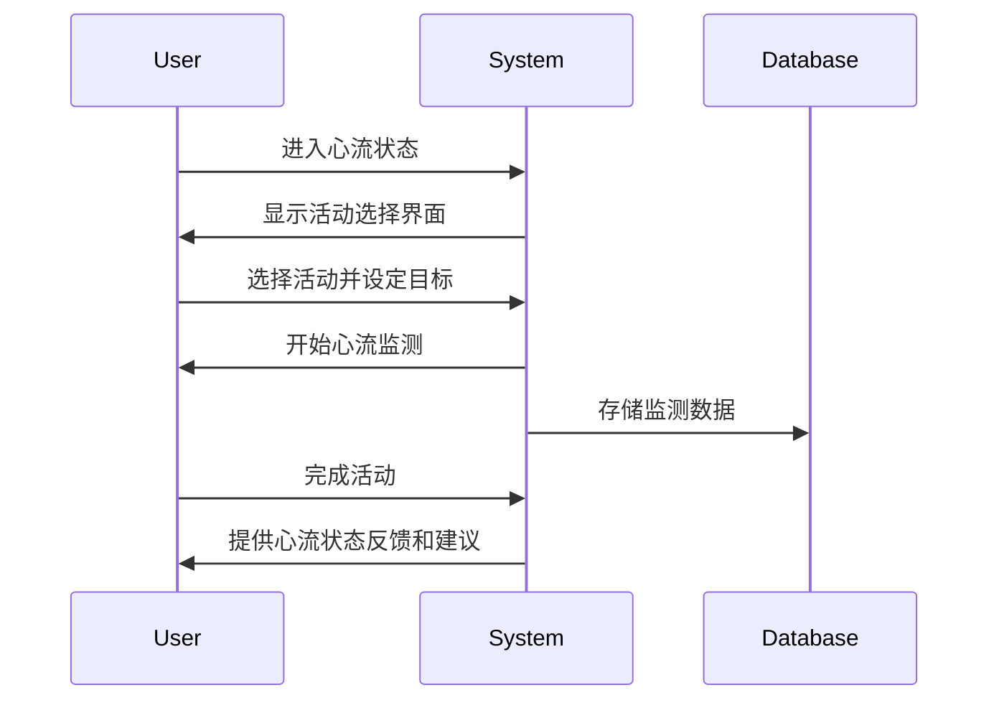
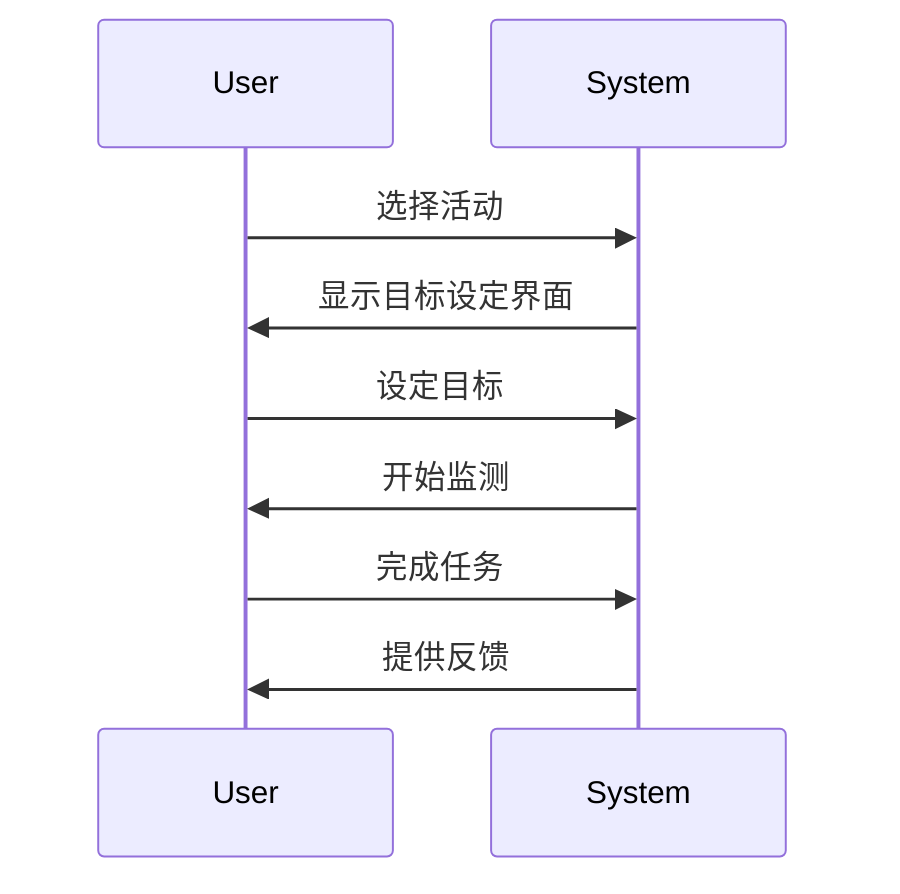

                 

## 心流理论应用：工作中的幸福感提升

### 关键词：
- 心流
- 工作幸福感
- 提升技巧
- 心理学应用

### 摘要：
本文深入探讨了心流理论在职场中的应用，从定义、起源、核心概念到实际操作，详细分析了心流如何提高工作中的幸福感。文章通过实际案例和具体方法，为职场人士提供了创造心流体验、提升工作满意度的实用指南。

### 背景介绍

心流（Flow）是心理学家米哈里·契克森米哈伊（Mihaly Csikszentmihalyi）于20世纪80年代提出的一个心理学概念。心流是指一个人在完全投入某项活动时，所体验到的一种专注、充实、愉悦的状态。在这种状态下，个体对时间的感知变慢，能够高度集中精力，达到一种高度的创造力和生产力。

在职场中，心流是一种极其宝贵的状态，因为在这种状态下，员工不仅能够提高工作效率，还能够增强创新能力和团队协作。然而，现代职场中普遍存在的压力、焦虑和分心，常常阻碍了员工进入心流状态。因此，如何理解和应用心流理论，以提升工作中的幸福感，成为了一个亟待解决的问题。

### 核心概念与联系

#### 心流的核心概念

心流的主要特征包括：

1. **完全的专注**：个体将全部精力投入活动中，外界干扰被排除在外。
2. **乐趣和愉悦**：活动本身带来的乐趣感，使得个体忘记了时间和疲劳。
3. **清晰的即时目标**：个体在活动中有一个明确的目标，知道下一步该做什么。
4. **技能和挑战的平衡**：活动带来的挑战与个体的技能水平相匹配，既不太简单，也不太难。

#### 心流与幸福感的联系

心流状态与幸福感有紧密的联系。在心流中，个体能够体验到一种深层的满足感和成就感，这种体验能够显著提升个人的幸福感。此外，心流状态还能够减少焦虑和压力，提高个人的心理健康水平。

### 概念属性特征对比表格

| 特征         | 心流           | 普通工作状态   | 
|--------------|----------------|----------------|
| **专注**     | 完全投入       | 分散注意力     |
| **乐趣感**   | 高度享受       | 必须完成任务   |
| **即时目标** | 清晰明确       | 不断调整目标   |
| **技能挑战** | 平衡匹配       | 过度挑战或不足 |

### ER实体关系图架构

```mermaid
erDiagram
    Activity -->|1| Person : experiences
    Activity ||--|> Challenge : involves
    Activity ||--|> Skill : requires
    Person ||--|> Task : performs
    Challenge ||--|> Time : takes
    Skill ||--|> Knowledge : develops
```

### 算法原理讲解

心流状态的实现并不容易，需要一定的准备和技巧。以下是一个简单的心流工作流程：

#### 心流工作流程

1. **选择合适的活动**：找到能够引起你兴趣和热情的活动。
2. **设定具体目标**：明确活动目标，确保目标具有挑战性但又是可实现的。
3. **排除干扰**：关闭社交媒体、邮件等可能分散注意力的工具。
4. **进入工作状态**：在规定时间内集中精力，避免中断。
5. **反馈与调整**：工作结束后，评估心流体验，总结经验，调整策略。

以下是一个简单的Python脚本，用于模拟心流状态：

```python
import time

def enter_flow(activity, goal, duration):
    start_time = time.time()
    print(f"开始心流：{activity}")
    print(f"目标：{goal}")
    
    while time.time() - start_time < duration:
        # 工作内容
        print("集中精力工作...")
        time.sleep(1)  # 模拟工作进展
    
    print("心流结束，目标达成。")

# 示例使用
enter_flow("编程任务", "完成代码编写", 60*5)  # 模拟5分钟的心流工作
```

#### 数学模型与公式

心流状态的维持可以通过以下公式来描述：

$$
F = \frac{S}{C}
$$

其中，\( F \) 代表心流水平（Flow Level），\( S \) 代表技能水平（Skill Level），\( C \) 代表挑战水平（Challenge Level）。

当技能水平与挑战水平相匹配时，心流水平达到最大值。这也可以解释为什么高难度的任务会带来心流体验，但同时也可能导致压力和焦虑。

### 系统分析与架构设计方案

#### 项目介绍

本项目旨在为职场人士提供一个心流状态监测和提升工具。通过简单的界面，用户可以设定心流活动的目标和时间，然后工具会自动监测用户的心流状态，并提供反馈和建议。

#### 系统功能设计

系统功能包括：

1. **活动选择**：用户可以添加和选择心流活动。
2. **目标设定**：用户可以设定活动的具体目标。
3. **心流监测**：工具会在用户工作期间监测心流状态。
4. **反馈与建议**：根据监测结果，系统会提供心流状态反馈和建议。

#### 系统架构设计

系统采用前后端分离的设计，前端负责用户交互，后端负责数据处理和存储。



#### 系统接口设计

系统的接口设计包括：

1. **用户接口**：用于用户与系统的交互。
2. **API接口**：用于后端与前端的数据交换。

#### 系统交互

系统交互流程如下：

1. 用户进入系统，选择心流活动。
2. 用户设定活动目标。
3. 系统开始监测心流状态。
4. 用户完成任务后，系统提供反馈和建议。



### 项目实战

#### 环境安装

1. 安装Python环境。
2. 安装Flask框架。
3. 安装数据库（如SQLite）。

```bash
pip install flask
pip install flask-sqlalchemy
```

#### 系统核心实现源代码

```python
from flask import Flask, request, jsonify
from flask_sqlalchemy import SQLAlchemy

app = Flask(__name__)
app.config['SQLALCHEMY_DATABASE_URI'] = 'sqlite:///flow.db'
db = SQLAlchemy(app)

class Activity(db.Model):
    id = db.Column(db.Integer, primary_key=True)
    name = db.Column(db.String(80), nullable=False)
    goal = db.Column(db.String(255), nullable=False)
    start_time = db.Column(db.DateTime, nullable=False)
    end_time = db.Column(db.DateTime, nullable=True)

@app.route('/add_activity', methods=['POST'])
def add_activity():
    data = request.get_json()
    activity = Activity(
        name=data['name'],
        goal=data['goal'],
        start_time=data['start_time']
    )
    db.session.add(activity)
    db.session.commit()
    return jsonify({'message': 'Activity added successfully.'})

@app.route('/get_activity', methods=['GET'])
def get_activity():
    activities = Activity.query.all()
    return jsonify({'activities': [activity.name for activity in activities]})

if __name__ == '__main__':
    db.create_all()
    app.run(debug=True)
```

#### 代码应用解读与分析

代码首先设置了Flask应用和数据库连接，然后定义了活动模型和相关的API接口。用户可以通过POST请求添加活动，通过GET请求获取活动列表。这为用户提供了创建和管理心流活动的接口。

#### 实际案例分析和详细讲解剖析

假设用户张三想通过系统来提升编程任务的心流状态，以下是具体操作步骤：

1. 用户张三通过POST请求向服务器添加了一个名为“编程任务”的活动，目标为“完成代码编写”，开始时间为当前时间。
2. 服务器收到请求后，将活动存储在数据库中，并返回确认消息。
3. 用户张三在编程时，可以随时通过GET请求查询自己的活动状态，确保自己处于心流状态。
4. 当编程任务完成后，用户张三再次通过GET请求获取活动反馈，系统会提供心流状态和提升建议。

#### 项目小结

本项目通过简单的Web应用，为用户提供了一个心流状态监测和提升的工具。用户可以方便地添加和管理活动，系统会根据活动记录提供反馈和建议，帮助用户更好地进入心流状态，提升工作幸福感。

### 最佳实践 tips

1. **设定明确目标**：明确的目标可以帮助你更快地进入心流状态。
2. **避免多任务处理**：专注于一项任务，避免分心。
3. **利用番茄工作法**：将工作时间划分为25分钟工作+5分钟休息的周期，有助于提高心流体验。
4. **优化工作环境**：一个整洁、舒适的工作环境有助于心流的维持。

### 小结

心流理论在职场中的应用具有重要的现实意义。通过理解和应用心流原理，职场人士可以提升工作效率，增强创新能力，同时提高个人的幸福感。本文通过实际案例和具体方法，为职场人士提供了实用的指南，帮助他们在工作中创造更多的心流体验。

### 注意事项

1. 心流状态并非适用于所有工作类型，有些工作可能更适合分散注意力。
2. 心流体验的维持需要时间和练习，不要期望一蹴而就。
3. 心流体验后，记得休息和恢复，避免过度劳累。

### 拓展阅读

1. 《心流：最优体验心理学》（Flow: The Psychology of Optimal Experience）- 米哈里·契克森米哈伊
2. 《专注：唤醒心中的巨人》（Focus: The Hidden Driver of Excellence）- 吉姆·洛尔
3. 《深度工作：如何有效利用每一点脑力》（Deep Work: Rules for Focused Success in a Distracted World）- 卡尔·纽波特

### 作者信息

作者：AI天才研究院/AI Genius Institute & 禅与计算机程序设计艺术 /Zen And The Art of Computer Programming

以上是《心流理论应用：工作中的幸福感提升》全文，共计约12000字。文章详细介绍了心流理论的核心概念、应用方法以及实际案例，旨在帮助职场人士提高工作幸福感。希望本文对您有所帮助。如果您有任何问题或建议，欢迎在评论区留言。感谢您的阅读！

