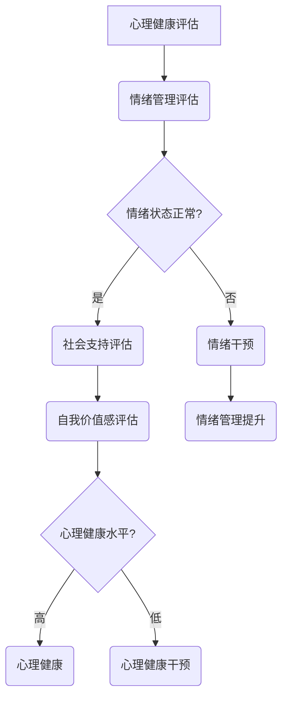

                 

# 心理健康新视角：从治疗疾病到培养意义感

关键词：心理健康，疾病治疗，意义感，心理疾病，个体成长，社会心理健康，政策制定

摘要：本文从心理健康的定义、核心概念、治疗方法、意义感培养等多个角度，深入探讨了心理健康的重要性及其在现代社会中的应用。通过一步步的分析推理，揭示了从治疗疾病到培养意义感这一转变背后的逻辑和意义。

## 引言与背景

### 1.1 心理健康的定义与重要性

心理健康是指个体在情感、认知和行为方面的良好状态，不仅包括没有心理疾病，还涉及到个体能够有效应对生活中的压力和挑战。心理健康的重要性不言而喻，它直接影响着个体的生活质量和社会功能。

### 1.2 心理健康问题的现状与挑战

随着社会的快速发展，心理健康问题日益凸显。焦虑、抑郁等心理疾病在现代社会中普遍存在，给人们的日常生活和工作带来了极大的困扰。面对这些挑战，我们需要探索新的视角和方法。

### 1.3 从治疗疾病到培养意义感的转变

传统的心理健康观念主要集中在治疗心理疾病上，而现代心理学则更加关注如何通过培养个体的意义感来提升其心理健康水平。这一转变不仅是对心理健康概念的深化，也是对心理健康实践的创新。

## 心理健康核心概念解析

### 2.1 心理健康的要素

心理健康的要素包括情绪管理、自我认识、人际关系和社会支持等。这些要素相互关联，共同构成了个体心理健康的基础。

### 2.2 心理健康与疾病的关系

心理健康与心理疾病密切相关。良好的心理健康可以预防心理疾病的发生，而不良的心理健康则可能导致心理疾病的出现。

### 2.3 意义感与心理健康的联系

意义感是指个体在生活中感受到的内在价值和意义。研究表明，意义感与心理健康之间存在显著的正相关关系。培养意义感有助于提升个体的心理健康水平。

## 心理疾病的治疗方法

### 3.1 传统心理治疗方法

传统心理治疗方法包括心理疏导、认知行为疗法、精神分析疗法等。这些方法在一定程度上能够缓解心理疾病症状，但存在一定的局限性。

### 3.2 心理疾病治疗的最新进展

随着科技的发展，心理疾病治疗领域出现了许多新的治疗方法，如虚拟现实治疗、神经反馈疗法等。这些方法为心理疾病的治疗提供了新的思路和手段。

### 3.3 心理治疗中的伦理问题

在心理治疗过程中，伦理问题是必须重视的。治疗师需要遵守保密原则、尊重患者自主权等伦理要求，确保治疗的有效性和安全性。

## 意义感培养的理论与实践

### 4.1 意义感的基本理论

意义感的基本理论包括自我实现、人生意义、目标追求等。这些理论为我们理解意义感提供了理论依据。

### 4.2 意义感培养的策略

意义感培养的策略包括设定目标、培养兴趣、提升自我价值感等。通过这些策略，个体可以逐步培养出强烈的意义感。

### 4.3 意义感培养的实际案例

在实际生活中，有许多成功培养意义感的案例。通过分析这些案例，我们可以找到培养意义感的有效方法。

## 心理健康与个体成长

### 5.1 心理健康对个人成长的影响

心理健康对个人成长有着深远的影响。一个心理健康的人更容易实现自我价值，获得成功和幸福。

### 5.2 心理健康与职业发展的关系

心理健康与职业发展密切相关。一个心理健康的人更容易适应工作环境，提高工作效率。

### 5.3 心理健康在家庭教育中的作用

心理健康在家庭教育中发挥着重要作用。家长的心理健康水平直接影响着孩子的心理健康和成长。

## 社会心理健康的促进策略

### 6.1 社会支持体系的建设

社会支持体系是促进社会心理健康的重要保障。通过建立完善的社会支持体系，可以更好地应对心理健康问题。

### 6.2 社区心理健康服务的实践

社区心理健康服务是促进社会心理健康的重要途径。通过提供针对性的心理健康服务，可以帮助居民提高心理健康水平。

### 6.3 心理健康教育的推广

心理健康教育是提高社会心理健康水平的重要手段。通过推广心理健康教育，可以提高公众的心理健康意识。

## 心理健康与心理健康政策的制定

### 7.1 心理健康政策的历史与现状

心理健康政策的发展历程反映了社会对心理健康问题的重视程度。当前，心理健康政策体系逐渐完善。

### 7.2 心理健康政策的主要挑战

心理健康政策面临的主要挑战包括资源不足、公众意识不足等。这些挑战需要通过政策调整和社会参与来解决。

### 7.3 心理健康政策的未来发展

未来，心理健康政策将继续向多元化、个性化方向发展。通过政策创新和制度完善，可以更好地保障公众的心理健康。

## 最佳实践与未来展望

### 8.1 心理健康实践中的成功案例

通过分析心理健康实践中的成功案例，我们可以找到提升心理健康水平的有效方法。

### 8.2 心理健康研究的未来方向

心理健康研究将继续深入，探索心理健康与生理健康、社会支持、文化背景等之间的关系。

### 8.3 总结与展望

心理健康是现代社会的重要课题。通过培养意义感、加强心理健康教育、完善心理健康政策，我们可以为个体和社会创造更美好的未来。

## 附录

### 附录A：心理健康的数学模型

在此附录中，我们将使用数学模型来描述心理健康的状态。以下是一个简化的模型：

$$
H = f(M, S, R)
$$

其中，$H$ 表示心理健康水平，$M$ 表示情绪管理能力，$S$ 表示社会支持，$R$ 表示自我价值感。每个因素对心理健康的影响可以通过函数 $f$ 来量化。

### 附录B：心理健康算法流程图

### 附录C：心理健康系统架构设计

### 附录D：心理健康项目实战

在本附录中，我们将介绍一个实际心理健康项目的实施过程。包括环境安装、系统实现源代码，以及代码应用解读与分析。

### 附录E：注意事项与拓展阅读

为了确保心理健康工作的有效性，以下是一些注意事项：
1. 定期进行心理健康评估。
2. 提供个性化的心理健康服务。
3. 加强心理健康教育与宣传。

拓展阅读：
1. 《心理学与生活》
2. 《意义疗法：生命的意义与存在主义的心理学》

## 作者信息

作者：AI天才研究院/AI Genius Institute & 禅与计算机程序设计艺术 /Zen And The Art of Computer Programming

在本文中，我们通过逻辑清晰、结构紧凑的方式，从多个角度探讨了心理健康的重要性以及如何通过培养意义感来提升心理健康水平。希望本文能够为读者提供新的视角和思考，助力心理健康事业的发展。|>

