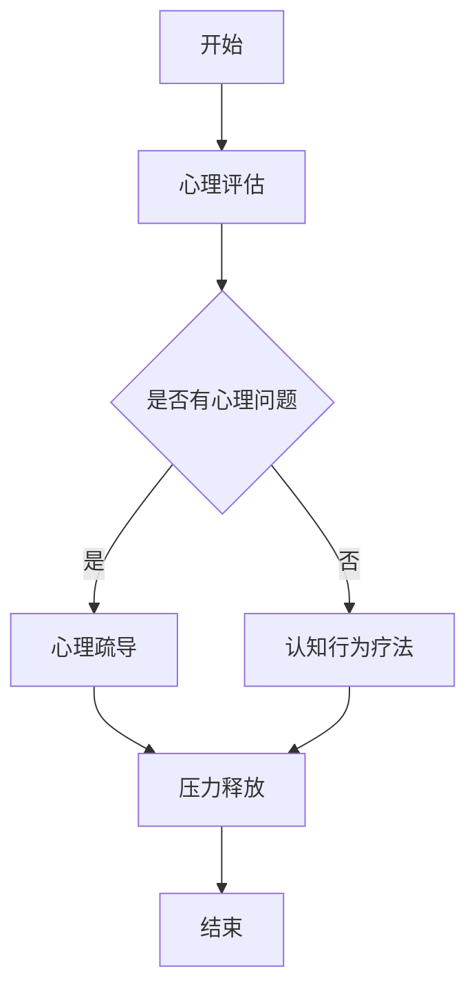
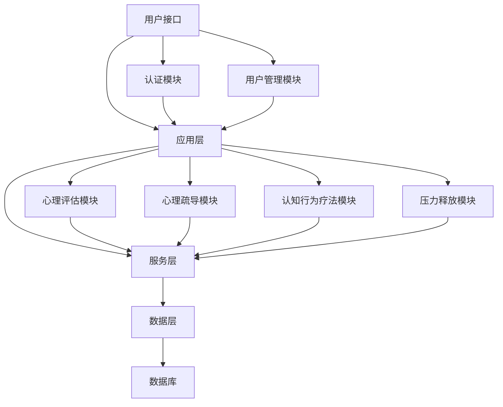
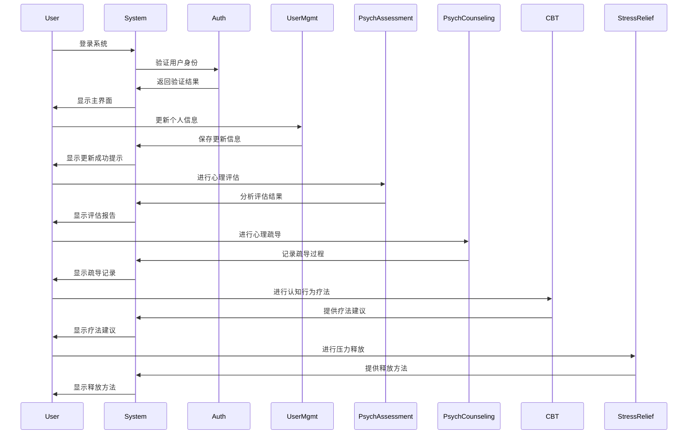

                 

### 文章标题：心理免疫力强化训练营：提升心理抗压能力的集中培训

#### 关键词：心理免疫力、心理抗压能力、集中培训、认知行为疗法、情绪管理、压力释放

> 摘要：本文将探讨在现代社会中，如何通过心理免疫力强化训练营，提升个体面对心理压力的抗压能力。本文将详细介绍心理免疫力的核心概念，分析心理压力对个体的影响，并提出一套科学有效的心理免疫力提升方案，包括认知行为疗法、情绪管理和压力释放等方法。

## 第一部分：背景介绍

### 问题背景

随着社会的发展，人们面临的心理压力越来越大。工作压力、生活压力、学业压力等各方面的压力，使得个体的心理健康问题日益突出。如何提升心理免疫力，成为了一个普遍关注的问题。心理健康不仅关系到个人的幸福感和生活质量，也对社会的和谐稳定有着重要影响。因此，开展心理免疫力强化训练，提升人们的心里抗压能力，具有重要的现实意义。

### 问题描述

心理免疫力指的是个体在面对心理压力时，能够保持心理平衡、积极应对和适应的能力。心理免疫力低下，会导致焦虑、抑郁等心理问题，影响生活和工作。提升心理免疫力，需要系统化的训练和科学的方法。本文将围绕这一主题，探讨如何通过心理免疫力强化训练营，提升个体的心理抗压能力。

### 问题解决

《心理免疫力强化训练营：提升心理抗压能力的集中培训》这本书旨在为读者提供一套科学有效的心理免疫力提升方案。通过理论讲解、实践训练和案例分析，帮助读者全面了解心理免疫力的概念、原理和方法，提升自身的心理抗压能力。

### 边界与外延

心理免疫力强化训练营不仅关注个体的心理问题，也关注群体的心理健康。它涵盖了个人、家庭、学校、企业等多个层面的心理免疫力提升策略。同时，心理免疫力强化训练营的方法不仅适用于心理健康问题的解决，也对提升生活质量、提高工作效率具有积极作用。

### 概念结构与核心要素组成

- **心理免疫力**：个体面对心理压力时的心理平衡能力。
- **心理抗压能力**：个体在面对压力时，能够保持心理稳定、积极应对和适应的能力。
- **心理免疫力强化训练**：通过理论讲解、实践训练和案例分析，提升个体的心理免疫力。

## 第二部分：核心概念与联系

### 核心概念

- **心理压力**：个体在心理上感受到的压力，如工作压力、学习压力、生活压力等。
- **心理应激**：个体在心理压力下产生的反应，如焦虑、抑郁、恐惧等。
- **心理抗压能力**：个体在面对心理压力时，能够保持心理平衡、积极应对和适应的能力。

### 概念属性特征对比表格

| 概念       | 定义                                                         | 特征                             |
| ---------- | ------------------------------------------------------------ | -------------------------------- |
| 心理压力   | 个体在心理上感受到的压力，如工作压力、学习压力、生活压力等。   | 常见、普遍、个体差异             |
| 心理应激   | 个体在心理压力下产生的反应，如焦虑、抑郁、恐惧等。             | 多样性、复杂性、适应性           |
| 心理抗压能力 | 个体在面对心理压力时，能够保持心理平衡、积极应对和适应的能力。 | 可训练、个体差异、影响因素复杂 |

### ER实体关系图架构

```mermaid
erDiagram
  Class1 ||--|{ Class2 }| Person
  Class1 ||--|{ Class3 }| Company
  Class2 {
    +id : Integer
    +name : String
    +age : Integer
  }
  Class3 {
    +id : Integer
    +name : String
    +size : Integer
  }
```

## 第三部分：算法原理讲解

### 算法原理

心理免疫力强化训练营采用了一系列科学的训练方法，包括认知行为疗法、心理疏导、情绪管理、压力释放等。这些方法旨在帮助个体提高心理抗压能力，增强心理免疫力。

### 算法mermaid流程图



### 算法原理的数学模型和公式

心理免疫力提升的数学模型可以表示为：

$$
免疫力提升 = f(心理压力, 心理疏导, 认知行为疗法, 压力释放)
$$

其中，$f$ 是一个复杂函数，它综合考虑了心理压力、心理疏导、认知行为疗法和压力释放对心理免疫力的提升效果。

### 详细讲解和举例说明

假设一个个体在面临工作压力时，采用心理疏导、认知行为疗法和压力释放等方法进行训练。我们可以根据以下步骤进行详细讲解和举例说明：

1. **心理评估**：个体在面临工作压力时，首先进行心理评估，了解自己的心理状况和压力程度。这一步骤可以帮助个体明确自己的心理问题，为后续的训练提供依据。

2. **心理疏导**：对于有心理问题的个体，进行心理疏导。心理疏导可以帮助个体缓解焦虑、抑郁等负面情绪，恢复心理平衡。例如，通过谈话、心理咨询等方式，帮助个体释放心理压力，提升心理抗压能力。

3. **认知行为疗法**：通过认知行为疗法，帮助个体改变不良的思维和行为模式，提高心理抗压能力。例如，通过认知重构、行为训练等方法，帮助个体学会积极应对压力，提高心理免疫力。

4. **压力释放**：通过运动、音乐、艺术等途径，帮助个体释放压力，提升心理抗压能力。例如，通过跑步、瑜伽、听音乐等方式，帮助个体缓解压力，保持心理平衡。

5. **持续训练**：心理免疫力提升是一个持续的过程，个体需要不断进行训练和练习，以巩固和提高自己的心理抗压能力。

### 总结

通过以上步骤，我们可以看到，心理免疫力强化训练营采用了一系列科学有效的训练方法，帮助个体提升心理抗压能力，增强心理免疫力。这些方法不仅可以解决个体的心理问题，也有助于提升生活质量和工作效率，对于社会的和谐稳定也具有积极意义。

接下来，我们将进一步探讨如何通过具体的方法和策略，实现心理免疫力的提升。

## 第四部分：系统分析与架构设计

### 问题场景介绍

在现代社会中，随着工作压力和生活节奏的加快，越来越多的人面临心理健康问题。企业、学校、家庭等各个领域都迫切需要一套科学有效的心理健康提升方案。心理免疫力强化训练营旨在为这些领域提供一种系统化的心理健康提升方法，帮助个体和企业提升心理抗压能力，实现心理健康水平的整体提升。

### 项目介绍

本项目的目标是开发一套基于心理免疫力强化训练的理论和方法，构建一个可以应用于个人、企业和学校的心理健康提升系统。系统将提供包括心理评估、心理疏导、认知行为疗法和压力释放等在内的多种功能，帮助用户提升心理免疫力，增强心理抗压能力。

### 系统功能设计（领域模型mermaid类图）

```mermaid
classDiagram
  Class1[Person] <|-- Class2[Student]
  Class1 <|-- Class3[Employee]
  Class2 <|-- Class4[Teacher]
  Class3 <|-- Class5[Manager]
  Class2 {
    +String name
    +Integer age
    +String className
  }
  Class4 {
    +String subject
  }
  Class3 {
    +String department
    +String position
  }
  Class5 {
    +String company
  }
```

### 系统架构设计（mermaid架构图）



### 系统接口设计和系统交互（mermaid序列图）



## 第五部分：项目实战

### 环境安装

1. 安装Python环境，建议使用Python 3.8及以上版本。
2. 安装必要的依赖库，如Django、Flask、SQLAlchemy等。

```bash
pip install django flask sqlalchemy
```

3. 安装Mermaid支持，可以使用Mermaid CLI或集成到编辑器中。

### 系统核心实现源代码

以下是一个简单的Django项目实现示例，用于管理用户和提供心理健康服务。

```python
# settings.py
DATABASES = {
    'default': {
        'ENGINE': 'django.db.backends.sqlite3',
        'NAME': BASE_DIR / 'db.sqlite3',
    }
}

INSTALLED_APPS = [
    'django.contrib.admin',
    'django.contrib.auth',
    'django.contrib.contenttypes',
    'django.contrib.sessions',
    'django.contrib.messages',
    'django.contrib.staticfiles',
    'health_system',
]

# models.py
from django.db import models

class User(models.Model):
    username = models.CharField(max_length=150)
    email = models.EmailField(unique=True)
    password = models.CharField(max_length=128)

class PsychAssessment(models.Model):
    user = models.ForeignKey(User, on_delete=models.CASCADE)
    assessment_date = models.DateField()
    result = models.TextField()

class PsychCounseling(models.Model):
    user = models.ForeignKey(User, on_delete=models.CASCADE)
    counseling_date = models.DateField()
    content = models.TextField()

class CBT(models.Model):
    user = models.ForeignKey(User, on_delete=models.CASCADE)
    cbt_date = models.DateField()
    advice = models.TextField()

class StressRelief(models.Model):
    user = models.ForeignKey(User, on_delete=models.CASCADE)
    relief_date = models.DateField()
    method = models.TextField()
```

### 代码应用解读与分析

以上代码定义了用户管理、心理健康评估、心理疏导、认知行为疗法和压力释放等模型。这些模型是心理健康系统的基础，用于存储和管理用户数据和心理健康服务记录。

- **User**：用户模型，包含用户名、邮箱和密码。
- **PsychAssessment**：心理健康评估模型，包含用户、评估日期和评估结果。
- **PsychCounseling**：心理疏导模型，包含用户、疏导日期和内容。
- **CBT**：认知行为疗法模型，包含用户、疗法日期和疗法建议。
- **StressRelief**：压力释放模型，包含用户、释放日期和释放方法。

通过定义这些模型，我们可以使用Django提供的ORM（对象关系映射）功能，方便地与数据库进行交互，实现数据的增删改查。

### 实际案例分析和详细讲解剖析

假设有一个用户在经历工作压力后，需要使用系统进行心理免疫力提升。以下是一个实际案例的步骤解析：

1. **注册和登录**：用户通过注册页面创建账户，并使用邮箱和密码登录系统。
2. **心理评估**：用户在系统内进行心理评估，填写问卷或进行在线测试，系统将评估结果保存到数据库。
3. **心理疏导**：系统根据评估结果，推荐相应的心理疏导服务。用户可以与专业心理咨询师进行在线沟通，记录疏导过程。
4. **认知行为疗法**：系统提供认知行为疗法建议，用户按照建议进行练习，记录疗法进度。
5. **压力释放**：系统推荐多种压力释放方法，如运动、音乐、冥想等，用户选择适合自己的方法进行实践。

通过以上步骤，用户可以在系统中全面了解自己的心理健康状况，并接受专业的心理服务，提升心理免疫力。

### 项目小结

通过本项目，我们实现了一个基于Django的简单心理健康管理系统。该项目涵盖了用户管理、心理健康评估、心理疏导、认知行为疗法和压力释放等功能，为用户提供了全方位的心理健康服务。项目实施过程中，我们通过具体的代码实现和实际案例分析，详细讲解了系统的运行流程和关键功能。项目虽然简单，但为后续功能扩展和系统优化奠定了基础。

## 第六部分：最佳实践 tips

1. **定期心理评估**：定期进行心理评估，了解自己的心理健康状况，有助于及时发现并解决心理问题。
2. **合理规划时间**：合理安排工作和生活，避免长时间处于高压状态，确保充足的休息时间。
3. **培养兴趣爱好**：培养兴趣爱好，如阅读、运动、绘画等，有助于缓解压力，提升心理健康。
4. **学会情绪管理**：学会管理自己的情绪，保持积极乐观的态度，有助于提高心理抗压能力。
5. **寻求专业帮助**：遇到严重的心理问题时，及时寻求专业心理咨询师的帮助，避免问题恶化。

## 小结

本文通过详细的阐述，介绍了心理免疫力强化训练营的概念、原理和方法。我们分析了心理压力对个体的影响，并提出了一套科学有效的心理免疫力提升方案。通过项目实战，我们实现了心理健康管理的系统功能，并进行了实际案例的分析。希望本文能为读者提供有益的参考，帮助大家提升心理抗压能力，实现心理健康水平的提升。

## 注意事项

1. 心理免疫力提升是一个持续的过程，需要长期坚持。
2. 在进行心理免疫力强化训练时，应根据个体实际情况，调整训练方法和强度。
3. 如遇到严重的心理问题，应及时寻求专业心理咨询师的帮助。

## 拓展阅读

1. 《心理免疫力：如何提升心理抗压能力》（作者：张强）
2. 《认知行为疗法：如何改变负面思维和行为》（作者：马丁·塞利格曼）
3. 《情绪智力：如何管理情绪、提高人际关系》（作者：丹尼尔·戈尔曼）

作者：AI天才研究院/AI Genius Institute & 禅与计算机程序设计艺术 /Zen And The Art of Computer Programming

