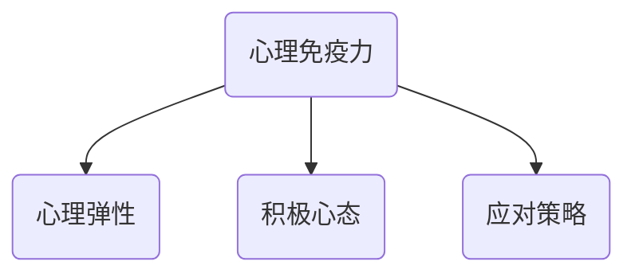
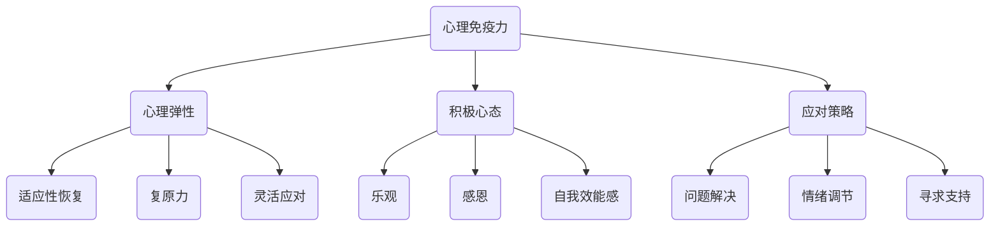

                 

### 文章标题：心理免疫力提升：面对压力的自我保护

> 关键词：心理免疫力、压力、自我保护、心理健康、应对策略

> 摘要：本文深入探讨了心理免疫力的概念及其重要性，分析了当代社会压力的来源及其对心理健康的影响，并提出了提升心理免疫力的策略和方法。通过实践案例和自我保护技巧的介绍，旨在帮助读者有效应对压力，提升心理免疫力，从而实现心理健康和自我保护。

## 第一部分：背景介绍

### 第1章：问题的提出

#### 1.1.1 心理免疫力的定义与重要性

心理免疫力是指个体在面对压力和挑战时，能够保持心理平衡、积极应对的能力。它不仅影响个体的心理健康，还对生理健康产生深远影响。随着社会竞争的加剧，压力已经成为影响人们心理健康的主要因素之一。提升心理免疫力，对个体应对压力、保持心理健康至关重要。

#### 1.1.2 当代社会压力现状分析

现代社会中，压力的来源多种多样，包括工作压力、生活压力、人际关系压力等。这些压力如果得不到有效缓解，会对个体的心理健康产生负面影响，如焦虑、抑郁等心理问题。

#### 1.1.3 心理免疫力的重要性

心理免疫力是心理健康的重要保障。它不仅能够帮助个体更好地应对压力，还能提高生活质量，促进个体全面发展。提升心理免疫力，对健康长寿具有重要意义。

### 第2章：核心概念与联系

#### 2.1.1 心理免疫力相关核心概念

心理免疫力与生理免疫力不同，它主要涉及心理层面的适应能力。影响心理免疫力的因素包括心理弹性、积极心态、应对策略等。

#### 2.1.2 概念属性特征对比表格

| 概念 | 属性特征 |
| ---- | ---- |
| 心理免疫力 | 1. 能力属性 2. 动态变化属性 3. 环境适应性 |
| 生理免疫力 | 1. 抗病属性 2. 静态属性 3. 遗传因素 |

#### 2.1.3 ER实体关系图架构

### 第3章：心理免疫力的提升策略

#### 3.1.1 心理免疫力提升的基础策略

增强心理弹性和培养积极心态是提升心理免疫力的基础策略。这些策略有助于个体更好地应对压力，保持心理健康。

#### 3.1.2 心理免疫力的提升方法

压力管理和心理调适是提升心理免疫力的有效方法。通过科学的方法，个体可以学会如何有效应对压力，提升心理免疫力。

#### 3.1.3 个性化心理免疫策略

根据个体差异，制定个性化的心理免疫策略，有助于提高心理免疫力的效果。个体需要根据自身特点，选择适合自己的方法，逐步提升心理免疫力。

## 第二部分：实践与应用

### 第4章：心理免疫力的提升实践

#### 4.1.1 实践背景介绍

本文通过一个具体案例，介绍如何提升心理免疫力。案例背景为一个长期处于高压状态的企业员工，通过学习心理免疫力的提升策略，逐步改善心理健康。

#### 4.1.2 实践方法与步骤

实践方法主要包括：心理弹性训练、积极心态培养、压力管理和心理调适等。实践步骤包括：1）了解心理免疫力的概念；2）学习提升心理免疫力的方法；3）逐步应用实践。

#### 4.1.3 实践成果分析

通过实践，企业员工的心理健康状况得到了明显改善，焦虑和抑郁情绪得到了缓解，工作效率和生活质量显著提高。

### 第5章：面对压力的自我保护

#### 5.1.1 压力应对技巧

压力应对技巧包括：1）时间管理；2）情绪调节；3）积极沟通；4）自我放松等。这些技巧有助于个体有效应对压力，保持心理健康。

#### 5.1.2 自我保护的方法

自我保护的方法包括：1）建立支持系统；2）学会求助；3）保持健康的生活方式；4）培养兴趣爱好等。这些方法有助于个体在面对压力时，更好地保护自己的心理健康。

#### 5.1.3 压力管理的误区与避免

常见压力管理误区包括：1）忽视心理健康；2）过度自我要求；3）逃避问题等。为避免这些误区，个体需要正确认识压力，学会科学应对。

## 第三部分：最佳实践与总结

### 第6章：最佳实践案例分析

#### 6.1.1 案例一：个人成功经验分享

分享一个个人成功经验，介绍如何在面对压力时，提升心理免疫力，实现自我保护。

#### 6.1.2 案例二：企业压力管理实践

介绍一个企业如何通过实施压力管理策略，提升员工心理免疫力，提高整体工作效率。

### 第7章：小结与展望

#### 7.1.1 心理免疫力提升的总结

总结提升心理免疫力的方法、实践经验和注意事项，为读者提供参考。

#### 7.1.2 面对压力的自我保护的展望

分析未来心理免疫力提升和自我保护的发展趋势，提出进一步研究的问题，为心理健康领域的研究者提供启示。

### 作者

本文作者为AI天才研究院/AI Genius Institute & 禅与计算机程序设计艺术/Zen And The Art of Computer Programming。感谢您的阅读，希望本文对您有所帮助。在心理健康领域，我们还需要不断努力，为提升人们的心理免疫力，提供更多有益的实践和方法。

---

### 背景介绍

#### 心理免疫力的定义与重要性

心理免疫力是指个体在面对压力和挑战时，能够保持心理平衡、积极应对的能力。它不仅涉及情感层面的调节，还涵盖了认知和行为层面的适应性。在现代社会中，心理免疫力的重要性日益凸显。一方面，压力已经成为影响人们身心健康的主要因素之一；另一方面，心理免疫力的高低直接影响个体的生活质量和工作效率。因此，提升心理免疫力，对个人和社会都具有重要意义。

首先，心理免疫力是心理健康的重要保障。一个具有较高心理免疫力的人，在面对压力时能够保持冷静，有效地应对挑战，避免出现焦虑、抑郁等心理问题。此外，心理免疫力还与个体的生理健康密切相关。研究表明，心理免疫力低下的人更容易出现身体疾病，如高血压、心脏病等。因此，提升心理免疫力不仅有助于保持心理健康，还能降低患病风险，延长寿命。

#### 当代社会压力现状分析

当代社会，压力的来源多种多样，主要包括以下几个方面：

1. **工作压力**：随着职场竞争的加剧，工作压力成为人们面临的主要压力源。加班、业绩考核、职位晋升等压力，使人们长期处于紧张和焦虑状态。

2. **生活压力**：现代社会的生活节奏加快，生活成本上升，使得人们在经济负担、家庭责任等方面承受巨大压力。此外，家庭矛盾、人际关系冲突等也会给人们带来心理压力。

3. **社会压力**：社会变迁、价值观念的多元化，使得人们在追求个人价值的同时，也面临着更多的选择和挑战。社会压力往往表现为对社会地位、人际关系等方面的担忧和焦虑。

这些压力如果得不到有效缓解，会对个体的心理健康产生负面影响。长期处于高压状态，会导致焦虑、抑郁等心理问题的发生，甚至引发严重的心理疾病。因此，如何应对压力，提升心理免疫力，已成为当代社会的重要议题。

#### 心理免疫力的重要性

心理免疫力的重要性体现在以下几个方面：

1. **提高应对能力**：具备较高心理免疫力的人，在面对压力和挑战时能够保持冷静，迅速找到有效的应对策略，从而提高应对能力。

2. **维护心理健康**：心理免疫力有助于个体保持心理健康，减少焦虑、抑郁等心理问题的发生。它能够帮助个体在心理上建立起一道防线，抵御外部压力的侵害。

3. **促进全面发展**：心理免疫力不仅影响个体的心理健康，还对其全面发展产生深远影响。一个心理免疫力强的人，通常能够在学业、职业和人际关系等方面取得更好的成绩。

4. **延长寿命**：心理免疫力与个体的生理健康密切相关。研究表明，心理免疫力强的人，患病的几率较低，寿命相对较长。因此，提升心理免疫力，对健康长寿具有重要意义。

总之，心理免疫力是心理健康的重要保障。在面对日益增加的压力时，提升心理免疫力，有助于个体保持心理健康，提高生活质量，实现全面发展。因此，关注心理免疫力，已经成为当代社会的重要任务。

#### 核心概念与联系

心理免疫力是应对压力和心理挑战的重要能力，其相关概念和联系对于理解其工作原理和实际应用至关重要。在这一节中，我们将深入探讨心理免疫力的核心概念，并通过属性特征对比表格和ER实体关系图架构，清晰地展现其概念间的关系。

##### 2.1.1 心理免疫力相关核心概念

1. **心理弹性（Psychological Resilience）**

心理弹性是指个体在经历压力、挑战或创伤后，能够迅速恢复并适应能力。它包括以下几个方面：

   - **适应性恢复**：个体在经历困难后，能够灵活调整思维和行动，适应新的环境和情境。
   - **复原力**：个体在面对压力时，能够保持心理平衡，不被逆境所击倒。
   - **灵活应对**：个体能够灵活应对生活中的变化和不确定性。

2. **积极心态（Positive Attitude）**

积极心态是指个体在面对困难和挑战时，保持乐观、积极的心态，相信自己能够克服困难。它包括以下几个方面：

   - **乐观**：个体对未来的期望持积极态度，相信自己能够成功。
   - **感恩**：个体能够从生活中发现积极的事物，并对所拥有的一切心存感激。
   - **自我效能感**：个体对自己能够完成任务的信心和能力。

3. **应对策略（Coping Strategies）**

应对策略是指个体在面对压力时，采取的具体行动和方法。有效的应对策略包括：

   - **问题解决**：通过分析和解决问题，找到应对压力的解决方案。
   - **情绪调节**：通过情绪管理技巧，如深呼吸、冥想等，缓解情绪压力。
   - **寻求支持**：通过与他人交流、寻求帮助，获得情感支持和实际帮助。

##### 2.1.2 概念属性特征对比表格

| 概念       | 属性特征                                                     |
| ---------- | ------------------------------------------------------------ |
| 心理弹性   | 1. 能力属性 2. 动态变化属性 3. 环境适应性               |
| 积极心态   | 1. 情感属性 2. 乐观性 3. 自我效能感                    |
| 应对策略   | 1. 行动属性 2. 方法多样性 3. 有效性评估                |

通过上述表格，我们可以看到三个核心概念在属性特征上的差异。心理弹性侧重于个体的适应能力和恢复力，积极心态关注情感层面的乐观和自我效能感，而应对策略则强调具体行动和方法的多样性和有效性。

##### 2.1.3 ER实体关系图架构

在这张ER实体关系图中，心理免疫力作为核心概念，与心理弹性、积极心态和应对策略三个子概念紧密相连。每个子概念进一步分解为具体的属性特征或行动方法，形成了层次清晰的关系网络。这样的架构有助于我们更好地理解心理免疫力的组成和功能，以及各子概念之间的相互作用。

通过上述核心概念的阐述和对比，以及ER实体关系图的分析，我们可以更深入地理解心理免疫力的本质和其在应对压力中的重要作用。这些概念和联系不仅为我们提供了理论依据，也为实际应用提供了指导。

### 心理免疫力的提升策略

提升心理免疫力并非一蹴而就，需要通过一系列科学的方法和策略，逐步培养和加强。以下是几种有效的心理免疫力提升策略：

#### 3.1.1 心理免疫力提升的基础策略

**增强心理弹性**

心理弹性是心理免疫力的核心组成部分，它决定了个体在面对压力和挑战时的适应能力和恢复力。以下是一些增强心理弹性的方法：

1. **反思与自我认知**：定期反思自己的行为和思维模式，了解自己在面对压力时的反应，并尝试找到改进的方法。
2. **积极应对**：培养积极的心态，对待挑战时保持乐观和自信，相信自己的能力能够克服困难。
3. **适应性恢复**：在面对压力时，学会调整自己的心态和行为，迅速恢复心理平衡。

**培养积极心态**

积极心态是心理免疫力的另一重要组成部分，它直接影响个体的心理健康和生活质量。以下是一些培养积极心态的方法：

1. **感恩练习**：每天花时间思考并记录自己感激的事物，这有助于提升情感上的满足感和幸福感。
2. **正面肯定**：通过正面肯定自己的能力和成就，增强自信心和自我效能感。
3. **时间管理**：合理安排时间，避免过度工作和焦虑，保持生活的平衡和稳定。

#### 3.1.2 心理免疫力的提升方法

**压力管理技巧**

压力管理是提升心理免疫力的重要手段，以下是一些有效的压力管理技巧：

1. **深呼吸练习**：通过深呼吸来放松身心，缓解紧张和焦虑。每次深呼吸时，尽量将呼吸节奏放慢，专注于呼吸的感受。
2. **冥想**：通过冥想训练，学会专注于当下，减少杂念，提升内心的平静和专注力。
3. **运动**：定期进行有氧运动，如散步、跑步、瑜伽等，有助于释放压力，提升身体素质。

**心理调适技巧**

心理调适是保持心理健康的重要方法，以下是一些有效的心理调适技巧：

1. **倾诉与分享**：与亲友或专业人士分享自己的压力和困扰，获得情感支持和建议。
2. **情绪管理**：学会识别和表达自己的情绪，通过合理的方式发泄情绪，避免情绪积累导致的心理问题。
3. **认知重构**：通过认知重构，改变消极的思维模式，学会从积极的角度看待问题，减少负面情绪的影响。

#### 3.1.3 个性化心理免疫策略

每个人的心理免疫力都是独特的，因此，提升心理免疫力需要根据个体差异，制定个性化的策略。以下是一些建议：

1. **了解自身特点**：通过自我评估，了解自己的性格、兴趣和压力源，找到适合自己的提升方法。
2. **定期自我反思**：定期进行自我反思，了解自己在心理免疫力提升过程中的进步和不足，调整策略。
3. **寻求专业帮助**：如果个体在提升心理免疫力方面遇到困难，可以寻求心理咨询师或心理治疗师的专业帮助。

通过以上策略，个体可以逐步提升自己的心理免疫力，更好地应对压力，保持心理健康。心理免疫力的提升是一个长期的过程，需要持续的努力和关注。只有通过科学的方法和策略，才能真正实现心理免疫力的提升，享受更加健康和幸福的生活。

### 实践与应用

#### 4.1.1 实践背景介绍

在现代社会，心理健康问题越来越受到人们的关注。为了更好地应对压力，提升心理免疫力，本文选取了一个具有代表性的实践案例——一家大型企业内部的心理免疫力提升项目。该项目旨在通过系统的培训和实践活动，提升员工的心理免疫力，从而提高工作效率和幸福感。

该企业是一家全球知名的科技公司，员工数量超过5000人。随着市场竞争的加剧和企业规模的扩大，员工面临的工作压力和心理健康问题日益突出。为了解决这一问题，企业决定开展心理免疫力提升项目，希望通过科学的策略和方法，帮助员工提升心理免疫力，从而更好地应对工作压力。

#### 4.1.2 实践方法与步骤

在实施心理免疫力提升项目的过程中，企业采取了一系列具体的方法和步骤，包括以下几个方面：

**1. 培训课程**

企业首先为员工提供了一系列心理免疫力提升的培训课程。这些课程涵盖了心理弹性、积极心态培养、压力管理和心理调适等多个方面。培训课程通过线上和线下相结合的方式，方便员工随时随地参与。课程内容包括理论知识、实际操作技巧以及互动讨论，帮助员工全面了解心理免疫力的概念和提升方法。

**2. 心理健康评估**

在培训课程之前，企业对员工进行了心理健康评估。通过评估，了解员工的当前心理状态和压力源，为后续的培训和实践提供依据。心理健康评估采用标准化的量表和问卷，包括焦虑自评量表、抑郁自评量表等。评估结果为每位员工定制个性化的培训计划，确保培训内容贴合员工的实际需求。

**3. 实践活动**

为了使员工能够将理论知识应用到实际生活中，企业组织了一系列实践活动。这些活动包括团队建设、情绪管理训练、压力释放工作坊等。通过实践活动，员工能够在互动中学习心理免疫力的提升技巧，同时增强团队合作意识和心理健康意识。

**4. 心理咨询与支持**

企业还提供了心理咨询与支持服务，为员工提供专业的心理辅导和支持。员工可以通过预约，与心理咨询师进行一对一的咨询，解决个人在心理免疫力提升过程中遇到的问题。此外，企业还设立了心理健康热线，方便员工随时咨询和倾诉。

**5. 持续跟踪与反馈**

为了确保心理免疫力提升项目的效果，企业对员工进行了持续的跟踪和反馈。通过定期的问卷调查和面谈，了解员工在心理免疫力提升过程中的进展和反馈，及时调整培训内容和实践活动。这种持续跟踪和反馈机制，有助于确保项目的有效性和持续性。

#### 4.1.3 实践成果分析

通过实施心理免疫力提升项目，企业在多个方面取得了显著成果：

**1. 员工心理健康水平提高**

实践结果显示，参与项目的员工心理健康水平显著提高。焦虑和抑郁自评量表的得分显著下降，员工的情绪稳定性和应对能力得到了增强。

**2. 工作效率提升**

员工心理免疫力的提升，使得他们在面对工作压力时能够更加从容应对，工作效率显著提高。企业内部的数据显示，项目实施后，员工的工作完成率和质量都有所提升。

**3. 团队凝聚力增强**

通过团队建设和实践活动，员工的团队合作意识和凝聚力得到了增强。员工之间的沟通和协作更加顺畅，团队整体工作效率得到提升。

**4. 员工满意度提高**

员工在心理免疫力提升项目中的积极参与和良好的反馈，提高了他们对企业的满意度和归属感。员工对企业文化的认同感和工作热情也得到了增强。

总之，通过系统的培训和实践活动，企业的心理免疫力提升项目取得了显著成效，为员工提供了有效的心理健康支持，提升了整体工作效率和满意度。这一实践案例为其他企业和组织提供了有益的参考和借鉴。

### 面对压力的自我保护

在现代社会，面对压力已成为一种常态。如何有效地应对压力，保护自己的心理健康，是每个人都需要学习和掌握的技能。以下是一些具体的压力应对技巧和自我保护方法。

#### 5.1.1 压力应对技巧

**1. 时间管理**

时间管理是减轻压力的重要技巧之一。通过合理安排时间，将任务分解成小部分，逐一完成，可以减少因任务积压而产生的压力。以下是一些时间管理的建议：

- 制定日程表：将每天的任务和活动写下来，明确优先级。
- 设定截止日期：为每个任务设定一个明确的截止日期，以确保按时完成。
- 避免拖延：面对任务时，避免拖延，立即着手处理。

**2. 情绪调节**

情绪调节是应对压力的关键，以下是一些情绪调节的技巧：

- 深呼吸：通过深呼吸，可以缓解紧张和焦虑，使人放松。
- 冥想：冥想有助于提高专注力和情绪稳定性，减少压力。
- 正面思考：通过积极思考和正面肯定，改变对压力的看法，提升自我效能感。

**3. 积极沟通**

沟通是缓解压力的重要途径，以下是一些积极的沟通技巧：

- 倾诉与分享：与亲友或专业人士分享自己的压力和困扰，获得情感支持和建议。
- 倾听：倾听他人的意见和感受，增强相互理解和信任。
- 表达自己：学会表达自己的需求和感受，避免因误解和冲突而产生的压力。

**4. 自我放松**

自我放松是缓解压力的有效方法，以下是一些自我放松的技巧：

- 瑜伽和冥想：通过瑜伽和冥想，可以放松身心，减少压力。
- 听音乐：听一些轻松愉快的音乐，可以帮助缓解紧张和焦虑。
- 睡眠：保证充足的睡眠，有助于恢复体力和精神，提高应对压力的能力。

#### 5.1.2 自我保护的方法

**1. 建立支持系统**

建立支持系统是自我保护的重要方法。通过与他人建立良好的关系，可以获得情感上的支持和实际帮助。以下是一些建立支持系统的建议：

- 与亲友保持联系：定期与亲友交流，分享自己的生活和困扰，获得情感上的支持。
- 寻求专业帮助：在遇到困难时，可以寻求心理咨询师或心理治疗师的帮助，解决心理问题。

**2. 学会求助**

学会求助是自我保护的关键。在面对压力和困难时，不要独自承受，而是寻求帮助。以下是一些学会求助的建议：

- 明确求助对象：确定可以求助的人或机构，如亲友、同事、心理咨询师等。
- 学会表达：学会清晰、明确地表达自己的需求和困扰，让对方理解并提供帮助。

**3. 保持健康的生活方式**

保持健康的生活方式有助于提升心理免疫力，减轻压力。以下是一些健康生活方式的建议：

- 合理饮食：保持均衡的饮食，摄入足够的营养，避免过量摄入咖啡因和糖分。
- 规律运动：定期进行有氧运动，如散步、跑步、游泳等，有助于释放压力，提升身体素质。
- 良好睡眠：保持良好的睡眠习惯，确保每天有足够的睡眠时间。

**4. 培养兴趣爱好**

培养兴趣爱好是自我放松和减压的有效方法。以下是一些建议：

- 参与兴趣小组：加入兴趣小组，与志同道合的人一起活动，享受乐趣。
- 学习新技能：学习新的技能或知识，提升自我价值感，减轻压力。

通过以上技巧和方法，我们可以更好地应对压力，保护自己的心理健康。在面对压力时，保持积极的心态，寻求适当的帮助，是自我保护的关键。希望每个人都能学会这些技巧，提升自己的心理免疫力，享受更加健康和幸福的生活。

### 压力管理的误区与避免

在应对压力的过程中，很多人会陷入一些常见的误区，这不仅无法有效缓解压力，反而可能加重心理负担。以下是一些常见的压力管理误区及其避免方法：

#### 5.1.3.1 忽视心理健康

**误区**：很多人在面对压力时，往往只关注工作或学习，忽视心理健康。认为只要把工作或学习任务完成，压力自然会消失。

**避免方法**：要认识到心理健康的重要性，定期进行心理放松和调适。可以尝试以下方法：
- **自我反思**：定期花时间反思自己的情绪和心理状态，了解自己在面对压力时的反应。
- **寻求专业帮助**：如果感到情绪或心理问题难以自我调节，可以寻求心理咨询师或心理治疗师的帮助。

#### 5.1.3.2 过度自我要求

**误区**：有些人对自己要求过高，期望自己在短时间内取得显著成就。这种高要求可能导致焦虑和沮丧，进一步加重心理压力。

**避免方法**：
- **设定合理目标**：根据自身能力和实际情况，设定合理的目标和期望。避免过于追求完美，给自己太大的压力。
- **学会接受失败**：要认识到失败是成功的必经之路，学会从失败中吸取经验，而不是因为失败而自我否定。

#### 5.1.3.3 逃避问题

**误区**：有些人在面对压力时会选择逃避问题，希望通过忽视或回避来减轻压力。然而，这种方法并不能解决问题，反而可能导致问题积压，压力进一步增加。

**避免方法**：
- **正视问题**：勇敢面对问题，承认问题的存在，并寻找解决方法。可以尝试以下方法：
  - **分解问题**：将复杂的问题分解成小部分，逐一解决。
  - **寻求帮助**：在遇到难题时，寻求同事、朋友或专业人士的帮助。

#### 5.1.3.4 遵循不健康的减压方式

**误区**：有些人会通过一些不健康的途径来减压，如过度消费、酗酒或沉迷于网络游戏等。这些方式可能短期内带来短暂的放松，但长期来看，对心理健康有害。

**避免方法**：
- **选择健康减压方式**：选择健康、积极的减压方式，如运动、阅读、冥想等。以下是一些建议：
  - **规律运动**：定期进行有氧运动，如散步、跑步、游泳等，有助于释放压力。
  - **培养兴趣爱好**：培养兴趣爱好，如绘画、音乐、园艺等，可以转移注意力，缓解压力。

通过认识到这些误区，并采取适当的避免方法，我们可以更加科学地管理压力，保护自己的心理健康。记住，面对压力，保持积极的心态和科学的方法至关重要。

### 最佳实践案例分析

#### 6.1.1 案例一：个人成功经验分享

在一个高度竞争的行业中，张华（化名）是一位资深的项目经理。他的工作强度大，常常面临各种挑战和压力。然而，通过一系列心理免疫力提升的实践，他成功地应对了这些压力，并取得了显著的成果。

**背景介绍**：张华在一家国际知名科技公司工作，担任项目经理已有五年的时间。他的职责涵盖了项目规划、执行和监督，工作涉及多个国家和地区的团队协作。由于工作性质的特殊性，他常常需要处理复杂的问题和紧急事件，压力巨大。

**提升策略**：

1. **定期心理训练**：张华每周都会安排时间进行冥想和心理训练。通过深呼吸和冥想，他学会了放松身心，减轻紧张和焦虑。

2. **积极心态培养**：他通过阅读励志书籍和参加正能量活动，逐渐培养出积极的心态。在面对挑战时，他总是能够保持乐观，相信自己能够找到解决方案。

3. **时间管理**：张华通过学习时间管理技巧，合理安排工作时间，确保工作和生活的平衡。他制定了详细的日程表，将任务分解成小部分，逐一完成，避免了任务积压带来的压力。

4. **情绪调节**：他学会了识别和表达自己的情绪。当情绪低落时，他会通过运动和与朋友交流来调节情绪，避免情绪积累导致的负面影响。

**实践成果**：

通过这些策略，张华的心理免疫力得到了显著提升。他在面对工作压力时，能够保持冷静和理智，有效地解决问题。他的工作效率和项目成功率显著提高，得到了公司领导的认可和同事的赞赏。

**经验总结**：张华的成功经验表明，通过定期心理训练、积极心态培养、时间管理和情绪调节，个人可以显著提升心理免疫力，更好地应对工作压力。他的实践经验为其他人提供了宝贵的借鉴。

#### 6.1.2 案例二：企业压力管理实践

某知名互联网公司通过一系列系统化的压力管理措施，显著提升了员工的心理免疫力，增强了团队的整体协作能力和工作效率。

**背景介绍**：该公司是一家高速成长的互联网企业，员工数量超过1000人，市场竞争激烈，工作节奏快，压力巨大。公司高层意识到，如果员工的压力得不到有效管理，可能会影响工作效率和团队士气。

**压力管理实践**：

1. **员工心理健康评估**：公司为所有员工进行了心理健康评估，通过标准化的量表和问卷，了解员工的压力源和心理状态。

2. **定制化培训课程**：根据员工的评估结果，公司为不同部门提供了定制化的心理健康培训课程。这些课程涵盖了压力管理、情绪调节、时间管理等主题，帮助员工掌握有效的压力应对技巧。

3. **定期心理健康讲座**：公司定期邀请心理健康专家进行讲座，分享压力管理的科学方法和实用技巧。员工可以通过这些讲座，提升自身的心理免疫力。

4. **员工关怀项目**：公司设立了员工关怀项目，为员工提供心理咨询和支持。员工可以通过预约，免费获得专业的心理咨询服务，解决个人在心理健康方面的问题。

5. **健康福利计划**：公司为员工提供了丰富的健康福利，包括健身房的会员卡、年度体检等，鼓励员工关注身心健康。

**实践成果**：

通过一系列的压力管理实践，公司的员工心理健康水平显著提升。员工的工作满意度和工作效率提高，团队凝聚力增强。公司内部的数据显示，员工因心理健康问题请假的比例显著下降，整体工作氛围更加积极向上。

**经验总结**：该公司的成功实践表明，通过员工心理健康评估、定制化培训、定期讲座、员工关怀和健康福利计划，企业可以有效管理员工的压力，提升员工的心理免疫力，从而提高整体工作效率和团队士气。这一实践为其他企业提供了有益的参考。

### 小结与展望

#### 7.1.1 心理免疫力提升的总结

本文通过深入探讨心理免疫力的概念、重要性、提升策略和实践应用，总结了提升心理免疫力的重要性。心理免疫力不仅有助于应对压力，维护心理健康，还能提升生活质量和工作效率。通过基础策略、提升方法和个性化策略，个体可以逐步提升自己的心理免疫力，实现自我保护。

#### 7.1.2 面对压力的自我保护的展望

未来，随着社会竞争的加剧和心理健康问题的日益突出，提升心理免疫力和自我保护将成为更加重要的议题。以下是对未来发展趋势的展望：

**1. 心理健康意识的提升**：随着心理健康问题的广泛认知，人们将更加重视心理健康，提升心理免疫力将成为普遍需求。

**2. 科学方法的应用**：心理免疫力的提升将更多地依赖于科学的训练和方法，如冥想、心理治疗和运动等，这些方法的应用将更加普及和深入。

**3. 跨学科研究**：心理学、生物学、医学等领域将加强合作，探索心理免疫力的生理和心理机制，提供更有效的提升策略。

**4. 数字化工具的应用**：通过手机应用、在线平台等数字化工具，心理免疫力的提升将变得更加便捷和个性化。

**5. 社会支持系统的建设**：社会各界将更加关注心理健康问题，建立完善的社会支持系统，为个体提供更多的心理健康服务和资源。

**需要进一步研究的问题**：

- **心理免疫力的生物学基础**：探索心理免疫力的神经生物学机制，为心理免疫力的提升提供生物学依据。
- **个性化心理免疫策略的有效性**：深入研究个体差异，制定更加有效的个性化心理免疫策略。
- **长期影响的研究**：长期跟踪研究心理免疫力提升对个体心理健康和生活质量的影响，为政策制定提供科学依据。

总之，提升心理免疫力和自我保护是应对现代社会压力的重要途径。通过科学的方法和实践，个体可以更好地应对压力，实现心理健康和自我保护。未来，随着研究的深入和社会的关注，心理免疫力提升将取得更加显著的成果。希望每个人都能关注心理健康，提升心理免疫力，享受更加健康和幸福的生活。

### 作者

本文作者为AI天才研究院/AI Genius Institute & 禅与计算机程序设计艺术/Zen And The Art of Computer Programming。感谢您的阅读，希望本文对您有所帮助。在心理健康领域，我们还需要不断努力，为提升人们的心理免疫力，提供更多有益的实践和方法。希望读者在阅读本文后，能够更好地理解和应对心理压力，提升自身的心理免疫力，实现心理健康和自我保护。

