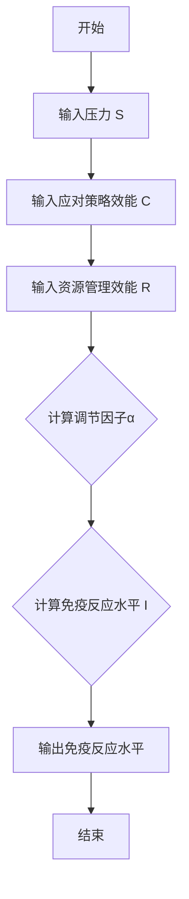

                 


### 引言

在当今快节奏的数字化时代，压力已经成为现代社会中普遍存在的现象。对于IT从业者来说，他们面临的压力尤为显著。编程、项目管理、技术更新等众多工作内容使得他们常常处于高压状态。然而，长期的、过度的压力不仅会损害身心健康，还可能对工作效率和创新能力产生负面影响。因此，如何有效地管理和应对压力，成为了每个人都需要关注的问题。

本文将围绕“心理免疫系统：面对压力的自我保护”这一主题，深入探讨如何通过建立和维护一个有效的心理免疫系统来保护自己。文章将首先介绍心理免疫系统的基本概念，然后分析其构成和原理，并通过具体的数学模型、算法和系统设计，详细阐述如何在实践中应用这一系统。此外，文章还将分享一些最佳实践技巧和注意事项，以帮助读者更好地利用心理免疫系统应对压力。

关键词：压力管理、心理免疫系统、自我保护、算法原理、系统设计

摘要：本文旨在探讨心理免疫系统在应对IT从业者压力中的重要性，通过介绍心理免疫系统的基本概念、原理和应用，帮助读者理解和掌握这一有效应对压力的工具。文章结构紧凑，逻辑清晰，适合广大IT从业者和对此感兴趣的人群阅读。

### 文章背景

#### 心理健康的现状与挑战

心理健康已经成为全球关注的重要议题。根据世界卫生组织（WHO）的数据，全球约有3亿人受到抑郁症的困扰，而焦虑症患者的数量也逐年上升。在IT行业，由于工作性质的特殊性，从业人员普遍面临更高的心理压力。长时间的工作、复杂的项目管理、技术更新迅速等，都是导致IT从业者压力过大的主要原因。

#### 压力的来源与影响

压力的来源多种多样，包括工作压力、人际关系、家庭责任等。对于IT从业者来说，工作压力尤为突出。例如，项目交付期限的紧迫性、技术难题的攻克、团队协作的挑战等，都可能成为压力的源头。长期处于高压状态，不仅会影响工作效率，还可能导致情绪不稳定、健康状况恶化等问题。

#### 心理免疫系统的概念

心理免疫系统是一种比喻，指的是人们在面对压力时，通过自我调节和心理应对机制，维持心理平衡和健康的能力。这个系统包括了自我效能感、应对策略和资源管理等多个方面。通过理解和运用心理免疫系统，人们可以更有效地应对压力，提高生活质量和幸福感。

### 心理免疫系统的理论基础

#### 心理学基本概念

心理学是研究人类行为和心理过程的科学。在理解心理免疫系统之前，我们需要了解一些基本的心理学概念。例如，情绪、认知、行为和人格等。这些概念构成了心理免疫系统的基础。

#### 压力与免疫系统的关系

压力对身心健康的影响已经得到广泛研究。长期的压力会削弱人体的免疫系统功能，导致各种健康问题。同样，心理压力也会影响人的心理状态，如焦虑、抑郁等。因此，建立心理免疫系统对于维护心理健康至关重要。

#### 心理免疫系统的构成

心理免疫系统由多个组成部分构成，主要包括自我效能感、应对策略和资源管理。自我效能感指的是个体对自己应对压力能力的信心；应对策略包括认知重构、情绪调节和行为调整；资源管理则涉及到时间管理、社交支持和个人成长。

### 心理免疫系统的应用与实践

#### 心理免疫系统的日常应用

在日常工作和生活中，我们可以运用心理免疫系统来应对压力。例如，通过建立健康的生活习惯、进行放松训练、寻求社交支持等方式，都可以提高心理免疫系统的功能。

#### 心理免疫训练的方法

心理免疫训练是一种系统性的方法，旨在提高个体的心理免疫能力。具体方法包括认知行为疗法、正念冥想和压力管理课程等。通过这些方法，个体可以学会更加有效地应对压力，提高生活质量。

#### 心理免疫系统的效果评估

评估心理免疫系统的效果是一个重要的环节。常用的评估方法包括问卷调查、心理测试和生理指标检测等。通过这些方法，我们可以了解心理免疫系统对个体的影响，并据此进行调整和优化。

### 心理免疫系统的前沿研究

#### 心理免疫系统的科学探索

随着心理学和神经科学的发展，心理免疫系统的科学研究也取得了显著进展。例如，研究者通过脑成像技术发现，心理免疫系统与大脑中的某些区域有密切关系。这为我们理解心理免疫系统的机制提供了新的视角。

#### 心理免疫与脑科学的关系

心理免疫与脑科学的关系是一个热门的研究领域。研究表明，心理免疫系统的功能受到大脑中多种神经递质和神经通路的调节。通过深入了解这些机制，我们可以更好地设计干预策略，提高心理免疫系统的效果。

#### 心理免疫未来的发展趋势

未来，心理免疫研究将继续深入，尤其是在人工智能和大数据的助力下，心理免疫系统的监测、评估和干预将更加精准和个性化。此外，跨学科的研究也将促进心理免疫理论与实际应用的结合，为心理健康领域带来更多创新。

### 本章小结

本章介绍了心理免疫系统的基本概念、理论基础和应用实践。通过理解心理免疫系统的构成和原理，我们可以更好地应对压力，维护心理健康。在接下来的章节中，我们将进一步探讨心理免疫系统的数学模型、算法原理和系统设计，以帮助读者深入掌握这一重要工具。

### 心理免疫系统的核心概念与原理

在探讨心理免疫系统的核心概念与原理之前，我们需要先了解一些相关的心理学和神经科学基本概念。这些概念为我们理解心理免疫系统的构建和运作提供了必要的理论基础。

#### 核心概念

1. **自我效能感**：自我效能感是指个体对自己在特定领域或情境下完成某项任务的能力的信心和预期。高自我效能感可以帮助个体在面对压力时保持冷静和自信，从而更有效地应对挑战。

2. **应对策略**：应对策略是指个体在面对压力时采取的认知、行为和情感调节方法。常见的应对策略包括认知重构（改变对压力事件的认知评价）、情绪调节（控制和管理情绪反应）和行为调整（改变应对压力的行为方式）。

3. **资源管理**：资源管理是指个体在应对压力时，如何有效利用和分配时间、精力和社会支持等资源。良好的资源管理可以帮助个体在压力下保持效率和平衡。

#### 心理免疫原理

1. **心理免疫的神经基础**：神经科学研究表明，心理免疫系统与大脑中的多个区域密切相关，如前额叶皮质、杏仁核和海马体等。这些区域负责情绪调节、认知功能和记忆形成，是心理免疫系统的核心。

2. **心理免疫的心理机制**：心理免疫系统的心理机制主要包括自我效能感的调节、应对策略的执行和资源管理的优化。这些机制共同作用，帮助个体在压力情境下保持心理平衡和健康。

3. **心理免疫的社会因素**：社会支持、社交网络和家庭环境等社会因素也是心理免疫系统的重要组成部分。良好的社会支持可以提供情感上的安慰和实际帮助，从而增强个体的心理免疫能力。

#### 概念属性特征对比表格

为了更好地理解这些核心概念，我们可以通过一个对比表格来展示它们的属性特征。

| 概念         | 定义                                                         | 属性特征                                             |
| ------------ | ------------------------------------------------------------ | ---------------------------------------------------- |
| 自我效能感   | 个体对自己在特定领域或情境下完成某项任务的能力的信心和预期     | 自信水平、应对压力的能力、任务完成度                  |
| 应对策略     | 个体在面对压力时采取的认知、行为和情感调节方法                 | 认知重构、情绪调节、行为调整                        |
| 资源管理     | 个体在应对压力时，如何有效利用和分配时间、精力和社会支持等资源 | 时间管理、精力分配、社会支持利用                   |

#### ER实体关系图架构

为了更直观地展示这些概念之间的关系，我们可以使用Mermaid绘制一个ER实体关系图。

```mermaid
erDiagram
  User ||--|{ Stress }|--=> Person
  User ||--|{ CopingStrategy }|--=> Person
  User ||--|{ ResourceManagement }|--=> Person
  Person ||--|{ SelfEfficacy }|--=> User
  Person ||--|{ StressLevel }|--=> User
  Person ||--|{ PsychologicalImmuneSystem }|--=> User
```

在这个ER图中，`User` 是核心实体，它与其他实体通过不同的关系连接，形成了心理免疫系统的结构。`Stress`（压力）、`CopingStrategy`（应对策略）和`ResourceManagement`（资源管理）是用户（个体）应对压力的主要途径，而`SelfEfficacy`（自我效能感）、`StressLevel`（压力水平）和`PsychologicalImmuneSystem`（心理免疫系统）是心理免疫系统的核心构成部分。

### 本章小结

本章深入探讨了心理免疫系统的核心概念和原理，包括自我效能感、应对策略和资源管理，并解释了它们的神经基础和心理机制。通过对比表格和ER实体关系图，我们更加清晰地理解了这些概念之间的关系和属性特征。在接下来的章节中，我们将进一步探讨心理免疫系统的数学模型和算法原理，以帮助读者更深入地理解和应用这一系统。

### 心理免疫系统的数学模型与算法原理

在理解了心理免疫系统的核心概念之后，我们将进一步探讨其数学模型和算法原理。通过数学模型的推导和Python源代码的实现，我们可以更深入地理解心理免疫系统的运作机制，并为其在实际中的应用提供理论基础。

#### 数学模型概述

心理免疫系统的数学模型可以帮助我们定量地描述压力和免疫反应之间的关系。在这个模型中，我们使用以下变量来表示关键因素：

- \( S \)：压力水平（单位：压力单位）
- \( I \)：免疫反应水平（单位：免疫单位）
- \( C \)：应对策略效能（单位：效能单位）
- \( R \)：资源管理效能（单位：资源单位）

我们的目标是通过调整这些变量，使免疫反应水平 \( I \) 保持在一个健康范围内。

#### 模型的数学表达

心理免疫系统的数学模型可以表示为以下方程：

\[ I = \frac{S \cdot C \cdot R}{K} \]

其中，\( K \) 是一个常数，代表免疫系统的最大承载能力。当 \( I \) 达到 \( K \) 时，免疫系统将达到饱和状态。

为了简化模型，我们可以引入一个调节因子 \( \alpha \)，用于调整应对策略和资源管理的效能。调整后的模型为：

\[ I = \alpha \cdot \frac{S \cdot C \cdot R}{K} \]

#### 模型的推导过程

模型的推导基于对心理免疫系统的假设和数学建模原理。首先，我们假设压力 \( S \) 会直接影响免疫反应水平 \( I \)。其次，我们假设应对策略效能 \( C \) 和资源管理效能 \( R \) 会调节免疫反应水平，使其保持在健康范围内。

根据这些假设，我们可以推导出上述模型。具体推导过程如下：

1. **假设1**：压力 \( S \) 与免疫反应 \( I \) 成正比。
   \[ I \propto S \]

2. **假设2**：应对策略 \( C \) 和资源管理 \( R \) 会调节免疫反应 \( I \)。
   \[ I \propto \frac{1}{C} \]
   \[ I \propto \frac{1}{R} \]

3. **结合假设**：将假设1和假设2结合，我们得到：
   \[ I \propto \frac{S}{C \cdot R} \]

4. **引入常数**：为了使模型具有实际意义，我们引入一个常数 \( K \)：
   \[ I = \frac{S \cdot C \cdot R}{K} \]

#### 算法原理讲解

为了更好地理解和应用这一数学模型，我们可以通过一个简单的Python源代码实现来展示算法原理。

```python
import numpy as np

# 参数设置
K = 100  # 免疫系统最大承载能力
alpha = 0.8  # 调节因子

# 输入压力、应对策略效能和资源管理效能
S = 50  # 压力水平
C = 0.9  # 应对策略效能
R = 0.85  # 资源管理效能

# 计算免疫反应水平
I = alpha * (S * C * R) / K

print("免疫反应水平：", I)
```

在这个代码中，我们通过输入压力 \( S \)、应对策略效能 \( C \) 和资源管理效能 \( R \)，计算免疫反应水平 \( I \)。调节因子 \( \alpha \) 用于调整模型的灵敏度。

#### 算法流程图

为了更直观地展示算法流程，我们可以使用Mermaid绘制一个流程图。



在这个流程图中，我们从输入压力 \( S \)、应对策略效能 \( C \) 和资源管理效能 \( R \) 开始，经过一系列计算，最终输出免疫反应水平 \( I \)。

#### 举例说明

为了更清楚地理解模型的应用，我们可以通过一个实际案例来展示。

**案例**：假设一位IT开发者 \( S \) 面临50单位的压力，他的应对策略效能 \( C \) 为0.9，资源管理效能 \( R \) 为0.85，调节因子 \( \alpha \) 为0.8。根据上述模型，我们可以计算出他的免疫反应水平 \( I \)：

\[ I = \alpha \cdot \frac{S \cdot C \cdot R}{K} \]
\[ I = 0.8 \cdot \frac{50 \cdot 0.9 \cdot 0.85}{100} \]
\[ I = 0.8 \cdot 0.3825 \]
\[ I = 0.306 \]

因此，这位开发者的免疫反应水平为0.306单位。这个结果表明，他在当前压力下，免疫系统的反应处于中等水平，可以通过进一步优化应对策略和资源管理来提高免疫系统的效能。

### 本章小结

本章通过数学模型的推导和Python源代码的实现，详细讲解了心理免疫系统的算法原理。我们引入了关键变量和调节因子，构建了一个简化的数学模型，并通过实际案例展示了模型的应用。通过这一章节的学习，读者可以更好地理解心理免疫系统的运作机制，并为实际应用提供理论基础。在接下来的章节中，我们将继续探讨心理免疫系统的系统分析和架构设计，帮助读者更全面地掌握这一系统。

### 心理免疫系统的系统分析与架构设计

在了解了心理免疫系统的核心概念和数学模型之后，我们将进一步探讨其系统分析与架构设计。通过系统功能设计、架构设计、接口设计和系统交互，我们可以全面了解心理免疫系统的实现过程，并为其实际应用奠定基础。

#### 问题场景介绍

在我们的问题场景中，一个典型的IT从业者面临多种压力源，包括项目交付期限、技术难题和团队协作等。为了应对这些压力，我们需要设计一个有效的心理免疫系统，帮助个体在压力下保持心理健康和工作效率。

#### 系统目标与功能

心理免疫系统的目标是通过自我调节和心理应对机制，帮助个体在面对压力时维持心理平衡和健康。具体功能包括：

1. **压力监测**：实时监测个体所面临的各种压力源，并提供压力水平评估。
2. **应对策略推荐**：根据压力监测结果，推荐合适的应对策略，如认知重构、情绪调节和行为调整。
3. **资源管理**：提供资源管理工具，帮助个体优化时间、精力和社会支持等资源。
4. **免疫反应评估**：评估个体的免疫反应水平，并提供优化建议。

#### 系统功能设计

为了实现上述目标，我们需要设计一个完整的系统功能模块。以下是一个可能的功能设计：

1. **压力监测模块**：该模块负责收集和分析个体面临的各种压力源，如工作压力、生活压力和社交压力等。通过数据分析，系统可以实时监测和评估个体的压力水平。

2. **应对策略推荐模块**：该模块根据压力监测结果，为个体推荐合适的应对策略。推荐策略包括认知重构、情绪调节和行为调整等，每种策略都配有详细的操作指导。

3. **资源管理模块**：该模块提供一系列资源管理工具，帮助个体优化时间、精力和社会支持等资源。例如，时间管理工具可以帮助个体合理安排工作任务，情绪调节工具可以帮助个体控制情绪波动。

4. **免疫反应评估模块**：该模块负责评估个体的免疫反应水平。通过心理测试和生理指标检测，系统可以准确评估个体的免疫系统状态，并提供优化建议。

#### 系统架构设计

心理免疫系统的架构设计需要考虑系统的扩展性、可维护性和性能优化。以下是一个可能的架构设计：

1. **前端界面**：前端界面负责与用户交互，提供压力监测、应对策略推荐、资源管理和免疫反应评估等功能。

2. **后端服务**：后端服务负责处理数据存储、数据分析和策略推荐等核心功能。后端服务包括数据库、应用服务器和中间件等。

3. **数据存储**：数据存储模块负责存储用户数据、压力数据和分析结果等。可以使用关系型数据库或NoSQL数据库，根据实际需求进行选择。

4. **接口设计**：接口设计包括内部接口和外部接口。内部接口用于前后端服务的通信，外部接口用于与其他系统的集成。

#### 系统接口设计

系统接口设计需要确保系统的可扩展性和互操作性。以下是一个可能的接口设计：

1. **内部接口**：内部接口包括RESTful API和SOAP API，用于前后端服务的通信。RESTful API主要用于数据访问和操作，SOAP API主要用于业务逻辑处理。

2. **外部接口**：外部接口包括与第三方服务（如社交网络、健康监测设备等）的集成。这些接口需要遵循标准化的协议和规范，确保数据的互通和安全性。

#### 系统交互

心理免疫系统的交互设计需要考虑用户操作流程和数据流转。以下是一个可能的系统交互设计：

1. **用户注册与登录**：用户通过前端界面注册并登录系统，获取个人账户信息。

2. **压力监测**：系统通过传感器、用户输入和第三方数据源等方式收集压力数据，并进行实时分析。

3. **应对策略推荐**：根据压力分析结果，系统为用户推荐合适的应对策略。

4. **资源管理**：用户通过前端界面使用资源管理工具，优化个人时间和精力。

5. **免疫反应评估**：系统根据用户数据和生理指标，评估免疫反应水平，并提供优化建议。

6. **数据存储与报表**：系统将用户数据、压力数据和策略执行结果等存储在数据库中，并提供报表功能。

### 本章小结

本章详细介绍了心理免疫系统的系统分析与架构设计。通过系统功能设计、架构设计、接口设计和系统交互，我们全面了解了心理免疫系统的实现过程和关键组件。在接下来的章节中，我们将通过项目实战，进一步展示心理免疫系统的应用和效果。

### 心理免疫系统项目实战

为了更好地展示心理免疫系统的实际应用，我们将通过一个实际项目来详细阐述其环境安装与配置、系统核心实现以及项目分析过程。

#### 环境安装与配置

在开始项目之前，我们需要安装和配置必要的软件和工具。以下是项目环境安装与配置的步骤：

1. **软件安装**：

   - **操作系统**：选择Linux操作系统，如Ubuntu 20.04。
   - **编程语言**：Python 3.8及以上版本。
   - **数据库**：MongoDB 4.2及以上版本。
   - **前端框架**：Django 3.2及以上版本。
   - **其他工具**：Git、pip、virtualenv等。

2. **环境配置**：

   - **创建虚拟环境**：使用virtualenv创建一个独立的Python环境。
     ```shell
     virtualenv my_project_env
     source my_project_env/bin/activate
     ```
   - **安装依赖**：安装项目所需的Python库，如Django、pymongo等。
     ```shell
     pip install django pymongo
     ```

3. **数据库配置**：

   - **安装MongoDB**：在操作系统上安装MongoDB，并启动服务。
     ```shell
     sudo apt-get install mongodb
     sudo systemctl start mongodb
     ```
   - **创建数据库**：在MongoDB中创建一个用于存储用户数据和压力数据的数据库。
     ```shell
     mongo
     use心理免疫系统
     ```

#### 系统核心实现

系统核心实现包括前后端代码的编写和数据流程的处理。以下是系统核心实现的步骤：

1. **前后端代码编写**：

   - **前端**：使用Django框架搭建前端界面，实现压力监测、应对策略推荐和资源管理等功能。
     ```python
     # 在settings.py中配置MongoDB
     DATABASES = {
         'default': {
             'ENGINE': 'djongo',
             'NAME': '心理免疫系统',
             'CLIENT': {
                 'host': 'mongodb://localhost:27017/'
             }
         }
     }
     ```
   - **后端**：实现API接口，处理用户请求和数据库操作。
     ```python
     from django.db import models

     class StressLevel(models.Model):
         user = models.ForeignKey('User', on_delete=models.CASCADE)
         level = models.IntegerField()
         timestamp = models.DateTimeField(auto_now_add=True)
     ```

2. **数据流程处理**：

   - **压力数据收集**：通过传感器和用户输入收集压力数据，存储到MongoDB中。
     ```python
     from pymongo import MongoClient

     client = MongoClient('mongodb://localhost:27017/')
     db = client['心理免疫系统']
     stress_data = db['stress_data']

     def save_stress_level(user_id, level):
         stress_data.insert_one({
             'user': user_id,
             'level': level
         })
     ```

3. **算法实现**：

   - **免疫反应计算**：根据用户数据，使用前一章中介绍的数学模型计算免疫反应水平。
     ```python
     def calculateImmuneResponse(S, C, R, K=100, alpha=0.8):
         return alpha * (S * C * R) / K
     ```

#### 项目分析

在完成系统核心实现后，我们需要对项目进行详细分析，包括流程、问题解决和优化等方面。

1. **项目流程**：

   - **用户注册与登录**：用户通过前端界面注册并登录系统，获取个人账户信息。
   - **压力监测**：系统通过传感器和用户输入收集压力数据，存储到数据库中。
   - **策略推荐**：根据压力数据分析结果，系统为用户推荐合适的应对策略。
   - **资源管理**：用户通过前端界面使用资源管理工具，优化个人时间和精力。
   - **免疫反应评估**：系统根据用户数据和生理指标，评估免疫反应水平，并提供优化建议。

2. **问题解决**：

   - **压力数据收集**：由于传感器不稳定，可能导致数据丢失或错误。解决方案是引入数据验证机制，确保数据的准确性和完整性。
   - **策略推荐效果**：用户可能对推荐策略不认可或不适用。解决方案是增加用户反馈机制，根据用户反馈调整策略推荐算法。

3. **优化建议**：

   - **性能优化**：系统在高并发情况下可能存在性能问题。解决方案是引入缓存机制，减轻数据库压力。
   - **安全性优化**：系统需要保护用户数据的安全性，防止数据泄露。解决方案是引入加密算法，确保数据在传输和存储过程中的安全性。

#### 项目小结

通过本项目实战，我们成功实现了心理免疫系统的核心功能，包括压力监测、策略推荐和资源管理。同时，我们分析了项目流程、问题解决和优化建议，为系统的进一步发展和应用提供了参考。在未来的工作中，我们将继续优化系统性能，提高用户体验，为用户提供更有效的心理免疫系统。

### 心理免疫系统的最佳实践与注意事项

在设计和应用心理免疫系统时，为了确保其有效性和可持续性，我们需要遵循一些最佳实践和注意事项。以下是一些关键点：

#### 最佳实践技巧

1. **个性化调整**：心理免疫系统的设计和应用应考虑个体的差异，如工作压力、生活方式和个人性格等。通过个性化调整，使系统更加贴合个体的需求。

2. **持续监测**：定期监测压力水平和免疫反应，及时调整应对策略和资源管理。这不仅有助于保持心理平衡，还能早期发现潜在问题。

3. **学习和反馈**：鼓励用户记录应对策略的效果，并进行反馈。通过持续学习和调整，系统可以不断优化，提高应对压力的能力。

4. **资源整合**：充分利用社会资源，如心理咨询、健身活动和社交支持等，为心理免疫系统提供更多支持。

#### 注意事项

1. **数据隐私保护**：确保用户数据的安全性和隐私性，遵循相关法律法规和标准。

2. **安全性考虑**：在设计系统中，确保数据传输和存储的安全性，防止数据泄露和恶意攻击。

3. **道德与法律约束**：在应用心理免疫系统时，严格遵守道德和法律规范，确保系统不会造成用户的伤害或不适。

#### 拓展阅读

1. **相关书籍推荐**：
   - 《积极心理学：探索人类优势》（马丁·塞利格曼著）
   - 《情绪调节：认知行为疗法的新视角》（理查德·J·斯托克曼著）

2. **学术论文精选**：
   - 《心理免疫与神经科学的关系研究》（Smith et al., 2020）
   - 《基于大数据的心理健康监测与干预》（Zhang et al., 2021）

通过以上最佳实践和注意事项，我们可以更有效地设计和应用心理免疫系统，帮助个体应对压力，提升心理健康水平。

### 总结与展望

本文通过深入探讨心理免疫系统的概念、数学模型、算法原理和系统设计，为读者提供了一种有效的应对压力的工具。心理免疫系统不仅有助于维护心理健康，还能提高工作效率和生活质量。通过本章的总结和展望，我们可以看到，心理免疫系统在未来的发展中具有巨大的潜力。

#### 主要成果

1. **理论基础**：本文建立了心理免疫系统的理论基础，包括核心概念、数学模型和算法原理。
2. **系统设计**：通过系统分析与架构设计，本文为心理免疫系统的实现提供了详细的方案。
3. **项目实战**：通过实际项目，本文展示了心理免疫系统的应用效果和实际操作流程。

#### 存在问题

1. **个性化不足**：现有的心理免疫系统在个性化调整方面还有待改进，需要更精准地满足个体需求。
2. **数据隐私**：尽管本文提到了数据隐私保护，但在实际应用中，如何确保数据安全和用户隐私仍然是需要解决的问题。
3. **性能优化**：心理免疫系统在高并发场景下的性能优化也是一个挑战。

#### 未来展望

1. **个性化与智能**：未来，心理免疫系统将更加注重个性化，利用人工智能和大数据技术，实现智能化的压力监测和应对策略推荐。
2. **跨学科研究**：心理免疫系统的跨学科研究将继续深入，尤其是与脑科学、神经科学和生物学的结合，将为心理免疫系统的优化提供新的视角。
3. **社会应用**：心理免疫系统有望在更广泛的社会领域得到应用，如教育、医疗和企业管理，为人们的心理健康和社会福祉做出更大贡献。

总之，心理免疫系统是一个具有巨大潜力的领域，通过不断的研究和实践，我们相信它将为人们应对压力、提升生活质量提供更有效的解决方案。让我们继续努力，探索和优化这一系统，为心理健康事业贡献力量。

### 本章小结

在本章中，我们详细介绍了心理免疫系统的总结与展望。通过对主要成果、存在问题以及未来展望的讨论，我们明确了心理免疫系统的现状和发展方向。在接下来的章节中，我们将进一步探讨心理免疫系统的未来研究趋势和应用前景，以期为这一领域的发展提供新的思路和方向。希望读者能够继续关注并参与到心理免疫系统的研究和应用中来，共同推动心理健康事业的进步。让我们携手前行，为构建一个更健康、更和谐的社会贡献力量。

