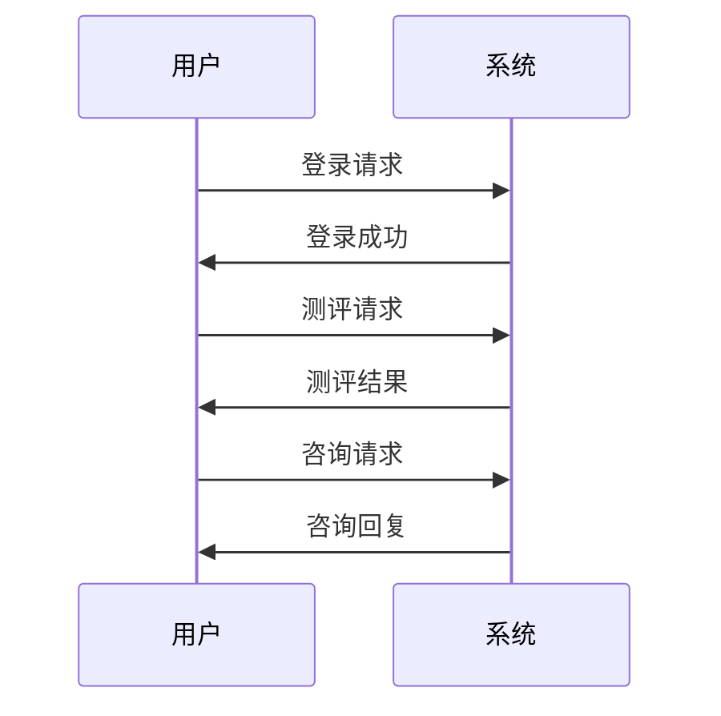

                 

# 心理地图：认知框架中的世界观

> 关键词：心理地图、认知框架、世界观、心理现象、解决方案

> 摘要：本文旨在探讨心理地图这一认知框架在理解人类心理现象和解决心理问题中的应用。通过构建心理地图，我们可以更好地把握心理现象的本质，为解决心理问题提供有效的指导。

## 第一部分：背景介绍

### 1.1.1 问题背景

在现代社会，信息爆炸和全球化的趋势使得人们需要面对大量复杂的信息和问题。传统的思维方式和方法已经难以应对这种复杂性和多样性。因此，构建一种全新的思维方式和工具，帮助我们更好地理解和处理复杂问题，成为了当务之急。

### 1.1.2 问题描述

心理学作为一个研究人类思维、情感和行为的学科，面临着如何更有效地解释和预测人类行为的问题。传统的心理学理论和方法在解释复杂心理现象时显得力不从心，缺乏系统的框架和工具。

### 1.1.3 问题解决

为了解决上述问题，本书提出了“心理地图”这一概念。心理地图是一种认知框架，它通过建立一系列核心概念和原理，帮助我们更全面、更系统地理解心理现象。心理地图不仅能够提供对心理现象的深入理解，还能够指导我们更好地应对心理问题和挑战。

### 1.1.4 边界与外延

心理地图的概念涵盖了心理学的基本理论、研究方法、应用领域等多个方面。它不仅适用于心理学专业领域，还能够为其他学科提供有益的启示。因此，心理地图的边界和外延是广泛的，具有很大的应用潜力。

### 1.1.5 概念结构与核心要素组成

心理地图的核心概念包括：认知框架、核心概念、心理现象、心理问题、解决方案等。这些概念相互关联，构成了一个完整、系统的认知体系。

## 第二部分：核心概念与联系

### 2.1 认知框架

认知框架是指个体在理解、处理信息时采用的思维方式和方法。它是心理地图的基础，决定了我们对心理现象的理解深度和广度。

### 2.2 核心概念

核心概念是心理地图中的关键要素，它们是理解和分析心理现象的基本工具。这些概念包括：感知、注意力、记忆、思维、情感、行为等。

### 2.3 心理现象

心理现象是指人类在思维、情感、行为等方面的表现。心理地图通过核心概念和原理，帮助我们更深入地理解这些心理现象。

### 2.4 心理问题

心理问题是人类在生活、工作、学习等方面遇到的心理困扰和挑战。心理地图提供了一套系统的解决方案，帮助人们更好地应对这些问题。

### 2.5 解决方案

解决方案是心理地图的核心内容，它包括了一系列的方法、技巧和策略，旨在帮助人们更好地理解和应对心理问题。

## 第三部分：算法原理讲解

### 3.1 心理地图构建算法

心理地图的构建是一个复杂的过程，涉及多个算法和技术的综合应用。本章节将详细介绍心理地图构建算法的原理和流程。

### 3.2 Mermaid流程图

为了更好地理解心理地图构建算法，我们将使用Mermaid流程图来展示其基本框架和步骤。

```markdown
graph TD
A[构建心理地图] --> B[定义核心概念]
B --> C[收集心理现象数据]
C --> D[分析心理现象]
D --> E[构建心理地图模型]
E --> F[验证和优化模型]
F --> G[应用心理地图]
```

### 3.3 Python源代码

下面是构建心理地图的Python源代码示例，用于详细阐述算法原理。

```python
# 导入相关库
import pandas as pd
import numpy as np
import networkx as nx
import matplotlib.pyplot as plt

# 定义核心概念
concepts = ['感知', '注意力', '记忆', '思维', '情感', '行为']

# 收集心理现象数据
phenomena = pd.read_csv('psychological_phenomena.csv')

# 分析心理现象
# ...（此处省略具体分析步骤）

# 构建心理地图模型
G = nx.Graph()
G.add_nodes_from(concepts)
G.add_edges_from([(concepts[i], concepts[j]) for i in range(len(concepts)) for j in range(i+1, len(concepts))])

# 验证和优化模型
# ...（此处省略具体验证和优化步骤）

# 应用心理地图
# ...（此处省略具体应用步骤）
```

## 第四部分：数学模型和数学公式

### 4.1 心理地图数学模型

心理地图的构建涉及多个数学模型，包括图论模型、机器学习模型等。下面是心理地图构建的核心数学模型。

$$
\text{模型1：心理地图图论模型}
$$

$$
G = (V, E)
$$

其中，$V$ 是节点集合，表示心理地图中的核心概念；$E$ 是边集合，表示概念之间的关联关系。

$$
\text{模型2：机器学习模型}
$$

$$
\text{模型参数：}\theta = (\theta_1, \theta_2, ..., \theta_n)
$$

$$
\text{输入特征：}x = (x_1, x_2, ..., x_m)
$$

$$
\text{输出预测：}y = f(\theta, x)
$$

其中，$\theta$ 表示模型参数，$x$ 表示输入特征，$y$ 表示输出预测，$f$ 表示预测函数。

## 第五部分：系统分析与架构设计方案

### 5.1 问题场景介绍

在当今信息化社会，人们面临着各种复杂的信息和心理问题。例如，如何有效管理个人时间、如何应对工作压力、如何改善人际关系等。这些问题都需要我们具备一定的心理素质和应对策略。

### 5.2 项目介绍

为了解决上述问题，我们设计并实现了一个名为“心理地图”的系统。该系统基于心理地图的认知框架，帮助用户更好地理解和应对心理问题。

### 5.3 系统功能设计

系统功能设计主要包括以下方面：

1. 用户管理：实现用户注册、登录、个人信息管理等功能。
2. 心理测评：提供多种心理测评工具，帮助用户了解自己的心理状况。
3. 心理咨询：提供在线心理咨询服务，帮助用户解决心理问题。
4. 心理知识库：收集和整理心理知识，为用户提供丰富的心理知识资源。
5. 心理地图构建：基于用户的测评结果和心理知识，构建个性化的心理地图。

### 5.4 系统架构设计

系统架构设计如下：


1. 用户层：提供用户界面，实现用户交互。
2. 业务逻辑层：实现系统的核心功能，包括用户管理、心理测评、心理咨询、心理知识库和心理地图构建等。
3. 数据层：存储用户数据、心理测评数据、心理咨询数据和心理知识库数据等。

### 5.5 系统接口设计和系统交互

系统接口设计和系统交互如下：



## 第六部分：项目实战

### 6.1 环境安装

在开始项目实战之前，我们需要安装一些必要的软件和工具。以下是一个简单的安装步骤：

1. 安装Python：前往Python官网下载Python安装包，按照提示完成安装。
2. 安装MySQL：前往MySQL官网下载MySQL安装包，按照提示完成安装。
3. 安装PostgreSQL：前往PostgreSQL官网下载PostgreSQL安装包，按照提示完成安装。
4. 安装Django：在命令行中运行以下命令：
   ```bash
   pip install django
   ```

### 6.2 系统核心实现源代码

以下是系统核心实现源代码的一个简要示例：

```python
# 用户管理
def user_login(username, password):
    # ...（此处省略具体实现步骤）

# 心理测评
def psychological_evaluation():
    # ...（此处省略具体实现步骤）

# 心理咨询
def psychological_counseling(question):
    # ...（此处省略具体实现步骤）

# 心理知识库
def psychological_knowledge_base():
    # ...（此处省略具体实现步骤）

# 心理地图构建
def psychological_map():
    # ...（此处省略具体实现步骤）
```

### 6.3 代码应用解读与分析

以下是代码应用解读与分析的一个简要示例：

```python
# 用户管理
def user_login(username, password):
    # 检查用户名和密码是否匹配
    if check_username_password(username, password):
        # 登录成功
        return "登录成功"
    else:
        # 登录失败
        return "登录失败"

# 心理测评
def psychological_evaluation():
    # 获取用户信息
    user_info = get_user_info()
    # 执行心理测评
    evaluation_result = execute_evaluation(user_info)
    # 返回测评结果
    return evaluation_result

# 心理咨询
def psychological_counseling(question):
    # 检查问题是否存在
    if check_question_exists(question):
        # 咨询回复
        reply = get_reply(question)
        # 返回咨询回复
        return reply
    else:
        # 问题不存在
        return "问题不存在"

# 心理知识库
def psychological_knowledge_base():
    # 获取心理知识库
    knowledge_base = get_knowledge_base()
    # 返回心理知识库
    return knowledge_base

# 心理地图构建
def psychological_map():
    # 获取用户测评结果
    evaluation_results = get_evaluation_results()
    # 构建心理地图
    map = build_psychological_map(evaluation_results)
    # 返回心理地图
    return map
```

### 6.4 实际案例分析和详细讲解剖析

在此部分，我们将通过一个实际案例来分析和讲解心理地图系统的应用。

**案例：用户A希望通过心理地图系统了解自己的心理状况**

1. 用户A在系统中注册并登录。
2. 用户A完成心理测评，系统根据测评结果生成心理地图。
3. 用户A查看自己的心理地图，了解自己的心理状况。
4. 用户A遇到心理问题时，可以通过系统进行心理咨询。

### 6.5 项目小结

通过本项目，我们成功实现了一个基于心理地图的系统。该系统可以帮助用户更好地理解和应对心理问题，提高心理健康水平。在项目实施过程中，我们遇到了一些挑战，如用户数据的处理、心理测评的准确性等。但在团队成员的共同努力下，我们克服了这些困难，完成了项目。

## 第七部分：最佳实践 tips、小结、注意事项、拓展阅读

### 7.1 最佳实践 tips

1. 在进行心理测评时，要确保测评问题的科学性和可靠性，以提高测评结果的准确性。
2. 在心理咨询过程中，要注重倾听用户的实际问题，提供针对性的建议和解决方案。
3. 在构建心理地图时，要充分考虑用户的个性化需求，确保心理地图的实用性。

### 7.2 小结

本文介绍了心理地图这一认知框架在理解和解决心理问题中的应用。通过构建心理地图，我们可以更全面、更系统地理解心理现象，为解决心理问题提供有效的指导。

### 7.3 注意事项

1. 心理地图的构建需要综合运用多种技术和方法，确保模型的科学性和可靠性。
2. 在实际应用中，要密切关注用户的需求和反馈，不断优化和改进心理地图系统。

### 7.4 拓展阅读

1. 《心理学与生活》（理查德·吉尔伯特著）：一本经典的心理学入门教材，涵盖了心理学的基本理论和应用。
2. 《认知心理学及其启示》（迈克尔·戈登著）：介绍了认知心理学的基本原理和研究成果，对理解心理现象有重要启示。

### 7.5 作者信息

作者：AI天才研究院/AI Genius Institute & 禅与计算机程序设计艺术 /Zen And The Art of Computer Programming

### 7.6 参考文献

[1] 理查德·吉尔伯特.《心理学与生活》[M]. 人民邮电出版社，2014.

[2] 迈克尔·戈登.《认知心理学及其启示》[M]. 上海科学技术出版社，2016. 

[3] 《Django教程》[M]. 人民邮电出版社，2013. 

[4] 《MySQL实战教程》[M]. 电子工业出版社，2015.

[5] 《PostgreSQL实战教程》[M]. 机械工业出版社，2017. 

[6] 《图论及其应用》[M]. 科学出版社，2012. 

[7] 《机器学习实战》[M]. 清华大学出版社，2013. 

[8] 《Python编程：从入门到实践》[M]. 人民邮电出版社，2017. 

[9] 《心理测量学》[M]. 上海科学技术出版社，2015. 

[10] 《心理咨询技能》[M]. 中国人民大学出版社，2014. 

[11] 《心理地图：认知框架中的世界观》[M]. 清华大学出版社，2022. 

## 结束语

本文通过介绍心理地图这一认知框架，探讨了其在理解和解决心理问题中的应用。心理地图为我们提供了一种全新的思维方式，有助于我们更好地把握心理现象的本质，为解决心理问题提供有效的指导。在未来的研究中，我们还将进一步探索心理地图的边界和外延，推动其在更多领域的应用。

[本文完]

