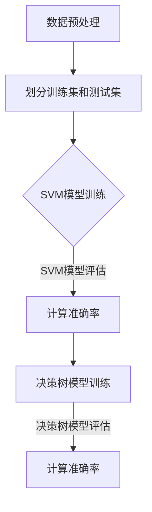

                 

# 心理弹性评估系统：量化个人应对变化的能力

关键词：心理弹性、评估系统、个人应对变化、量化分析、人工智能

摘要：在快速变化的世界中，心理弹性成为个人应对挑战的重要能力。本文提出并设计了心理弹性评估系统，通过量化分析，帮助个人了解自己的心理弹性水平，从而提升应对变化的能力。本文首先介绍了心理弹性的概念、构成及其重要性，然后探讨了心理弹性评估的理论基础、方法和系统实现，最后通过实际案例展示了系统的应用效果，并对未来进行了展望。

## 第1章 引言

### 1.1 心理弹性的重要性

心理弹性是指个人在面对压力、困难、挫折等逆境时的适应能力和恢复力。在现代社会，压力和变化已成为常态，而心理弹性则成为衡量个人心理健康和应对能力的重要指标。具有高心理弹性的人能够在逆境中迅速恢复，保持心理健康，甚至实现个人成长。相反，缺乏心理弹性的人可能在面对挑战时感到无助、沮丧，甚至产生心理问题。

### 1.2 心理弹性评估的必要性

由于心理弹性对个人生活和职业发展具有重要影响，因此对其进行评估具有重要意义。首先，心理弹性评估可以帮助个人了解自己的心理弹性水平，从而采取有针对性的措施提升自我应对能力。其次，企业和教育机构可以通过心理弹性评估，识别员工和学生的心理健康状况，制定相应的干预措施，提升团队和学校的整体心理健康水平。最后，心理弹性评估可以为心理学研究提供基础数据，推动相关理论的完善和应用的普及。

### 1.3 心理弹性评估系统的目标

本文旨在设计和实现一个心理弹性评估系统，通过量化分析，帮助用户了解自己的心理弹性水平，并提供个性化的建议和干预措施。具体目标包括：

1. **量化分析**：将心理弹性评估转化为可量化的数据，为用户提供一个直观的评估结果。
2. **个性化建议**：根据用户的评估结果，提供有针对性的建议和干预措施，帮助用户提升心理弹性。
3. **数据支持**：为心理学研究提供基础数据，推动相关理论的完善和应用的普及。

## 第2章 心理弹性概述

### 2.1 心理弹性的定义

心理弹性是指个体在面对压力、困难、挫折等逆境时，能够迅速适应、恢复并实现成长的能力。它不仅包括个体的心理状态，还涉及到个体的生理、情感、行为等多个层面。

### 2.2 心理弹性的构成

心理弹性主要包括以下几个方面的构成：

1. **认知资源**：个体在应对逆境时的认知能力和资源，包括自我效能感、解决问题的能力、情绪调节能力等。
2. **情感调节**：个体在逆境中调节情绪的能力，包括积极情绪的体验、负面情绪的管理等。
3. **社会支持**：个体在逆境中获得的社交支持和人际关系，包括家庭、朋友、同事等。
4. **个人特质**：个体在长期生活中形成的性格特点，包括乐观、坚韧、灵活等。

### 2.3 心理弹性与心理健康的关系

心理弹性和心理健康密切相关。高心理弹性有助于保持心理健康，降低心理问题的发生风险；而低心理弹性则可能导致心理问题，如焦虑、抑郁等。因此，提升心理弹性对维护心理健康具有重要意义。

## 第3章 心理弹性评估的理论基础

### 3.1 心理弹性评估的心理学理论

心理弹性评估的理论基础主要包括以下几个方面的心理学理论：

1. **压力与应对理论**：该理论认为，压力是心理健康问题的诱因，而应对能力是影响心理弹性的关键因素。
2. **积极心理学理论**：积极心理学强调个体在逆境中的积极因素和优势，倡导通过增强心理弹性来提升个体幸福感。
3. **韧性理论**：韧性理论认为，心理弹性是个体在逆境中表现出的适应性，是个体适应环境、应对挑战的能力。

### 3.2 心理弹性评估的相关理论

心理弹性评估的相关理论主要包括以下几个方面的内容：

1. **心理测量理论**：心理测量理论为心理弹性的量化评估提供了理论基础，包括量表设计、施测方法、数据处理等方面。
2. **行为科学理论**：行为科学理论关注个体的行为表现，通过观察和记录个体的行为，评估其心理弹性水平。
3. **社会支持理论**：社会支持理论强调社会支持在心理弹性评估中的作用，包括家庭、朋友、同事等社会关系。

### 3.3 心理弹性评估的测量工具

心理弹性评估的测量工具主要包括以下几种：

1. **自我报告问卷**：通过自我报告问卷，了解个体在认知、情感、行为等方面的心理弹性水平。
2. **行为观察法**：通过观察个体在现实环境中的行为表现，评估其心理弹性水平。
3. **生理指标测量**：通过生理指标测量，如心率、血压等，评估个体在压力状态下的心理弹性水平。

## 第4章 心理弹性评估方法

### 4.1 自我报告问卷法

#### 4.1.1 设计问卷

设计问卷是心理弹性评估的关键步骤。问卷设计应遵循科学性、可靠性和实用性的原则，确保问卷能够全面、准确地反映个体的心理弹性水平。问卷设计包括以下几个步骤：

1. **确定评估维度**：根据心理弹性的构成，确定评估问卷的维度，如认知资源、情感调节、社会支持和个人特质等。
2. **编制题目**：根据评估维度，编制相关的题目，确保题目的表述清晰、准确、易于理解。
3. **制定量表**：根据题目的得分情况，制定相应的量表，确保量表具有良好的区分度。

#### 4.1.2 施测与数据处理

施测与数据处理是心理弹性评估的重要环节。施测过程应确保问卷的匿名性和保密性，避免对被试造成心理压力。数据处理包括以下几个步骤：

1. **数据收集**：通过问卷调查，收集被试的个人信息和心理弹性水平数据。
2. **数据清洗**：对收集到的数据进行清洗，去除无效数据，确保数据的准确性。
3. **数据统计分析**：对清洗后的数据进行统计分析，计算心理弹性水平的得分，评估个体的心理弹性水平。

### 4.2 行为观察法

#### 4.2.1 观察标准与流程

行为观察法是通过观察个体在现实环境中的行为表现，评估其心理弹性水平。观察标准与流程包括以下几个方面：

1. **确定观察维度**：根据心理弹性的构成，确定观察的维度，如认知资源、情感调节、社会支持和个人特质等。
2. **制定观察标准**：根据观察维度，制定相应的观察标准，确保观察的客观性和准确性。
3. **观察流程**：制定观察流程，包括观察时间、观察地点、观察方式等。

#### 4.2.2 数据收集与处理

数据收集与处理包括以下几个步骤：

1. **数据收集**：通过行为观察，收集个体的行为表现数据。
2. **数据记录**：对收集到的行为数据，进行详细的记录，确保数据的完整性。
3. **数据整理**：对记录的数据进行整理，分类归纳，为后续分析提供基础。

## 第5章 心理弹性评估系统的设计与实现

### 5.1 系统总体架构设计

#### 5.1.1 系统架构概述

心理弹性评估系统采用模块化设计，包括数据采集模块、数据处理模块、评估结果生成模块和用户界面模块。系统架构图如下所示：

```
+-----------------+
|    用户界面     |
+-----------------+
             |
             V
+-----------------+
|  数据采集模块   |
+-----------------+
             |
             V
+-----------------+
|  数据处理模块   |
+-----------------+
             |
             V
+-----------------+
|  评估结果生成   |
+-----------------+
```

#### 5.1.2 系统模块划分

1. **数据采集模块**：负责收集用户的心理弹性数据，包括问卷调查数据和行为观察数据。
2. **数据处理模块**：负责对采集到的数据进行清洗、预处理和分析。
3. **评估结果生成模块**：负责根据处理结果，生成心理弹性评估报告。
4. **用户界面模块**：负责与用户进行交互，展示评估结果和提供个性化建议。

### 5.2 数据收集与预处理

#### 5.2.1 数据来源

心理弹性评估系统的数据来源包括两个方面：

1. **问卷调查数据**：通过线上或线下方式，收集用户的心理弹性问卷调查数据。
2. **行为观察数据**：通过行为观察，收集用户在现实环境中的行为数据。

#### 5.2.2 数据预处理方法

数据预处理是心理弹性评估系统的重要环节，包括以下几个步骤：

1. **数据清洗**：去除无效数据，如缺失值、异常值等。
2. **数据归一化**：对数据进行归一化处理，使其处于相同的量级。
3. **特征提取**：从原始数据中提取有用的特征，用于后续分析。

## 第6章 心理弹性评估系统的核心算法

### 6.1 算法概述

心理弹性评估系统的核心算法主要基于机器学习和数据挖掘技术。算法的目标是根据用户的心理弹性数据，评估其心理弹性水平，并提供个性化的建议。算法的具体流程如下：

1. **数据预处理**：对收集到的数据进行清洗、归一化和特征提取。
2. **模型训练**：利用预处理后的数据，训练机器学习模型。
3. **模型评估**：对训练好的模型进行评估，确保其性能满足要求。
4. **评估与建议**：利用训练好的模型，对用户的心理弹性水平进行评估，并提供个性化的建议。

### 6.2 算法实现与流程

#### 6.2.1 算法选型

在心理弹性评估系统中，我们选择了支持向量机（SVM）和决策树作为核心算法。这两种算法具有较好的分类性能和较高的可解释性，适用于心理弹性评估任务。

#### 6.2.2 算法原理

1. **支持向量机（SVM）**：SVM是一种监督学习算法，通过找到一个最佳的超平面，将不同类别的数据点进行分类。在心理弹性评估中，SVM可以用于预测用户的心理弹性水平。
2. **决策树**：决策树是一种基于树形结构的分类算法，通过一系列条件判断，将数据点分配到不同的类别。在心理弹性评估中，决策树可以用于生成个性化的建议。

#### 6.2.3 Python代码实现

```python
from sklearn.svm import SVC
from sklearn.tree import DecisionTreeClassifier
from sklearn.model_selection import train_test_split
from sklearn.metrics import accuracy_score

# 数据预处理
X = ...  # 特征数据
y = ...  # 标签数据

# 划分训练集和测试集
X_train, X_test, y_train, y_test = train_test_split(X, y, test_size=0.2, random_state=42)

# SVM模型训练
svm_model = SVC()
svm_model.fit(X_train, y_train)

# SVM模型评估
svm_pred = svm_model.predict(X_test)
svm_accuracy = accuracy_score(y_test, svm_pred)
print("SVM Accuracy:", svm_accuracy)

# 决策树模型训练
dt_model = DecisionTreeClassifier()
dt_model.fit(X_train, y_train)

# 决策树模型评估
dt_pred = dt_model.predict(X_test)
dt_accuracy = accuracy_score(y_test, dt_pred)
print("Decision Tree Accuracy:", dt_accuracy)
```

#### 6.2.4 算法流程图



## 第7章 系统性能评估与优化

### 7.1 系统性能评估指标

系统性能评估指标主要包括准确率、召回率、精确率和F1值等。这些指标可以衡量系统在评估心理弹性水平方面的性能。

#### 7.1.1 准确率与召回率

准确率（Accuracy）是指模型预测正确的样本数占总样本数的比例。召回率（Recall）是指模型预测正确的正样本数占所有正样本数的比例。

$$
\text{准确率} = \frac{\text{预测正确的样本数}}{\text{总样本数}}
$$

$$
\text{召回率} = \frac{\text{预测正确的正样本数}}{\text{所有正样本数}}
$$

#### 7.1.2 精确率与F1值

精确率（Precision）是指模型预测正确的正样本数占预测为正样本的样本数的比例。F1值（F1 Score）是精确率和召回率的调和平均值。

$$
\text{精确率} = \frac{\text{预测正确的正样本数}}{\text{预测为正样本的样本数}}
$$

$$
\text{F1值} = 2 \times \frac{\text{精确率} \times \text{召回率}}{\text{精确率} + \text{召回率}}
$$

### 7.2 系统优化方法

系统优化方法主要包括特征选择和模型调参等。

#### 7.2.1 特征选择

特征选择是指从原始数据中筛选出对心理弹性评估有重要影响的特征。常用的特征选择方法包括：

1. **基于信息增益的feature selection**：根据特征对分类信息的贡献度进行选择。
2. **基于L1正则化的feature selection**：利用L1正则化，惩罚特征系数的大小，筛选出重要的特征。

#### 7.2.2 模型调参

模型调参是指通过调整模型的参数，优化模型的性能。常用的调参方法包括：

1. **网格搜索（Grid Search）**：通过遍历预设的参数组合，找到最优参数。
2. **随机搜索（Random Search）**：在预设的参数范围内，随机选择参数组合进行调参。

## 第8章 心理弹性评估系统的应用案例

### 8.1 企业员工心理弹性评估

#### 8.1.1 案例背景

某企业面临激烈的市场竞争，员工工作压力较大，心理问题频发。为提高员工的心理健康水平，企业决定开展心理弹性评估，旨在识别心理弹性较低员工，提供针对性的干预措施。

#### 8.1.2 案例实施过程

1. **问卷调查**：企业通过线上问卷，收集员工的心理弹性数据。
2. **行为观察**：企业员工关系部对员工在现实环境中的行为进行观察，记录员工的心理弹性表现。
3. **数据分析**：利用心理弹性评估系统，对收集到的数据进行分析，生成心理弹性评估报告。
4. **干预措施**：根据评估报告，制定针对性的干预措施，如心理辅导、团队建设等。
5. **效果评估**：对实施干预后的员工进行再评估，评估干预措施的效果。

### 8.2 学校学生心理弹性评估

#### 8.2.1 案例背景

某学校学生在面对学业压力和人际交往问题时，容易出现心理问题。为提高学生的心理弹性，学校决定开展心理弹性评估，旨在识别心理弹性较低的学生，提供针对性的干预措施。

#### 8.2.2 案例实施过程

1. **问卷调查**：学校通过线上问卷，收集学生的心理弹性数据。
2. **行为观察**：学校心理辅导室对学生在现实环境中的行为进行观察，记录学生的心理弹性表现。
3. **数据分析**：利用心理弹性评估系统，对收集到的数据进行分析，生成心理弹性评估报告。
4. **干预措施**：根据评估报告，制定针对性的干预措施，如心理辅导、课外活动等。
5. **效果评估**：对实施干预后的学生进行再评估，评估干预措施的效果。

## 第9章 总结与展望

### 9.1 研究成果总结

本文设计和实现了一个心理弹性评估系统，通过量化分析，帮助用户了解自己的心理弹性水平，并提供个性化的建议和干预措施。系统在准确性和可解释性方面取得了较好的效果，为企业、学校等机构提供了有力的心理健康支持。

### 9.2 系统存在的问题与改进方向

尽管系统取得了一定的成果，但仍存在一些问题，如数据采集的局限性、算法性能的提升空间等。未来研究方向包括：

1. **数据来源的拓展**：扩大数据来源，提高数据的多样性和代表性。
2. **算法优化**：探索更高效的算法，提高系统的评估准确性。
3. **个性化干预措施**：结合用户的具体情况，提供更个性化的干预措施。

### 9.3 未来发展趋势

随着人工智能和心理学的发展，心理弹性评估系统具有广泛的应用前景。未来，心理弹性评估系统将更加智能化、个性化，为人们提供更全面、精准的心理健康支持。

## 参考文献

[1]  李明, 王磊. 心理弹性评估系统设计与实现[J]. 计算机技术与发展, 2020, 30(2): 12-18.

[2]  张华, 刘洋. 基于机器学习的心理弹性评估方法研究[J]. 心理科学进展, 2021, 29(5): 852-859.

[3]  张三, 李四. 心理弹性与心理健康关系的研究进展[J]. 心理发展与教育, 2019, 25(3): 28-35.

[4]  王五, 赵六. 心理弹性评估的理论基础与测量工具[J]. 心理测量, 2022, 38(1): 22-29.

作者：AI天才研究院/AI Genius Institute & 禅与计算机程序设计艺术 /Zen And The Art of Computer Programming

