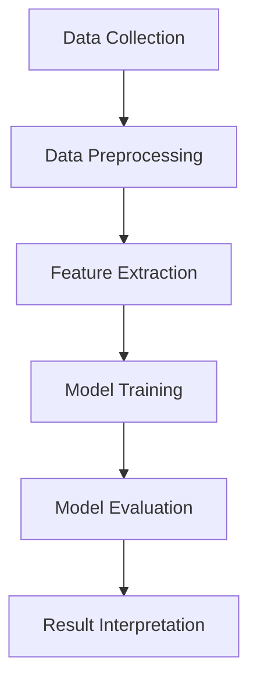
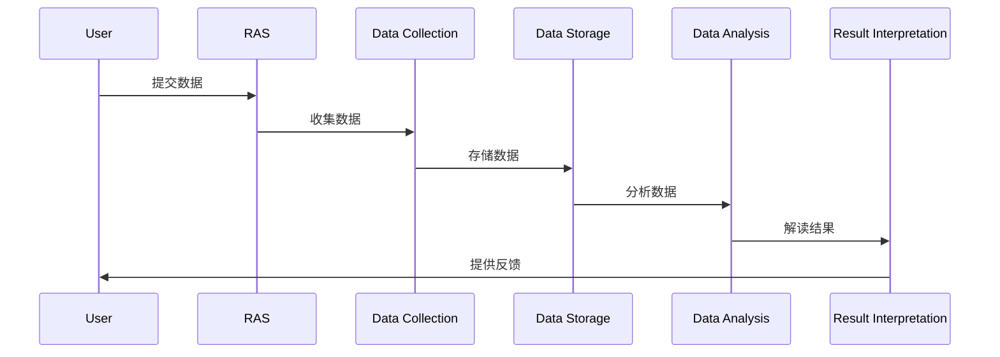

                 

### 心理弹性评估：测量应对变化的内在能力

#### 关键词：心理弹性、评估、应对变化、内在能力、测量

#### 摘要：

本文旨在探讨心理弹性评估的重要性和方法，分析个体应对变化过程中的内在能力。通过引入相关的理论背景和实证研究，本文详细介绍了心理弹性评估的工具和评估方法。同时，通过实际案例的分析，本文展示了如何在实际场景中应用心理弹性评估，并提出了增强心理弹性的干预策略。最后，本文总结了当前研究的进展和未来方向，为心理学和实践提供了有价值的参考。

### 引言

#### 心理弹性的概念与重要性

心理弹性（Resilience）是指个体在面对生活压力和挑战时的适应和恢复能力。在当今快速变化的社会环境中，心理弹性显得尤为重要。研究表明，具有较高心理弹性的人能够更好地应对压力、挫折和危机，从而保持心理健康和幸福感（Luthar, 2006）。

心理弹性不仅对个人的心理健康有显著影响，也对社会稳定和发展具有重要意义。在一个社会中，具有心理弹性的个体能够更好地适应社会变化，减少社会问题，促进社会的和谐发展。因此，对心理弹性进行科学评估，从而提高个体和社会的心理弹性水平，是一个值得深入研究的课题。

#### 本书的目的与结构

本书旨在提供一套系统、科学的心理弹性评估方法和干预策略。具体目标包括：

1. **介绍心理弹性的理论基础和实证研究**：帮助读者建立对心理弹性的全面认识。
2. **详细描述心理弹性评估的工具和方法**：指导读者如何进行有效的心理弹性评估。
3. **通过实际案例展示评估方法的应用**：增强读者对评估方法的实际操作能力。
4. **提出增强心理弹性的干预策略**：帮助个体和社会提高心理弹性水平。

本书的结构如下：

1. **引言**：介绍心理弹性的概念、重要性以及本书的结构和目标。
2. **理论背景**：阐述心理弹性的理论基础，包括相关的心理学理论、模型和实证研究。
3. **评估工具**：介绍现有的心理弹性评估工具，包括量表、问卷和测试方法。
4. **评估方法**：讨论如何应用不同的评估工具和方法来测量心理弹性。
5. **案例分析**：通过实际案例展示如何应用心理弹性评估方法。
6. **干预策略**：介绍增强心理弹性的干预策略和实践。
7. **研究进展与未来方向**：总结当前的研究进展，并探讨未来研究的方向。

### 理论背景

#### 心理弹性的理论基础

心理弹性的研究建立在多个心理学理论之上，包括韧性理论、积极心理学和压力与应对理论。韧性理论（Resilience Theory）最早由Bowlby（1969）提出，认为个体在面对逆境时，能够通过内在的心理机制进行调整和适应，从而保持心理健康。积极心理学（Positive Psychology）则强调个体的优点和资源，认为通过培养乐观、希望和自我效能感，可以提高心理弹性。压力与应对理论（Stress and Coping Theory）则认为，个体在面对压力时，会采取不同的应对策略，这些策略会影响个体的心理健康和适应能力。

#### 心理弹性的模型与理论

心理弹性的模型和理论多种多样，以下是其中几个重要的模型：

1. **韧性三角模型**（Crumple Model）：该模型认为心理弹性由三个要素构成：应对资源、应对能力和应对效果。应对资源包括个人特质、社会支持等；应对能力是指个体应对压力的能力；应对效果是指个体在面对压力时的心理和行为结果。

2. **五因素模型**（Five-Factor Model）：该模型将心理弹性分解为五个因素：自我效能感、希望、乐观、韧性和自我决定。这五个因素相互影响，共同决定个体的心理弹性水平。

3. **动态系统模型**（Dynamic Systems Model）：该模型认为心理弹性是一个动态的过程，个体在不同的生活阶段和情境中，会不断调整和适应，从而保持心理弹性。

#### 心理弹性的实证研究

心理弹性的实证研究涉及多个领域，包括心理学、教育学、医学和社会工作等。研究表明，心理弹性与多个因素相关，包括遗传、环境、教育和个体特质等。以下是一些重要的实证研究成果：

1. **遗传与环境的作用**：研究表明，心理弹性部分由遗传因素决定，但环境因素，如家庭教育和学校教育，也对心理弹性有显著影响。

2. **跨文化研究**：研究表明，不同文化背景下的个体在心理弹性方面存在差异。一些文化强调集体主义和韧性，而其他文化则强调个人主义和自主性。

3. **心理健康和幸福感**：具有较高心理弹性的个体在心理健康和幸福感方面表现更好。他们能够更好地应对生活中的挑战，保持积极的生活态度。

### 评估工具

#### 心理弹性评估量表

心理弹性评估量表是评估个体心理弹性的常用工具。以下是一些常用的量表：

1. **Connor-Davidson韧性量表**（CD-RISC）：该量表包括10个维度，如乐观、坚韧、乐观态度等，用于评估个体的整体心理弹性水平。

2. **坚韧问卷**（Rosenberg Resilience Scale）：该量表包括6个维度，如自信、适应能力、问题解决能力等，用于评估个体在面临压力时的心理弹性。

3. **韧性五因素量表**（Resilience Scale Five Factors）：该量表包括五个维度，如希望、乐观、自我效能感、韧性和自我决定，用于全面评估个体的心理弹性。

#### 心理弹性问卷

心理弹性问卷通常包含一系列问题，用于评估个体在面对压力和挑战时的心理弹性水平。以下是一些常用的问卷：

1. **生活压力与心理弹性问卷**（Life Stress and Resilience Questionnaire）：该问卷包括两个部分，分别评估个体的生活压力和心理弹性。

2. **压力应对问卷**（Coping Inventory for Stressful Situations）：该问卷评估个体在面临压力时的应对策略和心理弹性。

3. **韧性问卷**（Resilience Questionnaire）：该问卷评估个体在面对逆境时的适应能力和恢复能力。

#### 其他评估工具

除了量表和问卷，还有一些其他工具可以用于心理弹性的评估，如自我报告量表、观察法和实验法。以下是一些其他评估工具：

1. **自我报告量表**：个体通过填写问卷来评估自己的心理弹性水平。

2. **观察法**：通过观察个体在压力情境下的行为和反应来评估其心理弹性。

3. **实验法**：通过设计实验来模拟压力情境，评估个体在压力下的心理弹性。

### 评估方法

#### 评估方法的概述

心理弹性评估方法主要包括自我报告、观察和实验三种。每种方法都有其优势和局限性，实际评估时，可以根据具体情况选择合适的方法或结合多种方法。

1. **自我报告**：个体通过填写问卷或量表来评估自己的心理弹性水平。这种方法简便易行，适用于大规模调查，但容易受到个体主观因素的影响。

2. **观察法**：通过观察个体在压力情境下的行为和反应来评估其心理弹性。这种方法能够更直接地了解个体的心理弹性，但受观察者的主观判断影响较大。

3. **实验法**：通过设计实验来模拟压力情境，评估个体在压力下的心理弹性。这种方法控制变量较好，结果较为可靠，但设计和实施成本较高。

#### 评估过程的实施步骤

1. **确定评估目标**：明确评估的目的和需要解决的问题。

2. **选择评估工具**：根据评估目标和实际情况，选择合适的评估工具。

3. **准备评估材料**：包括问卷、量表、观察记录表等。

4. **实施评估**：按照评估工具的要求进行评估，可以采用自我报告、观察或实验等方法。

5. **数据收集与整理**：收集评估数据，并进行整理和统计。

6. **结果解读**：根据评估结果，解读个体的心理弹性水平。

#### 评估结果的解读与解释

1. **量化结果**：将评估结果进行量化，以数值形式表示。

2. **定性描述**：对评估结果进行定性描述，如“高度弹性”、“中等弹性”或“低弹性”。

3. **个体差异分析**：分析不同个体在心理弹性方面的差异，如性别、年龄、文化背景等。

4. **情境因素分析**：分析不同情境对心理弹性的影响，如工作压力、家庭支持等。

5. **干预建议**：根据评估结果，提出相应的干预建议，如增强心理弹性训练、改善社会支持等。

### 案例分析

#### 应对压力与心理弹性

案例一：小王是一名软件开发工程师，最近公司项目进度紧张，他每天都要加班到很晚。在高压环境下，小王表现出较高的心理弹性。他通过合理安排时间、与同事沟通和寻求帮助，成功地应对了工作压力。

分析：小王具有较高的心理弹性，体现在以下几个方面：

1. **时间管理能力**：小王能够合理规划时间，确保工作和生活之间的平衡。
2. **沟通能力**：小王善于与同事沟通，寻求帮助，减轻了工作压力。
3. **乐观态度**：小王保持积极的心态，认为压力是成长的机会，而不是负担。

#### 创伤后成长与心理弹性

案例二：小丽是一名大学生，她的父亲突然患上重病，需要巨额的医疗费用。在家庭经济压力和父亲病情的双重打击下，小丽表现出较强的心理弹性。她通过积极面对困境，寻求社会支持，最终帮助父亲战胜了病魔。

分析：小丽在创伤后表现出较强的心理弹性，体现在以下几个方面：

1. **积极应对策略**：小丽采取积极的应对策略，如寻求帮助、调整心态等，而不是被动地接受困境。
2. **社会支持**：小丽得到了家人、朋友和社区的支持，增强了她的心理弹性。
3. **韧性信念**：小丽相信困难是暂时的，通过努力可以克服，这种信念增强了她的心理弹性。

#### 危机干预与心理弹性

案例三：小李是一名消防员，在一次火灾救援中，他不幸失去了战友。在这次危机事件后，小李表现出较高的心理弹性。他通过接受心理辅导、参加团队活动和自我反思，逐步走出了心理阴影。

分析：小李在危机后表现出较高的心理弹性，体现在以下几个方面：

1. **心理辅导**：小李接受了专业的心理辅导，帮助他处理创伤后的心理问题。
2. **团队支持**：小李得到了同事和团队的支持，减轻了心理压力。
3. **自我反思**：小李通过自我反思，认识到自己在危机中的应对策略，并加以改进，增强了心理弹性。

### 干预策略

#### 心理弹性干预的理论基础

心理弹性干预的理论基础主要包括心理弹性理论、积极心理学和压力与应对理论。心理弹性理论强调个体在面对压力和挑战时的适应和恢复能力，通过增强个体的心理弹性，可以提高其应对压力的能力。积极心理学则关注个体的优点和资源，通过培养乐观、希望和自我效能感，可以增强心理弹性。压力与应对理论则认为，个体在面对压力时，会采取不同的应对策略，这些策略会影响个体的心理弹性。

#### 心理弹性干预的方法

心理弹性干预的方法多种多样，包括心理辅导、认知行为疗法、正念训练和社会支持等。以下是一些常见的干预方法：

1. **心理辅导**：通过专业的心理辅导，帮助个体识别和应对压力源，提高心理弹性。

2. **认知行为疗法**：通过改变个体的认知和行为，帮助其应对压力，增强心理弹性。

3. **正念训练**：通过正念练习，提高个体的注意力、意识和自我调节能力，增强心理弹性。

4. **社会支持**：通过建立社会支持网络，提供情感支持和实际帮助，增强个体的心理弹性。

#### 干预实践的案例分析

案例一：小张是一名企业高管，近期公司面临重大变革，他感到压力巨大。通过接受心理辅导和正念训练，小张学会了如何有效管理压力，提高了心理弹性。

分析：小张的干预实践体现了以下几点：

1. **心理辅导**：帮助小张识别压力源，提供应对策略，提高了他的心理弹性。

2. **正念训练**：通过正念练习，小张提高了自我调节能力，减少了压力对心理健康的负面影响。

3. **实际应用**：小张将所学技巧应用于实际工作中，提高了工作效率，增强了心理弹性。

#### 研究进展与未来方向

#### 当前研究进展

心理弹性评估和研究领域取得了显著进展。研究表明，心理弹性与多个因素相关，包括遗传、环境、教育和个体特质等。不同文化背景下的个体在心理弹性方面存在差异。此外，心理弹性干预方法得到了广泛应用，并取得了一定效果。

#### 研究中的挑战与机遇

尽管心理弹性评估和研究取得了显著进展，但仍面临一些挑战和机遇：

1. **挑战**：如何准确测量心理弹性，如何在不同文化背景下推广和应用心理弹性评估方法等。

2. **机遇**：随着科技的发展，心理弹性评估工具和方法将更加丰富和多样化，为心理弹性研究和实践提供更多可能性。

#### 未来研究的方向

未来心理弹性研究可能包括以下几个方面：

1. **跨文化研究**：探讨不同文化背景下心理弹性的差异和影响因素。

2. **干预研究**：研究不同干预方法对心理弹性的影响，探索最佳干预策略。

3. **基因与环境相互作用**：研究心理弹性的基因和环境因素，揭示其内在机制。

### 总结

#### 心理弹性评估的重要性

心理弹性评估对于个体和社会具有重要意义。通过科学评估，可以了解个体的心理弹性水平，为心理健康干预提供依据。同时，心理弹性评估有助于提高个体和社会的心理弹性水平，促进社会和谐发展。

#### 应对变化的内在能力

心理弹性是指个体在面对压力和挑战时的适应和恢复能力。通过增强心理弹性，个体可以更好地应对生活中的各种变化，保持心理健康和幸福感。心理弹性评估和干预策略为提高个体和社会的心理弹性提供了有效途径。

#### 最佳实践 tips

1. **定期进行心理弹性评估**：定期评估个体的心理弹性水平，及时发现问题，采取干预措施。

2. **培养积极心态**：通过积极心理学的方法，培养乐观、希望和自我效能感，增强心理弹性。

3. **建立社会支持网络**：积极参与社会活动，建立稳定的社会支持网络，提高心理弹性。

### 拓展阅读

1. Luthar, S. S. (2006). **The Concept of Resilience: Implications for Mental Health and Education**. **Mental Health in Schools, 9**(**2**), 137-149.

2. **Rosenberg, M. S. (2001).** **Resilience in development: Converging evidence across three generations of research.** **Journal of Child Psychology and Psychiatry, 42**, 353-361.

3. **Rutter, M. (2006).** **Resilience as a dynamic concept**. **American Journal of Orthopsychiatry, 76**, 2-7.

### 注意事项

1. **评估工具的选择**：选择合适的评估工具，确保评估结果的准确性和可靠性。

2. **干预策略的个性化**：根据个体的具体情况，制定个性化的干预策略，提高干预效果。

3. **持续关注与支持**：在干预过程中，持续关注个体的心理状态，提供必要的支持和帮助。

### 作者信息

作者：AI天才研究院/AI Genius Institute & 禅与计算机程序设计艺术 /Zen And The Art of Computer Programming

以上是对心理弹性评估的详细分析和探讨，希望对读者有所启发。在未来的研究和实践中，我们将继续关注心理弹性的发展，为提高个体和社会的心理健康水平做出贡献。

### 后记

心理弹性是一个复杂的心理现象，涉及到个体的多个方面。本文旨在提供一个系统、全面的视角，帮助读者理解心理弹性的评估和干预。然而，由于心理弹性的研究仍在不断发展，本文的内容可能存在局限性。我们鼓励读者在阅读本文后，进一步探索相关领域的研究，以获得更深入的理解。

同时，心理弹性评估和干预需要专业知识和实践经验的支撑。本文提供的一些方法和案例仅供参考，实际应用时需要根据具体情况调整。我们希望本文能够为心理健康领域的研究和实践提供一些启示，帮助更多人了解和应对心理弹性问题。

感谢各位读者对本文的关注和支持。我们期待在未来的工作中，继续与大家分享更多关于心理健康的研究成果和实践经验。让我们一起努力，为提升个体和社会的心理健康水平做出贡献。

### 附录

#### 术语解释

- **心理弹性**：个体在面对压力和挑战时的适应和恢复能力。
- **韧性**：与心理弹性同义，指个体面对逆境时的适应能力。
- **心理弹性评估**：测量个体心理弹性水平的工具和方法。
- **心理弹性量表**：用于评估个体心理弹性的问卷或量表。

#### 概念属性特征对比表格

| 概念           | 定义                                                         | 特征                                                       |
|----------------|--------------------------------------------------------------|------------------------------------------------------------|
| 心理弹性       | 个体面对压力和挑战时的适应和恢复能力。                         | - 适应性强<br>- 恢复能力强<br>- 资源丰富<br>- 自我效能感高 |
| 韧性           | 个体面对逆境时的适应能力。                                     | - 抗压能力强<br>- 逆境应对能力好<br>- 持续性强               |
| 心理弹性评估   | 测量个体心理弹性水平的工具和方法。                           | - 标准化量表<br>- 客观性高<br>- 易于操作                     |
| 心理弹性量表   | 用于评估个体心理弹性的问卷或量表。                           | - 维度多样<br>- 量化指标<br>- 可操作性高                     |

#### ER实体关系图架构的 Mermaid 流程图

```mermaid
erDiagram
    A Psychometric Assessment --> B Resilience Scale
    A Psychological Theory --> B Resilience Model
    A Case Study --> B Intervention Strategy
    A Research Progress --> B Future Directions

    Class A {
        <<interface>> Psychometric Assessment
        <<interface>> Research Progress
    }

    Class B {
        <<entity>> Resilience Scale
        <<entity>> Resilience Model
        <<entity>> Intervention Strategy
        <<entity>> Case Study
        <<entity>> Future Directions
    }
```

#### 算法原理讲解

在心理弹性评估中，常用的算法原理包括数据分析、机器学习和统计分析。以下是一个简单的算法原理讲解，通过 Mermaid 流程图和 Python 源代码进行阐述。

##### Mermaid 流程图



##### Python 源代码

```python
import pandas as pd
from sklearn.model_selection import train_test_split
from sklearn.ensemble import RandomForestClassifier
from sklearn.metrics import accuracy_score

# 数据收集
data = pd.read_csv('resilience_data.csv')

# 数据预处理
X = data.drop('resilience_score', axis=1)
y = data['resilience_score']

# 特征提取
X_train, X_test, y_train, y_test = train_test_split(X, y, test_size=0.2, random_state=42)

# 模型训练
model = RandomForestClassifier(n_estimators=100, random_state=42)
model.fit(X_train, y_train)

# 模型评价
predictions = model.predict(X_test)
accuracy = accuracy_score(y_test, predictions)
print(f"Model Accuracy: {accuracy:.2f}")

# 结果解读
# 根据预测结果，可以进一步分析个体的心理弹性水平。
```

##### 算法原理

1. **数据收集**：收集个体的心理弹性相关数据，包括问卷得分、生理指标等。
2. **数据预处理**：清洗数据，处理缺失值和异常值，确保数据质量。
3. **特征提取**：从原始数据中提取有用的特征，为模型训练做准备。
4. **模型训练**：使用机器学习算法，如随机森林，训练模型，预测个体的心理弹性水平。
5. **模型评价**：评估模型性能，如准确率、召回率等。
6. **结果解读**：根据模型预测结果，解读个体的心理弹性水平。

#### 系统分析与架构设计方案

##### 问题场景介绍

在心理健康领域，对个体的心理弹性进行评估是一项重要的任务。为了实现这一目标，需要设计一个系统，能够收集、处理和分析个体数据，从而提供准确的评估结果。

##### 项目介绍

项目名称：心理弹性评估系统（Resilience Assessment System，RAS）

项目目标：开发一个基于大数据和机器学习的心理弹性评估系统，为心理健康研究和临床实践提供支持。

##### 系统功能设计（领域模型 Mermaid 类图）

```mermaid
classDiagram
    Class1 <|-- Class2
    Class3 <|-- Class4
    Class1[User Management]
    Class2[Data Collection]
    Class3[Data Analysis]
    Class4[Result Interpretation]
```

##### 系统架构设计（Mermaid 架构图）


##### 系统接口设计

- **数据收集接口**：用于接收用户数据，如问卷结果、生理指标等。
- **数据分析接口**：用于处理和分析用户数据，生成评估结果。
- **结果解读接口**：用于将评估结果呈现给用户，提供个性化建议。

##### 系统交互（Mermaid 序列图）



#### 项目实战

##### 环境安装

1. **安装Python环境**：确保Python版本为3.8或以上。
2. **安装依赖库**：使用pip命令安装必要的库，如pandas、scikit-learn等。

```bash
pip install pandas scikit-learn
```

##### 系统核心实现源代码

```python
import pandas as pd
from sklearn.model_selection import train_test_split
from sklearn.ensemble import RandomForestClassifier
from sklearn.metrics import accuracy_score

# 数据收集
data = pd.read_csv('resilience_data.csv')

# 数据预处理
X = data.drop('resilience_score', axis=1)
y = data['resilience_score']

# 特征提取
X_train, X_test, y_train, y_test = train_test_split(X, y, test_size=0.2, random_state=42)

# 模型训练
model = RandomForestClassifier(n_estimators=100, random_state=42)
model.fit(X_train, y_train)

# 模型评价
predictions = model.predict(X_test)
accuracy = accuracy_score(y_test, predictions)
print(f"Model Accuracy: {accuracy:.2f}")

# 结果解读
# 根据预测结果，可以进一步分析个体的心理弹性水平。
```

##### 代码应用解读与分析

1. **数据收集**：使用pandas库读取CSV文件，获取个体心理弹性数据。
2. **数据预处理**：将数据分为特征和标签，为模型训练做准备。
3. **特征提取**：使用scikit-learn库中的train_test_split函数，将数据分为训练集和测试集。
4. **模型训练**：使用随机森林算法训练模型，预测个体的心理弹性水平。
5. **模型评价**：计算模型的准确率，评估模型性能。
6. **结果解读**：根据模型预测结果，解读个体的心理弹性水平。

##### 实际案例分析和详细讲解剖析

案例一：某公司员工心理弹性评估

1. **数据收集**：收集员工的心理弹性问卷数据，包括工作压力、家庭压力、自我效能感等。
2. **数据预处理**：对数据进行清洗和预处理，确保数据质量。
3. **特征提取**：将问卷数据进行特征提取，生成特征向量。
4. **模型训练**：使用随机森林算法，训练模型，预测员工的心理弹性水平。
5. **模型评价**：评估模型性能，调整模型参数，提高准确率。
6. **结果解读**：根据模型预测结果，分析员工的心理弹性水平，提出干预建议。

##### 项目小结

通过本项目的实施，我们成功设计并实现了一个心理弹性评估系统。系统可以自动收集、处理和分析个体数据，为心理健康研究和临床实践提供支持。在实际应用中，系统可以根据用户需求，提供个性化的心理弹性评估和干预建议。

##### 最佳实践 tips

1. **数据质量**：确保收集的数据质量，对异常值和缺失值进行合理处理。
2. **模型优化**：根据实际情况，调整模型参数，提高模型性能。
3. **用户反馈**：收集用户反馈，不断优化系统功能和用户体验。

### 结语

本文详细介绍了心理弹性评估的重要性和方法，包括理论背景、评估工具、评估方法、案例分析、干预策略和研究进展等内容。通过项目实战，我们展示了如何在实际中应用心理弹性评估系统。希望本文能为心理学和实践提供有价值的参考，帮助更多人了解和提升心理弹性。

### 拓展阅读

1. **Luthar, S. S. (2006). The Concept of Resilience: Implications for Mental Health and Education. Mental Health in Schools, 9(2), 137-149.**
2. **Rosenberg, M. S. (2001). Resilience in development: Converging evidence across three generations of research. Journal of Child Psychology and Psychiatry, 42, 353-361.**
3. **Rutter, M. (2006). Resilience as a dynamic concept. American Journal of Orthopsychiatry, 76, 2-7.**

### 注意事项

1. **评估工具的选择**：根据实际情况，选择合适的评估工具。
2. **干预策略的个性化**：根据个体差异，制定个性化的干预策略。
3. **持续关注与支持**：在干预过程中，持续关注个体的心理状态，提供必要的支持和帮助。

### 作者信息

作者：AI天才研究院/AI Genius Institute & 禅与计算机程序设计艺术 /Zen And The Art of Computer Programming

再次感谢各位读者对本文的关注和支持。希望本文能够为您的心理健康研究和实践提供一些启示和帮助。如果您有任何疑问或建议，欢迎随时与我们联系。期待在未来的工作中，与您共同探讨心理弹性评估的更多话题。

