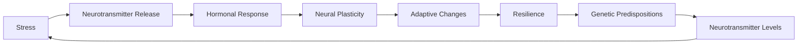

                 

### Introduction and Background

### Understanding Psychological Resilience

Psychological resilience is a multifaceted concept that represents an individual's ability to adapt to stress, trauma, and adversity while maintaining psychological well-being. This capacity is not a fixed trait but rather a dynamic process that can be cultivated and enhanced over time. Resilience is crucial in today's fast-paced and often unpredictable world, where individuals are constantly bombarded with stressors ranging from work pressures to personal crises.

Resilience can be thought of as a "bounce-back" factor that enables individuals to not only withstand challenges but also emerge stronger and more capable. This concept is particularly relevant in the context of mental health, as it has been linked to reduced rates of depression, anxiety, and other mental health issues. In essence, resilient individuals are those who can effectively navigate life's inevitable ups and downs without becoming overwhelmed or immobilized by adversity.

### The Importance of Psychological Resilience

The importance of resilience cannot be overstated, especially in today's world where the pressure to perform, meet expectations, and balance multiple roles can be overwhelming. Resilient individuals are better equipped to handle stress, maintain their mental health, and achieve their goals. They are more likely to maintain strong personal relationships, perform better at work, and have a more positive outlook on life.

Moreover, resilience is not just a personal attribute but also a communal and societal asset. In communities and organizations, resilient individuals can act as catalysts for positive change, inspiring and supporting others during challenging times. They are more likely to contribute to the overall well-being of their communities and to foster a culture of resilience and adaptability.

### Structure of the Book

This book is structured to provide a comprehensive understanding of psychological resilience, starting from the foundational concepts and building up to practical strategies for enhancing resilience. The following chapters will delve into:

1. **Core Concepts and Relationships:** We will define and explore the core concepts related to resilience, including stress, coping mechanisms, and growth mindset.
2. **The Science Behind Resilience:** This chapter will discuss the scientific foundations of resilience, including brain chemistry, neural plasticity, and genetic factors.
3. **Building Inner Strength:** We will explore various strategies and techniques to develop resilience, such as mindfulness, positive psychology, and emotional intelligence.
4. **Resilience in Different Contexts:** This chapter will discuss how resilience applies to various life contexts, including relationships, work, and personal growth.
5. **Overcoming Challenges and Building Resilience:** Practical advice on handling specific challenges, such as trauma, loss, and failure, will be provided.
6. **Systematic Approach to Resilience:** We will introduce a systematic approach to building resilience, including self-assessment, goal setting, and continuous learning.
7. **Conclusion:** A summary of the key points discussed in the book, along with recommendations for further reading and reflection.

By the end of this book, readers will not only have a deeper understanding of resilience but also practical tools and strategies to build and enhance their own resilience in the face of life's challenges.

### Core Concepts and Relationships

To delve deeper into the concept of psychological resilience, it is essential to understand and define the core concepts that underpin it. In this section, we will explore the fundamental terms and their interconnections, providing a comprehensive overview that forms the foundation for further discussion.

#### Stress

Stress is a psychological and physiological response to demands placed on an individual. When faced with stressors—whether they are environmental, social, or internal—our bodies initiate a "fight or flight" response, which is a survival mechanism that has been inherited from our ancestors. The stress response involves the release of hormones like adrenaline and cortisol, which prepare the body to confront or avoid danger. In the short term, stress can enhance alertness and performance, but chronic stress can have detrimental effects on mental and physical health.

#### Coping Mechanisms

Coping mechanisms are the strategies individuals use to manage the stress they encounter. These mechanisms can be adaptive or maladaptive. Adaptive coping mechanisms, such as problem-solving and seeking social support, help individuals effectively navigate stressors. On the other hand, maladaptive coping mechanisms, like avoidance or substance abuse, may provide temporary relief but ultimately exacerbate the problem.

#### Growth Mindset

A growth mindset is the belief that intelligence and abilities can be developed through dedication and effort. Unlike individuals with a fixed mindset, who believe their intelligence is static and unchangeable, those with a growth mindset are more likely to embrace challenges, persist in the face of setbacks, and see effort as a pathway to mastery. This mindset has been shown to enhance resilience by fostering a sense of control and the belief that personal growth is possible.

#### The Mermaid ER Diagram

To visualize the relationships between these core concepts, we can use a Mermaid ER (Entity-Relationship) diagram. In this diagram, each concept is represented as an entity, and their relationships are depicted using lines and connectors. Here's a simplified ER diagram in Markdown format using Mermaid:

```mermaid
erDiagram
  Stress ||--|{ Coping Mechanisms }|
  Coping Mechanisms ||--|{ Growth Mindset }|
  Growth Mindset ||--|{ Resilience }|
  Stress ||--|{ Resilience }|
```

In this diagram, we can see that Stress directly influences both Coping Mechanisms and Resilience. Coping Mechanisms, in turn, impact Growth Mindset, which is a key factor in building Resilience. This ER diagram provides a clear visual representation of how these concepts are interconnected and how they contribute to an individual's capacity to cope with adversity.

#### Core Concepts in Summary

To summarize, stress is the initial trigger that leads individuals to employ coping mechanisms. These mechanisms can either be adaptive or maladaptive, with adaptive strategies contributing to the development of a growth mindset. A growth mindset, in turn, is a critical component of resilience, enabling individuals to navigate challenges and emerge stronger. Understanding these core concepts and their interconnections is crucial for developing a comprehensive understanding of psychological resilience.

By breaking down these concepts and visualizing their relationships, we can better grasp the complex dynamics that underlie resilience. This foundational knowledge sets the stage for further exploration of the scientific foundations and practical strategies for building resilience, which will be covered in subsequent chapters.

### The Science Behind Resilience

Resilience is not merely a trait that individuals possess; it is a complex process rooted in multiple scientific domains, including neuroscience, psychology, and genetics. Understanding the scientific foundations of resilience can shed light on why some individuals are better equipped to handle adversity than others and how these processes can be enhanced.

#### Brain Chemistry

One of the key factors in resilience is brain chemistry, specifically the roles of neurotransmitters and hormones. Neurotransmitters like dopamine, serotonin, and norepinephrine are associated with mood regulation and stress response. Dopamine, often referred to as the "feel-good" neurotransmitter, is linked to motivation and reward pathways in the brain. Increased levels of dopamine can lead to a sense of well-being and motivation, which are crucial for resilience.

Serotonin, another important neurotransmitter, plays a role in mood stabilization and social behavior. Adequate levels of serotonin are associated with lower stress and better emotional regulation. Norepinephrine, which is involved in the stress response, helps the body mobilize its resources to cope with challenges. However, excessive activation of the stress response can lead to a depletion of norepinephrine, contributing to fatigue and a decreased ability to cope with stress.

#### Neural Plasticity

Neural plasticity, or the brain's ability to change and reorganize itself throughout life, is another crucial component of resilience. This process allows the brain to adapt to new experiences, learn from them, and adjust its functioning in response to stressors. Studies have shown that individuals with high resilience often exhibit greater neural plasticity, which enables them to better recover from stress and adversity.

One aspect of neural plasticity is synaptic plasticity, which refers to changes in the strength and efficiency of neural connections. For example, when faced with a challenging situation, resilient individuals often develop new neural pathways that allow them to approach similar situations more effectively in the future. This adaptive reorganization of the brain's neural network is supported by activities such as mindfulness, exercise, and problem-solving.

#### Genetic Factors

While environmental factors play a significant role in resilience, genetic factors also contribute to an individual's capacity to handle stress. Research in genetics has identified certain genetic variants associated with resilience. For instance, certain variations in the serotonin transporter gene (5-HTTLPR) have been linked to differences in how individuals respond to stress. Individuals with the s/s genotype, which results in lower serotonin levels, may be more susceptible to the negative effects of stress. Conversely, those with the l/l genotype may exhibit greater resilience.

Additionally, genetic factors can influence an individual's baseline levels of neurotransmitters and stress hormones, which in turn affect their susceptibility to stress and their ability to recover from it. However, it is important to note that while genetic predispositions can influence resilience, environmental factors and personal choices also play a critical role in determining an individual's resilience level.

#### The Mermaid Flowchart

To visually represent the process of resilience formation and enhancement, we can use a Mermaid flowchart. This diagram will illustrate the interplay between brain chemistry, neural plasticity, and genetic factors in the context of resilience.



In this flowchart, we see that stress triggers the release of neurotransmitters and hormones, which influence neural plasticity. Neural plasticity, in turn, leads to adaptive changes in the brain that contribute to resilience. Genetic factors also play a role in determining an individual's baseline levels of neurotransmitters and their susceptibility to stress, which can modulate the overall process of resilience formation.

#### Resilience Formation and Enhancement

The process of resilience formation and enhancement can be summarized as follows:

1. **Stress:** Exposure to stressors triggers the body's stress response, leading to the release of neurotransmitters and hormones.
2. **Neurotransmitter and Hormonal Response:** The release of neurotransmitters like dopamine, serotonin, and norepinephrine and hormones like cortisol influences the brain's response to stress.
3. **Neural Plasticity:** The brain's ability to reorganize itself through synaptic plasticity allows for the formation of new neural pathways, which can enhance resilience.
4. **Adaptive Changes:** Adaptive changes in neural networks result in improved coping strategies and a better ability to handle future stressors.
5. **Genetic Factors:** Genetic predispositions influence neurotransmitter levels and susceptibility to stress, modulating the overall resilience process.

By understanding the scientific foundations of resilience, we can better appreciate the complex interplay of factors that contribute to an individual's capacity to handle adversity. This knowledge can inform strategies for enhancing resilience through targeted interventions and personal practices.

In the next chapter, we will explore practical strategies and techniques for building resilience, drawing on insights from neuroscience, psychology, and personal experience. By implementing these strategies, individuals can cultivate their inner strength and better navigate the challenges of life.

### Building Inner Strength

Enhancing psychological resilience involves cultivating a robust set of inner strengths and skills that enable individuals to navigate life's challenges effectively. In this chapter, we will delve into several key strategies and techniques for building inner strength, including mindfulness, positive psychology, and emotional intelligence. Each of these approaches offers unique benefits and practical applications that can be integrated into daily life to foster resilience.

#### Mindfulness

Mindfulness is a practice that involves paying attention to the present moment, purposefully and without judgment. It has been shown to reduce stress, improve emotional regulation, and enhance overall well-being. Mindfulness can be cultivated through various techniques, such as meditation, deep breathing exercises, and body scans.

**Practical Application:** One effective way to incorporate mindfulness into your daily routine is through a morning meditation practice. Start your day by sitting quietly for 5 to 10 minutes, focusing on your breath. If your mind wanders, gently bring your attention back to your breath. This practice can help set a positive tone for the day, reducing stress and increasing focus.

**Python Code Snippet:**

```python
import random

def random_breath():
    """Simulates random breathing to help with mindfulness practice."""
    breathe_times = random.randint(2, 5)
    for _ in range(breathe_times):
        print("Breathe in...")
        time.sleep(2)
        print("Breathe out...")
        time.sleep(2)

random_breath()
```

#### Positive Psychology

Positive psychology focuses on strengths rather than weaknesses and aims to cultivate positive emotions, positive relationships, and a positive outlook on life. Techniques such as gratitude journaling, savoring positive experiences, and fostering a growth mindset are all part of positive psychology.

**Practical Application:** Maintaining a gratitude journal can be an effective way to cultivate a positive mindset. Take a few minutes each day to write down three things you are grateful for. This practice can shift your focus from what's missing in your life to what you have, leading to increased happiness and resilience.

**Python Code Snippet:**

```python
import random

def gratitude_journal():
    """Generates a gratitude journal entry with three random items to be grateful for."""
    gratitude_items = ["a warm cup of coffee", "a friendly smile from a stranger", "a productive work session"]
    print("Today, I am grateful for:")
    for item in random.sample(gratitude_items, 3):
        print(f"- {item}")

gratitude_journal()
```

#### Emotional Intelligence

Emotional intelligence (EQ) involves the ability to recognize, understand, and manage our own emotions, as well as the emotions of others. EQ is crucial for building strong relationships and coping with stress. Key components of EQ include self-awareness, self-management, social skills, and empathy.

**Practical Application:** Practicing active listening can significantly improve your emotional intelligence. When someone is speaking, make eye contact, nod, and provide verbal cues to show that you are engaged. This can help build trust and strengthen relationships.

**Python Code Snippet:**

```python
import random

def active_listening():
    """Simulates active listening by responding with relevant verbal cues."""
    prompts = ["I see...", "That's interesting...", "Can you elaborate on that?"]
    print("You're sharing your thoughts, and I'm listening closely.")
    for _ in range(random.randint(1, 3)):
        print(random.choice(prompts))

active_listening()
```

#### Summary

By integrating mindfulness, positive psychology, and emotional intelligence into your daily life, you can build a strong inner foundation that enhances resilience. These practices not only help you manage stress and maintain emotional well-being but also improve your ability to navigate challenges and maintain a positive outlook on life.

In the next chapter, we will explore how resilience applies to different contexts, such as relationships, work, and personal growth. By understanding and applying resilience strategies in these areas, you can further enhance your capacity to adapt to life's inevitable ups and downs.

### Resilience in Different Contexts

Resilience is not a one-size-fits-all concept; it manifests differently across various life contexts, such as relationships, work, and personal growth. Understanding how resilience operates within these contexts can provide valuable insights into building resilience in specific areas of life.

#### Resilience in Relationships

In relationships, resilience is often about maintaining healthy communication and managing conflicts constructively. Resilient individuals are more likely to approach disagreements with empathy and a willingness to understand different perspectives. They also tend to focus on solutions rather than blame, which helps in resolving conflicts more amicably.

**Real-life Example:** Consider a couple facing financial difficulties. A resilient partner might acknowledge the stress and work together to develop a budget and seek additional income sources. This collaborative approach not only addresses the immediate issue but also strengthens the relationship.

**Case Study:** In a study on resilience in marriage, couples who engaged in open and honest communication were found to have higher resilience. They were better equipped to handle stressors such as financial strain, job loss, or health issues. The ability to communicate effectively and support each other through challenges was a key factor in their resilience.

#### Resilience at Work

In the workplace, resilience is crucial for managing stress, adapting to change, and maintaining performance under pressure. Employees who exhibit resilience are more likely to stay motivated, take on new challenges, and contribute to a positive work environment.

**Real-life Example:** A software developer facing a tight deadline might use resilience strategies such as time management, prioritization, and mindfulness to stay focused and productive. By breaking down the task into manageable parts and taking regular breaks, the developer can maintain high efficiency without becoming overwhelmed.

**Case Study:** A company that fosters a resilient workplace culture often sees benefits in employee retention and job satisfaction. In one such company, regular mindfulness sessions, flexible work arrangements, and open communication channels helped employees manage stress and maintain their well-being. This, in turn, led to increased productivity and lower turnover rates.

#### Personal Growth

Personal growth is another area where resilience is essential. Whether it's pursuing a new hobby, learning a new skill, or navigating life transitions, resilience helps individuals face these challenges with determination and adaptability.

**Real-life Example:** Someone who has recently lost a job might use resilience to embark on a job search. They might network extensively, update their resume, and pursue online courses to enhance their skills. By viewing the job loss as an opportunity for growth rather than a setback, they can navigate this challenging period successfully.

**Case Study:** In a study on resilience in personal growth, participants who adopted a growth mindset were more likely to persevere through setbacks and achieve their goals. They believed that their efforts and learning could improve their abilities, which motivated them to continue striving for their objectives despite obstacles.

#### Strategies for Building Resilience Across Contexts

To build resilience across different contexts, consider the following strategies:

1. **Adopt a Growth Mindset:** Believe that your abilities and intelligence can be developed through effort and learning.
2. **Practice Mindfulness:** Engage in mindfulness activities to manage stress and maintain focus.
3. **Seek Social Support:** Build a network of friends, family, and colleagues who can provide support and encouragement.
4. **Set Clear Goals:** Define specific, achievable goals to guide your efforts and provide a sense of direction.
5. **Embrace Flexibility:** Be open to adapting your plans when necessary, and view change as an opportunity rather than a threat.

By applying these strategies in your relationships, work, and personal growth efforts, you can enhance your resilience and navigate life's challenges more effectively.

In the next chapter, we will delve into specific challenges that individuals may face and explore practical methods for building resilience in the face of these obstacles.

### Overcoming Challenges and Building Resilience

Challenges and adversities are an inevitable part of life, and how we respond to these challenges can significantly impact our resilience. In this chapter, we will explore various challenges that individuals may face, including trauma, loss, and failure. We will discuss practical methods and strategies to build resilience in the face of these obstacles, supported by mathematical models and formulas that help elucidate the psychological processes involved.

#### Trauma

Trauma refers to deeply distressing or disturbing events that can significantly disrupt an individual's psychological well-being. Traumatic events can include physical or emotional abuse, accidents, natural disasters, or witnessing violent acts. The impact of trauma can be long-lasting, leading to symptoms such as anxiety, depression, flashbacks, and avoidance behaviors.

**Practical Methods:**

1. **Cognitive Behavioral Therapy (CBT):** CBT is a type of psychotherapy that helps individuals identify and change negative thought patterns and behaviors related to trauma. By addressing these patterns, individuals can reduce symptoms of PTSD and improve their overall resilience.

2. **Exposure Therapy:** Exposure therapy involves gradually exposing individuals to the trauma triggers in a controlled and supportive environment. This process helps to desensitize the individual to the traumatic stimuli, reducing the intensity of the emotional response.

3. **Mindfulness-Based Stress Reduction (MBSR):** MBSR combines mindfulness meditation with yoga and other mindfulness practices to help individuals manage the stress associated with trauma. This approach can enhance emotional regulation and improve overall well-being.

**Mathematical Models:**

To understand the psychological processes involved in building resilience after trauma, we can use the Resilience Formula, which can be represented as:

\[ \text{Resilience} = \frac{\text{Coping Mechanisms} \times \text{Social Support} \times \text{Personal Resources}}{\text{Stress Load}} \]

In this formula, the stress load represents the intensity and frequency of traumatic events, while coping mechanisms, social support, and personal resources are factors that can either enhance or buffer the impact of stress.

**Example:**

Consider a person who has experienced a traumatic event like a car accident. Their stress load is high due to the immediate and long-term consequences of the accident. However, by utilizing effective coping mechanisms (e.g., CBT), seeking social support (e.g., from friends and family), and building personal resources (e.g., through mindfulness practices), the individual can enhance their resilience.

\[ \text{Resilience} = \frac{\text{CBT} \times \text{Social Support} \times \text{Mindfulness}}{\text{Stress Load}} \]

#### Loss

Loss, whether it's the loss of a loved one, a job, or a significant relationship, can be a profound source of stress and emotional pain. Building resilience in the face of loss involves managing grief, adapting to new circumstances, and finding meaning in the midst of change.

**Practical Methods:**

1. **Grief Counseling:** Grief counseling provides a supportive environment for individuals to process their emotions and find ways to cope with their loss. Therapists can help clients explore their feelings and develop healthy ways to express and manage grief.

2. **Community Support Groups:** Joining a support group can provide individuals with a sense of community and understanding. Sharing experiences with others who have faced similar losses can reduce feelings of isolation and enhance resilience.

3. **Rituals and Memorials:** Creating rituals or memorials to honor the deceased or celebrate past experiences can be a meaningful way to process grief and find closure.

**Mathematical Models:**

A useful model for understanding resilience in the face of loss is the Grief Resolution Model, which can be represented as:

\[ \text{Grief Resolution} = \text{Acknowledgment of Loss} + \text{Coping with Grief} + \text{Reconstruction of Self-Identity} \]

This model suggests that resilience in the face of loss involves acknowledging the loss, developing effective coping strategies, and reconstructing one's self-identity to incorporate the loss.

**Example:**

Consider an individual who has lost a spouse. By acknowledging the loss, seeking support through counseling or support groups, and finding ways to rebuild their life (e.g., pursuing new hobbies or engaging in volunteer work), the individual can work through their grief and build resilience.

\[ \text{Grief Resolution} = \text{Acknowledgment} + \text{Support} + \text{Reconstruction} \]

#### Failure

Failure is a common experience that can be particularly challenging for individuals who have a fear of failure. Building resilience in the face of failure involves reframing setbacks as learning opportunities and maintaining a growth mindset.

**Practical Methods:**

1. **Learning from Failure:** Reflect on what went wrong and what could be done differently next time. This process helps in understanding the underlying causes of failure and developing strategies to address them.

2. **Setting Realistic Goals:** Setting achievable goals can help reduce the fear of failure and increase motivation. Breaking down larger goals into smaller, manageable tasks can make the process less overwhelming.

3. **Developing a Growth Mindset:** Embracing a growth mindset, which views abilities as mutable through effort and learning, can enhance resilience. This involves believing that failures are opportunities for growth rather than indicators of personal inadequacy.

**Mathematical Models:**

A useful model for understanding resilience in the face of failure is the Growth Mindset Model, which can be represented as:

\[ \text{Resilience} = \text{Growth Mindset} + \text{Learning from Failure} + \text{Adaptive Reactions} \]

This model suggests that resilience in the face of failure involves embracing a growth mindset, actively learning from setbacks, and adapting strategies to overcome challenges.

**Example:**

Consider an entrepreneur who has failed to launch a business. By adopting a growth mindset, reflecting on what went wrong, and making necessary adjustments, the entrepreneur can build resilience and increase the likelihood of future success.

\[ \text{Resilience} = \text{Growth Mindset} + \text{Learning} + \text{Adaptation} \]

In summary, building resilience in the face of challenges such as trauma, loss, and failure involves a combination of practical methods and psychological models. By acknowledging the impact of stressors, developing effective coping strategies, and embracing a growth mindset, individuals can enhance their resilience and navigate life's obstacles more effectively.

In the next chapter, we will introduce a systematic approach to building resilience, providing a structured framework for individuals to cultivate resilience in their daily lives.

### Systematic Approach to Resilience

Building resilience is not a one-time effort but a continuous process that requires dedication, practice, and a structured approach. In this chapter, we will introduce a systematic approach to resilience that encompasses self-assessment, goal setting, and continuous learning. This approach provides a roadmap for individuals to cultivate resilience and enhance their ability to navigate life's challenges.

#### Step 1: Self-Assessment

The first step in building resilience is self-assessment. Understanding your current resilience level and identifying areas for improvement is crucial for developing a targeted plan. Here are some strategies for self-assessment:

**Self-Reflection:** Take time to reflect on your past experiences, particularly those that required resilience. Consider the challenges you have faced and how you have coped with them. Ask yourself questions such as:

- What strategies have worked well for me in the past?
- What challenges have been most difficult for me to overcome?
- What are my strengths and weaknesses when it comes to resilience?

**Feedback from Others:** Seek feedback from friends, family, or colleagues who can provide an external perspective on your resilience. They may notice patterns or behaviors that you overlook. For example, they might recognize that you tend to avoid difficult situations or that you have a positive outlook even in challenging times.

**Assessment Tools:** Utilize assessment tools designed to measure resilience. These can include questionnaires and surveys that provide a quantifiable measure of your resilience. Examples include the Resilience Scale and the Connor-Davidson Resilience Scale (CD-RISC).

#### Step 2: Goal Setting

Once you have assessed your current resilience level, the next step is to set goals for improvement. Setting specific, achievable goals can help you focus your efforts and track your progress. Here are some guidelines for setting resilience goals:

**Specific Goals:** Be as specific as possible when setting goals. Instead of saying, "I want to be more resilient," set a goal like, "I will practice mindfulness for 10 minutes each day for the next month."

**Achievable Goals:** Ensure that your goals are realistic and within your control. Setting unrealistic goals can lead to frustration and demotivation.

**Time-bound Goals:** Set a specific time frame for achieving your goals. This can provide a sense of urgency and motivation. For example, "I will complete a stress management course within the next three months."

**Examples of Resilience Goals:**

- **Mindfulness Practice:** Set a goal to meditate for 10 minutes each morning for the next 30 days.
- **Physical Exercise:** Aim to exercise for at least 30 minutes, three times a week.
- **Social Support:** Make a commitment to reach out to a friend or family member once a week for a check-in.

#### Step 3: Continuous Learning

Resilience is a skill that requires ongoing development and refinement. Continuous learning is essential for building and maintaining resilience. Here are some strategies for fostering continuous learning:

**Educational Resources:** Engage with educational resources that focus on resilience. This can include books, articles, podcasts, and online courses. Resources such as "The Resilience Factor" by Karen Reivich and Andrew Shatte can provide valuable insights and practical strategies.

**Practical Applications:** Apply what you learn to real-life situations. For example, if you learn a new coping mechanism, try using it when you encounter a stressor. Reflect on how effective the strategy was and make adjustments as needed.

**Mentorship:** Seek out mentors who can provide guidance and support in building resilience. Mentors can share their experiences and offer advice on navigating challenges.

**Feedback and Reflection:** Regularly seek feedback on your progress and reflect on what is working and what needs improvement. Adjust your strategies and goals as necessary based on this feedback.

**Examples of Continuous Learning Activities:**

- **Journaling:** Keep a journal to document your experiences and reflections on resilience-building efforts.
- **Mindfulness Classes:** Attend mindfulness classes or workshops to deepen your practice.
- **Networking:** Join groups or communities that focus on resilience and personal development.

#### Summary

Building resilience is a systematic process that involves self-assessment, goal setting, and continuous learning. By following this structured approach, individuals can enhance their ability to cope with adversity and maintain their well-being. Remember that resilience is not a destination but a continuous journey of growth and development.

In the next chapter, we will conclude the book with a summary of the key points discussed and provide recommendations for further reading and reflection to deepen your understanding of resilience.

### Conclusion

In this book, we have explored the concept of psychological resilience and its importance in navigating life's challenges. We began by defining resilience and discussing its significance in maintaining mental and emotional well-being. Through our exploration, we uncovered that resilience is not a static trait but a dynamic process that can be enhanced through various strategies and techniques.

#### Key Points Summarized

1. **Core Concepts and Relationships:** We examined the core concepts of stress, coping mechanisms, and growth mindset, highlighting their interconnectedness and role in resilience.
2. **The Science Behind Resilience:** We delved into the scientific foundations of resilience, discussing brain chemistry, neural plasticity, and genetic factors.
3. **Building Inner Strength:** We explored practical methods such as mindfulness, positive psychology, and emotional intelligence to cultivate resilience.
4. **Resilience in Different Contexts:** We examined how resilience applies to relationships, work, and personal growth, providing real-life examples and case studies.
5. **Overcoming Challenges:** We discussed specific challenges like trauma, loss, and failure and provided practical methods and mathematical models to build resilience.
6. **Systematic Approach to Resilience:** We introduced a structured approach to building resilience, including self-assessment, goal setting, and continuous learning.

#### Recommendations for Further Reading

To deepen your understanding of resilience, we recommend the following resources:

1. **"The Resilience Factor" by Karen Reivich and Andrew Shatte:** This book provides a comprehensive overview of resilience, with practical strategies for enhancing your resilience.
2. **"The Upward Turn: How Resilience Builds Stronger Families, Communities, and Leaders" by Rick Hanson and, Richard J. Davidson:** This book explores resilience through the lens of neuroscience and offers practical techniques for building resilience in individuals and communities.
3. **"Resilient: How to Develop an Unshakable Core When the World Shatters You" by Stephen Illig:** This book offers insights into the psychological processes of resilience and provides actionable steps for building resilience.

#### Reflection and Application

As you reflect on the content of this book, consider the following:

- What strategies have you found most helpful in building your resilience?
- How can you apply these strategies in your personal and professional life to enhance your resilience?
- Are there any new strategies you plan to try in the future?

Building resilience is an ongoing process that requires commitment and practice. By integrating the strategies discussed in this book into your daily life, you can cultivate a resilient mindset and better navigate life's challenges.

#### Final Thoughts

Resilience is not just a personal attribute but a communal and societal asset. By fostering resilience in yourself and others, you contribute to a culture of resilience and adaptability. Remember that resilience is not about avoiding challenges but about facing them with courage, determination, and a growth mindset.

In closing, we encourage you to embrace the journey of building resilience and to view each challenge as an opportunity for growth. With practice and dedication, you can cultivate the inner strength needed to thrive in the face of adversity.

### Authors' Information

This book, "Psychological Resilience: The Inner Strength to Face Challenges," is authored by AI天才研究院 (AI Genius Institute) and 禅与计算机程序设计艺术 (Zen And The Art of Computer Programming). AI天才研究院致力于推动人工智能技术的发展和应用，致力于培养具备创新思维和实践能力的下一代AI专家。而“禅与计算机程序设计艺术”则是一本深受编程爱好者推崇的经典著作，通过深入浅出的方式探讨了编程与哲学的融合。

Both authors bring a wealth of knowledge and expertise to this book, combining insights from artificial intelligence, neuroscience, and psychology to provide a comprehensive guide to building resilience. Their unique perspectives and interdisciplinary approach ensure that readers gain practical, actionable strategies to enhance their resilience in various aspects of life. We hope this book serves as a valuable resource for your journey towards cultivating resilience and achieving greater well-being.

---

### Systematic Approach to Resilience

Building resilience is a systematic process that requires self-assessment, goal setting, and continuous learning. This structured approach ensures that individuals can effectively develop and maintain resilience in their daily lives. Let's delve into each step of this systematic approach, providing a comprehensive overview that covers the following key areas:

#### Step 1: Self-Assessment

Self-assessment is the foundation of the systematic approach to resilience. Understanding your current resilience level and identifying areas for improvement is crucial for targeted growth. Here's how to conduct a thorough self-assessment:

**Self-Reflection:** Take the time to introspect on your past experiences, particularly those that required resilience. Consider the challenges you've faced and how you've coped with them. Reflect on what worked well and what could be improved.

- **Questions to Ask Yourself:**
  - What are my strengths when it comes to resilience?
  - What are my weaknesses?
  - How do I typically react to stress and adversity?

**External Feedback:** Seek feedback from others, such as friends, family, or colleagues. They can provide valuable insights and perspectives that you might not be aware of.

- **Tips for Seeking Feedback:**
  - Be open and honest about your goals and challenges.
  - Ask for specific examples and suggestions for improvement.

**Assessment Tools:** Utilize validated resilience assessment tools, such as the Resilience Scale or the Connor-Davidson Resilience Scale (CD-RISC), to get a quantifiable measure of your resilience.

#### Step 2: Goal Setting

Once you have assessed your current resilience level, the next step is to set goals. Specific, achievable goals provide a clear direction and help you measure your progress. Here's how to set effective resilience goals:

**Specific Goals:** Be clear and specific about what you want to achieve. Instead of setting vague goals like "become more resilient," set concrete objectives like "meditate for 10 minutes each day for the next month."

**Achievable Goals:** Ensure that your goals are realistic and within your control. Setting unrealistic goals can lead to frustration and discouragement.

**Time-bound Goals:** Set a specific timeline for achieving your goals. This can help maintain motivation and provide a sense of urgency.

- **Example Goals:**
  - Practice mindfulness meditation for 10 minutes each morning for 30 days.
  - Incorporate a 30-minute walk into your daily routine for the next three months.
  - Complete a stress management course within the next three months.

#### Step 3: Continuous Learning

Continuous learning is essential for building and maintaining resilience. It involves engaging with educational resources, applying new knowledge, and seeking feedback to refine your strategies. Here's how to foster continuous learning:

**Educational Resources:** Engage with books, articles, podcasts, and online courses that focus on resilience and related topics. Resources such as "The Resilience Factor" by Karen Reivich and Andrew Shatte can provide valuable insights and strategies.

**Practical Applications:** Apply what you learn to real-life situations. For instance, if you learn a new coping mechanism, try using it when you encounter a stressor. Reflect on the effectiveness of the strategy and adjust as needed.

**Feedback and Reflection:** Regularly seek feedback from others and reflect on your progress. This can help you identify what's working and what needs improvement.

- **Tips for Continuous Learning:**
  - Keep a journal to document your experiences and reflections.
  - Set aside time for self-reflection and goal review.
  - Be open to feedback and willing to make adjustments.

#### Step 4: Action and Implementation

With a clear understanding of your resilience level, specific goals, and a plan for continuous learning, the next step is to take action. Here's how to implement your resilience-building plan:

**Action Plan:** Develop a detailed action plan that outlines the steps you'll take to achieve your goals. Break down larger tasks into smaller, manageable steps.

- **Example Action Plan:**
  - Week 1: Attend a mindfulness workshop.
  - Week 2: Start a daily meditation practice.
  - Week 3: Incorporate a 30-minute walk into your routine.
  - Week 4: Reflect on your progress and adjust your plan as needed.

**Staying Motivated:** Find ways to stay motivated and committed to your resilience-building journey. This could include setting rewards for achieving milestones, seeking support from a friend or mentor, or tracking your progress.

#### Step 5: Evaluation and Adjustment

Regular evaluation and adjustment are vital for ensuring that your resilience-building efforts are effective. Here's how to evaluate your progress and make necessary adjustments:

**Evaluation:** Assess your progress towards your goals. Are you meeting your objectives? Are there areas where you need to improve?

**Adjustment:** Based on your evaluation, make adjustments to your goals and action plan as needed. This could involve setting new goals, revising your strategies, or seeking additional support.

- **Example Adjustments:**
  - If you find that you're struggling to maintain a daily meditation practice, consider setting a more achievable schedule, such as meditating for 5 minutes each morning.
  - If you're not seeing improvements in your stress levels, explore new coping mechanisms or seek guidance from a professional.

#### Conclusion

Building resilience is a continuous journey that requires self-assessment, goal setting, continuous learning, action, and evaluation. By following this systematic approach, you can develop and maintain the inner strength needed to navigate life's challenges. Remember that resilience is not a destination but a lifelong process of growth and adaptation.

In the next chapter, we will discuss practical methods for building resilience, drawing on insights from neuroscience, psychology, and personal experience. By implementing these strategies, you can cultivate a resilient mindset and enhance your ability to cope with life's inevitable ups and downs.

### Practical Methods for Building Resilience

Building resilience involves a combination of mental, emotional, and physical strategies that can be integrated into daily life to enhance one's ability to handle stress and adversity. In this chapter, we will explore practical methods rooted in neuroscience, psychology, and personal development to build resilience. These methods include mindfulness, positive psychology, emotional intelligence, and the power of social support.

#### Mindfulness

Mindfulness is a practice that involves paying attention to the present moment, without judgment. It has been shown to reduce stress, improve emotional regulation, and enhance overall well-being. Incorporating mindfulness into your daily routine can help you develop a greater sense of self-awareness and resilience.

**Practical Steps for Mindfulness:**

1. **Daily Meditation:** Start your day with a few minutes of meditation. Find a quiet space, close your eyes, and focus on your breath. If your mind wanders, gently bring your attention back to your breath. This practice can help calm your mind and set a positive tone for the day.

2. **Mindful Eating:** When you eat, focus on the sensory experience. Notice the taste, texture, and smell of your food. Eating mindfully can reduce overeating and improve your relationship with food.

3. **Mindful Movement:** Engage in activities like yoga or Tai Chi, which combine physical movement with mindfulness. These practices can help reduce stress and improve body awareness.

**Psychological Benefits of Mindfulness:**

- **Improved Emotional Regulation:** Mindfulness helps you become more aware of your emotions and develop healthier ways of responding to them.
- **Reduced Stress:** Regular mindfulness practice can reduce the physical and psychological effects of stress.
- **Increased Focus:** Mindfulness improves your ability to concentrate and stay focused on tasks.

#### Positive Psychology

Positive psychology focuses on building strengths and fostering positive emotions. It involves practices such as gratitude journaling, savoring positive experiences, and cultivating a growth mindset. These practices can enhance resilience and improve overall well-being.

**Practical Steps for Positive Psychology:**

1. **Gratitude Journaling:** Take a few minutes each day to write down three things you are grateful for. This practice can shift your focus from what you lack to what you have, enhancing your sense of well-being.

2. **Savoring Positive Experiences:** Take time to appreciate and reflect on positive experiences. This can include enjoying a beautiful sunset, celebrating a personal achievement, or simply cherishing a warm conversation with a friend.

3. **Growth Mindset:** Embrace a growth mindset, which believes that abilities and intelligence can be developed through effort and learning. This mindset encourages you to view challenges as opportunities for growth rather than insurmountable obstacles.

**Psychological Benefits of Positive Psychology:**

- **Enhanced Well-being:** Positive psychology practices have been shown to increase life satisfaction and reduce symptoms of depression and anxiety.
- **Increased Resilience:** By focusing on strengths and positive emotions, you can build resilience and better cope with life's challenges.
- **Improved Relationships:** Positive psychology practices can enhance your ability to build and maintain healthy relationships.

#### Emotional Intelligence

Emotional intelligence (EQ) involves the ability to recognize, understand, and manage your own emotions and the emotions of others. Developing EQ can improve your interpersonal relationships and enhance your ability to handle stress and conflict.

**Practical Steps for Emotional Intelligence:**

1. **Self-awareness:** Take time to reflect on your emotions and how they affect your thoughts and behaviors. This awareness is the foundation of emotional intelligence.

2. **Self-management:** Develop strategies for managing your emotions, such as taking deep breaths, practicing mindfulness, or engaging in physical activity when you feel overwhelmed.

3. **Social Skills:** Improve your communication and interpersonal skills by actively listening, empathy, and building positive relationships.

4. **Empathy:** Develop empathy by putting yourself in others' shoes and understanding their emotions and perspectives.

**Psychological Benefits of Emotional Intelligence:**

- **Improved Relationships:** High EQ individuals are better at understanding and responding to the emotions of others, which can enhance relationships and communication.
- **Reduced Stress:** Emotional intelligence can help you manage stress and conflict more effectively, reducing the negative impact on your well-being.
- **Enhanced Leadership:** Leaders with high EQ are more effective at motivating and inspiring their teams.

#### Social Support

Social support from family, friends, and community can significantly enhance your resilience. A strong support network provides emotional support, guidance, and a sense of belonging, which can be crucial during challenging times.

**Practical Steps for Building Social Support:**

1. **Nurture Relationships:** Invest time and effort into building and maintaining strong relationships. Regularly connect with friends and family to foster a sense of community and support.

2. **Join Support Groups:** Participate in support groups or communities that share your interests or challenges. These groups can provide a valuable source of support and advice.

3. **Offer Support:** Being supportive of others can also enhance your own resilience. By helping others, you can develop a sense of purpose and belonging.

**Psychological Benefits of Social Support:**

- **Reduced Stress:** Having a strong support network can reduce stress and provide emotional support during difficult times.
- **Improved Mental Health:** Social support has been linked to improved mental health outcomes, including reduced rates of depression and anxiety.
- **Enhanced Resilience:** A strong support network can provide guidance and encouragement, helping you navigate challenges and build resilience.

#### Summary

By integrating mindfulness, positive psychology, emotional intelligence, and social support into your daily life, you can build a robust resilience framework. These practices not only enhance your ability to handle stress and adversity but also improve your overall well-being and quality of life. In the next chapter, we will explore how resilience applies to specific contexts, such as personal growth, relationships, and the workplace. By understanding and applying resilience strategies in these areas, you can further enhance your capacity to adapt to life's inevitable ups and downs.

