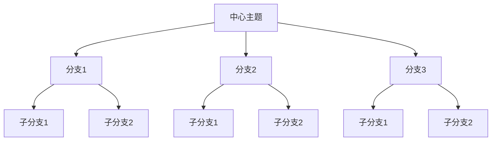
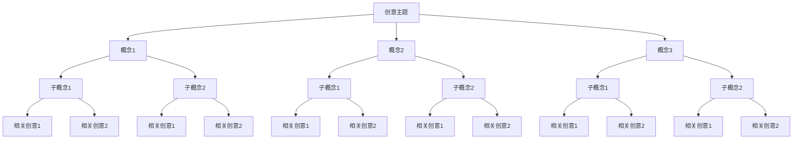
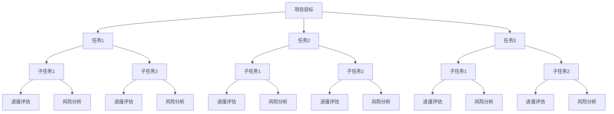

                 

# 思维导图创新技巧：认知地图的绘制与应用

## 关键词

- 思维导图
- 认知地图
- 创意思维
- 问题解决
- 团队协作
- 项目管理

## 摘要

本文将深入探讨思维导图的基础知识、创新技巧及其在实际应用中的重要性。通过逐步分析思维导图的绘制方法、应用领域和实战案例，帮助读者理解如何利用思维导图优化认知过程、激发创意思维、解决复杂问题以及提升团队协作效率。文章旨在为读者提供一套实用的思维导图实践指南，以应对现代工作中的各种挑战。

## 目录大纲

### 第一部分：思维导图基础

### 第1章 思维导图概述

#### 1.1 思维导图的起源与发展

#### 1.2 思维导图的核心概念与特点

#### 1.3 思维导图在认知地图中的重要性

### 第2章 认知地图的绘制方法

#### 2.1 认知地图的基本结构

#### 2.2 绘制认知地图的步骤

#### 2.3 使用工具绘制认知地图

### 第3章 认知地图的应用

#### 3.1 教育领域的应用

#### 3.2 工作与项目管理的应用

#### 3.3 创意思维与问题解决的运用

### 第二部分：思维导图创新技巧

### 第4章 思维导图在创意思维中的应用

#### 4.1 创意思维的概述

#### 4.2 思维导图促进创意思维

#### 4.3 实例分析：创意思维导图的绘制与应用

### 第5章 思维导图在问题解决中的运用

#### 5.1 问题的定义与分类

#### 5.2 思维导图在问题解决中的作用

#### 5.3 问题解决的思维导图绘制技巧

### 第6章 思维导图在团队协作中的价值

#### 6.1 团队协作的基本原则

#### 6.2 思维导图在团队协作中的应用

#### 6.3 团队思维导图的绘制与使用

### 第7章 思维导图在工作与项目中的实战应用

#### 7.1 工作中的思维导图应用

#### 7.2 项目管理中的思维导图

#### 7.3 实战案例：思维导图在工作与项目中的具体应用

### 第三部分：拓展与应用

### 第8章 思维导图软件的选择与使用

#### 8.1 常见思维导图软件介绍

#### 8.2 思维导图软件的选择标准

#### 8.3 思维导图软件的高级功能

### 第9章 思维导图的最佳实践与拓展

#### 9.1 思维导图最佳实践

#### 9.2 拓展思维导图的应用领域

#### 9.3 思维导图的未来发展趋势

### 第10章 总结与展望

#### 10.1 思维导图的核心价值

#### 10.2 未来的应用前景

#### 10.3 读者的思维导图之旅

## 第一部分：思维导图基础

### 第1章 思维导图概述

#### 1.1 思维导图的起源与发展

思维导图（Mind Map）是由英国心理学家东尼·博赞（Tony Buzan）于1970年代首创的一种图形化的思维工具。它的核心理念是将信息以图像的形式呈现，通过分支结构来表示概念、想法和知识点之间的联系。思维导图的起源可以追溯到古代的象征性思维方式和图解记录的方法。

随着时间的推移，思维导图逐渐发展成为一门系统化的方法，广泛应用于教育、商业、设计、个人发展等多个领域。在信息技术和数字化工具的支持下，思维导图的发展进入了新的阶段，从传统的手绘转变为电子化的可视化工具。

#### 1.2 思维导图的核心概念与特点

思维导图的核心概念包括：

1. **中心主题**：思维导图的中心是一个明确的主题，它围绕着核心问题或主题展开。
2. **分支结构**：中心主题向外扩展，形成多个分支，每个分支代表一个相关概念或子主题。
3. **关键词**：在分支上使用关键词来表示具体信息，避免冗长的描述。
4. **颜色与图像**：颜色和图像的运用可以增加记忆效果，使思维导图更加生动有趣。
5. **层级结构**：思维导图通常具有层级结构，不同层级的分支表示不同层次的概念。

思维导图的特点包括：

1. **直观性**：通过图形和色彩，使复杂的信息变得直观易懂。
2. **联想性**：鼓励思维的自由流动，激发创造力和联想能力。
3. **结构化**：有助于组织和整理信息，使思路清晰。
4. **灵活性**：可以根据需要进行修改和扩展，适应不同情境。

#### 1.3 思维导图在认知地图中的重要性

认知地图（Cognitive Map）是指个体在心理上构建的关于环境的内部表征。它帮助我们理解环境中的各种关系和路径，是导航和决策的基础。思维导图作为一种认知工具，可以有效地构建和优化认知地图。

1. **知识可视化**：思维导图可以将复杂的信息以图形化方式呈现，帮助我们更好地理解和记忆。
2. **结构化思维**：通过分支结构和层级关系，思维导图有助于我们梳理和整合信息，形成结构化的思考模式。
3. **联想与创造**：思维导图的自由分支和联想性特点，可以激发新的想法和创造力的发挥。
4. **学习和记忆**：颜色、图像和关键词的运用，提高了信息的记忆效果。

### 第2章 认知地图的绘制方法

#### 2.1 认知地图的基本结构

认知地图的基本结构包括中心主题、分支和子分支。以下是一个认知地图的基本结构示例：

#### 2.2 绘制认知地图的步骤

1. **确定主题**：明确认知地图的中心主题，它是整个地图的核心。
2. **分解主题**：将主题分解成几个主要分支，每个分支代表一个关键概念或子主题。
3. **细化分支**：为每个分支添加子分支，进一步细化信息。
4. **添加关键词**：在每个分支上使用关键词来表示具体信息。
5. **使用颜色和图像**：为不同的分支和子分支使用颜色和图像，增加记忆效果。
6. **检查和优化**：完成初步绘制后，检查地图的结构和内容，进行必要的调整和优化。

#### 2.3 使用工具绘制认知地图

现代有很多工具可以帮助我们绘制认知地图，例如：

- **纸质工具**：如笔记本、白板等。
- **电子工具**：如MindManager、Xmind、FreeMind等。
- **在线工具**：如MindMeister、Lucidchart等。

### 第3章 认知地图的应用

#### 3.1 教育领域的应用

在教育领域，认知地图可以帮助学生更好地理解和记忆知识点。例如，在历史课上，学生可以使用认知地图来整理历史事件和时间线；在科学课上，学生可以使用认知地图来梳理复杂的实验过程和理论框架。

#### 3.2 工作与项目管理的应用

在工作与项目管理中，认知地图可以帮助团队和组织更好地规划和执行项目。例如，在项目启动阶段，团队可以使用认知地图来明确项目目标和关键任务；在项目执行阶段，认知地图可以帮助团队跟踪进度和解决问题。

#### 3.3 创意思维与问题解决的运用

在创意思维和问题解决中，认知地图可以帮助我们梳理和拓展思路。例如，在创意思维过程中，可以使用认知地图来记录和连接不同的想法和灵感；在问题解决过程中，可以使用认知地图来分析问题、制定解决方案并评估效果。

## 第二部分：思维导图创新技巧

### 第4章 思维导图在创意思维中的应用

#### 4.1 创意思维的概述

创意思维是指通过创新的方法和技巧，产生新的想法和解决方案的过程。它是创新活动的核心，对于个人和团队来说都至关重要。

#### 4.2 思维导图促进创意思维

思维导图通过其图形化的结构，可以帮助我们更好地捕捉和拓展创意思维。以下是思维导图在创意思维中的应用：

1. **头脑风暴**：思维导图可以作为一个直观的头脑风暴工具，帮助团队快速记录和连接不同的想法。
2. **概念拓展**：通过分支结构和子分支，思维导图可以帮助我们深入挖掘一个概念或问题的各个方面。
3. **联想连接**：思维导图的自由分支和关键词，鼓励我们进行跨领域的联想，从而产生新的创意。
4. **可视化呈现**：思维导图将抽象的创意转化为可视化的形式，使得创意更加直观和易于理解。

#### 4.3 实例分析：创意思维导图的绘制与应用

以下是一个创意思维导图的实例：

在这个实例中，中心主题是“创意主题”，围绕它有四个主要概念：“概念1”、“概念2”、“概念3”和“子概念1”、“子概念2”等。通过这个思维导图，我们可以清晰地看到创意的扩展和联想。

### 第5章 思维导图在问题解决中的运用

#### 5.1 问题的定义与分类

问题是指不符合期望的状态或情况，它可以是一个挑战、一个难题或一个需要解决的问题。根据问题的性质和复杂度，我们可以将问题分为以下几类：

1. **简单问题**：通常具有明确的答案和解决方案，可以通过直接的方法解决。
2. **复杂问题**：涉及多个变量和影响因素，需要综合分析和考虑。
3. **模糊问题**：问题描述不清晰，需要进一步明确和理解。
4. **困难问题**：具有高度不确定性和挑战性，可能需要创新的方法和思路来解决。

#### 5.2 思维导图在问题解决中的作用

思维导图在问题解决中扮演着重要的角色，它可以：

1. **明确问题**：通过思维导图，我们可以将问题分解成各个组成部分，明确问题的核心和关键点。
2. **分析原因**：思维导图可以帮助我们识别问题的原因和影响因素，从而更好地理解问题的本质。
3. **提出解决方案**：通过分支结构和联想，思维导图可以激发新的想法和解决方案，帮助我们找到最佳解决方案。
4. **评估和优化**：思维导图可以作为一个视觉工具，帮助我们评估和优化解决方案。

#### 5.3 问题解决的思维导图绘制技巧

以下是绘制问题解决思维导图的一些技巧：

1. **确定问题**：在思维导图的中心明确问题描述，确保问题的准确性和清晰性。
2. **分解问题**：将问题分解成各个子问题，每个子问题都是一个分支。
3. **分析原因**：为每个子问题添加分支，表示可能的原因和影响因素。
4. **提出解决方案**：为每个原因和影响因素添加子分支，表示可能的解决方案。
5. **评估和优化**：使用颜色和图标标记解决方案的优缺点，进行评估和优化。

### 第6章 思维导图在团队协作中的价值

#### 6.1 团队协作的基本原则

团队协作是指团队成员共同合作，为实现共同目标而共同努力的过程。有效的团队协作需要遵循以下基本原则：

1. **共同目标**：团队成员需要明确共同的目标和愿景，确保团队的努力方向一致。
2. **相互信任**：团队成员之间需要建立信任，通过沟通和协作，共同解决问题。
3. **有效沟通**：团队成员需要保持开放的沟通渠道，分享信息和想法，避免误解和冲突。
4. **分工合作**：团队成员需要根据各自的优势和职责，分工合作，实现团队目标。

#### 6.2 思维导图在团队协作中的应用

思维导图在团队协作中具有重要作用，它可以：

1. **明确目标**：思维导图可以帮助团队明确共同的目标和愿景，确保团队的努力方向一致。
2. **规划任务**：思维导图可以帮助团队分解任务，明确每个人的职责和任务分配。
3. **沟通协作**：思维导图可以作为团队沟通的工具，帮助团队成员分享信息和想法，促进协作。
4. **解决问题**：思维导图可以帮助团队分析问题、提出解决方案，并评估和优化解决方案。

#### 6.3 团队思维导图的绘制与使用

以下是团队思维导图的绘制与使用步骤：

1. **确定主题**：明确思维导图的中心主题，它是整个团队讨论和协作的核心。
2. **集体讨论**：团队成员围绕主题进行集体讨论，记录和连接不同的想法和观点。
3. **分解任务**：将主题分解成各个子任务，每个子任务都是一个分支。
4. **分配职责**：为每个子任务分配团队成员，明确每个人的职责和任务。
5. **评估和优化**：使用颜色和图标标记任务的进展情况和优缺点，进行评估和优化。

### 第7章 思维导图在工作与项目中的实战应用

#### 7.1 工作中的思维导图应用

在日常工作过程中，思维导图可以帮助我们：

1. **任务规划**：通过思维导图，我们可以明确任务的目标和步骤，制定详细的计划。
2. **知识管理**：思维导图可以帮助我们整理和记录知识，形成结构化的知识体系。
3. **问题解决**：当遇到问题时，思维导图可以帮助我们分析问题、提出解决方案。
4. **团队协作**：思维导图可以作为团队沟通和协作的工具，促进团队工作的效率。

#### 7.2 项目管理中的思维导图

在项目管理中，思维导图可以：

1. **项目规划**：通过思维导图，项目经理可以明确项目的目标和里程碑，制定详细的项目计划。
2. **风险评估**：思维导图可以帮助项目经理识别和分析项目中的风险，制定应对措施。
3. **资源分配**：思维导图可以帮助项目经理合理分配资源，确保项目顺利推进。
4. **进度监控**：思维导图可以作为项目进度的可视化工具，帮助项目经理及时了解项目进展情况。

#### 7.3 实战案例：思维导图在工作与项目中的具体应用

以下是一个思维导图在工作与项目中的具体应用案例：

在这个案例中，中心主题是“项目目标”，围绕它有四个主要任务：“任务1”、“任务2”、“任务3”和“子任务1”、“子任务2”等。通过这个思维导图，项目经理可以清晰地看到项目的目标和任务分配，以及每个任务的进度评估和风险分析。

## 第三部分：拓展与应用

### 第8章 思维导图软件的选择与使用

#### 8.1 常见思维导图软件介绍

在现代信息技术的发展下，有许多思维导图软件可供选择。以下是一些常见的思维导图软件：

1. **MindManager**：一款功能强大的思维导图软件，适用于个人和团队。
2. **Xmind**：一款开源的思维导图软件，支持多种平台。
3. **FreeMind**：一款免费的开源思维导图软件，适用于Windows、Mac和Linux。
4. **MindMeister**：一款在线思维导图工具，支持多人协作。
5. **Lucidchart**：一款在线图表和流程图工具，适用于团队协作。

#### 8.2 思维导图软件的选择标准

选择思维导图软件时，需要考虑以下标准：

1. **功能需求**：根据实际需求，选择具有所需功能的软件。
2. **易用性**：选择界面简洁、易于操作的软件。
3. **协作性**：如果需要多人协作，选择支持协作功能的软件。
4. **兼容性**：选择可以与其他工具和平台兼容的软件。
5. **价格**：根据预算，选择性价比较高的软件。

#### 8.3 思维导图软件的高级功能

一些高级思维导图软件具有以下功能：

1. **模板库**：提供丰富的模板库，方便用户快速创建思维导图。
2. **图表导出**：可以将思维导图导出为多种格式，如PDF、PNG等。
3. **云存储**：支持云存储，方便用户随时查看和编辑思维导图。
4. **协作编辑**：支持多人实时协作编辑思维导图。
5. **数据分析**：部分软件具有数据分析功能，可以分析思维导图中的数据。

### 第9章 思维导图的最佳实践与拓展

#### 9.1 思维导图最佳实践

以下是使用思维导图的一些最佳实践：

1. **明确目标**：在开始绘制思维导图之前，明确目标和主题。
2. **分解任务**：将复杂任务分解成更小的子任务，便于管理和执行。
3. **使用关键词**：在分支上使用关键词，避免冗长的描述。
4. **颜色和图像**：使用颜色和图像增加记忆效果，使思维导图更加生动。
5. **定期更新**：定期更新思维导图，确保信息的准确性和时效性。

#### 9.2 拓展思维导图的应用领域

思维导图可以应用于以下领域：

1. **教育**：用于教学设计、课程规划和学习总结。
2. **商业**：用于市场调研、战略规划和项目管理。
3. **设计**：用于产品设计、UI/UX设计和创意思维。
4. **个人发展**：用于时间管理、自我反思和目标设定。
5. **研究**：用于文献综述、研究计划和数据分析。

#### 9.3 思维导图的未来发展趋势

随着技术的进步和人们对创新思维的需求，思维导图在未来将继续发展。以下是一些发展趋势：

1. **智能化**：结合人工智能技术，实现自动化思维导图生成和优化。
2. **云化**：更多思维导图工具将转向云平台，实现跨设备和多人协作。
3. **可视化**：通过增强现实（AR）和虚拟现实（VR）技术，提高思维导图的交互性和可视化效果。
4. **多样化**：思维导图将应用于更多领域，满足不同用户的需求。

### 第10章 总结与展望

#### 10.1 思维导图的核心价值

思维导图作为一种创新的思维工具，具有以下核心价值：

1. **提高思维效率**：通过图形化的结构，帮助快速理解和记忆信息。
2. **激发创造力**：通过分支结构和联想，激发新的想法和创意。
3. **优化决策**：通过系统分析和问题解决，帮助做出更明智的决策。
4. **促进协作**：通过可视化工具，增强团队沟通和协作。

#### 10.2 未来的应用前景

随着技术的进步和人们对创新思维的需求，思维导图在未来的应用前景广阔。以下是一些应用前景：

1. **教育领域**：在教育中广泛应用，帮助学生更好地理解和记忆知识。
2. **商业领域**：在商业中用于战略规划、市场调研和项目管理。
3. **个人发展**：在个人发展中用于时间管理、目标设定和自我反思。
4. **科研领域**：在科研中用于文献综述、研究计划和数据分析。
5. **艺术创作**：在艺术创作中用于灵感捕捉和创意思维。

#### 10.3 读者的思维导图之旅

通过本文的阅读，读者可以了解到思维导图的基础知识、创新技巧和应用领域。希望读者能够将思维导图应用到实际工作和生活中，体验它带来的思维变革和效率提升。思维导图之旅刚刚开始，未来还有更多的探索和发现等待着我们。

## 作者信息

作者：AI天才研究院/AI Genius Institute & 禅与计算机程序设计艺术 /Zen And The Art of Computer Programming

