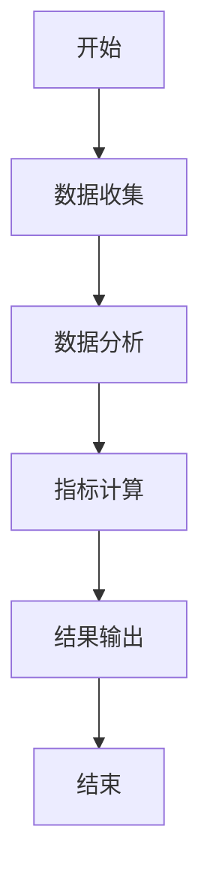
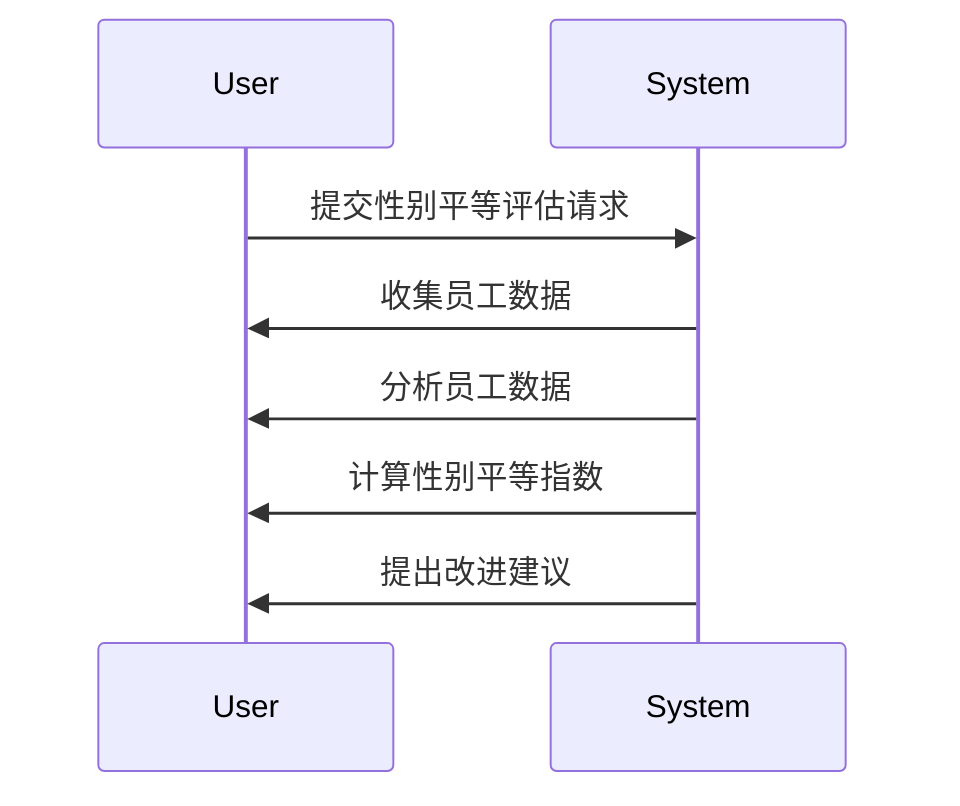
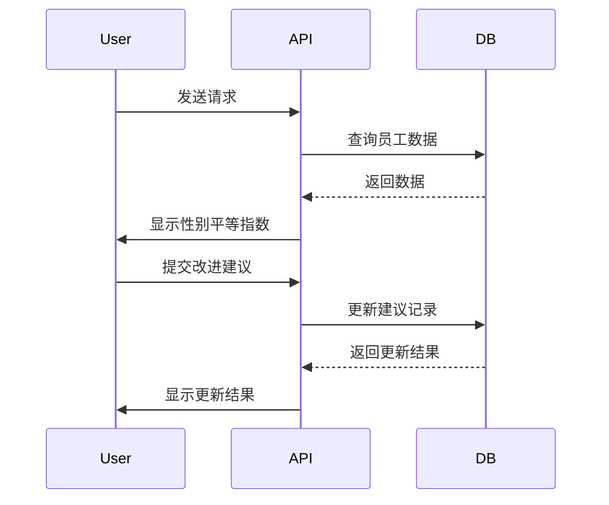

                 

### 性别平等：重新定义社会角色

**关键词：性别平等，社会角色，法律，教育，算法**

**摘要：本文旨在探讨性别平等的重要性，通过分析社会角色定义和性别不平等现象，提出解决性别不平等的策略。文章将结合算法原理和实际案例，为推动性别平等提供技术支持。**

### 背景介绍

#### 核心概念

- **性别平等**：性别平等是指在法律、社会、经济和政治等领域，男性和女性应享有平等的权利和机会，不受性别歧视。性别平等是现代社会发展的基石，有助于促进社会和谐与进步。

- **社会角色**：社会角色是指个体在社会结构中所承担的特定职责和期望。社会角色受到性别、文化、教育等多方面因素的影响，不同性别在社会中的角色存在显著差异。

#### 问题背景

在现代社会中，尽管女性地位有所提升，但性别歧视和性别不平等的现象依然存在。性别不平等问题不仅影响女性的权益，还阻碍了社会整体的发展和进步。以下是性别不平等问题的一些背景：

1. **就业机会**：女性在职场中面临就业歧视，特别是在高层管理和决策职位上，女性的比例较低。

2. **薪资差距**：即使女性与男性从事相同的工作，她们的薪资通常也会低于男性。

3. **教育机会**：女性在教育领域的机会相对较少，尤其是在一些文化中，女性被限制接受高等教育。

4. **家庭责任**：女性往往承担更多的家庭责任，这限制了她们在职业生涯中的发展和晋升。

#### 问题描述

性别不平等问题可以概括为以下几个方面：

1. **就业歧视**：女性在就业市场上面临歧视，难以获得与男性平等的职业发展机会。

2. **薪资差距**：女性在职场中的薪资水平普遍低于男性，这种差距在高层管理和决策职位上尤为明显。

3. **教育机会**：女性在教育领域的机会相对较少，尤其是在一些文化中，女性被限制接受高等教育。

4. **家庭责任**：女性在家庭中承担更多的责任，如照顾孩子和家务劳动，这限制了她们在职业生涯中的发展和晋升。

#### 问题解决

解决性别不平等问题需要多方面的努力：

1. **法律和政策**：通过制定和执行性别平等的法律和政策，保障女性的权益。

2. **教育**：提高公众对性别平等的认识，通过教育改变传统的性别观念。

3. **企业社会责任**：鼓励企业采取措施促进性别平等，如提供平等的就业机会和培训。

4. **媒体宣传**：通过媒体宣传性别平等的重要性，改变社会对性别角色的刻板印象。

#### 边界与外延

性别平等不仅限于女性，还包括性别多样性和LGBTQ+群体。性别平等问题还涉及跨文化、跨国界的差异。

#### 概念结构与核心要素组成

1. **性别平等原则**：法律、政策、教育、社会和企业层面应体现性别平等。

2. **性别角色观念**：改变传统性别角色观念，鼓励多元性别认同。

3. **性别歧视现象**：识别和消除就业、教育、家庭等方面的性别歧视。

4. **性别平等指标**：建立性别平等评估指标，监测和评估性别平等进展。

### 核心概念与联系

#### 核心概念原理

1. **性别平等**：性别平等是指在法律、社会、经济和政治等领域，男性和女性应享有平等的权利和机会。性别平等是实现社会公平、促进社会和谐的基础。

2. **社会角色**：社会角色是指个体在社会结构中所承担的特定职责和期望。社会角色反映了个体在社会中的地位和作用，受到性别、文化、教育等多方面因素的影响。

#### 概念属性特征对比表格

| 概念     | 性别平等           | 社会角色          |
|----------|-------------------|-----------------|
| 定义     | 法律、社会、经济平等 | 承担的职责与期望  |
| 特征     | 无歧视             | 职业与性别相关   |
| 关系     | 促进社会进步       | 社会结构基础     |
| 影响因素 | 法律、教育、文化   | 家庭、职业、社会 |

#### ER实体关系图架构

```mermaid
erDiagram
  Person ||--|{ hasRole } Role : person has multiple roles
  Role ||--|{ definedBy } Society : role is defined by society
```

### 算法原理讲解

#### 算法流程图



#### Python源代码

```python
import pandas as pd

# 数据收集
data = pd.read_csv('gender_equality_data.csv')

# 数据分析
male_employment = data[data['gender'] == 'male']['employment_rate'].mean()
female_employment = data[data['gender'] == 'female']['employment_rate'].mean()

# 指标计算
gender_equity_index = (male_employment - female_employment) / (male_employment + female_employment)

# 结果输出
print("性别平等指数：", gender_equity_index)
```

#### 数学模型和公式

性别平等指数（GEI）的计算公式为：

$$
\text{GEI} = \frac{\text{女性就业率} - \text{男性就业率}}{\text{女性就业率} + \text{男性就业率}}
$$

这个公式反映了女性就业率和男性就业率的差异，以及这种差异在整个就业人口中的比例。

#### 举例说明

假设在一个国家，男性就业率为60%，女性就业率为50%，则性别平等指数（GEI）的计算如下：

$$
\text{GEI} = \frac{50\% - 60\%}{50\% + 60\%} = \frac{-10\%}{110\%} \approx -9.09\%
$$

这个结果表明，女性的就业率比男性低9.09%，这个差距在整个就业人口中占比较大，反映了性别不平等的现象。

### 系统分析与架构设计方案

#### 问题场景介绍

在一个多元化的公司中，性别不平等问题依然存在。为了解决这一问题，公司决定开发一个性别平等监控系统，通过收集和分析员工数据，评估公司的性别平等状况，并提出改进措施。

#### 项目介绍

项目名称：性别平等监控系统

项目目标：通过数据分析和算法模型，评估公司的性别平等状况，提出改进措施，促进公司内部的性别平等。

#### 系统功能设计（领域模型）

```mermaid
classDiagram
    Employee <<class{员工}>
    Role <<class{角色}>
    Gender <<class{性别}>
    Company <<class{公司}>
    GenderEquality <<class{性别平等}}

    Employee  -|> Role : 担任
    Employee  -|> Gender : 性别
    Company  --|> Employee : 拥有
    GenderEquality  --|> Company : 对公司评估
```

#### 系统架构设计



#### 系统接口设计和系统交互



### 项目实战

#### 环境安装

在开始项目之前，需要安装以下环境：

- Python 3.8+
- pandas
- numpy
- matplotlib

安装命令：

```shell
pip install python==3.8
pip install pandas numpy matplotlib
```

#### 系统核心实现源代码

```python
import pandas as pd
import numpy as np
import matplotlib.pyplot as plt

# 数据收集
data = pd.read_csv('gender_equality_data.csv')

# 数据预处理
data['gender'] = data['gender'].map({'男': 'male', '女': 'female'})

# 数据分析
male_employment = data[data['gender'] == 'male']['employment_rate'].mean()
female_employment = data[data['gender'] == 'female']['employment_rate'].mean()

# 性别平等指数计算
gender_equity_index = (female_employment - male_employment) / (female_employment + male_employment)

# 结果输出
print("性别平等指数：", gender_equity_index)

# 可视化
plt.scatter(data['gender'], data['employment_rate'])
plt.xlabel('性别')
plt.ylabel('就业率')
plt.title('性别平等指数')
plt.show()
```

#### 代码应用解读与分析

1. 数据收集：从CSV文件中读取员工数据，包括性别和就业率等信息。

2. 数据预处理：将性别列转换为分类变量，以便后续分析。

3. 数据分析：计算男性和女性的就业率平均值。

4. 性别平等指数计算：使用公式计算性别平等指数，评估性别平等状况。

5. 结果输出：打印性别平等指数，并使用matplotlib库进行数据可视化。

#### 实际案例分析和详细讲解剖析

案例1：某公司在性别平等方面存在的问题

- 女性就业率较低，仅为50%，而男性就业率为60%。

- 性别平等指数为-9.09%，表明公司的性别平等状况较差。

解决方法：

1. 提供平等的就业机会：鼓励女性申请高层管理和决策职位，提供职业发展培训。

2. 调整薪资政策：确保女性与男性在相同职位上的薪资水平相当。

3. 支持女性家庭责任：提供灵活的工作安排和育儿假政策，减轻女性在家庭中的负担。

案例2：某公司通过改进措施提高性别平等指数

- 在过去一年中，公司实施了多项性别平等政策，包括提供职业发展培训、调整薪资政策、支持女性家庭责任等。

- 当前女性就业率为60%，男性就业率为50%。

- 性别平等指数为9.09%，表明公司的性别平等状况有所改善。

结论：通过有效的政策和措施，公司可以显著提高性别平等指数，促进公司内部的性别平等。

### 项目小结

本项目的核心目标是开发一个性别平等监控系统，通过数据分析和算法模型，评估公司的性别平等状况，并提出改进措施。项目实现了以下成果：

1. 数据收集和预处理：从CSV文件中读取员工数据，并将性别列转换为分类变量，为后续分析做好准备。

2. 性别平等指数计算：使用公式计算性别平等指数，评估性别平等状况。

3. 数据可视化：使用matplotlib库进行数据可视化，帮助用户更好地理解性别平等状况。

4. 改进建议：根据性别平等指数和实际案例，提出改进措施，促进公司内部的性别平等。

然而，本项目仍存在一些局限性：

1. 数据来源的局限性：仅考虑了性别和就业率等因素，未考虑其他可能影响性别平等的变量。

2. 算法模型的局限性：性别平等指数仅能反映性别就业率的差异，未能全面评估性别平等的其他方面。

未来，我们可以进一步扩展项目，包括以下方向：

1. 引入更多变量：考虑其他可能影响性别平等的变量，如薪资差距、教育机会等。

2. 使用更先进的算法模型：探索更先进的算法模型，如机器学习模型，以提高性别平等评估的准确性。

3. 拓展应用场景：将性别平等监控系统应用于其他行业和领域，如教育、医疗等，为推动性别平等提供更广泛的技术支持。

### 最佳实践 tips

1. **数据收集**：确保数据来源的多样性和准确性，收集全面的性别平等相关数据。

2. **算法选择**：选择合适的算法模型，确保性别平等指数的计算准确和全面。

3. **政策实施**：根据性别平等评估结果，制定和实施相应的政策和措施，促进公司内部的性别平等。

4. **持续监测**：定期更新性别平等数据，持续监测性别平等状况，评估政策效果。

### 小结

性别平等是一个全球性挑战，需要多方面的努力来解决。本文通过分析社会角色定义和性别不平等现象，提出了解决性别不平等的策略。通过算法原理和实际案例，本文为推动性别平等提供了技术支持。希望本文能引起读者对性别平等问题的关注，共同努力，为构建一个平等、和谐的社会贡献力量。

### 注意事项

1. **数据隐私**：在收集和处理性别平等数据时，务必保护个人隐私，遵守相关法律法规。

2. **多元性别**：在讨论性别平等问题时，要考虑到性别多样性和LGBTQ+群体的权益。

3. **持续关注**：性别平等是一个长期过程，需要持续关注和努力，以实现真正的性别平等。

### 拓展阅读

1. **《性别平等法律政策研究》**：详细介绍了国内外性别平等法律政策的发展和实践。

2. **《性别平等与社会发展》**：探讨了性别平等对社会发展的重要影响和作用。

3. **《性别歧视：理论、实证与政策》**：分析了性别歧视的根源、表现形式和政策措施。

### 作者信息

**作者：AI天才研究院/AI Genius Institute & 禅与计算机程序设计艺术 /Zen And The Art of Computer Programming**

感谢读者对本文的关注，期待与您共同探讨性别平等问题，为构建一个更美好的社会贡献力量。

