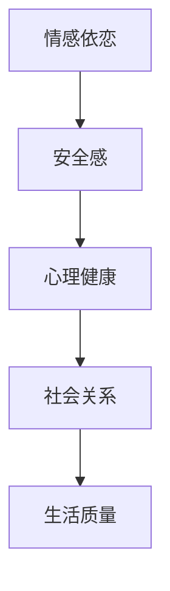

                 

# 《情感依恋：亲密关系中的安全感与意义》

## 关键词：情感依恋、亲密关系、安全感、意义、心理学、依恋风格

### 摘要：

本文旨在深入探讨情感依恋在亲密关系中的重要性，特别是在提供安全感和赋予意义方面的作用。通过对情感依恋的基础理论、其在亲密关系中的表现和影响，以及情感危机的处理等方面的详细分析，本文旨在揭示情感依恋对于个体心理健康和社会关系的影响，并探讨其在现代社会中的意义。文章结构清晰，逻辑严密，旨在为读者提供一个全面、易懂的视角来理解情感依恋的复杂性和价值。

### 目录

1. **情感依恋的基础理论**

   1.1 情感依恋的定义

   1.2 情感依恋的发展历史

   1.3 情感依恋的类型

   1.4 安全感在情感依恋中的作用

2. **亲密关系中的情感依恋**

   2.1 亲密关系的建立与维系

   2.2 情感依恋在亲密关系中的表现

   2.3 亲密关系中的情感危机

3. **情感依恋对个体的影响**

   3.1 心理健康的影响

   3.2 社会关系的影响

   3.3 生活质量的影响

4. **情感依恋在现代社会中的意义**

   4.1 现代生活方式下的情感需求

   4.2 家庭与亲密关系的角色

   4.3 社会支持系统的重要性

5. **总结与展望**

   5.1 情感依恋的重要性

   5.2 研究展望

   5.3 未来发展方向

### 1. 情感依恋的基础理论

#### 1.1 情感依恋的定义

情感依恋是一种强烈的情感联结，通常发生在个体之间，特别是亲密关系之中。它涉及情感上的依赖和信任，以及对对方的需求和关注。这种依恋可以看作是一种心理需求，有助于个体在社交环境中寻求安全和归属感。

#### 1.2 情感依恋的发展历史

情感依恋的概念起源于20世纪50年代，由心理学家约翰·鲍尔比（John Bowlby）提出。他通过观察婴儿与照看者的关系，提出了“依恋理论”。鲍尔比认为，婴儿对照看者的依恋是为了确保自身的安全，这种依恋关系在个体成长过程中持续发展，并影响到成年后的亲密关系。

#### 1.3 情感依恋的类型

根据依恋理论的分类，情感依恋主要分为四种类型：安全型、回避型、恐惧型和混乱型。每种类型反映了个体在亲密关系中的不同行为模式和情感需求。

- **安全型依恋**：个体在亲密关系中感到舒适和自信，能够信任和依赖伴侣。这种类型的依恋有助于建立稳定和幸福的亲密关系。
- **回避型依恋**：个体在亲密关系中倾向于保持距离，不愿意过多依赖伴侣。这种类型的依恋可能导致亲密关系中的疏远和冲突。
- **恐惧型依恋**：个体既渴望亲密关系，又害怕亲密关系带来的束缚和失去自由。这种类型的依恋常常伴随着焦虑和冲突。
- **混乱型依恋**：个体在亲密关系中表现出不稳定和不可预测的行为，缺乏安全感和信任。这种类型的依恋往往与早期家庭环境的不稳定有关。

#### 1.4 安全感在情感依恋中的作用

安全感是情感依恋的核心要素之一。它反映了个体在亲密关系中感到的安全和稳定程度。安全感的高低直接影响个体的情感依恋类型和行为模式。

- **高安全感**：个体在亲密关系中能够信任和依赖伴侣，感到安全和满足。这种安全感有助于建立稳定和健康的亲密关系。
- **低安全感**：个体在亲密关系中感到不安和焦虑，害怕失去伴侣。这种低安全感可能导致回避型或恐惧型依恋，影响亲密关系的质量。

### 2. 亲密关系中的情感依恋

#### 2.1 亲密关系的建立与维系

亲密关系的建立和维系是情感依恋发展的重要阶段。它涉及到个体之间的相互信任、情感交流和共同目标。

- **建立亲密关系**：个体需要通过沟通、互动和共同经历来建立信任和亲密感。这需要时间和耐心，以及双方的努力和投入。
- **维系亲密关系**：维持亲密关系的关键是持续的情感交流和相互支持。这包括倾听、理解、包容和尊重对方的需求和感受。

#### 2.2 情感依恋在亲密关系中的表现

情感依恋在亲密关系中的表现主要体现在以下几个方面：

- **情感表达**：个体在亲密关系中能够自由地表达自己的情感，包括喜悦、忧虑和不满。这种表达有助于增进双方的相互理解和信任。
- **信任与支持**：信任是亲密关系的基石，个体在亲密关系中能够信任伴侣，并在需要时提供支持和帮助。
- **冲突处理**：亲密关系中的冲突是不可避免的，但有效的冲突处理方式有助于维持关系的稳定。这包括倾听对方的观点、寻求共同点以及尊重彼此的感受。

#### 2.3 亲密关系中的情感危机

情感危机是亲密关系中的常见问题，可能导致关系破裂或严重受损。情感危机的表现形式包括：

- **情感疏远**：个体在亲密关系中感到疏远和孤独，缺乏情感交流和互动。
- **信任破裂**：信任是亲密关系的基石，信任破裂可能导致关系的崩溃。
- **情感冲突**：亲密关系中的冲突如果得不到有效解决，可能导致情感危机。

应对情感危机的策略包括：

- **沟通与倾听**：双方通过开放和诚实的沟通，表达自己的感受和需求，并倾听对方的意见和感受。
- **寻求外部支持**：在需要时，可以寻求专业咨询师或心理医生的帮助，以解决亲密关系中的问题。
- **共同成长**：通过共同经历和努力，增进双方的亲密感和信任，共同克服情感危机。

### 3. 情感依恋对个体的影响

#### 3.1 心理健康的影响

情感依恋对个体的心理健康具有重要影响。安全型依恋有助于提高个体的自尊和自我价值感，降低焦虑和抑郁的风险。相反，回避型、恐惧型和混乱型依恋可能导致个体的心理健康问题。

#### 3.2 社会关系的影响

情感依恋对个体的社会关系也有深远影响。安全型依恋有助于建立稳定和健康的亲密关系，促进个体的社交能力和人际关系。而回避型、恐惧型和混乱型依恋可能导致个体的社交障碍和关系破裂。

#### 3.3 生活质量的影响

情感依恋对个体的生活质量产生直接影响。安全型依恋有助于个体获得更高的生活满意度和幸福感。相反，回避型、恐惧型和混乱型依恋可能导致个体在生活质量和幸福感方面的下降。

### 4. 情感依恋在现代社会中的意义

#### 4.1 现代生活方式下的情感需求

随着现代生活方式的变化，人们对情感需求的认识逐渐加深。情感依恋在现代社会中具有更为重要的意义，因为它能够满足个体在快节奏生活和高度压力环境下的情感需求。

#### 4.2 家庭与亲密关系的角色

家庭和亲密关系在现代社会中扮演着至关重要的角色。它们不仅是情感依恋的来源，也是个体在现实生活中寻求安全和归属的重要场所。

#### 4.3 社会支持系统的重要性

社会支持系统在促进情感依恋和维护亲密关系方面具有重要作用。这包括家庭、朋友、社区和专业机构等提供的支持和服务。

### 5. 总结与展望

#### 5.1 情感依恋的重要性

情感依恋在亲密关系、心理健康和社会关系方面具有至关重要的地位。它不仅影响个体的情感状态，也关系到个体的生活质量和幸福感。

#### 5.2 研究展望

未来的研究应进一步探讨情感依恋的多样性和复杂性，以及不同文化和背景下情感依恋的特点和影响。

#### 5.3 未来发展方向

未来的发展方向包括发展更有效的情感依恋评估工具，探索情感依恋与心理健康之间的交互作用，以及提高公众对情感依恋重要性的认识。

### 作者信息

作者：AI天才研究院/AI Genius Institute & 禅与计算机程序设计艺术 /Zen And The Art of Computer Programming

### 6. 附录

#### 6.1 核心概念与联系

- **情感依恋**：情感依恋是指个体之间在情感上的联结和依赖。
- **安全感**：安全感是指个体在亲密关系中的安全和稳定感。

#### 6.2 概念属性特征对比表格

| 特征 | 情感依恋 | 安全感 |
| ---- | ---- | ---- |
| 定义 | 情感上的联结和依赖 | 个体在亲密关系中的安全和稳定感 |
| 影响因素 | 依恋风格、信任、沟通 | 家庭环境、生活经历、文化背景 |
| 类型 | 安全型、回避型、恐惧型、混乱型 | 高、中、低 |

#### 6.3 ER实体关系图架构的 Mermaid 流程图

### 7. 最佳实践 tips、小结、注意事项、拓展阅读等内容

- **最佳实践 tips**：建立和维护亲密关系需要双方的共同努力和耐心。关注对方的情感需求，培养良好的沟通习惯，以及在面对冲突时保持冷静和理性。
- **小结**：情感依恋在亲密关系中的重要性不可忽视。它不仅影响个体的心理健康和社会关系，也关系到个体的生活质量和幸福感。
- **注意事项**：在探索情感依恋时，要尊重个体的差异和需求，避免一刀切的做法。同时，也要意识到情感依恋可能带来的负面影响，如情感依赖和焦虑。
- **拓展阅读**：建议读者进一步了解情感依恋的理论和实践，如《爱情心理学》、《亲密关系》等书籍，以及相关的研究论文和报告。这些资源将有助于深化对情感依恋的认识和理解。

