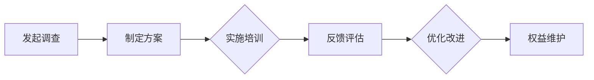

                 

# 情感劳动权益保护联盟：职场情绪管理的倡导组织

## 关键词

- 情感劳动权益
- 职场情绪管理
- 保护联盟
- 倡导组织
- 职场压力

## 摘要

本文旨在探讨职场中情绪管理的重要性，以及如何通过情感劳动权益保护联盟这一倡导组织来提升职场情绪管理水平。文章首先介绍了职场情绪管理的重要性、挑战以及解决途径，然后深入分析了情感劳动权益保护联盟的定义、运作模式和作用。最后，文章通过实践案例和最佳实践，为企业和员工提供了具体的情绪管理策略和建议。

### 第一部分：背景与核心概念

#### 1. 背景介绍

**问题背景**：随着社会竞争的加剧，职场压力逐渐成为影响员工身心健康的重要因素。情绪管理能力的高低直接影响员工的职业发展和生活质量。

**问题描述**：职场中，员工面临着复杂的工作压力、人际关系冲突以及自我期望的挑战，情绪管理能力不足导致职场情绪问题频发。

**问题解决**：情感劳动权益保护联盟应运而生，旨在通过倡导和组织职场情绪管理，提高员工情感素质，维护劳动权益。

**边界与外延**：情感劳动权益涉及员工的情感状态、心理需求以及职业发展等方面，不仅包括工作场所的情感管理，还包括家庭和社会层面的情感关怀。

**核心要素组成**：情感劳动权益保护联盟由企业、专业人士和政府三方组成，通过建立专业机构、推广情绪管理培训、制定相关政策等措施，实现职场情绪管理的全面覆盖。

#### 2. 核心概念与联系

**核心概念原理**：情感劳动权益保护联盟是基于对情感劳动的特殊关注而成立的组织，其核心目的是通过提升员工的情感管理能力，保障员工的劳动权益。

**概念属性特征对比表格**：

| 特征类别 | 情感劳动 | 普通劳动 |
| --- | --- | --- |
| 工作内容 | 注重情感交流与表达 | 以物质产出为主 |
| 工作效果 | 依赖于情感状态 | 依赖于技能与知识 |
| 工作环境 | 需要良好的情感氛围 | 更多关注硬件设施 |

**ER实体关系图架构**：

```mermaid
erDiagram
  企业 ||--|{ 联盟 }|
  联盟 ||--|{ 员工 }|
  联盟 ||--|{ 政府机构 }|
  政府机构 ||--|{ 政策法规 }|
```

### 第二部分：职场情绪管理

#### 3. 情绪管理的原理与方法

**情绪管理的基本原理**：情绪管理是一种自我调节能力，通过认知、情感和行为三个层面来控制情绪反应。

**情绪管理的方法与技巧**：包括情绪认知、情绪表达、情绪调节和情绪释放等方法，如正念冥想、情绪日记和情感支持网络等。

**情绪管理在不同工作场景中的应用**：如团队协作中的情感沟通、项目管理中的情绪调节和领导力发展中的情感智慧等。

#### 4. 情绪劳动与职场压力

**情绪劳动的概念与特征**：情绪劳动是指在工作中需要表现出特定的情感态度和情绪反应，以符合工作要求。

**职场压力的来源与影响**：包括工作负荷、人际关系、职业发展等方面，长期的压力影响员工的身心健康和工作表现。

**压力管理策略与案例**：如时间管理、工作与生活平衡和心理健康支持等策略，通过案例分享具体实践效果。

#### 5. 职场情绪管理的案例分析

**案例一：企业内部情绪管理实践**：某大型科技公司通过设立情感实验室、开展情绪管理培训和提供心理咨询服务，提升了员工的情绪管理能力。

**案例二：职场情绪冲突的解决策略**：某互联网企业通过建立情绪冲突管理机制，有效化解了员工之间的冲突，提升了团队凝聚力。

### 第三部分：情感劳动权益保护联盟的运作

#### 6. 联盟的运作模式与机制

**联盟的组织结构**：由企业、专业人士和政府组成，形成多元协作的网络体系。

**联盟的运作流程**：包括情感调查、情绪培训、政策建议和权益维护等环节。

**联盟的服务内容与目标**：提供情感咨询、培训和心理支持，提升员工的情感管理能力，维护员工的劳动权益。

#### 7. 联盟在职场情绪管理中的角色与作用

**联盟在员工情绪管理中的角色**：提供专业支持和培训，帮助员工提升情绪管理能力。

**联盟在企业文化建设中的角色**：推动企业建立积极、健康的情感氛围，促进企业文化的建设。

**联盟在社会责任承担中的角色**：通过倡导和推广情感劳动权益保护，提升社会的整体情感管理水平。

### 第四部分：实践与案例

#### 9. 实践指导

**企业如何建立情感劳动权益保护机制**：从制度设计、文化建设和实践操作等方面提出具体建议。

**员工如何维护自身情感劳动权益**：提供员工自我保护策略和维权途径。

#### 10. 案例剖析

**成功案例解析**：分析成功企业的情感劳动权益保护实践，提炼经验教训。

**失败案例反思**：反思企业情感劳动权益保护中的问题，提出改进措施。

#### 11. 最佳实践与启示

**最佳实践分享**：分享行业最佳实践，为企业和员工提供参考。

**案例分析中的启示**：总结案例中的成功经验和教训，为职场情绪管理提供借鉴。

### 第五部分：拓展与思考

#### 12. 拓展阅读

**相关书籍与论文推荐**：推荐有关情感劳动权益保护、职场情绪管理的经典书籍和学术论文。

**行业动态与政策法规**：介绍当前行业动态和政策法规，帮助读者了解最新的发展态势。

### 13. 小结与总结

**本书的主要观点与结论**：总结文章的核心观点，提出结论和建议。

**对职场情绪管理的思考**：对职场情绪管理的现状和未来进行深入思考，为读者提供启示。

### 14. 注意事项与建议

**职场情绪管理的注意事项**：提醒读者关注职场情绪管理中的重要细节。

**建议与展望**：提出具体的建议和未来发展方向，为职场情绪管理提供方向性指导。

### 附录

**附录A：情感劳动权益保护联盟运作流程图**



**附录B：情绪管理策略与技巧表格**

| 策略与技巧 | 描述 |
| --- | --- |
| 正念冥想 | 通过专注和觉察来调节情绪 |
| 情绪日记 | 通过记录情感体验来提高自我认知 |
| 情感支持网络 | 通过与他人交流来缓解压力 |

### 作者

**作者：AI天才研究院/AI Genius Institute & 禅与计算机程序设计艺术 /Zen And The Art of Computer Programming**

