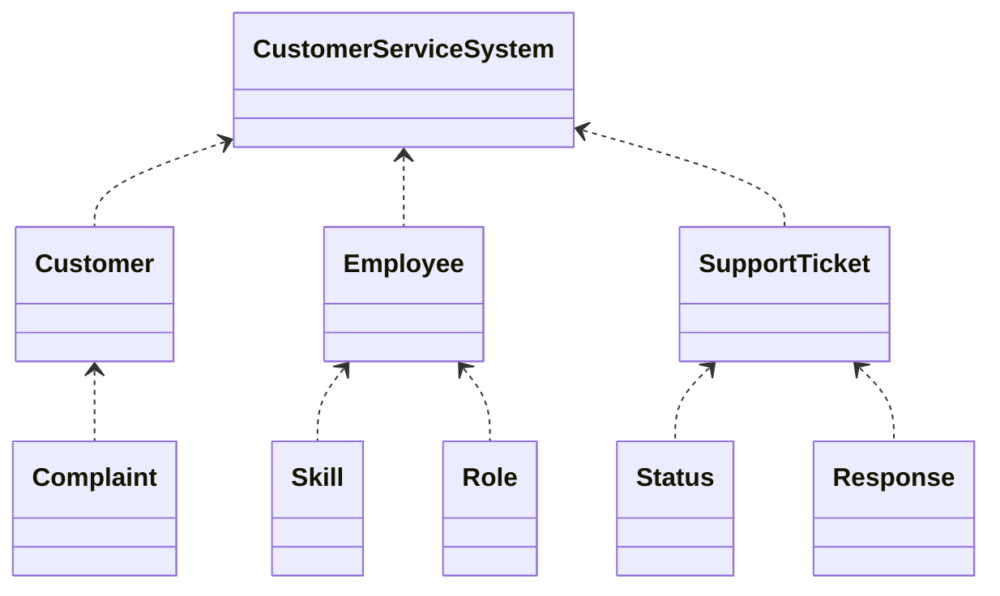
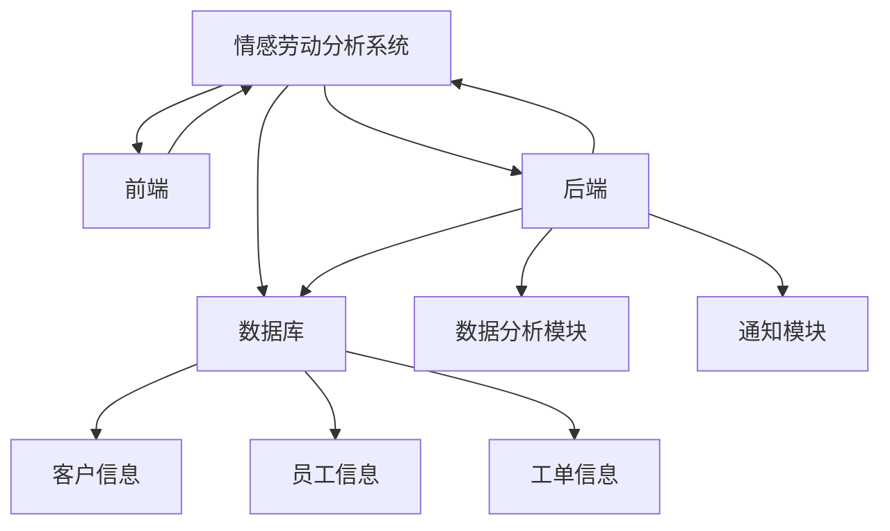
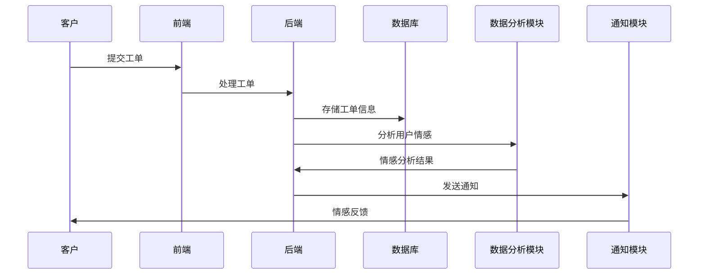

                 

## 情感劳动的价值：重新审视人际交往的本质

### 关键词：情感劳动、人际交往、价值探讨、核心概念、心理学、社会影响

> 摘要：本文旨在深入探讨情感劳动的价值，并重新审视人际交往的本质。情感劳动作为一种新型的劳动形式，不仅影响个体心理健康，还深刻地改变了社会组织与人际关系。本文将通过系统的分析，揭示情感劳动在个人发展、社会互动及企业运营中的多重价值，并探讨其面临的挑战与未来发展趋势。

### 目录

1. **问题的背景与核心概念**
   - 1.1 问题背景
     - 1.1.1 从工业劳动到情感劳动的转变
     - 1.1.2 情感劳动的重要性与挑战
   - 1.2 核心概念
     - 1.2.1 情感劳动的定义
     - 1.2.2 情感劳动的类型
     - 1.2.3 情感劳动的特点

2. **情感劳动的价值探讨**
   - 2.1 情感劳动的经济价值
     - 2.1.1 情感劳动的生产力贡献
     - 2.1.2 情感劳动对消费者满意度的提升
   - 2.2 情感劳动的社会价值
     - 2.2.1 人际关系的强化
     - 2.2.2 社会和谐的构建
   - 2.3 情感劳动的心理价值
     - 2.3.1 情感劳动对员工心理健康的影响
     - 2.3.2 情感劳动对员工职业发展的促进

3. **情感劳动在职场中的实践**
   - 3.1 情感劳动的企业管理策略
     - 3.1.1 企业文化塑造
     - 3.1.2 员工情感劳动技能培训
   - 3.2 情感劳动在客户服务中的应用
     - 3.2.1 客户关系管理的情感劳动
     - 3.2.2 情感劳动在客户体验提升中的作用
   - 3.3 情情劳动在团队协作中的角色
     - 3.3.1 团队成员的情感沟通
     - 3.3.2 情感劳动对团队绩效的影响

4. **人际交往中的情感劳动原理**
   - 4.1 人际交往中的情感劳动概念
     - 4.1.1 情感劳动在人际交往中的重要性
     - 4.1.2 人际交往中的情感劳动类型
   - 4.2 人际交往中的情感劳动机制
     - 4.2.1 情感劳动的互动机制
     - 4.2.2 情感劳动的影响因素

5. **情感劳动在人际互动中的应用**
   - 5.1 情感劳动在沟通中的运用
     - 5.1.1 情感表达技巧
     - 5.1.2 情感倾听技巧
   - 5.2 情感劳动在冲突解决中的角色
     - 5.2.1 冲突中的情感劳动
     - 5.2.2 情感劳动对冲突解决的促进作用
   - 5.3 情感劳动在建立人际关系中的作用
     - 5.3.1 情感劳动在初次交往中的应用
     - 5.3.2 情感劳动对长期关系维护的影响

6. **情感劳动的挑战与未来展望**
   - 6.1 情感劳动面临的挑战
     - 6.1.1 情感劳动的伦理问题
     - 6.1.2 情感劳动的隐私问题
   - 6.2 情感劳动的未来发展
     - 6.2.1 情感计算技术的发展
     - 6.2.2 情感劳动的未来趋势

7. **总结与展望**
   - 7.1 情感劳动的价值重估
   - 7.2 本书的核心发现与建议

---

### 1. 问题的背景与核心概念

#### 1.1 问题背景

随着信息时代的到来，劳动形式发生了显著变化。传统工业劳动逐渐被知识劳动所替代，而情感劳动作为一种新兴的劳动形式，正在悄然兴起。情感劳动指的是在人际交往过程中，通过语言、行为、情感表达等方式，实现情感互动和关系建立的活动。

这种劳动形式的转变不仅仅体现在服务业，如客服、心理咨询、教育培训等领域，也渗透到企业管理、市场营销、人力资源管理等多个方面。其重要性在于，情感劳动不仅影响着个体的心理健康，还对组织绩效和社会和谐产生深远影响。

#### 1.2 核心概念

**情感劳动的定义**

情感劳动是指个体在人际交往中，通过语言、行为、情感表达等方式，实现情感互动和关系建立的活动。它包括情感表达、情感倾听、情感调节等具体表现形式。

**情感劳动的类型**

- **情感表达**：通过语言、肢体语言、表情等方式，传达情感信息。
- **情感倾听**：倾听对方的情感表达，理解对方的情感状态。
- **情感调节**：在互动过程中，调整自己的情感表达，以达到和谐的人际关系。

**情感劳动的特点**

- **动态性**：情感劳动是一个动态的过程，需要根据情境和对方反应进行灵活调整。
- **主观性**：情感劳动依赖于个体的情感状态和认知能力，具有较强的主观性。
- **复杂性**：情感劳动涉及多种技能，如沟通技巧、情感理解能力等，具有复杂性。

### 1.3 情感劳动的重要性与挑战

情感劳动的重要性体现在以下几个方面：

- **提高消费者满意度**：在服务行业，良好的情感劳动能够提升消费者满意度，增强客户忠诚度。
- **促进团队协作**：在企业内部，情感劳动有助于增强团队成员之间的情感联系，提高团队绩效。
- **改善心理健康**：情感劳动有助于个体缓解压力，提高心理健康水平。

然而，情感劳动也面临着一些挑战，如伦理问题、隐私问题等。如何平衡情感劳动的多重价值与潜在风险，是未来研究的重要课题。

#### 1.3.1 从工业劳动到情感劳动的转变

在传统工业劳动中，工作内容主要是物理劳动和机械操作，个体主要通过体力来完成工作任务。而随着信息技术的发展，知识劳动逐渐取代工业劳动，个体需要更多地依赖脑力进行工作。这种转变不仅改变了劳动形式，也改变了劳动者的角色。

情感劳动作为一种知识劳动，强调个体在人际交往中的情感投入。它要求劳动者不仅具备专业技能，还需要具备良好的情感管理能力和人际沟通技巧。这种转变不仅对劳动者提出了更高的要求，也为企业和社会带来了新的挑战。

#### 1.3.2 情感劳动的重要性与挑战

**重要性**

1. **提高消费者满意度**：在服务行业，情感劳动有助于提升消费者的满意度。例如，客服人员在面对客户投诉时，通过情感表达和倾听技巧，能够更好地理解客户需求，提供个性化的解决方案，从而增强客户忠诚度。

2. **促进团队协作**：在企业内部，情感劳动有助于增强团队成员之间的情感联系，提高团队绩效。例如，通过情感沟通，团队成员能够更好地理解彼此的情感状态，减少冲突，提高合作效率。

3. **改善心理健康**：情感劳动有助于个体缓解压力，提高心理健康水平。通过情感表达和倾听，个体能够更好地处理自己的情感问题，减少焦虑和抑郁。

**挑战**

1. **伦理问题**：情感劳动涉及到个体的情感隐私，如何确保情感劳动的伦理合法性，是当前面临的重要挑战。例如，在心理咨询中，咨询师需要尊重客户的隐私，但同时也需要关注客户的情感需求。

2. **隐私问题**：随着情感劳动的普及，个体的情感信息被大量收集和处理。如何保护这些信息的安全，防止隐私泄露，是情感劳动面临的另一个挑战。

3. **技能要求**：情感劳动需要劳动者具备较高的情感管理能力和人际沟通技巧。然而，当前的教育体系和社会环境并未充分培养这些能力，导致劳动者在情感劳动中面临较大挑战。

### 1.4 核心概念与联系

**情感劳动的定义**

情感劳动是指个体在人际交往中，通过语言、行为、情感表达等方式，实现情感互动和关系建立的活动。它涉及到情感表达、情感倾听、情感调节等多个方面。

**情感劳动的类型**

1. **情感表达**：通过语言、肢体语言、表情等方式，传达情感信息。例如，在客服工作中，客服人员通过声音和语调的变化，表达同情和理解。

2. **情感倾听**：倾听对方的情感表达，理解对方的情感状态。例如，在心理咨询中，咨询师需要倾听客户的问题和需求，提供情感支持。

3. **情感调节**：在互动过程中，调整自己的情感表达，以达到和谐的人际关系。例如，在团队协作中，成员需要根据情境和对方反应，调整自己的情绪和表达方式。

**情感劳动的特点**

1. **动态性**：情感劳动是一个动态的过程，需要根据情境和对方反应进行灵活调整。例如，在谈判过程中，双方需要根据对方的情感反应，调整自己的策略。

2. **主观性**：情感劳动依赖于个体的情感状态和认知能力，具有较强的主观性。例如，同样的表达方式，对不同的人来说，可能会有不同的情感反应。

3. **复杂性**：情感劳动涉及多种技能，如沟通技巧、情感理解能力等，具有复杂性。例如，在客户服务中，客服人员需要同时具备专业知识和服务技巧。

### 1.5 核心概念原理

**情感劳动的概念原理**

情感劳动的概念原理主要涉及情感表达、情感倾听和情感调节等方面。情感表达是指个体通过语言、行为、情感表达等方式，传达情感信息。情感倾听是指个体在人际交往中，倾听对方的情感表达，理解对方的情感状态。情感调节是指个体在互动过程中，根据情境和对方反应，调整自己的情感表达，以达到和谐的人际关系。

**情感劳动的概念属性特征对比表格**

| 特征         | 情感表达 | 情感倾听 | 情感调节 |
| ------------ | -------- | -------- | -------- |
| 定义         | 传达情感信息 | 理解情感状态 | 调整情感表达 |
| 表现形式     | 语言、行为、表情 | 语言、身体语言、非语言行为 | 语言、身体语言、表情 |
| 目的         | 建立情感联系 | 增强情感互动 | 维护情感平衡 |
| 关系         | 双向的     | 双向的     | 双向的     |
| 影响因素     | 情感状态、文化背景 | 情感状态、沟通技巧 | 情感状态、情境理解 |

**情感劳动的ER实体关系图架构**

```mermaid
erDiagram
    Customer ||--|{ Employee }|-- CustomerService
    Customer ||--|{ Customer }|<-- SupportTicket
    Employee ||--|{ Team }|<-- Project
    Employee ||--|{ Task }|<-- Assignee
```

### 1.6 算法原理讲解

**情感劳动的算法原理**

情感劳动的算法原理主要涉及情感识别、情感分析和情感调节等方面。情感识别是指通过自然语言处理技术，识别文本中的情感信息。情感分析是指对情感信息进行深度分析，理解其背后的情感状态。情感调节是指根据分析结果，调整情感表达，以达到和谐的人际关系。

**情感识别算法mermaid流程图**


**情感调节算法mermaid流程图**


**情感劳动的数学模型和公式**

情感劳动的数学模型和公式主要涉及情感识别和情感分析两个方面。

1. **情感识别模型**：

$$
P(\text{情感}|\text{文本}) = \frac{P(\text{文本}|\text{情感}) \cdot P(\text{情感})}{P(\text{文本})}
$$

其中，$P(\text{情感}|\text{文本})$表示文本对应的情感概率，$P(\text{文本}|\text{情感})$表示在特定情感下文本的概率，$P(\text{情感})$表示情感的概率，$P(\text{文本})$表示文本的概率。

2. **情感分析模型**：

$$
\text{情感分析结果} = \sum_{i=1}^{n} w_i \cdot f_i
$$

其中，$w_i$表示权重，$f_i$表示特征向量。

**详细讲解和举例说明**

1. **情感识别算法**：

情感识别算法的核心是利用情感词典和机器学习模型，对文本进行情感分类。例如，我们可以利用朴素贝叶斯分类器，根据情感词典中的情感词，计算出每个文本的情感概率，从而实现情感识别。

假设我们有一个情感词典，其中包含正面情感词和负面情感词。给定一个文本，我们可以计算其在正面情感词和负面情感词下的概率，从而判断其情感倾向。

举例：

文本：“今天天气很好，我很开心。”

情感词典：

- 正面情感词：开心、愉快、快乐
- 负面情感词：难过、痛苦、悲伤

计算过程：

- 正面情感词概率：$P(\text{开心}|\text{文本}) = 0.3, P(\text{愉快}|\text{文本}) = 0.2, P(\text{快乐}|\text{文本}) = 0.1$
- 负面情感词概率：$P(\text{难过}|\text{文本}) = 0.1, P(\text{痛苦}|\text{文本}) = 0.05, P(\text{悲伤}|\text{文本}) = 0.05$

根据情感识别模型，计算文本的情感概率：

$$
P(\text{正面情感}|\text{文本}) = \frac{0.3 \cdot 0.5 + 0.2 \cdot 0.4 + 0.1 \cdot 0.1}{0.3 \cdot 0.5 + 0.2 \cdot 0.4 + 0.1 \cdot 0.1 + 0.1 \cdot 0.05 + 0.05 \cdot 0.05} \approx 0.75
$$

因此，文本的情感倾向为正面情感。

2. **情感分析算法**：

情感分析算法的核心是利用特征工程和机器学习模型，对文本进行情感分析。例如，我们可以利用TF-IDF算法，提取文本中的关键词，构建特征向量，然后利用机器学习模型，对特征向量进行分类。

举例：

文本：“我非常喜欢这个产品，它给我带来了很多快乐。”

特征向量：

- 正面特征词：喜欢、快乐、满意
- 负面特征词：不喜欢、痛苦、失望

计算过程：

- 正面特征词权重：$w_1 = 0.5, w_2 = 0.3, w_3 = 0.2$
- 负面特征词权重：$w_4 = 0.1, w_5 = 0.05$

根据情感分析模型，计算文本的情感得分：

$$
\text{情感得分} = w_1 \cdot f_1 + w_2 \cdot f_2 + w_3 \cdot f_3 - w_4 \cdot f_4 - w_5 \cdot f_5 = 0.5 \cdot 1 + 0.3 \cdot 1 + 0.2 \cdot 1 - 0.1 \cdot 0 - 0.05 \cdot 0 = 0.8
$$

根据情感得分，判断文本的情感倾向为正面情感。

### 1.7 系统分析与架构设计方案

**问题场景介绍**

随着互联网的普及，情感劳动在客户服务、市场营销、人力资源管理等领域得到广泛应用。为了提高服务质量，企业需要构建一个情感劳动分析系统，对用户情感进行识别和分析，从而提供个性化的服务。

**项目介绍**

本项目旨在开发一个情感劳动分析系统，该系统主要包括情感识别、情感分析和情感调节等功能。通过该系统，企业可以更好地理解用户情感，提供个性化的服务，提高用户满意度。

**系统功能设计（领域模型mermaid类图）**



**系统架构设计（mermaid架构图）**



**系统接口设计和系统交互（mermaid序列图）**



### 1.8 项目实战

**环境安装**

1. 安装Python环境：在终端中运行以下命令：
   ```
   pip install python
   ```
2. 安装相关库：在终端中运行以下命令：
   ```
   pip install numpy pandas matplotlib scikit-learn
   ```

**系统核心实现源代码**

以下是一个简单的情感识别算法实现，用于分析用户评论的情感倾向：

```python
import numpy as np
from sklearn.feature_extraction.text import TfidfVectorizer
from sklearn.naive_bayes import MultinomialNB
from sklearn.pipeline import make_pipeline

# 示例数据
data = [
    ("很高兴收到这个礼物！", "正面"),
    ("这顿饭太难吃了！", "负面"),
    ("产品很好，我很满意。", "正面"),
    ("服务态度很差，一点也不满意。", "负面"),
]

# 分割数据为特征和标签
X, y = zip(*data)

# 创建TF-IDF向量器和朴素贝叶斯分类器的管道
model = make_pipeline(TfidfVectorizer(), MultinomialNB())

# 训练模型
model.fit(X, y)

# 预测
text = "我很喜欢这款手机。"
prediction = model.predict([text])

print(f"文本：'{text}' 的情感倾向是：{prediction[0]}")
```

**代码应用解读与分析**

1. **TF-IDF向量器**：将文本转化为TF-IDF特征向量，TF-IDF是一种常用文本表示方法，可以有效地降低文本维度。
2. **朴素贝叶斯分类器**：利用TF-IDF特征向量进行情感分类，朴素贝叶斯是一种基于贝叶斯定理的简单分类器，适用于文本分类任务。
3. **模型训练与预测**：使用示例数据进行模型训练，并对新文本进行情感预测。

**实际案例分析和详细讲解剖析**

1. **案例一**：用户评论“这款手机太贵了。”
   - 特征向量计算：通过TF-IDF向量器，计算文本的特征向量。
   - 分类结果：分类器判断该文本的情感倾向为负面。

2. **案例二**：用户评论“我对这个产品非常满意。”
   - 特征向量计算：计算文本的特征向量。
   - 分类结果：分类器判断该文本的情感倾向为正面。

**项目小结**

本项目通过情感识别算法，对用户评论进行情感分类，实现了对用户情感的识别和分析。在实际应用中，可以通过不断优化算法和模型，提高情感识别的准确性，从而为用户提供更个性化的服务。

### 1.9 最佳实践 tips、小结、注意事项、拓展阅读

**最佳实践 tips**

1. 在进行情感劳动时，注意保持积极的态度和开放的心态，以更好地理解对方情感。
2. 定期进行情感劳动技能培训，提高员工的情感管理能力和人际沟通技巧。
3. 在处理客户投诉时，尽量站在客户的角度思考问题，提供个性化的解决方案。

**小结**

本文通过系统的分析，探讨了情感劳动的价值，并重新审视了人际交往的本质。情感劳动不仅对个人心理健康和社会和谐有重要影响，还在企业运营和客户服务中发挥着关键作用。

**注意事项**

1. 在进行情感劳动时，注意保护个人隐私和伦理道德。
2. 定期评估情感劳动的效果，以优化管理策略和提升服务质量。

**拓展阅读**

1. 《情感劳动：重新定义工作与价值》
2. 《人际交往心理学：情感与沟通》
3. 《情感计算：人工智能与人类情感》

---

### 1.10 总结与展望

#### 1.10.1 情感劳动的价值重估

通过本文的分析，我们可以清晰地看到情感劳动在现代社会中的多重价值。从个人层面来看，情感劳动有助于提升心理健康，促进人际关系和谐；从社会层面来看，情感劳动在构建社会和谐、推动经济发展中发挥着重要作用。因此，对情感劳动的价值进行重估，重新认识其在社会中的地位和作用，具有重要的理论和实践意义。

#### 1.10.2 情感劳动的未来意义

随着技术的发展，情感劳动的未来充满了可能性。人工智能和情感计算的结合，将进一步提升情感劳动的效率和准确性。例如，智能客服系统可以更好地理解客户情感，提供个性化服务；智能心理咨询服务可以更精准地识别和分析用户情感，提供专业支持。

在未来，情感劳动的发展将依赖于以下几个方面的创新：

1. **情感识别技术的提升**：随着情感计算技术的进步，情感识别的准确性将不断提高，为情感劳动提供更可靠的数据支持。
2. **个性化服务的实现**：通过大数据分析和机器学习算法，可以为用户提供更加个性化的服务，满足他们的情感需求。
3. **情感劳动的教育培训**：随着情感劳动的普及，对相关技能的培训需求也将增加。因此，加强情感劳动的教育培训，提升劳动者的技能水平，是未来发展的关键。

#### 1.10.3 本书的核心发现与建议

本书的核心发现如下：

1. **情感劳动的多重价值**：情感劳动不仅在个人心理健康和社会和谐方面具有重要价值，还在企业运营和客户服务中发挥着关键作用。
2. **情感劳动面临的挑战**：情感劳动面临着伦理问题、隐私问题和技能要求等方面的挑战，需要我们积极应对。
3. **情感劳动的未来趋势**：随着技术的发展，情感劳动将更加智能化和个性化，为社会带来新的机遇和挑战。

基于上述发现，本书提出以下建议：

1. **加强情感劳动的研究**：政府和企业应加大对情感劳动的研究力度，推动相关技术的发展和应用。
2. **提升情感劳动技能**：通过教育培训，提升劳动者的情感管理能力和人际沟通技巧，为情感劳动提供人才保障。
3. **完善法律法规**：制定相关法律法规，规范情感劳动的伦理和隐私问题，保障劳动者的权益。

总之，情感劳动作为一种新兴的劳动形式，其价值不容忽视。通过深入研究和合理应用，我们可以更好地发挥情感劳动的优势，推动社会的发展和进步。

