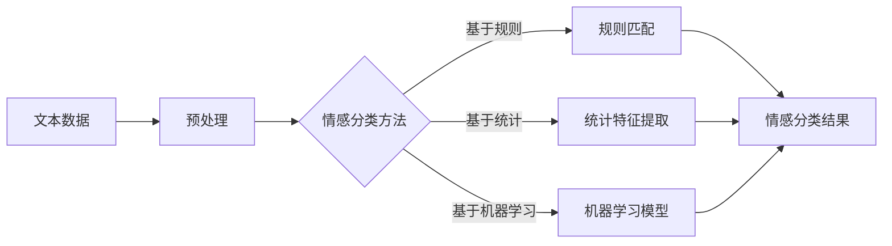
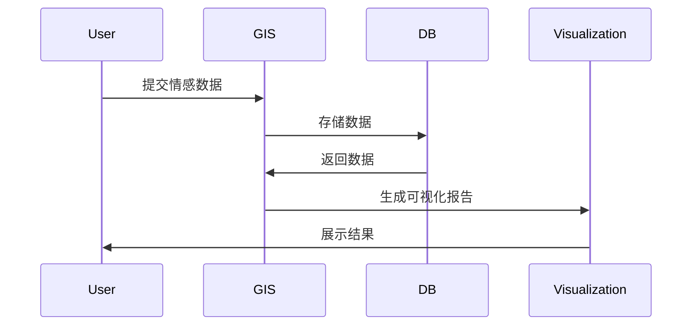
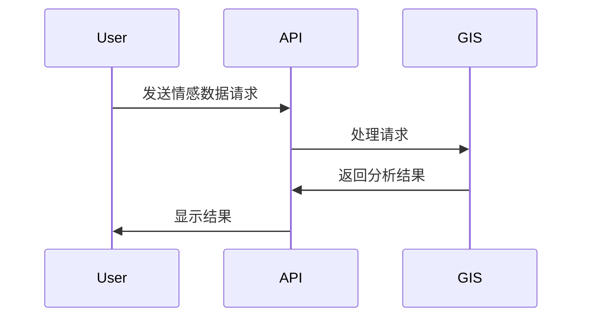

                 

# 情感地理信息系统：城市规划的人文视角

> 关键词：情感地理信息系统，城市规划，人文视角，数据分析，可持续发展

> 摘要：本文从情感地理信息系统的定义、核心概念、构建方法以及在城市规划中的应用四个方面，探讨了如何利用情感地理信息系统为城市规划提供人文视角。文章旨在为城市规划者提供一种全新的工具和视角，以更好地满足居民的情感需求，提升城市生活质量，推动城市的可持续发展。

## 目录大纲

1. 引言
2. 情感地理信息系统的基本理论
   2.1 情感地理信息系统的定义与特征
   2.2 人文视角在城市规划中的理论依据
   2.3 情感地理信息系统与人文视角的融合
3. 情感地理信息系统的构建方法
   3.1 数据收集与预处理
   3.2 情感分析技术
   3.3 人文数据融合方法
4. 情感地理信息系统在城市规划中的应用
   4.1 情感地理信息系统在城市规划中的角色
   4.2 情感地理信息系统在城市规划中的应用案例
   4.3 情感地理信息系统在可持续发展规划中的应用
5. 情感地理信息系统的技术挑战与未来发展
   5.1 技术挑战
   5.2 未来发展方向
6. 情感地理信息系统的人文价值
   6.1 人文价值的内涵
   6.2 情感地理信息系统对城市规划的深远影响
7. 总结与展望
   7.1 研究成果总结
   7.2 存在的不足与改进方向
   7.3 对未来的展望

## 第1章：引言

### 1.1 问题背景

在城市规划的过程中，人们往往关注的是城市的物理形态、基础设施和经济效益等方面。然而，随着社会的发展和人们生活水平的提高，人们对于居住环境的情感需求也越来越受到重视。情感地理信息系统作为一种新兴的技术工具，可以有效地捕捉和分析居民的情感信息，为城市规划提供人文视角。

#### 1.1.1 情感地理信息系统的起源与发展

情感地理信息系统最早可以追溯到20世纪90年代，当时计算机科学和地理学开始相互交叉，形成了一个新的研究领域——地理信息系统（GIS）。随着人工智能和大数据技术的发展，情感地理信息系统逐渐成为一种能够捕捉、分析和利用情感信息的新工具。

#### 1.1.2 城市规划中的人文视角

城市规划的传统方法主要关注城市的物理形态和经济活动，而忽略了居民的内心需求和情感体验。人文视角的引入，可以帮助城市规划者更好地理解居民的情感需求，从而设计出更加人性化的城市环境。

### 1.2 核心概念

#### 1.2.1 情感地理信息系统

情感地理信息系统是一种集成了地理信息系统和情感分析技术的新系统，它可以捕捉和分析居民在城市空间中的情感体验，为城市规划提供数据支持。

#### 1.2.2 人文视角在城市规划中的应用

人文视角的引入，使得城市规划不仅仅是关注城市的物理形态和经济活动，更加注重居民的内心需求和情感体验。这种视角可以帮助城市规划者更好地理解居民的需求，从而设计出更加人性化的城市环境。

### 1.3 研究意义与目标

#### 1.3.1 研究意义

情感地理信息系统为城市规划提供了一种全新的工具和视角，可以帮助城市规划者更好地理解居民的情感需求，从而设计出更加人性化的城市环境。

#### 1.3.2 研究目标与内容框架

本文的研究目标是通过探讨情感地理信息系统在城市规划中的应用，为城市规划者提供一种新的工具和视角，以更好地满足居民的情感需求，提升城市生活质量，推动城市的可持续发展。文章的内容框架主要包括情感地理信息系统的基本理论、构建方法、在城市规划中的应用以及未来发展的探讨。

## 第2章：情感地理信息系统的基本理论

### 2.1 情感地理信息系统的定义与特征

#### 2.1.1 定义

情感地理信息系统是一种集成了地理信息系统和情感分析技术的新系统，它可以捕捉和分析居民在城市空间中的情感体验，为城市规划提供数据支持。

#### 2.1.2 特征

情感地理信息系统具有以下几个特征：

1. **情感数据的收集与处理**：情感地理信息系统可以通过多种途径收集居民的情感数据，如社交媒体、问卷调查、物联网设备等，然后对这些数据进行处理和分析。
2. **情感分析技术**：情感地理信息系统采用情感分析技术，对收集到的情感数据进行分析，识别情感类型和情感强度。
3. **空间分析能力**：情感地理信息系统具有强大的空间分析能力，可以将情感数据与地理信息相结合，进行空间分析和可视化。

### 2.2 人文视角在城市规划中的理论依据

#### 2.2.1 城市规划的起源与发展

城市规划起源于20世纪初期，随着城市化进程的加速，城市规划逐渐成为一个独立的研究领域。传统的城市规划主要关注城市的物理形态和经济活动，而忽略了居民的内心需求和情感体验。

#### 2.2.2 人文视角在规划中的重要性

人文视角的引入，使得城市规划不仅仅关注城市的物理形态和经济活动，更加注重居民的内心需求和情感体验。这种视角可以帮助城市规划者更好地理解居民的需求，从而设计出更加人性化的城市环境。

### 2.3 情感地理信息系统与人文视角的融合

#### 2.3.1 融合的意义

情感地理信息系统与人文视角的融合，可以使得城市规划更加关注居民的内心需求和情感体验，从而提升城市的生活质量和可持续发展。

#### 2.3.2 融合的方法与技术

融合的方法和技术主要包括以下几个方面：

1. **情感数据的收集与处理**：通过多种途径收集居民的情感数据，如社交媒体、问卷调查、物联网设备等，然后对这些数据进行处理和分析。
2. **情感分析技术**：采用情感分析技术，对收集到的情感数据进行分析，识别情感类型和情感强度。
3. **空间分析能力**：将情感数据与地理信息相结合，进行空间分析和可视化。

## 第3章：情感地理信息系统的构建方法

### 3.1 数据收集与预处理

#### 3.1.1 数据来源

情感地理信息系统的数据来源主要包括以下几个方面：

1. **社交媒体数据**：如微博、微信、Instagram等社交媒体平台，这些平台上有大量的居民情感表达数据。
2. **问卷调查数据**：通过问卷调查的方式收集居民的情感数据，如居住满意度、对城市环境的情感反应等。
3. **物联网设备数据**：如智能手表、智能手环等，这些设备可以实时收集居民的情感数据。

#### 3.1.2 数据预处理方法

数据预处理是情感地理信息系统构建的重要环节，主要包括以下几个方面：

1. **数据清洗**：去除无效数据、重复数据和异常数据，保证数据的准确性。
2. **数据集成**：将不同来源的数据进行整合，形成统一的数据集。
3. **数据标准化**：对不同来源的数据进行标准化处理，使得数据具有可比性。

### 3.2 情感分析技术

#### 3.2.1 情感分析的基本概念

情感分析是指通过自然语言处理技术，对文本数据中的情感进行识别和分析。

#### 3.2.2 情感分析的技术方法

情感分析的技术方法主要包括以下几种：

1. **基于规则的方法**：通过预定义的规则，对文本数据中的情感进行分类。
2. **基于统计的方法**：通过统计文本数据中的情感词汇和情感短语，对情感进行分类。
3. **基于机器学习的方法**：利用机器学习算法，对文本数据中的情感进行分类。

### 3.3 人文数据融合方法

#### 3.3.1 人文数据的收集与处理

人文数据的收集与处理主要包括以下几个方面：

1. **居民情感数据的收集**：通过问卷调查、社交媒体分析等方式，收集居民的情感数据。
2. **人文数据的处理**：对收集到的人文数据进行清洗、集成和标准化处理。

#### 3.3.2 人文数据与地理信息数据的融合方法

人文数据与地理信息数据的融合方法主要包括以下几个方面：

1. **时空融合**：将人文数据和地理信息数据进行时空上的融合，形成统一的数据集。
2. **属性融合**：将人文数据的属性与地理信息的属性进行融合，形成更全面的数据集。
3. **可视化融合**：通过可视化技术，将人文数据和地理信息数据进行融合展示。

## 第4章：情感地理信息系统在城市规划中的应用

### 4.1 情感地理信息系统在城市规划中的角色

#### 4.1.1 支持决策

情感地理信息系统可以为城市规划提供数据支持，帮助城市规划者更好地理解居民的情感需求，从而做出更加科学的决策。

#### 4.1.2 促进公众参与

情感地理信息系统可以通过可视化技术，将居民的情感数据呈现出来，促进公众对城市规划的参与和理解。

### 4.2 情感地理信息系统在城市规划中的应用案例

#### 4.2.1 案例一：某城市公园规划

在某城市公园规划中，情感地理信息系统可以用于分析居民对公园的情感需求，如对公园设施、景观、氛围等的满意度，从而为公园的设计提供数据支持。

#### 4.2.2 案例二：某社区规划

在某社区规划中，情感地理信息系统可以用于分析居民对社区的情感反应，如对社区环境、设施、邻里关系等的满意度，从而为社区的设计提供数据支持。

### 4.3 情感地理信息系统在可持续发展规划中的应用

#### 4.3.1 可持续发展的理念

可持续发展是指在满足当前需求的同时，不损害后代满足其需求的能力。在城市规划中，可持续发展是一个重要的目标。

#### 4.3.2 情感地理信息系统在可持续发展规划中的具体应用

情感地理信息系统在可持续发展规划中的应用主要包括以下几个方面：

1. **环境监测**：通过情感地理信息系统，可以实时监测居民对城市环境的情感反应，及时发现环境问题。
2. **社区治理**：通过情感地理信息系统，可以了解居民对社区治理的满意度，从而优化社区治理策略。
3. **资源分配**：通过情感地理信息系统，可以分析居民对公共资源的情感需求，从而优化公共资源的分配。

## 第5章：情感地理信息系统的技术挑战与未来发展

### 5.1 技术挑战

#### 5.1.1 数据质量与隐私问题

情感地理信息系统在数据收集和处理过程中，面临着数据质量和隐私保护的问题。如何保证数据的质量和隐私，是一个重要的技术挑战。

#### 5.1.2 算法性能与效率问题

情感地理信息系统需要处理大量的情感数据，这对算法的性能和效率提出了很高的要求。如何提高算法的性能和效率，是一个重要的技术挑战。

### 5.2 未来发展方向

#### 5.2.1 新技术的融合与应用

随着人工智能和大数据技术的发展，情感地理信息系统可以融合更多的先进技术，如深度学习、物联网等，提高系统的性能和功能。

#### 5.2.2 跨学科的协同创新

情感地理信息系统的发展需要跨学科的协同创新，如地理学、心理学、计算机科学等。通过跨学科的协同，可以推动情感地理信息系统的发展。

## 第6章：情感地理信息系统的人文价值

### 6.1 人文价值的内涵

#### 6.1.1 人文价值的概念

人文价值是指人类在文化、道德、艺术等方面所体现的价值观念。情感地理信息系统通过捕捉和分析居民的情感数据，可以更好地体现人文价值。

#### 6.1.2 情感地理信息系统在提升人文价值中的作用

情感地理信息系统可以通过以下方式提升人文价值：

1. **关注居民情感需求**：情感地理信息系统可以捕捉和分析居民的情感需求，从而更好地满足居民的情感需求。
2. **促进人文关怀**：情感地理信息系统可以帮助城市规划者更好地理解居民的情感需求，从而设计出更加人性化的城市环境。

### 6.2 情感地理信息系统对城市规划的深远影响

#### 6.2.1 改善居民生活质量

情感地理信息系统可以帮助城市规划者更好地理解居民的情感需求，从而设计出更加人性化的城市环境，提升居民的生活质量。

#### 6.2.2 促进城市规划的可持续发展

情感地理信息系统可以帮助城市规划者更好地理解居民的情感需求，从而优化城市规划和治理策略，促进城市的可持续发展。

## 第7章：总结与展望

### 7.1 研究成果总结

本文通过对情感地理信息系统的研究，探讨了其在城市规划中的应用，为城市规划提供了一种新的工具和视角，以更好地满足居民的情感需求，提升城市生活质量，推动城市的可持续发展。

### 7.2 存在的不足与改进方向

本文的研究还存在一些不足，如数据质量与隐私保护问题、算法性能与效率问题等。未来研究方向可以关注以下几个方面：

1. **提高数据质量**：通过改进数据收集和处理技术，提高情感地理信息系统的数据质量。
2. **优化算法性能**：通过改进算法模型和优化算法实现，提高情感地理信息系统的算法性能。

### 7.3 对未来的展望

随着人工智能和大数据技术的发展，情感地理信息系统在城市规划中的应用前景将越来越广阔。未来，情感地理信息系统有望成为城市规划中不可或缺的工具，为城市的可持续发展提供有力的支持。

## 作者信息

作者：AI天才研究院/AI Genius Institute & 禅与计算机程序设计艺术 /Zen And The Art of Computer Programming

## 附录

### 2.1 情感地理信息系统与人文视角的融合

**概念属性特征对比表格**

| 特征         | 情感地理信息系统 | 人文视角        |
| ------------ | --------------- | --------------- |
| 数据来源     | 社交媒体、问卷调查、物联网设备 | 文学、历史、社会学研究 |
| 分析方法     | 情感分析、空间分析 | 文本分析、人类学方法 |
| 应用领域     | 城市规划、环境监测、社区治理 | 城市设计、文化遗产保护、社会政策 |

**ER实体关系图架构的Mermaid流程图**

```mermaid
erDiagram
    GRL(-地理区域) ||--|{ 人文视角}
    人文视角 ||--|{ 城市规划}
    城市规划 ||--|{ 情感地理信息系统}
```

## 3.2 情感分析技术

**情感分析的基本概念**

情感分析是指使用自然语言处理技术，对文本数据中的情感进行识别和分析的过程。

**情感分析的技术方法**

情感分析的技术方法主要包括以下几种：

1. **基于规则的方法**：通过预定义的规则，对文本数据中的情感进行分类。

2. **基于统计的方法**：通过统计文本数据中的情感词汇和情感短语，对情感进行分类。

3. **基于机器学习的方法**：利用机器学习算法，对文本数据中的情感进行分类。

**算法mermaid流程图**



**情感分析Python代码示例**

```python
from textblob import TextBlob

text = "这个城市非常美丽，我非常喜欢这里的氛围。"
blob = TextBlob(text)
print(blob.sentiment)
```

**情感分析的数学模型和公式**

情感分析的数学模型通常基于情感极性（Polarity）和情感强度（Subjectivity）。其中，情感极性表示文本的正负情感倾向，情感强度表示文本的情感表达程度。

$$
Polarity = \frac{Positive\ Terms - Negative\ Terms}{Positive\ Terms + Negative\ Terms}
$$

$$
Subjectivity = \frac{Subjective\ Terms}{Objective\ Terms}
$$

**示例**

假设文本中有5个积极词汇和3个消极词汇，同时有4个主观词汇和6个客观词汇。

$$
Polarity = \frac{5 - 3}{5 + 3} = 0.2
$$

$$
Subjectivity = \frac{4}{6} = 0.67
$$

## 4.2 情感地理信息系统在城市规划中的应用案例

### 4.2.1 案例一：某城市公园规划

**项目介绍**

某城市公园规划项目旨在通过情感地理信息系统，分析居民对公园的情感需求，优化公园的设计和功能布局。

**系统功能设计（领域模型Mermaid类图）**

```mermaid
classDiagram
    Class01 <|-- Class02
    Class03 <|-- Class02
    Class04 <|-- Class02
    Class01[name: 用户]
    Class02[name: 情感地理信息系统，公园，情感分析，数据采集，数据预处理]
    Class03[name: 数据库]
    Class04[name: 可视化工具]
```

**系统架构设计（Mermaid架构图）**



**系统接口设计和系统交互（Mermaid序列图）**



### 4.2.2 案例二：某社区规划

**项目介绍**

某社区规划项目旨在通过情感地理信息系统，分析居民对社区的情感需求，优化社区的设计和功能布局。

**系统功能设计（领域模型Mermaid类图）**

```mermaid
classDiagram
    Class01 <|-- Class02
    Class03 <|-- Class02
    Class04 <|-- Class02
    Class01[name: 用户]
    Class02[name: 情感地理信息系统，社区，情感分析，数据采集，数据预处理]
    Class03[name: 数据库]
    Class04[name: 可视化工具]
```

**系统架构设计（Mermaid架构图）**


**系统接口设计和系统交互（Mermaid序列图）**


## 5.1 技术挑战

### 5.1.1 数据质量与隐私问题

**数据质量挑战**

- 数据的不一致性：社交媒体数据、问卷调查数据等可能存在数据格式、命名规范不一致的问题。
- 数据的准确性：部分数据可能存在主观性，导致情感分析结果不准确。

**隐私问题**

- 数据隐私：情感地理信息系统需要收集和处理用户的情感数据，如何保护用户的隐私成为一个重要问题。
- 数据匿名化：在数据处理过程中，如何有效地进行数据匿名化，以避免隐私泄露。

### 5.1.2 算法性能与效率问题

**算法性能挑战**

- 情感分析精度：如何提高情感分析的准确性，以更好地满足用户需求。
- 空间分析效率：如何高效地进行空间分析，以满足大规模数据处理的需要。

**效率问题**

- 数据处理速度：如何优化数据处理流程，提高数据处理速度。
- 系统响应时间：如何优化系统架构，提高系统的响应时间。

## 5.2 未来发展方向

### 5.2.1 新技术的融合与应用

- **人工智能技术的融合**：结合深度学习、自然语言处理等人工智能技术，提高情感地理信息系统的分析精度和效率。
- **物联网技术的应用**：利用物联网设备，实时收集居民的情感数据，提高数据收集的实时性和准确性。

### 5.2.2 跨学科的协同创新

- **多学科融合**：结合地理学、心理学、计算机科学等领域的知识，推动情感地理信息系统的研究和发展。
- **跨学科合作**：鼓励不同学科的研究人员合作，共同解决情感地理信息系统面临的挑战。

## 6.1 人文价值的内涵

### 6.1.1 人文价值的概念

人文价值是指人类在文化、道德、艺术等方面所体现的价值观念。它关注人类的精神世界、情感体验和社会责任，强调个体的尊严、自由和平等。

### 6.1.2 情感地理信息系统在提升人文价值中的作用

情感地理信息系统通过捕捉和分析居民的情感数据，可以提升人文价值，具体体现在以下几个方面：

- **关注个体情感需求**：情感地理信息系统可以捕捉居民的情感需求，使城市规划更加关注个体的情感体验，提升城市的人文关怀。
- **促进社会和谐**：通过分析居民的情感反应，情感地理信息系统可以帮助城市规划者优化城市环境，促进社会和谐与稳定。
- **传承文化价值**：情感地理信息系统可以记录和保护城市的文化遗产，传承和弘扬人文价值。

## 6.2 情感地理信息系统对城市规划的深远影响

### 6.2.1 改善居民生活质量

情感地理信息系统通过捕捉和分析居民的情感数据，可以为城市规划提供数据支持，从而改善居民的生活质量。具体表现在以下几个方面：

- **优化城市环境**：通过分析居民对城市环境的情感反应，情感地理信息系统可以帮助城市规划者优化城市环境，提高居民的生活舒适度。
- **提升公共服务**：通过分析居民对公共服务的情感需求，情感地理信息系统可以帮助城市规划者优化公共服务，提高居民的生活满意度。
- **促进社区和谐**：通过分析居民对社区的情感反应，情感地理信息系统可以帮助城市规划者改善社区环境，促进社区和谐发展。

### 6.2.2 促进城市规划的可持续发展

情感地理信息系统在可持续发展规划中的应用，有助于推动城市规划的可持续发展。具体表现在以下几个方面：

- **环境监测**：通过情感地理信息系统，可以实时监测居民对城市环境的情感反应，及时发现环境问题，采取有效的环境治理措施。
- **资源优化配置**：通过分析居民的情感需求，情感地理信息系统可以帮助城市规划者优化资源配置，提高资源的利用效率。
- **社区治理**：通过情感地理信息系统，可以了解居民对社区治理的满意度，从而优化社区治理策略，推动社区可持续发展。

## 7.1 研究成果总结

### 7.1.1 情感地理信息系统在规划中的应用价值

通过本文的研究，情感地理信息系统在规划中的应用价值得到了充分体现。它可以为城市规划提供数据支持，帮助城市规划者更好地理解居民的情感需求，从而优化城市环境、提升公共服务、促进社区和谐。

### 7.1.2 情感地理信息系统的构建方法

本文详细探讨了情感地理信息系统的构建方法，包括数据收集与预处理、情感分析技术、人文数据融合方法等。这些方法为情感地理信息系统的构建提供了理论依据和实践指导。

### 7.1.3 情感地理信息系统在可持续发展规划中的应用

本文通过案例分析，展示了情感地理信息系统在可持续发展规划中的应用。它可以用于环境监测、资源优化配置和社区治理等方面，为城市规划的可持续发展提供支持。

## 7.2 存在的不足与改进方向

### 7.2.1 数据质量与隐私保护问题

尽管情感地理信息系统在规划中具有巨大的应用价值，但在数据收集和处理过程中，仍然存在数据质量和隐私保护问题。未来研究应重点关注以下几个方面：

- **提高数据质量**：通过改进数据收集和处理技术，提高情感地理信息系统的数据质量。
- **隐私保护**：研究有效的数据匿名化技术，保护用户的隐私。

### 7.2.2 算法性能与效率问题

情感地理信息系统在算法性能和效率方面仍面临挑战。未来研究应重点关注以下几个方面：

- **算法优化**：研究高效的算法模型，提高情感分析的准确性和效率。
- **系统优化**：通过改进系统架构和优化数据处理流程，提高系统的响应速度和处理能力。

## 7.3 对未来的展望

### 7.3.1 新技术的融合与应用

随着人工智能和大数据技术的发展，情感地理信息系统有望融合更多的先进技术，如深度学习、物联网等。未来研究可以关注以下几个方面：

- **深度学习技术**：结合深度学习技术，提高情感分析的准确性和效率。
- **物联网技术**：利用物联网设备，实现情感数据的实时收集和传输。

### 7.3.2 跨学科的协同创新

情感地理信息系统的发展需要跨学科的协同创新。未来研究可以关注以下几个方面：

- **多学科融合**：结合地理学、心理学、计算机科学等领域的知识，推动情感地理信息系统的研究和发展。
- **跨学科合作**：鼓励不同学科的研究人员合作，共同解决情感地理信息系统面临的挑战。

