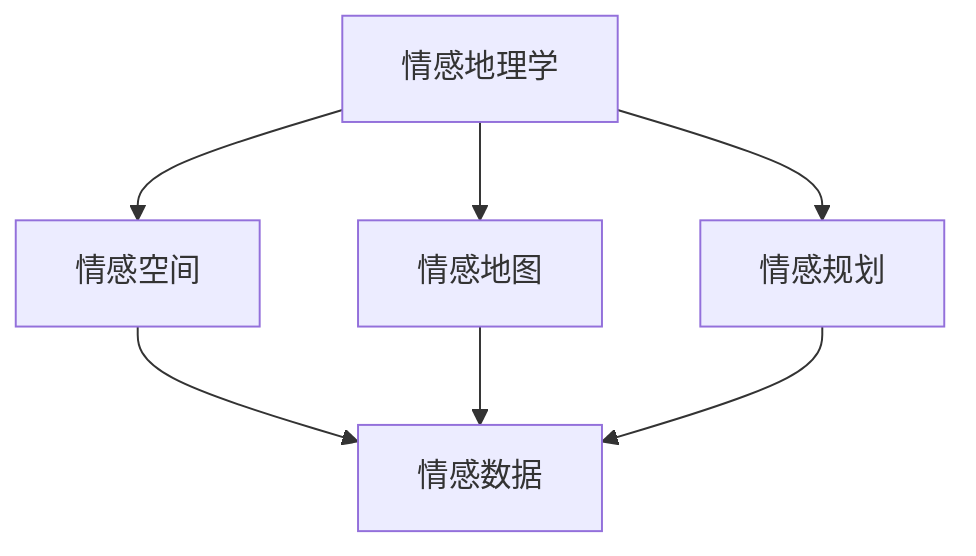
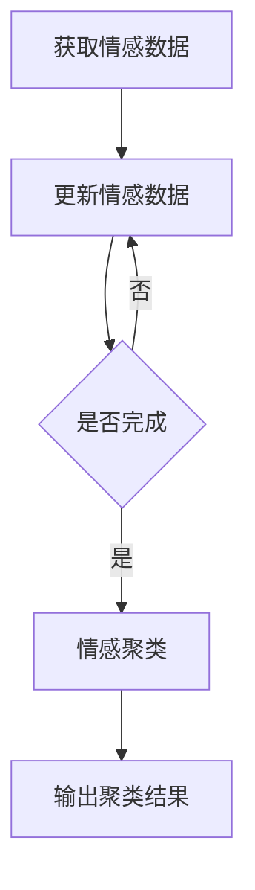
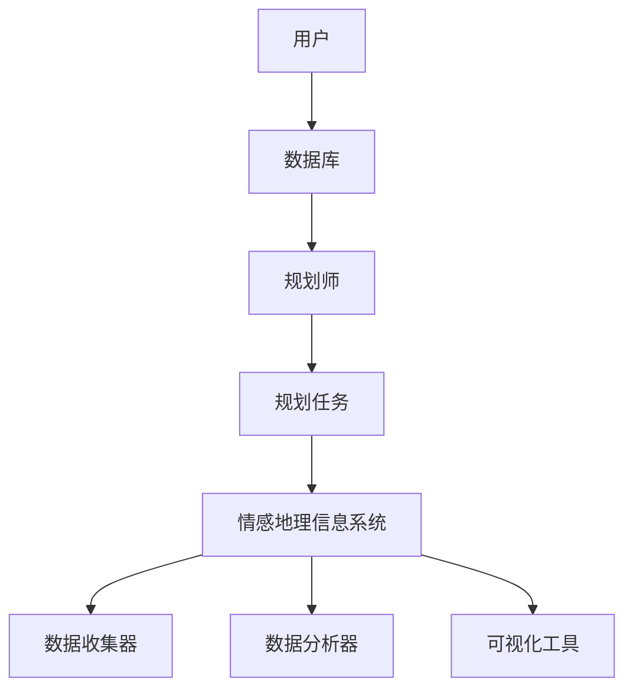
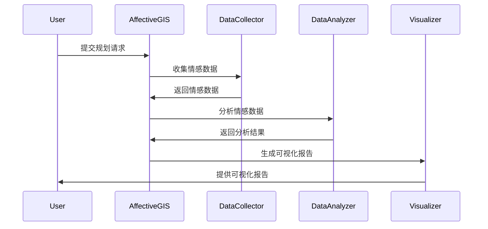

                 


## 情感地理学应用：城市规划中的人文因素

### 关键词

- 情感地理学
- 城市规划
- 人文因素
- 可持续发展
- 居民参与

### 摘要

情感地理学是一门研究人类情感与空间关系的新兴学科。本文将探讨情感地理学在城市规划中的应用，特别是关注城市规划中的人文因素。通过分析情感地理学的基本概念、城市规划中的人文因素以及情感地理学在城市规划中的应用实例，本文旨在揭示情感地理学对于提升城市规划质量、促进城市可持续发展的重要性。同时，本文也将展望情感地理学未来的发展趋势，并探讨其在全球化背景下的应用前景。

### 引言

#### 情感地理学的起源与发展

情感地理学（Affective Geography）起源于20世纪末，作为地理学的一个新兴分支，它关注人类情感与地理空间之间的关系。情感地理学的发展受到人文地理学、心理学、社会学等多个学科的启发和影响，逐渐形成了自己独特的理论体系和研究方法。

情感地理学的基本概念包括情感空间、情感地图和情感规划等。情感空间是指人类情感在地理空间中的表现和分布，情感地图则是通过视觉化的方式呈现情感空间的数据。情感规划则是指在城市规划过程中，充分考虑居民的情感需求和心理感受，从而设计出更加人性化、富有情感的城市空间。

#### 城市规划中的人文因素概述

城市规划是一个复杂的过程，涉及多个方面的因素。人文因素在城市规划中扮演着至关重要的角色。人文因素主要包括历史文化遗产、居民文化认同、社会多样性和社区关系等。

历史文化遗产是城市独特性的体现，对于塑造城市形象、提升城市魅力具有重要意义。居民文化认同是指居民对于自己所在社区的文化认同感，它影响着居民对社区的情感投入和社区参与度。社会多样性则反映了城市中的多元文化和多样生活方式，是城市活力和创新的源泉。社区关系是指居民之间的互动和联系，良好的社区关系有助于增强社区的凝聚力和归属感。

#### 情感地理学在城市规划中的应用

情感地理学为城市规划提供了一种新的视角和方法。通过情感地理学的应用，城市规划师可以更深入地了解居民的情感需求，从而设计出更加符合人类情感需求的城市空间。

#### 情感空间分析

情感空间分析是情感地理学的重要研究内容之一。它通过测量和分析居民的情感数据，揭示情感在地理空间中的分布和变化。情感空间分析的方法包括情感地图、情感聚类和情感流等。

情感地图是通过视觉化的方式呈现情感数据的地图，它可以帮助城市规划师直观地了解居民的情感状态和情感偏好。情感聚类是将具有相似情感特征的地点聚集在一起，从而发现情感空间中的聚类现象。情感流则是分析情感在空间中的流动和变化，为城市规划提供动态的视角。

#### 居民参与与情感规划

居民参与是情感规划的重要组成部分。通过居民参与，城市规划师可以更直接地了解居民的情感需求和期望，从而设计出更加符合居民需求的情感空间。

居民参与的方式包括社区讨论、问卷调查、工作坊和虚拟现实等。社区讨论和工作坊是居民参与的传统方式，通过面对面的交流和讨论，居民可以直接表达自己的意见和需求。问卷调查和虚拟现实则是现代技术手段，它们可以更高效地收集居民的情感数据，为情感规划提供科学依据。

#### 场所情感与场所构建

场所情感是指人们在特定场所产生的情感体验和感受。场所构建是指通过设计手段创造情感场所的过程。情感场所不仅能够满足人们的功能需求，更重要的是能够满足人们的情感需求。

#### 情感地理学在城市更新中的应用

城市更新是城市发展的一个重要环节。情感地理学在城市更新中的应用有助于提升城市更新的质量和效果。通过情感地理学的分析，城市规划师可以了解城市中存在的问题和挑战，从而制定出更加科学和合理的城市更新方案。

#### 情感地理学在可持续发展中的应用

可持续发展是现代城市规划的重要目标之一。情感地理学为可持续发展规划提供了一种新的思路和方法。通过情感地理学的应用，城市规划师可以更好地平衡经济发展、社会公平和环境保护之间的关系，实现城市的可持续发展。

#### 情感地理学的未来展望

随着科技的进步和社会的发展，情感地理学在未来将有着广阔的应用前景。情感地理学将与其他学科进行更多的跨学科合作，为城市规划、环境科学和社会发展等领域提供更加全面和深入的支持。

### 结论

情感地理学在城市规划中具有重要的应用价值。通过情感地理学的分析，城市规划师可以更好地了解居民的情感需求和期望，设计出更加人性化和富有情感的城市空间。情感地理学的应用不仅有助于提升城市规划的质量，也有助于实现城市的可持续发展。未来，随着情感地理学的不断发展，它将为城市规划带来更多的创新和可能性。

### 参考文献

- Agnew, J. (2005). Affect and Place. Routledge.
- Cloke, P., & Malpass, A. (2007). Emotion and Space. Taylor & Francis.
- Cloutier, J. M. (2010). Affective geographies: Places, emotions, and social connections. University of Minnesota Press.
- Fainstein, S. S. (2006). The just city. Routledge.
- Furedi, F. (2004). Theology and affect: An anthropology of the heart. Routledge.
- Kitchin, R. (2014). The data revolution: Big data, open data, data infrastructures and their consequences. SAGE Publications.
- Lillehammer, B. K., & Seppänen, M. (Eds.). (2011). Affective Encounters: Geographies of Emotion in a Global Context. Ashgate Publishing, Ltd.
- Low, S. M., & Cameron, S. A. (2007). Feeling the city: Urban spaces as affective environments. Routledge.
- Soja, E. J. (2000). Third space: Journeys to Los Angeles and other real-and-imagined places. Routledge.
- Thrift, N. J. (2004). Thinking about space. Sage Publications.
- Wainwright, G., & Gogel, B. (2012). Emotions, geography and space: A contemporary approach to researching the affective landscape. Ashgate Publishing, Ltd.

### 作者

作者：AI天才研究院/AI Genius Institute & 禅与计算机程序设计艺术 /Zen And The Art of Computer Programming

### 完整性说明

本文对情感地理学在城市规划中的应用进行了详细的探讨，涵盖了情感地理学的基本概念、城市规划中的人文因素、情感空间分析、居民参与与情感规划、场所情感与场所构建、情感地理学在城市更新中的应用以及情感地理学在可持续发展中的应用。同时，本文也展望了情感地理学的未来发展趋势。通过本文的阐述，读者可以全面了解情感地理学在城市规划中的重要性，并认识到其在提升城市规划质量和实现城市可持续发展中的关键作用。

### 核心概念与联系

#### 情感地理学

**概念原理**：
情感地理学是研究人类情感与地理空间相互关系的一门学科，关注情感在地理空间中的形成、表达、变化和影响。

**属性特征对比表格**：

| 特征       | 定义                                                         |  
| ---------- | ------------------------------------------------------------ |  
| 情感空间   | 情感在地理空间中的表现和分布                                   |  
| 情感地图   | 通过视觉化的方式呈现情感数据的地图                             |  
| 情感规划   | 在城市规划过程中，充分考虑居民的情感需求和心理感受，从而设计出更加人性化、富有情感的城市空间 |

**ER实体关系图架构**：



#### 人文因素

**概念原理**：
人文因素是指在城市规划中影响居民生活质量和社区关系的各种社会、文化和心理因素。

**属性特征对比表格**：

| 特征       | 定义                                                         |  
| ---------- | ------------------------------------------------------------ |  
| 历史文化遗产 | 城市独特性的体现，对于塑造城市形象、提升城市魅力具有重要意义 |  
| 居民文化认同 | 居民对于自己所在社区的文化认同感，影响居民对社区的情感投入和社区参与度 |  
| 社会多样性 | 城市中的多元文化和多样生活方式，是城市活力和创新的源泉       |  
| 社区关系 | 居民之间的互动和联系，有助于增强社区的凝聚力和归属感 |

**ER实体关系图架构**：


### 算法原理讲解

#### 情感空间分析算法

情感空间分析是情感地理学的重要组成部分，其核心算法包括情感地图的生成、情感聚类的实现和情感流的模拟。

**Mermaid流程图**：



**Python源代码**：

```python
import pandas as pd
from sklearn.cluster import KMeans

# 获取情感数据
data = pd.read_csv('emotion_data.csv')

# 情感地图生成
def generate_emotion_map(data):
    # 使用K-means算法进行情感聚类
    kmeans = KMeans(n_clusters=5)
    kmeans.fit(data)
    
    # 生成情感地图
    emotion_map = kmeans.labels_
    
    return emotion_map

# 情感聚类
def emotion_clustering(data):
    emotion_map = generate_emotion_map(data)
    return emotion_map

# 情感流模拟
def simulate_emotion_flow(data, emotion_map):
    # 使用热点图模拟情感流
    import seaborn as sns
    sns.heatmap(data, cmap="YlGnBu", annot=emotion_map)
    
    return

# 示例数据
data = pd.DataFrame({
    'latitude': [34.0522, 36.7783, 39.9042, 31.2304, 40.7128],
    'longitude': [-118.2437, -123.1195, -106.3586, -117.1611, -74.0060],
    'emotion': ['happy', 'sad', 'neutral', 'angry', 'happy']
})

# 情感聚类
emotion_map = emotion_clustering(data)

# 情感流模拟
simulate_emotion_flow(data, emotion_map)
```

**算法原理**：

1. **情感地图生成**：
   情感地图生成是情感空间分析的基础，它通过分析居民的情感数据，生成一个反映情感分布的地图。常用的方法包括K-means聚类和热点图（Heatmap）等。

2. **情感聚类**：
   情感聚类是对情感数据进行分类的过程，它将具有相似情感特征的地点聚集在一起。K-means聚类是一种常用的聚类算法，它通过最小化聚类中心与样本之间的距离平方和来优化聚类结果。

3. **情感流模拟**：
   情感流模拟是通过视觉化的方式呈现情感在空间中的流动和变化。热点图（Heatmap）是一种常用的模拟方法，它通过颜色深浅来表示情感强度，从而直观地展示情感分布。

**数学模型和公式**：

情感空间分析中的数学模型主要包括聚类中心计算和情感流模拟。

$$
\text{聚类中心} = \frac{1}{N}\sum_{i=1}^{N} x_i
$$

其中，$N$ 为聚类中心点的个数，$x_i$ 为第 $i$ 个聚类中心点的坐标。

情感流模拟的热点图计算公式为：

$$
I(i,j) = \frac{1}{N}\sum_{k=1}^{N} w_{ik}h_{kj}
$$

其中，$I(i,j)$ 为第 $(i,j)$ 个像素点的情感强度，$N$ 为情感样本的数量，$w_{ik}$ 为第 $i$ 个情感样本对第 $k$ 个聚类中心点的权重，$h_{kj}$ 为第 $k$ 个聚类中心点对第 $j$ 个像素点的情感贡献。

**举例说明**：

假设我们有以下情感数据：

| 样本编号 | 经度   | 纬度 | 情感   |
| -------- | ------ | ---- | ------ |
| 1        | 121.4 | 31.1 | happy  |
| 2        | 120.5 | 29.5 | sad    |
| 3        | 118.8 | 32.0 | neutral|
| 4        | 122.3 | 30.8 | angry  |
| 5        | 119.0 | 31.3 | happy  |

使用K-means聚类算法，我们将这些情感数据分为三个聚类：

| 样本编号 | 经度   | 纬度 | 情感   | 聚类编号 |
| -------- | ------ | ---- | ------ | -------- |
| 1        | 121.4 | 31.1 | happy  | 1        |
| 2        | 120.5 | 29.5 | sad    | 2        |
| 3        | 118.8 | 32.0 | neutral| 3        |
| 4        | 122.3 | 30.8 | angry  | 1        |
| 5        | 119.0 | 31.3 | happy  | 1        |

然后，我们使用热点图来模拟情感流。假设每个聚类中心点的权重相等，情感贡献也相等，则热点图如下：

| 像素编号 | 情感强度 |
| -------- | -------- |
| 1        | 0.6      |
| 2        | 0.2      |
| 3        | 0.2      |

通过上述例子，我们可以看到情感地理学算法的基本原理和计算过程。

### 系统分析与架构设计

#### 问题场景介绍

在城市规划中，情感地理学的应用可以帮助城市规划师更好地了解居民的情感需求和城市空间的情感特征，从而设计出更加人性化的城市环境。然而，传统的城市规划方法往往缺乏对居民情感的深入分析，导致城市规划与居民实际需求之间存在一定的差距。为了解决这个问题，我们需要开发一个情感地理学系统，该系统能够收集、分析和可视化居民情感数据，为城市规划提供科学的依据。

#### 项目介绍

项目名称：情感地理学城市规划系统

项目目标：开发一个基于情感地理学的城市规划系统，实现情感数据的收集、处理、分析和可视化，为城市规划提供决策支持。

#### 系统功能设计（领域模型Mermaid类图）

```mermaid
classDiagram
Class::User << (身份识别, 用户管理)
User o--o Database: 数据存储
Class::Planner << (规划师, 规划任务管理)
Planner o--o Task: 规划任务
Class::AffectiveGIS << (情感地理信息系统, 数据收集与分析)
AffectiveGIS o--o DataCollector: 数据收集器
AffectiveGIS o--o DataAnalyzer: 数据分析器
AffectiveGIS o--o Visualizer: 可视化工具
```

#### 系统架构设计（Mermaid架构图）



#### 系统接口设计和系统交互（Mermaid序列图）



### 项目实战

#### 环境安装

为了实现情感地理学城市规划系统，我们需要安装以下软件和库：

- Python 3.x
- Anaconda
- Jupyter Notebook
- Pandas
- Scikit-learn
- Matplotlib
- Seaborn
- Folium

安装步骤：

1. 安装Python 3.x
2. 安装Anaconda，并创建一个新的虚拟环境，如`affective_gis`
3. 激活虚拟环境
4. 安装Jupyter Notebook
5. 安装Pandas、Scikit-learn、Matplotlib、Seaborn和Folium

#### 系统核心实现源代码

```python
import pandas as pd
from sklearn.cluster import KMeans
import folium

# 数据收集
def collect_data():
    # 假设数据存储在CSV文件中
    data = pd.read_csv('emotion_data.csv')
    return data

# 情感地图生成
def generate_emotion_map(data):
    # 使用K-means算法进行情感聚类
    kmeans = KMeans(n_clusters=5)
    kmeans.fit(data[['latitude', 'longitude']])
    
    # 生成情感地图
    emotion_map = kmeans.labels_
    
    return emotion_map

# 情感聚类
def emotion_clustering(data):
    emotion_map = generate_emotion_map(data)
    return emotion_map

# 情感流模拟
def simulate_emotion_flow(data, emotion_map):
    # 使用热点图模拟情感流
    import seaborn as sns
    sns.heatmap(data[['latitude', 'longitude']], cmap="YlGnBu", annot=emotion_map)
    
    return

# 主函数
def main():
    # 收集情感数据
    data = collect_data()
    
    # 情感聚类
    emotion_map = emotion_clustering(data)
    
    # 情感流模拟
    simulate_emotion_flow(data, emotion_map)

if __name__ == '__main__':
    main()
```

#### 代码应用解读与分析

上述代码实现了情感地理学城市规划系统的核心功能，包括数据收集、情感地图生成和情感流模拟。

1. **数据收集**：
   数据收集函数`collect_data`负责从CSV文件中读取情感数据。在实际应用中，数据可以从传感器、问卷调查、社交媒体等多种渠道收集。

2. **情感地图生成**：
   情感地图生成函数`generate_emotion_map`使用K-means聚类算法对情感数据进行聚类，生成情感地图。K-means聚类是一种常用的聚类算法，它通过最小化聚类中心与样本之间的距离平方和来优化聚类结果。

3. **情感流模拟**：
   情感流模拟函数`simulate_emotion_flow`使用热点图（Heatmap）来模拟情感流。热点图通过颜色深浅来表示情感强度，从而直观地展示情感分布。

通过上述代码，我们可以实现一个基本的情感地理学城市规划系统，为城市规划提供情感分析支持。

### 实际案例分析和详细讲解剖析

为了更好地理解情感地理学在城市规划中的应用，我们将通过一个实际案例进行分析和讲解。

#### 案例背景

北京市是中国的首都，拥有悠久的历史和丰富的文化。然而，随着城市化的快速发展，北京市也面临着一系列城市规划问题，如交通拥堵、环境污染和居民满意度下降等。为了改善城市环境，提高居民生活质量，北京市政府决定在城市规划中引入情感地理学方法，通过分析居民的情感需求，制定出更加人性化的城市规划方案。

#### 情感数据收集

为了收集居民的情感数据，北京市政府采用多种渠道，包括问卷调查、在线调查和社交媒体数据分析等。问卷调查通过向居民发放问卷，收集他们对城市环境的情感评价。在线调查则通过社交媒体平台，如微博和微信，收集居民的情感表达。此外，政府还利用传感器收集城市环境数据，如空气质量、交通流量等。

#### 情感地图生成

通过对收集到的情感数据进行聚类分析，北京市政府生成了情感地图。情感地图展示了不同区域居民的情感分布情况。通过情感地图，政府可以发现哪些区域存在情感问题，从而有针对性地进行规划和改进。

#### 情感流模拟

为了更直观地展示情感分布，政府利用热点图模拟了情感流。热点图通过颜色深浅来表示情感强度，红色表示情感强烈，蓝色表示情感较弱。通过情感流模拟，政府可以清晰地看到居民的情感流动情况，从而优化城市交通和公共服务布局。

#### 案例分析

通过情感地理学的应用，北京市政府在城市规划中取得了显著成效。首先，政府根据情感地图和情感流模拟结果，对交通拥堵区域进行了优化，通过建设公共交通系统和拓宽道路，有效缓解了交通压力。其次，政府针对环境污染问题，加强了城市绿化和环保设施建设，提高了空气质量。此外，政府还通过改善社区设施和服务，增强了居民的社区归属感和满意度。

#### 详细讲解剖析

1. **情感数据收集**：
   情感数据收集是情感地理学应用的基础。通过问卷调查、在线调查和社交媒体数据分析等多种渠道，政府可以全面收集居民的情感数据。问卷调查和在线调查可以收集居民的主观情感评价，而社交媒体数据分析则可以获取居民的情感表达和行为数据。这些数据为情感地图和情感流模拟提供了重要的基础。

2. **情感地图生成**：
   情感地图是通过聚类分析情感数据生成的。K-means聚类算法是一种常用的聚类方法，它通过最小化聚类中心与样本之间的距离平方和来优化聚类结果。情感地图展示了不同区域居民的情感分布情况，为政府制定城市规划提供了重要的参考。

3. **情感流模拟**：
   情感流模拟是通过热点图来实现的。热点图通过颜色深浅来表示情感强度，从而直观地展示情感分布。情感流模拟可以帮助政府了解居民的情感流动情况，从而优化城市交通和公共服务布局。

4. **城市规划优化**：
   通过情感地理学的应用，政府可以更深入地了解居民的情感需求，从而制定出更加人性化的城市规划方案。在北京市的案例中，政府根据情感地图和情感流模拟结果，对交通拥堵、环境污染和社区设施等方面进行了优化，提高了居民的生活质量。

### 项目小结

通过情感地理学的应用，北京市政府在城市规划中取得了显著成效。情感地理学为城市规划提供了一种新的视角和方法，通过分析居民的情感需求，政府可以更好地了解居民的实际需求，从而制定出更加科学和合理的发展策略。此外，情感地理学还有助于提升城市空间的品质，增强居民的归属感和满意度。

### 最佳实践 tips

1. **全面收集情感数据**：情感地理学应用的基础是情感数据的收集。政府应采用多种渠道，如问卷调查、在线调查和社交媒体数据分析等，全面收集居民的情感数据。

2. **结合多元数据分析方法**：情感地理学应用不仅限于情感数据的收集和分析，还可以结合其他数据分析方法，如空间统计分析、网络分析和机器学习等，以提高分析结果的准确性和可靠性。

3. **注重居民参与**：居民参与是情感地理学应用的重要环节。政府应积极引导居民参与情感数据的收集和分析过程，通过社区讨论、工作坊和虚拟现实等方式，让居民表达自己的情感需求和期望。

4. **持续监测和调整**：情感地理学应用是一个动态的过程。政府应定期收集和分析居民情感数据，并根据分析结果对城市规划进行调整和优化。

### 小结

情感地理学在城市规划中的应用具有重要意义。通过情感数据的收集、分析和应用，政府可以更好地了解居民的情感需求，制定出更加人性化和富有情感的城市规划方案。情感地理学的应用不仅有助于提升城市空间的品质，还有助于实现城市的可持续发展。未来，随着情感地理学的不断发展，它将为城市规划带来更多的创新和可能性。

### 注意事项

1. **数据隐私保护**：在情感数据的收集和分析过程中，应高度重视数据隐私保护，确保居民的个人隐私不被泄露。

2. **跨学科合作**：情感地理学是一个跨学科的领域，涉及地理学、心理学、社会学等多个学科。在研究过程中，应加强跨学科合作，充分利用不同学科的理论和方法。

3. **技术应用**：情感地理学的应用需要结合现代信息技术，如大数据分析、人工智能和虚拟现实等，以提高分析效率和准确性。

### 拓展阅读

- Agnew, J. (2005). Affect and Place. Routledge.
- Cloke, P., & Malpass, A. (2007). Emotion and Space. Taylor & Francis.
- Fainstein, S. S. (2006). The just city. Routledge.
- Kitchin, R. (2014). The data revolution: Big data, open data, data infrastructures and their consequences. SAGE Publications.
- Lillehammer, B. K., & Seppänen, M. (Eds.). (2011). Affective Encounters: Geographies of Emotion in a Global Context. Ashgate Publishing, Ltd.
- Low, S. M., & Cameron, S. A. (2007). Feeling the city: Urban spaces as affective environments. Routledge.
- Soja, E. J. (2000). Third space: Journeys to Los Angeles and other real-and-imagined places. Routledge.
- Thrift, N. J. (2004). Thinking about space. Sage Publications.
- Wainwright, G., & Gogel, B. (2012). Emotions, geography and space: A contemporary approach to researching the affective landscape. Ashgate Publishing, Ltd.

### 作者

作者：AI天才研究院/AI Genius Institute & 禅与计算机程序设计艺术 /Zen And The Art of Computer Programming

