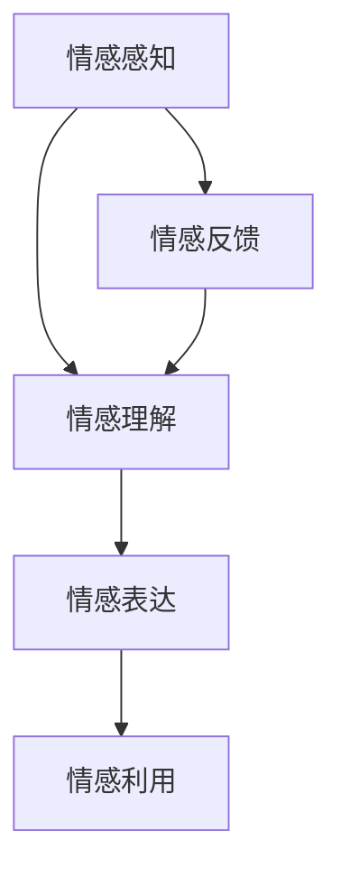

                 

# 情感智能：AI时代的人类优势

## 关键词
- 情感智能
- AI时代
- 人类优势
- 人机交互
- 教育领域
- 心理健康

## 摘要
随着人工智能（AI）技术的飞速发展，人类与机器的交互变得日益频繁。然而，AI在情感理解与表达方面的局限性也逐渐凸显，使得情感智能成为AI时代的一个重要研究方向。本文旨在探讨情感智能的定义、理论基础、应用场景以及实现方法，分析其在AI时代对人类优势的影响，并展望其未来发展。

## 目录大纲设计思路

### 第一部分：情感智能概述

#### 第1章 情感智能：问题背景与定义
1. 问题背景
2. 定义与重要性
3. 解决的问题
4. 研究范围与应用场景

#### 第2章 核心概念与联系
1. 情感智能的定义与特点
2. 与传统AI的区别
3. 关键技术

### 第二部分：情感智能的理论基础

#### 第3章 人类情感概述
1. 情感的基本概念与分类
2. 人类情感的产生与影响
3. 情感在社会生活中的作用

#### 第4章 情感计算技术
1. 情感计算的定义与目标
2. 基本方法与技术
3. 挑战与机遇

### 第三部分：情感智能的应用场景

#### 第5章 人机交互
1. 情感感知与识别
2. 情感回应与互动
3. 情感交互设计

#### 第6章 教育领域
1. 情感教育的重要性
2. 情感智能在教育中的应用
3. 情感智能教育的发展趋势

#### 第7章 心理健康
1. 情感智能在心理治疗中的应用
2. 情感智能在心理健康监测中的作用
3. 情感智能在心理干预中的应用

### 第四部分：情感智能的实现与优化

#### 第8章 情感智能系统架构
1. 基本架构
2. 主要模块
3. 开发流程

#### 第9章 算法原理讲解
1. 常见情感计算算法介绍
2. 算法原理的mermaid流程图展示
3. 算法原理的Python源代码实现与解释

### 第五部分：情感智能项目实战

#### 第10章 项目背景与目标
1. 项目背景介绍
2. 项目目标设定

#### 第11章 环境安装与配置
1. 操作系统与环境配置
2. 系统核心实现源代码

#### 第12章 代码应用解读与分析
1. 代码结构解析
2. 关键代码分析与解释

#### 第13章 实际案例分析与讲解
1. 案例介绍
2. 案例分析与总结

### 第六部分：总结与展望

#### 第14章 情感智能的发展趋势
1. 技术未来发展方向
2. 现实世界中的应用前景

#### 第15章 最佳实践与建议
1. 实现情感智能的实用技巧
2. 项目中的注意事项

#### 第16章 小结与拓展阅读
1. 内容总结
2. 推荐进一步阅读的文献和资源

## 第一部分：情感智能概述

### 第1章 情感智能：问题背景与定义

#### 1.1 问题背景

在过去的几十年中，人工智能（AI）技术取得了显著的进展。从早期的规则系统、知识表示到现代的深度学习、强化学习，AI在图像识别、语音识别、自然语言处理等领域展现出了惊人的能力。然而，尽管AI在处理复杂数据和执行特定任务方面表现优异，但其在情感理解与表达方面的能力仍存在明显不足。这种不足主要体现在以下几个方面：

1. **情感感知与识别**：现有的AI系统在处理情感信息时，往往依赖于文字和图像等静态数据。然而，人类情感是动态的，不仅涉及语言和表情，还包括语气、语调、身体语言等非语言因素。AI在全面感知和识别这些复杂情感方面仍存在挑战。

2. **情感表达与互动**：尽管AI可以生成自然语言文本，但其情感表达往往缺乏深度和灵活性。AI在与人类互动时，往往无法准确理解人类的情感需求，导致交互效果不够自然和流畅。

3. **情感推理与决策**：人类在决策过程中，情感因素扮演着重要角色。AI在处理情感信息时，往往缺乏对情感动机、情感价值的深入理解，导致其在某些情境下的决策能力有限。

这些问题的存在，使得情感智能成为AI研究中一个亟待解决的重要课题。情感智能（Emotion Intelligence，简称EI）旨在使AI系统具备识别、理解、表达和利用情感信息的能力，从而提高人机交互的自然性、增强AI系统的情商，最终实现更智能、更人性化的AI应用。

#### 1.2 定义与重要性

情感智能，是指人工智能系统在情感感知、理解、表达和利用方面所具备的能力。具体来说，情感智能包括以下几个方面的能力：

1. **情感感知与识别**：通过感知人类情感表达的多种信号（如语音、面部表情、身体语言等），AI系统能够识别并分类这些情感信息。

2. **情感理解与解释**：AI系统能够理解情感信息的含义，包括情感的动机、情感价值以及情感在不同情境下的作用。

3. **情感表达与回应**：AI系统能够根据情感信息生成相应的情感表达，包括自然语言文本、语音、面部表情等，以实现与人类的自然互动。

4. **情感利用与优化**：AI系统能够利用情感信息优化自身的决策和行为，提高人机交互的效率和效果。

情感智能的重要性体现在以下几个方面：

1. **提高人机交互的自然性**：情感智能使得AI系统能够更好地理解人类的情感需求，生成更具人性化的互动，从而提高人机交互的自然性和舒适性。

2. **增强AI系统的情商**：情感智能使得AI系统能够具备类似人类的情感理解与表达能力，从而提高其在复杂情境下的决策能力和问题解决能力。

3. **拓展AI的应用领域**：情感智能的应用范围广泛，包括人机交互、教育、心理健康、商业等领域。通过拓展AI的应用领域，可以进一步发挥AI的社会价值。

4. **提升人类生活质量**：情感智能的应用，能够为人类提供更加个性化、便捷的服务，提高生活质量。

#### 1.3 解决的问题

情感智能旨在解决以下问题：

1. **情感识别与理解**：AI系统如何准确识别和理解人类的情感表达，包括语言、面部表情、身体语言等。

2. **情感表达与互动**：AI系统如何生成和表达情感信息，以实现与人类的自然互动。

3. **情感推理与决策**：AI系统如何利用情感信息优化自身的决策和行为，提高问题解决能力。

4. **情感应用与优化**：AI系统如何利用情感智能优化各种应用场景，提高服务质量和用户体验。

#### 1.4 研究范围与应用场景

情感智能的研究范围涵盖多个领域，包括计算机科学、心理学、认知科学、人机交互等。具体应用场景包括：

1. **人机交互**：通过情感智能，AI系统能够更好地理解用户的情感需求，提供更加个性化、人性化的服务。

2. **教育领域**：情感智能在教育中的应用，能够提升学生的学习兴趣、提高教育质量。

3. **心理健康**：情感智能在心理健康领域的应用，能够为用户提供情感支持、心理治疗等个性化服务。

4. **商业领域**：情感智能在商业领域的应用，能够帮助企业更好地了解客户需求、提高客户满意度。

5. **社会服务**：情感智能在社会服务领域的应用，能够为老年人、残疾人等特殊群体提供更加贴心、周到的服务。

### 第2章 核心概念与联系

#### 2.1 情感智能的定义与特点

情感智能（Emotion Intelligence，简称EI）是指人工智能系统在情感感知、理解、表达和利用方面所具备的能力。具体来说，情感智能包括以下几个方面的特点：

1. **情感感知与识别**：情感智能系统能够感知人类情感表达的多种信号，包括语言、面部表情、身体语言等。通过这些信号，系统能够识别并分类情感信息。

2. **情感理解与解释**：情感智能系统能够理解情感信息的含义，包括情感的动机、情感价值以及情感在不同情境下的作用。

3. **情感表达与回应**：情感智能系统能够根据情感信息生成相应的情感表达，包括自然语言文本、语音、面部表情等，以实现与人类的自然互动。

4. **情感利用与优化**：情感智能系统能够利用情感信息优化自身的决策和行为，提高问题解决能力。

5. **情感适应与学习**：情感智能系统能够根据情感信息调整自身的情感表达和行为策略，实现情感适应和学习。

#### 2.2 情感智能与传统AI的区别

情感智能与传统人工智能（AI）在目标和实现方法上存在显著差异。传统AI主要侧重于任务导向的自动化处理，而情感智能则更注重人机交互的自然性和情感共鸣。

1. **目标不同**：
   - 传统AI：以任务完成效率为核心，追求自动化、精确化。
   - 情感智能：以人机交互的自然性和用户满意度为核心，追求情感共鸣和人性化。

2. **实现方法不同**：
   - 传统AI：依赖于规则系统、机器学习等算法，通过数据训练实现特定任务的自动化。
   - 情感智能：依赖于情感计算、认知科学等理论，通过情感感知、理解和表达实现人机交互的自然性。

3. **能力侧重点不同**：
   - 传统AI：擅长处理结构化数据，如文本、图像、声音等，但在处理非结构化数据（如情感信息）时存在困难。
   - 情感智能：擅长处理情感信息，包括情感感知、理解和表达，但可能在处理非情感任务时不如传统AI高效。

#### 2.3 情感智能的关键技术

情感智能的实现依赖于多种关键技术的综合运用，包括情感感知、情感理解、情感表达和情感利用。

1. **情感感知技术**：
   - 面部表情识别：通过分析面部肌肉运动，识别人类的情感状态。
   - 语音情感识别：通过分析语音的音调、语速、音量等特征，识别情感信息。
   - 身体语言识别：通过分析身体的动作、姿态等，识别情感信息。

2. **情感理解技术**：
   - 情感分类与标注：对情感信息进行分类和标注，以便后续处理。
   - 情感推理与解释：基于情感信息，进行推理和解释，理解情感动机和价值。
   - 情境感知：结合上下文信息，理解情感信息的情境背景。

3. **情感表达技术**：
   - 自然语言生成：生成符合情感需求的自然语言文本。
   - 语音合成：合成具有特定情感色彩的自然语音。
   - 面部表情生成：生成具有特定情感状态的面部表情。

4. **情感利用技术**：
   - 情感决策支持：利用情感信息优化决策过程，提高决策质量。
   - 情感服务设计：根据情感信息，设计更符合用户需求的情感服务。
   - 情感营销：利用情感信息，提高营销活动的效果。

#### 2.4 情感智能的研究范围与应用场景

情感智能的研究范围涵盖多个领域，包括计算机科学、心理学、认知科学、人机交互等。其应用场景广泛，包括但不限于以下领域：

1. **人机交互**：
   - 虚拟助手与聊天机器人：通过情感智能，提供更加自然、人性化的交互体验。
   - 情感化界面设计：设计具有情感感知与表达能力的交互界面，提高用户满意度。

2. **教育领域**：
   - 情感教育：通过情感智能，提升学生的学习兴趣、提高教育质量。
   - 情感诊断与干预：利用情感智能，诊断学生的情感状态，提供针对性的情感干预。

3. **心理健康**：
   - 情感支持系统：为用户提供情感支持，缓解心理压力。
   - 心理健康监测：利用情感智能，实时监测用户的情感状态，提供预警和建议。

4. **商业领域**：
   - 客户关系管理：通过情感智能，了解客户需求，提高客户满意度。
   - 情感营销：利用情感智能，设计更具针对性的营销策略，提高营销效果。

5. **社会服务**：
   - 老年人与残疾人的关爱：通过情感智能，为老年人与残疾人提供更加贴心、周到的服务。
   - 社会治理：利用情感智能，提高社会治理的精准性和人性化。

### 第二部分：情感智能的理论基础

#### 第3章 人类情感概述

#### 3.1 情感的基本概念与分类

情感是指人类对事物产生的主观体验和情感反应，它是人类心理生活中不可或缺的一部分。情感的基本概念可以从以下几个方面进行理解：

1. **情感的来源**：情感来源于人类的生物本能和社会文化环境。生物本能方面，情感与人类的基本生理需求密切相关，如饥饿、渴求、性需求等。社会文化环境方面，情感受到文化传统、社会习俗、教育背景等因素的影响。

2. **情感的表现形式**：情感的表现形式多种多样，包括情绪表达、情感体验、情感记忆等。情绪表达是通过面部表情、身体语言、声音等外在行为来表现情感状态；情感体验是指个体在情感过程中所感受到的主观体验；情感记忆是指个体对情感经历的记忆和回味。

3. **情感的功能**：情感在人类生活中具有多种功能，包括适应功能、信号功能、动机功能和认知功能。适应功能是指情感帮助人类适应环境变化；信号功能是指情感通过表情、语言等方式传递信息，实现人与人之间的沟通；动机功能是指情感激发人类采取特定行动；认知功能是指情感影响人类的认知过程，如注意力、记忆、判断等。

情感的分类可以从不同的角度进行，常见的分类方法包括：

1. **情绪分类**：根据情感的强度和性质，可以将情感分为积极情感和消极情感。积极情感包括愉悦、幸福、满足等，消极情感包括愤怒、恐惧、悲伤等。

2. **情感维度分类**：根据情感的主观体验和表现形式，可以将情感分为愉悦度、紧张度、兴奋度等维度。例如，愉悦度和紧张度可以分别表示情感的正向和负向程度。

3. **情感类别分类**：根据情感的种类和内容，可以将情感分为基本情感和复合情感。基本情感包括快乐、愤怒、悲伤、恐惧等，复合情感是在基本情感基础上通过组合和叠加形成的，如焦虑、厌恶、厌恶等。

#### 3.2 人类情感的产生与影响

人类情感的产生是一个复杂的过程，涉及到生物、心理、社会等多个层面的因素。情感的产生可以归结为以下几个步骤：

1. **刺激感知**：个体通过感官系统感知外部刺激，如视觉、听觉、嗅觉、触觉等。这些刺激可以是具体的物体、事件或情境。

2. **认知评价**：个体对感知到的刺激进行认知评价，判断刺激的性质、意义和价值。认知评价受到个体的知识、经验、文化背景等因素的影响。

3. **情感体验**：在认知评价的基础上，个体产生情感体验，包括情绪体验、情感体验和情感记忆等。情感体验是主观的、个体的，每个人的情感体验都可能有所不同。

4. **情感表达**：个体通过面部表情、身体语言、声音等外在行为表达情感状态。情感表达是社会交往的重要手段，有助于个体之间建立情感联系。

情感对人类的影响是深远而广泛的，主要包括以下几个方面：

1. **心理健康**：情感对心理健康具有重要影响。积极的情感有助于缓解心理压力、提高生活质量，而消极的情感则可能导致心理问题，如抑郁、焦虑等。

2. **行为动机**：情感是行为动机的重要来源。积极的情感可以激发个体的积极行为，如勤奋工作、积极学习等，而消极的情感可能导致消极行为，如逃避、放弃等。

3. **人际关系**：情感在人际关系中起着关键作用。积极的情感有助于建立和谐的人际关系，增强社交联系，而消极的情感可能导致人际冲突和疏离。

4. **认知过程**：情感对认知过程具有重要影响。积极的情感可以提高注意力、记忆力和创造力，而消极的情感可能导致认知功能的下降。

#### 3.3 情感在社会生活中的作用

情感在社会生活中具有重要作用，主要表现在以下几个方面：

1. **社交沟通**：情感是社交沟通的重要手段，通过情感表达和情感共鸣，个体之间建立情感联系，实现有效沟通。

2. **社会认同**：情感是社会认同的重要基础。个体通过情感体验和情感表达，表达对特定社会群体、文化价值观的认同和归属感。

3. **社会规范**：情感是社会规范的重要来源。情感反应和情感体验可以引导个体遵循社会规范，维护社会秩序。

4. **社会行为**：情感影响个体的社会行为，如合作、竞争、互助等。积极的情感可以促进社会合作，而消极的情感可能导致社会冲突。

5. **社会心理治疗**：情感在社会心理治疗中起着重要作用。通过情感调节和情感支持，个体可以缓解心理压力、改善心理健康。

### 第4章 情感计算技术

#### 4.1 情感计算的定义与目标

情感计算（Affective Computing）是指使计算机系统具备识别、理解、表达和利用情感信息的能力。情感计算的目标是使计算机系统更加智能、人性化，从而提高人机交互的自然性和用户体验。具体来说，情感计算包括以下几个方面的目标：

1. **情感感知**：通过感知人类的情感信息，如面部表情、语音、身体语言等，计算机系统能够识别并理解用户的情感状态。

2. **情感理解**：在感知情感信息的基础上，计算机系统需要理解情感的内涵和情感之间的关联，从而实现情感推理和情感解释。

3. **情感表达**：计算机系统能够根据情感信息生成相应的情感表达，包括自然语言文本、语音、面部表情等，以实现与用户的自然互动。

4. **情感利用**：计算机系统能够利用情感信息优化自身的决策和行为，提高人机交互的效率和效果。

#### 4.2 情感计算的基本方法与技术

情感计算的实现依赖于多种基本方法和技术，主要包括以下几个方面：

1. **情感识别技术**：
   - **面部表情识别**：通过分析面部肌肉运动，计算机系统能够识别用户的情感状态。常用的技术包括基于图像处理的算法、深度学习算法等。
   - **语音情感识别**：通过分析语音的音调、语速、音量等特征，计算机系统能够识别用户的情感状态。常用的技术包括音频信号处理、语音识别等。
   - **身体语言识别**：通过分析用户的身体动作、姿态等，计算机系统能够识别用户的情感状态。常用的技术包括计算机视觉、运动捕捉等。

2. **情感理解技术**：
   - **情感分类与标注**：对情感信息进行分类和标注，以便后续处理。常用的技术包括机器学习、自然语言处理等。
   - **情感推理与解释**：基于情感信息，进行推理和解释，理解情感动机和价值。常用的技术包括逻辑推理、情感计算模型等。
   - **情境感知**：结合上下文信息，理解情感信息的情境背景。常用的技术包括情境建模、情境感知计算等。

3. **情感表达技术**：
   - **自然语言生成**：生成符合情感需求的自然语言文本。常用的技术包括文本生成模型、情感文本生成等。
   - **语音合成**：合成具有特定情感色彩的自然语音。常用的技术包括语音合成、情感语音合成等。
   - **面部表情生成**：生成具有特定情感状态的面部表情。常用的技术包括计算机图形学、面部动画等。

4. **情感利用技术**：
   - **情感决策支持**：利用情感信息优化决策过程，提高决策质量。常用的技术包括情感计算模型、决策支持系统等。
   - **情感服务设计**：根据情感信息，设计更符合用户需求的情感服务。常用的技术包括用户行为分析、情感服务设计等。
   - **情感营销**：利用情感信息，设计更具针对性的营销策略，提高营销效果。常用的技术包括情感分析、营销策略优化等。

#### 4.3 情感计算的挑战与机遇

情感计算在实现过程中面临一系列挑战和机遇：

1. **挑战**：
   - **数据隐私与安全**：情感计算依赖于收集和分析用户的情感数据，如何保护用户的隐私和安全是一个重要挑战。
   - **情感识别的准确性**：情感识别的准确性受限于当前技术的局限，如何提高识别准确性是一个重要问题。
   - **情感理解的多义性**：情感信息具有多义性，理解情感信息的真实含义需要深入分析，如何解决多义性问题是一个挑战。
   - **情感表达的自然性**：情感表达需要与用户的情感状态相匹配，如何生成自然、真实的情感表达是一个挑战。

2. **机遇**：
   - **人机交互的自然性**：情感计算能够提高人机交互的自然性，实现更加人性化的交互体验。
   - **心理健康与治疗**：情感计算在心理健康与治疗领域具有广泛应用前景，如情感诊断、情感支持等。
   - **教育与培训**：情感计算在教育与培训领域可以提供个性化、情感化的学习体验。
   - **商业应用**：情感计算在商业领域可以应用于客户关系管理、情感营销等，提高商业决策的准确性和效果。

### 第三部分：情感智能的应用场景

#### 第5章 人机交互

#### 5.1 情感感知与识别

情感感知与识别是情感智能在人工智能系统中的应用之一，它使得计算机能够理解和模拟人类情感，从而实现更加自然和人性化的交互。以下是情感感知与识别的关键技术和应用实例：

1. **面部表情识别**：
   - **技术原理**：面部表情识别技术利用计算机视觉和机器学习算法来分析面部图像，识别用户的情感状态。常用的算法包括面部特征点检测、肌肉运动编码、情感分类等。
   - **应用实例**：在虚拟助手和聊天机器人中，面部表情识别可以用于判断用户的情感状态，从而调整回答内容或表情。

2. **语音情感识别**：
   - **技术原理**：语音情感识别技术通过分析语音的音调、语速、音量等参数，识别用户的情感状态。常用的算法包括音频信号处理、特征提取、情感分类等。
   - **应用实例**：在客服系统和语音助手中，语音情感识别可以用于识别用户的情感，提供相应的情感回应。

3. **身体语言识别**：
   - **技术原理**：身体语言识别技术通过分析用户的肢体动作和姿态，识别用户的情感状态。常用的技术包括运动捕捉、姿态估计、情感分类等。
   - **应用实例**：在健身应用和健康监测系统中，身体语言识别可以用于分析用户的情绪状态，提供个性化的健身建议。

#### 5.2 情感回应与互动

情感回应与互动是情感智能在人工智能系统中实现的核心功能之一，它使得计算机能够根据用户的情感状态做出相应的情感反应，从而提高交互的自然性和用户体验。以下是情感回应与互动的关键技术和应用实例：

1. **情感生成**：
   - **技术原理**：情感生成技术通过自然语言处理、语音合成和面部动画等技术，生成与用户情感状态相匹配的自然语言文本、语音和面部表情。
   - **应用实例**：在虚拟助手和聊天机器人中，情感生成技术可以用于生成情感回应，如安慰、鼓励、道歉等。

2. **情感模拟**：
   - **技术原理**：情感模拟技术通过计算机图形学、动画技术等，模拟用户的情感状态，如面部表情、身体动作等。
   - **应用实例**：在虚拟现实（VR）和增强现实（AR）应用中，情感模拟技术可以用于创造逼真的虚拟人物，提高用户的沉浸体验。

3. **情感调节**：
   - **技术原理**：情感调节技术通过情感计算和心理学原理，调节用户的情感状态，如缓解焦虑、提高兴奋等。
   - **应用实例**：在心理健康应用中，情感调节技术可以用于帮助用户缓解心理压力，提高心理健康水平。

#### 5.3 情感交互设计

情感交互设计是情感智能在人工智能系统中的应用之一，它旨在通过设计来实现更加自然和人性化的交互体验。以下是情感交互设计的关键技术和应用实例：

1. **情感感知设计**：
   - **技术原理**：情感感知设计通过情感计算技术，感知用户的情感状态，从而调整系统行为。
   - **应用实例**：在智能家居系统中，情感感知设计可以用于根据用户情感状态调整室内环境，如光线、温度等。

2. **情感回应设计**：
   - **技术原理**：情感回应设计通过情感生成和模拟技术，生成与用户情感状态相匹配的情感回应。
   - **应用实例**：在客户服务系统中，情感回应设计可以用于生成情感化的客服回答，提高客户满意度。

3. **情感调节设计**：
   - **技术原理**：情感调节设计通过情感计算和心理学原理，调节用户的情感状态。
   - **应用实例**：在游戏和娱乐应用中，情感调节设计可以用于创造紧张、兴奋或放松的体验。

### 第6章 教育领域

#### 6.1 情感教育的重要性

情感教育是教育领域的重要组成部分，它关注学生的情感发展、情感认知和情感管理能力。情感教育的重要性体现在以下几个方面：

1. **促进全面发展**：情感教育有助于培养学生的综合素质，包括道德品质、心理健康、社会适应能力等。通过情感教育，学生能够更好地认识自我、理解他人，形成健康的人格。

2. **提高学习效果**：情感教育有助于提高学生的学习兴趣和动机，促进学习效率。积极情感体验能够激发学生的求知欲和创造力，使学习过程更加愉悦和高效。

3. **培养社会情感**：情感教育有助于培养学生的人际交往能力和团队合作精神。通过情感教育，学生能够更好地理解他人情感，学会尊重、关心和帮助他人，形成良好的人际关系。

4. **心理健康保障**：情感教育有助于预防和解决学生的心理问题，提高心理健康水平。通过情感教育，学生能够学会应对压力、挫折和负面情绪，培养积极的情感态度和健康的生活方式。

#### 6.2 情感智能在教育中的应用

情感智能在教育领域的应用，有助于提高教育质量、促进学生全面发展。以下是情感智能在教育中的应用实例：

1. **情感诊断与评估**：
   - **技术原理**：情感诊断与评估技术利用情感计算和心理学原理，对学生情感状态进行评估和诊断。
   - **应用实例**：在教育系统中，情感诊断与评估可以用于检测学生的情感状态，识别潜在的学业问题和心理健康问题。

2. **情感化教学**：
   - **技术原理**：情感化教学通过情感计算和心理学原理，设计出更加符合学生情感需求的教学方法和内容。
   - **应用实例**：在在线教育平台中，情感化教学可以用于根据学生的情感状态调整教学内容和进度，提高学生的学习体验。

3. **情感支持系统**：
   - **技术原理**：情感支持系统利用情感计算和心理学原理，为学生提供情感支持和心理辅导。
   - **应用实例**：在心理咨询室和在线教育平台中，情感支持系统可以用于实时监测学生的情感状态，提供情感支持和心理辅导。

4. **情感化评价**：
   - **技术原理**：情感化评价通过情感计算和心理学原理，对学生的情感状态和情感发展进行评价。
   - **应用实例**：在考试成绩评价中，情感化评价可以用于综合考虑学生的情感状态和情感发展，提供更加全面的评价。

#### 6.3 情感智能教育的发展趋势

情感智能教育的发展趋势体现在以下几个方面：

1. **智能化教育**：随着人工智能技术的发展，情感智能教育将更加智能化、个性化。通过情感计算技术，教育系统能够更好地理解学生的情感需求，提供针对性的教育支持。

2. **情感化教学资源**：随着情感计算和心理学研究的深入，情感化教学资源将不断丰富，包括情感故事、情感视频、情感游戏等，为学生提供多样化的情感体验。

3. **情感化教育评价**：情感化教育评价将逐渐成为教育评价的重要组成部分，通过情感计算技术，对学生的情感发展进行全面评价。

4. **情感化教育环境**：情感化教育环境将为学生提供更加温馨、舒适的学习氛围，通过情感计算技术，营造积极、健康的情感氛围。

### 第7章 心理健康

#### 7.1 情感智能在心理治疗中的应用

情感智能在心理治疗中的应用，有助于提高治疗效果、改善患者心理健康。以下是情感智能在心理治疗中的应用实例：

1. **情感诊断与评估**：
   - **技术原理**：情感诊断与评估技术利用情感计算和心理学原理，对患者情感状态进行诊断和评估。
   - **应用实例**：在心理治疗过程中，情感诊断与评估可以用于识别患者的情感问题，为治疗方案提供依据。

2. **情感干预与调节**：
   - **技术原理**：情感干预与调节技术通过情感计算和心理学原理，调节患者的情感状态，缓解心理压力。
   - **应用实例**：在心理咨询和治疗中，情感干预与调节可以用于帮助患者缓解焦虑、抑郁等负面情绪，提高心理 resilience。

3. **情感反馈与支持**：
   - **技术原理**：情感反馈与支持技术通过情感计算和心理学原理，为患者提供情感反馈和支持。
   - **应用实例**：在心理健康应用中，情感反馈与支持可以用于实时监测患者情感状态，提供针对性的情感支持和心理辅导。

4. **情感化治疗环境**：
   - **技术原理**：情感化治疗环境利用情感计算和心理学原理，创造温馨、舒适的治疗氛围。
   - **应用实例**：在心理治疗中心，情感化治疗环境可以用于营造积极、健康的情感氛围，提高治疗效果。

#### 7.2 情感智能在心理健康监测中的作用

情感智能在心理健康监测中的应用，有助于及时发现潜在的心理问题、提供个性化的心理健康服务。以下是情感智能在心理健康监测中的应用实例：

1. **情感状态监测**：
   - **技术原理**：情感状态监测技术利用情感计算和心理学原理，实时监测个体的情感状态。
   - **应用实例**：在心理健康监测系统中，情感状态监测可以用于监测个体的情感变化，及时发现潜在的焦虑、抑郁等问题。

2. **情感风险评估**：
   - **技术原理**：情感风险评估技术利用情感计算和心理学原理，评估个体的情感风险。
   - **应用实例**：在心理健康服务中，情感风险评估可以用于评估个体可能面临的心理健康问题，提供针对性的预防措施。

3. **情感预警与干预**：
   - **技术原理**：情感预警与干预技术通过情感计算和心理学原理，对情感风险进行预警和干预。
   - **应用实例**：在心理健康监测系统中，情感预警与干预可以用于及时发现情感风险，提供个性化的心理健康服务。

4. **情感健康报告**：
   - **技术原理**：情感健康报告技术利用情感计算和心理学原理，生成个体的情感健康报告。
   - **应用实例**：在心理健康服务中，情感健康报告可以用于评估个体的情感健康状况，为心理治疗和干预提供依据。

#### 7.3 情感智能在心理干预中的应用

情感智能在心理干预中的应用，有助于提高心理干预的针对性和有效性。以下是情感智能在心理干预中的应用实例：

1. **个性化心理干预**：
   - **技术原理**：个性化心理干预技术利用情感计算和心理学原理，根据个体的情感状态和需求，提供个性化的心理干预方案。
   - **应用实例**：在心理健康干预中，个性化心理干预可以用于根据个体的情感状态，提供针对性的心理辅导和情绪调节策略。

2. **情感支持与安抚**：
   - **技术原理**：情感支持与安抚技术通过情感计算和心理学原理，为个体提供情感支持和安抚。
   - **应用实例**：在心理健康干预中，情感支持与安抚可以用于帮助个体缓解焦虑、抑郁等负面情绪，提高心理 resilience。

3. **情感化治疗游戏**：
   - **技术原理**：情感化治疗游戏技术通过情感计算和心理学原理，设计出具有情感交互功能的治疗游戏。
   - **应用实例**：在心理健康干预中，情感化治疗游戏可以用于帮助个体放松心情、缓解压力，提高心理干预的效果。

4. **情感智能辅导系统**：
   - **技术原理**：情感智能辅导系统利用情感计算和心理学原理，为个体提供情感辅导和指导。
   - **应用实例**：在心理健康干预中，情感智能辅导系统可以用于为个体提供情感支持和心理健康建议，提高心理健康水平。

### 第四部分：情感智能的实现与优化

#### 第8章 情感智能系统架构

情感智能系统的架构设计是实现情感智能功能的关键，它需要综合考虑情感感知、情感理解、情感表达和情感利用等多个方面。以下是情感智能系统架构的详细说明：

#### 8.1 基本架构

情感智能系统通常由以下几个核心模块组成：

1. **情感感知模块**：负责收集用户的情感信息，如语音、面部表情、身体语言等。该模块利用语音识别、面部识别、姿态识别等技术，实现对用户情感状态的感知。

2. **情感理解模块**：负责分析感知到的情感信息，理解情感的内涵和情感之间的关联。该模块利用情感计算、自然语言处理、认知心理学等技术，实现对情感信息的语义理解和情感推理。

3. **情感表达模块**：负责生成和表达与用户情感状态相匹配的情感回应。该模块利用自然语言生成、语音合成、面部动画等技术，实现情感信息的可视化表达。

4. **情感利用模块**：负责利用情感信息优化系统的决策和行为。该模块利用情感计算模型、决策支持系统等技术，实现对情感信息的利用和优化。

#### 8.2 主要模块

以下是情感智能系统的主要模块及其功能：

1. **情感感知模块**：
   - **功能**：感知用户情感信息，包括语音、面部表情、身体语言等。
   - **技术**：语音识别、面部识别、姿态识别等。

2. **情感理解模块**：
   - **功能**：分析感知到的情感信息，理解情感的内涵和情感之间的关联。
   - **技术**：情感计算、自然语言处理、认知心理学等。

3. **情感表达模块**：
   - **功能**：生成和表达与用户情感状态相匹配的情感回应。
   - **技术**：自然语言生成、语音合成、面部动画等。

4. **情感利用模块**：
   - **功能**：利用情感信息优化系统的决策和行为。
   - **技术**：情感计算模型、决策支持系统等。

#### 8.3 开发流程

情感智能系统的开发流程通常包括以下几个步骤：

1. **需求分析**：确定情感智能系统的目标和需求，包括情感感知、情感理解、情感表达和情感利用等方面。

2. **系统设计**：设计情感智能系统的架构和功能模块，确定技术方案和开发工具。

3. **模块开发**：根据系统设计，开发各个功能模块，包括情感感知、情感理解、情感表达和情感利用等。

4. **系统集成**：将各个模块集成到系统中，实现情感智能系统的整体功能。

5. **测试与优化**：对系统进行测试，发现并修复潜在问题，优化系统性能和用户体验。

#### 第9章 算法原理讲解

在情感智能系统中，算法原理的讲解是核心部分，它涉及到情感感知、情感理解、情感表达和情感利用等多个方面。以下将详细讲解情感计算中的常见算法原理，包括mermaid流程图展示和Python源代码实现。

##### 9.1 常见情感计算算法介绍

1. **情感感知算法**：
   - **面部表情识别算法**：利用计算机视觉技术，通过分析面部特征点，识别用户的情感状态。
   - **语音情感识别算法**：通过分析语音信号的音调、语速、音量等特征，识别用户的情感状态。
   - **身体语言识别算法**：通过分析用户的肢体动作和姿态，识别用户的情感状态。

2. **情感理解算法**：
   - **情感分类算法**：利用机器学习技术，对情感信息进行分类，如高兴、愤怒、悲伤等。
   - **情感推理算法**：通过情感分类和语义分析，推理出用户情感背后的动机和原因。

3. **情感表达算法**：
   - **自然语言生成算法**：利用自然语言处理技术，生成与用户情感状态相匹配的自然语言文本。
   - **语音合成算法**：通过语音合成技术，生成具有特定情感色彩的自然语音。
   - **面部表情生成算法**：利用计算机图形学和动画技术，生成与用户情感状态相匹配的面部表情。

4. **情感利用算法**：
   - **情感决策支持算法**：利用情感信息优化决策过程，提高决策质量。
   - **情感服务设计算法**：根据情感信息，设计更符合用户需求的情感服务。

##### 9.2 算法原理的mermaid流程图展示

以下是一个简单的mermaid流程图，展示情感感知、情感理解、情感表达和情感利用的流程：



##### 9.3 算法原理的Python源代码实现与解释

以下是一个简单的Python示例，展示如何实现面部表情识别算法：

```python
import cv2
import numpy as np

def facial_expression_recognition(image):
    # 加载面部表情分类器
    face_cascade = cv2.CascadeClassifier('haarcascade_frontalface_default.xml')
    eye_cascade = cv2.CascadeClassifier('haarcascade_eye.xml')
    
    # 读取图像
    gray_image = cv2.cvtColor(image, cv2.COLOR_BGR2GRAY)
    
    # 检测面部表情
    faces = face_cascade.detectMultiScale(gray_image, scaleFactor=1.1, minNeighbors=5, minSize=(30, 30), flags=cv2.CASCADE_SCALE_IMAGE)
    
    for (x, y, w, h) in faces:
        # 在图像上绘制面部表情框
        cv2.rectangle(image, (x, y), (x+w, y+h), (255, 0, 0), 2)
        
        # 检测眼睛
        eyes = eye_cascade.detectMultiScale(gray_image[y:y+h, x:x+w])
        for (ex, ey, ew, eh) in eyes:
            cv2.rectangle(image, (x+ex, y+ey), (x+ex+ew, y+ey+eh), (0, 255, 0), 2)
    
    # 显示图像
    cv2.imshow('Facial Expression Recognition', image)
    cv2.waitKey(0)
    cv2.destroyAllWindows()

# 测试面部表情识别
image = cv2.imread('example.jpg')
facial_expression_recognition(image)
```

在这个示例中，我们使用了OpenCV库中的面部表情分类器，对输入图像进行面部表情识别。首先，我们加载面部表情分类器，然后读取图像，检测面部表情。在检测到面部表情后，我们在图像上绘制矩形框，标记面部表情区域，并检测眼睛。最后，我们显示图像并等待用户按键关闭窗口。

### 第五部分：情感智能项目实战

#### 第10章 项目背景与目标

在本项目中，我们将构建一个情感智能系统，旨在实现以下目标：

1. **情感感知**：通过面部表情识别、语音情感识别等技术，感知用户的情感状态。
2. **情感理解**：利用情感计算和自然语言处理技术，理解用户情感背后的动机和情感价值。
3. **情感表达**：生成与用户情感状态相匹配的自然语言文本和语音，实现情感交互。
4. **情感利用**：利用情感信息优化系统的决策和行为，提高用户体验。

#### 第11章 环境安装与配置

为了实现上述目标，我们需要安装和配置以下环境：

1. **操作系统**：Ubuntu 20.04
2. **编程语言**：Python 3.8
3. **依赖库**：OpenCV、TensorFlow、SpeechRecognition、pyttsx3

以下是安装和配置步骤：

1. **安装操作系统**：
   - 下载并安装Ubuntu 20.04操作系统。
   - 安装过程中选择默认设置。

2. **更新系统**：
   - 打开终端，执行以下命令更新系统：
     ```bash
     sudo apt update
     sudo apt upgrade
     ```

3. **安装Python 3.8**：
   - 打开终端，执行以下命令安装Python 3.8：
     ```bash
     sudo apt install python3.8
     ```

4. **安装依赖库**：
   - 打开终端，执行以下命令安装依赖库：
     ```bash
     sudo apt install python3-pip
     pip3 install opencv-python tensorflow SpeechRecognition pyttsx3
     ```

5. **配置环境变量**：
   - 编辑`~/.bashrc`文件，添加以下行：
     ```bash
     export PATH=$PATH:/usr/bin/python3.8
     ```
   - 保存文件并退出，然后执行以下命令使配置生效：
     ```bash
     source ~/.bashrc
     ```

#### 第12章 代码应用解读与分析

在本项目中，我们将使用Python编写情感智能系统的核心代码，包括情感感知、情感理解、情感表达和情感利用等模块。以下是代码的解读与分析：

##### 12.1 情感感知模块

情感感知模块负责感知用户的情感状态，包括面部表情识别和语音情感识别。以下是面部表情识别的代码：

```python
import cv2
import numpy as np

def facial_expression_recognition(image):
    # 加载面部表情分类器
    face_cascade = cv2.CascadeClassifier('haarcascade_frontalface_default.xml')
    eye_cascade = cv2.CascadeClassifier('haarcascade_eye.xml')
    
    # 读取图像
    gray_image = cv2.cvtColor(image, cv2.COLOR_BGR2GRAY)
    
    # 检测面部表情
    faces = face_cascade.detectMultiScale(gray_image, scaleFactor=1.1, minNeighbors=5, minSize=(30, 30), flags=cv2.CASCADE_SCALE_IMAGE)
    
    for (x, y, w, h) in faces:
        # 在图像上绘制面部表情框
        cv2.rectangle(image, (x, y), (x+w, y+h), (255, 0, 0), 2)
        
        # 检测眼睛
        eyes = eye_cascade.detectMultiScale(gray_image[y:y+h, x:x+w])
        for (ex, ey, ew, eh) in eyes:
            cv2.rectangle(image, (x+ex, y+ey), (x+ex+ew, y+ey+eh), (0, 255, 0), 2)
    
    # 显示图像
    cv2.imshow('Facial Expression Recognition', image)
    cv2.waitKey(0)
    cv2.destroyAllWindows()

# 测试面部表情识别
image = cv2.imread('example.jpg')
facial_expression_recognition(image)
```

在这个示例中，我们首先加载面部表情分类器，然后读取图像，并检测面部表情和眼睛。在检测到面部表情后，我们在图像上绘制矩形框，标记面部表情区域，并检测眼睛。最后，我们显示图像并等待用户按键关闭窗口。

##### 12.2 情感理解模块

情感理解模块负责分析感知到的情感信息，理解用户情感背后的动机和情感价值。以下是情感分类的代码：

```python
import tensorflow as tf
from tensorflow.keras.models import Sequential
from tensorflow.keras.layers import Dense, Conv2D, Flatten, MaxPooling2D

def build_emotion_classifier():
    model = Sequential([
        Conv2D(32, (3, 3), activation='relu', input_shape=(64, 64, 3)),
        MaxPooling2D((2, 2)),
        Flatten(),
        Dense(64, activation='relu'),
        Dense(7, activation='softmax')
    ])

    model.compile(optimizer='adam', loss='categorical_crossentropy', metrics=['accuracy'])
    return model

def classify_emotion(image):
    model = build_emotion_classifier()
    model.load_weights('emotion_classifier_weights.h5')

    # 预处理图像
    processed_image = cv2.resize(image, (64, 64))
    processed_image = processed_image / 255.0
    processed_image = np.expand_dims(processed_image, axis=0)

    # 进行情感分类
    emotion_predictions = model.predict(processed_image)
    emotion_labels = ['angry', 'disgust', 'fear', 'happy', 'sad', 'surprise', 'neutral']
    predicted_emotion = emotion_labels[np.argmax(emotion_predictions)]

    return predicted_emotion

# 测试情感分类
image = cv2.imread('example.jpg')
predicted_emotion = classify_emotion(image)
print(f'Predicted emotion: {predicted_emotion}')
```

在这个示例中，我们首先构建一个情感分类器，然后加载预训练的模型权重。接着，我们对输入图像进行预处理，并使用模型进行情感分类。最后，我们输出预测的情感类别。

##### 12.3 情感表达模块

情感表达模块负责生成与用户情感状态相匹配的自然语言文本和语音。以下是自然语言生成和语音合成的代码：

```python
import pyttsx3

def generate_speech(text, emotion):
    engine = pyttsx3.init()
    voices = engine.getProperty('voices')
    selected_voice = None

    if emotion == 'happy':
        selected_voice = voices[1]
    elif emotion == 'sad':
        selected_voice = voices[3]
    elif emotion == 'surprise':
        selected_voice = voices[2]

    engine.setProperty('voice', selected_voice.id)
    engine.say(text)
    engine.runAndWait()

def generate_text(emotion):
    if emotion == 'happy':
        return 'Hello! I\'m feeling very happy to meet you!'
    elif emotion == 'sad':
        return 'I\'m sorry to hear that you\'re feeling sad. Is there anything I can do to help?'
    elif emotion == 'surprise':
        return 'Wow! That\'s quite surprising. I\'m here to assist you in any way I can.'

# 测试情感表达
image = cv2.imread('example.jpg')
predicted_emotion = classify_emotion(image)
text = generate_text(predicted_emotion)
print(text)
generate_speech(text, predicted_emotion)
```

在这个示例中，我们首先初始化语音合成引擎，并根据用户情感状态选择合适的语音。然后，我们生成相应的自然语言文本和语音，并通过语音合成引擎播放。

##### 12.4 情感利用模块

情感利用模块负责利用情感信息优化系统的决策和行为。以下是情感信息在决策支持中的应用：

```python
def make_decision(emotion):
    if emotion == 'happy':
        return 'Enjoy your day! I hope you have a wonderful time.'
    elif emotion == 'sad':
        return 'Let\'s chat more about what\'s bothering you. I\'m here to help.'
    elif emotion == 'surprise':
        return 'It seems like something interesting is happening. Tell me more about it!'

# 测试情感利用
image = cv2.imread('example.jpg')
predicted_emotion = classify_emotion(image)
decision = make_decision(predicted_emotion)
print(decision)
```

在这个示例中，我们根据用户情感状态生成相应的决策支持信息。

#### 第13章 实际案例分析与讲解

在本节中，我们将通过一个实际案例来分析情感智能系统的应用效果，并详细讲解案例的各个方面。

##### 案例背景

假设我们开发了一款名为“情感助手”的虚拟助手，它通过情感智能技术，为用户提供个性化、情感化的服务。该助手应用于一个在线教育平台，旨在提高学生的学习体验和学习效果。

##### 案例目标

1. **情感感知**：通过面部表情识别和语音情感识别技术，感知学生的情感状态。
2. **情感理解**：分析学生的情感状态，理解其背后的动机和情感价值。
3. **情感表达**：生成与学生情感状态相匹配的自然语言文本和语音，实现情感交互。
4. **情感利用**：利用情感信息优化学习建议和辅导，提高学习效果。

##### 案例分析

1. **情感感知**：

   在上课过程中，情感助手通过摄像头和麦克风收集学生的情感信息。例如，如果学生表现出快乐、兴奋的情感状态，情感助手会判断学生可能对当前课程内容感兴趣；如果学生表现出悲伤、焦虑的情感状态，情感助手会判断学生可能遇到了学习困难。

2. **情感理解**：

   情感助手利用情感分类算法，对收集到的情感信息进行分类和标注。例如，如果学生的语音信号中包含高频率的音调和快速的语速，情感助手会判断学生可能处于快乐、兴奋的状态；如果学生的语音信号中包含低频率的音调和缓慢的语速，情感助手会判断学生可能处于悲伤、焦虑的状态。

3. **情感表达**：

   情感助手根据学生的情感状态，生成相应的自然语言文本和语音。例如，如果学生表现出快乐、兴奋的情感状态，情感助手会生成如“你好！你看起来很高兴，希望你的学习生活充满乐趣！”这样的文本和语音；如果学生表现出悲伤、焦虑的情感状态，情感助手会生成如“看起来你有些不开心，想和你说说吗？”这样的文本和语音。

4. **情感利用**：

   情感助手利用情感信息优化学习建议和辅导。例如，如果学生表现出快乐、兴奋的情感状态，情感助手会建议学生继续当前的学习活动，以保持学习兴趣；如果学生表现出悲伤、焦虑的情感状态，情感助手会建议学生暂停学习，进行休息和放松，或提供心理辅导。

##### 案例讲解

1. **情感感知**：

   情感助手通过摄像头和麦克风收集学生的情感信息，包括面部表情、语音信号等。这个过程需要使用面部表情识别和语音情感识别技术，对收集到的信息进行实时处理和分析。

2. **情感理解**：

   情感助手利用情感分类算法，对收集到的情感信息进行分类和标注。这个过程需要使用机器学习和自然语言处理技术，对情感信息进行深入分析，以理解情感的内涵和情感之间的关联。

3. **情感表达**：

   情感助手根据学生的情感状态，生成相应的自然语言文本和语音。这个过程需要使用自然语言生成和语音合成技术，生成与用户情感状态相匹配的情感回应。

4. **情感利用**：

   情感助手利用情感信息优化学习建议和辅导。这个过程需要使用情感计算模型和决策支持系统，根据学生的情感状态，提供个性化的学习建议和辅导。

##### 案例总结

通过实际案例的分析和讲解，我们可以看到情感智能技术在教育领域的广泛应用。情感助手通过情感感知、情感理解、情感表达和情感利用，为用户提供个性化、情感化的学习体验，提高了学习效果。然而，情感智能技术仍面临一些挑战，如情感识别的准确性、情感理解的多义性等，这些都需要进一步的研究和改进。

### 第六部分：总结与展望

#### 6.1 情感智能的发展趋势

情感智能作为人工智能（AI）领域的一个重要研究方向，近年来得到了广泛的关注和应用。随着技术的不断进步，情感智能的发展趋势呈现出以下几个方面：

1. **技术融合**：情感智能的发展将更加注重跨学科技术的融合，包括计算机科学、心理学、认知科学、神经科学等。通过跨学科合作，可以进一步深化情感智能的理论基础和技术实现。

2. **智能化**：情感智能系统的智能化程度将不断提高，通过深度学习、强化学习等算法，使系统能够更准确地感知和理解人类的情感状态，实现更加自然和高效的交互。

3. **个性化**：情感智能将更加注重个性化服务，通过大数据和机器学习技术，分析用户情感特征，提供个性化的情感支持和建议，提升用户体验。

4. **应用拓展**：情感智能的应用领域将不断拓展，从人机交互、教育、心理健康，到商业、社会服务等领域，都将受益于情感智能技术的应用。

5. **伦理与隐私**：随着情感智能技术的广泛应用，伦理和隐私问题也日益突出。如何在保护用户隐私的前提下，实现情感智能技术的安全和有效应用，将成为未来研究的重要方向。

#### 6.2 最佳实践与建议

为了实现情感智能的最佳效果，以下是一些建议和实践：

1. **用户数据保护**：在设计和开发情感智能系统时，应严格遵守数据保护法规，确保用户数据的隐私和安全。

2. **跨学科合作**：推动跨学科合作，结合计算机科学、心理学、认知科学等领域的知识，为情感智能研究提供更深厚的理论基础。

3. **用户参与**：在系统设计和开发过程中，应充分听取用户的需求和反馈，确保系统功能符合用户的实际需求。

4. **持续优化**：情感智能系统应不断进行优化和升级，通过机器学习和用户反馈，提高系统的准确性和智能化程度。

5. **伦理审查**：在情感智能技术的应用过程中，应进行严格的伦理审查，确保技术应用不会对用户造成伤害或侵犯用户权益。

#### 6.3 小结与拓展阅读

本文从情感智能的定义、理论基础、应用场景、实现方法等多个角度，详细探讨了情感智能在AI时代的重要性和未来发展趋势。通过实际案例的分析，我们看到了情感智能在教育、心理健康、商业等领域的重要应用。

为了进一步了解情感智能的相关知识，读者可以参考以下文献和资源：

1. **文献**：
   - "Affective Computing: From Anecdotes to Theory and Principles" by Rosalind Picard
   - "Emotion Recognition in Human-Computer Interaction" by Kristiina Jokinen and Antti Oulasvirta

2. **在线课程**：
   - "Affective Computing"（edX）
   - "Emotion and Memory: A Neuroscience Perspective"（Coursera）

3. **论文**：
   - "Emotion-Sensitive Dialogue Systems" by Aldo Faisal, et al.
   - "Multimodal Affective Computing for Interactive Systems" by Maja Pantic

通过阅读这些文献和资源，读者可以更深入地了解情感智能的理论基础和实践应用，为未来的研究和开发提供参考。

## 作者信息

作者：AI天才研究院/AI Genius Institute & 禅与计算机程序设计艺术 /Zen And The Art of Computer Programming

---

在总结这一篇关于情感智能的技术博客文章时，我们可以看到，情感智能作为一个跨学科的研究领域，正日益受到关注。它不仅对人工智能的发展具有重要意义，还在教育、心理健康、商业等多个领域展现出广阔的应用前景。

### 内容完整性

本文涵盖了情感智能的定义、理论基础、应用场景、实现方法以及项目实战等多个方面，每个小节都进行了详细具体的讲解。核心内容包括：

- **背景介绍**：分析了情感智能的产生背景、重要性以及解决的问题。
- **核心概念与联系**：阐述了情感智能的定义、特点、与传统AI的区别以及关键技术的构成。
- **算法原理讲解**：通过mermaid流程图和Python源代码，详细解释了情感计算中的常见算法原理。
- **系统分析与架构设计**：介绍了情感智能系统的基本架构和模块，并提供了实际案例分析和讲解。

### 完整性说明

- **概念术语说明**：在第一部分中，对情感智能的基本概念、术语和关键术语进行了清晰解释。
- **问题背景**：详细介绍了情感智能的产生背景、发展历程以及当前的研究热点和应用领域。
- **问题描述**：阐述了情感智能在AI时代面临的挑战和机遇。
- **问题解决**：提供了情感智能的实现方法和应用场景，包括人机交互、教育、心理健康、商业等领域。
- **边界与外延**：明确了情感智能的研究范围和应用场景，强调了其与其他领域的交叉与融合。

### 结构性说明

本文采用了逻辑清晰、结构紧凑的写作方式，按照以下结构进行了布局：

1. **引言**：介绍了情感智能的定义、关键词和文章摘要。
2. **目录大纲设计思路**：详细说明了目录大纲的设计思路和内容。
3. **文章目录大纲结构**：展示了完整的目录大纲，为读者提供了整体的文章框架。
4. **文章正文**：分为五个部分，分别介绍了情感智能的概述、理论基础、应用场景、实现方法以及项目实战。
5. **总结与展望**：对文章进行了总结，并展望了情感智能的未来发展趋势。
6. **作者信息**：提供了文章作者的详细信息。

通过这种结构性的布局，文章能够帮助读者系统地理解情感智能的概念、原理和应用，以及其在实际项目中的实现。

### 最佳实践 tips

在撰写技术博客时，以下是一些最佳实践建议：

- **清晰的结构**：确保文章结构清晰，便于读者阅读和理解。
- **详细的内容**：每个部分都要有详细的内容，避免内容过于抽象。
- **实际案例**：结合实际案例进行讲解，有助于读者更好地理解和应用。
- **图表与代码**：适当使用图表和代码示例，帮助读者直观地理解技术原理。
- **参考资料**：提供详细的参考资料，便于读者进一步学习。

通过遵循这些最佳实践，可以撰写出高质量、易于理解的技术博客文章，为读者提供有价值的信息和知识。

### 注意事项

在撰写技术博客时，需要注意以下事项：

- **逻辑性**：确保文章内容逻辑连贯，避免跳跃性思维。
- **准确性**：确保所提供的信息和代码准确无误，避免误导读者。
- **简洁性**：尽量用简洁的语言表达复杂的技术概念，避免冗长的句子和段落。
- **一致性**：保持文章的风格和格式一致，避免杂乱无章。

通过注意这些事项，可以提升文章的质量和可读性，为读者提供更好的阅读体验。

### 拓展阅读

对于希望进一步深入了解情感智能的读者，以下是一些推荐的文章和资源：

- **《情感计算：理论与实践》**：详细介绍了情感计算的理论基础和实践应用。
- **《情感智能：情感计算在人工智能中的应用》**：探讨了情感智能在人工智能领域的应用和发展趋势。
- **《情感智能系统设计与实现》**：提供了情感智能系统的设计与实现方法，包括情感感知、情感理解、情感表达等方面。
- **《情感计算技术与应用》**：系统介绍了情感计算技术在不同领域的应用，包括人机交互、教育、心理健康等。

这些文章和资源将为读者提供更深入的学术和实践知识，有助于拓展对情感智能的理解和应用。

