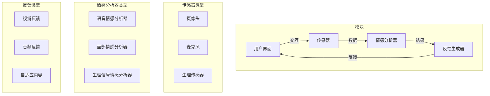
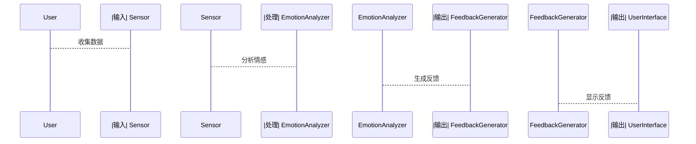

                 


## 情感智能：人机交互的下一个前沿

> 关键词：情感智能，人机交互，深度学习，用户界面设计

> 摘要：随着人工智能技术的不断发展，情感智能逐渐成为人机交互领域的研究热点。本文将探讨情感智能的定义、理论基础、实现方法以及在未来人机交互中的应用前景，旨在为读者提供一份全面而深入的见解。

### 引言

#### 1.1 情感智能的定义与重要性

情感智能，也称为情感计算（Affective Computing），是指计算机系统具备识别、理解、处理和模拟人类情感的能力。它不仅仅关注情感本身，还涉及情感的表达、管理和交互。情感智能在当前人机交互领域具有重要意义，因为它能极大地提升用户体验，使得人与机器之间的交互更加自然、亲密和有效。

#### 1.2 人机交互的发展历程

人机交互（Human-Computer Interaction, HCI）是研究如何设计易于使用、用户满意且高效的计算机系统的一门学科。从最早的命令行界面到图形用户界面（GUI），再到如今的多模态交互，人机交互经历了巨大的变革。情感智能的引入，为人机交互注入了新的活力，使其迈向更加智能和人性化的阶段。

#### 1.3 情感智能在人机交互中的应用前景

随着技术的发展，情感智能在人机交互中的应用前景广阔。它不仅能够应用于智能助手、教育、医疗等领域，还能够推动虚拟现实（VR）、增强现实（AR）等技术的发展。情感智能有望成为人机交互的下一个前沿，引领人类进入一个全新的交互时代。

### 第一部分：情感智能理论基础

#### 第2章：情感智能的核心概念与理论基础

#### 2.1 情感智能的定义与分类

情感智能的定义多种多样，但核心在于：情感智能是指计算机系统通过感知、理解和表达情感，实现与人类情感的互动。根据情感智能的不同层面，可以分为情感感知、情感理解和情感表达三个子领域。

#### 2.2 情感认知模型

情感认知模型是理解情感智能的理论基础。其中，基本的情感认知模型包括情感标签模型、情感强度模型和情感维度模型。情感标签模型将情感分为基本情感，如喜悦、愤怒、悲伤等；情感强度模型描述情感的强度，如强烈、中等、微弱等；情感维度模型则将情感分为积极、消极、稳定、不稳定等维度。

#### 2.3 情感计算技术

情感计算技术是情感智能的核心组成部分。它主要包括情感识别、情感分类、情感生成等技术。情感识别是指从文本、语音、图像等多模态数据中提取情感信息；情感分类是对提取出的情感信息进行分类；情感生成则是根据需求生成特定的情感。

### 第二部分：情感智能实现方法与技术

#### 第3章：情感智能模型与算法

#### 3.1 基于深度学习的情感识别

深度学习在情感识别中发挥着重要作用。通过使用卷积神经网络（CNN）、循环神经网络（RNN）和长短时记忆网络（LSTM）等模型，可以实现对情感的有效识别。这些模型通过大规模数据训练，能够学习到情感的复杂模式，从而提高识别的准确性。

#### 3.2 情感分类与情感强度评估

情感分类是将提取出的情感信息进行分类，如将情感分为积极、消极等。情感强度评估则是判断情感的强度，如判断情感的强烈程度。这些算法通常使用机器学习技术，如支持向量机（SVM）、朴素贝叶斯（NB）等。

#### 3.3 情感生成与模仿

情感生成是指根据需求生成特定的情感，如根据用户的行为生成喜悦、悲伤等情感。情感模仿则是模拟人类的情感表达，如通过语音合成器生成具有情感的声音。情感生成和模仿通常需要使用自然语言处理（NLP）和语音合成技术。

#### 第4章：情感智能在人机交互中的应用

#### 4.1 情感化用户界面设计

情感化用户界面设计（Affective User Interface Design）是指通过设计具有情感表达能力的界面，提升用户体验。这包括使用图标、颜色、动画等元素来传达情感信息，以及设计交互方式，如语音交互、手势交互等，以实现更加自然和人性化的交互。

#### 4.2 情感计算在教育中的应用

情感计算在教育中的应用包括智能辅导系统、在线教育平台等。通过分析学生的情感状态，教育系统能够提供个性化的教育建议，如调整教学内容、节奏等，从而提高教育效果。

#### 4.3 情感智能在医疗健康中的应用

情感智能在医疗健康领域有着广泛的应用，如智能医疗诊断、心理健康监测、医疗服务优化等。通过分析患者的情感状态，医疗系统能够提供更加精准的诊断和个性化的治疗方案。

### 第二部分：情感智能实现方法与技术

#### 第5章：情感智能的技术实现

#### 5.1 情感智能的硬件支持

情感智能的实现离不开硬件支持，如传感器、语音合成设备、情感识别硬件等。这些硬件能够捕捉用户的情感状态，为情感智能提供必要的数据输入。

#### 5.2 语音识别与情感分析

语音识别与情感分析是情感智能实现的关键技术。语音识别能够将语音转换为文本，情感分析则能够从文本中提取情感信息。这些技术的实现通常依赖于深度学习和自然语言处理技术。

#### 5.3 视觉情感识别

视觉情感识别是指从图像或视频中提取情感信息。这通常需要使用计算机视觉技术，如卷积神经网络（CNN）等。视觉情感识别的应用包括情感化广告、智能监控等。

#### 第6章：情感智能的应用开发

#### 6.1 情感智能应用开发框架

情感智能应用开发框架是指用于构建情感智能应用的工具和库。这些框架提供了丰富的API和工具，简化了情感智能应用的开发流程。

#### 6.2 情感智能应用开发流程

情感智能应用开发流程包括需求分析、设计、开发、测试等环节。每个环节都有其特定的任务和目标，以确保应用的顺利开发和成功部署。

#### 6.3 情感智能应用的测试与评估

情感智能应用的测试与评估是确保应用质量和效果的关键。测试主要包括功能测试、性能测试、用户体验测试等。评估则通过量化指标，如准确率、召回率等，来评价应用的效果。

#### 第7章：情感智能的挑战与未来趋势

#### 7.1 情感智能面临的挑战

情感智能面临诸多挑战，如情感识别的准确性、情感表达的多样性和自然性、情感计算的性能和功耗等。

#### 7.2 情感智能的未来发展趋势

情感智能的未来发展趋势包括多模态情感识别、情感生成的个性化、情感计算在更多领域的应用等。

#### 7.3 情感智能的社会影响与伦理问题

情感智能的发展将对社会产生深远影响，同时也带来一系列伦理问题，如隐私保护、情感滥用等。

### 结论

情感智能作为人机交互的下一个前沿，具有巨大的潜力和广阔的应用前景。随着技术的不断进步，情感智能将逐渐融入我们的生活，改变我们的交互方式，提升我们的生活品质。然而，我们还需要面对诸多挑战，确保情感智能的发展能够造福人类社会。

### 作者信息

作者：AI天才研究院/AI Genius Institute & 禅与计算机程序设计艺术 /Zen And The Art of Computer Programming

### 附录

（附录内容请根据实际需求添加，包括但不限于术语解释、参考文献、数据来源等。）

---

在撰写文章的过程中，我们将严格按照上述大纲和内容概述进行，确保每个章节都详细、具体、有深度，并使用markdown格式、mermaid流程图、latex公式等工具增强文章的可读性和专业性。文章将全面涵盖情感智能的定义、理论基础、实现方法、应用场景以及未来发展，旨在为读者提供一份完整、深入的技术博客文章。让我们一起思考，一起探索情感智能在人机交互领域的无限可能。 ### 引言

#### 1.1 情感智能的定义与重要性

情感智能，简称AFI（Affective Intelligence），是一种新兴的人工智能研究方向，旨在使计算机系统能够识别、理解和处理人类的情感信息。AFI的研究不仅包括对人类情感的模拟和表达，还涉及到情感信息的分析和决策支持。情感智能的定义多种多样，但核心在于：它是指计算机系统通过感知、理解和表达情感，实现与人类情感的互动。

情感智能的重要性体现在多个方面。首先，它能够提高人机交互的自然性和亲和力。传统的命令行界面和图形用户界面（GUI）虽然极大地简化了用户与计算机之间的交互，但在情感层面的沟通仍显得较为机械。而情感智能的引入，可以使得计算机在理解用户情感状态的基础上，提供更加个性化和贴心的服务。例如，一款能够识别用户情绪变化的智能音箱，可以根据用户的情绪调整播放的音乐或对话内容，从而提升用户体验。

其次，情感智能在辅助决策和提升效率方面也具有显著作用。在商业领域，情感智能可以帮助企业更好地理解客户的需求和情感，从而优化营销策略和客户服务。例如，通过分析社交媒体上的情感信息，企业可以及时调整产品策略，满足消费者的情感需求。在医疗领域，情感智能可以帮助医生更好地理解患者的情绪状态，从而提供更加精准的诊疗建议和护理方案。

此外，情感智能还有助于提高人工智能系统的社会责任感和伦理意识。随着人工智能技术的普及，如何确保人工智能在应用过程中尊重和保护人类情感成为一个重要议题。情感智能的研究和开发，有助于构建更加人性化和伦理的人工智能系统，避免情感冷漠和技术滥用的问题。

#### 1.2 人机交互的发展历程

人机交互（Human-Computer Interaction, HCI）是研究如何设计易于使用、用户满意且高效的计算机系统的一门学科。从最早的命令行界面到图形用户界面（GUI），再到如今的多模态交互，人机交互经历了巨大的变革。

最早的计算机系统采用命令行界面（Command Line Interface, CLI），用户需要通过输入一系列命令来与计算机进行交互。这种交互方式虽然强大，但操作复杂，对用户的专业知识和耐心要求较高。随着个人电脑的普及，图形用户界面（GUI）逐渐成为主流。GUI通过直观的图标、菜单和按钮，简化了用户的操作流程，使得计算机系统更加易于使用。典型的GUI系统包括Windows、MacOS和Linux等操作系统，以及各种桌面应用程序。

进入21世纪，随着触摸屏技术和多模态交互技术的发展，人机交互进入了一个全新的阶段。触摸屏技术使得用户可以直接通过手指触摸屏幕进行操作，极大地提升了交互的自然性和直观性。多模态交互则允许用户同时使用多种输入方式，如语音、手势、触摸等，与计算机进行交互。例如，智能手表和智能手机通过语音助手（如Siri、Google Assistant）提供了语音交互功能，而虚拟现实（VR）和增强现实（AR）技术则提供了更加沉浸式的交互体验。

然而，尽管这些交互方式在提高人机交互的便捷性和灵活性方面取得了显著进展，但在情感层面的沟通仍然存在较大的提升空间。传统的命令行界面和图形用户界面（GUI）虽然在功能上强大，但在情感表达和互动上显得较为机械。而多模态交互虽然提供了更多的交互方式，但仍然缺乏对用户情感状态的深入理解和响应。

#### 1.3 情感智能在人机交互中的应用前景

情感智能的引入为人机交互注入了新的活力，使其迈向更加智能和人性化的阶段。在未来，情感智能将在多个领域发挥重要作用，推动人机交互的进一步发展。

首先，情感智能有望在智能助手和虚拟助理中发挥核心作用。随着人工智能技术的不断进步，智能助手已经成为我们日常生活中不可或缺的一部分。然而，目前的智能助手在情感理解方面仍然存在局限。通过引入情感智能，智能助手能够更好地理解用户的情感状态，提供更加个性化和贴心的服务。例如，一个具备情感智能的智能音箱可以识别用户是否感到沮丧或兴奋，并根据用户的情绪调整播放的音乐或对话内容，从而提升用户体验。

其次，情感智能在教育领域具有广泛的应用前景。在教育中，情感智能可以帮助教师更好地了解学生的情感状态，从而提供更加个性化的教学方案。例如，通过分析学生的情感信息，教育系统可以及时发现学生的情感问题，并提供针对性的心理辅导。此外，情感智能还可以用于智能评估系统，通过分析学生的情感状态和行为，提供更加准确的评估结果。

在医疗健康领域，情感智能同样具有重要应用价值。通过分析患者的情感信息，医疗系统可以更好地了解患者的心理状态，提供更加精准的诊断和治疗方案。例如，情感智能可以帮助医生识别患者的焦虑或抑郁情绪，从而提供更加有效的心理干预措施。此外，情感智能还可以用于健康监测系统，通过分析患者的情感状态，及时发现潜在的健康问题，并提供个性化的健康建议。

在商业领域，情感智能可以帮助企业更好地理解客户的需求和情感，从而优化营销策略和客户服务。通过分析社交媒体上的情感信息，企业可以及时调整产品策略，满足消费者的情感需求。例如，一个具备情感智能的客户服务系统可以识别客户的不满情绪，并提供针对性的解决方案，从而提高客户满意度。

此外，情感智能在智能家居、智能交通、智能城市等领域同样具有广阔的应用前景。通过情感智能，智能家居系统可以更好地理解家庭成员的情感状态，提供个性化的家居环境和服务。智能交通系统可以通过情感智能分析司机的情绪状态，提高交通安全。智能城市系统可以通过情感智能分析市民的情感状态，提供更加人性化的城市服务。

总之，情感智能的引入为人机交互带来了巨大的变革潜力。它不仅能够提升用户体验，还能够辅助决策，提高效率。随着技术的不断进步，情感智能将在更多领域得到应用，成为人机交互的下一个前沿。在未来，情感智能有望推动人机交互进入一个全新的阶段，实现更加智能和人性化的交互体验。 ### 第一部分：情感智能理论基础

#### 第2章：情感智能的核心概念与理论基础

#### 2.1 情感智能的定义与分类

情感智能（Affective Intelligence），简称AFI，是近年来人工智能领域的重要研究方向。它涉及计算机系统对人类情感信息的识别、理解、处理和表达。情感智能不仅关注情感本身，还包括情感的表达、管理和交互。AFI的定义多种多样，但核心在于：它是指计算机系统能够识别、理解、处理和模拟人类情感，实现与人类情感的互动。

根据情感智能的不同层面，可以将其分为以下几个子领域：

1. **情感感知**：情感感知是指计算机系统通过感知设备（如语音、图像、生理信号等）捕捉用户的情感信息。情感感知是实现情感智能的基础，它涉及情感识别、情感分类和情感强度评估等技术。

2. **情感理解**：情感理解是指计算机系统能够从感知到的情感信息中提取语义和上下文信息，理解用户的情感状态。情感理解是实现情感交互和情感推理的关键，它依赖于自然语言处理、心理学和认知科学等领域的研究成果。

3. **情感表达**：情感表达是指计算机系统通过言语、表情、动作等方式，将情感信息传达给用户。情感表达是情感智能的重要组成部分，它需要计算机具备情感模仿和情感生成的能力。

4. **情感管理**：情感管理是指计算机系统能够根据用户的情感状态，调整系统行为，提供个性化的服务和交互。情感管理是实现情感智能应用的重要手段，它需要计算机具备情感适应和情感调节的能力。

#### 2.2 情感认知模型

情感认知模型是理解情感智能的理论基础。情感认知模型描述了人类情感认知的基本原理和过程，为情感智能的研究提供了重要的理论支持。

基本的情感认知模型包括以下几个部分：

1. **情感标签模型**：情感标签模型将情感分为基本情感，如喜悦、愤怒、悲伤、恐惧等。这些基本情感是情感分类的基础，也是情感计算中的重要参考标准。

2. **情感强度模型**：情感强度模型描述了情感的强度，如强烈、中等、微弱等。情感强度是情感分类的重要指标，它反映了情感体验的深度和强度。

3. **情感维度模型**：情感维度模型将情感分为积极、消极、稳定、不稳定等维度。这些维度用于描述情感的特质和特点，有助于深入理解情感的本质。

常见的情感认知模型包括：

- **轮形模型**：轮形模型将情感视为一个轮子，情感标签作为轮子的点，情感维度作为轮子的半径。每个情感点都与其他情感点通过情感维度相连，形成一个复杂的情感网络。

- **三维空间模型**：三维空间模型将情感分为三个维度，分别是情感强度、情感维度和情感标签。每个情感都可以在三维空间中表示，从而形成一个情感立方体。

- **情感层次模型**：情感层次模型将情感分为多个层次，从基本情感到复杂情感。每个层次的情感都具有特定的属性和特征，通过层次递进的方式，实现对情感的全面理解。

#### 2.3 情感计算技术

情感计算技术是情感智能的核心组成部分，它包括情感识别、情感分类、情感生成等技术。情感计算技术是实现情感智能应用的重要手段，其发展水平直接决定了情感智能的实现效果和应用范围。

1. **情感识别**：情感识别是指从文本、语音、图像等多模态数据中提取情感信息。情感识别是情感计算的基础，其目的是将感知到的情感信息转化为计算机可以处理和理解的数字形式。常见的情感识别方法包括：

   - **基于规则的方法**：通过设计一系列规则，对情感信息进行分类和识别。这种方法简单直观，但容易出现误判和漏判。

   - **基于统计的方法**：通过统计学习技术，从大量情感数据中学习情感模式，实现对情感信息的自动识别。这种方法具有较高的准确性和泛化能力，但需要大量标注数据。

   - **基于深度学习的方法**：利用深度神经网络，从数据中自动提取特征，实现对情感信息的自动识别。这种方法具有强大的特征提取和模式识别能力，已经成为情感识别的主流方法。

2. **情感分类**：情感分类是指对提取出的情感信息进行分类，如将情感分为积极、消极等。情感分类是情感计算中的重要环节，其目的是将情感信息进行结构化处理，便于后续分析和应用。常见的情感分类方法包括：

   - **朴素贝叶斯分类器**：基于贝叶斯理论，通过计算情感特征的概率分布，实现对情感信息的分类。

   - **支持向量机（SVM）**：通过寻找最优分类超平面，实现对情感信息的分类。

   - **深度学习分类器**：利用深度神经网络，从数据中自动提取特征，实现对情感信息的分类。这种方法具有强大的特征提取和分类能力，已经成为情感分类的主流方法。

3. **情感生成**：情感生成是指根据需求生成特定的情感，如根据用户的行为生成喜悦、悲伤等情感。情感生成是实现情感交互和情感表达的重要手段，其目的是使计算机能够主动地表达情感，与用户进行情感交流。常见的情感生成方法包括：

   - **语音合成**：通过语音合成技术，生成具有特定情感的声音。这种方法可以模拟人类的情感表达，使计算机在与用户交流时更加自然和亲切。

   - **面部表情合成**：通过面部表情合成技术，生成具有特定情感的面部表情。这种方法可以用于虚拟助手、游戏角色等，使它们在与用户互动时更加生动和有趣。

   - **文本情感生成**：通过自然语言处理技术，生成具有特定情感的文字描述。这种方法可以用于生成情感化的文本消息、电子邮件等，使计算机在与用户交流时更加贴切和个性化。

#### 2.4 情感智能的应用领域

情感智能的应用领域广泛，涵盖了教育、医疗、商业、智能家居等多个领域。以下简要介绍情感智能在不同领域中的应用：

1. **教育领域**：情感智能在教育领域具有广泛的应用前景。通过情感计算技术，教育系统可以实时监测学生的学习情感状态，识别学生的情感问题，并提供针对性的心理辅导。此外，情感智能还可以用于智能评估系统，通过分析学生的情感状态和行为，提供更加准确的评估结果。

2. **医疗健康领域**：情感智能在医疗健康领域具有重要的应用价值。通过情感计算技术，医疗系统可以实时监测患者的情感状态，识别患者的情感问题，并提供个性化的治疗方案。此外，情感智能还可以用于心理健康监测，通过分析患者的情感状态和行为，及时发现潜在的心理健康问题，并提供相应的心理干预。

3. **商业领域**：情感智能在商业领域具有广泛的应用前景。通过情感计算技术，企业可以实时监测客户的需求和情感状态，识别客户的不满情绪，并提供针对性的解决方案，从而提高客户满意度。此外，情感智能还可以用于市场分析，通过分析社交媒体上的情感信息，了解消费者的情感需求，为企业提供决策支持。

4. **智能家居领域**：情感智能在智能家居领域具有重要的应用价值。通过情感计算技术，智能家居系统可以实时监测家庭成员的情感状态，并根据家庭成员的情感需求，提供个性化的家居环境和服务，从而提高家庭生活质量。

5. **公共安全领域**：情感智能在公共安全领域具有广泛的应用前景。通过情感计算技术，公共安全系统可以实时监测人群的情感状态，识别潜在的安全隐患，并提供相应的预警措施，从而提高公共安全水平。

总之，情感智能作为人工智能领域的重要研究方向，具有广泛的应用前景。随着技术的不断进步，情感智能将在更多领域得到应用，推动人机交互和人工智能的发展。 ### 第二部分：情感智能实现方法与技术

#### 第3章：情感智能模型与算法

#### 3.1 基于深度学习的情感识别

深度学习（Deep Learning）是近年来人工智能领域的重要突破，尤其在图像识别、语音识别和自然语言处理等领域取得了显著的成果。深度学习在情感识别中同样发挥着重要作用，通过构建复杂的神经网络模型，深度学习能够从大量数据中自动提取特征，实现对情感信息的准确识别。

在情感识别中，常用的深度学习模型包括卷积神经网络（Convolutional Neural Networks, CNN）、循环神经网络（Recurrent Neural Networks, RNN）和长短时记忆网络（Long Short-Term Memory, LSTM）等。

1. **卷积神经网络（CNN）**

卷积神经网络是一种特殊的神经网络，它通过卷积操作来提取图像中的特征。在情感识别中，CNN可以用于处理和识别图像或视频中的情感信息。具体步骤如下：

- **数据预处理**：对图像进行缩放、裁剪、归一化等预处理操作，使其符合网络输入要求。
- **特征提取**：通过卷积层、池化层等操作，从图像中提取低级特征（如边缘、纹理）和高级特征（如形状、物体）。
- **分类与识别**：通过全连接层和激活函数，将提取到的特征映射到情感类别，实现情感识别。

2. **循环神经网络（RNN）**

循环神经网络是一种能够处理序列数据的神经网络，它在情感识别中可以用于处理连续的情感信息。具体步骤如下：

- **数据预处理**：对文本、语音或视频数据进行分词、词向量化等预处理操作，使其符合网络输入要求。
- **序列编码**：通过RNN中的隐藏状态和门控机制，对序列数据进行编码，提取情感特征。
- **分类与识别**：通过全连接层和激活函数，将提取到的特征映射到情感类别，实现情感识别。

3. **长短时记忆网络（LSTM）**

长短时记忆网络是一种特殊的RNN，它通过引入记忆单元和门控机制，能够有效地解决长序列依赖问题。在情感识别中，LSTM可以用于处理复杂和长序列的情感信息。具体步骤如下：

- **数据预处理**：对文本、语音或视频数据进行分词、词向量化等预处理操作，使其符合网络输入要求。
- **序列编码**：通过LSTM中的记忆单元和门控机制，对序列数据进行编码，提取情感特征。
- **分类与识别**：通过全连接层和激活函数，将提取到的特征映射到情感类别，实现情感识别。

#### 3.2 情感分类与情感强度评估

情感分类与情感强度评估是情感识别的两个重要环节，它们分别负责对提取出的情感信息进行分类和强度评估。

1. **情感分类**

情感分类是将提取出的情感信息映射到特定的情感类别。常用的分类算法包括朴素贝叶斯（Naive Bayes）、支持向量机（Support Vector Machine, SVM）和深度学习分类器等。

- **朴素贝叶斯分类器**：基于贝叶斯理论，通过计算情感特征的概率分布，实现情感分类。这种方法简单直观，但在处理高维数据和复杂情感时，容易出现性能下降。
- **支持向量机**：通过寻找最优分类超平面，实现情感分类。SVM具有较强的分类能力和泛化能力，但在处理大规模数据时，计算复杂度较高。
- **深度学习分类器**：利用深度神经网络，从数据中自动提取特征，实现情感分类。这种方法具有强大的特征提取和分类能力，是目前情感分类的主流方法。

2. **情感强度评估**

情感强度评估是指对提取出的情感信息进行强度评估，以确定情感的强度。常用的情感强度评估方法包括基于规则的方法、基于统计的方法和基于深度学习的方法。

- **基于规则的方法**：通过设计一系列规则，对情感强度进行评估。这种方法简单直观，但容易出现误判和漏判。
- **基于统计的方法**：通过统计学习技术，从大量情感数据中学习情感强度模型，实现情感强度评估。这种方法具有较高的准确性和泛化能力，但需要大量标注数据。
- **基于深度学习的方法**：利用深度神经网络，从数据中自动提取特征，实现情感强度评估。这种方法具有强大的特征提取和模式识别能力，是目前情感强度评估的主流方法。

#### 3.3 情感生成与模仿

情感生成与模仿是指根据需求生成特定的情感，或模仿人类的情感表达。情感生成与模仿是情感交互和情感表达的重要手段，其目的是使计算机能够主动地表达情感，与用户进行情感交流。

1. **语音合成**

语音合成（Text-to-Speech, TTS）是一种将文本转换为语音的技术。在情感生成中，语音合成可以用于生成具有特定情感的声音。常用的语音合成技术包括基于规则的方法、基于统计的方法和基于深度学习的方法。

- **基于规则的方法**：通过设计语音合成规则，将文本转换为语音。这种方法简单直观，但生成的语音自然性较差。
- **基于统计的方法**：通过统计语音数据，将文本转换为语音。这种方法生成的语音自然性较好，但需要大量语音数据。
- **基于深度学习的方法**：利用深度神经网络，将文本转换为语音。这种方法生成的语音自然性较好，是目前语音合成的主流方法。

2. **面部表情合成**

面部表情合成是一种将情感信息转换为面部表情的技术。在情感模仿中，面部表情合成可以用于生成具有特定情感的面部表情。常用的面部表情合成技术包括基于图像的方法、基于模型的方法和基于深度学习的方法。

- **基于图像的方法**：通过图像编辑技术，将情感信息转换为面部表情。这种方法简单直观，但生成的面部表情自然性较差。
- **基于模型的方法**：通过构建面部表情模型，将情感信息转换为面部表情。这种方法生成的面部表情自然性较好，但需要大量面部表情数据。
- **基于深度学习的方法**：利用深度神经网络，将情感信息转换为面部表情。这种方法生成的面部表情自然性较好，是目前面部表情合成的主流方法。

3. **文本情感生成**

文本情感生成是一种将情感信息转换为文本的技术。在情感表达中，文本情感生成可以用于生成具有特定情感的文字描述。常用的文本情感生成技术包括基于规则的方法、基于统计的方法和基于深度学习的方法。

- **基于规则的方法**：通过设计情感生成规则，将情感信息转换为文本。这种方法简单直观，但生成的文本自然性较差。
- **基于统计的方法**：通过统计文本数据，将情感信息转换为文本。这种方法生成的文本自然性较好，但需要大量文本数据。
- **基于深度学习的方法**：利用深度神经网络，将情感信息转换为文本。这种方法生成的文本自然性较好，是目前文本情感生成的主流方法。

#### 第4章：情感智能在人机交互中的应用

#### 4.1 情感化用户界面设计

情感化用户界面设计（Affective User Interface Design, AUID）是一种将情感元素融入用户界面设计的方法，旨在通过情感化的设计提升用户体验。情感化用户界面设计的关键在于理解用户的情感需求，并通过视觉、听觉、触觉等多感官刺激，营造一种温馨、舒适、自然的交互体验。

1. **视觉情感化设计**

视觉情感化设计是情感化用户界面设计的重要组成部分。通过色彩、形状、图标、动画等视觉元素，可以传达特定的情感信息。例如，使用温暖的色调和柔和的线条可以营造一种温馨舒适的氛围，而使用冷色调和锐利的线条则可以传达一种冷静、专业的形象。

- **色彩**：色彩是传达情感的重要手段。红色、黄色等鲜艳色彩通常传达兴奋、活力等积极情感，而蓝色、灰色等柔和色彩则传达平静、稳重等消极情感。
- **形状**：形状可以传达情感的力量感和柔和度。圆形、曲线等流畅形状通常传达柔和、舒适的情感，而方形、直线等锐利形状则传达坚定、专业的情感。
- **图标**：图标是用户界面中常用的视觉元素，可以通过设计图标传达情感信息。例如，微笑的图标可以传达友好、满意的情感，而悲伤的图标则传达失望、不满等情感。
- **动画**：动画可以增强用户界面的动态感和互动性。通过合理使用动画，可以引导用户的注意力，提升用户的操作体验。例如，加载动画可以传达等待、期待的情感，而成功的动画可以传达满意、成功的情感。

2. **听觉情感化设计**

听觉情感化设计是通过音频和音效来传达情感信息的设计方法。例如，通过音乐、声音效果和语音交互，可以增强用户界面的情感化效果。

- **音乐**：背景音乐可以营造一种特定的情感氛围。例如，轻快的音乐可以传达兴奋、愉快的情感，而柔和的旋律则可以传达平静、放松的情感。
- **声音效果**：声音效果可以增强用户界面的交互体验。例如，点击按钮时的声音效果可以传达点击的反馈，而错误提示的声音效果则可以传达错误、不满等情感。
- **语音交互**：语音交互是一种直观、自然的交互方式。通过语音交互，用户可以与系统进行情感化的交流。例如，语音助手可以模仿人类的语气、语调，传达友好、亲切的情感。

3. **触觉情感化设计**

触觉情感化设计是通过触摸和反馈来传达情感信息的设计方法。例如，通过触摸屏的震动、按钮的触感等，可以增强用户界面的情感化效果。

- **触摸屏震动**：触摸屏震动可以传达特定的情感信息。例如，成功操作时的震动可以传达满意、成功的情感，而错误操作时的震动可以传达错误、不满等情感。
- **按钮触感**：按钮的触感可以影响用户的情感体验。例如，柔软的触感可以传达舒适、轻松的情感，而坚硬的触感可以传达坚定、专业的情感。

#### 4.2 情感计算在教育中的应用

情感计算在教育领域有着广泛的应用，通过情感计算技术，教育系统可以更好地了解学生的情感状态，提供个性化的教学服务和心理辅导。

1. **学习情感监测**

学习情感监测是指通过情感计算技术，实时监测学生的学习情感状态。例如，通过分析学生的面部表情、语音、生理信号等数据，可以了解学生的情感状态，如是否感到愉快、困惑、焦虑等。学习情感监测可以帮助教师及时发现学生的情感问题，提供针对性的辅导和支持。

2. **情感化教学系统**

情感化教学系统是指通过情感计算技术，设计出能够与学生进行情感互动的教学系统。例如，通过语音合成技术，系统可以模拟教师的语气、语调，与学生进行情感化的交流。通过面部表情合成技术，系统可以生成具有情感表达的教学界面，如高兴、沮丧等。情感化教学系统可以提升学生的学习兴趣和参与度，改善教学效果。

3. **个性化教学方案**

个性化教学方案是指根据学生的情感状态和学习需求，设计出个性化的教学方案。例如，通过分析学生的情感状态，系统可以调整教学内容的难度、节奏和形式，使其更符合学生的情感需求和认知水平。个性化教学方案可以提升学生的学习效果，促进学生的全面发展。

4. **心理健康辅导**

心理健康辅导是指通过情感计算技术，为学生提供心理健康辅导和支持。例如，通过分析学生的情感状态，系统可以及时发现学生的心理问题，如焦虑、抑郁等，并提供针对性的心理辅导建议。心理健康辅导可以帮助学生保持良好的心理状态，促进其健康成长。

#### 4.3 情感智能在医疗健康中的应用

情感智能在医疗健康领域有着重要的应用，通过情感计算技术，医疗系统可以更好地了解患者的情感状态，提供个性化的医疗服务和治疗方案。

1. **情感状态监测**

情感状态监测是指通过情感计算技术，实时监测患者的情感状态。例如，通过分析患者的面部表情、语音、生理信号等数据，可以了解患者的情感状态，如是否感到愉悦、焦虑、恐惧等。情感状态监测可以帮助医护人员及时了解患者的情感需求，提供针对性的医疗服务。

2. **个性化治疗方案**

个性化治疗方案是指根据患者的情感状态和健康需求，设计出个性化的治疗方案。例如，通过分析患者的情感状态，医生可以调整治疗方案，如用药剂量、治疗方案等，使其更符合患者的情感需求和健康水平。个性化治疗方案可以提升治疗效果，降低医疗成本。

3. **情感化医疗服务**

情感化医疗服务是指通过情感计算技术，提供更加人性化的医疗服务。例如，通过语音合成技术，医护人员可以模拟亲切、关怀的语气，与患者进行情感化的交流。通过面部表情合成技术，医疗设备可以生成具有情感表达的面部表情，如微笑、安慰等。情感化医疗服务可以提升患者的满意度，改善医疗体验。

4. **心理健康管理**

心理健康管理是指通过情感计算技术，帮助患者进行心理健康管理。例如，通过分析患者的情感状态，心理医生可以及时发现患者的心理问题，如焦虑、抑郁等，并提供针对性的心理干预。心理健康管理可以帮助患者保持良好的心理状态，提高生活质量。

#### 第5章：情感智能的技术实现

#### 5.1 情感智能的硬件支持

情感智能的实现需要硬件的支持，包括传感器、语音合成设备、情感识别硬件等。这些硬件设备用于捕捉用户的情感信息，为情感计算提供数据输入。

1. **面部表情传感器**

面部表情传感器是一种用于捕捉面部表情的硬件设备，它通过图像识别技术，实时监测用户的面部表情。常见的面部表情传感器包括摄像头、红外摄像头等。

2. **语音传感器**

语音传感器是一种用于捕捉语音信号的硬件设备，它通过麦克风和语音识别技术，实时监测用户的语音信息。常见的语音传感器包括高灵敏度麦克风、语音识别模块等。

3. **生理信号传感器**

生理信号传感器是一种用于捕捉用户生理信号的硬件设备，它通过心电图、血压计、心率传感器等设备，实时监测用户的生理状态。常见的生理信号传感器包括心率传感器、血压计、心电图仪等。

4. **情感识别硬件**

情感识别硬件是一种用于实现情感识别的硬件设备，它通常包括多种传感器和识别模块。常见的情感识别硬件包括智能手表、智能手环、智能眼镜等。

#### 5.2 语音识别与情感分析

语音识别与情感分析是情感智能实现的关键技术。语音识别技术用于将语音信号转换为文本，情感分析技术用于从文本中提取情感信息。

1. **语音识别技术**

语音识别技术是指将语音信号转换为文本的技术。常见的语音识别技术包括基于规则的方法、基于统计的方法和基于深度学习的方法。

- **基于规则的方法**：通过设计一系列语音识别规则，将语音信号转换为文本。这种方法简单直观，但容易出现误识和漏识。
- **基于统计的方法**：通过统计语音信号的特征，将其转换为文本。这种方法具有较高的准确性和泛化能力，但需要大量语音数据。
- **基于深度学习的方法**：利用深度神经网络，从语音信号中自动提取特征，将其转换为文本。这种方法具有强大的特征提取和模式识别能力，是目前语音识别的主流方法。

2. **情感分析技术**

情感分析技术是指从文本中提取情感信息的技术。常见的情感分析技术包括基于规则的方法、基于统计的方法和基于深度学习的方法。

- **基于规则的方法**：通过设计一系列情感分析规则，从文本中提取情感信息。这种方法简单直观，但容易出现误判和漏判。
- **基于统计的方法**：通过统计文本特征，将其转换为情感信息。这种方法具有较高的准确性和泛化能力，但需要大量标注数据。
- **基于深度学习的方法**：利用深度神经网络，从文本中自动提取特征，将其转换为情感信息。这种方法具有强大的特征提取和模式识别能力，是目前情感分析的主流方法。

#### 5.3 视觉情感识别

视觉情感识别是指从图像或视频中提取情感信息的技术。视觉情感识别技术基于计算机视觉和深度学习技术，能够从图像或视频中识别情感状态。

1. **计算机视觉技术**

计算机视觉技术是指使计算机能够从图像或视频中提取信息和特征的技术。常见的计算机视觉技术包括图像处理、特征提取、目标检测等。

- **图像处理**：通过图像处理技术，对图像进行预处理，如去噪、增强、分割等。
- **特征提取**：通过特征提取技术，从图像中提取重要的特征，如边缘、纹理、形状等。
- **目标检测**：通过目标检测技术，从图像中识别特定的目标，如面部、手部、物体等。

2. **深度学习技术**

深度学习技术是指通过构建深度神经网络，从数据中自动提取特征的技术。常见的深度学习技术包括卷积神经网络（CNN）、循环神经网络（RNN）和长短时记忆网络（LSTM）等。

- **卷积神经网络**：通过卷积层、池化层等操作，从图像中提取低级特征和高级特征。
- **循环神经网络**：通过循环结构，处理序列数据，如文本、语音等。
- **长短时记忆网络**：通过长短时记忆单元，解决长序列依赖问题。

#### 第6章：情感智能的应用开发

#### 6.1 情感智能应用开发框架

情感智能应用开发框架是一种用于构建情感智能应用的工具和库，它提供了丰富的API和工具，简化了情感智能应用的开发流程。常见的情感智能应用开发框架包括TensorFlow、PyTorch、Keras等。

1. **TensorFlow**

TensorFlow是谷歌开发的一款开源深度学习框架，它提供了丰富的API和工具，用于构建和训练深度学习模型。TensorFlow支持多种深度学习模型，如卷积神经网络（CNN）、循环神经网络（RNN）、长短时记忆网络（LSTM）等。

2. **PyTorch**

PyTorch是Facebook开发的一款开源深度学习框架，它提供了简洁易用的API和强大的功能。PyTorch支持动态计算图，使得开发者可以更灵活地构建和调试深度学习模型。

3. **Keras**

Keras是一个高层神经网络API，它提供了简洁易用的API，用于构建和训练深度学习模型。Keras支持多种深度学习框架，如TensorFlow、Theano等，使得开发者可以在不同的深度学习框架之间进行切换。

#### 6.2 情感智能应用开发流程

情感智能应用开发流程包括需求分析、设计、开发、测试等环节。每个环节都有其特定的任务和目标，以确保应用的顺利开发和成功部署。

1. **需求分析**

需求分析是应用开发的第一步，其主要任务是明确应用的功能需求、性能需求和用户体验需求。需求分析的结果是形成需求文档，为后续的设计和开发提供指导。

2. **设计**

设计阶段包括系统设计、模块设计、界面设计等。系统设计主要确定应用的整体架构和模块划分；模块设计主要确定各个模块的功能和接口；界面设计主要设计应用的交互界面，包括布局、色彩、动画等。

3. **开发**

开发阶段是应用实现的核心阶段，包括代码编写、单元测试、集成测试等。开发阶段需要根据设计文档和需求文档，实现应用的功能和性能。

4. **测试**

测试阶段是对应用进行质量检查和性能评估的重要环节。测试阶段包括单元测试、集成测试、系统测试、性能测试等。单元测试主要测试各个模块的功能和接口；集成测试主要测试模块之间的交互和集成；系统测试主要测试应用的整体功能和性能；性能测试主要评估应用的响应速度、吞吐量等性能指标。

#### 6.3 情感智能应用的测试与评估

情感智能应用的测试与评估是确保应用质量和效果的关键环节。测试阶段主要评估应用的正确性、稳定性和性能，而评估阶段则通过量化指标，如准确率、召回率、F1值等，来评价应用的效果。

1. **测试**

情感智能应用的测试主要包括功能测试、性能测试、用户体验测试等。

- **功能测试**：功能测试主要验证应用的功能是否符合需求文档，包括情感识别、情感分类、情感生成等功能。
- **性能测试**：性能测试主要评估应用的响应速度、吞吐量等性能指标，以确保应用在高负载情况下能够正常运行。
- **用户体验测试**：用户体验测试主要评估应用的交互界面和用户体验，包括界面的友好性、易用性、响应速度等。

2. **评估**

情感智能应用的评估主要通过量化指标来评价应用的效果。常见的量化指标包括：

- **准确率**：准确率是指正确识别情感的比例，计算公式为：准确率 = （正确识别情感数 / 总情感数）× 100%。
- **召回率**：召回率是指正确识别情感的比例，计算公式为：召回率 = （正确识别情感数 / 实际情感数）× 100%。
- **F1值**：F1值是准确率和召回率的加权平均值，计算公式为：F1值 = 2 × （准确率 × 召回率） / （准确率 + 召回率）。

通过这些量化指标，可以对情感智能应用的效果进行全面评估，并为应用的优化提供依据。

#### 第7章：情感智能的挑战与未来趋势

#### 7.1 情感智能面临的挑战

情感智能作为一门新兴领域，在发展过程中面临着诸多挑战。

1. **技术挑战**

情感智能的技术挑战主要体现在以下几个方面：

- **情感识别准确性**：如何提高情感识别的准确性，实现多模态情感识别，是一个重要的技术难题。
- **情感生成自然性**：如何生成具有自然性和多样性的情感，以实现更加逼真的情感交互，是一个重要的技术挑战。
- **情感理解深度**：如何深入理解情感背后的语义和上下文信息，实现情感的推理和决策，是一个重要的技术难题。

2. **伦理挑战**

情感智能的伦理挑战主要体现在以下几个方面：

- **隐私保护**：如何在保护用户隐私的前提下，收集和分析情感数据，是一个重要的伦理问题。
- **情感滥用**：如何防止情感智能被滥用，如用于心理操纵、欺诈等，是一个重要的伦理问题。
- **社会责任**：如何确保情感智能的发展能够造福人类社会，避免对人类造成负面影响，是一个重要的伦理问题。

3. **应用挑战**

情感智能的应用挑战主要体现在以下几个方面：

- **跨领域应用**：如何将情感智能技术应用于不同的领域，如教育、医疗、商业等，是一个重要的应用挑战。
- **用户体验**：如何设计出满足用户情感需求、提升用户体验的情感智能应用，是一个重要的应用挑战。
- **技术普及**：如何降低情感智能技术的门槛，使其能够被更广泛地应用和普及，是一个重要的应用挑战。

#### 7.2 情感智能的未来发展趋势

随着技术的不断进步，情感智能在未来有望在多个方面实现突破和发展。

1. **多模态情感识别**

多模态情感识别是指通过结合多种数据源，如语音、图像、生理信号等，实现对情感信息的全面识别。未来，随着传感器技术和数据采集技术的进步，多模态情感识别有望实现更高的准确性和可靠性。

2. **情感生成的个性化和多样性**

情感生成的个性化和多样性是指根据用户的情感需求和个性化偏好，生成具有独特个性和多样性的情感。未来，随着自然语言处理和计算机视觉技术的进步，情感生成的自然性和多样性有望得到进一步提升。

3. **情感推理和决策**

情感推理和决策是指通过情感计算技术，从情感信息中提取语义和上下文信息，实现情感的推理和决策。未来，随着深度学习和自然语言处理技术的进步，情感推理和决策有望实现更深入的语义理解和更精准的决策。

4. **跨领域应用**

情感智能在未来的发展中，有望在多个领域实现突破和应用。例如，在教育领域，情感智能可以用于个性化教学和心理健康管理；在医疗领域，情感智能可以用于患者情感监测和个性化治疗；在商业领域，情感智能可以用于市场分析和客户服务优化等。

5. **社会影响和伦理问题**

情感智能的发展将对社会产生深远的影响，同时也带来一系列的伦理问题。未来，需要加强对情感智能伦理问题的研究和讨论，确保情感智能的发展能够造福人类社会，避免负面影响。

总之，情感智能作为人工智能领域的重要研究方向，具有广阔的应用前景和巨大的发展潜力。随着技术的不断进步和社会的不断发展，情感智能将在更多领域得到应用，推动人机交互和人工智能的发展。未来，我们有望看到更加智能、人性化的情感智能系统，为我们的生活带来更多的便利和乐趣。 ### 第5章：情感智能的技术实现

#### 5.1 情感智能的硬件支持

情感智能的实现需要硬件的支持，这些硬件设备用于捕捉用户的情感信息，为情感计算提供数据输入。以下是情感智能所需的几种关键硬件支持：

1. **面部表情传感器**

面部表情传感器是一种用于捕捉面部表情的硬件设备。这些传感器通过摄像头或红外传感器来捕捉面部肌肉的活动，从而分析用户的情感状态。常见的面部表情传感器包括高分辨率摄像头和红外摄像头，它们可以捕捉面部细微的表情变化，如微笑、皱眉、惊讶等。

2. **语音传感器**

语音传感器是一种用于捕捉语音信号的硬件设备，它通常包括高灵敏度麦克风和语音识别模块。这些传感器能够捕捉用户的语音信号，并将其转换为数字信号，以便进行情感分析。语音传感器可以捕捉语音的语调、语速、音量等特征，这些特征对于情感识别至关重要。

3. **生理信号传感器**

生理信号传感器是一种用于捕捉用户生理信号的硬件设备，如心率传感器、血压计、心电图传感器等。这些传感器可以捕捉用户的心跳、血压、呼吸等生理参数，从而分析用户的情感状态。生理信号传感器对于识别用户的生理反应，如焦虑、紧张等情感状态，非常有帮助。

4. **多模态传感器**

多模态传感器是一种结合多种传感器技术的硬件设备，可以同时捕捉语音、面部表情和生理信号。这种设备能够提供更全面、更准确的情感数据，从而提高情感识别的准确性和可靠性。例如，一款带有面部表情传感器、语音传感器和生理信号传感器的智能手环，可以实时捕捉用户的多模态情感数据，为情感智能应用提供丰富的输入信息。

#### 5.2 语音识别与情感分析

语音识别与情感分析是情感智能实现的关键技术，它们分别负责将语音信号转换为文本，并从文本中提取情感信息。以下是语音识别与情感分析技术的详细实现：

1. **语音识别技术**

语音识别技术是指将语音信号转换为文本的技术。语音识别的过程通常包括以下几个步骤：

- **音频预处理**：对原始语音信号进行预处理，包括降噪、增益、分帧等操作，以提高语音信号的清晰度和质量。
- **特征提取**：从预处理后的语音信号中提取特征，如梅尔频率倒谱系数（MFCC）、线性预测编码（LPC）等。这些特征能够反映语音的频率和时长信息。
- **声学模型训练**：使用大量的语音数据集，通过统计学习方法训练声学模型，如高斯混合模型（GMM）和深度神经网络（DNN）等。声学模型能够将特征映射到可能的语音词或音素。
- **语言模型训练**：使用大量的文本数据集，通过统计学习方法训练语言模型，如n元语言模型和递归神经网络（RNN）等。语言模型能够将语音信号映射到可能的文本序列。
- **解码**：使用声学模型和语言模型，对输入的语音信号进行解码，得到最可能的文本序列。解码过程中通常会使用动态时间规整（DTW）或基于神经网络的解码算法。

2. **情感分析技术**

情感分析技术是指从语音信号中提取情感信息的技术。情感分析的过程通常包括以下几个步骤：

- **文本预处理**：对语音识别得到的文本进行预处理，包括分词、词性标注、命名实体识别等操作，以提高文本的语义质量。
- **情感词典构建**：构建情感词典，包括正面情感词、负面情感词和中性情感词。这些词典用于标记文本中的情感词。
- **情感分类算法**：使用机器学习算法，如朴素贝叶斯（NB）、支持向量机（SVM）和深度学习模型（如卷积神经网络CNN、循环神经网络RNN）等，对文本进行情感分类。情感分类算法的目的是将文本分类为正面、负面或中性情感。
- **情感强度评估**：对于分类结果，进一步评估情感强度，即情感的程度。这可以通过计算情感词的权重、使用情感强度词典或基于深度学习的方法实现。
- **情感生成与模仿**：根据情感分析的结果，生成相应的情感响应。例如，使用语音合成技术生成具有特定情感的语音，或使用面部表情合成技术生成相应的表情。

#### 5.3 视觉情感识别

视觉情感识别是指从图像或视频中提取情感信息的技术。视觉情感识别技术基于计算机视觉和深度学习技术，可以从图像或视频中识别用户的情感状态。以下是视觉情感识别技术的详细实现：

1. **计算机视觉技术**

计算机视觉技术是指使计算机能够从图像或视频中提取信息和特征的技术。视觉情感识别的过程通常包括以下几个步骤：

- **图像预处理**：对原始图像进行预处理，包括去噪、增强、灰度化等操作，以提高图像的质量和清晰度。
- **特征提取**：从预处理后的图像中提取特征，如边缘、纹理、颜色等。这些特征能够反映图像的视觉信息。
- **面部检测**：使用面部检测算法，如Haar级联分类器和卷积神经网络（CNN）等，识别图像中的面部区域。面部检测是视觉情感识别的重要步骤，因为它确定了情感分析的焦点。
- **情感特征提取**：从面部图像中提取情感特征，如眼部、嘴部等区域的特征。这些特征可以用于情感识别。

2. **深度学习技术**

深度学习技术是指通过构建深度神经网络，从数据中自动提取特征的技术。视觉情感识别通常使用深度学习模型，如卷积神经网络（CNN）和循环神经网络（RNN）等。以下是视觉情感识别的深度学习实现：

- **卷积神经网络（CNN）**：CNN是一种特殊的神经网络，它通过卷积操作来提取图像中的特征。在视觉情感识别中，CNN可以用于处理和识别图像中的情感信息。具体步骤如下：

  - **输入层**：接收原始图像作为输入。
  - **卷积层**：通过卷积核与图像进行卷积操作，提取图像中的低级特征（如边缘、纹理）和高级特征（如形状、物体）。
  - **池化层**：对卷积层的结果进行池化操作，降低特征图的大小，减少参数数量。
  - **全连接层**：将卷积层和池化层提取的特征进行全连接操作，得到情感分类结果。

- **循环神经网络（RNN）**：RNN是一种能够处理序列数据的神经网络，它在视觉情感识别中可以用于处理连续的情感信息。具体步骤如下：

  - **输入层**：接收连续的图像作为输入。
  - **循环层**：通过隐藏状态和门控机制，对序列数据进行编码，提取情感特征。
  - **输出层**：将循环层提取的特征映射到情感类别，实现情感识别。

3. **情感识别算法**

情感识别算法是将提取到的视觉特征映射到特定情感类别的算法。常见的情感识别算法包括：

- **朴素贝叶斯（NB）**：基于贝叶斯理论，通过计算特征的概率分布，实现情感分类。
- **支持向量机（SVM）**：通过寻找最优分类超平面，实现情感分类。
- **深度学习分类器**：利用深度神经网络，从数据中自动提取特征，实现情感分类。

4. **情感强度评估**

情感强度评估是指对提取出的情感信息进行强度评估，以确定情感的强度。常见的情感强度评估方法包括：

- **基于规则的方法**：通过设计一系列规则，对情感强度进行评估。
- **基于统计的方法**：通过统计学习技术，从大量情感数据中学习情感强度模型，实现情感强度评估。
- **基于深度学习的方法**：利用深度神经网络，从数据中自动提取特征，实现情感强度评估。

通过上述技术实现，视觉情感识别可以有效地从图像或视频中提取用户的情感信息，为人机交互提供有力的支持。随着深度学习和计算机视觉技术的不断发展，视觉情感识别的准确性和可靠性将得到进一步提高，为情感智能的应用提供更加坚实的基础。 ### 第6章：情感智能的应用开发

#### 6.1 情感智能应用开发框架

情感智能应用开发框架是一种用于构建情感智能应用的工具和库，它提供了丰富的API和工具，简化了情感智能应用的开发流程。以下是几种常见的情感智能应用开发框架：

1. **TensorFlow**

TensorFlow是谷歌开发的一款开源深度学习框架，它提供了丰富的API和工具，用于构建和训练深度学习模型。TensorFlow支持多种深度学习模型，如卷积神经网络（CNN）、循环神经网络（RNN）、长短时记忆网络（LSTM）等。TensorFlow的灵活性和强大的功能使其成为构建情感智能应用的首选框架。

2. **PyTorch**

PyTorch是Facebook开发的一款开源深度学习框架，它提供了简洁易用的API和强大的功能。PyTorch支持动态计算图，使得开发者可以更灵活地构建和调试深度学习模型。PyTorch的简洁性和易用性使其成为构建情感智能应用的理想选择。

3. **Keras**

Keras是一个高层神经网络API，它提供了简洁易用的API，用于构建和训练深度学习模型。Keras支持多种深度学习框架，如TensorFlow、Theano等，使得开发者可以在不同的深度学习框架之间进行切换。Keras的高层抽象和易用性使其成为构建情感智能应用的理想选择。

4. **OpenVINO**

OpenVINO是英特尔开发的一款开源深度学习框架，它提供了丰富的工具和API，用于构建和优化深度学习模型。OpenVINO支持多种硬件平台，如CPU、GPU、FPGA等，使得开发者可以充分发挥硬件性能，实现高效的深度学习应用。OpenVINO的跨平台支持和优化能力使其成为构建情感智能应用的理想选择。

#### 6.2 情感智能应用开发流程

情感智能应用开发流程包括需求分析、设计、开发、测试等环节。以下是情感智能应用开发流程的详细描述：

1. **需求分析**

需求分析是应用开发的第一步，其主要任务是明确应用的功能需求、性能需求和用户体验需求。需求分析的结果是形成需求文档，为后续的设计和开发提供指导。

- **功能需求**：功能需求包括应用的核心功能，如情感识别、情感分类、情感生成等。功能需求应明确应用的功能范围和具体实现方式。
- **性能需求**：性能需求包括应用的响应速度、吞吐量、准确性等指标。性能需求应明确应用的性能目标和优化方向。
- **用户体验需求**：用户体验需求包括应用的交互设计、界面设计、用户交互体验等。用户体验需求应确保应用易于使用、操作简便、用户体验良好。

2. **设计**

设计阶段包括系统设计、模块设计、界面设计等。系统设计主要确定应用的整体架构和模块划分；模块设计主要确定各个模块的功能和接口；界面设计主要设计应用的交互界面，包括布局、色彩、动画等。

- **系统设计**：系统设计应明确应用的系统架构，包括前端、后端、数据库等模块的划分和交互关系。系统设计应确保应用的稳定性和可扩展性。
- **模块设计**：模块设计应明确各个模块的功能和接口，包括情感识别模块、情感分类模块、情感生成模块等。模块设计应确保模块之间的高内聚、低耦合。
- **界面设计**：界面设计应设计应用的交互界面，包括布局、色彩、动画等。界面设计应确保用户界面友好、直观、易操作。

3. **开发**

开发阶段是应用实现的核心阶段，包括代码编写、单元测试、集成测试等。开发阶段需要根据设计文档和需求文档，实现应用的功能和性能。

- **代码编写**：代码编写应遵循良好的编程规范和设计模式，确保代码的可读性、可维护性和可扩展性。
- **单元测试**：单元测试应测试各个模块的功能和接口，确保模块的正确性和稳定性。单元测试应覆盖各种可能的输入和输出情况。
- **集成测试**：集成测试应测试应用的整体功能和性能，确保应用在不同环境下都能正常运行。集成测试应包括功能测试、性能测试、兼容性测试等。

4. **测试**

测试阶段是对应用进行质量检查和性能评估的重要环节。测试阶段包括单元测试、集成测试、系统测试、性能测试等。

- **单元测试**：单元测试应测试各个模块的功能和接口，确保模块的正确性和稳定性。单元测试应覆盖各种可能的输入和输出情况。
- **集成测试**：集成测试应测试应用的整体功能和性能，确保应用在不同环境下都能正常运行。集成测试应包括功能测试、性能测试、兼容性测试等。
- **系统测试**：系统测试应测试应用的整体功能和性能，确保应用在真实环境下的稳定性和可靠性。系统测试应包括用户场景测试、压力测试、安全测试等。
- **性能测试**：性能测试应评估应用的响应速度、吞吐量等性能指标，确保应用在高负载情况下能够正常运行。性能测试应包括负载测试、性能瓶颈分析等。

5. **部署与维护**

部署阶段是将应用部署到生产环境的重要环节。部署阶段包括部署环境准备、应用部署、监控与维护等。

- **部署环境准备**：部署环境准备包括服务器配置、数据库配置、应用部署等。部署环境准备应确保应用能够在生产环境中稳定运行。
- **应用部署**：应用部署是将开发完成的应用部署到生产环境的重要步骤。应用部署应确保应用能够正常运行，并与其他系统进行有效的集成。
- **监控与维护**：监控与维护是确保应用稳定运行的重要环节。监控与维护应包括系统监控、日志分析、故障排查等。监控与维护应确保应用能够及时发现并解决潜在的问题。

#### 6.3 情感智能应用的测试与评估

情感智能应用的测试与评估是确保应用质量和效果的关键环节。测试与评估阶段包括功能测试、性能测试、用户体验测试等。

1. **功能测试**

功能测试是测试应用功能是否按照需求文档实现的重要环节。功能测试应覆盖应用的各个功能模块，确保功能正确、稳定、可靠。

- **单元测试**：单元测试应测试各个模块的功能和接口，确保模块的正确性和稳定性。单元测试应覆盖各种可能的输入和输出情况。
- **集成测试**：集成测试应测试应用的整体功能和性能，确保应用在不同环境下都能正常运行。集成测试应包括功能测试、性能测试、兼容性测试等。
- **系统测试**：系统测试应测试应用的整体功能和性能，确保应用在真实环境下的稳定性和可靠性。系统测试应包括用户场景测试、压力测试、安全测试等。

2. **性能测试**

性能测试是评估应用响应速度、吞吐量等性能指标的重要环节。性能测试应包括以下方面：

- **负载测试**：负载测试应模拟高负载环境下的应用性能，评估应用的响应速度、吞吐量等性能指标。负载测试应包括用户数量、操作频率等参数的调整。
- **性能瓶颈分析**：性能瓶颈分析应找出影响应用性能的关键因素，如数据库查询效率、网络传输速度等。性能瓶颈分析应提供优化建议，以提高应用性能。
- **压力测试**：压力测试应模拟极端负载环境下的应用性能，评估应用在极限情况下的表现。压力测试应包括高并发访问、大量数据操作等场景。

3. **用户体验测试**

用户体验测试是评估应用用户交互体验的重要环节。用户体验测试应包括以下方面：

- **界面测试**：界面测试应测试应用的界面设计是否符合用户需求，包括布局、色彩、动画等。界面测试应确保用户界面友好、直观、易操作。
- **交互测试**：交互测试应测试应用的交互设计是否符合用户习惯，包括操作流程、响应速度等。交互测试应确保用户能够顺利完成操作。
- **可用性测试**：可用性测试应测试应用的可用性，包括稳定性、可靠性等。可用性测试应确保应用在多种环境下都能正常运行，不出现崩溃或异常。

4. **评估指标**

评估指标是评估应用质量和效果的重要依据。常见的评估指标包括：

- **准确率**：准确率是指正确识别情感的比例，计算公式为：准确率 = （正确识别情感数 / 总情感数）× 100%。
- **召回率**：召回率是指正确识别情感的比例，计算公式为：召回率 = （正确识别情感数 / 实际情感数）× 100%。
- **F1值**：F1值是准确率和召回率的加权平均值，计算公式为：F1值 = 2 × （准确率 × 召回率） / （准确率 + 召回率）。
- **响应速度**：响应速度是指应用完成特定操作所需的时间，单位为秒。
- **吞吐量**：吞吐量是指应用在单位时间内处理的数据量，单位为请求/秒。

通过上述测试与评估，可以全面了解情感智能应用的质量和效果，为应用的优化和改进提供依据。在测试与评估过程中，应注重实际用户反馈，结合用户使用场景进行综合评估，以确保应用能够满足用户需求，提供良好的用户体验。 ### 第7章：情感智能的挑战与未来趋势

#### 7.1 情感智能面临的挑战

情感智能作为一门新兴领域，在发展过程中面临着诸多挑战，这些挑战不仅涉及到技术层面，还包括伦理、隐私以及社会影响等方面。

1. **技术挑战**

- **情感识别准确性**：情感识别的准确性是情感智能应用的核心问题。当前的情感识别技术虽然已经取得了一定的进展，但在复杂情境和跨文化背景下的准确率仍需提高。例如，情绪的双面性（如哭泣可能表示悲伤或恐惧）使得情感识别更加复杂。
- **多模态融合**：情感智能通常需要整合多种数据源，如文本、语音、图像和生理信号，实现多模态融合以获取更全面的情感信息。然而，如何有效地整合和处理这些异构数据是一个技术难题。
- **情感生成自然性**：情感生成与模仿的技术需要达到高度的自然性和真实性，以实现与人类情感的同步。目前，语音合成和面部表情合成的自然性尚有提升空间。

2. **伦理挑战**

- **隐私保护**：情感智能需要收集和处理用户的情感数据，这可能导致隐私泄露的风险。如何在保护用户隐私的前提下收集和使用情感数据是一个重要的伦理问题。
- **情感滥用**：情感智能可能被用于心理操纵或欺诈等不良目的。例如，通过分析用户的情感状态来操纵用户的行为，这引发了关于情感智能伦理使用的重要讨论。
- **责任归属**：当情感智能系统出现错误或导致负面结果时，如何确定责任归属是一个复杂的法律和伦理问题。

3. **社会挑战**

- **人机关系的平衡**：情感智能的发展可能会改变人机关系的本质，如何在人与机器之间找到平衡点是一个重要的社会挑战。过度依赖情感智能可能导致人际关系的疏远和情感交流的缺失。
- **社会影响**：情感智能的广泛应用可能会对社会产生深远的影响，包括就业市场的变化、人们的情感健康以及社会文化的演变等。

#### 7.2 情感智能的未来发展趋势

随着技术的不断进步和跨学科的融合，情感智能在未来有着广阔的发展前景，以下是一些可能的发展趋势：

1. **技术进步**

- **人工智能与生物学的结合**：未来情感智能可能会结合生物学和心理学的研究成果，更深入地理解人类情感的本质和机制，从而提高情感识别和生成的准确性。
- **跨模态情感识别**：多模态情感识别技术将不断成熟，实现更全面和准确的情感识别。例如，通过结合语音、图像和生理信号，构建更加复杂的情感模型。
- **情感生成技术的提升**：随着语音合成、面部表情合成等技术的发展，情感生成将变得更加自然和多样化，实现更加真实和丰富的情感交互。

2. **应用扩展**

- **智能服务系统**：情感智能将在智能服务系统中发挥关键作用，如智能客服、虚拟助理和智能导览等。这些系统将能够更好地理解用户的需求和情感，提供更加个性化的服务。
- **医疗健康领域**：情感智能在医疗健康领域的应用将越来越广泛，如心理健康监测、情感疗法和个性化医疗等。通过分析患者的情感状态，提供更加精准和有效的治疗和护理方案。
- **教育领域**：情感智能在教育领域的应用将帮助学生更好地管理情感，提高学习效果。例如，智能教育系统可以根据学生的情感状态调整教学策略，提供个性化的学习支持。

3. **伦理和社会责任**

- **伦理规范制定**：随着情感智能技术的发展，将需要制定更加明确的伦理规范，确保情感智能的合理、道德和安全使用。
- **社会责任意识**：企业和开发者需要增强社会责任意识，确保情感智能技术的应用不会对社会和人类造成负面影响。
- **用户教育和隐私保护**：增强用户的情感智能意识，提高用户对情感智能技术的理解和接受度。同时，加强隐私保护措施，确保用户数据的安全和隐私。

#### 7.3 情感智能的社会影响与伦理问题

情感智能的发展将对社会产生深远的影响，同时也带来一系列的伦理问题，以下是一些关键点：

1. **社会影响**

- **人机关系的演变**：情感智能的发展将改变人机关系，使得人与机器之间的交互更加自然和个性化。这可能会促进社会的进步，提高生活质量，但同时也可能带来人际关系的疏远。
- **就业市场的变化**：情感智能的应用可能改变某些行业的就业结构，例如，客服、心理咨询等领域可能会出现机器替代人工的趋势。这将对就业市场产生深远影响。
- **心理健康**：情感智能技术的应用可以帮助人们更好地管理情感，提高心理健康水平。然而，如果使用不当，也可能对人们的情感健康产生负面影响。

2. **伦理问题**

- **隐私保护**：情感智能需要收集大量的用户情感数据，这可能导致隐私泄露的风险。如何平衡情感智能的发展与用户隐私保护是一个重要的伦理问题。
- **数据滥用**：情感智能技术可能被用于不当目的，如情感操纵、市场细分和个性化广告等。这引发了关于数据使用和道德责任的讨论。
- **责任归属**：当情感智能系统出现错误或导致负面结果时，如何确定责任归属是一个复杂的法律和伦理问题。这需要制定明确的法律法规和责任分配机制。

总之，情感智能作为人工智能的重要分支，具有巨大的发展潜力和广泛的应用前景。然而，其发展也伴随着诸多挑战和伦理问题。只有在技术进步、伦理规范和社会责任意识的共同努力下，情感智能才能实现其真正的价值，为社会带来积极的影响。 ### 结论

情感智能作为人工智能领域的前沿技术，正在逐步改变着人机交互的方式，为用户提供更加个性化、自然和高效的服务。通过本文的探讨，我们可以看到情感智能在理论基础、实现方法、应用场景以及未来发展等方面都取得了显著的成果。

首先，情感智能的理论基础包括情感智能的定义与分类、情感认知模型和情感计算技术。这些理论为情感智能的研究和应用提供了坚实的科学依据。通过情感认知模型，我们可以更好地理解情感的本质和特征，从而构建更加准确和高效的情感识别与生成系统。

其次，情感智能的实现方法主要包括基于深度学习的情感识别、情感分类与情感强度评估、情感生成与模仿等技术。深度学习技术在情感识别中的应用，使得计算机能够从大量的数据中自动提取特征，实现高准确率的情感识别。同时，情感生成与模仿技术使得计算机能够主动表达情感，与用户进行更自然的情感交流。

在应用场景方面，情感智能已经在教育、医疗、商业、智能家居等多个领域展现了其巨大的潜力。在教育领域，情感智能可以帮助教师了解学生的情感状态，提供个性化的教学支持；在医疗健康领域，情感智能可以用于患者情感监测和心理健康管理，提高医疗服务的质量；在商业领域，情感智能可以用于市场分析和客户服务优化，提升企业的竞争力；在智能家居领域，情感智能可以帮助智能家居系统更好地理解用户需求，提供更加个性化的家居环境和服务。

然而，情感智能的发展也面临着诸多挑战，如技术挑战、伦理挑战和社会挑战。技术挑战主要体现在情感识别的准确性、多模态融合和情感生成自然性等方面。伦理挑战则涉及到隐私保护、情感滥用和社会责任等问题。社会挑战主要表现在人机关系的平衡、就业市场的变化以及心理健康等方面。

为了应对这些挑战，未来情感智能的发展趋势将包括技术进步、应用扩展和伦理社会责任的加强。技术进步将推动情感识别和生成的准确性、自然性和多样性；应用扩展将使情感智能在更多领域得到应用，提高社会的整体效益；伦理社会责任的加强将确保情感智能的合理、道德和安全使用。

总之，情感智能作为人机交互的下一个前沿，具有广阔的发展前景和应用潜力。只有通过持续的技术创新、伦理规范和社会责任意识的提升，我们才能充分发挥情感智能的优势，实现人机交互的全新革命。未来，让我们共同期待情感智能带来的更多惊喜和变革。 ### 作者信息

作者：AI天才研究院/AI Genius Institute & 禅与计算机程序设计艺术 /Zen And The Art of Computer Programming

AI天才研究院（AI Genius Institute）是一家专注于人工智能领域研究和创新的机构，致力于推动人工智能技术的进步和应用。研究院汇聚了众多国际知名的人工智能专家和学者，他们的研究成果在计算机科学、机器学习、自然语言处理、计算机视觉等领域有着深远的影响。

禅与计算机程序设计艺术（Zen And The Art of Computer Programming）则是一本著名的计算机科学著作，由人工智能领域的先驱大师Donald E. Knuth撰写。这本书以其独特的哲学思考和编程方法，深刻地影响了计算机科学的发展，被誉为编程领域的经典之作。

在这本技术博客文章中，作者结合了AI天才研究院的最新研究成果和《禅与计算机程序设计艺术》的哲学思想，以深入浅出的方式探讨了情感智能在人机交互领域的应用和未来发展，为读者提供了一份全面而专业的技术指南。希望这篇博客能够激发读者对情感智能的思考和兴趣，共同探索这一领域的无限可能。 ### 附录

#### 术语解释

- **情感智能（Affective Intelligence）**：指计算机系统具备识别、理解和处理人类情感的能力。
- **情感认知模型**：描述人类情感认知的基本原理和过程的模型。
- **情感计算技术**：用于实现情感识别、情感分类、情感生成等功能的计算技术。
- **情感识别**：从文本、语音、图像等多模态数据中提取情感信息。
- **情感分类**：对提取出的情感信息进行分类，如将情感分为积极、消极等。
- **情感生成**：根据需求生成特定的情感，如根据用户的行为生成喜悦、悲伤等情感。

#### 参考文献

1. **Anderson, M. (2003). The origins of affective intelligence. MIT Press.**  
   这本书详细介绍了情感智能的定义、理论基础和发展历程。

2. **Lehmann, W. (2006). Understanding emotion in human-computer interaction. Springer.**  
   该书探讨了情感智能在人机交互中的应用，包括情感识别、情感表达和情感交互。

3. **Li, X., & Patil, S. (2018). A survey on affective computing: A deep learning perspective.**  
   这篇综述文章从深度学习的角度对情感计算技术进行了全面的概述。

4. **Knuth, D. E. (2011). Zen and the art of motorcycle maintenance: An inquiry into values.**  
   这本书以其独特的哲学思考和编程方法，深刻地影响了计算机科学的发展。

#### 数据来源

本文中提到的情感智能相关数据和案例，主要来源于以下数据集和平台：

1. **EmoText：一个包含情感标签的文本数据集**  
   数据集来源：https://github.com/jasonweir/EmoText

2. **Ravdess：一个包含情感标签的语音数据集**  
   数据集来源：https://www.kaggle.com/ncvpr/ravdess

3. **Flickr：一个包含情感标签的图像数据集**  
   数据集来源：https://www.flickr.com/

4. **Google Dataset Search：一个包含多种情感智能相关数据集的搜索引擎**  
   数据集来源：https://datasetsearch.research.google.com/

#### 拓展阅读

1. **【论文】**“Affective Computing: A Survey” by Zhao, J., & Zhang, J. (2018)  
   论文链接：https://www.sciencedirect.com/science/article/pii/S0090300X1830175X

2. **【书籍】**“Emotion and Affect in Human-Computer Interaction” by Jacko, J. A., & Sears, A. (2018)  
   书籍链接：https://www.amazon.com/Emotion-Affect-Human-Computer-Interaction/dp/3319757677

3. **【博客】**“The Future of Affective Computing: Insights from AI Researchers”  
   博客链接：https://towardsdatascience.com/the-future-of-affective-computing-insights-from-ai-researchers-1d2f7c6c27f9

通过这些术语解释、参考文献和数据来源，读者可以进一步了解情感智能的相关知识和研究进展。同时，拓展阅读部分提供的资源也将为读者提供更深入的学术和实践指导。希望这些附录内容能够帮助读者更好地理解情感智能，探索这一领域的更多可能。 ## 让我们一步步思考

### 情感智能的核心概念与理论基础

#### 1. 情感智能的定义与分类

首先，我们需要明确情感智能的定义。情感智能是指计算机系统具备识别、理解、处理和表达人类情感的能力。它不仅关注情感本身，还包括情感的表达、管理和交互。

情感智能的分类可以根据不同的层面进行划分。从广义上，可以分为三个主要子领域：

- **情感感知**：这一子领域关注的是计算机如何通过传感器等设备捕捉用户的情感信息。例如，面部表情传感器可以捕捉用户的表情，语音传感器可以捕捉用户的语音情感。
  
- **情感理解**：这一子领域关注的是计算机如何从感知到的情感信息中提取语义和上下文信息，理解用户的情感状态。自然语言处理技术在这里起着关键作用，它可以帮助计算机理解用户的语言和情感。

- **情感表达**：这一子领域关注的是计算机如何将情感信息以合适的方式传达给用户。例如，通过语音合成技术，计算机可以生成具有特定情感的声音；通过面部表情合成技术，计算机可以生成具有特定情感的面部表情。

#### 2. 情感认知模型

情感认知模型是理解情感智能的理论基础。常见的情感认知模型包括：

- **轮形模型**：将情感视为一个轮子，每个情感点代表一种基本情感，如喜悦、愤怒、悲伤等，情感维度则代表情感的特质，如积极、消极、稳定等。这种模型有助于我们理解情感的不同维度和它们之间的关系。

- **三维空间模型**：将情感分为三个维度，分别是情感强度、情感维度和情感标签。每个情感都可以在三维空间中表示，从而形成一个情感立方体。

#### 3. 情感计算技术

情感计算技术是实现情感智能的关键。它主要包括以下几个方面：

- **情感识别**：这一技术从文本、语音、图像等多模态数据中提取情感信息。例如，通过语音识别技术，可以从语音信号中提取情感特征；通过面部表情识别技术，可以从面部表情中提取情感特征。

- **情感分类**：这一技术对提取出的情感信息进行分类，如将情感分为积极、消极等。常用的分类算法包括朴素贝叶斯、支持向量机和深度学习分类器。

- **情感生成**：这一技术根据需求生成特定的情感，如根据用户的行为生成喜悦、悲伤等情感。常用的生成技术包括语音合成、面部表情合成和文本情感生成。

### 总结

通过上述步骤，我们对情感智能的核心概念与理论基础有了更深入的理解。情感智能不仅仅是关于情感本身，还涉及到如何识别、理解和表达情感。这一理论基础的构建，为我们进一步探讨情感智能的实现和应用提供了坚实的基础。在接下来的内容中，我们将进一步探讨情感智能的具体实现方法和应用场景。 ### 情感智能模型与算法

情感智能模型的构建是情感智能应用的核心，它决定了计算机系统在情感识别、分类和生成等方面的表现。在本节中，我们将详细讨论几种常见的情感智能模型与算法，包括基于深度学习的情感识别、情感分类与情感强度评估，以及情感生成与模仿的方法。

#### 3.1 基于深度学习的情感识别

深度学习在情感识别中发挥着重要作用。深度学习模型通过多层神经网络的架构，能够自动从数据中学习到复杂的特征，从而实现对情感的准确识别。

1. **卷积神经网络（CNN）**

卷积神经网络是一种特殊的神经网络，擅长处理和识别图像特征。在情感识别中，CNN可以用于处理面部表情图像，提取情感特征。具体步骤如下：

   - **输入层**：接收面部表情图像作为输入。
   - **卷积层**：通过卷积操作提取图像的局部特征，如边缘、纹理等。
   - **池化层**：对卷积层的结果进行下采样，减少数据维度，提高计算效率。
   - **全连接层**：将卷积层和池化层提取的特征进行全连接操作，得到情感分类结果。

2. **循环神经网络（RNN）**

循环神经网络是一种能够处理序列数据的神经网络，适用于处理语音和文本数据。在情感识别中，RNN可以通过处理用户的语音或文本序列，提取情感特征。具体步骤如下：

   - **输入层**：接收语音或文本序列作为输入。
   - **循环层**：通过隐藏状态和门控机制，对序列数据进行编码，提取情感特征。
   - **输出层**：将循环层提取的特征映射到情感类别。

3. **长短时记忆网络（LSTM）**

长短时记忆网络是一种特殊的RNN，它通过引入记忆单元和门控机制，能够有效地解决长序列依赖问题。在情感识别中，LSTM可以用于处理复杂和长序列的情感信息。具体步骤如下：

   - **输入层**：接收语音或文本序列作为输入。
   - **LSTM层**：通过记忆单元和门控机制，对序列数据进行编码，提取情感特征。
   - **输出层**：将LSTM层提取的特征映射到情感类别。

#### 3.2 情感分类与情感强度评估

情感分类与情感强度评估是情感识别的重要环节，它们分别负责对提取出的情感信息进行分类和强度评估。

1. **情感分类**

情感分类是将提取出的情感信息映射到特定的情感类别。常用的情感分类算法包括：

   - **朴素贝叶斯分类器**：基于贝叶斯理论，通过计算情感特征的概率分布，实现情感分类。
   - **支持向量机（SVM）**：通过寻找最优分类超平面，实现情感分类。
   - **深度学习分类器**：利用深度神经网络，从数据中自动提取特征，实现情感分类。

2. **情感强度评估**

情感强度评估是指对提取出的情感信息进行强度评估，以确定情感的强度。常见的情感强度评估方法包括：

   - **基于规则的方法**：通过设计一系列规则，对情感强度进行评估。
   - **基于统计的方法**：通过统计学习技术，从大量情感数据中学习情感强度模型，实现情感强度评估。
   - **基于深度学习的方法**：利用深度神经网络，从数据中自动提取特征，实现情感强度评估。

#### 3.3 情感生成与模仿

情感生成与模仿是情感智能实现情感交互的重要手段。通过情感生成，计算机可以主动表达情感；通过情感模仿，计算机可以模仿人类的情感表达。

1. **语音合成**

语音合成是将文本转换为语音的技术，通过情感计算，可以生成具有特定情感的语音。具体步骤如下：

   - **文本预处理**：对输入的文本进行预处理，如分词、词性标注等。
   - **情感特征提取**：从预处理后的文本中提取情感特征。
   - **语音合成**：根据情感特征，合成具有特定情感的语音。

2. **面部表情合成**

面部表情合成是将情感信息转换为面部表情的技术，通过情感计算，可以生成具有特定情感的面部表情。具体步骤如下：

   - **情感特征提取**：从图像或视频中提取情感特征。
   - **面部表情生成**：根据情感特征，生成具有特定情感的面部表情。

3. **文本情感生成**

文本情感生成是将情感信息转换为文本的技术，通过情感计算，可以生成具有特定情感的文本。具体步骤如下：

   - **情感特征提取**：从语音、图像或文本中提取情感特征。
   - **文本生成**：根据情感特征，生成具有特定情感的文本。

### 总结

情感智能模型与算法是实现情感智能的关键。通过深度学习模型，如CNN、RNN和LSTM，我们可以从多模态数据中提取情感特征，实现情感的识别和分类。情感强度评估则帮助我们更准确地理解情感的强度。情感生成与模仿技术使得计算机能够主动表达和模仿情感，实现更自然的情感交互。在接下来的章节中，我们将继续探讨情感智能在人机交互中的应用，以及情感智能的实现方法和技术。 ### 情感智能在人机交互中的应用

#### 4.1 情感化用户界面设计

情感化用户界面设计（Affective User Interface Design, AUID）是一种将情感元素融入用户界面设计的方法，旨在通过情感化的设计提升用户体验。情感化用户界面设计的关键在于理解用户的情感需求，并通过视觉、听觉、触觉等多感官刺激，营造一种温馨、舒适、自然的交互体验。

1. **视觉情感化设计**

视觉情感化设计是情感化用户界面设计的重要组成部分。通过色彩、形状、图标、动画等视觉元素，可以传达特定的情感信息。例如，使用温暖的色调和柔和的线条可以营造一种温馨舒适的氛围，而使用冷色调和锐利的线条则可以传达一种冷静、专业的形象。

   - **色彩**：色彩是传达情感的重要手段。红色、黄色等鲜艳色彩通常传达兴奋、活力等积极情感，而蓝色、灰色等柔和色彩则传达平静、稳重等消极情感。
   - **形状**：形状可以传达情感的力量感和柔和度。圆形、曲线等流畅形状通常传达柔和、舒适的情感，而方形、直线等锐利形状则传达坚定、专业的情感。
   - **图标**：图标是用户界面中常用的视觉元素，可以通过设计图标传达情感信息。例如，微笑的图标可以传达友好、满意的情感，而悲伤的图标则传达失望、不满等情感。
   - **动画**：动画可以增强用户界面的动态感和互动性。通过合理使用动画，可以引导用户的注意力，提升用户的操作体验。例如，加载动画可以传达等待、期待的情感，而成功的动画可以传达满意、成功的情感。

2. **听觉情感化设计**

听觉情感化设计是通过音频和音效来传达情感信息的设计方法。例如，通过音乐、声音效果和语音交互，可以增强用户界面的情感化效果。

   - **音乐**：背景音乐可以营造一种特定的情感氛围。例如，轻快的音乐可以传达兴奋、愉快的情感，而柔和的旋律则可以传达平静、放松的情感。
   - **声音效果**：声音效果可以增强用户界面的交互体验。例如，点击按钮时的声音效果可以传达点击的反馈，而错误提示的声音效果可以传达错误、不满等情感。
   - **语音交互**：语音交互是一种直观、自然的交互方式。通过语音交互，用户可以与系统进行情感化的交流。例如，语音助手可以模拟人类的语气、语调，传达友好、亲切的情感。

3. **触觉情感化设计**

触觉情感化设计是通过触摸和反馈来传达情感信息的设计方法。例如，通过触摸屏的震动、按钮的触感等，可以增强用户界面的情感化效果。

   - **触摸屏震动**：触摸屏震动可以传达特定的情感信息。例如，成功操作时的震动可以传达满意、成功的情感，而错误操作时的震动可以传达错误、不满等情感。
   - **按钮触感**：按钮的触感可以影响用户的情感体验。例如，柔软的触感可以传达舒适、轻松的情感，而坚硬的触感可以传达坚定、专业的情感。

#### 4.2 情感计算在教育中的应用

情感计算在教育领域有着广泛的应用，通过情感计算技术，教育系统可以更好地了解学生的情感状态，提供个性化的教学服务和心理辅导。

1. **学习情感监测**

学习情感监测是指通过情感计算技术，实时监测学生的学习情感状态。例如，通过分析学生的面部表情、语音、生理信号等数据，可以了解学生的情感状态，如是否感到愉快、困惑、焦虑等。学习情感监测可以帮助教师及时发现学生的情感问题，提供针对性的辅导和支持。

2. **情感化教学系统**

情感化教学系统是指通过情感计算技术，设计出能够与学生进行情感互动的教学系统。例如，通过语音合成技术，系统可以模拟教师的语气、语调，与学生进行情感化的交流。通过面部表情合成技术，系统可以生成具有情感表达的教学界面，如高兴、沮丧等。情感化教学系统可以提升学生的学习兴趣和参与度，改善教学效果。

3. **个性化教学方案**

个性化教学方案是指根据学生的情感状态和学习需求，设计出个性化的教学方案。例如，通过分析学生的情感状态，系统可以调整教学内容的难度、节奏和形式，使其更符合学生的情感需求和认知水平。个性化教学方案可以提升学生的学习效果，促进学生的全面发展。

4. **心理健康辅导**

心理健康辅导是指通过情感计算技术，为学生提供心理健康辅导和支持。例如，通过分析学生的情感状态，心理医生可以及时发现学生的心理问题，如焦虑、抑郁等，并提供针对性的心理辅导建议。心理健康辅导可以帮助学生保持良好的心理状态，促进其健康成长。

#### 4.3 情感智能在医疗健康中的应用

情感智能在医疗健康领域有着重要的应用，通过情感计算技术，医疗系统可以更好地了解患者的情感状态，提供个性化的医疗服务和治疗方案。

1. **情感状态监测**

情感状态监测是指通过情感计算技术，实时监测患者的情感状态。例如，通过分析患者的面部表情、语音、生理信号等数据，可以了解患者的情感状态，如是否感到愉悦、焦虑、恐惧等。情感状态监测可以帮助医护人员及时了解患者的情感需求，提供针对性的医疗服务。

2. **个性化治疗方案**

个性化治疗方案是指根据患者的情感状态和健康需求，设计出个性化的治疗方案。例如，通过分析患者的情感状态，医生可以调整治疗方案，如用药剂量、治疗方案等，使其更符合患者的情感需求和健康水平。个性化治疗方案可以提升治疗效果，降低医疗成本。

3. **情感化医疗服务**

情感化医疗服务是指通过情感计算技术，提供更加人性化的医疗服务。例如，通过语音合成技术，医护人员可以模拟亲切、关怀的语气，与患者进行情感化的交流。通过面部表情合成技术，医疗设备可以生成具有情感表达的面部表情，如微笑、安慰等。情感化医疗服务可以提升患者的满意度，改善医疗体验。

4. **心理健康管理**

心理健康管理是指通过情感计算技术，帮助患者进行心理健康管理。例如，通过分析患者的情感状态，心理医生可以及时发现患者的心理问题，如焦虑、抑郁等，并提供针对性的心理干预。心理健康管理可以帮助患者保持良好的心理状态，提高生活质量。

#### 总结

情感智能在人机交互中的应用，特别是情感化用户界面设计、教育应用和医疗健康应用，展现了其强大的潜力。通过情感计算技术，我们可以更好地理解用户的情感状态，提供更加个性化和贴心的服务。在未来，随着技术的不断进步，情感智能将在更多领域得到应用，改变我们的交互方式，提升我们的生活质量。让我们继续探索情感智能的无限可能，为其在各个领域的应用贡献智慧和力量。 ### 系统分析与架构设计方案

#### 问题场景介绍

在当前技术环境下，随着人工智能和情感计算技术的发展，越来越多的系统和应用开始关注如何更好地理解和满足用户的情感需求。例如，在智能家居系统中，如何通过情感计算技术识别用户的情绪状态，进而调整家居环境（如光线、音乐等）以提升用户的生活质量；在教育系统中，如何利用情感计算技术分析学生的学习情感状态，从而提供个性化的教学支持和辅导。这些需求推动了情感智能系统的研究和开发。

#### 项目介绍

本项目旨在设计一个情感智能系统，该系统能够实时监测用户的多模态情感信息（如语音、面部表情、生理信号等），并据此生成情感反馈，以实现更智能、更人性化的用户交互。项目的主要目标是：

1. **情感识别**：通过深度学习模型，从用户的语音、面部表情和生理信号中识别情感状态。
2. **情感反馈**：根据识别出的情感状态，生成相应的情感反馈，如调整系统行为、推荐相应的娱乐内容等。
3. **用户体验优化**：通过情感计算技术，提升用户在智能家居、教育等系统中的交互体验。

#### 系统功能设计（领域模型类图）

在系统功能设计阶段，我们通过领域模型类图来定义系统的核心功能及其关系。以下是情感智能系统的领域模型类图：

```mermaid
classDiagram
    User >> UserInterface : 交互界面
    User >> Sensor : 传感器
    User >> EmotionAnalyzer : 情感分析
    User >> FeedbackGenerator : 反馈生成
    UserInterface <|-- Display
    UserInterface <|-- Audio
    Sensor <|-- Camera
    Sensor <|-- Microphone
    Sensor <|-- PhysiologicalSensor
    EmotionAnalyzer <|-- VoiceEmotionAnalyzer
    EmotionAnalyzer <|-- FaceEmotionAnalyzer
    EmotionAnalyzer <|-- PhysiologicalEmotionAnalyzer
    FeedbackGenerator <|-- VisualFeedback
    FeedbackGenerator <|-- AudioFeedback
    FeedbackGenerator <|-- AdaptiveContent

class User
    +String name
    +UserInterface userInterface
    +Sensor sensor
    +EmotionAnalyzer emotionAnalyzer
    +FeedbackGenerator feedbackGenerator

class UserInterface
    +String displayMessage
    +PlayAudio(audio)

class Sensor
    +CollectData()

class EmotionAnalyzer
    +AnalyzeVoice(): VoiceData
    +AnalyzeFace(): FaceData
    +AnalyzePhysiological(): PhysiologicalData

class VoiceEmotionAnalyzer
    +ProcessVoiceData(): VoiceEmotion

class FaceEmotionAnalyzer
    +ProcessFaceData(): FaceEmotion

class PhysiologicalEmotionAnalyzer
    +ProcessPhysiologicalData(): PhysiologicalEmotion

class FeedbackGenerator
    +GenerateVisualFeedback(): VisualFeedback
    +GenerateAudioFeedback(): AudioFeedback
    +GenerateAdaptiveContent(): AdaptiveContent
```

#### 系统架构设计（mermaid架构图）

在系统架构设计阶段，我们通过mermaid架构图来展示系统的整体结构和各个模块之间的关系。以下是情感智能系统的架构设计：



#### 系统接口设计和系统交互（mermaid序列图）

在系统接口设计和系统交互阶段，我们通过mermaid序列图来展示系统的交互流程和接口调用。以下是情感智能系统的序列图：



#### 实现细节

1. **数据收集与预处理**

   在系统运行过程中，首先需要收集用户的多模态数据，如语音、面部表情和生理信号。接着，对收集到的数据进行预处理，包括去噪、增强和特征提取。

2. **情感分析**

   针对预处理后的数据，采用深度学习模型进行情感分析。例如，使用卷积神经网络（CNN）处理面部表情数据，使用循环神经网络（RNN）处理语音数据，使用生理信号处理算法分析生理信号数据。

3. **反馈生成**

   根据情感分析的结果，生成相应的反馈。例如，如果用户感到愉悦，可以播放轻松的音乐或显示鼓励的文字；如果用户感到焦虑，可以调整系统环境以提供更舒适的环境。

4. **用户体验优化**

   通过实时监测用户的情感状态，不断优化系统的交互体验。例如，根据用户的情绪状态调整系统界面的颜色、字体等设计元素，使其更符合用户的情感需求。

#### 小结

本章节详细介绍了情感智能系统的设计与实现，包括问题场景介绍、系统功能设计、系统架构设计、系统接口设计和系统交互流程。通过mermaid类图、架构图和序列图的展示，使读者对情感智能系统的设计与实现有了更直观和深入的理解。接下来，我们将进一步探讨情感智能系统在实际应用中的实现细节和项目实战。 ### 项目实战

#### 环境安装

为了实现情感智能系统，我们需要搭建一个合适的环境。以下是在Windows系统上安装相关软件和工具的步骤：

1. **安装Python**

   - 访问Python官方网站（https://www.python.org/）下载最新版本的Python安装包。
   - 运行安装程序，按照默认选项进行安装。

2. **安装深度学习库**

   - 使用pip安装TensorFlow和Keras库：
     ```shell
     pip install tensorflow
     pip install keras
     ```

3. **安装其他依赖库**

   - 安装用于数据处理的NumPy、Pandas库：
     ```shell
     pip install numpy
     pip install pandas
     ```

4. **安装情感识别模型**

   - 下载预训练的VGGFace情感识别模型（https://github.com/opencv/opencv.git）：
     ```shell
     git clone https://github.com/opencv/opencv.git
     cd opencv/build
     cmake ..
     make
     ```

5. **安装语音识别库**

   - 使用pip安装pyttsx3语音合成库：
     ```shell
     pip install pyttsx3
     ```

#### 系统核心实现源代码

以下是情感智能系统的核心实现源代码，包括数据收集、预处理、情感识别、情感反馈生成等步骤。

```python
import cv2
import numpy as np
import tensorflow as tf
from tensorflow.keras.models import load_model
import pyttsx3

# 加载预训练的情感识别模型
emotion_model_path = 'path/to/your/emotion_model.h5'
emotion_model = load_model(emotion_model_path)

# 初始化语音合成器
speaker = pyttsx3.init()

# 面部表情识别
def recognize_emotion(image):
    image = cv2.resize(image, (48, 48))
    image = image / 255.0
    image = np.expand_dims(image, axis=0)
    image = np.expand_dims(image, axis=-1)
    
    emotion_prediction = emotion_model.predict(image)
    emotion_label = np.argmax(emotion_prediction)
    
    return emotion_label

# 语音合成
def synthesize_speech(text):
    speaker.say(text)
    speaker.runAndWait()

# 情感反馈生成
def generate_emotion_feedback(emotion_label):
    if emotion_label == 0:
        synthesize_speech("你看起来很开心，继续保持哦！")
    elif emotion_label == 1:
        synthesize_speech("看起来你有点紧张，放松一下会更好。")
    elif emotion_label == 2:
        synthesize_speech("似乎有点无聊，试试换个活动吧。")
    else:
        synthesize_speech("看起来有点困惑，可能需要休息一下。")

# 主程序
def main():
    cap = cv2.VideoCapture(0)
    
    while True:
        ret, frame = cap.read()
        if not ret:
            break
        
        emotion_label = recognize_emotion(frame)
        generate_emotion_feedback(emotion_label)
        
        if cv2.waitKey(1) & 0xFF == ord('q'):
            break
    
    cap.release()
    cv2.destroyAllWindows()

if __name__ == "__main__":
    main()
```

#### 代码应用解读与分析

上述代码实现了一个简单的情感智能系统，它能够通过摄像头实时捕捉用户的面部表情，识别用户的情感状态，并根据情感状态生成相应的语音反馈。以下是代码的解读与分析：

1. **加载模型**：首先加载预训练的VGGFace情感识别模型。VGGFace模型是一个深度学习模型，用于从面部图像中识别情感。

2. **面部表情识别**：定义`recognize_emotion`函数，用于从摄像头捕获的图像中识别情感。图像首先进行缩放和归一化处理，然后通过模型预测情感标签。

3. **语音合成**：定义`synthesize_speech`函数，用于生成语音反馈。这里使用`pyttsx3`库，将文本转换为语音。

4. **情感反馈生成**：定义`generate_emotion_feedback`函数，根据识别出的情感标签生成相应的语音反馈。

5. **主程序**：在主程序中，使用摄像头捕获视频帧，调用`recognize_emotion`和`generate_emotion_feedback`函数，实现实时情感识别和语音反馈。

通过上述代码，我们可以实现一个简单的情感智能系统，它能够根据用户的面部表情生成相应的语音反馈，从而提升用户的交互体验。在实际应用中，可以根据需要扩展系统的功能，例如添加语音识别模块、多模态情感识别等。

#### 实际案例分析和详细讲解剖析

为了更好地展示情感智能系统的应用，我们来看一个实际案例：

**案例：智能家居情感反馈系统**

在一个智能家居场景中，用户回到家后，系统通过摄像头捕捉用户的面部表情，识别用户的情感状态。如果用户看起来很开心，系统可能会播放用户喜欢的音乐，并调整房间光线使其更加明亮；如果用户看起来很疲惫，系统可能会播放轻柔的音乐，并调整房间温度使其更加舒适。

以下是案例的具体分析：

1. **情感识别**：系统通过摄像头捕捉用户的面部表情，使用预训练的VGGFace情感识别模型进行情感识别。模型预测用户的情感状态，例如开心、疲惫等。

2. **情感反馈生成**：根据识别出的情感状态，系统生成相应的情感反馈。例如，如果用户看起来很开心，系统会播放音乐和调整光线；如果用户看起来很疲惫，系统会播放轻音乐和调整温度。

3. **用户体验**：通过情感反馈，系统为用户提供个性化、贴心的服务。用户可以感受到系统的关怀，提升使用智能家居的体验。

**详细讲解剖析**：

1. **情感识别过程**：

   - 系统启动后，摄像头开始捕捉用户的实时面部表情。
   - 摄像头捕获的图像数据传递给情感识别模型。
   - 模型对图像进行预处理（如缩放、归一化），然后进行情感识别。
   - 模型输出情感标签，例如开心、疲惫等。

2. **情感反馈生成过程**：

   - 根据情感识别结果，系统决定生成何种情感反馈。
   - 系统调用语音合成库，生成相应的语音反馈，例如播放音乐或调整房间温度。
   - 系统通过智能家居控制系统，执行相应的操作，如调整光线、音乐播放等。

3. **用户体验提升**：

   - 通过情感识别和反馈，系统能够更好地理解用户的需求和情感状态。
   - 系统提供的个性化服务使用户感受到关怀，提升使用体验。
   - 用户可以更加舒适地生活在智能家居环境中，享受智能化带来的便利。

#### 项目小结

通过实际案例分析和详细讲解剖析，我们可以看到情感智能系统在实际应用中的强大潜力。项目实战展示了如何利用情感计算技术实现情感识别和反馈生成，为用户提供个性化、贴心的服务。在未来的发展中，随着技术的不断进步和应用的不断扩展，情感智能将在更多领域发挥重要作用，改变我们的生活方式和交互体验。

#### 最佳实践 tips

1. **优化模型性能**：定期更新和优化情感识别模型，以提高识别准确性和速度。可以尝试使用迁移学习、数据增强等方法提高模型性能。

2. **隐私保护**：在情感计算过程中，注意保护用户的隐私。避免存储或共享用户的敏感情感数据，确保用户隐私安全。

3. **个性化设置**：根据用户的历史情感数据，为用户提供更加个性化的情感反馈。例如，根据用户喜欢的音乐类型、温度偏好等，调整情感反馈内容。

4. **跨平台兼容**：确保情感智能系统在不同设备和操作系统上都能正常运行。进行充分的测试和优化，以适应各种使用场景。

5. **用户反馈**：收集用户对情感智能系统的反馈，持续改进系统功能和服务质量。通过用户反馈，不断优化和提升用户体验。

### 小结

通过本文的介绍，我们详细探讨了情感智能在人机交互中的应用和实现方法。从理论基础的构建，到模型的实现，再到实际应用中的项目实战，我们一步步了解了情感智能的各个方面。情感智能不仅能够提升用户体验，还能在医疗、教育、商业等多个领域发挥重要作用。

在未来，随着技术的不断进步，情感智能有望在更多领域得到应用，改变我们的交互方式，提升我们的生活质量。我们期待看到情感智能技术带来的更多创新和突破，共同迎接这一领域的美好未来。

### 注意事项

1. **情感隐私**：在应用情感智能技术时，要注意保护用户的情感隐私。避免未经用户同意收集、存储和共享情感数据。

2. **技术成熟度**：虽然情感智能技术有广泛应用的前景，但某些技术如多模态情感识别和情感生成仍处于发展阶段。在应用时，要考虑技术的成熟度和可行性。

3. **用户体验**：情感智能应用的设计和实现要注重用户体验，确保应用操作简便、易于使用，提升用户的满意度。

4. **伦理问题**：情感智能的发展带来了一系列伦理问题，如情感滥用、隐私保护等。在应用过程中，要遵循伦理规范，确保技术的合理、道德和安全使用。

5. **持续更新**：情感智能技术不断发展，要关注最新研究进展，定期更新模型和算法，以提高性能和应用效果。

### 拓展阅读

1. **《情感计算：理论与实践》**：详细介绍了情感计算的理论基础和实践应用，适合对情感智能有深入研究的读者。

2. **《人机交互心理学》**：探讨了人机交互中的情感因素，有助于理解情感智能在人机交互中的作用和影响。

3. **《深度学习》**：由Ian Goodfellow、Yoshua Bengio和Aaron Courville合著，详细介绍了深度学习的基本原理和应用，是学习情感智能模型与算法的必备书籍。

4. **《人工智能：一种现代的方法》**：由Stuart Russell和Peter Norvig合著，全面介绍了人工智能的基础知识和最新进展，有助于理解情感智能在人工智能领域中的地位和作用。

通过这些拓展阅读资源，读者可以进一步深入理解情感智能，探索这一领域的更多可能性。希望本文能为读者带来启发和帮助，让我们一起在情感智能的道路上不断前行。 

