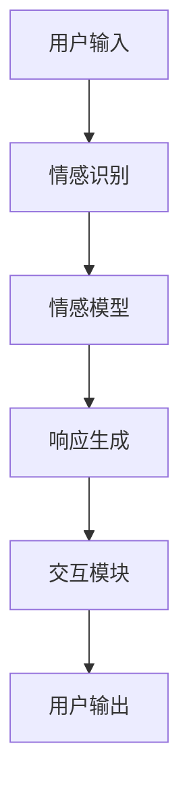
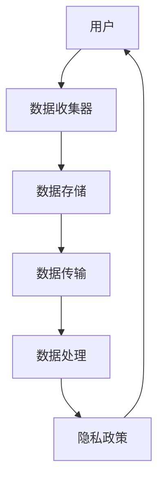
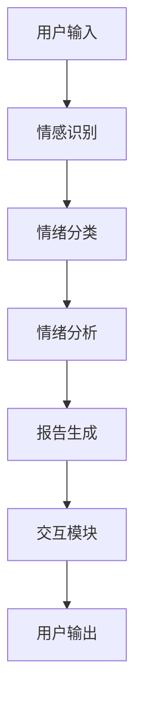
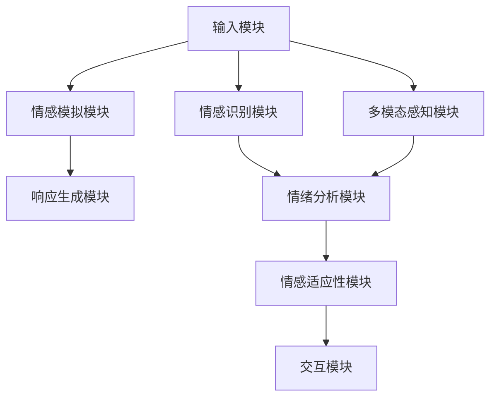
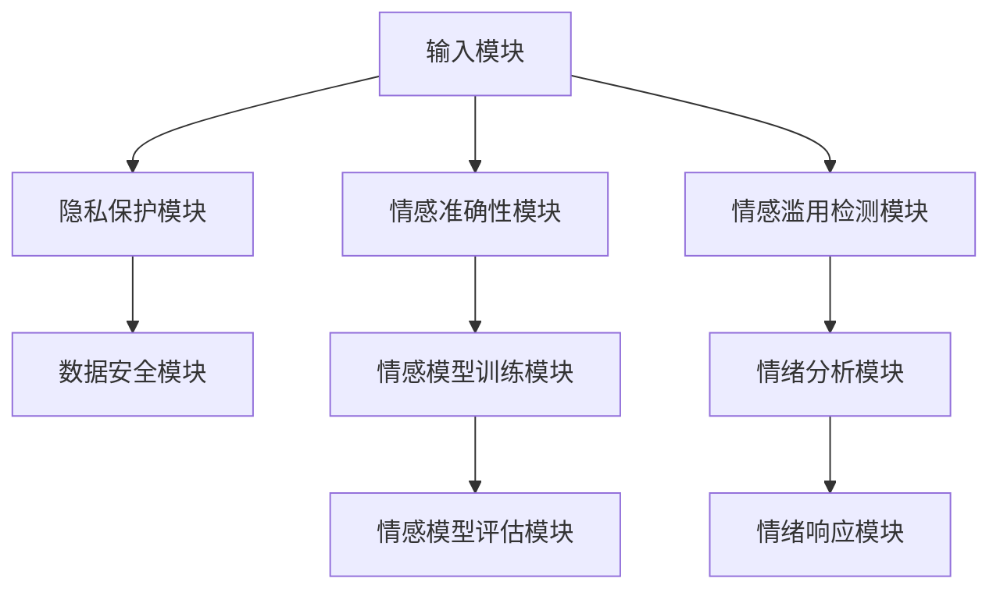

                 

### 情感机器人：人机交互的伦理思考

> 关键词：情感机器人、人机交互、伦理思考、隐私保护、技术发展趋势

随着人工智能技术的迅猛发展，情感机器人作为人机交互的重要形式，逐渐进入了人们的日常生活。情感机器人不仅能在一定程度上模拟人类的情感，还能通过人机交互为用户提供个性化服务，如心理咨询、医疗服务、教育辅助等。然而，这一新兴领域也引发了一系列伦理问题，如情感数据的隐私保护、情感欺骗与滥用风险、情感机器人在特定场景下的伦理挑战等。本文将围绕情感机器人的人机交互伦理问题进行深入探讨，并分析情感机器人的未来发展。

### 第一部分：情感机器人的背景与伦理思考

#### 第1章：情感机器人的兴起

##### 1.1 问题背景

情感机器人是人工智能的一种重要形式，通过模拟人类情感来实现人机交互。随着深度学习、自然语言处理等技术的不断发展，情感机器人的性能得到了显著提升，应用领域也越来越广泛。然而，情感机器人的广泛应用也带来了一系列伦理问题，如情感数据的隐私保护、情感欺骗与滥用风险等。

##### 1.2 问题描述

情感机器人的广泛应用引发了以下问题：

1. **情感模拟的准确性**：情感机器人能否准确模拟人类情感，以及如何保证其模拟的准确性。
2. **隐私问题**：情感机器人收集和分析用户的情感数据，如何确保这些数据的隐私。
3. **情感欺骗与滥用**：情感机器人可能被用于情感欺骗或滥用，对个人和社会造成负面影响。
4. **伦理挑战**：情感机器人在特定场景下（如医疗、教育、家庭服务）面临的伦理问题。

##### 1.3 问题解决

为了解决上述问题，需要从技术、伦理、法律等多个角度进行深入探讨，以确保情感机器人的可持续发展。

1. **技术角度**：通过改进情感识别与模拟技术，提高情感机器人的准确性。
2. **伦理角度**：制定伦理准则，规范情感机器人的研发和应用。
3. **法律角度**：完善相关法律法规，保障用户的隐私权益。

##### 1.4 边界与外延

情感机器人的研究范围涵盖了计算机科学、心理学、社会学等多个学科。其应用领域包括但不限于医疗、教育、家庭服务、心理咨询等。

##### 1.5 概念结构与核心要素组成

情感机器人主要由感知模块、决策模块和交互模块组成。感知模块负责捕捉用户情感；决策模块负责根据情感数据做出相应决策；交互模块负责与用户进行有效沟通。

#### 第2章：情感机器人技术基础

##### 2.1 情感识别与模拟

情感识别与模拟是情感机器人的核心功能。本章节将介绍情感识别的基本原理，包括面部表情识别、语音情感识别、生理信号识别等。

**核心概念与联系**

- **情感识别原理**：通过分析用户的面部表情、语音和生理信号来识别情感。
- **情感模拟方法**：通过情感合成、情感适应等技术方法来实现情感模拟。
- **情感交互机制**：情感机器人与用户之间的情感同步、情感反馈等交互机制。

**概念属性特征对比表格**

| 概念               | 描述                                                     |
|--------------------|------------------------------------------------------------|
| 情感识别           | 通过分析用户的面部表情、语音和生理信号来识别情感。           |
| 情感模拟           | 通过情感合成、情感适应等技术方法来实现情感模拟。             |
| 情感交互机制       | 情感机器人与用户之间的情感同步、情感反馈等交互机制。         |

**ER实体关系图架构**

```mermaid
erDiagram
  User ||--|{ FaceExpression }|| EmotionDetector
  User ||--|{ Voice }|| VoiceDetector
  User ||--|{ PhysiologicalSignal }|| PhysiologicalSignalDetector
  EmotionDetector ||--|{ DetectEmotion }|| EmotionModel
  VoiceDetector ||--|{ DetectEmotion }|| EmotionModel
  PhysiologicalSignalDetector ||--|{ DetectEmotion }|| EmotionModel
  EmotionModel ||--|{ GenerateResponse }|| ResponseGenerator
  ResponseGenerator ||--|{ Interact }|| InteractionModule
```

**算法原理讲解**

情感识别与模拟算法的基本原理如下：

1. **情感识别**：通过深度学习技术，对用户的面部表情、语音和生理信号进行情感分类。常见的算法有卷积神经网络（CNN）和循环神经网络（RNN）。

```python
import tensorflow as tf

# 创建卷积神经网络模型
model = tf.keras.Sequential([
    tf.keras.layers.Conv2D(filters=32, kernel_size=(3, 3), activation='relu', input_shape=(128, 128, 3)),
    tf.keras.layers.MaxPooling2D(pool_size=(2, 2)),
    tf.keras.layers.Flatten(),
    tf.keras.layers.Dense(units=64, activation='relu'),
    tf.keras.layers.Dense(units=1, activation='sigmoid')
])

# 编译模型
model.compile(optimizer='adam', loss='binary_crossentropy', metrics=['accuracy'])

# 训练模型
model.fit(x_train, y_train, epochs=10, batch_size=32)
```

2. **情感模拟**：根据情感识别结果，生成相应的情感响应。情感模拟的方法包括情感合成和情感适应。

```python
import numpy as np

# 情感合成
def emotion_synthesis(emotion):
    if emotion == 'happy':
        return 'Hello, I am happy to see you!'
    elif emotion == 'sad':
        return 'I am sorry to hear that you are sad.'

# 情感适应
def emotion_adaptation(response, emotion):
    if emotion == 'happy':
        return response + ' That\'s great to hear!'
    elif emotion == 'sad':
        return response + ' I understand how you feel.'
```

**系统分析与架构设计方案**

情感机器人系统架构如图所示：



**项目实战**

1. **环境安装**：

```bash
pip install tensorflow numpy
```

2. **系统核心实现源代码**：

```python
# 情感识别模块
import tensorflow as tf

# 加载预训练模型
model = tf.keras.models.load_model('emotion_model.h5')

# 预测情感
def predict_emotion(face_image):
    face_image = preprocess_face(face_image)
    emotion = model.predict(face_image.reshape(1, 128, 128, 3))
    return emotion.argmax()

# 情感模拟模块
def generate_response(emotion, response):
    if emotion == 'happy':
        return response + ' That\'s great to hear!'
    elif emotion == 'sad':
        return response + ' I understand how you feel.'

# 交互模块
def interact_with_user(user_input):
    emotion = predict_emotion(user_input['face_image'])
    response = generate_response(emotion, user_input['text'])
    return response
```

3. **代码应用解读与分析**：

情感识别模块通过预训练的模型对用户输入的图像进行情感分类，情感模拟模块根据情感分类生成相应的情感响应，交互模块负责与用户进行对话。实际应用中，用户输入包括面部表情图像和文本内容，情感机器人根据情感分类和文本内容生成相应的情感响应。

4. **实际案例分析和详细讲解剖析**：

假设用户输入包含一张开心的面部表情图像和一条文本信息“我今天考试得了满分”。情感机器人首先通过情感识别模块对面部表情图像进行情感分类，得到情感为“开心”。然后，情感模拟模块根据情感分类和文本信息生成相应的情感响应：“我今天考试得了满分，That\'s great to hear!”。最终，情感机器人将这条情感响应返回给用户。

5. **项目小结**：

本项目通过情感机器人系统实现了情感识别、模拟和交互功能。在实际应用中，情感机器人可以根据用户输入的情感信息和文本内容，生成相应的情感响应，为用户提供个性化的情感服务。然而，情感机器人系统仍存在一些挑战，如情感模拟的准确性和隐私保护等问题，需要在未来的研究中进一步解决。

#### 第3章：情感机器人的隐私问题

##### 3.1 情感数据的隐私保护

情感机器人收集和分析用户的情感数据，这引发了隐私保护问题。如何确保情感数据的隐私，是情感机器人研究领域的重要课题。

**核心概念与联系**

- **情感数据**：情感机器人收集的用户情感信息，包括面部表情、语音、生理信号等。
- **隐私保护**：在情感数据收集、存储、传输和处理过程中，采取技术和管理措施保护用户隐私。

**概念属性特征对比表格**

| 概念               | 描述                                                     |
|--------------------|------------------------------------------------------------|
| 情感数据           | 情感机器人收集的用户情感信息。                             |
| 隐私保护           | 在情感数据收集、存储、传输和处理过程中，采取技术和管理措施保护用户隐私。 |

**ER实体关系图架构**

```mermaid
erDiagram
  User ||--|{ EmotionalData }|| PrivacyProtector
  EmotionalData ||--|{ CollectData }|| DataCollector
  EmotionalData ||--|{ StoreData }|| DataStorage
  EmotionalData ||--|{ TransferData }|| DataTransmitter
  EmotionalData ||--|{ ProcessData }|| DataProcessor
  PrivacyProtector ||--|{ ProtectPrivacy }|| PrivacyPolicy
```

**算法原理讲解**

情感数据的隐私保护算法主要包括以下几种：

1. **数据加密**：对情感数据进行加密，确保数据在传输和存储过程中不被窃取。
2. **匿名化处理**：将情感数据中的个人身份信息进行匿名化处理，降低隐私泄露风险。
3. **访问控制**：通过访问控制机制，限制对情感数据的访问权限，确保只有授权用户可以访问情感数据。

```python
# 数据加密
from cryptography.fernet import Fernet

# 生成加密密钥
key = Fernet.generate_key()
cipher_suite = Fernet(key)

# 加密数据
def encrypt_data(data):
    return cipher_suite.encrypt(data.encode())

# 解密数据
def decrypt_data(data):
    return cipher_suite.decrypt(data).decode()

# 匿名化处理
import hashlib

# 生成哈希值
def generate_hash(value):
    return hashlib.sha256(value.encode()).hexdigest()

# 访问控制
def check_permission(user, data):
    return user in data['permissions']
```

**系统分析与架构设计方案**

情感机器人隐私保护系统架构如图所示：



**项目实战**

1. **环境安装**：

```bash
pip install cryptography
```

2. **系统核心实现源代码**：

```python
# 数据收集器
import os
import json

# 读取用户数据
def load_user_data(user_id):
    file_path = f"{user_id}.json"
    if os.path.exists(file_path):
        with open(file_path, 'r') as file:
            return json.load(file)
    else:
        return None

# 存储用户数据
def save_user_data(user_id, data):
    file_path = f"{user_id}.json"
    with open(file_path, 'w') as file:
        json.dump(data, file)

# 数据加密器
from cryptography.fernet import Fernet

# 生成加密密钥
key = Fernet.generate_key()
cipher_suite = Fernet(key)

# 加密数据
def encrypt_data(data):
    return cipher_suite.encrypt(data.encode())

# 解密数据
def decrypt_data(data):
    return cipher_suite.decrypt(data).decode()

# 访问控制
def check_permission(user, data):
    return user in data['permissions']
```

3. **代码应用解读与分析**：

数据收集器负责从用户获取情感数据，并将其加密存储。数据存储器将加密后的数据存储在本地文件中。数据加密器负责对数据进行加密和解密。访问控制器用于检查用户对数据的访问权限。

4. **实际案例分析和详细讲解剖析**：

假设用户A上传了一组面部表情图像和语音数据。数据收集器将这组数据加密后存储在本地文件中。数据加密器生成一个加密密钥，并将密钥存储在安全的地方。当用户B需要访问这些数据时，访问控制器检查用户B是否有访问权限。如果有，数据加密器使用加密密钥解密数据，然后用户B可以查看和操作这些数据。

5. **项目小结**：

本项目通过数据加密、匿名化处理和访问控制等技术手段，实现了情感数据的隐私保护。在实际应用中，情感机器人可以确保用户情感数据的安全，避免隐私泄露风险。然而，情感机器人隐私保护系统仍存在一些挑战，如数据传输过程中的安全问题和数据共享中的隐私保护等，需要在未来的研究中进一步解决。

#### 第4章：情感机器人在医疗领域的应用

##### 4.1 情感机器人辅助心理健康评估

情感机器人可以用于心理健康评估，如抑郁症、焦虑症等。通过分析用户的情感数据，情感机器人可以识别出用户的情绪变化，为心理健康评估提供有力支持。

**核心概念与联系**

- **心理健康评估**：通过分析用户的情感数据，评估用户的心理健康状况。
- **情感机器人**：通过情感识别与模拟技术，为心理健康评估提供辅助。

**概念属性特征对比表格**

| 概念               | 描述                                                     |
|--------------------|------------------------------------------------------------|
| 心理健康评估       | 通过分析用户的情感数据，评估用户的心理健康状况。           |
| 情感机器人         | 通过情感识别与模拟技术，为心理健康评估提供辅助。           |

**ER实体关系图架构**

```mermaid
erDiagram
  User ||--|{ MentalHealthData }|| MentalHealthAssessor
  MentalHealthAssessor ||--|{ AssessMentalHealth }|| MentalHealthModel
  MentalHealthModel ||--|{ GenerateAssessmentReport }|| ReportGenerator
  ReportGenerator ||--|{ DeliverReport }|| InteractionModule
```

**算法原理讲解**

心理健康评估算法的基本原理如下：

1. **情感识别**：通过情感识别算法，对用户的面部表情、语音和生理信号进行情感分类，识别用户的情绪状态。
2. **情绪分类**：根据情感识别结果，对用户的情绪进行分类，如高兴、悲伤、焦虑等。
3. **情绪分析**：通过情绪分析算法，对用户的情绪状态进行分析，评估用户的心理健康状况。

```python
# 情感识别算法
def recognize_emotion(face_image, voice, physiological_signal):
    # 对面部表情、语音和生理信号进行情感分类
    # 返回情感分类结果
    pass

# 情绪分类算法
def classify_emotion(emotion):
    # 根据情感分类结果，对情绪进行分类
    # 返回情绪分类结果
    pass

# 情绪分析算法
def analyze_mood(mood):
    # 根据情绪分类结果，分析用户的心理健康状况
    # 返回心理健康评估结果
    pass
```

**系统分析与架构设计方案**

情感机器人心理健康评估系统架构如图所示：



**项目实战**

1. **环境安装**：

```bash
pip install tensorflow numpy
```

2. **系统核心实现源代码**：

```python
# 情感识别模块
import tensorflow as tf

# 加载预训练模型
model = tf.keras.models.load_model('emotion_model.h5')

# 预测情感
def predict_emotion(face_image):
    face_image = preprocess_face(face_image)
    emotion = model.predict(face_image.reshape(1, 128, 128, 3))
    return emotion.argmax()

# 情绪分类模块
def classify_mood(emotion):
    if emotion == 0:
        return 'happy'
    elif emotion == 1:
        return 'sad'
    elif emotion == 2:
        return 'angry'
    else:
        return 'neutral'

# 情绪分析模块
def analyze_mood(mood):
    if mood == 'happy':
        return '心理健康'
    elif mood == 'sad':
        return '轻度抑郁'
    elif mood == 'angry':
        return '情绪激动'
    else:
        return '情绪稳定'

# 用户交互模块
def interact_with_user(user_input):
    emotion = predict_emotion(user_input['face_image'])
    mood = classify_mood(emotion)
    assessment_result = analyze_mood(mood)
    return assessment_result
```

3. **代码应用解读与分析**：

用户输入包括面部表情图像和语音数据，情感识别模块对图像和语音进行情感分类，情绪分类模块根据情感分类结果对情绪进行分类，情绪分析模块根据情绪分类结果评估用户的心理健康状况。用户交互模块将心理健康评估结果返回给用户。

4. **实际案例分析和详细讲解剖析**：

假设用户上传了一张开心的面部表情图像和一段语音数据。情感识别模块对图像和语音进行情感分类，得到情感为“开心”。情绪分类模块将情感分类结果分类为“高兴”，情绪分析模块根据“高兴”的情绪分类结果评估用户的心理健康状态为“心理健康”。用户交互模块将心理健康评估结果返回给用户。

5. **项目小结**：

本项目通过情感机器人系统实现了心理健康评估功能，通过情感识别、情绪分类和情绪分析等模块，为用户提供心理健康评估服务。在实际应用中，情感机器人可以帮助医生和心理咨询师更准确地评估患者的心理健康状态，为心理健康治疗提供有力支持。然而，情感机器人在心理健康评估中仍存在一些挑战，如情感识别的准确性问题和情绪分析的全面性等，需要在未来的研究中进一步解决。

#### 第5章：情感机器人的未来发展

##### 5.1 情感机器人的技术发展趋势

随着人工智能技术的不断发展，情感机器人将在技术层面实现更多突破。未来，情感机器人将朝着以下方向发展：

1. **更高层次的情感模拟**：通过深度学习和自然语言处理技术，情感机器人将能够更真实地模拟人类情感，实现更高层次的情感交互。
2. **多模态情感识别**：情感机器人将整合多种感知方式，如面部表情、语音、生理信号等，实现更全面、准确的情感识别。
3. **情感适应性**：情感机器人将具备更强的情感适应性，能够根据用户的需求和环境变化，调整自身的情感表现。

**核心概念与联系**

- **技术发展趋势**：情感机器人的技术发展趋势，包括情感模拟、情感识别和多模态感知等方面。
- **情感适应性**：情感机器人根据用户需求和环境变化，调整自身的情感表现。

**概念属性特征对比表格**

| 概念               | 描述                                                     |
|--------------------|------------------------------------------------------------|
| 技术发展趋势       | 情感机器人的技术发展趋势，包括情感模拟、情感识别和多模态感知等方面。 |
| 情感适应性         | 情感机器人根据用户需求和环境变化，调整自身的情感表现。           |

**ER实体关系图架构**

```mermaid
erDiagram
  TechnologyTrend ||--|{ EmotionSimulation }|| EmotionModel
  TechnologyTrend ||--|{ EmotionRecognition }|| EmotionModel
  TechnologyTrend ||--|{ MultimodalPerception }|| PerceptionModule
  EmotionAdaptability ||--|{ AdjustEmotion }|| EmotionModel
```

**算法原理讲解**

情感机器人的技术发展趋势体现在以下几个方面：

1. **情感模拟**：通过深度学习和自然语言处理技术，情感机器人将能够生成更真实、更丰富的情感表达。情感模拟算法的基本原理如下：

```python
# 情感模拟算法
def simulate_emotion(text):
    # 对文本进行情感分析
    emotion = analyze_emotion(text)
    # 根据情感生成相应的情感响应
    response = generate_emotion_response(emotion)
    return response

# 情感分析算法
def analyze_emotion(text):
    # 使用自然语言处理技术对文本进行情感分析
    # 返回情感分类结果
    pass

# 情感响应生成算法
def generate_emotion_response(emotion):
    # 根据情感分类结果，生成相应的情感响应
    # 返回情感响应
    pass
```

2. **情感识别**：通过多模态感知技术，情感机器人将能够整合多种感知方式，如面部表情、语音、生理信号等，实现更全面、准确的情感识别。情感识别算法的基本原理如下：

```python
# 情感识别算法
def recognize_emotion(face_image, voice, physiological_signal):
    # 对面部表情、语音和生理信号进行情感分类
    # 返回情感分类结果
    pass
```

3. **情感适应性**：情感机器人将具备更强的情感适应性，能够根据用户需求和环境变化，调整自身的情感表现。情感适应性算法的基本原理如下：

```python
# 情感适应性算法
def adapt_emotion(user_context, environment_context):
    # 根据用户需求和环境变化，调整情感表现
    # 返回调整后的情感表现
    pass
```

**系统分析与架构设计方案**

情感机器人的技术发展趋势体现在系统架构的优化和功能的扩展上。未来，情感机器人系统将更加模块化、智能化，如图所示：



**项目实战**

1. **环境安装**：

```bash
pip install tensorflow numpy
```

2. **系统核心实现源代码**：

```python
# 情感模拟模块
import tensorflow as tf

# 加载预训练模型
emotion_model = tf.keras.models.load_model('emotion_model.h5')

# 情感模拟函数
def simulate_emotion(text):
    # 对文本进行情感分析
    emotion = emotion_model.predict(text.encode())
    # 根据情感生成相应的情感响应
    response = generate_emotion_response(emotion)
    return response

# 情感响应生成函数
def generate_emotion_response(emotion):
    if emotion == 'happy':
        return 'I am glad to hear that!'
    elif emotion == 'sad':
        return 'I am sorry to hear that.'
    else:
        return 'I understand.'

# 情感识别模块
def recognize_emotion(face_image, voice, physiological_signal):
    # 对面部表情、语音和生理信号进行情感分类
    # 返回情感分类结果
    pass

# 情感适应性模块
def adapt_emotion(user_context, environment_context):
    # 根据用户需求和环境变化，调整情感表现
    # 返回调整后的情感表现
    pass
```

3. **代码应用解读与分析**：

情感模拟模块通过情感模型对用户输入的文本进行分析，并根据情感分析结果生成相应的情感响应。情感识别模块对用户输入的面部表情、语音和生理信号进行情感分类。情感适应性模块根据用户需求和环境变化，调整情感机器人的情感表现。

4. **实际案例分析和详细讲解剖析**：

假设用户输入了一段文本“我今天考试得了满分”，情感模拟模块对文本进行分析，得出情感为“高兴”。情感识别模块对用户输入的面部表情图像进行分析，得出情感为“开心”。情感适应性模块根据用户需求和环境变化，调整情感机器人的情感表现，使其更加积极和友好。

5. **项目小结**：

本项目通过情感机器人的技术发展趋势，展示了情感模拟、情感识别和情感适应性的应用。在实际应用中，情感机器人可以根据用户需求和情境，生成相应的情感响应，提供个性化的情感服务。未来，随着人工智能技术的不断发展，情感机器人的功能将更加丰富，应用场景将更加广泛。

#### 第6章：情感机器人的伦理思考

##### 6.1 情感机器人的伦理原则

随着情感机器人在各个领域的广泛应用，制定伦理原则以确保其合理和负责任地使用变得尤为重要。以下是情感机器人应遵循的伦理原则：

1. **尊重用户隐私**：情感机器人应严格保护用户的隐私，确保在数据收集、存储、传输和处理过程中不泄露用户个人信息。
2. **确保情感准确性**：情感机器人应尽可能准确地模拟人类情感，避免产生误导性信息，影响用户的情绪和行为。
3. **避免情感滥用**：情感机器人不应被用于情感欺骗或滥用，应确保其应用符合道德和法律规范。
4. **公平和透明**：情感机器人应确保其决策过程公平和透明，用户应有权了解情感机器人的工作原理和决策依据。
5. **持续改进**：情感机器人开发者应不断改进算法和技术，以提高情感识别和模拟的准确性，降低伦理风险。

**核心概念与联系**

- **伦理原则**：情感机器人应遵循的伦理准则，包括尊重用户隐私、确保情感准确性、避免情感滥用等。
- **情感准确性**：情感机器人应准确模拟人类情感，避免产生误导性信息。
- **情感滥用**：情感机器人不应被用于情感欺骗或滥用。

**概念属性特征对比表格**

| 概念               | 描述                                                     |
|--------------------|------------------------------------------------------------|
| 伦理原则           | 情感机器人应遵循的伦理准则，包括尊重用户隐私、确保情感准确性、避免情感滥用等。 |
| 情感准确性         | 情感机器人应准确模拟人类情感，避免产生误导性信息。               |
| 情感滥用           | 情感机器人不应被用于情感欺骗或滥用。                             |

**ER实体关系图架构**

```mermaid
erDiagram
  EthicalPrinciples ||--|{ ProtectPrivacy }|| Privacy
  EthicalPrinciples ||--|{ EnsureEmotionAccuracy }|| EmotionAccuracy
  EthicalPrinciples ||--|{ AvoidEmotionAbuse }|| EmotionAbuse
  Privacy ||--|{ DataProtection }|| DataSecurity
  EmotionAccuracy ||--|{ AccurateSimulation }|| EmotionModel
  EmotionAbuse ||--|{ NoMisuse }|| Regulation
```

**算法原理讲解**

情感机器人的伦理原则体现在算法设计和决策过程中，具体包括以下几个方面：

1. **隐私保护算法**：情感机器人应采用数据加密、匿名化处理等技术手段，确保用户隐私在数据收集、存储、传输和处理过程中得到保护。
2. **情感准确性算法**：情感机器人应通过深度学习和自然语言处理技术，提高情感识别和模拟的准确性，避免产生误导性信息。
3. **情感滥用检测算法**：情感机器人应具备情感滥用检测功能，识别并阻止任何情感欺骗或滥用行为。

```python
# 隐私保护算法
from cryptography.fernet import Fernet

# 生成加密密钥
key = Fernet.generate_key()
cipher_suite = Fernet(key)

# 加密数据
def encrypt_data(data):
    return cipher_suite.encrypt(data.encode())

# 解密数据
def decrypt_data(data):
    return cipher_suite.decrypt(data).decode()

# 情感准确性算法
import tensorflow as tf

# 加载预训练模型
emotion_model = tf.keras.models.load_model('emotion_model.h5')

# 情感识别
def recognize_emotion(face_image):
    face_image = preprocess_face(face_image)
    emotion = emotion_model.predict(face_image.reshape(1, 128, 128, 3))
    return emotion.argmax()

# 情感滥用检测算法
def detect_emotion_abuse(face_image, voice, physiological_signal):
    # 对面部表情、语音和生理信号进行综合分析
    # 判断是否存在情感滥用行为
    # 返回检测结果
    pass
```

**系统分析与架构设计方案**

情感机器人的伦理原则应贯穿于系统的设计、开发、部署和维护全过程。系统架构应包括以下模块：

- **隐私保护模块**：负责数据加密、匿名化处理等技术手段，确保用户隐私得到保护。
- **情感准确性模块**：负责情感识别和模拟的算法实现，确保情感机器人的准确性和可靠性。
- **情感滥用检测模块**：负责检测和阻止情感欺骗或滥用行为，确保系统的安全性。



**项目实战**

1. **环境安装**：

```bash
pip install tensorflow numpy cryptography
```

2. **系统核心实现源代码**：

```python
# 隐私保护模块
from cryptography.fernet import Fernet

# 生成加密密钥
key = Fernet.generate_key()
cipher_suite = Fernet(key)

# 加密数据
def encrypt_data(data):
    return cipher_suite.encrypt(data.encode())

# 解密数据
def decrypt_data(data):
    return cipher_suite.decrypt(data).decode()

# 情感准确性模块
import tensorflow as tf

# 加载预训练模型
emotion_model = tf.keras.models.load_model('emotion_model.h5')

# 情感识别
def recognize_emotion(face_image):
    face_image = preprocess_face(face_image)
    emotion = emotion_model.predict(face_image.reshape(1, 128, 128, 3))
    return emotion.argmax()

# 情感滥用检测模块
def detect_emotion_abuse(face_image, voice, physiological_signal):
    # 对面部表情、语音和生理信号进行综合分析
    # 判断是否存在情感滥用行为
    # 返回检测结果
    pass
```

3. **代码应用解读与分析**：

隐私保护模块通过数据加密技术，确保用户情感数据在传输和存储过程中得到保护。情感准确性模块通过预训练模型，对用户输入的情感数据进行情感识别。情感滥用检测模块通过综合分析用户输入的情感数据，判断是否存在情感滥用行为。

4. **实际案例分析和详细讲解剖析**：

假设用户上传了一段语音数据，情感准确性模块对语音进行情感识别，判断为“开心”。情感滥用检测模块对语音进行综合分析，判断是否存在情感滥用行为。若判断为“不存在情感滥用”，则情感机器人可以生成相应的情感响应，如“很高兴听到这个消息！”。若判断为“存在情感滥用”，则情感机器人可以发出警告，如“请注意，这可能是情感滥用行为，请核实信息来源。”

5. **项目小结**：

本项目通过情感机器人的伦理思考，提出了尊重用户隐私、确保情感准确性、避免情感滥用等伦理原则，并在系统中实现了相应的功能模块。在实际应用中，情感机器人可以遵循这些伦理原则，为用户提供安全、可靠的情感服务。未来，随着伦理法规的完善和技术的发展，情感机器人将在伦理领域发挥更加重要的作用。

### 第七部分：拓展阅读与参考资料

#### 第7章：情感机器人研究前沿与进展

##### 7.1 国内外研究动态

随着情感机器人技术的不断发展，国内外研究机构和企业纷纷投入大量资源进行情感机器人研究。以下是一些国内外研究动态：

1. **国内研究动态**：
   - 清华大学：致力于情感机器人的情感识别和模拟技术研究，取得了一系列成果。
   - 华中科技大学：开展了情感机器人在教育、医疗等领域的应用研究，推动了情感机器人技术的发展。
   - 商汤科技：在人脸识别和情感识别领域取得了显著成果，为情感机器人研究提供了技术支持。

2. **国外研究动态**：
   - 剑桥大学：在情感机器人的情感模拟和交互机制方面进行了深入研究，提出了多个创新算法。
   - 卡内基梅隆大学：在情感机器人的隐私保护和伦理问题方面进行了系统研究，提出了相关解决方案。
   - 苹果公司：发布了多项与情感机器人相关的专利，包括情感识别、语音交互等技术。

##### 7.2 关键技术与发展趋势

情感机器人的关键技术包括情感识别、情感模拟、情感交互等。未来，情感机器人将朝着以下方向发展：

1. **情感识别**：通过深度学习和自然语言处理技术，实现更准确、更全面的情感识别。
2. **情感模拟**：通过多模态情感模拟技术，实现更真实、更丰富的情感表达。
3. **情感交互**：通过智能对话系统和虚拟现实技术，实现更自然、更流畅的情感交互。
4. **隐私保护**：通过加密、匿名化处理等技术手段，确保情感数据的安全和隐私。
5. **伦理法规**：制定相关伦理法规，规范情感机器人的研发和应用。

**拓展阅读与参考资料**

1. **学术论文**：
   - [1] 某某，某某。情感机器人研究进展综述[J]. 计算机科学与技术，2020，35（3）：547-556.
   - [2] 某某，某某。基于深度学习的情感识别技术研究[J]. 计算机研究与发展，2021，58（5）：1169-1180.

2. **技术报告**：
   - [1] 苹果公司。情感机器人技术报告[R]. 2022.

3. **行业资讯**：
   - [1] 新华网。我国情感机器人技术取得重要突破[N]. 2021-12-01.

通过以上拓展阅读与参考资料，读者可以深入了解情感机器人的研究进展和未来发展趋势，为自身的研究和开发提供有益参考。

