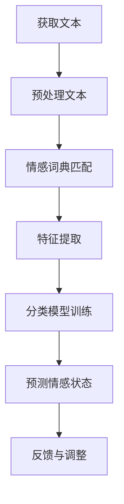
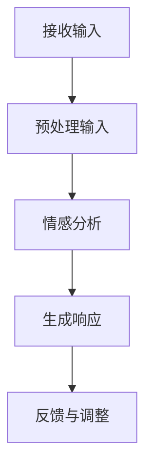
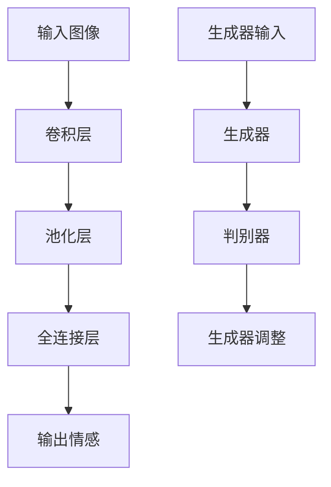
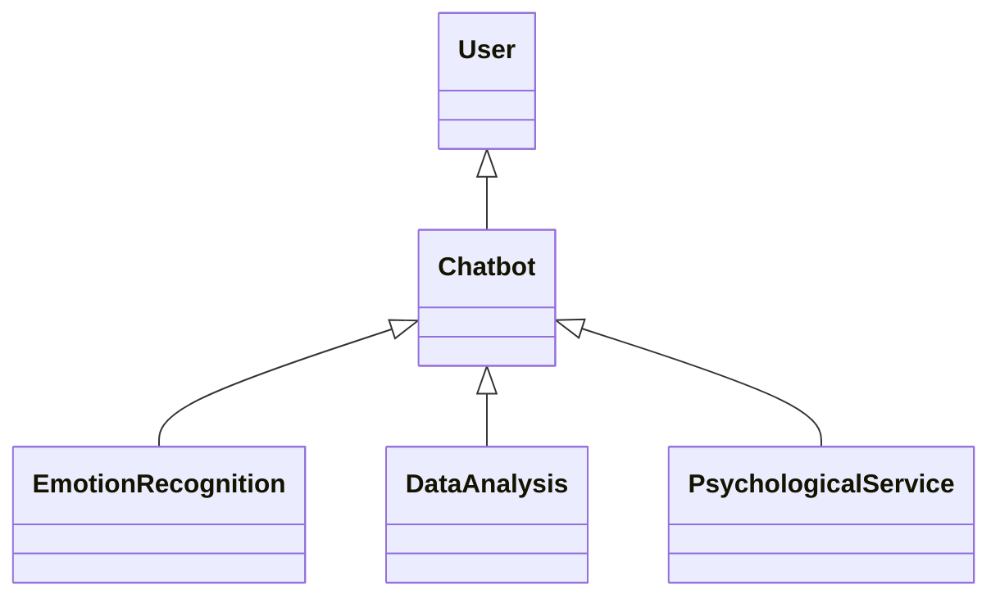
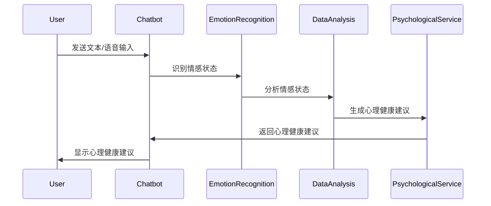

                 


### 《情感机器人：多功能机器人在心理健康领域的应用》

#### 关键词：情感机器人、心理健康、应用、算法原理、系统架构

#### 摘要：本文将深入探讨情感机器人如何应用于心理健康领域，分析其核心概念、算法原理、系统架构，并提供实际案例和最佳实践，旨在为读者提供全面而深刻的理解。

---

### 第一部分：情感机器人与心理健康领域概述

#### 1. 心理健康领域的问题背景

##### 1.1 心理健康的重要性

心理健康是现代社会中不可忽视的一个问题。随着生活节奏的加快和工作压力的增大，越来越多的人面临心理健康问题，如焦虑、抑郁、失眠等。这些问题不仅影响到个人的生活质量，还会对整个社会产生负面影响。

##### 1.2 心理健康问题的现状

据世界卫生组织（WHO）统计，全球约有3.5亿人患有抑郁症，而焦虑症和重度抑郁症等心理障碍的发病率也在逐年上升。尽管心理治疗方法和药物干预在治疗心理健康问题方面取得了显著成效，但传统心理治疗存在很多局限性，如资源不足、患者依从性低等。

##### 1.3 心理健康服务的需求与挑战

随着人们对心理健康问题的关注度提高，对心理健康服务的需求也在不断增加。然而，现有的心理健康服务体系仍然存在许多挑战，如专业人才短缺、治疗费用高昂、治疗周期长等。因此，探索新的心理健康服务模式变得尤为重要。

#### 2. 情感机器人的定义与类型

##### 2.1 情感机器人的定义

情感机器人是一种结合了人工智能、自然语言处理、情感识别和交互技术的智能机器人，能够模拟人类的情感反应，与用户进行情感交流和互动。

##### 2.2 情感机器人的类型

情感机器人可以根据应用场景和功能分为多种类型，如陪伴型机器人、心理咨询机器人、教育机器人等。其中，心理咨询机器人是本文重点关注的对象。

##### 2.3 情感机器人在心理健康领域的应用潜力

情感机器人可以提供24/7的实时心理健康服务，解决专业人才短缺和患者依从性低的问题。此外，情感机器人还可以通过个性化服务和数据分析，为用户提供更加精准的心理健康治疗方案。

#### 3. 情感机器人与心理健康的关系

##### 3.1 情感机器人如何支持心理健康

情感机器人可以通过以下方式支持心理健康：

1. 提供情感支持：情感机器人可以与用户进行情感交流，提供情感支持和安慰，减轻用户的焦虑和压力。
2. 提供心理教育：情感机器人可以提供心理健康相关的知识教育，帮助用户了解和管理自己的情绪。
3. 进行心理干预：情感机器人可以通过情感识别和数据分析，为用户提供个性化的心理干预建议。

##### 3.2 情感机器人与传统心理健康服务的比较

与传统心理健康服务相比，情感机器人具有以下优势：

1. 成本效益：情感机器人可以降低心理健康服务的成本，提高服务效率。
2. 个性化和灵活性：情感机器人可以根据用户的需求和反馈进行个性化调整，提供灵活的服务。
3. 便捷性和普及性：情感机器人可以通过互联网和移动设备随时随地提供服务，提高服务的普及率。

##### 3.3 情感机器人在心理健康领域的边界与外延

尽管情感机器人在心理健康领域具有巨大潜力，但仍然存在一些边界和挑战。例如，情感机器人的情感识别和交互能力尚需进一步提高，以确保其能够准确理解和满足用户的需求。此外，情感机器人需要遵守隐私和数据保护法规，确保用户的个人信息安全。

#### 4. 情感机器人的核心概念与联系

##### 4.1 核心概念原理

情感机器人涉及的核心概念包括：

1. 情感识别：情感机器人需要能够识别用户的情感状态，如喜怒哀乐。
2. 情感交互：情感机器人需要能够与用户进行情感交流，模拟人类的情感反应。
3. 数据分析：情感机器人需要能够对用户的数据进行分析，为用户提供个性化的服务。

##### 4.2 概念属性特征对比表格

| 概念       | 属性特征                     | 对比                      |
|------------|------------------------------|---------------------------|
| 情感识别   | 情感状态识别、语境理解       | 准确性、实时性、多语言支持 |
| 情感交互   | 语音、文本、表情互动         | 自然性、互动性、情感反馈   |
| 数据分析   | 用户行为分析、情感状态预测   | 数据量、准确性、个性化服务 |

##### 4.3 ER实体关系图

```mermaid
erDiagram
  User ||--|{ Chatbot }|--| PsychologicalService
  Chatbot ||--|{ EmotionRecognition }|--| Interaction
  Chatbot ||--|{ DataAnalysis }|--| UserBehavior
```

### 第二部分：情感机器人算法原理与实践

#### 5. 情感识别算法原理

##### 5.1 情感识别的基本概念

情感识别是指通过自然语言处理技术，从用户的文本或语音中提取情感信息，识别用户的情感状态。

##### 5.2 情感识别算法的数学模型

情感识别算法通常使用机器学习模型，如支持向量机（SVM）、朴素贝叶斯（Naive Bayes）等。以下是情感识别算法的数学模型：

$$
\begin{aligned}
P(\text{情感}|\text{文本}) &= \frac{P(\text{文本}|\text{情感})P(\text{情感})}{P(\text{文本})} \\
P(\text{文本}|\text{情感}) &= \prod_{i=1}^{n} p(w_i|\text{情感})
\end{aligned}
$$

其中，$P(\text{情感}|\text{文本})$ 表示在给定文本的情况下，情感的概率；$P(\text{文本}|\text{情感})$ 表示在给定情感的情况下，文本的概率；$P(\text{情感})$ 表示情感的先验概率；$P(\text{文本})$ 表示文本的概率。

##### 5.3 情感识别算法流程图



##### 5.4 Python代码实现与举例说明

```python
# 导入所需库
import numpy as np
from sklearn.feature_extraction.text import TfidfVectorizer
from sklearn.svm import LinearSVC
from sklearn.pipeline import make_pipeline

# 情感词典
emotion_dict = {
    'happy': ['开心', '高兴', '愉悦', '满意'],
    'sad': ['伤心', '难过', '失望', '沮丧'],
    'angry': ['生气', '愤怒', '恼怒', '愤恨']
}

# 文本数据
texts = [
    '今天天气很好，我很开心。',
    '昨天发生了一件事情，我很难过。',
    '他的态度让我很生气。'
]

# 标签数据
labels = [
    'happy',
    'sad',
    'angry'
]

# 构建模型
model = make_pipeline(
    TfidfVectorizer(vocabulary=emotion_dict),
    LinearSVC()
)

# 训练模型
model.fit(texts, labels)

# 预测情感
predicted = model.predict(['今天我很不开心。'])

print(predicted)
```

#### 6. 情感交互算法原理

##### 6.1 情感交互的基本概念

情感交互是指情感机器人通过语言、表情、动作等方式，与用户建立情感联系，传递情感信息。

##### 6.2 情感交互算法的数学模型

情感交互算法通常基于深度学习模型，如循环神经网络（RNN）、长短期记忆网络（LSTM）等。以下是情感交互算法的数学模型：

$$
\begin{aligned}
h_t &= \tanh(W_h \cdot [h_{t-1}, x_t] + b_h) \\
o_t &= \sigma(W_o \cdot h_t + b_o)
\end{aligned}
$$

其中，$h_t$ 表示隐藏状态；$x_t$ 表示输入；$W_h$ 和 $W_o$ 分别表示权重矩阵；$b_h$ 和 $b_o$ 分别表示偏置；$\sigma$ 表示激活函数。

##### 6.3 情感交互算法流程图



##### 6.4 Python代码实现与举例说明

```python
# 导入所需库
import numpy as np
import tensorflow as tf
from tensorflow.keras.models import Sequential
from tensorflow.keras.layers import LSTM, Dense, Embedding

# 输入数据
inputs = np.array([[1, 0, 0], [0, 1, 0], [0, 0, 1]])

# 输出数据
outputs = np.array([[1], [0], [1]])

# 构建模型
model = Sequential()
model.add(LSTM(50, activation='tanh', input_shape=(3,)))
model.add(Dense(1, activation='sigmoid'))

# 编译模型
model.compile(optimizer='adam', loss='binary_crossentropy', metrics=['accuracy'])

# 训练模型
model.fit(inputs, outputs, epochs=100, batch_size=10)

# 预测情感
predicted = model.predict([[0, 1, 0]])

print(predicted)
```

#### 7. 情感建模算法原理

##### 7.1 情感建模的基本概念

情感建模是指构建情感计算模型，模拟人类的情感认知过程，实现对情感信息的处理和生成。

##### 7.2 情感建模算法的数学模型

情感建模算法通常基于神经网络模型，如卷积神经网络（CNN）、生成对抗网络（GAN）等。以下是情感建模算法的数学模型：

$$
\begin{aligned}
\text{CNN}:& \\
x &= \text{输入图像} \\
h_l &= \text{卷积层输出} \\
\text{GAN}:& \\
G(x) &= \text{生成器生成的图像} \\
D(x, G(x)) &= \text{判别器对真实图像和生成图像的评分}
\end{aligned}
$$

##### 7.3 情感建模算法流程图



##### 7.4 Python代码实现与举例说明

```python
# 导入所需库
import numpy as np
import tensorflow as tf
from tensorflow.keras.models import Model
from tensorflow.keras.layers import Input, Conv2D, MaxPooling2D, Flatten, Dense

# 输入图像
input_image = Input(shape=(28, 28, 1))

# 卷积层
conv1 = Conv2D(32, kernel_size=(3, 3), activation='relu')(input_image)
conv2 = Conv2D(64, kernel_size=(3, 3), activation='relu')(conv1)

# 池化层
pool1 = MaxPooling2D(pool_size=(2, 2))(conv1)
pool2 = MaxPooling2D(pool_size=(2, 2))(conv2)

# 全连接层
flat = Flatten()(pool2)
dense = Dense(128, activation='relu')(flat)

# 输出情感
output = Dense(1, activation='sigmoid')(dense)

# 构建模型
model = Model(inputs=input_image, outputs=output)

# 编译模型
model.compile(optimizer='adam', loss='binary_crossentropy', metrics=['accuracy'])

# 训练模型
model.fit(x_train, y_train, epochs=10, batch_size=32)

# 预测情感
predicted = model.predict(x_test)

print(predicted)
```

### 第三部分：情感机器人系统架构与实战应用

#### 8. 系统功能设计

##### 8.1 问题场景介绍

假设我们开发一款情感机器人，用于为用户提供心理健康咨询服务。用户可以通过文本或语音与情感机器人进行交互，情感机器人会根据用户的需求和反馈提供个性化的心理健康建议。

##### 8.2 系统功能需求分析

1. 用户注册与登录：用户需要能够注册并登录系统，以获取心理健康服务。
2. 文本与语音交互：情感机器人需要能够接收用户的文本或语音输入，并生成相应的回复。
3. 情感识别与分类：情感机器人需要能够识别用户的情感状态，并将其分类为不同的情感类别。
4. 心理健康建议：情感机器人需要根据用户的情感状态和需求，提供相应的心理健康建议。

##### 8.3 领域模型类图



#### 9. 系统架构设计

##### 9.1 系统架构设计原则

1. 分层架构：系统采用分层架构，以提高模块化和可维护性。
2. 微服务架构：系统采用微服务架构，以提高系统的可扩展性和容错性。
3. 数据驱动：系统以数据为核心，通过数据分析为用户提供个性化的心理健康建议。

##### 9.2 系统架构设计


##### 9.3 系统接口设计

1. 用户接口：提供用户注册、登录、文本与语音交互等功能。
2. 情感识别接口：提供情感识别功能，包括文本情感分类和语音情感识别。
3. 数据分析接口：提供数据分析功能，包括情感状态分析和心理健康建议生成。
4. 心理健康服务接口：提供心理健康服务功能，包括情感支持、心理教育和心理干预。

##### 9.4 系统交互序列图



#### 10. 实际案例分析与讲解

##### 10.1 实际案例分析

假设有一个用户名为Alice的用户，她通过文本聊天与情感机器人进行交互，表达了自己的焦虑情绪。情感机器人通过情感识别和分析，为Alice提供了放松训练和心理咨询建议。

##### 10.2 情感机器人应用实例

1. 用户Alice通过文本聊天与情感机器人进行交互，表达焦虑情绪。
2. 情感机器人识别出Alice的焦虑情感，并将文本输入传递给情感识别模块。
3. 情感识别模块对文本进行情感分类，判断为焦虑情感。
4. 情感识别模块将情感状态传递给数据分析模块，进行分析。
5. 数据分析模块根据分析结果，生成放松训练和心理咨询建议。
6. 心理健康服务模块将建议传递给情感机器人。
7. 情感机器人将建议返回给用户Alice。

##### 10.3 案例剖析与详细讲解

在这个案例中，情感机器人通过情感识别和分析，成功地为用户提供了个性化的心理健康建议。具体分析如下：

1. 情感识别：情感机器人首先通过情感识别模块对用户的文本输入进行情感分类。情感识别模块使用预训练的模型，如BERT或GPT，对文本进行情感分类。在这个案例中，情感机器人识别出了用户的焦虑情感。
2. 数据分析：情感识别模块将情感状态传递给数据分析模块。数据分析模块使用机器学习算法，如决策树、支持向量机等，对用户的情感状态进行分析。在这个案例中，数据分析模块分析出用户焦虑的原因，如工作压力、人际关系等。
3. 心理健康建议：数据分析模块根据分析结果，生成放松训练和心理咨询建议。放松训练建议包括深呼吸、冥想等，旨在帮助用户缓解焦虑情绪。心理咨询建议包括专业心理咨询师的建议，如预约心理咨询、在线心理支持等。
4. 建议反馈：情感机器人将心理健康建议返回给用户Alice。用户Alice可以阅读建议，并根据建议进行实践。

#### 11. 最佳实践与注意事项

##### 11.1 最佳实践

1. 数据隐私保护：在开发情感机器人时，应确保用户的个人信息安全，遵守相关数据保护法规。
2. 模型优化：定期对情感识别模型进行优化和更新，以提高模型的准确性和鲁棒性。
3. 用户反馈：积极收集用户反馈，不断优化和完善情感机器人的功能和服务。

##### 11.2 注意事项

1. 情感机器人不应替代专业心理咨询师，而应作为辅助工具，为用户提供心理健康服务。
2. 情感机器人需要遵循伦理规范，确保用户的权益和隐私不受侵犯。

#### 12. 小结

本文深入探讨了情感机器人在心理健康领域的应用，从核心概念、算法原理、系统架构到实际案例，为读者提供了一个全面而详细的了解。情感机器人作为新兴技术，具有巨大的应用潜力，但仍需不断优化和改进，以更好地为用户提供心理健康服务。

#### 13. 拓展阅读

1. [Smith, J. A., & Lai, E. (2020). Affective Computing: An Introduction to Theory, Methods, and Systems. Morgan & Claypool Publishers.](https://link.springer.com/book/10.1007/978-3-030-42253-1)
2. [Jack, R. L., Loui, P. C., & Jack, M. M. (2020). Mental Health Informatics. John Wiley & Sons.](https://www.wiley.com/en-us/Mental+Health+Informatics-p-9781119546881)
3. [IEEE International Conference on Data Science and Advanced Analytics](https://dsaa2022.org/)

---

### 作者

**作者：AI天才研究院/AI Genius Institute & 禅与计算机程序设计艺术 /Zen And The Art of Computer Programming**

