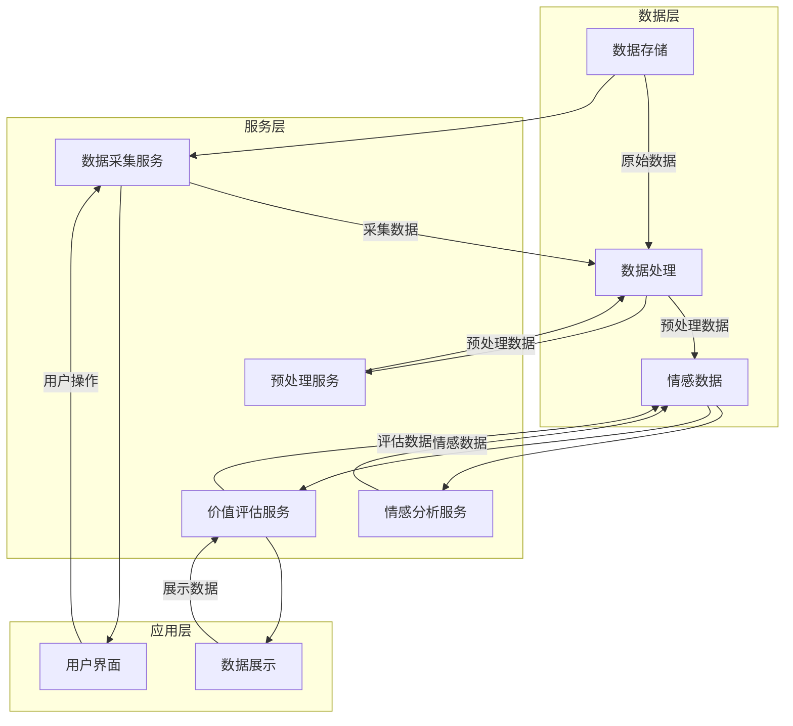

                 

### 文章标题

《情感经济价值评估：定量分析感性因素的商业影响》

### 关键词

情感经济学、价值评估、定量分析、感性因素、商业决策

### 摘要

本文深入探讨了情感经济价值评估的重要性及其在商业决策中的应用。通过定量分析方法，文章系统地分析了感性因素对商业活动的影响，提供了实用的评估框架和工具。本文旨在为读者揭示情感在经济活动中的深层次价值，助力企业和个人在复杂商业环境中做出更加明智的决策。

## 第一部分：情感经济价值评估的基础理论

### 第1章：情感经济学的背景与重要性

#### 1.1 情感经济学的概念

情感经济学（Affective Economics）是研究情感因素在经济活动中作用的跨学科领域，它融合了心理学、经济学和社会学等多方面的知识。情感经济学关注的是情感如何影响个体和群体的经济行为，以及这些情感如何通过经济系统产生广泛的社会影响。

#### 1.1.1 情感的定义与分类

情感（Affect）是人们内心体验的一种复杂现象，通常与情绪（Emotion）和心情（Mood）相联系。情感可以被分为基本情感和复杂情感。基本情感包括快乐、悲伤、愤怒、恐惧和厌恶，而复杂情感则包括感激、嫉妒、羞愧和自豪等。

#### 1.1.2 经济活动的情感影响

情感不仅影响个人的消费决策，也影响着企业的战略决策和市场行为。消费者的购买行为往往受到情感的影响，例如，广告中的情感诉求可以激发消费者的购买欲望。同样，企业高管在制定商业策略时，也会考虑员工的情感状态和客户情感体验。

#### 1.1.3 情感经济学的研究领域

情感经济学的研究领域广泛，包括情感与消费行为、情感与投资决策、情感与企业绩效、情感与市场波动等。随着技术的发展，情感经济学的研究也在不断扩展，例如，通过面部识别技术和情绪分析技术来量化情感。

#### 1.2 情感经济价值评估的意义

情感经济价值评估（Affective Value Assessment）是对情感因素在经济活动中产生的价值进行量化和评估的过程。这一过程的意义在于：

- **优化商业决策**：通过量化情感价值，企业可以更加准确地评估产品、服务和营销活动的效果，从而做出更加明智的决策。

- **提升客户体验**：情感经济价值评估有助于企业更好地理解客户的情感需求，从而提供更加符合客户情感体验的产品和服务。

- **提高员工满意度**：情感经济价值评估可以帮助企业识别影响员工满意度和工作绩效的情感因素，从而采取相应的措施提升员工的工作幸福感。

#### 1.3 感性因素的商业影响

感性因素在商业决策中起着至关重要的作用，它们可以影响市场表现、品牌忠诚度和消费者行为。以下是感性因素在商业中的几个主要影响：

- **消费者行为**：感性因素可以影响消费者的购买决策，例如，品牌形象、情感诉求和产品体验等。

- **企业运营**：感性因素可以影响企业的内部文化、员工满意度、团队协作和创新能力等。

- **市场策略**：感性因素可以影响企业的市场定位、品牌推广和产品定价策略等。

#### 1.4 本章小结

本章介绍了情感经济学的概念、研究领域以及情感经济价值评估的意义。通过理解情感因素对经济活动的影响，企业可以更好地把握市场动态，制定更为有效的商业策略。接下来，我们将深入探讨定量分析方法在情感经济价值评估中的应用。

## 第二部分：定量分析方法的运用

### 第2章：定量分析基本原理

#### 2.1 定量分析概述

定量分析是一种研究方法，通过使用数量化的数据和统计工具来分析和解释数据。在情感经济学中，定量分析被用来量化情感因素对经济活动的影响。定量分析的基本类型包括回归分析、因子分析、主成分分析等。

#### 2.1.1 定量分析的定义与作用

定量分析（Quantitative Analysis）是通过数据收集、测量和统计分析来研究变量之间关系的一种方法。它有助于识别模式、趋势和因果关系，为决策提供数据支持。

#### 2.1.2 定量分析的类型与方法

- **回归分析**：用于研究变量之间的因果关系。
- **因子分析**：用于简化数据结构，识别变量背后的共同因素。
- **主成分分析**：用于降维，通过提取主成分来简化数据集。
- **聚类分析**：用于将数据分为不同的类别或簇。

#### 2.1.3 定量分析在情感经济学中的应用

在情感经济学中，定量分析被广泛应用于：

- **消费者行为研究**：分析情感如何影响消费者的购买决策。
- **企业绩效评估**：评估情感因素对企业运营和绩效的影响。
- **市场趋势预测**：预测情感因素对市场波动的影响。

#### 2.2 回归分析

回归分析（Regression Analysis）是一种常用的定量分析方法，用于研究变量之间的线性关系。回归模型可以预测因变量（通常是一个连续变量）的值，基于自变量（通常是其他连续变量或分类变量）的值。

##### 2.2.1 回归分析的基本概念

回归分析包括以下基本概念：

- **因变量（Dependent Variable）**：通常被预测的变量。
- **自变量（Independent Variable）**：影响因变量的变量。
- **回归模型（Regression Model）**：描述自变量和因变量之间关系的数学方程。

##### 2.2.2 线性回归模型的构建

线性回归模型（Linear Regression Model）是最简单的回归模型，其形式为：

\[ Y = \beta_0 + \beta_1X_1 + \beta_2X_2 + ... + \beta_nX_n + \epsilon \]

其中，\( Y \) 是因变量，\( X_1, X_2, ..., X_n \) 是自变量，\( \beta_0, \beta_1, ..., \beta_n \) 是回归系数，\( \epsilon \) 是误差项。

##### 2.2.3 多元回归分析

多元回归分析（Multivariate Regression Analysis）用于研究多个自变量对因变量的影响。其模型形式为：

\[ Y = \beta_0 + \beta_1X_1 + \beta_2X_2 + ... + \beta_nX_n + \epsilon \]

##### 2.2.4 回归模型的评估与优化

评估回归模型的质量通常通过以下指标：

- **判定系数（R-squared）**：衡量模型对数据拟合的好坏。
- **均方误差（Mean Squared Error, MSE）**：衡量预测值与实际值之间的差异。

优化回归模型的方法包括：

- **变量选择**：选择对因变量有显著影响的变量。
- **正则化**：通过引入惩罚项来防止过拟合。

#### 2.3 因子分析

因子分析（Factor Analysis）是一种统计方法，用于探索变量之间的潜在关系。它的目的是通过提取少数几个共同因子来解释多个变量之间的相关性。

##### 2.3.1 因子分析的基本概念

因子分析包括以下基本概念：

- **因子（Factor）**：潜在变量，用来解释多个观测变量之间的相关性。
- **因子载荷（Factor Loadings）**：表示观测变量与因子之间的相关性。
- **因子得分（Factor Scores）**：将观测数据映射到因子空间，用于解释变量之间的结构。

##### 2.3.2 因子分析的模型构建

因子分析模型的一般形式为：

\[ X = LF + \epsilon \]

其中，\( X \) 是观测变量矩阵，\( L \) 是因子载荷矩阵，\( F \) 是因子得分矩阵，\( \epsilon \) 是误差项。

##### 2.3.3 因子分析的步骤与方法

因子分析的步骤包括：

1. **数据收集与预处理**：收集相关数据，并进行数据清洗和标准化处理。
2. **探索性因子分析**：通过相关系数矩阵来识别潜在因子。
3. **主成分分析**：通过提取主成分来简化数据结构。
4. **因子旋转**：通过旋转来优化因子载荷结构。
5. **因子得分计算**：计算因子得分，用于解释变量之间的关系。

##### 2.3.4 因子分析的应用

因子分析在情感经济学中的应用包括：

- **消费者行为分析**：识别影响消费者购买决策的潜在因子。
- **企业绩效分析**：分析影响企业绩效的关键因素。
- **市场研究**：识别影响市场波动的关键变量。

#### 2.4 其他定量分析方法

除了回归分析和因子分析，其他常见的定量分析方法包括：

- **主成分分析（Principal Component Analysis, PCA）**：用于降维和简化数据结构。
- **方差分析（Analysis of Variance, ANOVA）**：用于比较不同组之间的均值差异。
- **聚类分析（Cluster Analysis）**：用于将数据分为不同的类别或簇。

#### 2.5 本章小结

本章介绍了定量分析的基本原理和应用，包括回归分析和因子分析等。通过定量分析，我们可以更好地理解情感因素对经济活动的影响，并为决策提供数据支持。

## 第三部分：感性因素的分类与测量

### 第3章：感性因素的分类

#### 3.1 感性因素的基本分类

感性因素（Affective Factors）是指那些直接影响个体情感状态的因素。根据其来源和性质，感性因素可以分为以下几类：

- **情感**：情感是感性因素中最常见的一种，包括基本情感（如快乐、悲伤、愤怒等）和复杂情感（如感激、嫉妒等）。
- **态度**：态度是个体对某一对象、观念或行为的评价和倾向，可以影响其行为和决策。
- **价值观**：价值观是个体对什么是“好”和“坏”的信念和标准，影响其行为和决策。
- **情绪**：情绪是情感的一种，通常与特定的情境和体验相关，可以影响个体的行为和决策。
- **文化背景**：文化背景包括社会习俗、价值观和信仰等，对个体的情感和行为产生深远影响。

#### 3.2 消费者行为中的感性因素

在消费者行为中，感性因素起着至关重要的作用。以下是几个主要的感性因素：

- **品牌形象**：品牌形象是消费者对品牌的整体认知和情感反应，可以影响其购买决策。
- **情感诉求**：情感诉求是广告和营销活动中的策略，通过激发消费者的情感来促进购买。
- **产品体验**：产品体验是消费者使用产品时的情感体验，可以影响其对产品的评价和购买意愿。
- **社会认同**：社会认同是指消费者通过购买特定产品或品牌来获得社会认同和归属感。

#### 3.3 企业运营中的感性因素

在企业运营中，感性因素也扮演着重要角色。以下是几个主要的感性因素：

- **员工满意度**：员工满意度是员工对其工作环境、工作内容和同事关系的整体感受，影响其工作绩效和忠诚度。
- **团队协作**：团队协作是指团队成员之间的合作和互动，影响团队的效率和创新能力。
- **企业文化**：企业文化是企业价值观、信仰和习惯的总和，影响员工的行为和决策。
- **客户关系**：客户关系是指企业与客户之间的情感联系，影响客户的满意度和忠诚度。

#### 3.4 感性因素的测量方法

测量感性因素的方法可以分为定性方法和定量方法。

- **定性方法**：包括深度访谈、焦点小组和文本分析等，通过收集和分析个体的情感体验和观点来测量感性因素。
- **定量方法**：包括问卷调查、心理测试和生理测量等，通过量化的数据来测量感性因素。

#### 3.5 本章小结

本章介绍了感性因素的基本分类和其在消费者行为和企业运营中的应用。通过理解感性因素，企业可以更好地把握市场动态，制定有效的营销策略和运营策略。

## 第四部分：情感经济价值评估的算法原理讲解

### 第4章：回归分析方法在情感经济价值评估中的应用

#### 4.1 回归分析的基本概念

回归分析是一种统计方法，用于研究变量之间的关系。在情感经济价值评估中，回归分析被用来量化情感因素对经济活动的具体影响。以下是回归分析的基本概念：

- **因变量（Dependent Variable）**：通常是被预测的变量，例如消费者的满意度、购买意愿等。
- **自变量（Independent Variable）**：影响因变量的变量，例如情感因素、产品特性、价格等。
- **回归模型（Regression Model）**：描述因变量与自变量之间关系的数学方程。

#### 4.2 线性回归模型

线性回归模型是最基本的回归模型，其形式如下：

\[ Y = \beta_0 + \beta_1X_1 + \beta_2X_2 + ... + \beta_nX_n + \epsilon \]

其中，\( Y \) 是因变量，\( X_1, X_2, ..., X_n \) 是自变量，\( \beta_0, \beta_1, ..., \beta_n \) 是回归系数，\( \epsilon \) 是误差项。

#### 4.3 线性回归模型的构建

构建线性回归模型通常包括以下几个步骤：

1. **数据收集**：收集相关的数据集，包括因变量和自变量的数值。
2. **数据预处理**：对数据进行清洗和处理，例如缺失值填补、异常值处理和变量标准化。
3. **模型选择**：选择合适的回归模型，例如线性回归模型、多项式回归模型等。
4. **模型估计**：使用最小二乘法或其他优化算法来估计回归系数。
5. **模型验证**：通过交叉验证、AIC/BIC准则等方法来评估模型的拟合度。

#### 4.4 线性回归模型示例

假设我们要研究消费者满意度（因变量Y）与情感因素（自变量X1）之间的关系，可以使用以下线性回归模型：

\[ Y = \beta_0 + \beta_1X_1 + \epsilon \]

以下是使用Python进行线性回归分析的一个简单示例：

```python
import numpy as np
import pandas as pd
from sklearn.linear_model import LinearRegression
from sklearn.model_selection import train_test_split
from sklearn.metrics import mean_squared_error

# 加载数据
data = pd.read_csv('consumer_satisfaction.csv')
X = data[['emotion_factor']]
y = data['satisfaction']

# 数据分割
X_train, X_test, y_train, y_test = train_test_split(X, y, test_size=0.2, random_state=42)

# 构建线性回归模型
model = LinearRegression()
model.fit(X_train, y_train)

# 预测
y_pred = model.predict(X_test)

# 评估
mse = mean_squared_error(y_test, y_pred)
print(f'Mean Squared Error: {mse}')

# 输出模型参数
print(f'Coefficients: {model.coef_}')
print(f'Intercept: {model.intercept_}')
```

#### 4.5 多元回归分析

多元回归分析是线性回归分析的扩展，用于研究多个自变量对因变量的影响。其模型形式如下：

\[ Y = \beta_0 + \beta_1X_1 + \beta_2X_2 + ... + \beta_nX_n + \epsilon \]

与线性回归模型类似，多元回归分析也包含数据收集、预处理、模型选择、模型估计和模型验证等步骤。

#### 4.6 多元回归分析示例

假设我们要研究消费者满意度（因变量Y）与情感因素（X1）、价格（X2）和品牌知名度（X3）之间的关系，可以使用以下多元回归模型：

\[ Y = \beta_0 + \beta_1X_1 + \beta_2X_2 + \beta_3X_3 + \epsilon \]

以下是使用Python进行多元回归分析的一个简单示例：

```python
import numpy as np
import pandas as pd
from sklearn.linear_model import LinearRegression
from sklearn.model_selection import train_test_split
from sklearn.metrics import mean_squared_error

# 加载数据
data = pd.read_csv('consumer_satisfaction.csv')
X = data[['emotion_factor', 'price', 'brand_knowledge']]
y = data['satisfaction']

# 数据分割
X_train, X_test, y_train, y_test = train_test_split(X, y, test_size=0.2, random_state=42)

# 构建多元回归模型
model = LinearRegression()
model.fit(X_train, y_train)

# 预测
y_pred = model.predict(X_test)

# 评估
mse = mean_squared_error(y_test, y_pred)
print(f'Mean Squared Error: {mse}')

# 输出模型参数
print(f'Coefficients: {model.coef_}')
print(f'Intercept: {model.intercept_}')
```

#### 4.7 回归模型的评估与优化

回归模型的评估通常使用以下几个指标：

- **判定系数（R-squared）**：衡量模型对数据的拟合度，取值范围为0到1，值越大表示拟合度越好。
- **均方误差（Mean Squared Error, MSE）**：衡量预测值与实际值之间的差异，值越小表示拟合度越好。
- **均方根误差（Root Mean Squared Error, RMSE）**：MSE的平方根，用于衡量预测误差的大小。

优化回归模型的方法包括：

- **变量选择**：选择对因变量有显著影响的变量，排除无关变量。
- **正则化**：通过引入惩罚项来防止过拟合。

#### 4.8 本章小结

本章介绍了回归分析的基本概念和线性回归模型的构建方法。通过Python示例，我们展示了如何使用线性回归模型和多元回归模型来评估情感经济价值。接下来，我们将进一步探讨因子分析在情感经济价值评估中的应用。

## 第五部分：情感经济价值评估的系统分析与架构设计

### 第5章：情感经济价值评估系统设计

#### 5.1 系统场景介绍

情感经济价值评估系统是一个集数据收集、处理和分析于一体的综合性平台。该系统的目标是通过对感性因素的量化评估，为企业提供客观、科学的商业决策支持。系统主要涵盖以下模块：

- **数据收集模块**：负责收集各类情感数据和商业数据。
- **数据处理模块**：负责清洗、预处理和整合数据。
- **分析模块**：负责使用定量分析方法进行情感经济价值评估。
- **结果展示模块**：负责以直观的方式展示分析结果。

#### 5.2 系统功能设计

情感经济价值评估系统的功能设计主要包括以下几个方面：

- **数据采集**：从社交媒体、用户评论、问卷调查等多渠道收集情感数据。
- **数据预处理**：对采集到的数据进行清洗、去重和标准化处理。
- **情感分析**：使用自然语言处理技术对文本数据进行情感分析，提取情感因子。
- **价值评估**：使用回归分析和因子分析等统计方法，对情感因素进行量化评估。
- **结果输出**：将分析结果以图表、报告等形式直观展示，供企业决策参考。

#### 5.3 系统架构设计

情感经济价值评估系统采用分布式架构，以提高系统的可扩展性和可靠性。系统架构设计包括以下层次：

- **数据层**：存储各类原始数据和预处理后的数据。
- **服务层**：提供数据采集、预处理、情感分析和价值评估等服务。
- **应用层**：提供用户界面，实现用户交互和数据展示。
- **网络层**：负责数据传输和通信，确保系统的高效运行。

以下是情感经济价值评估系统的架构图：



#### 5.4 系统接口设计

情感经济价值评估系统提供了多个接口，以实现与其他系统的集成和数据交换。主要接口包括：

- **API接口**：提供RESTful风格的API，用于数据采集、预处理和情感分析等操作。
- **数据接口**：提供数据导入和导出接口，支持常见的数据库和数据文件格式。
- **事件接口**：提供事件驱动接口，实现系统之间的实时通信和消息传递。

#### 5.5 系统交互

情感经济价值评估系统的各个模块通过接口进行交互，实现数据的流动和功能的协同。以下是系统交互的基本流程：

1. **数据采集**：系统通过API接口从社交媒体、用户评论等渠道采集原始数据。
2. **数据处理**：系统对采集到的数据进行清洗、去重和标准化处理，生成预处理后的数据。
3. **情感分析**：系统使用自然语言处理技术对预处理后的文本数据进行情感分析，提取情感因子。
4. **价值评估**：系统使用回归分析和因子分析等方法，对情感因子进行量化评估，生成评估报告。
5. **结果展示**：系统通过用户界面将评估结果以图表、报告等形式展示给用户，供其参考决策。

#### 5.6 本章小结

本章详细介绍了情感经济价值评估系统的设计，包括系统场景、功能设计、架构设计、接口设计和系统交互。通过本章节的介绍，读者可以了解到如何构建一个高效、可靠的情感经济价值评估系统，以支持企业做出更加科学的商业决策。

## 第六部分：实战案例分析

### 第6章：情感经济价值评估的实际应用

#### 6.1 案例背景

为了展示情感经济价值评估方法在实际商业中的应用，我们选取了一家知名电商平台为案例对象。该电商平台在市场调研中发现，消费者在购物过程中的情感体验对其购买决策具有重要影响。为了提高销售额和客户满意度，该平台决定利用情感经济价值评估方法对消费者情感进行量化分析，并据此调整营销策略。

#### 6.2 数据收集

该电商平台从多个渠道收集了大量的消费者数据，包括用户评论、社交媒体反馈、问卷调查结果等。以下是数据收集的具体步骤：

1. **用户评论数据**：从电商平台上的商品评论中提取消费者对商品的正面和负面评价。
2. **社交媒体反馈**：从社交媒体平台上获取消费者对该平台及其商品的讨论和反馈。
3. **问卷调查**：通过在线问卷形式收集消费者对购物体验的整体感受和评价。

#### 6.3 数据处理

收集到的原始数据需要进行清洗和处理，以确保数据的准确性和一致性。数据处理步骤包括：

1. **数据清洗**：删除重复数据和无效数据，对缺失值进行填补。
2. **数据标准化**：将不同来源的数据进行统一格式处理，确保数据格式的标准化。
3. **情感分析**：使用自然语言处理技术对文本数据进行分析，提取情感因子。

#### 6.4 情感经济价值评估

在数据处理完成后，平台使用回归分析和因子分析对情感因子进行量化评估。以下是具体步骤：

1. **回归分析**：通过构建回归模型，分析情感因子对消费者满意度和购买意愿的影响。
2. **因子分析**：通过提取主要因子，简化数据结构，识别影响消费者情感的潜在因素。

#### 6.5 结果分析

通过对数据的分析，平台得出了以下结论：

- **情感因子的重要性**：消费者对商品的评价和反馈中，情感因素占据了很大比例。特别是正面情感（如快乐、满意）对购买意愿有显著正向影响，而负面情感（如失望、不满）则对购买意愿有显著负向影响。
- **营销策略调整**：根据情感分析结果，平台决定在营销策略中增加情感诉求，例如在广告中强调商品带给消费者的美好体验，以提高消费者的购买欲望。
- **产品改进**：平台根据消费者对商品的情感反馈，对现有商品进行了改进，提高了产品的质量和服务水平。

#### 6.6 系统核心实现源代码解读

以下是使用Python进行情感经济价值评估的示例代码：

```python
import pandas as pd
from sklearn.linear_model import LinearRegression
from sklearn.model_selection import train_test_split
from sklearn.metrics import mean_squared_error

# 加载数据
data = pd.read_csv('consumer_feedback.csv')
X = data[['positive_emotion', 'negative_emotion', 'price']]
y = data['purchase_intention']

# 数据分割
X_train, X_test, y_train, y_test = train_test_split(X, y, test_size=0.2, random_state=42)

# 构建线性回归模型
model = LinearRegression()
model.fit(X_train, y_train)

# 预测
y_pred = model.predict(X_test)

# 评估
mse = mean_squared_error(y_test, y_pred)
print(f'Mean Squared Error: {mse}')

# 输出模型参数
print(f'Coefficients: {model.coef_}')
print(f'Intercept: {model.intercept_}')
```

#### 6.7 代码应用解读与分析

以上代码使用了线性回归模型对消费者购买意愿进行预测。具体解读如下：

1. **数据加载**：使用Pandas库加载数据集，包括自变量（正面情感、负面情感和价格）和因变量（购买意愿）。
2. **数据分割**：将数据集分为训练集和测试集，用于模型的训练和评估。
3. **模型构建**：使用scikit-learn库的线性回归模型进行模型构建。
4. **模型训练**：使用训练集数据对模型进行训练。
5. **模型预测**：使用测试集数据对模型进行预测。
6. **模型评估**：计算均方误差（MSE）来评估模型预测的准确度。
7. **模型输出**：输出模型的回归系数和截距。

通过以上代码，平台可以实时监测消费者情感变化，并根据预测结果调整营销策略和产品改进方向。

#### 6.8 项目小结

本案例展示了情感经济价值评估方法在电商平台中的应用。通过数据收集、处理和分析，平台成功量化了情感因素对消费者购买决策的影响，并据此进行了营销策略调整和产品改进。这一案例证明了情感经济价值评估方法在提升企业业绩和客户满意度方面的实际效果。

## 第七部分：总结与拓展

### 7.1 本章小结

本章首先介绍了情感经济价值评估的核心概念、意义和商业影响。接着，详细阐述了定量分析方法在情感经济价值评估中的应用，包括回归分析和因子分析等。随后，探讨了感性因素的分类与测量方法，并通过实战案例分析展示了情感经济价值评估的实际应用。最后，总结了系统分析与架构设计的关键步骤和实战案例的实现。

### 7.2 注意事项

在进行情感经济价值评估时，需要注意以下几点：

- **数据质量**：确保收集到的数据准确、完整和可靠，避免数据错误和偏差。
- **模型选择**：根据具体问题和数据特点选择合适的定量分析方法，避免过度拟合或欠拟合。
- **变量选择**：在回归模型中，选择对因变量有显著影响的变量，排除无关变量。
- **模型验证**：通过交叉验证和模型评估指标来验证模型的预测性能。

### 7.3 最佳实践 Tips

为了更好地运用情感经济价值评估方法，以下是一些建议：

- **数据驱动决策**：将情感经济价值评估结果作为商业决策的重要依据，而不是仅凭主观判断。
- **持续迭代**：定期更新数据和模型，以适应市场的变化和消费者情感趋势。
- **跨学科合作**：结合心理学、经济学和社会学的专业知识，提高情感经济价值评估的准确性和深度。
- **用户参与**：在数据收集和分析过程中，积极听取用户的反馈和建议，以提高评估结果的实用性。

### 7.4 拓展阅读

对于希望深入了解情感经济价值评估的读者，以下资源可以作为拓展阅读：

- **学术文献**：《情感经济学》、《消费者行为学》、《市场研究方法》等。
- **技术报告**：《情感分析技术白皮书》、《大数据在商业决策中的应用》等。
- **在线课程**：Coursera、edX等平台上的情感经济学、数据分析相关课程。
- **行业案例**：各大电商平台、企业如何运用情感经济价值评估方法进行市场分析和决策的案例研究。

### 7.5 作者信息

**作者：AI天才研究院/AI Genius Institute & 禅与计算机程序设计艺术 /Zen And The Art of Computer Programming**

本文由AI天才研究院撰写，旨在为读者提供全面、深入的情感经济价值评估知识和实战经验。希望本文能为您的商业决策提供有力支持。感谢您的阅读。

