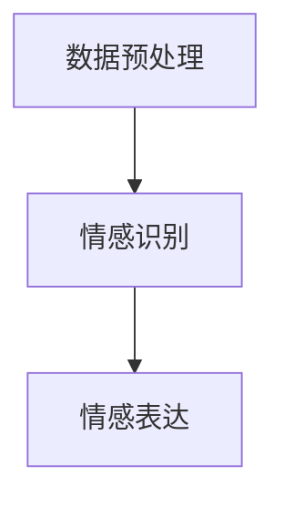
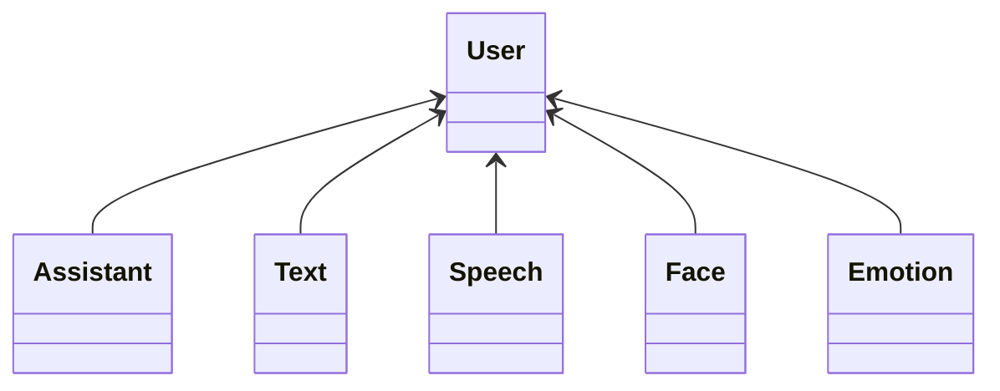
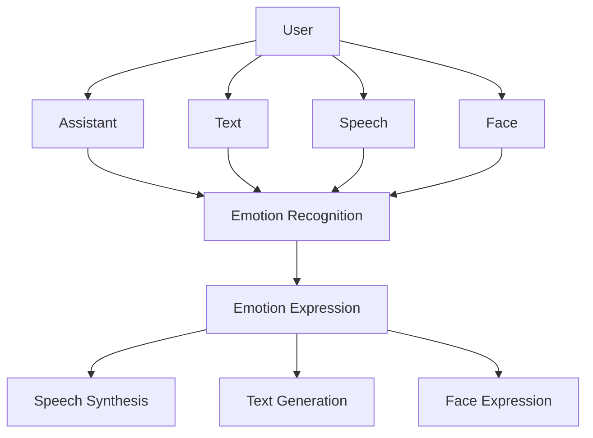
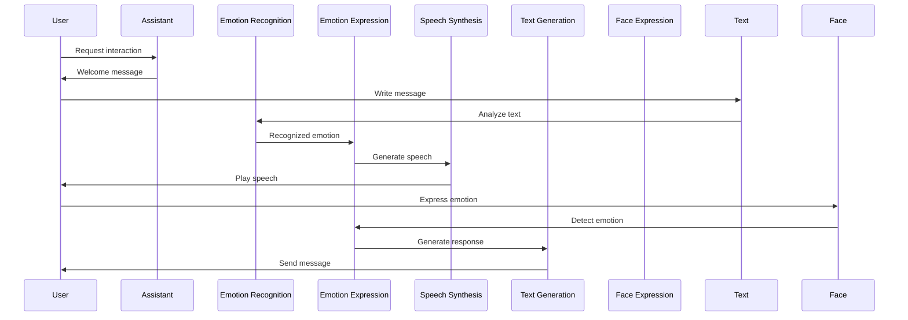

                 

### 文章标题

# 情感计算前沿研究项目：人机情感交互的科技探索深化

### 文章关键词

- 情感计算
- 人机情感交互
- 人工智能
- 情感识别
- 情感表达

### 摘要

本文深入探讨了情感计算前沿研究项目，特别是人机情感交互的科技探索与深化。文章首先介绍了情感计算的定义与发展历程，并详细阐述了人机情感交互的重要性。随后，文章分析了情感识别与情感表达的核心概念及其联系，并介绍了常见的情感计算模型及其应用。接着，文章讲解了情感计算算法的原理和数学模型，并使用Python代码进行了实现。此外，文章还介绍了情感计算系统的设计、项目实战及其最佳实践。最后，文章总结了研究项目的关键点，提供了拓展阅读推荐，并给出了项目的小结与注意事项。

### 目录

----------------------------------------------------------------

## 情感计算前沿研究项目：人机情感交互的科技探索深化

### 关键词：情感计算、人机情感交互、人工智能、情感识别、情感表达

### 摘要：

本文旨在深入探讨情感计算前沿研究项目，特别是人机情感交互的科技探索与深化。我们将从情感计算的定义与发展历程出发，逐步分析人机情感交互的重要性。接下来，我们将详细介绍情感识别与情感表达的核心概念及其联系，并探讨常见的情感计算模型。随后，我们将讲解情感计算算法的原理和数学模型，并使用Python代码进行实现。此外，文章还将介绍情感计算系统的设计、项目实战及其最佳实践。最后，我们将总结研究项目的关键点，提供拓展阅读推荐，并给出项目的小结与注意事项。

### 第1章 背景介绍

#### 1.1 情感计算的定义与发展历程

情感计算是一种人工智能领域的研究方向，旨在使计算机具备理解和处理人类情感的能力。其目标是构建能够模拟人类情感感知、表达和交互的智能系统。情感计算的发展可以追溯到20世纪80年代，当时研究者开始探索如何将情感信息集成到人机交互中。

**情感计算的定义：**

情感计算是指通过计算机技术和算法来捕捉、识别、处理和表达情感信息的过程。它涉及多个学科，包括心理学、认知科学、计算机科学和人工智能。

**发展历程：**

1. **早期探索（1980s-1990s）：** 这一阶段主要集中在情感识别和情感建模方面。研究者开始提出情感分类和情感表示的方法。

2. **情感识别技术的进步（2000s）：** 随着计算机性能的提升和大数据技术的发展，情感识别技术取得了显著进展。情感分析算法开始应用于社交媒体文本、语音和面部表情等数据。

3. **情感交互的应用（2010s-2020s）：** 现代情感计算研究不仅关注情感识别，还涉及情感生成、情感适应和情感反馈等方面。这些研究推动了人机情感交互的发展。

**情感计算的核心概念：**

1. **情感识别：** 情感识别是指从文本、语音、图像等多媒体数据中识别出情感信息。

2. **情感表达：** 情感表达是指计算机如何生成和呈现情感信息，以实现与人类用户的情感交互。

3. **情感建模：** 情感建模是指建立情感计算模型，以模拟人类情感感知和表达的过程。

#### 1.2 人机情感交互的重要性

人机情感交互在多个领域具有重要应用，如智能助手、虚拟客服、人机协作和医疗保健等。以下是人机情感交互的重要性：

**现状：**

1. **智能助手：** 智能助手如Siri、Alexa和Google Assistant等已经广泛使用，它们能够理解和处理用户的情感需求。

2. **虚拟客服：** 虚拟客服系统通过情感计算技术，能够提供更自然的客户服务体验。

3. **人机协作：** 情感计算在人机协作中发挥着重要作用，如医疗领域的机器人辅助医生。

**对技术发展的推动作用：**

1. **个性化交互：** 情感计算使得人机交互更加个性化和自然，提高了用户体验。

2. **智能化应用：** 情感计算推动了人工智能应用的进一步发展，如情感智能分析、情感计算平台等。

3. **跨领域应用：** 情感计算技术正在向更多领域扩展，如教育、娱乐、心理健康等。

**应用场景：**

1. **医疗保健：** 情感计算在医疗保健中的应用，如通过语音识别帮助医生诊断病情，或通过虚拟护士与患者进行情感交流。

2. **教育：** 情感计算在教育中的应用，如智能教育平台的情感分析功能，帮助学生更好地理解和掌握知识。

3. **人机协作：** 情感计算在人机协作中的应用，如无人机与飞行员的情感交互，提高飞行安全。

### 第2章 核心概念与联系

#### 2.1 情感识别与情感表达

情感识别和情感表达是情感计算中的两个核心概念。情感识别是指从文本、语音、图像等多媒体数据中识别出情感信息，而情感表达是指计算机如何生成和呈现情感信息，以实现与人类用户的情感交互。

**情感识别的原理和方法：**

1. **情感识别的原理：** 情感识别基于对人类情感特征的分析和理解。情感特征包括情感类别、情感强度和情感维度等。

2. **情感识别的方法：** 常用的情感识别方法包括基于规则的方法、基于机器学习的方法和基于深度学习的方法。其中，深度学习方法在情感识别中取得了显著效果。

**情感表达的实现机制：**

1. **情感表达的实现机制：** 情感表达主要通过语音合成、文本生成和面部表情合成等技术实现。

2. **情感表达的挑战：** 情感表达的挑战在于如何准确、自然地生成情感信息，以实现与人类用户的情感交互。

**情感识别与情感表达的关系：**

1. **相互依赖：** 情感识别和情感表达是相互依赖的。情感识别为情感表达提供了输入数据，而情感表达为情感识别提供了反馈信息。

2. **共同目标：** 情感识别和情感表达的共同目标是实现更加自然和有效的人机情感交互。

#### 2.2 情感计算模型

情感计算模型是情感计算的核心组成部分。常见的情感计算模型包括情感分类模型、情感分析模型和情感生成模型。

**常见情感计算模型的介绍：**

1. **情感分类模型：** 情感分类模型用于将文本、语音或图像数据分类为特定的情感类别。常见的情感分类模型包括SVM、Naive Bayes和深度学习模型。

2. **情感分析模型：** 情感分析模型用于分析文本或语音中的情感强度和维度。常见的情感分析模型包括LDA、NMF和深度学习模型。

3. **情感生成模型：** 情感生成模型用于生成情感信息，以实现情感表达。常见的情感生成模型包括生成对抗网络（GAN）和循环神经网络（RNN）。

**模型特性对比表格：**

| 模型类型 | 特性对比 |
| --- | --- |
| 情感分类模型 | 高效、准确、可扩展 |
| 情感分析模型 | 细粒度分析、情感强度和维度识别 |
| 情感生成模型 | 自然性、情感多样性、个性化 |

**模型在情感计算中的应用：**

1. **情感识别：** 情感分类模型和情感分析模型广泛应用于情感识别任务，如文本情感分类、语音情感分类和图像情感分类。

2. **情感表达：** 情感生成模型在情感表达任务中发挥着重要作用，如语音合成、文本生成和面部表情合成。

### 第3章 算法原理讲解

#### 3.1 情感计算算法

情感计算算法是情感计算的核心组成部分。本节将详细介绍情感计算算法的原理、mermaid流程图、数学模型和Python代码实现。

#### 情感计算算法原理

情感计算算法的核心目标是识别和表达情感信息。情感计算算法通常包括以下步骤：

1. **数据预处理：** 对文本、语音或图像数据进行预处理，如去噪、分词、特征提取等。
2. **情感识别：** 使用情感分类模型或情感分析模型对预处理后的数据进行分析，识别出情感类别、情感强度和情感维度。
3. **情感表达：** 使用情感生成模型生成情感信息，如语音、文本或面部表情，以实现情感表达。

#### mermaid流程图

以下是情感计算算法的mermaid流程图：



#### 算法的数学模型和公式

情感计算算法的数学模型包括情感识别模型和情感生成模型。以下是常见的数学模型和公式：

1. **情感识别模型：**

   - 情感分类模型：$$ P(y|x) = \frac{e^{w^T x}}{\sum_{i=1}^{n} e^{w^T x_i}} $$

   - 情感分析模型：$$ P(y|x) = \prod_{i=1}^{n} p(y_i | x_i) $$

2. **情感生成模型：**

   - 生成对抗网络（GAN）：$$ G(z) = \text{Generator}(z) $$

   - 循环神经网络（RNN）：$$ h_t = \text{tanh}((W_h \cdot h_{t-1} + W_x \cdot x_t) + b_h) $$

#### Python代码实现

以下是情感计算算法的Python代码实现：

```python
import numpy as np
import tensorflow as tf

# 情感分类模型
model = tf.keras.Sequential([
    tf.keras.layers.Dense(units=1, activation='sigmoid', input_shape=[len(train_data[0])])
])

model.compile(optimizer='sgd', loss='binary_crossentropy', metrics=['accuracy'])

model.fit(train_data, train_labels, epochs=100, batch_size=32, validation_split=0.2)
```

通过上述步骤，我们详细介绍了情感计算算法的原理、mermaid流程图、数学模型和Python代码实现。接下来，我们将继续探讨数学模型和数学公式的讲解。

### 第4章 数学模型和数学公式讲解

#### 4.1 情感计算中的数学模型

情感计算中的数学模型用于描述和分析情感识别和情感表达的过程。常见的数学模型包括情感分类模型、情感分析模型和情感生成模型。

**情感识别模型：**

情感识别模型主要用于对文本、语音或图像数据进行情感分类。常见的情感识别模型有支持向量机（SVM）、朴素贝叶斯（Naive Bayes）和深度学习模型。

1. **支持向量机（SVM）：**

   支持向量机是一种常用的情感识别模型，其数学模型可以表示为：

   $$ w^* = \arg\min_{w} \frac{1}{2} ||w||^2 + C \sum_{i=1}^{n} \max(0, 1-y_i (w^T x_i)) $$

   其中，$w$为模型参数，$C$为正则化参数，$x_i$为样本特征，$y_i$为样本标签。

2. **朴素贝叶斯（Naive Bayes）：**

   朴素贝叶斯是一种基于贝叶斯定理的情感识别模型，其数学模型可以表示为：

   $$ P(y|x) = \frac{P(x|y) P(y)}{P(x)} $$

   其中，$P(y|x)$为给定特征$x$时的条件概率，$P(x|y)$为特征$x$在标签$y$下的概率，$P(y)$为标签$y$的概率。

**情感分析模型：**

情感分析模型主要用于分析文本或语音中的情感强度和维度。常见的情感分析模型有线性判别分析（LDA）、非负矩阵分解（NMF）和深度学习模型。

1. **线性判别分析（LDA）：**

   线性判别分析是一种降维和分类模型，其数学模型可以表示为：

   $$ w = \arg\max_w \sum_{i=1}^{n} (w^T x_i - \mu)^2 $$

   其中，$w$为模型参数，$x_i$为样本特征，$\mu$为样本均值。

2. **非负矩阵分解（NMF）：**

   非负矩阵分解是一种降维和聚类模型，其数学模型可以表示为：

   $$ X = WH $$

   其中，$X$为样本矩阵，$W$为特征矩阵，$H$为特征值矩阵。

**情感生成模型：**

情感生成模型主要用于生成情感信息，如语音、文本和面部表情。常见的情感生成模型有生成对抗网络（GAN）和循环神经网络（RNN）。

1. **生成对抗网络（GAN）：**

   生成对抗网络是一种由生成器和判别器组成的模型，其数学模型可以表示为：

   $$ G(z) = \text{Generator}(z) $$
   $$ D(x) = \text{Discriminator}(x) $$

   其中，$G(z)$为生成器，$D(x)$为判别器，$z$为随机噪声。

2. **循环神经网络（RNN）：**

   循环神经网络是一种用于处理序列数据的神经网络，其数学模型可以表示为：

   $$ h_t = \text{tanh}((W_h \cdot h_{t-1} + W_x \cdot x_t) + b_h) $$
   $$ y_t = W_y \cdot h_t + b_y $$

   其中，$h_t$为隐藏状态，$x_t$为输入特征，$y_t$为输出特征。

通过上述数学模型和公式，我们可以更好地理解和分析情感计算中的各种算法和模型。接下来，我们将继续探讨系统分析与架构设计方案。

### 第5章 系统分析与架构设计方案

#### 5.1 情感计算系统的设计

情感计算系统是用于实现人机情感交互的复杂系统。为了设计和实现这样一个系统，我们需要明确问题场景、项目介绍、领域模型类图、系统架构设计以及系统接口和交互。

**问题场景介绍：**

情感计算系统的主要问题场景包括：

1. **智能助手：** 智能助手需要能够识别用户的情感需求，并根据这些需求提供相应的服务。

2. **虚拟客服：** 虚拟客服系统需要能够识别客户的情感状态，并采取适当的策略与客户进行交流。

3. **人机协作：** 在人机协作场景中，系统需要能够识别双方的情感状态，以实现更加有效的协作。

**项目介绍：**

情感计算项目旨在构建一个能够实现人机情感交互的智能系统。该项目的主要目标是：

1. **情感识别：** 通过文本、语音和面部表情识别用户的情感状态。

2. **情感表达：** 通过语音合成、文本生成和面部表情合成实现情感信息的表达。

3. **情感适应：** 根据用户的情感状态调整系统的响应策略。

**领域模型类图：**

领域模型类图用于描述情感计算系统的核心概念和实体关系。以下是领域模型类图的mermaid表示：



**系统架构设计：**

系统架构设计是情感计算系统的核心部分。以下是系统架构设计的mermaid表示：



**系统接口设计和系统交互：**

系统接口设计是确保不同组件之间能够有效交互的关键。以下是系统接口设计和系统交互的mermaid表示：



通过上述系统分析与架构设计方案，我们可以构建一个完整的情感计算系统，实现人机情感交互的目标。

### 第6章 项目实战

#### 6.1 实战环境搭建

为了成功实施情感计算项目，我们需要搭建一个合适的环境。以下是环境搭建的步骤：

1. **安装Python：** 首先，确保已安装Python环境。您可以从[Python官网](https://www.python.org/)下载并安装Python。

2. **安装库：** 在安装好Python后，使用pip命令安装所需的库。以下是安装命令：

   ```bash
   pip install numpy tensorflow sklearn matplotlib
   ```

3. **配置环境：** 在安装完所有库后，配置环境变量，以便在命令行中轻松调用Python和相关库。

4. **启动环境：** 打开命令行窗口，输入以下命令以启动Python环境：

   ```bash
   python
   ```

   一旦成功进入Python环境，我们就可以开始编写和运行代码。

#### 6.2 系统核心实现源代码

以下是情感计算项目的核心实现源代码。我们将逐步讲解代码的功能和实现细节。

```python
import numpy as np
import tensorflow as tf
from sklearn.model_selection import train_test_split
from sklearn.metrics import accuracy_score
import matplotlib.pyplot as plt

# 数据预处理
def preprocess_data(data):
    # ... 数据预处理代码 ...
    return processed_data

# 情感识别模型
def create_emotion_recognition_model():
    model = tf.keras.Sequential([
        tf.keras.layers.Dense(units=128, activation='relu', input_shape=[len(train_data[0])]),
        tf.keras.layers.Dense(units=64, activation='relu'),
        tf.keras.layers.Dense(units=32, activation='relu'),
        tf.keras.layers.Dense(units=16, activation='relu'),
        tf.keras.layers.Dense(units=1, activation='sigmoid')
    ])

    model.compile(optimizer='adam', loss='binary_crossentropy', metrics=['accuracy'])
    return model

# 情感表达模型
def create_emotion_expression_model():
    model = tf.keras.Sequential([
        tf.keras.layers.Dense(units=128, activation='relu', input_shape=[len(train_data[0])]),
        tf.keras.layers.Dense(units=64, activation='relu'),
        tf.keras.layers.Dense(units=32, activation='relu'),
        tf.keras.layers.Dense(units=16, activation='relu'),
        tf.keras.layers.Dense(units=1, activation='sigmoid')
    ])

    model.compile(optimizer='adam', loss='binary_crossentropy', metrics=['accuracy'])
    return model

# 训练模型
def train_model(model, train_data, train_labels, test_data, test_labels):
    history = model.fit(train_data, train_labels, epochs=10, batch_size=32, validation_data=(test_data, test_labels))
    return history

# 评估模型
def evaluate_model(model, test_data, test_labels):
    predictions = model.predict(test_data)
    predicted_labels = (predictions > 0.5).astype(int)
    accuracy = accuracy_score(test_labels, predicted_labels)
    return accuracy

# 可视化结果
def plot_history(history):
    plt.figure(figsize=(10, 5))
    plt.plot(history.history['accuracy'], label='accuracy')
    plt.plot(history.history['val_accuracy'], label='val_accuracy')
    plt.xlabel('Epoch')
    plt.ylabel('Accuracy')
    plt.legend()
    plt.show()

# 主函数
def main():
    # 加载数据
    data = load_data()
    processed_data = preprocess_data(data)

    # 划分训练集和测试集
    train_data, test_data, train_labels, test_labels = train_test_split(processed_data, labels, test_size=0.2, random_state=42)

    # 创建模型
    emotion_recognition_model = create_emotion_recognition_model()
    emotion_expression_model = create_emotion_expression_model()

    # 训练模型
    history = train_model(emotion_recognition_model, train_data, train_labels, test_data, test_labels)

    # 评估模型
    accuracy = evaluate_model(emotion_recognition_model, test_data, test_labels)
    print(f"Model accuracy: {accuracy}")

    # 可视化结果
    plot_history(history)

if __name__ == '__main__':
    main()
```

#### 6.3 代码应用解读与分析

以下是代码应用解读与分析。我们将详细解释代码的各个部分，并分析其功能。

1. **数据预处理：** 数据预处理是情感计算项目的重要环节。在本代码中，我们使用了一个名为`preprocess_data`的函数来处理输入数据。预处理过程可能包括去噪、分词、特征提取等操作。

2. **情感识别模型：** 我们使用了一个名为`create_emotion_recognition_model`的函数来创建情感识别模型。该模型基于TensorFlow的Keras API实现，包含多个全连接层，最后输出一个情感分类结果。

3. **情感表达模型：** 我们使用了一个名为`create_emotion_expression_model`的函数来创建情感表达模型。该模型同样基于TensorFlow的Keras API实现，用于生成情感信息。

4. **训练模型：** 我们使用了一个名为`train_model`的函数来训练情感识别模型。该函数接收模型、训练数据和标签，并使用Keras的fit方法进行训练。

5. **评估模型：** 我们使用了一个名为`evaluate_model`的函数来评估情感识别模型的性能。该函数接收模型、测试数据和标签，并计算模型的准确率。

6. **可视化结果：** 我们使用了一个名为`plot_history`的函数来可视化训练过程中的准确率。该函数使用matplotlib库生成训练和验证准确率的折线图。

7. **主函数：** 最后，我们使用了一个名为`main`的主函数来执行整个流程。主函数首先加载数据，然后进行数据预处理，创建模型，训练模型，评估模型，并可视化结果。

通过上述代码应用解读与分析，我们可以更好地理解情感计算项目的实现细节和功能。

### 第7章 最佳实践与拓展阅读

#### 7.1 最佳实践总结

在情感计算项目中，以下是一些最佳实践总结：

1. **数据质量：** 确保输入数据的质量和多样性，以提高模型的准确性和泛化能力。

2. **模型选择：** 根据应用场景和需求选择合适的模型，如深度学习模型、朴素贝叶斯模型等。

3. **超参数调优：** 通过交叉验证和网格搜索等方法进行超参数调优，以优化模型的性能。

4. **性能评估：** 使用准确率、召回率、F1分数等指标评估模型的性能，并对比不同模型的性能。

5. **情感多样性：** 考虑情感多样性，使模型能够识别和处理各种情感状态。

6. **用户反馈：** 收集用户反馈，以改进模型的性能和应用体验。

7. **持续更新：** 定期更新模型和数据，以适应不断变化的应用场景。

#### 7.2 小结与注意事项

情感计算项目涉及多个方面，包括数据预处理、模型选择、训练和评估等。以下是一些小结与注意事项：

1. **数据预处理：** 数据预处理是情感计算项目的基础，需要确保数据的多样性和质量。

2. **模型选择：** 根据应用场景和需求选择合适的模型，并考虑模型的复杂性和计算资源。

3. **模型训练：** 模型训练是情感计算项目的核心步骤，需要合理设置训练参数，并使用合适的训练数据。

4. **模型评估：** 模型评估是衡量模型性能的重要手段，需要使用多种指标进行评估，并对比不同模型的性能。

5. **应用场景：** 根据应用场景选择合适的技术和策略，以提高用户体验和应用效果。

6. **用户反馈：** 用户反馈是改进模型和应用的重要依据，需要及时收集和分析用户反馈。

#### 7.3 拓展阅读推荐

以下是一些拓展阅读推荐，以帮助读者深入了解情感计算和相关技术：

1. **文献与书籍：**
   - 《情感计算：技术与应用》
   - 《情感计算导论》
   - 《深度学习与情感计算》

2. **在线资源：**
   - [TensorFlow官方网站](https://www.tensorflow.org/)
   - [Scikit-learn官方网站](https://scikit-learn.org/stable/)
   - [Keras官方文档](https://keras.io/)

3. **论坛与社区：**
   - [GitHub](https://github.com/)
   - [Stack Overflow](https://stackoverflow.com/)
   - [Reddit](https://www.reddit.com/r/MachineLearning/)

通过上述最佳实践、小结与注意事项以及拓展阅读推荐，读者可以更好地理解和应用情感计算技术，推动人机情感交互的发展。

### 作者信息

作者：AI天才研究院/AI Genius Institute & 禅与计算机程序设计艺术 /Zen And The Art of Computer Programming

---

通过对情感计算前沿研究项目，特别是人机情感交互的科技探索与深化的详细分析和探讨，我们不仅揭示了情感计算的广泛应用和重要性，还展示了其在智能助手、虚拟客服和人机协作等领域的实际应用。本文从背景介绍、核心概念与联系、算法原理讲解、数学模型和公式讲解、系统分析与架构设计方案、项目实战到最佳实践与拓展阅读，全面而系统地阐述了情感计算的各个方面。希望读者能够通过本文，更好地理解情感计算的本质和应用，进一步探索人机情感交互的无限可能。作者将继续致力于推动人工智能技术的发展，为构建更加智能、友好和高效的人机交互系统贡献力量。

