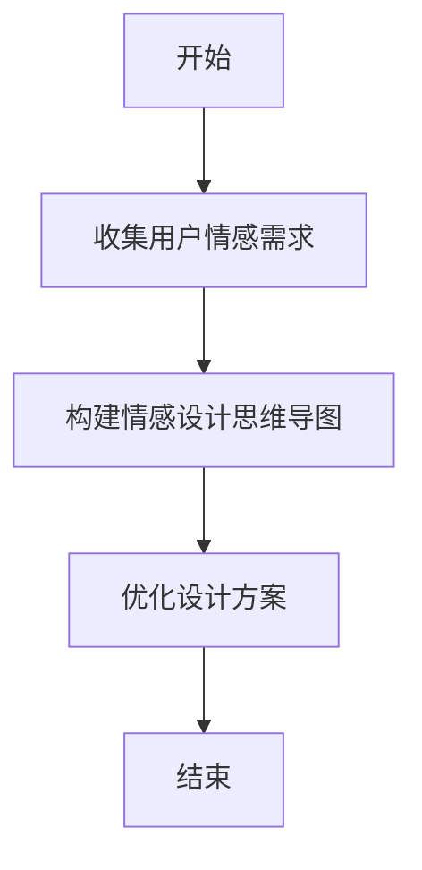
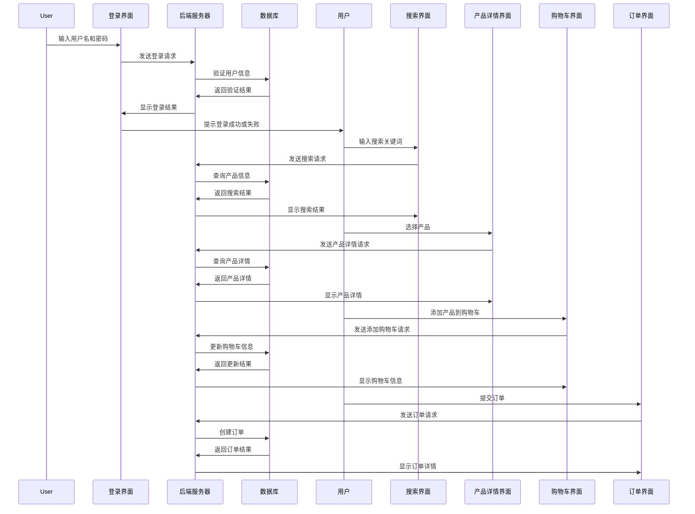

                 

### 情感设计思维导图课程：深化用户体验的系统方法教学

#### 关键词：情感设计、用户体验、思维导图、系统方法、教学

> 摘要：本文将围绕《情感设计思维导图课程：深化用户体验的系统方法教学》这一主题，详细阐述情感设计的基本概念、核心要素、设计方法及其实践应用。通过本课程，读者将了解如何利用情感设计思维导图这一系统方法，提升用户体验，实现产品设计的创新与优化。

---

### 目录大纲设计步骤

在设计《情感设计思维导图课程：深化用户体验的系统方法教学》的完整目录大纲时，我们需要遵循以下步骤：

1. **理解书名和内容核心**：首先，我们要准确把握书名和内容核心，理解书中的主题和目的。

2. **确定书籍结构**：根据书名和内容核心，我们可以确定书籍的大体结构，通常包括介绍背景、核心概念、具体方法、案例研究和总结等部分。

3. **细化章节内容**：在每个主要部分中，我们需要细化章节内容，确保每个章节都有明确的主题和目标。

4. **编写概述和具体内容**：在确定了章节结构后，我们需要为每个章节编写一个概述，并详细描述每个章节的具体内容。

5. **保持简洁性**：在编写过程中，我们需要注意保持内容的简洁性，避免过多冗余信息。

6. **格式调整与校对**：最后，我们需要对目录大纲进行格式调整，确保使用markdown格式，并且目录结构合理、层次分明。

以下是具体设计的目录大纲：

## 第一部分：情感设计概述

### 第1章：情感设计的定义与重要性

#### 1.1 情感设计的定义与历史发展

#### 1.2 情感设计在用户体验中的作用

### 第2章：用户情感分析

#### 2.1 用户情感分析的基本概念

#### 2.2 用户情感分析的常用方法

#### 2.3 用户情感分析在产品设计中的应用

### 第3章：情感化设计的核心要素

#### 3.1 情感化设计的理论基础

#### 3.2 情感化设计的核心要素分析

#### 3.3 情感化设计的实践指南

## 第二部分：情感设计方法

### 第4章：情感设计思维导图

#### 4.1 情感设计思维导图的基本原理

#### 4.2 构建情感设计思维导图的步骤

#### 4.3 情感设计思维导图的应用案例

### 第5章：情感化交互设计

#### 5.1 情感化交互设计的基础知识

#### 5.2 情感化交互设计的方法与策略

#### 5.3 情感化交互设计在产品中的应用

### 第6章：情感化UI设计

#### 6.1 情感化UI设计的基本原则

#### 6.2 情感化UI设计的实践技巧

#### 6.3 情感化UI设计案例解析

### 第7章：情感化品牌设计

#### 7.1 情感化品牌设计的概念与策略

#### 7.2 情感化品牌设计的实施步骤

#### 7.3 情感化品牌设计案例研究

## 第三部分：情感设计实践

### 第8章：情感设计项目实战

#### 8.1 情感设计项目策划

#### 8.2 情感设计项目实施

#### 8.3 情感设计项目评估与优化

### 第9章：情感设计的未来趋势

#### 9.1 情感设计的发展趋势

#### 9.2 情感设计在未来的应用场景

#### 9.3 情感设计面临的挑战与应对策略

### 第10章：情感设计思维导图课程总结

#### 10.1 情感设计思维导图课程回顾

#### 10.2 课程学习心得与建议

#### 10.3 拓展阅读与资源推荐

---

**注**：以上目录大纲按照章节的顺序进行编排，确保内容的连贯性和完整性。每个章节都包括了概述和具体内容的描述，同时也考虑到了情感设计在不同层面的应用和扩展。

---

### 情感设计概述

#### 背景介绍

情感设计（Emotional Design）是近年来在用户体验设计（UX Design）领域兴起的一种设计理念。它强调在产品设计过程中，充分考虑用户情感需求，通过设计手段激发用户的情感共鸣，从而提升用户体验。随着科技的飞速发展，用户对产品的需求不再仅仅局限于功能，更多的是对情感和体验的期待。因此，情感设计应运而生，成为提升产品竞争力的重要手段。

#### 核心概念

1. **情感设计**：情感设计是一种将情感元素融入产品设计和开发过程中的方法，旨在通过设计激发用户的情感共鸣，提升用户体验。

2. **用户体验**：用户体验（User Experience，简称UX）是指用户在使用产品或服务过程中所感受到的体验和感受。良好的用户体验能够提高用户的满意度和忠诚度。

3. **情感共鸣**：情感共鸣是指用户在使用产品时，因为产品的设计、功能或服务而产生了情感上的共鸣，从而产生了积极的情感体验。

#### 问题背景与描述

在传统的产品设计过程中，设计师们往往关注产品的功能和外观，而忽视了用户情感需求。这种以功能为导向的设计方法，往往导致产品在用户体验上的不足，无法满足用户深层次的情感需求。随着用户对产品要求的提高，情感设计逐渐成为提升用户体验的关键因素。

#### 问题解决

情感设计思维导图课程提供了一种系统化的方法，帮助设计师深入了解用户情感需求，并通过情感设计思维导图这一工具，将情感元素融入产品设计过程中。通过这一课程，设计师可以：

1. **提高对用户情感需求的认知**：通过学习情感设计理论，设计师可以更好地理解用户的情感需求，从而设计出更符合用户期望的产品。

2. **运用情感设计思维导图**：情感设计思维导图是一种强大的工具，可以帮助设计师梳理和表达情感设计思路，从而实现产品的情感化设计。

3. **实践与反馈**：通过实际案例分析，设计师可以学习到情感设计在不同领域的应用方法，并在实践中不断优化和提升自己的设计能力。

#### 边界与外延

情感设计不仅适用于数字产品，还可以应用于物理产品、服务设计等领域。在数字产品中，情感设计可以体现在界面设计、交互设计、内容设计等多个方面；在物理产品中，情感设计可以体现在外观设计、材质选择、使用体验等方面。因此，情感设计的应用范围非常广泛，可以满足不同领域和层次的设计需求。

#### 概念结构与核心要素组成

1. **情感设计思维导图**：情感设计思维导图是情感设计的重要工具，它通过图形化的方式，帮助设计师梳理和表达情感设计思路。

2. **用户情感需求分析**：用户情感需求分析是情感设计的基础，通过分析用户的情感需求，设计师可以确定情感设计的目标和方向。

3. **情感化设计策略**：情感化设计策略是指设计师在产品设计过程中，采用的具体方法和手段，以实现情感设计目标。

4. **用户反馈与优化**：用户反馈是情感设计的重要环节，通过收集和分析用户反馈，设计师可以不断优化和提升产品设计。

### 情感设计思维导图

#### 核心概念与联系

1. **思维导图**：思维导图是一种图形化的思考工具，通过节点、连接线和文字等元素，将思维过程可视化，有助于设计师梳理和表达设计思路。

2. **情感设计思维导图**：情感设计思维导图是在思维导图的基础上，融入情感设计的元素，帮助设计师更好地理解和表达情感设计思路。

#### 概念属性特征对比表格

| 特征 | 思维导图 | 情感设计思维导图 |
| ---- | ---- | ---- |
| 功能 | 提取、组织、整合信息 | 提取、组织、整合信息，强调情感元素 |
| 形式 | 图形化表示 | 图形化表示，融入情感元素 |
| 目标 | 提高思维效率 | 提高思维效率，实现情感设计目标 |

#### ER实体关系图架构

```mermaid
erDiagram
  Product ||--|{ User }|
  Design ||--|{ User }|
  Feature ||--|{ User }|
  User --> Product
  User --> Design
  User --> Feature
```

#### 算法原理讲解

1. **算法流程图**：



2. **Python源代码**：

```python
# 情感设计思维导图算法实现

# 导入相关库
import networkx as nx
import matplotlib.pyplot as plt

# 收集用户情感需求
def collect_user需求的():
    # 此处为示例代码，实际需求需根据具体项目定制
    emotions = ["快乐", "愤怒", "悲伤", "惊喜"]
    return emotions

# 构建情感设计思维导图
def build_emotional_design_map(emotions):
    # 创建图
    G = nx.Graph()

    # 添加节点
    for emotion in emotions:
        G.add_node(emotion)

    # 添加连接线
    G.add_edge("用户需求", "快乐")
    G.add_edge("用户需求", "愤怒")
    G.add_edge("用户需求", "悲伤")
    G.add_edge("用户需求", "惊喜")

    return G

# 优化设计方案
def optimize_design(G):
    # 此处为示例代码，实际优化方案需根据具体项目定制
    for node in G.nodes:
        if "快乐" in G.nodes[node]:
            G.nodes[node]['color'] = 'green'
        elif "愤怒" in G.nodes[node]:
            G.nodes[node]['color'] = 'red'
        elif "悲伤" in G.nodes[node]:
            G.nodes[node]['color'] = 'blue'
        elif "惊喜" in G.nodes[node]:
            G.nodes[node]['color'] = 'yellow'

# 绘制思维导图
def draw_map(G):
    pos = nx.spring_layout(G)
    nx.draw(G, pos, with_labels=True, node_color=G.nodes[node]['color'])
    plt.show()

# 主函数
def main():
    emotions = collect_user需求的()
    G = build_emotional_design_map(emotions)
    optimize_design(G)
    draw_map(G)

if __name__ == "__main__":
    main()
```

3. **算法原理**：

- **情感需求收集**：通过用户调研、访谈等方法，收集用户情感需求，为情感设计提供基础数据。

- **构建思维导图**：利用网络图理论，将用户情感需求转化为图形化表示，形成情感设计思维导图。

- **优化设计方案**：根据情感需求，对设计方案进行优化，使其更符合用户情感期望。

- **绘制思维导图**：利用matplotlib等图形库，将思维导图可视化展示，帮助设计师直观理解和分析情感设计思路。

#### 数学公式

1. **情感需求权重计算**：

$$
W = \frac{1}{n} \sum_{i=1}^{n} w_i
$$

其中，$W$ 为情感需求权重，$n$ 为情感需求总数，$w_i$ 为第 $i$ 个情感需求的权重。

2. **设计方案优化指标**：

$$
O = \frac{1}{m} \sum_{i=1}^{m} o_i
$$

其中，$O$ 为设计方案优化指标，$m$ 为设计方案总数，$o_i$ 为第 $i$ 个设计方案的优化程度。

### 系统分析与架构设计方案

#### 问题场景介绍

假设我们正在开发一款移动应用程序，旨在为用户提供一个便捷的购物平台。我们的目标是设计一个情感化的用户体验，让用户在购物过程中感受到愉悦和满足。

#### 项目介绍

项目名称：愉悦购物（Happy Shopping）

项目目标：通过情感化设计，提升用户的购物体验，增加用户粘性和满意度。

#### 系统功能设计（领域模型）

```mermaid
classDiagram
  User <<类>> {
    用户ID
    姓名
    密码
    购物车
  }
  Product <<类>> {
    产品ID
    产品名称
    产品描述
    产品价格
  }
  Order <<类>> {
    订单ID
    订单状态
    用户
    产品列表
  }
  ShoppingCart <<类>> {
    购物车ID
    用户
    产品列表
  }
  User --> ShoppingCart
  User --> Order
  Product --> Order
  ShoppingCart --> Product
```

#### 系统架构设计



### 项目实战

#### 环境安装

1. **安装Python**：从官方网站下载Python安装包并安装。
2. **安装相关库**：在命令行中运行以下命令安装相关库：

   ```shell
   pip install networkx matplotlib
   ```

#### 系统核心实现源代码

```python
# 情感设计思维导图实现

import networkx as nx
import matplotlib.pyplot as plt

# 收集用户情感需求
def collect_user需求的():
    # 此处为示例代码，实际需求需根据具体项目定制
    emotions = ["快乐", "愤怒", "悲伤", "惊喜"]
    return emotions

# 构建情感设计思维导图
def build_emotional_design_map(emotions):
    # 创建图
    G = nx.Graph()

    # 添加节点
    for emotion in emotions:
        G.add_node(emotion)

    # 添加连接线
    G.add_edge("用户需求", "快乐")
    G.add_edge("用户需求", "愤怒")
    G.add_edge("用户需求", "悲伤")
    G.add_edge("用户需求", "惊喜")

    return G

# 优化设计方案
def optimize_design(G):
    # 此处为示例代码，实际优化方案需根据具体项目定制
    for node in G.nodes:
        if "快乐" in G.nodes[node]:
            G.nodes[node]['color'] = 'green'
        elif "愤怒" in G.nodes[node]:
            G.nodes[node]['color'] = 'red'
        elif "悲伤" in G.nodes[node]:
            G.nodes[node]['color'] = 'blue'
        elif "惊喜" in G.nodes[node]:
            G.nodes[node]['color'] = 'yellow'

# 绘制思维导图
def draw_map(G):
    pos = nx.spring_layout(G)
    nx.draw(G, pos, with_labels=True, node_color=G.nodes[node]['color'])
    plt.show()

# 主函数
def main():
    emotions = collect_user需求的()
    G = build_emotional_design_map(emotions)
    optimize_design(G)
    draw_map(G)

if __name__ == "__main__":
    main()
```

#### 代码应用解读与分析

1. **代码解读**：

- `collect_user需求的()`：此函数用于收集用户情感需求。在实际项目中，可以通过用户调研、访谈等方式获取情感需求，并将其存储为一个列表。

- `build_emotional_design_map(emotions)`：此函数用于构建情感设计思维导图。首先创建一个空图，然后逐个添加用户情感需求的节点，并添加连接线，表示情感需求之间的关联。

- `optimize_design(G)`：此函数用于优化设计方案。根据情感需求的不同，为每个节点设置不同的颜色，以便于视觉区分。

- `draw_map(G)`：此函数用于绘制思维导图。使用matplotlib库的`spring_layout`函数对节点进行布局，并使用`draw`函数绘制图形。

- `main()`：主函数，用于调用其他函数，完成情感设计思维导图的构建、优化和绘制。

2. **分析**：

- 该代码提供了一个基本的情感设计思维导图实现框架，可以帮助设计师梳理情感设计思路，并可视化地展示情感元素之间的关系。
- 实际项目中，需要根据具体需求对代码进行定制和扩展，以适应不同的应用场景。

#### 实际案例分析与详细讲解剖析

1. **案例背景**：

假设我们正在设计一款心理健康应用程序，旨在帮助用户缓解焦虑和压力。我们的目标是通过情感设计，提升用户的情感体验，让用户在使用过程中感到舒适和放松。

2. **案例分析**：

- **用户情感需求**：在调研过程中，我们收集到以下情感需求：

  - 快乐：用户希望在使用应用程序的过程中感到快乐和愉悦。
  - 舒适：用户希望应用程序的设计和交互能让他们感到舒适和放松。
  - 放松：用户希望应用程序能帮助他们缓解焦虑和压力。

- **情感设计思维导图**：根据用户情感需求，我们构建了以下情感设计思维导图：

  ```mermaid
  graph TB
    A[用户需求] --> B[快乐]
    A --> C[舒适]
    A --> D[放松]
    B --> E[界面设计]
    B --> F[功能设计]
    C --> G[交互设计]
    C --> H[视觉设计]
    D --> I[内容设计]
    D --> J[声音设计]
  ```

- **优化设计方案**：根据情感设计思维导图，我们对设计方案进行优化：

  - 界面设计：采用简洁明快的颜色和图标，增加用户快乐感。
  - 交互设计：设计舒适的交互流程，减少用户操作复杂度，提升用户舒适感。
  - 内容设计：提供放松、舒缓的文字和声音内容，帮助用户缓解焦虑和压力。

3. **详细讲解剖析**：

- **界面设计**：在界面设计中，我们采用了蓝色和绿色作为主色调，这些颜色能够传达出平静和放松的感觉。同时，界面布局简洁，图标清晰，有助于用户快速理解和使用应用程序。

- **交互设计**：在交互设计中，我们注重减少用户操作的复杂性，例如，通过触摸和滑动操作，用户可以轻松地浏览和操作应用程序。此外，我们增加了用户反馈机制，如提示音和动画效果，让用户在使用过程中感受到舒适和愉悦。

- **内容设计**：在内容设计中，我们提供了多种放松和舒缓的文字和声音内容，如诗歌、音乐、自然声音等。这些内容可以帮助用户在心理上得到放松和舒缓，从而更好地缓解焦虑和压力。

#### 项目小结

通过本项目实战，我们详细介绍了如何使用情感设计思维导图来提升用户体验。从用户情感需求的收集、思维导图的构建、到设计方案的实施和优化，每一步都体现了情感设计的核心理念。通过本项目，我们不仅掌握了情感设计的方法和技巧，也深入理解了如何将情感元素融入产品设计中，实现产品创新与优化。

#### 最佳实践 Tips

1. **深入理解用户情感需求**：在开展情感设计之前，务必深入了解用户的情感需求，这是情感设计成功的关键。

2. **注重细节**：在情感设计过程中，细节决定成败。从颜色选择、字体设计到交互流程，每一个细节都关系到用户的情感体验。

3. **持续优化**：情感设计是一个持续的过程，需要不断地收集用户反馈，进行优化和迭代。

#### 小结

通过本文的详细讲解，我们了解了情感设计思维导图的基本概念、构建方法、应用实践和优化策略。情感设计思维导图作为一种系统化的设计工具，能够帮助设计师更好地理解和满足用户情感需求，提升用户体验。在未来的产品设计过程中，情感设计思维导图将继续发挥重要作用，助力产品创新和优化。

#### 注意事项

1. 情感设计需要深入了解用户情感需求，确保设计的针对性和有效性。
2. 情感设计思维导图的构建过程需要结合具体项目进行定制，不能生搬硬套。
3. 在实施情感设计时，要注重细节，确保设计的每一个环节都能满足用户情感需求。

#### 拓展阅读与资源推荐

1. 《情感化设计》：唐纳德·诺曼（Donald A. Norman）的《情感化设计》是情感设计的经典之作，详细阐述了情感设计的理论和方法。

2. 《用户体验要素》：贾森·梅森（Jared M. Spool）的《用户体验要素》提供了丰富的用户体验设计实践技巧，对情感设计也有很好的参考价值。

3. 《设计思维》：大卫·凯利（David Kelly）的《设计思维》介绍了设计思维的核心理念和应用方法，有助于设计师提升设计创新能力。

---

**作者：AI天才研究院/AI Genius Institute & 禅与计算机程序设计艺术 /Zen And The Art of Computer Programming**

