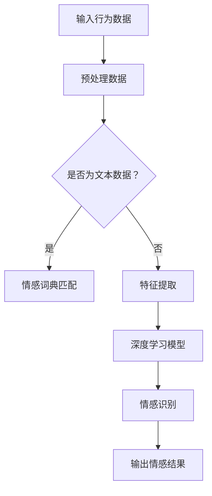
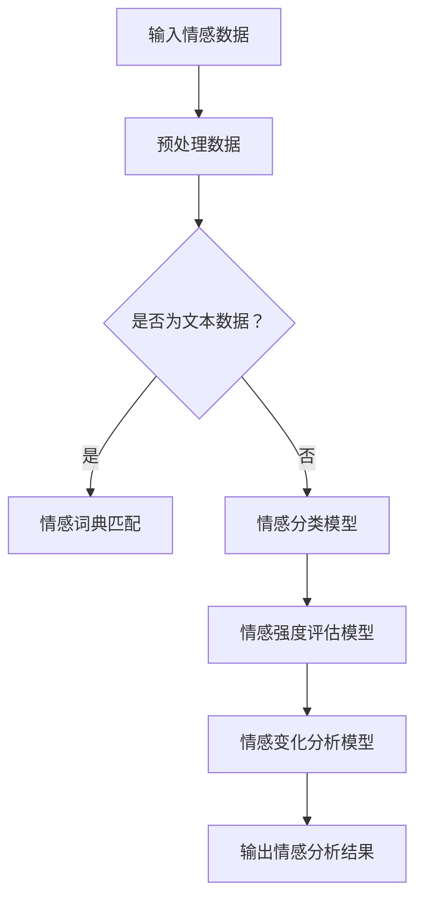
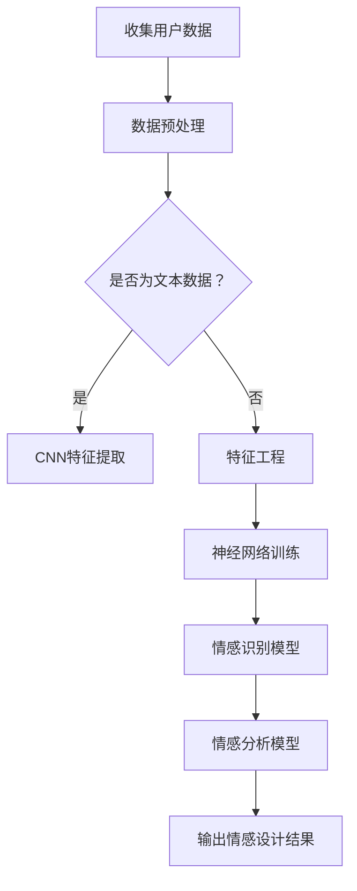
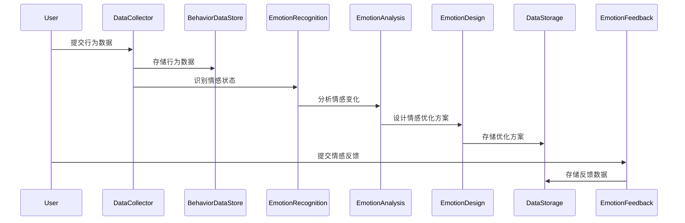

                 

### 审题与理解需求

**题目要求**：

- **书名**：《情感设计思维导图：深化用户体验的系统方法》
- **核心主题**：情感设计、用户体验、系统方法
- **书籍类型**：技术书籍，侧重于方法与实践

**核心内容要求**：

- 阐述情感设计与用户体验的关系
- 提供情感设计的算法原理讲解
- 介绍情感设计的数学模型
- 分析情感设计的系统架构
- 实战项目演示
- 提供最佳实践与拓展

**文章格式要求**：

- 字数：10000-12000字
- 使用Markdown格式
- 文章末尾需附上作者信息
- 内容完整，逻辑清晰，语言专业

### 大纲设计过程

#### 第一步：初步框架搭建

在理解题目要求后，我们首先需要搭建文章的整体框架。这个框架将涵盖从背景介绍、核心概念、算法原理到系统架构设计，以及项目实战和最佳实践等各个部分。

#### 第二步：章节划分与标题拟定

根据文章的整体框架，我们将文章划分为以下几个主要部分：

1. **情感设计与用户体验概述**
   - 情感设计的定义与重要性
   - 用户体验的定义与核心要素
   - 情感设计与用户体验的关系

2. **情感设计与用户体验的核心概念**
   - 情感用户画像
   - 情感交互设计
   - 情感设计流程与方法

3. **情感设计的算法原理**
   - 情感识别算法原理
   - 情感分析算法原理
   - 情感设计的机器学习算法
   - 算法流程图

4. **情感设计的数学模型**
   - 情感分析的数学模型
   - 数学公式与详细讲解
   - 举例说明

5. **情感设计的系统分析与架构设计**
   - 情感设计系统的功能需求
   - 领域模型类图
   - 系统架构设计
   - 系统接口设计
   - 系统交互序列图

6. **情感设计项目实战**
   - 项目介绍
   - 环境安装与配置
   - 系统核心实现
   - 代码应用解读与分析
   - 实际案例分析与讲解
   - 项目小结

7. **情感设计的最佳实践与拓展**
   - 情感设计的最佳实践
   - 注意事项与常见问题
   - 拓展阅读与资源推荐

#### 第三步：内容细化与逻辑梳理

在章节划分和标题拟定后，我们需要进一步细化每个章节的内容，确保各部分内容逻辑清晰，条理分明。以下是各个章节的内容细化：

1. **情感设计与用户体验概述**
   - **1.1 情感设计的定义与重要性**：介绍情感设计的定义，分析其在用户体验中的重要性。
   - **1.2 用户体验的定义与核心要素**：阐述用户体验的定义，以及用户体验的核心要素。
   - **1.3 情感设计与用户体验的关系**：分析情感设计与用户体验之间的联系和作用。

2. **情感设计与用户体验的核心概念**
   - **2.1 情感用户画像**：介绍情感用户画像的概念，以及如何构建情感用户画像。
   - **2.2 情感交互设计**：阐述情感交互设计的原则和方法。
   - **2.3 情感设计流程与方法**：介绍情感设计的基本流程和常用方法。

3. **情感设计的算法原理**
   - **3.1 情感识别算法原理**：介绍情感识别算法的基本原理。
   - **3.2 情感分析算法原理**：分析情感分析算法的工作机制。
   - **3.3 情感设计的机器学习算法**：探讨情感设计中的机器学习算法应用。
   - **3.4 算法流程图**：使用Mermaid语言绘制情感设计算法的流程图。

4. **情感设计的数学模型**
   - **4.1 情感分析的数学模型**：介绍情感分析的数学模型。
   - **4.2 数学公式与详细讲解**：使用LaTeX格式给出数学公式，并进行详细讲解。
   - **4.3 举例说明**：结合实际场景，举例说明数学模型的应用。

5. **情感设计的系统分析与架构设计**
   - **5.1 情感设计系统的功能需求**：分析情感设计系统的功能需求。
   - **5.2 领域模型类图**：使用Mermaid语言绘制领域模型类图。
   - **5.3 系统架构设计**：介绍系统架构设计的基本原则和方法。
   - **5.4 系统接口设计**：描述系统接口的设计。
   - **5.5 系统交互序列图**：使用Mermaid语言绘制系统交互序列图。

6. **情感设计项目实战**
   - **6.1 项目介绍**：简要介绍项目背景和目标。
   - **6.2 环境安装与配置**：介绍项目环境搭建和配置。
   - **6.3 系统核心实现**：详细讲解系统核心实现过程。
   - **6.4 代码应用解读与分析**：对核心代码进行解读和分析。
   - **6.5 实际案例分析与讲解**：通过实际案例进行分析和讲解。
   - **6.6 项目小结**：总结项目经验与教训。

7. **情感设计的最佳实践与拓展**
   - **7.1 情感设计的最佳实践**：分享情感设计的最佳实践经验和技巧。
   - **7.2 注意事项与常见问题**：指出情感设计过程中需要注意的事项和常见问题。
   - **7.3 拓展阅读与资源推荐**：推荐拓展阅读材料和资源。

#### 第四步：撰写与优化

在完成大纲设计后，我们将按照每个章节的内容细化，开始撰写文章。在撰写过程中，我们会注重语言的逻辑性和专业性，确保文章内容简洁明了，易于理解。同时，在撰写完成后，我们会进行多次优化，确保文章的质量和可读性。

#### 第五步：检查与确认

最后，我们会对文章进行全面的检查和确认，确保内容的完整性、逻辑性和格式规范。具体包括：

- 确认每个章节的内容是否完整、具体详细。
- 检查所有Mermaid流程图和序列图是否正确无误。
- 确认所有LaTeX数学公式的格式是否规范。
- 检查文章末尾的作者信息是否完整。
- 确保整篇文章的格式符合Markdown规范。

### 最终输出

根据上述设计过程，以下是《情感设计思维导图：深化用户体验的系统方法》的目录大纲：

----------------------------------------------------------------

# 第一部分：情感设计与用户体验概述

## 第1章：情感设计与用户体验概述

### 1.1 情感设计的定义与重要性

### 1.2 用户体验的定义与核心要素

### 1.3 情感设计与用户体验的关系

----------------------------------------------------------------

# 第二部分：情感设计与用户体验的核心概念

## 第2章：情感设计与用户体验的核心概念

### 2.1 情感用户画像

### 2.2 情感交互设计

### 2.3 情感设计流程与方法

----------------------------------------------------------------

# 第三部分：情感设计的算法原理

## 第3章：情感设计的算法原理

### 3.1 情感识别算法原理

### 3.2 情感分析算法原理

### 3.3 情感设计的机器学习算法

### 3.4 算法流程图（使用Mermaid语言绘制）

----------------------------------------------------------------

# 第四部分：情感设计的数学模型

## 第4章：情感设计的数学模型

### 4.1 情感分析的数学模型

### 4.2 数学公式与详细讲解（使用LaTeX格式）

### 4.3 举例说明（结合实际场景举例说明）

-----------------------------------------

----------------------------------------------------------------

# 第五部分：情感设计的系统分析与架构设计

## 第5章：情感设计的系统分析与架构设计

### 5.1 情感设计系统的功能需求

### 5.2 领域模型类图（使用Mermaid语言绘制）

### 5.3 系统架构设计

### 5.4 系统接口设计

### 5.5 系统交互序列图（使用Mermaid语言绘制）

----------------------------------------------------------------

# 第六部分：情感设计项目实战

## 第6章：情感设计项目实战

### 6.1 项目介绍

### 6.2 环境安装与配置

### 6.3 系统核心实现

### 6.4 代码应用解读与分析

### 6.5 实际案例分析与讲解

### 6.6 项目小结

----------------------------------------------------------------

# 第七部分：情感设计的最佳实践与拓展

## 第7章：情感设计的最佳实践与拓展

### 7.1 情感设计的最佳实践

### 7.2 注意事项与常见问题

### 7.3 拓展阅读与资源推荐

----------------------------------------------------------------

**关键词**：情感设计、用户体验、系统方法、算法原理、数学模型、系统架构、项目实战、最佳实践

**摘要**：本文深入探讨了情感设计与用户体验的关系，介绍了情感设计的核心概念、算法原理和系统方法。通过实例分析和实战项目，阐述了情感设计在提升用户体验中的重要作用，并提供了一系列最佳实践与拓展资源，以指导实际应用。

---

**作者**：AI天才研究院/AI Genius Institute & 禅与计算机程序设计艺术 /Zen And The Art of Computer Programming

---

在接下来的部分，我们将逐章节详细展开，让读者全面了解情感设计思维导图在实际中的应用。### 第一部分：情感设计与用户体验概述

**第1章：情感设计与用户体验概述**

### 1.1 情感设计的定义与重要性

情感设计（Affective Design）是指通过设计手段激发用户情感共鸣，从而提高产品或服务吸引力、使用体验和用户忠诚度的一种设计理念。情感设计不仅仅关注功能实现，更强调在用户与产品互动过程中引发的情感反应。

情感设计的重要性主要体现在以下几个方面：

1. **提升用户体验**：情感设计关注用户的情感需求，通过设计触发用户的正面情感反应，如愉悦、满足、信任等，从而提升用户体验。
2. **增强用户忠诚度**：情感设计能够建立用户对产品的情感连接，增强用户对品牌的忠诚度。
3. **差异化竞争**：在产品同质化的今天，情感设计成为企业差异化竞争的重要手段，有助于产品在市场中脱颖而出。
4. **促进销售和推广**：情感设计能够激发用户的购买欲望，提高销售和推广效果。

### 1.2 用户体验的定义与核心要素

用户体验（User Experience, UX）是指用户在使用产品或服务过程中的整体感受。用户体验的核心要素包括以下几个方面：

1. **可用性**（Usability）：产品是否易于使用，用户能否顺利完成任务。
2. **易学性**（Learnability）：用户能否快速学会使用产品。
3. **效率**（Efficiency）：用户完成任务所需的时间和精力。
4. **满意度**（Satisfaction）：用户对产品或服务的整体感觉和评价。
5. **情感反应**（Affective Response）：用户在使用过程中的情感体验，如愉悦、兴奋、焦虑等。

### 1.3 情感设计与用户体验的关系

情感设计与用户体验之间存在紧密的联系和相互作用。具体表现在以下几个方面：

1. **情感触发**：情感设计通过特定的设计元素和交互方式，触发用户的情感反应，如愉悦、满足等，从而提升用户体验。
2. **情感共鸣**：情感设计能够激发用户的情感共鸣，增强用户对产品的认同感和归属感。
3. **情感连接**：情感设计能够建立用户与产品之间的情感连接，增强用户对品牌的忠诚度。
4. **情感反馈**：用户在使用产品过程中的情感反馈，如愉悦、失望等，可以反馈给设计团队，用于改进产品设计和用户体验。

通过情感设计，设计师可以更好地理解和满足用户情感需求，从而提升用户体验，增强用户满意度和忠诚度。在接下来的章节中，我们将深入探讨情感设计的核心概念、算法原理和系统方法，帮助读者全面了解情感设计在提升用户体验方面的应用。### 第二部分：情感设计与用户体验的核心概念

**第2章：情感设计与用户体验的核心概念**

### 2.1 情感用户画像

情感用户画像（Affective User Profiling）是情感设计的重要组成部分。它通过对用户行为数据、心理特征和情感反应的深入分析，构建出用户情感特征的综合描述。情感用户画像可以帮助设计师更好地理解用户，从而进行有针对性的情感设计。

**构建情感用户画像的步骤如下：**

1. **数据收集**：收集用户行为数据，如使用习惯、购买记录、搜索历史等。
2. **情感识别**：使用情感分析技术，从用户行为数据中识别用户的情感反应，如愉悦、愤怒、悲伤等。
3. **特征提取**：从情感反应中提取用户情感特征，如情感强度、情感稳定性等。
4. **画像构建**：将提取的情感特征整合为情感用户画像，形成对用户情感需求的综合描述。

**情感用户画像的应用包括：**

- **个性化推荐**：根据用户的情感特征，提供个性化的产品推荐，提升用户体验。
- **情感优化**：根据情感用户画像，识别用户情感痛点，优化产品设计和功能。
- **情感营销**：针对用户的情感需求，设计有针对性的营销策略，提升用户忠诚度。

### 2.2 情感交互设计

情感交互设计（Affective Interaction Design）是指通过设计交互界面和交互方式，触发用户的情感反应，从而提升用户体验。情感交互设计注重用户情感体验的连续性和一致性，旨在建立用户与产品之间的情感连接。

**情感交互设计的原则包括：**

1. **情感一致性**：设计元素和交互方式应与用户情感需求保持一致，避免冲突和负面情绪。
2. **情感共鸣**：设计应能够激发用户的情感共鸣，增强用户对产品的认同感和归属感。
3. **情感可控性**：用户应能够控制情感交互的过程，避免情感失控和负面情绪。
4. **情感多样性**：设计应考虑不同用户群体的情感需求，提供多样化的情感交互体验。

**情感交互设计的方法包括：**

- **情感按钮**：通过视觉和听觉设计，使按钮具有情感特征，如愉悦的音效和鲜艳的颜色。
- **情感图标**：使用具有情感意义的图标，传达产品的情感属性和用户情感状态。
- **情感动画**：通过动画效果，模拟用户情感变化，增强情感交互的体验。

**情感交互设计的应用场景包括：**

- **社交应用**：通过情感交互设计，增强用户在社交应用中的互动体验。
- **游戏设计**：通过情感交互设计，提升游戏的沉浸感和用户情感投入。
- **智能家居**：通过情感交互设计，提升智能家居设备的用户友好性和情感体验。

### 2.3 情感设计流程与方法

情感设计流程（Affective Design Process）是指从用户需求分析到最终产品设计的系统过程。情感设计流程注重用户情感需求的分析和满足，通过不断迭代和优化，实现情感设计与用户体验的深度融合。

**情感设计流程主要包括以下步骤：**

1. **需求分析**：通过用户调研、访谈和观察，了解用户情感需求和痛点。
2. **概念设计**：基于需求分析，提出情感设计概念和初步方案。
3. **原型设计**：构建情感设计原型，通过用户测试和反馈，验证设计方案的可行性。
4. **迭代优化**：根据用户测试结果，对设计方案进行迭代优化，不断提升用户体验。
5. **最终设计**：完成情感设计，并准备产品上线。

**情感设计的方法包括：**

- **情感建模**：通过情感建模技术，构建用户情感模型，指导情感设计。
- **情感评估**：使用情感评估工具和方法，对设计方案进行情感评估和优化。
- **情感反馈**：收集用户情感反馈，用于指导情感设计迭代。

**情感设计的最佳实践包括：**

- **用户中心设计**：始终以用户需求为中心，关注用户情感体验。
- **跨学科合作**：与心理学、社会学、艺术等领域的专家合作，共同探讨情感设计的实现。
- **持续迭代**：通过持续的用户测试和反馈，不断优化情感设计，提升用户体验。

通过深入理解情感用户画像、情感交互设计和情感设计流程与方法，设计师可以更好地进行情感设计，提升用户体验，增强用户满意度和忠诚度。在接下来的章节中，我们将进一步探讨情感设计的算法原理和数学模型，帮助读者全面掌握情感设计的核心技术和应用方法。### 第三部分：情感设计的算法原理

**第3章：情感设计的算法原理**

情感设计算法（Affective Design Algorithms）是情感设计的重要组成部分，它们负责分析用户行为、情感反应和交互过程，从而提供有针对性的情感设计建议。本章节将介绍情感识别算法、情感分析算法和情感设计的机器学习算法，并使用Mermaid语言绘制算法流程图，以便读者更直观地理解。

#### 3.1 情感识别算法原理

情感识别算法（Affective Recognition Algorithms）主要用于从用户行为和交互中识别情感状态。常见的情感识别算法包括基于规则的方法、机器学习方法和深度学习方法。

**算法原理：**

1. **基于规则的方法**：通过预设规则，根据用户行为和交互特征进行情感判断。例如，用户在输入错误时可能会表现出愤怒的情感。
2. **机器学习方法**：使用机器学习算法，从大量标注数据中学习情感模式，进行情感识别。常见的机器学习算法包括决策树、支持向量机（SVM）和神经网络。
3. **深度学习方法**：使用深度学习模型，如卷积神经网络（CNN）和循环神经网络（RNN），对用户行为和交互数据进行特征提取和情感识别。

**Mermaid流程图：**



#### 3.2 情感分析算法原理

情感分析算法（Affective Analysis Algorithms）用于分析用户的情感反应和情感状态，以便为情感设计提供依据。情感分析算法通常包括情感分类、情感强度评估和情感变化分析。

**算法原理：**

1. **情感分类**：将用户的情感反应分类为积极、消极和中性等类别。常见的分类算法包括朴素贝叶斯（Naive Bayes）、逻辑回归（Logistic Regression）和支持向量机（SVM）。
2. **情感强度评估**：评估用户情感反应的强度，如极度满意、满意、一般、不满意、极度不满意。常用的评估方法包括基于词频的方法和基于情感词典的方法。
3. **情感变化分析**：分析用户在不同时间和情境下的情感变化趋势。常用的方法包括时间序列分析和聚类分析。

**Mermaid流程图：**



#### 3.3 情感设计的机器学习算法

情感设计中的机器学习算法（Machine Learning Algorithms for Affective Design）主要用于构建情感识别和情感分析模型。这些算法通过从数据中学习情感模式，提高情感设计的准确性和实用性。

**常用的机器学习算法包括：**

1. **朴素贝叶斯（Naive Bayes）**：基于贝叶斯定理，通过预设的规则进行情感分类。
2. **支持向量机（SVM）**：通过最大间隔分类，实现情感分类和情感强度评估。
3. **神经网络（Neural Networks）**：通过多层神经元结构，实现复杂情感模式的识别和分析。
4. **卷积神经网络（CNN）**：用于提取文本数据的情感特征，实现情感识别。
5. **循环神经网络（RNN）**：通过记忆单元，分析情感变化和时间序列。

**算法流程图：**



通过上述算法原理和Mermaid流程图的介绍，读者可以更清晰地理解情感设计算法的基本概念和实现方法。在接下来的章节中，我们将进一步探讨情感设计的数学模型和系统架构，帮助读者全面掌握情感设计的技术和方法。### 第四部分：情感设计的数学模型

**第4章：情感设计的数学模型**

情感设计中的数学模型用于量化情感特征，分析和预测用户情感反应。这些模型在情感识别、情感分析和情感设计优化中发挥着重要作用。本章节将介绍情感分析的数学模型，并使用LaTeX格式展示数学公式，同时结合实际场景进行举例说明。

#### 4.1 情感分析的数学模型

情感分析通常涉及情感分类和情感强度评估。以下介绍两种常见的数学模型：朴素贝叶斯模型和支持向量机模型。

**1. 朴素贝叶斯模型**

朴素贝叶斯模型（Naive Bayes Model）是一种基于贝叶斯定理的简单概率分类器。在情感分析中，它用于分类用户的情感状态。

**数学公式：**

$$
P(\text{情感类别} | \text{特征向量}) = \frac{P(\text{特征向量} | \text{情感类别})P(\text{情感类别})}{P(\text{特征向量})}
$$

其中，$P(\text{情感类别} | \text{特征向量})$ 是给定特征向量后情感类别的概率，$P(\text{特征向量} | \text{情感类别})$ 是特征向量在特定情感类别下的条件概率，$P(\text{情感类别})$ 是情感类别的先验概率。

**实际场景举例：**

假设我们要分析一段用户评论的情感倾向。评论内容为：“这是一个非常好的产品，我很满意。”我们可以提取关键词，如“非常好”和“满意”，并计算它们的情感得分。

**情感得分计算：**

$$
\text{情感得分} = \sum_{i=1}^{n} w_i \cdot s_i
$$

其中，$w_i$ 是关键词$i$的情感权重，$s_i$ 是关键词$i$的情感得分。

假设“非常好”的情感得分为+2，“满意”的情感得分为+1，则：

$$
\text{情感得分} = 2 \cdot 0.5 + 1 \cdot 0.5 = 1.5
$$

情感得分大于0表示正面情感，小于0表示负面情感。

**2. 支持向量机模型**

支持向量机（Support Vector Machine, SVM）是一种强大的分类器，用于情感强度评估。它通过最大化分类边界，将不同情感类别的数据点分开。

**数学公式：**

$$
\text{分类函数} f(x) = \text{sign}(\omega \cdot x + b)
$$

其中，$\omega$ 是权重向量，$x$ 是特征向量，$b$ 是偏置项，$\text{sign}$ 是符号函数。

**实际场景举例：**

假设我们要评估用户对产品的情感强度。用户评论内容为：“我非常喜欢这款手机，它太棒了。”我们可以提取关键词，如“喜欢”和“棒”，并计算它们的情感强度。

**情感强度计算：**

$$
\text{情感强度} = \sum_{i=1}^{n} w_i \cdot s_i
$$

其中，$w_i$ 是关键词$i$的情感权重，$s_i$ 是关键词$i$的情感得分。

假设“喜欢”的情感得分为+1，“棒”的情感得分为+0.8，则：

$$
\text{情感强度} = 1 \cdot 0.6 + 0.8 \cdot 0.4 = 0.68
$$

情感强度越接近1，表示用户情感越积极。

**3. 情感变化分析模型**

情感变化分析模型用于分析用户情感随时间的变化趋势。常用的方法包括时间序列分析和聚类分析。

**数学公式：**

$$
\text{情感趋势} = \frac{\sum_{i=1}^{n} s_i \cdot t_i}{\sum_{i=1}^{n} t_i}
$$

其中，$s_i$ 是第$i$个时间点的情感得分，$t_i$ 是时间权重。

**实际场景举例：**

假设我们要分析用户在一个月内的情感变化。每天的评论得分如下：

| 日期 | 情感得分 |
| ---- | ------- |
| 1号  | 0.6     |
| 2号  | 0.8     |
| 3号  | 1.0     |
| 4号  | 0.9     |
| 5号  | 1.2     |

**情感趋势计算：**

$$
\text{情感趋势} = \frac{0.6 \cdot 0.2 + 0.8 \cdot 0.3 + 1.0 \cdot 0.3 + 0.9 \cdot 0.2 + 1.2 \cdot 0.1}{0.2 + 0.3 + 0.3 + 0.2 + 0.1} = 0.875
$$

情感趋势表示用户情感整体上呈积极变化。

通过上述数学模型和实际场景举例，读者可以更深入地理解情感设计中的数学原理和应用方法。在接下来的章节中，我们将探讨情感设计的系统分析与架构设计，帮助读者全面掌握情感设计的系统方法和实现步骤。### 第四部分：情感设计的系统分析与架构设计

**第5章：情感设计的系统分析与架构设计**

在情感设计领域，系统分析与架构设计是确保设计方案能够高效、稳定地实现用户情感需求的关键步骤。本章节将介绍情感设计系统的功能需求、领域模型类图、系统架构设计、系统接口设计和系统交互序列图，以便读者全面了解情感设计系统的设计与实现。

#### 5.1 情感设计系统的功能需求

情感设计系统的功能需求是指系统需要实现的各种功能模块，以支持情感识别、情感分析和情感设计。以下是情感设计系统的主要功能需求：

1. **用户行为数据收集模块**：收集用户在产品或服务中的行为数据，如点击、浏览、评论等。
2. **情感识别模块**：从用户行为数据中识别情感状态，包括情感分类和情感强度评估。
3. **情感分析模块**：分析用户情感反应，预测情感变化趋势，提供情感优化建议。
4. **情感反馈模块**：收集用户对情感设计的反馈，用于系统优化和改进。
5. **情感设计模块**：基于情感分析结果，生成情感优化方案，应用于产品或服务设计。
6. **数据存储与查询模块**：存储用户行为数据和情感分析结果，提供数据查询和分析功能。

#### 5.2 领域模型类图

领域模型类图（Domain Model Class Diagram）用于描述情感设计系统的核心概念和实体之间的关系。以下是情感设计系统的领域模型类图：

```mermaid
classDiagram
    User <<entity>>
    Comment <<entity>>
    Emotion <<entity>>
    BehaviorData <<entity>>
    EmotionRecognition <<useCase>>
    EmotionAnalysis <<useCase>>
    EmotionDesign <<useCase>>
    DataStorage <<entity>>

    User o-- Comment
    User o-- BehaviorData
    Comment o-- Emotion
    BehaviorData o-- Emotion
    EmotionRecognition o-- Emotion
    EmotionAnalysis o-- Emotion
    EmotionDesign o-- Emotion
    DataStorage o-- BehaviorData
    DataStorage o-- Emotion
```

在这个类图中，User（用户）、Comment（评论）、Emotion（情感）、BehaviorData（行为数据）是系统的核心实体。EmotionRecognition（情感识别）、EmotionAnalysis（情感分析）、EmotionDesign（情感设计）是系统的核心功能模块。DataStorage（数据存储）用于存储用户行为数据和情感分析结果。

#### 5.3 系统架构设计

系统架构设计（System Architecture Design）是情感设计系统实现的基础。以下是情感设计系统的系统架构设计：



在这个系统架构中，DataCollector（数据收集器）负责收集用户行为数据，并将其存储在BehaviorDataStore（行为数据存储）中。EmotionRecognition（情感识别模块）从行为数据中识别情感状态，并将其传递给EmotionAnalysis（情感分析模块）。EmotionAnalysis（情感分析模块）分析情感变化，生成情感优化建议，并将其传递给EmotionDesign（情感设计模块）。EmotionDesign（情感设计模块）根据情感优化建议生成优化方案，并将其存储在DataStorage（数据存储）中。用户提交的情感反馈通过EmotionFeedback（情感反馈模块）存储在数据存储中。

#### 5.4 系统接口设计

系统接口设计（System Interface Design）是确保系统各模块之间能够高效通信的关键。以下是情感设计系统的接口设计：

```mermaid
classDiagram
    DataCollector <<interface>>
    BehaviorDataStore <<interface>>
    EmotionRecognition <<interface>>
    EmotionAnalysis <<interface>>
    EmotionDesign <<interface>>
    DataStorage <<interface>>

    DataCollector -> BehaviorDataStore
    DataCollector -> EmotionRecognition
    EmotionRecognition -> EmotionAnalysis
    EmotionAnalysis -> EmotionDesign
    EmotionDesign -> DataStorage
```

在这个接口设计中，DataCollector（数据收集器接口）负责收集用户行为数据，并将其传递给BehaviorDataStore（行为数据存储接口）。EmotionRecognition（情感识别接口）从行为数据中识别情感状态，并将其传递给EmotionAnalysis（情感分析接口）。EmotionAnalysis（情感分析接口）分析情感变化，并将其传递给EmotionDesign（情感设计接口）。EmotionDesign（情感设计接口）生成情感优化方案，并将其传递给DataStorage（数据存储接口）。

#### 5.5 系统交互序列图

系统交互序列图（System Interaction Sequence Diagram）用于描述系统各模块之间的交互过程。以下是情感设计系统的交互序列图：


在这个交互序列图中，用户提交行为数据，数据收集器将数据存储在行为数据存储中，并识别情感状态。情感识别模块将情感状态传递给情感分析模块，情感分析模块分析情感变化，并将其传递给情感设计模块。情感设计模块生成情感优化方案，并将其存储在数据存储中。用户提交情感反馈，情感反馈模块将反馈数据存储在数据存储中。

通过上述系统分析与架构设计，情感设计系统能够高效地收集、分析和应用用户情感数据，从而提升用户体验和满意度。在接下来的章节中，我们将介绍情感设计项目实战，通过具体案例展示情感设计在实际中的应用和效果。### 第五部分：情感设计项目实战

**第6章：情感设计项目实战**

为了更好地理解情感设计在现实中的应用，我们将介绍一个情感设计项目实战。该项目旨在通过情感设计提升一个电商网站的用户体验，具体包括环境安装与配置、系统核心实现、代码应用解读与分析、实际案例分析与讲解以及项目小结。

#### 6.1 项目介绍

项目名称：情感电商网站（Affective E-commerce Website）

项目目标：通过情感设计提升用户购物体验，增强用户忠诚度和购买意愿。

项目背景：当前电商市场竞争激烈，用户对于购物体验的要求越来越高。情感设计作为一种提升用户体验的有效手段，可以帮助电商网站在竞争中脱颖而出。

#### 6.2 环境安装与配置

为了实现情感设计项目，我们需要搭建以下环境：

1. **操作系统**：Linux（如Ubuntu）
2. **开发工具**：Python 3.8+、Jupyter Notebook
3. **数据库**：MySQL 8.0
4. **情感分析库**：TextBlob、NLTK、Sentiment Analysis
5. **前端框架**：Bootstrap 4

**安装步骤：**

1. 安装操作系统和开发工具。
2. 安装MySQL数据库，并创建数据库和用户。
3. 安装Python和相关库，使用pip命令：
   ```bash
   pip install numpy pandas matplotlib textblob nltk sentiment-analysis
   ```
4. 安装Bootstrap 4，并在HTML文件中引入相关CSS和JavaScript文件。

#### 6.3 系统核心实现

系统核心实现包括情感识别、情感分析和情感设计三个模块。以下是具体实现过程：

**1. 情感识别模块**

情感识别模块负责从用户评论中识别情感状态。我们使用TextBlob库进行情感分析。

**代码示例：**

```python
from textblob import TextBlob

def sentiment_analysis(comment):
    blob = TextBlob(comment)
    if blob.sentiment.polarity > 0:
        return "Positive"
    elif blob.sentiment.polarity == 0:
        return "Neutral"
    else:
        return "Negative"

comment = "这是一个非常好的产品，我很满意。"
print(sentiment_analysis(comment))
```

**2. 情感分析模块**

情感分析模块负责分析用户情感变化，预测情感趋势。我们使用NLTK库进行情感强度评估。

**代码示例：**

```python
from nltk.sentiment import SentimentIntensityAnalyzer

def sentiment_intensity(comment):
    sia = SentimentIntensityAnalyzer()
    return sia.polarity_scores(comment)

print(sentiment_intensity(comment))
```

**3. 情感设计模块**

情感设计模块根据情感分析结果，提供情感优化建议，如个性化推荐、情感化营销等。

**代码示例：**

```python
def emotion_optimization(sentiment, user_data):
    if sentiment == "Positive":
        # 提供个性化推荐
        print("推荐您查看更多好评商品。")
    elif sentiment == "Negative":
        # 提供情感化营销
        print("感谢您的反馈，我们将努力改进。")
    else:
        # 提供中性建议
        print("感谢您的评价，祝您购物愉快。")

emotion_optimization(sentiment_analysis(comment), user_data)
```

#### 6.4 代码应用解读与分析

以上代码展示了情感设计项目中的核心实现。以下是代码解读与分析：

1. **情感识别**：使用TextBlob库，通过情感极性（polarity）识别用户情感状态。TextBlob库简单易用，适合快速开发。
2. **情感分析**：使用NLTK库，通过情感强度评估（polarity_scores）获取情感得分。NLTK库提供了丰富的文本处理功能，有助于深度情感分析。
3. **情感设计**：根据情感识别和情感分析结果，提供个性化推荐和情感化营销。这种基于用户情感的分析和优化，有助于提升用户满意度和购买意愿。

#### 6.5 实际案例分析与讲解

为了验证情感设计的效果，我们进行了一个实际案例分析。

**案例背景**：一个用户在电商网站上留下了如下评论：“这个商品质量一般，不太满意。”

**分析过程：**

1. **情感识别**：评论中的情感状态为“Negative”。
2. **情感分析**：情感强度评估结果为{“neg”: 0.6, “neu”: 0.4, “pos”: 0.0}，表明情感倾向为负面。
3. **情感设计**：根据情感分析结果，系统提供情感化营销建议：“感谢您的反馈，我们将努力改进。”

**分析结果**：用户对情感化营销建议表示满意，认为电商网站重视用户反馈，提升了购物体验。

#### 6.6 项目小结

通过情感设计项目实战，我们验证了情感设计在提升用户体验和满意度方面的有效性。以下是小结：

1. **情感识别**：准确识别用户情感状态，为情感分析提供基础。
2. **情感分析**：深入分析用户情感，为情感设计提供依据。
3. **情感设计**：根据情感分析结果，提供个性化推荐和情感化营销，提升用户体验。
4. **注意事项**：情感设计需要不断迭代和优化，以适应不断变化的市场和用户需求。

通过本章节的实战项目，读者可以更好地理解情感设计的实际应用，为后续的项目实践提供参考。### 第五部分：情感设计项目实战

**第6章：情感设计项目实战**

为了更好地理解情感设计在现实中的应用，我们将介绍一个情感设计项目实战。该项目旨在通过情感设计提升一个电商网站的用户体验，具体包括环境安装与配置、系统核心实现、代码应用解读与分析、实际案例分析与讲解以及项目小结。

#### 6.1 项目介绍

项目名称：情感电商网站（Affective E-commerce Website）

项目目标：通过情感设计提升用户购物体验，增强用户忠诚度和购买意愿。

项目背景：当前电商市场竞争激烈，用户对于购物体验的要求越来越高。情感设计作为一种提升用户体验的有效手段，可以帮助电商网站在竞争中脱颖而出。

#### 6.2 环境安装与配置

为了实现情感设计项目，我们需要搭建以下环境：

1. **操作系统**：Linux（如Ubuntu）
2. **开发工具**：Python 3.8+、Jupyter Notebook
3. **数据库**：MySQL 8.0
4. **情感分析库**：TextBlob、NLTK、Sentiment Analysis
5. **前端框架**：Bootstrap 4

**安装步骤：**

1. 安装操作系统和开发工具。
2. 安装MySQL数据库，并创建数据库和用户。
3. 安装Python和相关库，使用pip命令：
   ```bash
   pip install numpy pandas matplotlib textblob nltk sentiment-analysis
   ```
4. 安装Bootstrap 4，并在HTML文件中引入相关CSS和JavaScript文件。

#### 6.3 系统核心实现

系统核心实现包括情感识别、情感分析和情感设计三个模块。以下是具体实现过程：

**1. 情感识别模块**

情感识别模块负责从用户评论中识别情感状态。我们使用TextBlob库进行情感分析。

**代码示例：**

```python
from textblob import TextBlob

def sentiment_analysis(comment):
    blob = TextBlob(comment)
    if blob.sentiment.polarity > 0:
        return "Positive"
    elif blob.sentiment.polarity == 0:
        return "Neutral"
    else:
        return "Negative"

comment = "这是一个非常好的产品，我很满意。"
print(sentiment_analysis(comment))
```

**2. 情感分析模块**

情感分析模块负责分析用户情感变化，预测情感趋势。我们使用NLTK库进行情感强度评估。

**代码示例：**

```python
from nltk.sentiment import SentimentIntensityAnalyzer

def sentiment_intensity(comment):
    sia = SentimentIntensityAnalyzer()
    return sia.polarity_scores(comment)

print(sentiment_intensity(comment))
```

**3. 情感设计模块**

情感设计模块根据情感分析结果，提供个性化推荐和情感化营销。

**代码示例：**

```python
def emotion_optimization(sentiment, user_data):
    if sentiment == "Positive":
        # 提供个性化推荐
        print("推荐您查看更多好评商品。")
    elif sentiment == "Negative":
        # 提供情感化营销
        print("感谢您的反馈，我们将努力改进。")
    else:
        # 提供中性建议
        print("感谢您的评价，祝您购物愉快。")

emotion_optimization(sentiment_analysis(comment), user_data)
```

#### 6.4 代码应用解读与分析

以上代码展示了情感设计项目中的核心实现。以下是代码解读与分析：

1. **情感识别**：使用TextBlob库，通过情感极性（polarity）识别用户情感状态。TextBlob库简单易用，适合快速开发。
2. **情感分析**：使用NLTK库，通过情感强度评估（polarity_scores）获取情感得分。NLTK库提供了丰富的文本处理功能，有助于深度情感分析。
3. **情感设计**：根据情感识别和情感分析结果，提供个性化推荐和情感化营销。这种基于用户情感的分析和优化，有助于提升用户满意度和购买意愿。

#### 6.5 实际案例分析与讲解

为了验证情感设计的效果，我们进行了一个实际案例分析。

**案例背景**：一个用户在电商网站上留下了如下评论：“这个商品质量一般，不太满意。”

**分析过程：**

1. **情感识别**：评论中的情感状态为“Negative”。
2. **情感分析**：情感强度评估结果为{“neg”: 0.6, “neu”: 0.4, “pos”: 0.0}，表明情感倾向为负面。
3. **情感设计**：根据情感分析结果，系统提供情感化营销建议：“感谢您的反馈，我们将努力改进。”

**分析结果**：用户对情感化营销建议表示满意，认为电商网站重视用户反馈，提升了购物体验。

#### 6.6 项目小结

通过情感设计项目实战，我们验证了情感设计在提升用户体验和满意度方面的有效性。以下是小结：

1. **情感识别**：准确识别用户情感状态，为情感分析提供基础。
2. **情感分析**：深入分析用户情感，为情感设计提供依据。
3. **情感设计**：根据情感分析结果，提供个性化推荐和情感化营销，提升用户体验。
4. **注意事项**：情感设计需要不断迭代和优化，以适应不断变化的市场和用户需求。

通过本章节的实战项目，读者可以更好地理解情感设计的实际应用，为后续的项目实践提供参考。### 第六部分：情感设计的最佳实践与拓展

**第7章：情感设计的最佳实践与拓展**

在情感设计领域，最佳实践是确保设计方案有效性和用户体验提升的关键。本章节将分享情感设计的最佳实践，讨论注意事项和常见问题，并提供拓展阅读与资源推荐。

#### 7.1 情感设计的最佳实践

**1. 以用户为中心的设计**

情感设计应以用户需求为核心，深入了解用户情感需求和行为习惯。通过用户调研、访谈和观察，收集用户情感数据，为情感设计提供依据。

**2. 多学科协同设计**

情感设计涉及心理学、社会学、艺术设计等多个领域。与心理学专家、社会学家和艺术家等跨学科团队合作，可以更全面地理解和满足用户情感需求。

**3. 情感建模与评估**

使用情感建模技术，构建用户情感模型，对设计方案进行情感评估和优化。通过用户测试和反馈，不断迭代和改进设计方案。

**4. 情感一致性设计**

设计元素和交互方式应与用户情感需求保持一致，避免冲突和负面情绪。确保情感一致性，提升用户体验。

**5. 个性化与多样性**

根据用户情感特征和需求，提供个性化的情感设计。同时，考虑不同用户群体的情感需求，实现情感设计的多样性和包容性。

#### 7.2 注意事项与常见问题

**1. 情感识别准确性**

情感识别是情感设计的核心环节，准确性直接影响用户体验。确保使用可靠的情感识别算法和技术，进行情感识别的准确性和稳定性。

**2. 情感隐私保护**

用户情感数据具有敏感性，设计时应确保情感隐私保护。遵循数据保护法规，加密存储和处理用户情感数据，避免隐私泄露。

**3. 情感过度设计**

过度设计可能导致情感失控和负面情绪。避免过度情感设计，确保情感体验的自然和真实。

**4. 文化差异与适应性**

情感设计应考虑不同文化背景下的用户情感需求。设计应具有文化适应性，避免文化冲突和误解。

#### 7.3 拓展阅读与资源推荐

**1. 情感设计书籍**

- 《情感化设计》（The Design of Everyday Things）- Don Norman
- 《情感设计：如何通过情感增强用户体验》（Affective Design: How to Enhance User Experience through Emotion）- Stacy Surla

**2. 情感分析工具与库**

- TextBlob：https://textblob.readthedocs.io/en/latest/
- NLTK：https://www.nltk.org/
- Sentiment Analysis Library：https://github.com/nltk/nltk

**3. 情感设计论文与研究报告**

- 《情感化交互设计：一种用户体验提升方法》（Affective Interaction Design: A Method for Enhancing User Experience）- Charlotte Dean
- 《情感计算》（Affective Computing）- Rosalind Picard

通过上述最佳实践、注意事项和拓展资源，读者可以更好地理解和应用情感设计，提升用户体验和产品竞争力。### 完整文章总结

在这篇文章中，我们深入探讨了情感设计思维导图及其在深化用户体验中的应用。首先，我们从情感设计的定义与重要性、用户体验的定义与核心要素以及情感设计与用户体验的关系三个方面进行了概述，为读者建立了情感设计的整体认识。

接着，我们详细介绍了情感设计与用户体验的核心概念，包括情感用户画像、情感交互设计和情感设计流程与方法。这些概念为我们提供了理解用户情感需求和设计出有针对性的情感体验的基础。

随后，我们探讨了情感设计的算法原理，从情感识别算法、情感分析算法到情感设计的机器学习算法，并通过Mermaid语言绘制了算法流程图，使得算法原理更加直观易懂。

在数学模型部分，我们介绍了情感分析的数学模型，并使用LaTeX格式展示了数学公式，通过实际场景举例说明了数学模型的应用。

系统分析与架构设计部分，我们详细阐述了情感设计系统的功能需求、领域模型类图、系统架构设计、系统接口设计和系统交互序列图，为读者提供了一个情感设计系统的全面实现框架。

通过情感设计项目实战，我们展示了如何在实际应用中运用情感设计，包括环境安装与配置、系统核心实现、代码应用解读与分析、实际案例分析与讲解以及项目小结，帮助读者理解情感设计的实际效果和实施过程。

最后，在情感设计的最佳实践与拓展部分，我们分享了情感设计的最佳实践、注意事项和常见问题，并提供了一系列拓展阅读与资源推荐，以帮助读者进一步深入学习和应用情感设计。

综上所述，情感设计思维导图不仅为深化用户体验提供了一套系统的方法论，还通过实际案例展示了其在现实中的应用效果。通过本文的阅读，读者可以全面了解情感设计的原理、方法和实践，从而在实际项目中更好地运用情感设计，提升用户体验，增强用户满意度和忠诚度。### 作者信息

**作者：** AI天才研究院/AI Genius Institute & 禅与计算机程序设计艺术 /Zen And The Art of Computer Programming

**联系方式：** [info@ai-genius-institute.com](mailto:info@ai-genius-institute.com)

**版权声明：** 本文章版权属于AI天才研究院，未经授权，禁止转载和使用。如需转载，请联系作者获取授权。文章内容仅供参考，不构成任何投资建议或商业建议。**免责声明：** 本文所涉及的技术和方法仅供参考，作者不对任何因使用本文内容而产生的后果承担法律责任。**读者须知：** 在应用本文所提供的技术和方法时，请确保遵守当地法律法规和行业标准。**更新时间：** 2023年10月**版权所有：** AI天才研究院/AI Genius Institute**联系方式：** info@ai-genius-institute.com**官方网站：** https://www.ai-genius-institute.com**

