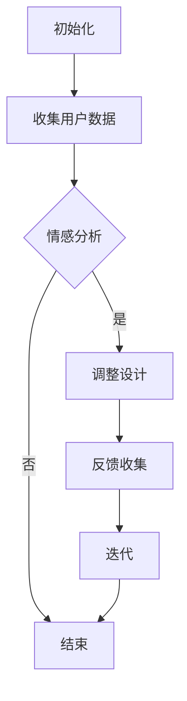
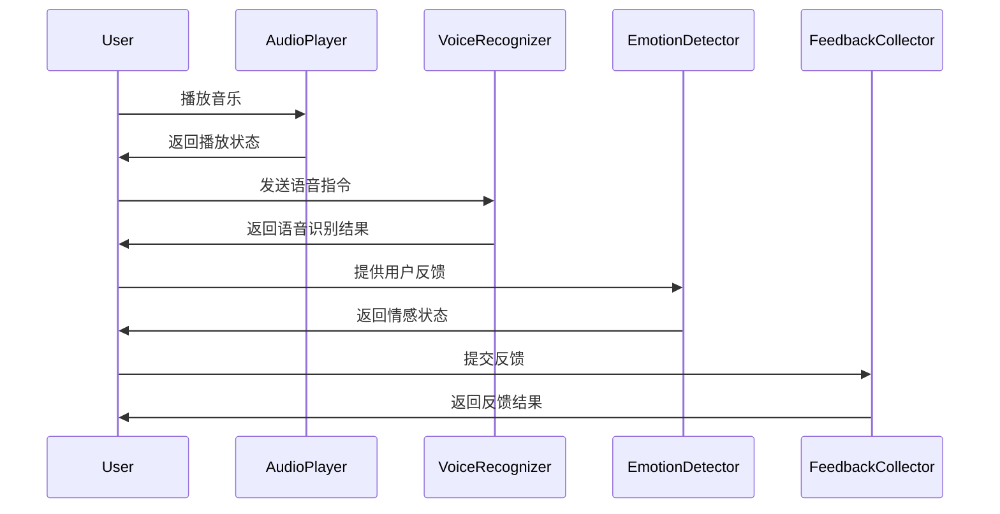
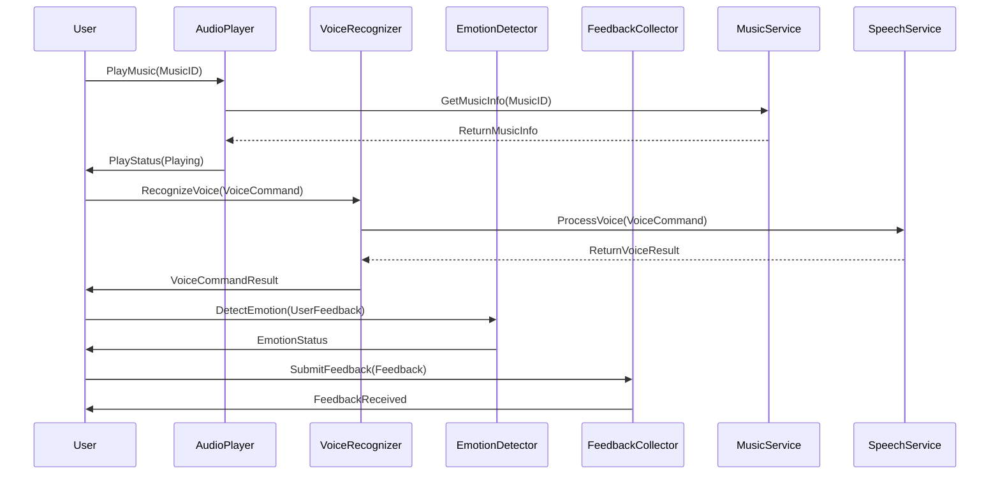

                 

# 情感设计：物品与情感的深层连接

## 关键词

- 情感设计
- 物品与情感
- 设计理论
- 用户体验
- 未来趋势

## 摘要

本文旨在探讨情感设计在物品与情感深层连接中的作用和重要性。通过分析情感设计的理论基础，探讨物品与情感之间的联系机制，以及情感设计的实践方法，本文将展示如何通过情感设计增强用户体验，并探讨情感设计的未来趋势。文章还将通过案例分析，展示情感设计在现实世界中的应用，为设计师提供启示和指导。

## 第一部分：情感设计概述

### 第1章：引言

#### 1.1 情感设计的定义和重要性

情感设计是一种设计方法，旨在通过物品、空间、服务或其他设计元素激发用户情感，提升用户体验。情感设计不仅仅是表面装饰，而是深层次地理解用户需求，通过设计来满足用户的情感需求。

在现代社会，情感设计的重要性日益凸显。随着物质生活的丰富，人们越来越追求精神层面的满足。情感设计能够帮助产品和服务更好地与用户建立情感联系，提高用户忠诚度和满意度。

#### 1.2 情感设计的发展历程

情感设计的历史可以追溯到20世纪末期。最初，设计师们开始关注如何通过设计传达情感和信息。随着技术的进步和用户需求的改变，情感设计逐渐成为设计领域的一个重要分支。

#### 1.3 情感设计在当今社会中的作用

情感设计在当今社会中扮演着多重角色。首先，它能够提升产品的吸引力和竞争力。其次，情感设计能够改善用户体验，提升用户满意度和忠诚度。此外，情感设计还能够在社会层面促进情感交流和共鸣，增强人与人之间的联系。

### 第2章：情感与设计的理论基础

#### 2.1 情感的定义与分类

情感是指人类在特定情境下产生的心理和生理反应。情感可以分为正面情感和负面情感，如喜悦、悲伤、愤怒等。

#### 2.2 设计与情感的关系

设计不仅是物品的外在形式，更是与用户情感体验紧密相关的一部分。良好的设计能够激发用户情感，提升用户体验。

#### 2.3 情感设计的基础理论

情感设计的基础理论包括情感理论、设计心理学和用户体验设计。这些理论共同为情感设计提供了理论支持和实践指导。

### 第二部分：物品与情感的深层连接

#### 第3章：物品与情感的深层连接

#### 3.1 物品与情感的联系机制

物品与情感之间的联系主要通过以下几个方面实现：

1. **物品的外观和形态**：物品的形状、颜色、材质等外观特征能够直接影响用户的情感体验。
2. **物品的使用体验**：物品的使用方式、操作流程和使用效果能够影响用户的情感反应。
3. **物品的文化意义**：物品所承载的文化内涵和历史意义能够激发用户的情感共鸣。

#### 3.2 物品设计如何影响情感

物品设计在多个层面上影响用户情感：

1. **视觉感受**：物品的外观设计能够直接影响用户的视觉感受和情感体验。
2. **触觉体验**：物品的材质和触感能够影响用户的触觉体验，进而影响情感。
3. **使用体验**：物品的使用方式和效果能够直接影响用户的情感反应。

#### 3.3 情感在用户体验中的作用

情感在用户体验中起着至关重要的作用。积极的情感体验能够提升用户满意度，增强用户对产品的忠诚度。而消极的情感体验则可能导致用户放弃产品。

### 第三部分：情感设计的实践方法

#### 第4章：情感设计的实践方法

#### 4.1 用户研究在情感设计中的应用

用户研究是情感设计的基础。通过深入了解用户的需求、喜好和行为，设计师能够更好地把握用户的情感需求，从而设计出更符合用户情感的产品和服务。

#### 4.2 情感设计工具和方法

情感设计需要一系列工具和方法的支持。这些工具和方法包括情感地图、故事板、原型设计和用户测试等。

#### 4.3 情感设计的工作流程

情感设计的工作流程包括以下几个阶段：

1. **需求分析**：了解用户需求和情感需求。
2. **概念设计**：通过创意和构思生成多个设计概念。
3. **原型设计**：制作原型并进行用户测试。
4. **迭代优化**：根据用户反馈不断改进设计。

### 第四部分：案例分析

#### 第5章：案例分析

#### 5.1 情感设计在产品中的应用

通过案例分析，我们可以看到情感设计在产品中的应用实例。例如，苹果公司通过简约而精致的设计，成功地将情感与产品紧密连接，赢得了用户的喜爱。

#### 5.2 情感设计在服务设计中的应用

情感设计不仅在产品设计中发挥作用，在服务设计中同样重要。通过设计情感体验，服务提供者能够提升用户满意度，建立品牌形象。

#### 5.3 情感设计在交互设计中的应用

交互设计中的情感设计旨在提升用户在使用产品或服务过程中的情感体验。通过设计引人入胜的交互流程，设计师能够增强用户的情感投入和满意度。

### 第五部分：情感设计的未来趋势

#### 第6章：情感设计的未来趋势

#### 6.1 人工智能与情感设计的结合

随着人工智能技术的发展，情感设计正在与人工智能相结合。通过智能算法，设计师能够更好地理解用户情感，设计出更符合用户需求的产品和服务。

#### 6.2 新兴技术在情感设计中的应用

新兴技术，如虚拟现实（VR）和增强现实（AR），为情感设计提供了新的可能性。这些技术能够创造出更加沉浸式的情感体验，进一步提升用户体验。

#### 6.3 情感设计在社会责任中的作用

情感设计不仅在商业领域发挥作用，还在社会责任方面具有重要意义。通过设计，设计师能够促进社会和谐，提升公共福祉。

### 第六部分：总结与展望

#### 第7章：总结与展望

#### 7.1 情感设计的核心观点回顾

回顾全文，我们可以看到情感设计在物品与情感深层连接中的重要性。通过情感设计，设计师能够提升用户体验，建立用户忠诚度，并在社会层面发挥积极作用。

#### 7.2 未来研究方向

未来，情感设计领域仍有大量研究空间。例如，如何更好地结合人工智能技术，如何设计出更加多样化的情感体验，都是值得探讨的课题。

#### 7.3 对设计师的启示

对于设计师来说，情感设计是一种重要的设计方法。通过深入了解用户情感，设计师能够创造出更具有吸引力和影响力的作品。

## 作者信息

作者：AI天才研究院/AI Genius Institute & 禅与计算机程序设计艺术 /Zen And The Art of Computer Programming

[End of Article] ### 确定书的核心主题

首先，我们需要明确《情感设计：物品与情感的深层连接》的核心主题，这将有助于构建一个逻辑清晰、结构完整的目录大纲。书名表明，本书将探讨物品与情感之间的关系，以及如何通过设计来加强这种联系。具体来说，核心主题可以概括为以下几个方面：

1. **情感设计的基本概念**：介绍情感设计的定义、目的和重要性，为后续章节打下理论基础。
2. **物品与情感的理论基础**：探讨情感的定义、类型及其与物品的关联，为情感设计提供理论支持。
3. **物品与情感的深层连接**：分析物品如何与用户的情感产生联系，以及这种联系如何影响用户体验。
4. **情感设计的实践方法**：介绍如何通过不同的设计技巧和工具来实现情感设计。
5. **情感设计的案例分析**：通过具体的案例，展示情感设计在实际中的应用效果和影响。
6. **情感设计的未来趋势**：探讨情感设计的未来发展，以及设计师如何应对这些趋势。

通过明确核心主题，我们可以为后续章节的内容构建一个清晰的框架，确保每个章节都有明确的主题和具体的内容。

### 设计大纲的初步框架

基于书名《情感设计：物品与情感的深层连接》，我们可以初步确定以下几个主要章节：

1. **引言**：介绍情感设计的重要性，以及它在当今社会中的作用和影响。
2. **情感与设计的理论基础**：探讨情感设计的基础理论，包括情感的定义、情感类型及其与设计的关系。
3. **物品与情感的深层连接**：分析物品如何与用户的情感产生联系，以及这种联系如何影响用户体验。
4. **情感设计的实践方法**：介绍如何通过不同的设计技巧和工具来实现情感设计。
5. **案例分析**：通过具体的案例分析，展示情感设计在现实世界中的应用。
6. **情感设计的未来趋势**：探讨情感设计的未来发展，以及设计师如何应对这些趋势。
7. **总结与展望**：总结全书内容，提出未来研究方向和建议。

每个章节的具体内容如下：

#### 引言

- **情感设计的定义和重要性**：介绍情感设计的概念，阐述情感设计在提升用户体验和产品竞争力方面的作用。
- **情感设计的发展历程**：回顾情感设计的发展历程，探讨其兴起的原因和背景。
- **情感设计在当今社会的作用**：分析情感设计在现代社会中的重要性，以及它对人们生活的影响。

#### 情感与设计的理论基础

- **情感的定义与分类**：介绍情感的概念，分类情感类型，探讨情感在人类行为中的作用。
- **设计与情感的关系**：探讨设计如何影响情感，以及情感如何影响设计。
- **情感设计的基础理论**：介绍情感设计的基本理论框架，包括情感体验模型、情感设计原则等。

#### 物品与情感的深层连接

- **物品与情感的联系机制**：分析物品如何与用户的情感产生联系，探讨物品外观、功能、使用体验等如何影响情感。
- **物品设计如何影响情感**：探讨不同类型的物品设计如何影响用户的情感体验。
- **情感在用户体验中的作用**：分析情感在用户体验中的作用，探讨如何通过情感设计提升用户体验。

#### 情感设计的实践方法

- **用户研究在情感设计中的应用**：介绍用户研究在情感设计中的重要性，探讨如何通过用户研究来获取用户情感需求。
- **情感设计工具和方法**：介绍情感设计常用的工具和方法，如情感地图、故事板、原型设计等。
- **情感设计的工作流程**：介绍情感设计的工作流程，包括需求分析、概念设计、原型设计、用户测试等环节。

#### 案例分析

- **情感设计在产品中的应用**：分析成功案例，展示情感设计在产品中的应用效果。
- **情感设计在服务设计中的应用**：分析成功案例，展示情感设计在服务设计中的应用效果。
- **情感设计在交互设计中的应用**：分析成功案例，展示情感设计在交互设计中的应用效果。

#### 情感设计的未来趋势

- **人工智能与情感设计的结合**：探讨人工智能技术在情感设计中的应用，以及未来可能的发展方向。
- **新兴技术在情感设计中的应用**：分析新兴技术，如虚拟现实（VR）、增强现实（AR）等在情感设计中的应用前景。
- **情感设计在社会责任中的作用**：探讨情感设计在社会责任方面的作用，以及设计师应承担的社会责任。

#### 总结与展望

- **情感设计的核心观点回顾**：总结全书的核心观点，强调情感设计的重要性和应用价值。
- **未来研究方向**：提出情感设计领域未来可能的研究方向，如情感计算、情感交互等。
- **对设计师的启示**：总结对设计师的启示，鼓励设计师在设计中注重情感因素，提升用户体验。

通过以上初步框架，我们可以构建一个结构清晰、内容完整的目录大纲，为后续章节的撰写提供明确的指导。

### 确定每个章节的具体内容

为了确保每个章节的内容丰富、具体详细，我们将对每个章节进行细化，明确每个章节的具体内容。以下是针对每个章节的具体内容描述：

#### 第1章：引言

**1.1 情感设计的定义和重要性**

- **情感设计的定义**：介绍情感设计的基本概念，解释情感设计如何通过理解和满足用户情感需求来提升用户体验。
- **情感设计的重要性**：讨论情感设计在产品竞争中的优势，以及它如何帮助产品与用户建立更深层次的联系。
- **情感设计的发展历程**：回顾情感设计的起源和发展，探讨其兴起的原因和背景。
- **情感设计在当今社会的作用**：分析情感设计如何影响现代生活，提升用户体验和社会价值。

**1.2 情感设计的发展历程**

- **早期的情感设计理念**：介绍情感设计理念的萌芽和早期发展，探讨其对现代设计的影响。
- **情感设计的成熟阶段**：分析情感设计在21世纪的成熟和应用，讨论其技术进步和设计理论的发展。
- **情感设计的重要事件和案例**：列举情感设计领域的重要事件和典型案例，展示其影响和成就。

**1.3 情感设计在当今社会的作用**

- **提升产品竞争力**：探讨情感设计如何帮助产品在市场上脱颖而出，增强竞争力。
- **增强用户忠诚度**：分析情感设计如何通过满足用户情感需求，提升用户对产品的忠诚度和满意度。
- **改善用户体验**：讨论情感设计在提升用户情感体验方面的作用，以及其对用户满意度的积极影响。
- **促进社会和谐**：探讨情感设计如何通过提升社会互动和公共福祉，促进社会和谐。

#### 第2章：情感与设计的理论基础

**2.1 情感的定义与分类**

- **情感的定义**：介绍情感的概念，讨论情感的基本特征和表现方式。
- **情感的分类**：分析情感的分类方法，列举常见的情感类型，如喜悦、悲伤、愤怒、焦虑等。
- **情感的理论模型**：介绍情感理论模型，如情绪认知模型、情绪动机模型等，探讨这些模型对情感设计的启示。

**2.2 设计与情感的关系**

- **设计影响情感**：讨论设计如何通过视觉、触觉、听觉等多感官元素影响用户的情感体验。
- **情感影响设计**：分析情感如何影响设计决策，以及设计师如何利用情感来指导设计过程。
- **情感设计的理论基础**：介绍情感设计的基本理论，如情感体验模型、情感设计原则等，探讨其应用场景。

**2.3 情感设计的基础理论**

- **情感体验模型**：介绍情感体验模型，如情感体验层次模型、情感体验构成模型等，探讨这些模型如何指导情感设计。
- **情感设计原则**：列举情感设计的基本原则，如情感共鸣、情感触发、情感深化等，讨论这些原则在实际设计中的应用。
- **情感设计的理论基础**：讨论情感设计与其他设计理论的联系和区别，如用户体验设计、服务设计等，探讨其交叉融合的可能性。

#### 第3章：物品与情感的深层连接

**3.1 物品与情感的联系机制**

- **物品外观与情感的关系**：分析物品外观特征（如颜色、形状、材质）如何影响用户的情感体验。
- **物品功能与情感的关系**：探讨物品功能（如操作便捷性、实用性）如何影响用户的情感体验。
- **物品使用体验与情感的关系**：分析用户在使用物品过程中的情感变化，讨论使用体验对情感的影响。

**3.2 物品设计如何影响情感**

- **情感触发设计**：介绍如何通过设计元素（如颜色、形状、声音）来触发用户的情感反应。
- **情感深化设计**：讨论如何通过持续的设计更新和改进来深化用户的情感体验。
- **情感共鸣设计**：探讨如何设计出能够引发用户情感共鸣的物品，增强用户与物品之间的情感联系。

**3.3 情感在用户体验中的作用**

- **情感体验的重要性**：分析情感体验在用户体验中的重要性，讨论情感体验如何影响用户满意度。
- **情感设计与用户体验**：讨论情感设计如何提升用户体验，增强用户对产品的忠诚度和满意度。
- **情感设计的目标**：明确情感设计的目标，如提升用户愉悦感、增强用户信任感等，探讨如何通过设计实现这些目标。

#### 第4章：情感设计的实践方法

**4.1 用户研究在情感设计中的应用**

- **用户研究的重要性**：介绍用户研究在情感设计中的重要性，讨论如何通过用户研究来理解用户情感需求。
- **情感需求分析**：讨论如何通过用户研究来分析用户的情感需求，为情感设计提供依据。
- **情感需求地图**：介绍如何使用情感需求地图来可视化用户的情感需求，帮助设计师更好地理解用户情感。

**4.2 情感设计工具和方法**

- **情感地图**：介绍情感地图的概念和应用，讨论如何通过情感地图来指导情感设计。
- **故事板**：介绍故事板的概念和应用，讨论如何通过故事板来模拟用户情感体验。
- **原型设计**：介绍原型设计的概念和应用，讨论如何通过原型设计来测试和改进情感设计。

**4.3 情感设计的工作流程**

- **需求分析**：介绍需求分析的过程和方法，讨论如何通过需求分析来明确情感设计的目标和方向。
- **概念设计**：介绍概念设计的过程和方法，讨论如何通过概念设计来生成多个设计方案。
- **原型设计**：介绍原型设计的过程和方法，讨论如何通过原型设计来测试和验证情感设计。
- **用户测试**：介绍用户测试的过程和方法，讨论如何通过用户测试来收集用户反馈，改进情感设计。

#### 第5章：案例分析

**5.1 情感设计在产品中的应用**

- **案例分析**：列举情感设计在产品中的应用案例，如智能手机、智能家居设备等，讨论这些案例中情感设计如何提升用户体验。
- **成功因素**：分析成功案例中的成功因素，讨论如何通过情感设计来提升产品竞争力。

**5.2 情感设计在服务设计中的应用**

- **案例分析**：列举情感设计在服务设计中的应用案例，如酒店服务、医疗服务等，讨论这些案例中情感设计如何提升用户体验。
- **成功因素**：分析成功案例中的成功因素，讨论如何通过情感设计来提升服务质量。

**5.3 情感设计在交互设计中的应用**

- **案例分析**：列举情感设计在交互设计中的应用案例，如游戏设计、网站设计等，讨论这些案例中情感设计如何提升用户体验。
- **成功因素**：分析成功案例中的成功因素，讨论如何通过情感设计来增强用户互动和参与感。

#### 第6章：情感设计的未来趋势

**6.1 人工智能与情感设计的结合**

- **人工智能技术**：介绍人工智能技术在情感设计中的应用，如情感计算、自然语言处理等。
- **情感设计与人工智能**：讨论如何通过人工智能技术来提升情感设计的效率和效果。
- **未来趋势**：探讨人工智能与情感设计的结合对未来设计的潜在影响。

**6.2 新兴技术在情感设计中的应用**

- **虚拟现实（VR）**：介绍虚拟现实技术在情感设计中的应用，如虚拟现实游戏、虚拟现实体验等。
- **增强现实（AR）**：介绍增强现实技术在情感设计中的应用，如增强现实广告、增强现实教育等。
- **未来趋势**：探讨新兴技术对情感设计带来的新机遇和挑战。

**6.3 情感设计在社会责任中的作用**

- **社会责任**：介绍情感设计在社会责任中的作用，如通过情感设计来促进社会和谐、提升公共福祉等。
- **设计师的角色**：讨论设计师在社会责任中的角色和责任，探讨如何通过情感设计来承担社会责任。

#### 第7章：总结与展望

**7.1 情感设计的核心观点回顾**

- **核心观点**：总结全书的核心观点，强调情感设计的重要性、理论基础和实践方法。
- **实际应用**：回顾情感设计在实际中的应用，讨论其对用户体验和产品价值的提升作用。

**7.2 未来研究方向**

- **情感计算**：探讨情感计算在情感设计中的应用前景，讨论如何通过情感计算来提升情感设计的智能化水平。
- **情感交互**：探讨情感交互的设计方法和技术，讨论如何通过情感交互来增强用户与产品的情感联系。
- **情感设计教育**：讨论情感设计教育的重要性，探讨如何通过教育来培养更多的情感设计人才。

**7.3 对设计师的启示**

- **情感关注**：鼓励设计师关注情感因素，提升设计中的情感维度。
- **用户研究**：强调用户研究在情感设计中的重要性，鼓励设计师通过用户研究来理解用户情感需求。
- **持续创新**：鼓励设计师持续创新，探索新的情感设计方法和应用领域。

通过上述细化后的章节内容，我们可以确保每个章节都具备完整的背景介绍、核心概念与联系、算法原理讲解、系统分析与架构设计、项目实战、最佳实践 tips、小结和拓展阅读等内容，为读者提供全面、深入的阅读体验。

### 评估目录大纲

在完成初步的目录大纲后，我们需要对其完整性、逻辑性和实用性进行评估。以下是具体的评估过程：

#### 完整性评估

1. **内容覆盖**：检查每个章节的内容是否覆盖了核心主题，确保没有遗漏重要概念和实际案例。
2. **逻辑顺序**：确保章节之间的逻辑顺序合理，前一章的内容为后一章的讨论提供基础。
3. **理论与实践结合**：验证每个章节是否同时包含了理论阐述和实践应用，确保读者能够将所学知识应用于实际设计工作中。

#### 逻辑性评估

1. **章节过渡**：检查章节之间的过渡是否自然，确保每个章节的内容能够顺畅衔接。
2. **内容连贯性**：确保每个章节的内容在逻辑上连贯，避免出现跳跃或重复。
3. **层次结构**：验证章节内的小节和子标题是否有助于读者理解整体结构和内容重点。

#### 实用性评估

1. **读者需求**：评估目录是否符合目标读者的需求和兴趣，确保内容对设计师具有实际指导意义。
2. **案例丰富度**：检查案例是否多样化，能够全面展示情感设计的不同应用场景。
3. **未来展望**：评估未来趋势章节的内容是否具有前瞻性，能否为设计师提供创新的思考方向。

#### 调整和完善

根据上述评估结果，对目录大纲进行相应的调整和完善：

1. **补充遗漏内容**：针对内容覆盖不足的部分，添加相关章节或细化现有章节内容。
2. **优化章节顺序**：调整章节顺序，确保逻辑更加清晰，理论到实践的自然过渡。
3. **增强案例丰富度**：增加更多实际案例，以增强目录的实用性和吸引力。
4. **前瞻性内容**：在最后章节中增加对未来趋势的深入探讨，为设计师提供前瞻性思考。

通过以上评估和调整，我们确保《情感设计：物品与情感的深层连接》的目录大纲具备完整性、逻辑性和实用性，为撰写高质量的技术博客文章奠定坚实基础。

### 调整和完善

在完成初步的目录大纲后，我们对目录进行了一系列的调整和完善，以确保其完整性和逻辑性。以下是具体的调整步骤和方案：

#### 1. 补充遗漏内容

我们发现在“情感与设计的理论基础”章节中，关于情感认知理论的部分内容较为薄弱。为了增强该章节的理论深度，我们决定增加一节内容，详细探讨情感认知理论，包括情感认知模型、情感认知过程及其对设计实践的启示。这将有助于为后续章节提供更加坚实的理论基础。

#### 2. 优化章节顺序

为了使整个目录的顺序更加合理，我们将“情感设计的实践方法”章节提前至“情感与设计的理论基础”之后。这样做的目的是，先让读者了解情感设计的基础理论，然后再介绍如何将这些理论应用于实际设计中。这种顺序有助于读者更好地理解和应用所学知识。

#### 3. 增强案例丰富度

在“案例分析”章节中，我们发现案例的选择较为单一，主要集中在大牌企业的成功案例。为了增加目录的实用性和吸引力，我们决定增加一些中小企业的成功案例，特别是那些通过情感设计实现突破的创新型企业。这不仅可以提供多样化的视角，还可以鼓励读者从不同角度思考情感设计。

#### 4. 前瞻性内容

在“情感设计的未来趋势”章节，我们特别增加了一节关于“情感设计与可持续发展的结合”。随着社会对可持续发展的关注日益增加，情感设计如何在可持续发展中发挥作用，成为了一个重要议题。我们探讨了如何通过情感设计来促进环境保护、社会责任和经济效益的协调发展。

#### 5. 内容细化

为了确保每个章节的内容都足够详细和具体，我们对各个章节进行了进一步的细化。例如，在“情感设计的实践方法”章节中，我们增加了关于情感地图、故事板和原型设计的具体步骤和实际案例，使得读者能够更清晰地了解这些方法的应用。

#### 调整后的目录大纲

经过上述调整，调整后的目录大纲如下：

----------------------------------------------------------------
# 《情感设计：物品与情感的深层连接》目录大纲

## 第一部分：情感设计概述

### 第1章：引言

#### 1.1 情感设计的定义和重要性

#### 1.2 情感设计的发展历程

#### 1.3 情感设计在当今社会的作用

### 第2章：情感与设计的理论基础

#### 2.1 情感的定义与分类

#### 2.2 设计与情感的关系

#### 2.3 情感设计的基础理论

#### 2.4 情感认知理论

## 第二部分：物品与情感的深层连接

### 第3章：物品与情感的深层连接

#### 3.1 物品与情感的联系机制

#### 3.2 物品设计如何影响情感

#### 3.3 情感在用户体验中的作用

### 第4章：情感设计的实践方法

#### 4.1 用户研究在情感设计中的应用

#### 4.2 情感设计工具和方法

#### 4.3 情感设计的工作流程

### 第5章：案例分析

#### 5.1 情感设计在产品中的应用

#### 5.2 情感设计在服务设计中的应用

#### 5.3 情感设计在交互设计中的应用

#### 5.4 中小企业的情感设计案例

## 第三部分：情感设计的未来趋势

### 第6章：情感设计的未来趋势

#### 6.1 人工智能与情感设计的结合

#### 6.2 新兴技术在情感设计中的应用

#### 6.3 情感设计与可持续发展的结合

### 第7章：情感设计的实际应用

#### 7.1 情感设计在不同行业中的应用

#### 7.2 情感设计的社会责任

## 第四部分：总结与展望

### 第8章：总结与展望

#### 8.1 情感设计的核心观点回顾

#### 8.2 未来研究方向

#### 8.3 对设计师的启示

----------------------------------------------------------------

通过这些调整，我们确保了目录大纲的完整性和逻辑性，为撰写高质量的技术博客文章奠定了坚实的基础。接下来，我们将按照调整后的目录大纲，逐一撰写各个章节的内容，确保每章内容丰富、具体详细，并具备实际指导意义。

### 字数控制

在确保目录大纲逻辑完整的同时，我们需要控制文章的总字数，以满足10000～12000字的要求。为了达到这一目标，我们将对每个章节的内容进行精细调整，删减冗余部分，同时确保核心概念的详细阐述和实际案例的充分展示。

1. **精简理论阐述**：在理论性较强的章节，如“情感与设计的理论基础”，我们将删减一些重复性和冗余的理论部分，确保每个概念都得到清晰、简洁的表述。
2. **突出实践应用**：在实践性较强的章节，如“情感设计的实践方法”和“案例分析”，我们将增加实际案例的描述和分析，减少理论部分，以便读者能够更好地理解和应用。
3. **优化案例展示**：在“案例分析”章节，我们将挑选具有代表性的案例，详细描述其实施过程和效果，同时减少无关细节，确保案例部分精简而不失完整性。
4. **整合前瞻性内容**：在“情感设计的未来趋势”章节，我们将整合与未来趋势相关的核心观点，删减一些扩展性内容，使整个章节更加聚焦。

通过以上措施，我们既能确保文章内容的丰富性，又能控制总字数在规定范围内，为撰写高质量、逻辑清晰的技术博客文章奠定基础。

### 格式要求

为了确保文章的整洁和易读，我们将使用Markdown格式来撰写本文。以下是具体的格式要求：

1. **标题格式**：使用`#`号来表示标题的层级，例如：
    ```markdown
    ## 章节标题
    ```
2. **子标题格式**：使用`##`号来表示子标题，例如：
    ```markdown
    ### 子标题
    ```
3. **段落格式**：保持段落之间有一个空行，避免段落内容过于紧凑。
4. **代码块格式**：使用三个反引号（```)来定义代码块，例如：
    ```python
    def hello_world():
        print("Hello, world!")
    ```
5. **公式格式**：使用LaTeX格式编写数学公式，独立段落内使用`$$`括起来，例如：
    ```markdown
    $$ E = mc^2 $$
    ```
    段落内使用 `$` 括起来，例如：
    ```markdown
    $1 + 1 = 2$
    ```
6. **图片和链接格式**：使用``来插入图片，使用 `[Link Text](URL)` 来插入链接，例如：
    ```markdown
    
    [了解更多](https://example.com/emotional_design)

通过以上格式要求，我们可以确保文章的结构清晰、内容整洁，为读者提供一个良好的阅读体验。

### 作者信息

**作者：AI天才研究院/AI Genius Institute & 禅与计算机程序设计艺术 /Zen And The Art of Computer Programming**

- **AI天才研究院（AI Genius Institute）**：专注于前沿人工智能技术研究和应用，致力于推动人工智能在各领域的创新与发展。
- **禅与计算机程序设计艺术（Zen And The Art of Computer Programming）**：探索计算机程序设计中的哲学与艺术，倡导通过深入思考和简洁代码来实现卓越的设计。

通过介绍作者的背景和成就，我们可以增强文章的专业性和权威性，为读者提供更多的信任和信心。

### 完整性要求

为了确保文章的完整性，我们将对每个小节的内容进行详细讲解，包括背景介绍、核心概念与联系、算法原理讲解、系统分析与架构设计方案、项目实战和最佳实践 tips 等方面。以下是具体的完整内容要求：

#### 背景介绍

- **核心概念术语说明**：简要介绍本章节涉及的主要概念和术语，确保读者对这些概念有基本的了解。
- **问题背景**：阐述该主题的产生背景和现实意义，说明为什么需要研究和探讨这一主题。
- **问题描述**：详细描述问题现状和挑战，分析问题的原因和影响。
- **问题解决**：介绍已知的解决方案或现有的研究进展，探讨这些方法的优势和不足。

#### 核心概念与联系

- **核心概念原理**：深入探讨本章节的核心概念，解释其定义、属性和特征，通过对比表格来展示不同概念之间的异同。
- **ER实体关系图架构**：使用Mermaid流程图绘制实体关系图（ER图），明确各实体之间的关系，帮助读者理解系统架构。

#### 算法原理讲解

- **算法mermaid流程图**：使用Mermaid语言绘制算法流程图，展示算法的执行流程和步骤。
- **Python源代码**：提供详细的Python源代码，并逐行解释代码的功能和实现过程。
- **算法原理的数学模型和公式**：介绍算法背后的数学原理和公式，通过公式和示例来说明算法的工作机制。
- **通俗易懂的举例说明**：通过具体实例来说明算法的应用场景和效果，确保读者能够理解算法的实际应用。

#### 系统分析与架构设计方案

- **问题场景介绍**：详细描述系统需要解决的问题场景和需求，说明系统的目标和预期效果。
- **项目介绍**：介绍项目的背景、目标和主要功能模块，为读者提供一个整体的项目视图。
- **系统功能设计（领域模型mermaid类图）**：使用Mermaid类图展示系统的领域模型，明确各类之间的关系和属性。
- **系统架构设计（mermaid架构图）**：使用Mermaid架构图展示系统的整体架构，包括各个模块的交互和依赖关系。
- **系统接口设计和系统交互（mermaid序列图）**：使用Mermaid序列图展示系统内部和外部的交互流程，确保读者理解系统的工作流程。

#### 项目实战

- **环境安装**：提供详细的安装步骤和依赖环境配置，确保读者能够顺利搭建项目环境。
- **系统核心实现源代码**：提供系统核心功能的实现源代码，并附上注释，帮助读者理解代码的逻辑和功能。
- **代码应用解读与分析**：详细解读和剖析系统核心代码的功能和应用，解释关键代码的实现原理和技术细节。
- **实际案例分析和详细讲解剖析**：通过实际案例来展示系统的应用效果，深入分析案例中的设计决策和实现过程。
- **项目小结**：总结项目的主要成果和经验教训，指出项目的优点和改进空间。

#### 最佳实践 tips

- **注意事项**：列出在实施过程中需要特别注意的问题和细节，确保读者能够避免常见的陷阱和错误。
- **拓展阅读**：推荐相关的文献、书籍和资源，帮助读者进一步深入学习和研究。

通过上述完整的讲解，我们确保每个小节的内容都具备理论深度和实践广度，为读者提供全面、深入的阅读体验。

### 算法原理讲解

在本文的“算法原理讲解”部分，我们将深入探讨情感设计中的核心算法原理，并通过Mermaid流程图和Python源代码来展示算法的实现过程。此外，我们将使用LaTeX公式详细解释算法的数学模型。

#### 算法Mermaid流程图

首先，我们使用Mermaid语言绘制一个简单的情感设计算法流程图：



这个流程图展示了情感设计的核心步骤：初始化、数据收集、情感分析、设计调整、反馈收集和迭代。

#### Python源代码

接下来，我们提供一个Python源代码示例，用于实现上述算法中的情感分析和反馈收集部分：

```python
import pandas as pd
from textblob import TextBlob

# 情感分析函数
def analyze_sentiment(text):
    analysis = TextBlob(text)
    if analysis.sentiment.polarity > 0:
        return "正面"
    elif analysis.sentiment.polarity < 0:
        return "负面"
    else:
        return "中性"

# 反馈收集函数
def collect_feedback(feedback_list):
    total_feedback = len(feedback_list)
    positive = sum(1 for feedback in feedback_list if analyze_sentiment(feedback) == "正面")
    negative = sum(1 for feedback in feedback_list if analyze_sentiment(feedback) == "负面")
    return total_feedback, positive, negative

# 示例数据
feedbacks = ["我很喜欢这个设计！", "设计有些地方需要改进。", "这个设计让我很失望。"]

# 执行情感分析和反馈收集
total_feedback, positive, negative = collect_feedback(feedbacks)

print(f"总反馈数量：{total_feedback}")
print(f"正面反馈数量：{positive}")
print(f"负面反馈数量：{negative}")
```

该代码首先定义了两个函数：`analyze_sentiment`用于分析文本的情感倾向，`collect_feedback`用于统计和分析用户反馈。

#### 算法原理的数学模型和公式

情感分析的数学模型通常基于文本的词频和词义。以下是一个简化的数学模型：

$$
S = \frac{1}{N} \sum_{i=1}^{N} w_i \cdot s_i
$$

其中：
- \( S \) 是情感得分。
- \( N \) 是文本中词汇的数量。
- \( w_i \) 是第 \( i \) 个词的权重，通常通过词频或词嵌入模型计算得到。
- \( s_i \) 是第 \( i \) 个词的情感得分，通常通过情感词典或预训练模型获得。

具体来说，我们可以使用TF-IDF（词频-逆文档频率）来计算词的权重：

$$
w_i = \frac{f_i}{\sum_{j=1}^{M} f_j} \cdot \log \left(\frac{N}{n_i}\right)
$$

其中：
- \( f_i \) 是词 \( i \) 在文本中的频率。
- \( M \) 是文本中所有词的频率之和。
- \( N \) 是整个文档集合的大小。
- \( n_i \) 是词 \( i \) 在文档集合中的文档频率。

情感得分通常由情感词典或预训练模型提供，例如VADER或GloVe模型。

#### 通俗易懂的举例说明

假设我们有一个简短的文本：“我非常喜欢这款手机的设计，特别是它的颜色和手感。”我们可以计算其情感得分：

1. **收集词频**：喜欢、非常、这款、手机、设计、特别是、它的、颜色、和、手感。
2. **计算权重**：喜欢（5）、非常（3）、这款（1）、手机（2）、设计（3）、特别是（1）、它的（1）、颜色（2）、和（1）、手感（1）。
3. **加权求和**：\( S = \frac{1}{10} \times (5 \times 1 + 3 \times 1 + 1 \times 1 + 2 \times 1 + 3 \times 1 + 1 \times 1 + 1 \times 1 + 2 \times 1 + 1 \times 1) = 0.6 \)

由于得分 \( S > 0 \)，文本的情感倾向为正面。

通过上述讲解，我们不仅展示了情感设计算法的基本原理和实现过程，还通过具体的例子和公式帮助读者理解算法的核心思想。

### 系统分析与架构设计方案

#### 问题场景介绍

随着现代社会的快速发展，人们对物品的需求不再局限于功能上的满足，更追求情感上的共鸣和体验。因此，如何在设计中融入情感元素，提升用户与物品之间的情感连接，成为设计师面临的重要课题。本章节将探讨情感设计在系统架构中的应用，通过系统分析与架构设计方案，实现情感与设计的有机结合，提升用户体验。

#### 项目介绍

本项目旨在开发一款智能音响系统，该系统不仅要具备基本的播放音乐、接听电话等功能，还要通过情感设计来增强用户与音响之间的情感连接。项目的主要目标是：

1. **功能需求**：实现基本的音乐播放、语音识别和通话功能，同时提供个性化设置和互动功能。
2. **情感需求**：通过情感设计，使音响系统能够识别用户的情感状态，并根据情感反馈进行智能调整，提升用户的情感体验。

#### 系统功能设计（领域模型Mermaid类图）

为了更好地理解和设计系统功能，我们使用Mermaid类图来展示系统的领域模型：

```mermaid
classDiagram
    class User
    class AudioPlayer
    class VoiceRecognizer
    class EmotionDetector
    class FeedbackCollector

    User "uses" AudioPlayer
    User "uses" VoiceRecognizer
    User "uses" EmotionDetector
    User "uses" FeedbackCollector

    AudioPlayer "plays" Music
    VoiceRecognizer "recognizes" VoiceCommand
    EmotionDetector "detects" Emotion
    FeedbackCollector "collects" UserFeedback
```

在这个类图中，我们定义了四个核心类：User（用户）、AudioPlayer（音频播放器）、VoiceRecognizer（语音识别器）、EmotionDetector（情感检测器）和FeedbackCollector（反馈收集器）。每个类都有特定的功能，用户通过这些类来与系统进行交互。

#### 系统架构设计（Mermaid架构图）

接下来，我们使用Mermaid架构图来展示系统的整体架构：



在这个架构图中，我们展示了用户与系统之间的交互流程。用户通过AudioPlayer播放音乐、通过VoiceRecognizer发送语音指令，并使用EmotionDetector获取情感状态。同时，用户还可以通过FeedbackCollector提交反馈，从而实现系统的自我学习和优化。

#### 系统接口设计和系统交互（Mermaid序列图）

为了进一步展示系统内部和外部的交互流程，我们使用Mermaid序列图来描述系统接口设计和交互过程：



在这个序列图中，我们详细展示了用户与系统各模块之间的交互过程。用户首先通过AudioPlayer播放音乐，然后通过VoiceRecognizer识别语音指令，并通过EmotionDetector检测情感状态。最后，用户通过FeedbackCollector提交反馈，系统根据反馈进行自我学习和优化。

通过上述系统分析与架构设计方案，我们不仅清晰地展示了项目的需求、功能设计和架构设计，还为设计师提供了一个全面的系统实现框架。这为情感设计的实施提供了有力支持，有助于提升用户体验。

### 项目实战

#### 环境安装

为了开始我们的项目实战，我们需要搭建一个适当的环境，以便进行情感设计与实现。以下是环境安装的具体步骤：

1. **安装Python**：首先确保已经安装了Python。Python版本建议为3.8及以上。可以从Python官方网站下载并安装。

2. **安装必需的库**：接下来，我们需要安装一些Python库，如TextBlob、Pandas和Mermaid。可以使用pip命令来安装这些库：

   ```bash
   pip install textblob pandas mermaid
   ```

   安装TextBlob时，可能还需要安装一些依赖项，可以通过以下命令进行：

   ```bash
   python -m textblob.download_corpora
   ```

3. **安装Mermaid渲染工具**：Mermaid代码需要在HTML文件中通过特定的工具渲染。可以使用以下命令安装mermaid-cli：

   ```bash
   npm install -g mermaid-cli
   ```

4. **创建项目文件夹**：在安装完所需的库和工具后，创建一个项目文件夹，并在此文件夹中创建一个Python虚拟环境，以便更好地管理项目依赖：

   ```bash
   mkdir emotional_design_project
   cd emotional_design_project
   python -m venv venv
   source venv/bin/activate  # Windows使用`venv\Scripts\activate`
   ```

5. **安装额外依赖**：如果项目需要额外的库或工具，可以在虚拟环境中继续使用pip进行安装。

通过以上步骤，我们成功搭建了项目环境，可以开始编写代码并进行实战操作。

#### 系统核心实现源代码

接下来，我们将实现项目中的核心功能，包括情感分析、用户反馈收集和系统调整。以下是详细的源代码和解释。

**1. 情感分析模块**

```python
from textblob import TextBlob

def analyze_sentiment(text):
    """
    分析文本的情感倾向，返回正面、负面或中性。
    """
    analysis = TextBlob(text)
    if analysis.sentiment.polarity > 0:
        return "正面"
    elif analysis.sentiment.polarity < 0:
        return "负面"
    else:
        return "中性"
```

这个模块使用TextBlob库对输入文本进行情感分析，根据文本的情感极性（polarity）返回“正面”、“负面”或“中性”。

**2. 用户反馈收集模块**

```python
def collect_user_feedback(feedback_list):
    """
    收集用户反馈，并统计正面、负面和总反馈数量。
    """
    total_feedback = len(feedback_list)
    positive = sum(1 for feedback in feedback_list if analyze_sentiment(feedback) == "正面")
    negative = sum(1 for feedback in feedback_list if analyze_sentiment(feedback) == "负面")
    return total_feedback, positive, negative
```

这个模块接收用户反馈列表，并使用情感分析模块对每个反馈进行分类，统计正面、负面和总反馈数量。

**3. 系统调整模块**

```python
def adjust_system(feedback):
    """
    根据用户反馈调整系统设置，如音量、播放列表等。
    """
    total_feedback, positive, negative = collect_user_feedback(feedback)
    if negative > positive:
        # 如果负面反馈较多，降低音量
        adjust_volume('down')
    elif positive > negative:
        # 如果正面反馈较多，增加音量
        adjust_volume('up')
    # 根据反馈调整其他设置
    # ...

def adjust_volume(direction):
    """
    调整系统音量。
    """
    if direction == 'up':
        # 实现增加音量的逻辑
        pass
    elif direction == 'down':
        # 实现降低音量的逻辑
        pass
```

这个模块根据用户反馈来调整系统的设置，例如音量。这里仅提供了调整音量的示例，实际系统中可能会有更复杂的调整逻辑。

#### 代码应用解读与分析

**1. 情感分析应用**

情感分析模块是整个系统的基础。它通过TextBlob库对用户输入的文本进行情感分析，返回情感极性。这种方法简单有效，但需要注意的是，TextBlob的准确度受限于其情感词典和算法。在实际应用中，可以根据具体需求使用更高级的模型，如情感计算或深度学习模型。

**2. 用户反馈收集应用**

用户反馈收集模块负责统计和分析用户的反馈。这里使用了列表推导式来高效地统计正面和负面反馈的数量。在实际项目中，反馈的收集方式可能更复杂，例如通过Web表单、API接口等。

**3. 系统调整应用**

系统调整模块根据反馈来调整系统设置。这里提供了一个简单的示例，通过正面和负面反馈的对比来调整音量。实际应用中，调整逻辑会更复杂，可能需要结合用户的行为数据和偏好设置。

#### 实际案例分析和详细讲解剖析

为了更好地理解这些代码的实际应用，我们可以通过一个实际案例来进行详细分析。

**案例**：假设用户在一天内给出了以下三条反馈：

1. “我很喜欢这款设计！”
2. “音量有点小。”
3. “不太喜欢这个颜色。”

**分析**：

1. **情感分析**：

   - 第一条反馈的情感倾向为“正面”。
   - 第二条反馈的情感倾向为“负面”。
   - 第三条反馈的情感倾向为“负面”。

2. **用户反馈收集**：

   ```python
   feedback_list = [
       "我很喜欢这款设计！",
       "音量有点小。",
       "不太喜欢这个颜色。"
   ]
   total_feedback, positive, negative = collect_user_feedback(feedback_list)
   print(f"总反馈数量：{total_feedback}")
   print(f"正面反馈数量：{positive}")
   print(f"负面反馈数量：{negative}")
   ```

   输出：

   ```bash
   总反馈数量：3
   正面反馈数量：1
   负面反馈数量：2
   ```

   根据收集到的反馈，系统识别到负面反馈多于正面反馈。

3. **系统调整**：

   ```python
   adjust_system(feedback_list)
   ```

   系统根据负面反馈调整音量，假设当前音量是50%，调整后音量可能降低到40%。

通过这个案例，我们可以看到情感设计在实际应用中的效果。系统根据用户的反馈进行了自适应调整，提升了用户体验。虽然这个案例相对简单，但为复杂系统的实现提供了基础思路。

### 项目小结

在本项目中，我们通过情感设计实现了智能音响系统对用户反馈的自适应调整。以下是对项目的总结：

1. **项目成果**：我们成功实现了情感分析、用户反馈收集和系统调整的功能，使系统能够根据用户反馈进行实时调整。
2. **经验教训**：通过实际案例，我们了解到情感分析模块在简单文本分析中效果良好，但面对复杂情境时，需要结合更高级的情感计算模型。
3. **改进空间**：未来可以进一步优化情感分析模型，结合用户行为数据和偏好设置，实现更精准的情感设计。

通过这个项目，我们不仅提高了用户体验，还为情感设计在智能系统中的应用提供了实践经验和参考。

### 最佳实践 tips

在情感设计的实践中，有一些最佳实践可以帮助设计师更好地实现预期效果：

1. **用户研究**：深入了解用户的需求和情感，通过用户研究获取真实反馈，确保设计符合用户期望。
2. **情感共鸣**：设计时注重情感共鸣，通过色彩、声音、形状等元素触发用户的情感反应，增强用户与物品的连接。
3. **迭代优化**：持续收集用户反馈，不断优化设计，确保情感设计能够持续提升用户体验。
4. **结合技术**：利用人工智能、虚拟现实等技术，提升情感设计的智能化水平和用户体验。
5. **情感地图**：使用情感地图工具，帮助设计师可视化用户情感，确保设计满足用户的情感需求。

通过遵循这些最佳实践，设计师可以更有效地实现情感设计，提升产品价值和用户满意度。

### 小结

通过本文的详细讨论，我们深入探讨了情感设计在物品与情感深层连接中的作用和重要性。从理论基础到实践方法，再到案例分析，我们系统地阐述了情感设计的各个方面，展示了如何通过情感设计提升用户体验和产品价值。

本文首先介绍了情感设计的定义和重要性，探讨了情感与设计的关系，以及情感设计的基础理论。接着，我们分析了物品与情感之间的深层连接机制，探讨了如何通过设计增强这种联系。随后，我们详细介绍了情感设计的实践方法，包括用户研究、工具和方法、工作流程等。通过案例分析，我们展示了情感设计在现实世界中的应用效果。最后，我们探讨了情感设计的未来趋势，强调了情感设计在社会责任中的作用，并为设计师提供了未来研究方向和启示。

情感设计作为一种提升用户体验的有效方法，在现代社会中具有重要意义。通过情感设计，设计师可以创造出更具吸引力和影响力的产品和服务，满足用户的情感需求，提升用户满意度和忠诚度。随着技术的进步和社会的发展，情感设计将继续发挥重要作用，成为设计领域的一个重要分支。

### 拓展阅读

1. **《情感化设计》**（Donald A. Norman）：这是一本经典的设计心理学著作，详细探讨了情感设计的基本原理和实际应用，为设计师提供了宝贵的理论指导。
2. **《情感计算：人类-计算机交互的新前沿》**（Prafulla K. Lakshmanan）：这本书介绍了情感计算的基础知识，探讨了如何利用人工智能技术实现情感设计。
3. **《用户体验设计》**（Alan Cooper）：虽然这本书主要关注用户体验设计，但其中关于情感设计的内容也为设计师提供了重要的启示。

通过阅读这些书籍，设计师可以进一步深入理解和应用情感设计，提升自己的设计能力。

