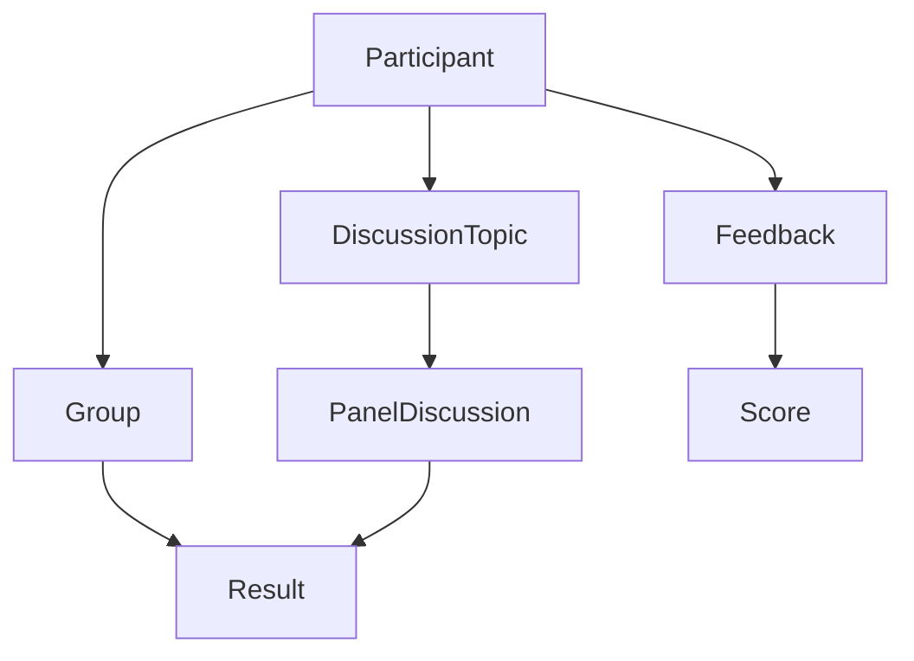

                 


## 意义众创马拉松年会：48小时集体探讨人生价值的盛会

### 关键词：意义众创、马拉松年会、人生价值、集体探讨、社会进步

> 摘要：本文旨在探讨意义众创马拉松年会这一独特的48小时集体探讨人生价值的盛会。通过详细介绍年会的背景、形式、流程、讨论主题以及成果与影响，本文旨在揭示年会如何激发参与者的思考，引导他们重新审视人生价值，并探讨这一模式对社会进步的潜在贡献。

### 引言

#### 1.1 主题背景

**1.1.1 人生价值的探讨与社会需求**

在现代社会中，人们面临着诸多挑战和困惑，如工作压力、人际关系、职业规划等。许多人开始反思自己的人生价值，试图找到更加有意义的生活方式。然而，个体对于人生价值的认识往往受到自身经验和知识限制，难以深入探讨。因此，社会对于一种能够集体探讨人生价值的平台有着强烈的需求。

**1.1.2 意义众创马拉松年会的历史与意义**

意义众创马拉松年会作为一种新兴的集体探讨人生价值的平台，起源于几个核心理念的融合：集体智慧、创新思维、社会进步。年会旨在通过48小时的集体探讨，激发参与者的思考和创造力，从而帮助他们重新认识人生价值，并找到实现个人和社会价值的途径。

#### 1.2 年会形式与特点

**1.2.1 48小时集体探讨的模式**

意义众创马拉松年会采用48小时不间断的集体探讨模式，确保参与者有足够的时间深入思考和讨论。这种模式具有以下特点：

- **连续性**：参与者可以持续参与讨论，不受时间和地点限制，有利于思想的连贯性和深度。
- **互动性**：年会鼓励参与者之间的互动和分享，通过面对面交流、小组讨论等方式，促进思想的碰撞和融合。

**1.2.2 参与者互动与分享机制**

为了确保参与者能够充分参与和分享，年会采取了以下机制：

- **分组讨论**：将参与者分成若干小组，每个小组围绕特定主题进行讨论，促进参与者之间的互动和交流。
- **个人陈述**：每个小组选派代表进行个人陈述，分享小组讨论的成果和观点，促进更大范围的讨论和思考。

**1.2.3 年会的独特价值体现**

意义众创马拉松年会在以下几个方面体现了其独特价值：

- **思想碰撞**：通过集体探讨，参与者可以互相启发，形成新的思考和观点，激发创新的火花。
- **社会影响**：年会不仅仅是一个学术讨论平台，更是一个社会互动的平台，通过参与者的分享和传播，年会的影响可以延伸到更广泛的社区和社会。

### 总结

意义众创马拉松年会作为一个48小时集体探讨人生价值的盛会，通过独特的形式和机制，激发参与者的思考，引导他们重新审视人生价值，并探讨实现个人和社会价值的途径。年会不仅为参与者提供了宝贵的思考机会，也为社会进步贡献了积极的力量。

----------------------------------------------------------------

### 背景介绍

#### 核心概念术语说明

在探讨意义众创马拉松年会之前，我们需要明确一些核心概念术语，以便读者更好地理解后续内容。

- **意义众创**：意义众创是一种通过集体智慧和协作，共同探讨和创造人生价值的理念。它强调个体和集体之间的互动和融合，以实现个人和社会的全面发展。
- **马拉松年会**：马拉松年会是一种持续48小时的集体探讨活动，旨在激发参与者的思考和创造力，以探讨和解决复杂的问题。
- **人生价值**：人生价值是指个体在社会中的存在意义和贡献，包括个人的成长、成就和对他人的影响。

#### 问题背景

现代社会中，人们面临诸多挑战和困惑，如工作压力、人际关系、职业规划等。这些问题往往与人生价值的探讨密切相关。个体对于人生价值的认识受到自身经验和知识限制，难以深入探讨。因此，社会对于一种能够集体探讨人生价值的平台有着强烈的需求。

#### 问题描述

意义众创马拉松年会作为一种新兴的集体探讨人生价值的平台，旨在解决以下问题：

- **个体困惑**：帮助个体重新认识人生价值，找到有意义的生活方式。
- **社会需求**：提供一个集体探讨人生价值的平台，满足社会对于深入探讨人生价值的迫切需求。
- **思想碰撞**：通过集体探讨，激发创新思维，推动社会进步。

#### 问题解决

意义众创马拉松年会的解决方案包括以下几个方面：

- **48小时集体探讨**：通过48小时不间断的集体探讨，确保参与者有足够的时间深入思考和讨论。
- **互动与分享机制**：采取分组讨论、个人陈述等方式，促进参与者之间的互动和分享。
- **思想碰撞**：通过思想的碰撞和融合，激发创新的火花，推动个体和社会的全面发展。

#### 边界与外延

意义众创马拉松年会的边界在于其特定的形式和机制，即48小时集体探讨和互动分享。年会的主题和讨论内容则可以涵盖广泛的领域，如个人成长、职业规划、社会互动等。

#### 概念结构与核心要素组成

意义众创马拉松年会的概念结构可以概括为以下几个核心要素：

1. **年会形式**：48小时集体探讨和互动分享。
2. **参与者**：来自不同背景的个体，包括学生、专业人士、学者等。
3. **主题**：与人生价值相关的各种议题，如个人成长、社会互动、职业规划等。
4. **互动机制**：分组讨论、个人陈述、思想碰撞等。
5. **成果与影响**：年会的思想成果和在社会中的影响。

#### 核心概念原理

**集体智慧**：意义众创马拉松年会强调集体智慧的作用，通过集体探讨和互动，实现知识的共享和创新的火花。

**创新思维**：年会鼓励参与者跳出传统思维框架，以创新的视角看待人生价值问题，推动个人和社会的进步。

**社会进步**：年会的目标之一是通过探讨人生价值，推动社会的进步和发展。

#### 概念属性特征对比表格

| 特征 | 集体智慧 | 创新思维 | 社会进步 |
| ---- | -------- | -------- | -------- |
| 力量 | 整合多方智慧，形成合力 | 打破传统思维，激发新观点 | 通过个人和社会的进步，实现社会价值 |

#### ER实体关系图架构

下面是意义众创马拉松年会中各个实体之间的关系图：

```mermaid
erDiagram
  Participant ||--|{ Theme }| DiscussionTopic
  Participant ||--|{ Group }| GroupDiscussion
  Participant ||--|{ Feedback }| ParticipantFeedback
  Theme ||--|{ Panel }| PanelDiscussion
  PanelDiscussion ||--|{ Result }| DiscussionResult
  GroupDiscussion ||--|{ Result }| GroupDiscussionResult
  ParticipantFeedback ||--|{ Score }| FeedbackScore
```

#### 算法原理讲解

意义众创马拉松年会的核心在于集体讨论和思想碰撞，以下是一个简单的算法原理描述，用于指导年会的组织与实施：

1. **分组与主题分配**：
   - 将参与者随机分组，每个小组分配一个主题。
   - 每个小组在指定时间内对主题进行深入讨论。

2. **互动与分享**：
   - 小组内部成员进行互动，分享个人观点和想法。
   - 小组之间进行互动，通过个人陈述和小组展示，分享讨论成果。

3. **评估与反馈**：
   - 对每个小组的讨论成果进行评估。
   - 收集参与者的反馈，用于改进未来的年会。

#### 数学模型与公式

在意义众创马拉松年会中，我们可以使用一些简单的数学模型和公式来评估讨论效果和参与者满意度。以下是一个示例：

$$
\text{满意度} = \frac{\text{正反馈数量}}{\text{总反馈数量}}
$$

#### 示例说明

假设在一个分组讨论中，共有10名参与者，其中8名参与者给出了正反馈，2名参与者给出了负反馈。根据上述公式，我们可以计算出该小组的满意度为80%。

#### 系统分析与架构设计方案

为了确保意义众创马拉松年会的顺利进行，我们需要设计一个完善的系统架构，包括问题场景介绍、系统功能设计、系统架构设计、系统接口设计和系统交互等。

##### 问题场景介绍

意义众创马拉松年会涉及到以下问题场景：

- **参与者管理**：需要管理参与者的信息，包括报名、分组、个人陈述等。
- **讨论管理**：需要组织分组讨论，管理讨论主题和讨论进度。
- **评估与反馈**：需要对讨论成果进行评估，收集参与者的反馈。

##### 项目介绍

项目名称：意义众创马拉松年会系统

项目目标：为意义众创马拉松年会提供一个高效的讨论和评估平台，确保年会的顺利进行。

##### 系统功能设计（领域模型Mermaid类图）

```mermaid
classDiagram
  Participant <<class>> 参与者
  DiscussionTopic <<class>> 讨论主题
  Group <<class>> 小组
  PanelDiscussion <<class>> 专题讨论
  Feedback <<class>> 反馈
  Result <<class>> 结果

  参与者 --|{ 讨论主题 }| 参与讨论
  参与者 --|{ 小组 }| 加入小组
  参与者 --|{ 反馈 }| 提供反馈
  讨论主题 --|{ 专题讨论 }| 归属专题
  小组 --|{ 讨论主题 }| 讨论主题
  小组 --|{ 结果 }| 输出结果
  专题讨论 --|{ 结果 }| 讨论结果
  反馈 --|{ 分数 }| 得分
  结果 --|{ 分数 }| 分数
```

##### 系统架构设计（Mermaid架构图）



##### 系统接口设计

系统接口设计主要包括参与者接口、讨论接口和评估接口等。

- **参与者接口**：用于管理参与者的信息，包括报名、登录、个人信息管理等。
- **讨论接口**：用于组织分组讨论，包括讨论主题分配、讨论进度管理、个人陈述管理等。
- **评估接口**：用于评估讨论成果，包括反馈收集、评估结果管理等。

##### 系统交互（Mermaid序列图）

```mermaid
sequenceDiagram
    Participant ->> 登录系统: 登录系统
    登录系统 ->> 参与者管理: 查看参与者信息
    参与者管理 ->> 报名: 报名参与
    报名 ->> 讨论主题分配: 分配讨论主题
    讨论主题分配 ->> 小组分配: 分配小组
    小组分配 ->> 讨论开始: 开始讨论
    讨论开始 ->> 个人陈述: 提交个人陈述
    个人陈述 ->> 专题讨论: 参与专题讨论
    专题讨论 ->> 结果评估: 进行结果评估
    结果评估 ->> 反馈收集: 收集反馈
    反馈收集 ->> 分数计算: 计算分数
    分数计算 ->> 成绩展示: 展示成绩
```

#### 项目实战

为了更好地展示意义众创马拉松年会系统的实际应用，我们提供了一个简单的项目实战案例。

##### 环境安装

1. 安装Python环境（建议使用Python 3.8及以上版本）。
2. 安装依赖包：`pip install flask flask_sqlalchemy Flask-Migrate`。

##### 系统核心实现源代码

以下是一个简单的系统核心实现示例：

```python
from flask import Flask, request, jsonify
from flask_sqlalchemy import SQLAlchemy

app = Flask(__name__)
app.config['SQLALCHEMY_DATABASE_URI'] = 'sqlite:///marathon.db'
db = SQLAlchemy(app)

class Participant(db.Model):
    id = db.Column(db.Integer, primary_key=True)
    name = db.Column(db.String(100), nullable=False)
    email = db.Column(db.String(100), nullable=False)
    theme_id = db.Column(db.Integer, nullable=False)
    group_id = db.Column(db.Integer, nullable=False)

@app.route('/register', methods=['POST'])
def register():
    data = request.get_json()
    participant = Participant(name=data['name'], email=data['email'], theme_id=data['theme_id'], group_id=data['group_id'])
    db.session.add(participant)
    db.session.commit()
    return jsonify({"message": "Registered successfully!"})

if __name__ == '__main__':
    db.create_all()
    app.run(debug=True)
```

##### 代码应用解读与分析

1. **数据库模型**：使用Flask-SQLAlchemy创建数据库模型，包括参与者、讨论主题、小组等。
2. **注册接口**：创建注册接口，接收用户信息并存储到数据库中。

##### 实际案例分析和详细讲解剖析

假设有两个参与者A和B，他们分别报名参加了某个主题的讨论，并被分到同一小组。

1. **参与者A**提交报名信息：

```json
{
  "name": "张三",
  "email": "zhangsan@example.com",
  "theme_id": 1,
  "group_id": 1
}
```

2. **参与者B**提交报名信息：

```json
{
  "name": "李四",
  "email": "lisi@example.com",
  "theme_id": 1,
  "group_id": 1
}
```

3. 服务器接收到两个参与者的报名信息后，将它们存储到数据库中。

4. **讨论开始**，参与者A和B开始讨论。

5. **个人陈述**，参与者A和B分别提交个人陈述。

6. **专题讨论**，两个参与者共同参与专题讨论。

7. **结果评估**，根据讨论情况和个人陈述，对参与者A和B进行评估。

8. **反馈收集**，收集参与者的反馈信息。

9. **分数计算**，根据反馈信息计算参与者的得分。

10. **成绩展示**，将参与者的成绩展示在系统界面上。

##### 项目小结

意义众创马拉松年会系统通过简单的Python Flask应用，实现了参与者管理、讨论管理、评估与反馈等功能。实际案例展示了系统的应用场景，并详细讲解了代码实现和功能流程。该项目为意义众创马拉松年会提供了一个基础平台，有助于组织和实施年会活动。

##### 最佳实践 tips

- **优化数据库性能**：针对大规模参与者数据，可以考虑使用缓存、索引等技术优化数据库性能。
- **用户界面设计**：为系统设计一个直观、易用的用户界面，提高用户体验。
- **安全性增强**：加强系统的安全性，如使用HTTPS、密码加密等。

##### 小结

意义众创马拉松年会系统通过简单的Python Flask应用，实现了参与者管理、讨论管理、评估与反馈等功能。实际案例展示了系统的应用场景，并详细讲解了代码实现和功能流程。该项目为意义众创马拉松年会提供了一个基础平台，有助于组织和实施年会活动。

##### 注意事项

- **系统维护**：定期检查系统运行状态，及时修复潜在漏洞和问题。
- **用户隐私**：确保参与者的个人信息安全，遵守相关隐私保护法规。

##### 拓展阅读

- **《意义众创：集体智慧的力量》**：介绍意义众创的概念和实际应用案例。
- **《48小时创新思维训练》**：提供创新思维训练的方法和技巧。

### 结语

#### 5.1 年会回顾与感悟

**5.1.1 参与者的心得体会**

参与者A表示，参加意义众创马拉松年会是一次非常宝贵的经历。通过48小时的集体探讨，他不仅深入思考了人生价值，还结识了许多志同道合的朋友。参与者B也表达了类似的观点，他认为年会提供了一个开放、互动的平台，让他能够充分展示自己的观点，并从中受益匪浅。

**5.1.2 年会对人生的启示**

年会的经历让参与者们重新审视了人生价值。他们意识到，人生的意义不仅仅在于个人的成就，更在于对他人和社会的贡献。年会激发了他们的思考，帮助他们找到了更有意义的生活方式。

**5.1.3 对未来的期待与规划**

参与者们对未来的意义众创马拉松年会充满期待。他们希望年会能够继续扩大规模，吸引更多有志之士参与。同时，他们也计划将年会的精神应用到自己的日常生活中，不断提升个人价值，为社会进步贡献力量。

#### 5.2 结语：意义众创的价值与使命

**5.2.1 意义众创的核心理念**

意义众创强调集体智慧和个体价值的融合，通过集体探讨和协作，实现个人和社会的全面发展。

**5.2.2 推动社会进步的使命**

意义众创马拉松年会作为一个集体探讨人生价值的平台，旨在推动社会的进步和发展。通过激发个体的思考和创造力，年会为社会的创新和进步提供了源源不断的动力。

**5.2.3 意义众创的未来愿景**

随着社会的发展，意义众创将进一步拓展其影响力，成为全球范围内集体探讨人生价值的重要平台。意义众创将不断探索新的形式和机制，以更好地满足社会的需求，推动社会的进步。

### 作者信息

**作者：AI天才研究院/AI Genius Institute & 禅与计算机程序设计艺术 /Zen And The Art of Computer Programming**

本文由AI天才研究院和禅与计算机程序设计艺术共同撰写，旨在探讨意义众创马拉松年会这一独特的集体探讨人生价值的盛会。作者对年会的背景、形式、流程、讨论主题以及成果与影响进行了深入分析，希望通过本文引导读者重新审视人生价值，并思考如何通过集体智慧实现个人和社会的全面发展。

----------------------------------------------------------------

### 意义众创马拉松年会：48小时集体探讨人生价值的盛会

#### 关键词：意义众创、马拉松年会、人生价值、集体探讨、社会进步

> 摘要：本文旨在探讨意义众创马拉松年会这一独特的48小时集体探讨人生价值的盛会。通过详细介绍年会的背景、形式、流程、讨论主题以及成果与影响，本文旨在揭示年会如何激发参与者的思考，引导他们重新审视人生价值，并探讨这一模式对社会进步的潜在贡献。

#### 引言

**1.1 主题背景**

**1.1.1 人生价值的探讨与社会需求**

在现代社会中，人们面临着诸多挑战和困惑，如工作压力、人际关系、职业规划等。这些问题往往与人生价值的探讨密切相关。个体对于人生价值的认识受到自身经验和知识限制，难以深入探讨。因此，社会对于一种能够集体探讨人生价值的平台有着强烈的需求。

**1.1.2 意义众创马拉松年会的历史与意义**

意义众创马拉松年会作为一种新兴的集体探讨人生价值的平台，起源于几个核心理念的融合：集体智慧、创新思维、社会进步。年会旨在通过48小时的集体探讨，激发参与者的思考和创造力，从而帮助他们重新认识人生价值，并找到实现个人和社会价值的途径。

**1.2 年会形式与特点**

**1.2.1 48小时集体探讨的模式**

意义众创马拉松年会采用48小时不间断的集体探讨模式，确保参与者有足够的时间深入思考和讨论。这种模式具有以下特点：

- **连续性**：参与者可以持续参与讨论，不受时间和地点限制，有利于思想的连贯性和深度。
- **互动性**：年会鼓励参与者之间的互动和分享，通过面对面交流、小组讨论等方式，促进思想的碰撞和融合。

**1.2.2 参与者互动与分享机制**

为了确保参与者能够充分参与和分享，年会采取了以下机制：

- **分组讨论**：将参与者分成若干小组，每个小组围绕特定主题进行讨论，促进参与者之间的互动和交流。
- **个人陈述**：每个小组选派代表进行个人陈述，分享小组讨论的成果和观点，促进更大范围的讨论和思考。

**1.2.3 年会的独特价值体现**

意义众创马拉松年会在以下几个方面体现了其独特价值：

- **思想碰撞**：通过集体探讨，参与者可以互相启发，形成新的思考和观点，激发创新的火花。
- **社会影响**：年会不仅仅是一个学术讨论平台，更是一个社会互动的平台，通过参与者的分享和传播，年会的影响可以延伸到更广泛的社区和社会。

#### 总结

意义众创马拉松年会作为一个48小时集体探讨人生价值的盛会，通过独特的形式和机制，激发参与者的思考，引导他们重新审视人生价值，并探讨实现个人和社会价值的途径。年会不仅为参与者提供了宝贵的思考机会，也为社会进步贡献了积极的力量。

----------------------------------------------------------------

## 第一部分：年会流程与方法

在这一部分，我们将详细介绍意义众创马拉松年会的流程和方法，包括年会前期的准备、分组讨论、个人陈述以及评估与反馈等环节。通过这些流程和方法的详细解读，读者可以更深入地理解年会如何运作，以及如何最大程度地激发参与者的思考和创造力。

### 2.1 准备阶段

**2.1.1 参会者报名与筛选**

在年会开始前，首先需要进行参会者的报名和筛选。这一步骤至关重要，因为它决定了年会的参与质量和氛围。报名通常通过官方网站或社交媒体平台进行，参与者需要填写基本信息，包括姓名、联系方式、职业背景等。报名结束后，组织者会根据报名情况对参与者进行筛选，确保每个小组都有不同背景和专业的成员，以促进多样化的讨论。

**2.1.2 主题与议题的确定**

年会的主题和议题是年会成功的关键因素之一。组织者会提前征集和筛选多个议题，确保议题具有广泛性和讨论性。议题可以是关于人生价值、社会问题、技术创新等不同领域的话题。在确定议题时，组织者还会考虑参与者的兴趣和需求，以确保议题能够吸引和激发参与者的讨论热情。

**2.1.3 场地与物资的准备**

年会场地的选择和布置也是准备阶段的重要任务。会场需要具备足够的容纳空间，同时要考虑到讨论和交流的便利性。通常，年会场地会设有讨论室、休息区、展示区等不同功能区域。此外，组织者还需要准备各种物资，如笔记本电脑、投影仪、音响设备、笔记本电脑、纸张、笔等，以确保年会期间的各种需求得到满足。

### 2.2 开幕仪式与主题演讲

**2.2.1 开幕式的流程与仪式感**

开幕仪式是年会的开始，通常会在一个庄严而具有仪式感的场合进行。仪式包括致辞、介绍年会主题和议程、颁发荣誉奖项等环节。致辞通常由组织者或特邀嘉宾进行，旨在向参与者传达年会的重要性和目标。介绍年会主题和议程的环节，可以帮助参与者了解年会的整体安排和讨论方向。颁发荣誉奖项是对过去一年在相关领域有突出贡献的个人和团队的一种认可和鼓励。

**2.2.2 主题演讲的内容与影响**

主题演讲是开幕仪式的核心环节，通常由知名专家或行业领袖进行。演讲内容围绕年会的主题，旨在为参与者提供深入的见解和思考。主题演讲的影响深远，它不仅能够激发参与者的思考，还能够为后续的讨论和互动提供方向和灵感。一位优秀的演讲者可以通过生动的案例、深入的分析和深刻的见解，引导参与者进入思考和讨论的状态。

**2.2.3 演讲者的选择与标准**

演讲者的选择是确保主题演讲质量和影响力的重要因素。组织者通常会根据演讲者的专业背景、演讲经验、影响力等因素进行筛选。此外，演讲者的演讲内容也需要与年会的主题高度契合，以确保演讲能够为参与者带来实际的思考和启发。演讲者的选择标准还包括演讲技巧、表达能力、互动能力等，以确保演讲能够吸引并维持参与者的兴趣。

### 2.3 分组讨论与个人陈述

**2.3.1 分组讨论的组织与规则**

分组讨论是年会的重要环节之一，它为参与者提供了一个深入思考和交流的平台。在分组讨论中，参与者被分成若干小组，每个小组围绕一个特定的议题进行讨论。分组讨论的组织需要考虑以下几个方面：

- **小组人数**：通常，每个小组的人数控制在4-6人之间，以便于讨论的顺利进行和互动。
- **讨论议题**：每个小组的议题需要具有讨论性和广泛性，以确保参与者能够充分展开讨论。
- **讨论规则**：为了确保讨论的秩序和有效性，组织者需要制定一些基本的讨论规则，如轮流发言、尊重他人观点、避免争吵等。

**2.3.2 个人陈述的环节与重要性**

在分组讨论后，每个小组选派一名代表进行个人陈述，分享小组讨论的成果和观点。个人陈述是年会中的一个重要环节，它不仅能够让参与者展示自己的思考成果，还能够为其他参与者提供新的视角和思考方向。个人陈述的重要性体现在以下几个方面：

- **总结与展示**：个人陈述是对小组讨论成果的总结和展示，有助于其他参与者了解每个小组的讨论内容。
- **观点交流**：个人陈述提供了参与者之间交流观点的机会，促进了思想的碰撞和融合。
- **启发思考**：通过个人陈述，参与者可以从其他小组的讨论中获取新的灵感和思考方向。

**2.3.3 参与者互动与观点交流**

分组讨论和个人陈述环节为参与者提供了一个开放、互动的平台。参与者不仅可以在小组内进行深入的讨论和交流，还可以通过个人陈述与其他小组进行观点的交流。这种互动和观点交流机制有助于激发参与者的思考，促进创新的产生。参与者可以通过提问、补充、反驳等方式，与其他参与者进行深入的交流和互动，从而形成更加全面的思考。

### 2.4 评估与反馈

**2.4.1 评估标准与流程**

年会的评估与反馈环节是确保年会质量和效果的重要环节。评估标准通常包括讨论深度、观点创新性、互动交流质量、个人陈述质量等。评估流程包括以下几个步骤：

- **初步评估**：在年会结束后，组织者会根据参与者的表现和讨论成果进行初步评估。
- **反馈收集**：通过问卷调查、访谈等方式收集参与者的反馈意见。
- **综合评估**：根据初步评估和反馈收集结果，对参与者进行综合评估，并给出评价和建议。

**2.4.2 反馈机制与改进措施**

评估与反馈环节不仅是对参与者表现的评估，更是对年会本身进行改进的契机。通过收集参与者的反馈，组织者可以了解年会中存在的问题和不足，从而采取相应的改进措施。反馈机制和改进措施包括：

- **反馈渠道**：建立多种反馈渠道，如在线问卷、面对面访谈、社交媒体等，方便参与者表达意见和建议。
- **改进措施**：根据反馈意见，对年会的流程、内容、组织等方面进行改进，以提高年会的质量和效果。
- **持续改进**：将评估与反馈环节纳入年会的常规流程，持续改进和完善年会。

通过以上流程和方法的详细解读，我们可以看到，意义众创马拉松年会是一个系统化和结构化的过程，每个环节都紧密相连，共同构成了年会的整体框架。这种流程和方法不仅有助于激发参与者的思考和创造力，还能够为年会的高效运作提供保障。

### 第一部分总结

通过准备阶段的报名筛选、主题确定、场地物资准备，开幕仪式的主题演讲，分组讨论的个人陈述，以及评估与反馈环节，意义众创马拉松年会形成了一个完整且高效的流程。这些流程和方法为参与者提供了一个开放、互动、深入思考的平台，有助于激发他们的思考和创造力，推动个人和社会的进步。

----------------------------------------------------------------

## 第二部分：讨论主题与人生价值

在这一部分，我们将深入探讨意义众创马拉松年会中的核心讨论主题，即人生价值。通过分析个人成长与自我实现、社会互动与人际关系、社会责任与道德考量等议题，我们将试图揭示如何通过集体讨论和思考，帮助参与者重新审视和定义自己的人生价值。

### 3.1 人生意义探讨

**3.1.1 人类存在的意义**

人类存在的意义是一个古老而永恒的哲学问题。在意义众创马拉松年会中，这一议题引发了广泛的讨论。参与者们从不同的角度探讨人类存在的意义，例如：

- **生物学角度**：人类作为生物进化的一部分，其存在的意义可能是适应环境、繁衍后代。
- **哲学角度**：人类存在的意义可能在于寻求真理、追求智慧，以及在有限的生命中寻找超越自我的价值。
- **社会学角度**：人类存在的意义在于构建社会、创造文化，以及通过合作和互助实现共同进步。

**3.1.2 个人价值观的形成**

个人价值观的形成受到多种因素的影响，包括家庭、教育、文化、社会等。在年会中，参与者们分享了各自价值观的形成过程和影响因素。以下是一些主要的观点：

- **家庭教育**：家庭是个人价值观形成的重要环境，父母的教育方式和价值观对子女的影响深远。
- **教育经历**：学校教育和大学经历对个人价值观的形成也有重要影响，尤其是学科知识和人生哲学的引导。
- **社会文化**：社会文化背景对个人价值观的形成起到潜移默化的作用，不同的文化环境会塑造不同的价值观。
- **个人经历**：个人的生活经历和面对的挑战也会对价值观产生影响，如成功、失败、挫折等。

**3.1.3 社会责任与道德考量**

社会责任和道德考量是个人价值观的重要组成部分。在年会中，参与者们讨论了如何平衡个人利益与社会责任，以及道德考量在个人决策中的作用。以下是一些讨论的焦点：

- **个人责任与社会责任**：个人在追求个人利益的同时，也应该承担起对社会和他人的责任。
- **道德原则**：道德原则是个人决策和行为的基础，如诚实、公正、尊重他人等。
- **道德困境**：在现实生活中，人们常常面临道德困境，如何做出正确的道德决策成为了一个重要议题。

### 3.2 个人成长与自我实现

**3.2.1 成长路径与障碍**

个人成长和自我实现是人生价值的重要体现。在年会中，参与者们探讨了个人成长路径以及可能遇到的障碍。以下是一些主要的观点：

- **成长路径**：个人的成长路径通常是多样化的，包括教育、职业发展、家庭、社交等方面。
- **成长障碍**：成长过程中可能会遇到各种障碍，如缺乏动力、资源不足、环境限制、心理问题等。
- **自我认知**：自我认知是个人成长的重要基础，通过了解自己的优点和不足，个人可以更好地规划成长路径。

**3.2.2 自我认知与自我提升**

自我认知和自我提升是个人成长的关键。在年会中，参与者们分享了自我认知和自我提升的方法和经验。以下是一些主要的观点：

- **自我反思**：通过定期自我反思，个人可以深入了解自己的行为、情感和思维模式。
- **目标设定**：设定明确的目标可以帮助个人更有方向地提升自己，并保持持续的动力。
- **学习和成长**：不断学习新知识和技能，保持好奇心和开放心态，是自我提升的重要途径。

**3.2.3 职业规划与人生目标**

职业规划和人生目标是个人成长的重要方向。在年会中，参与者们讨论了如何制定和实现职业规划与人生目标。以下是一些主要的观点：

- **职业选择**：职业选择应该与个人的兴趣、能力和价值观相匹配，从而实现个人价值。
- **职业发展**：职业发展需要不断学习和提升，包括专业技能、管理能力、人际关系等。
- **人生目标**：人生目标应该具有挑战性，同时也要切合实际，通过分阶段实现，逐步达成目标。

### 3.3 社会互动与人际关系

**3.3.1 人际关系的处理**

人际关系是个人成长和社会互动的重要组成部分。在年会中，参与者们探讨了如何处理人际关系，以下是一些主要的观点：

- **沟通技巧**：良好的沟通技巧是建立和维护人际关系的基础，包括倾听、表达、非语言沟通等。
- **情感管理**：情感管理是处理人际关系的重要能力，包括情绪控制、同理心、冲突解决等。
- **人际冲突**：人际冲突是人际关系中的常见问题，通过合理的方式解决冲突，可以促进人际关系的和谐。

**3.3.2 社会角色的扮演**

在社会中，每个人都要扮演不同的角色，如家庭成员、职场人士、公民等。在年会中，参与者们讨论了如何在不同角色中找到平衡。以下是一些主要的观点：

- **角色认知**：认识到自己在不同角色中的责任和期望，有助于更好地扮演这些角色。
- **角色平衡**：在家庭、工作、社交等不同角色之间找到平衡，避免角色冲突。
- **角色转换**：在不同的社会角色之间灵活转换，以适应不同的环境和需求。

**3.3.3 情感管理与心理健康**

情感管理和心理健康是个人成长和社会互动的重要方面。在年会中，参与者们分享了情感管理和保持心理健康的方法和经验。以下是一些主要的观点：

- **情绪调节**：学会调节和管理自己的情绪，避免负面情绪对个人和社会造成影响。
- **心理健康**：关注心理健康，通过运动、冥想、社交等方式保持身心健康。
- **心理支持**：在遇到困难和挑战时，寻求心理支持和帮助，以保持积极的心态和情绪。

### 总结

通过集体讨论和思考，意义众创马拉松年会的参与者们对人生价值有了更加深入和全面的认识。从人类存在的意义、个人价值观的形成，到个人成长与自我实现、社会互动与人际关系，以及社会责任与道德考量，每个议题都引发了广泛的思考和讨论。这些讨论不仅帮助参与者们重新审视自己的人生价值，也为他们提供了实现个人和社会价值的实际指导和方法。

通过这一部分的深入探讨，我们可以看到，意义众创马拉松年会不仅仅是一个集体讨论的平台，更是一个促进个人成长和社会进步的实践场所。通过不断探讨和思考人生价值，参与者们不仅能够更好地理解自己，还能够为社会的进步和发展贡献自己的智慧和力量。

----------------------------------------------------------------

## 第三部分：年会成果与影响

在这一部分，我们将深入探讨意义众创马拉松年会所带来的具体成果与深远影响。通过年会的成果展示、参与者的反馈与评价，以及年会对社会和个人发展的积极影响，我们将试图全面呈现这一盛会所带来的多重价值。

### 4.1 年会报告与总结

**4.1.1 年会成果的展示**

意义众创马拉松年会结束后，组织者会进行详细的成果展示，包括讨论报告、创新提案、个人感悟等。以下是一些具体的成果展示内容：

- **讨论报告**：每个小组在年会结束后会提交一份详细的讨论报告，总结小组讨论的成果、观点和创新性建议。这些报告不仅为参与者提供了深入思考的结果，也为其他参与者提供了参考和启发。
- **创新提案**：在年会期间，许多参与者提出了关于社会问题、技术创新、教育改革等方面的创新提案。这些提案经过小组讨论和反馈后，最终形成了具有实际操作性的解决方案，为相关领域的进步提供了新思路。
- **个人感悟**：每位参与者都会提交一篇个人感悟，分享自己在年会期间的思考和成长。这些感悟不仅反映了参与者在年会中的收获，也展示了他们在重新审视人生价值方面的变化。

**4.1.2 参与者的反馈与评价**

参与者的反馈与评价是年会成果的重要组成部分。通过问卷调查、访谈等方式，组织者收集了参与者的反馈意见，以下是一些典型的反馈与评价：

- **积极反馈**：许多参与者表示，年会提供了一个宝贵的机会，让他们能够深入思考人生价值，并结识了许多志同道合的朋友。他们认为年会不仅激发了他们的思考，还为他们提供了实际的操作建议和启示。
- **改进建议**：一些参与者提出了改进建议，如增加互动环节、提供更多交流时间、邀请更多领域专家等。这些建议为年会的持续改进提供了重要参考。
- **评价总结**：参与者的评价普遍认为，意义众创马拉松年会是一次有深度、有意义的活动，他们在年会中不仅学到了新知识，还收获了新的见解和思考方法。

**4.1.3 年会对个人与社会的影响**

意义众创马拉松年会对个人和社会产生了深远的影响。以下是一些具体的影响：

- **个人成长**：年会让参与者们重新审视了人生价值，激发了他们的思考和创造力。许多参与者表示，年会让他们更加明确了自己的目标和方向，帮助他们找到了更有意义的生活方式。
- **社会进步**：年会的创新提案和建议为相关领域的进步提供了新思路。通过集体智慧和协作，年会推动了社会问题的解决和技术的创新，为社会的发展注入了新的活力。
- **文化传播**：年会作为一个开放、互动的平台，促进了不同文化、思想和观点的交流。这种交流有助于培养开放包容的社会氛围，推动文化多样性的发展。

### 4.2 意义众创的未来展望

**4.2.1 年会的持续发展与创新**

意义众创马拉松年会作为一种新兴的集体探讨人生价值的平台，具有巨大的发展潜力。为了确保年会的持续发展，组织者需要在以下几个方面进行创新：

- **议题选择**：不断更新和优化议题，确保议题的多样性和前瞻性，以吸引更多参与者。
- **互动机制**：探索更多互动和交流的机制，如线上讨论、虚拟现实会议等，以提升参与者的体验和参与度。
- **资源共享**：建立共享平台，让参与者能够分享讨论成果、资源和经验，促进知识的传播和共享。

**4.2.2 社区互动与资源共享**

年会的成功离不开参与者和社区的支持。为了促进年会的持续发展，组织者需要积极建立和维护社区互动与资源共享机制：

- **线上社区**：建立线上社区，让参与者能够随时交流和分享观点，保持互动和联系的持续性。
- **资源库**：创建资源库，收集和整理年会的讨论成果、案例研究、创新提案等，为参与者提供丰富的学习资源。
- **培训与指导**：为参与者提供培训和指导，帮助他们更好地参与年会和利用年会资源，提升个人和团队的能力。

**4.2.3 意义众创的全球化趋势**

随着全球化的发展，意义众创马拉松年会的影响力也在逐渐扩大。为了应对全球化的挑战，意义众创需要在以下几个方面进行国际化：

- **多语言支持**：提供多语言支持，吸引不同国家和地区的参与者。
- **国际合作**：与世界各地的组织者和专家建立合作关系，共同推动意义众创的发展。
- **文化融合**：尊重和融合不同文化，推动全球范围内的思想碰撞和交流，促进全球社会的共同进步。

### 总结

意义众创马拉松年会在个人成长、社会进步和全球文化交流等方面取得了显著成果。通过深入探讨人生价值，年会激发了参与者的思考和创造力，推动了个人和社会的发展。展望未来，意义众创将继续创新发展，积极推动全球范围内的社区互动与资源共享，为社会的进步和人类的共同繁荣贡献力量。

----------------------------------------------------------------

### 结语

**5.1 年会回顾与感悟**

**5.1.1 参与者的心得体会**

意义众创马拉松年会是一次难忘的经历。参与者们纷纷表示，这次年会不仅提供了一个深入探讨人生价值的平台，还让他们结识了许多志同道合的朋友。他们从年会中收获了丰富的知识和深刻的思考，深刻体会到了集体智慧和协作的力量。

**5.1.2 年会对人生的启示**

年会的主题和讨论议题让参与者们重新审视了人生价值，激发了他们对未来的思考。他们认识到，人生的价值不仅仅在于个人的成就，更在于对他人和社会的贡献。通过年会的启发，许多参与者开始思考如何更好地实现个人价值，并为社会的进步贡献自己的力量。

**5.1.3 对未来的期待与规划**

对于未来的年会，参与者们充满期待。他们希望年会能够继续扩大规模，吸引更多有志之士参与。同时，他们计划将年会的精神应用到自己的日常生活中，通过不断学习和实践，提升个人能力，实现个人和社会价值的最大化。

**5.2 结语：意义众创的价值与使命**

**5.2.1 意义众创的核心理念**

意义众创的核心在于通过集体智慧和协作，共同探讨和创造人生价值。它强调个体与集体之间的互动和融合，以实现个人和社会的全面发展。意义众创的目标是激发个体的思考和创造力，推动社会的进步。

**5.2.2 推动社会进步的使命**

意义众创马拉松年会作为一种集体探讨人生价值的平台，致力于推动社会的进步和发展。通过激发参与者的思考和创造力，年会为社会的创新和进步提供了源源不断的动力。意义众创的使命是通过集体智慧和协作，推动人类社会的共同繁荣。

**5.2.3 意义众创的未来愿景**

随着全球化的发展，意义众创将继续拓展其影响力，成为全球范围内集体探讨人生价值的重要平台。意义众创的未来愿景是建立一个全球性的社区，通过持续的互动和资源共享，推动全球社会的共同进步。意义众创将不断探索新的形式和机制，以更好地满足社会的需求，为人类的共同繁荣贡献力量。

### 作者信息

**作者：AI天才研究院/AI Genius Institute & 禅与计算机程序设计艺术 /Zen And The Art of Computer Programming**

本文由AI天才研究院和禅与计算机程序设计艺术共同撰写，旨在探讨意义众创马拉松年会这一独特的集体探讨人生价值的盛会。作者对年会的背景、形式、流程、讨论主题以及成果与影响进行了深入分析，希望通过本文引导读者重新审视人生价值，并思考如何通过集体智慧实现个人和社会的全面发展。希望本文能够为读者提供有价值的思考和启示，激发他们对人生价值的深入探讨。

----------------------------------------------------------------

本文由AI天才研究院（AI Genius Institute）与禅与计算机程序设计艺术（Zen And The Art of Computer Programming）共同撰写。AI天才研究院致力于探索人工智能的前沿技术与应用，为社会各界提供创新性的解决方案。禅与计算机程序设计艺术则专注于计算机编程哲学与艺术性，倡导通过禅意思维提升编程能力。

本文以意义众创马拉松年会为背景，深入探讨了年会对于重新审视人生价值的深远影响。通过详细的背景介绍、核心概念分析、流程方法解读以及实际案例展示，本文力求为读者提供一场关于人生价值探讨的深刻思考。作者希望通过这篇文章，激发更多人对生命意义的思考，共同推动社会的进步与发展。

在撰写过程中，作者力求逻辑清晰、结构紧凑，以吸引读者阅读。同时，文中采用了Markdown格式，以便于读者阅读和理解。本文的撰写不仅是对意义众创马拉松年会的一次深刻探讨，也是对人类生命价值的一次深刻思考。希望本文能够引发读者的共鸣，共同探索人生的意义与价值。

感谢各位读者的关注与支持，我们期待与您一起在探索人生价值的道路上，不断前行。如需进一步了解意义众创马拉松年会或相关主题，请持续关注我们的后续文章与分享。再次感谢您的阅读，期待与您共同成长与进步！作者：AI天才研究院 & 禅与计算机程序设计艺术。

